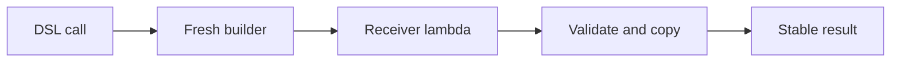

<TLDR>
  <TLDRCell label="what">
    A Kotlin internal DSL is an ordinary Kotlin API. Lambdas with receivers and trailing lambdas let client code configure or construct values using domain vocabulary.
  </TLDRCell>
  <TLDRCell label="trap">
    Type safety covers only the constraints encoded in the API. Without `@DslMarker`, build-time validation, and an isolated result object, code can still select the wrong receiver, accept invalid values, or leak mutable state.
  </TLDRCell>
  <TLDRCell label="fix">
    Design the result type and its valid states first, then expose the smallest useful builder surface. Mark nested receivers consistently, and validate and copy data at the `build()` boundary.
  </TLDRCell>
</TLDR>

## What it is and why it exists

A Kotlin internal <Term id="domain-specific-language">domain-specific language (DSL)</Term> is a set of ordinary Kotlin declarations whose calls look like a small language for one domain. It has no separate parser and doesn't bypass Kotlin syntax. Configuration files, test descriptions, UI trees, and routing tables often use this API shape because callers care about domain structure rather than object assembly order.

"Internal" means the Kotlin compiler still parses and checks the DSL. Unlike an external DSL such as SQL, an internal DSL can use only the lexical forms allowed by its host language, but it can reuse Kotlin types, control flow, variables, and IDE navigation. That tradeoff fits APIs maintained by Kotlin developers and closely integrated with application code.

A DSL removes noise from the call surface; it doesn't replace the domain model. `server { port = 8443 }` is more focused than a series of temporary objects and setters, but it still needs explicit data types, defaults, validation, and ownership rules. If those rules aren't represented in types or at the build boundary, natural-looking syntax won't make the API safe.

You'll see similar forms in Gradle Kotlin DSL, Jetpack Compose, and Ktor. A trailing lambda or a chain of calls isn't automatically a DSL, though. The label is useful when a constrained set of operations forms domain vocabulary and the call structure communicates intent.

A maintainable internal DSL usually has two layers:

- The call surface uses domain names and hides the assembly of temporary state.
- A builder holds incomplete mutable state, while the final result uses explicit, stable types where practical.
- Type signatures restrict which operations are available at each step, and runtime validation handles rules that can't be expressed statically.
- Errors refer to values supplied by the caller instead of exposing builder implementation details.

## How it works

The central type is a <Term id="lambda-with-receiver">lambda with receiver</Term>. The function type `ServerBuilder.() -> Unit` means that the function value has a `ServerBuilder` receiver, takes no additional parameters, and returns `Unit`. Inside the lambda, `this` refers to the builder, so its members can be accessed without writing `this.`.

The receiver isn't an ambient context invented by the compiler. A function value can still be invoked as `block(builder)` or `builder.block()`; conceptually, the receiver acts like an explicit first parameter. Values of ordinary function types and receiver function types can be converted in applicable positions, but stating the receiver type makes a DSL's scope boundary clearer.

Kotlin lets a final function argument appear outside the parentheses, so `server(block = { ... })` becomes `server { ... }`. A build entry point typically creates a fresh builder, runs the lambda, and then calls `build()`. Those stages determine the initial state, the allowed configuration operations, and the final result.

Read one build call in this order:

1. The entry function creates a builder owned by this call.
2. The receiver lambda changes temporary state in that builder.
3. `build()` checks cross-field constraints and copies mutable collections still owned by the builder.
4. The entry function returns the result without exposing the builder.



Extension functions, extension properties, infix functions, and operator overloads can add vocabulary, but none is required. Start with ordinary member functions that are easy to discover, then reserve special syntax for operations whose domain meaning is already clear. An infix form such as `a shouldBe b` can help; an operator that needs a comment to explain it usually needs an ordinary function name instead.

Nested builders introduce several implicit receivers at once. Without a restriction, an inner lambda can call a member on an outer receiver; the code compiles but may produce a structure that violates the hierarchy. An annotation marked with `@DslMarker` puts related receivers in one DSL. Only the closest receiver remains implicitly accessible, and an outer one must be qualified explicitly.

A <Term id="dsl-marker">DSL marker</Term> affects implicit receiver resolution at compile time. It doesn't validate a port range, reject an empty string, or make the build result immutable. Those remain responsibilities of the domain types and build boundary.

## Examples

The four programs below add constraints one at a time. Each is a standalone file compiled with Kotlin 2.4.10 and run on JRE 21; every output block comes from that execution.

### From receiver lambda to stable result

The first builder exposes only the configuration operations the domain needs. The caller can't reach the mutable `features` list, and `build()` returns a copy so later changes to the builder can't affect an existing result.

<Depth level="quick">

```kotlin title="server_config.kt"
data class ServerConfig(
    val host: String,
    val port: Int,
    val features: List<String>,
)

class ServerBuilder {
    var host: String = "127.0.0.1"
    var port: Int = 8080
    private val features = mutableListOf<String>()

    fun feature(name: String) {
        require(name.isNotBlank()) { "feature name must not be blank" }
        features += name
    }

    fun build(): ServerConfig {
        require(host.isNotBlank()) { "host must not be blank" }
        require(port in 1..65535) { "port must be in 1..65535" }
        return ServerConfig(host, port, features.toList())
    }
}

fun server(block: ServerBuilder.() -> Unit): ServerConfig =
    ServerBuilder().apply(block).build()

fun main() {
    val config = server {
        host = "0.0.0.0"
        port = 8443
        feature("metrics")
        feature("health")
    }

    println(config)
}
```

```text
ServerConfig(host=0.0.0.0, port=8443, features=[metrics, health])
```

</Depth>

The final parameter of `server` is a function type, which enables trailing-lambda syntax at the call site. `apply(block)` executes the configuration against the `ServerBuilder` and returns that same instance; `build()` then validates and converts the result.

`List<String>` is a read-only interface, not a promise that every source is deeply immutable. Isolation here comes from `features.toList()`: the builder retains its `MutableList`, and the result gets a new list structure. The elements are immutable strings, so that boundary is sufficient.

### Restricting nested scope with `@DslMarker`

The second program marks the service and database builders as members of the same DSL. Without the marker, `name` inside the database block would reach the outer `ServiceBuilder`; with it, the compiler rejects that unqualified access.

```kotlin title="nested_receivers.kt"
@DslMarker
annotation class ConfigDsl

@ConfigDsl
class ServiceBuilder {
    var name: String = "unnamed"
    private var database: String = "none"

    fun database(block: DatabaseBuilder.() -> Unit) {
        database = DatabaseBuilder().apply(block).build()
    }

    fun build(): String = "$name -> $database"
}

@ConfigDsl
class DatabaseBuilder {
    var url: String = ""
    var poolSize: Int = 4

    fun build(): String = "$url (pool=$poolSize)"
}

fun service(block: ServiceBuilder.() -> Unit): String =
    ServiceBuilder().apply(block).build()

fun main() {
    val config = service {
        name = "catalog"
        database {
            url = "jdbc:postgresql://db/catalog"
            poolSize = 12
            // name = "wrong" would be rejected: the outer receiver is hidden.
            this@service.name = "catalog-api"
        }
    }

    println(config)
}
```

```text
catalog-api -> jdbc:postgresql://db/catalog (pool=12)
```

`this@service` uses the implicit label introduced by the call and selects the outer receiver explicitly, so changing the service name remains possible. The marker removes accidental access rather than forbidding all collaboration across levels. An explicit qualifier keeps that choice visible in review.

Every receiver type in one DSL should carry the same marker. If an intermediate type is left unmarked, entering its lambda may put outer members back into the implicit candidate set and leave a hole in the scope boundary.

### Encoding required order with stage types

Some constraints don't fit a single builder full of nullable properties. An endpoint needs both a path and a handler. Returning a different type from each step prevents callers from obtaining an `Endpoint` before they provide the handler.

```kotlin title="staged_builder.kt"
data class Endpoint(
    val path: String,
    val handler: () -> String,
)

class PathStage {
    fun path(value: String): HandlerStage {
        require(value.startsWith("/")) { "path must start with /" }
        return HandlerStage(value)
    }
}

class HandlerStage(private val path: String) {
    fun handle(block: () -> String): Endpoint = Endpoint(path, block)
}

fun endpoint(): PathStage = PathStage()

fun main() {
    val health = endpoint()
        .path("/health")
        .handle { "ok" }

    println("${health.path} -> ${health.handler()}")
}
```

```text
/health -> ok
```

This is another form of <Term id="type-safe-builder">type-safe builder</Term>. `PathStage` has no `build()`, and `HandlerStage` can't choose another path. The type signatures put the valid order into completion suggestions and compiler errors.

Don't create a stage type for every optional field. This technique works best for a small, stable sequence of required steps. A port range still depends on a runtime value, so `require` is more direct for that rule.

### Selecting an outer receiver explicitly

Members with the same name make receiver resolution visible. The unqualified inner `name` below belongs to `ItemBuilder`; only `this@menu` reaches the outer name.

```kotlin title="receiver_resolution.kt"
@DslMarker
annotation class MenuDsl

@MenuDsl
class MenuBuilder {
    var name: String = "unnamed"

    fun item(block: ItemBuilder.() -> Unit) {
        val item = ItemBuilder().apply(block)
        println("$name/${item.name}")
    }
}

@MenuDsl
class ItemBuilder {
    var name: String = "unnamed"
}

fun menu(block: MenuBuilder.() -> Unit) {
    MenuBuilder().apply(block)
}

fun main() {
    menu {
        name = "admin"
        item {
            name = "users"
            println("inner=$name")
            println("outer=${this@menu.name}")
        }
    }
}
```

```text
inner=users
outer=admin
admin/users
```

An unqualified `name` selects the nearest available implicit receiver. `this@menu` isn't a string lookup or runtime reflection; the label identifies a receiver in source, and the compiler resolves property access against it.

If cross-level access is so frequent that every block contains several `this@...` expressions, labels aren't the real problem. Builder responsibilities probably overlap, and the cross-level operation should become an explicit parameter or method on the inner builder.

## Pitfalls

> [!PITFALL]
> Marking only the top-level builder doesn't restrict an unmarked child builder. Inside the omitted type, members of outer receivers may become visible again.

**Fix:** Inventory the receiver type of every receiver lambda, and give every type in the same DSL one marker. Add a negative compilation test proving that an invalid nesting call fails to compile.

> [!PITFALL]
> Returning a builder-owned `MutableList` directly from `build()` lets completed results keep changing with the builder. Declaring the property as `List` doesn't undo an alias that already escaped.

**Fix:** Copy builder-owned collections at the result boundary, and decide whether mutable elements need copying too. A simpler policy is never to expose or reuse a builder after construction finishes.

> [!PITFALL]
> Representing every required step with nullable properties and reading them with `!!` at the end turns a clear configuration error into a late null-pointer failure. The error also fails to identify the omitted DSL operation.

**Fix:** Use constructor parameters or stage types for a small set of fixed steps. When runtime checking is necessary, use `requireNotNull` with a domain-specific message instead of hiding missing configuration behind a fake default.

> [!PITFALL]
> Infix functions and operators change code shape but don't guarantee intuitive meaning. Infix calls also have their own precedence, so mixing them with arithmetic, casts, or Boolean expressions can make the reading differ from the parse.

**Fix:** Use special syntax only for a symbol or two-operand phrase already accepted by the domain. Parenthesize complex expressions; whenever meaning is ambiguous, return to a named function with parentheses.

> [!PITFALL]
> A type-safe builder checks Kotlin types, but it doesn't escape HTML, parameterize SQL, or validate URLs. Interpolating untrusted strings into the final text can still cause injection or broken output.

**Fix:** Use the domain's encoder or parameter-binding API in the output layer, and model raw text separately from validated values. Test malicious inputs at the security boundary instead of inferring safety from the DSL's appearance.

<Depth level="deep">

## Receiver resolution and DSL markers

Nested class members, extension functions, and lambdas with receivers create a set of available receivers. When the compiler resolves an unqualified call, it considers those receivers and their priority; an inner receiver usually takes precedence over an outer one. Adding a nesting level can therefore change which same-named member is selected even when the call text doesn't change.

A DSL marker groups receiver types into one logical language. When receivers with the same marker are present together, only the closest one can be used implicitly. The outer object still exists and can still be reached with a qualified `this`, so this mechanism controls scope; it isn't an object-lifetime or access-control system.

The marker annotation can go on a receiver class or a shared base class. The official documentation also permits markers on function types when the marker annotation includes `AnnotationTarget.TYPE`. The choice depends on whether the DSL owns the receiver types. A marked function type avoids changing a type supplied by another library.

Negative compilation tests prove this boundary better than valid examples alone. Keep a call that is expected not to compile and assert that the diagnostic appears. An ordinary unit test sees only programs that already passed type checking, so it can't prove that a name disappeared from implicit scope.

## The builder-to-result boundary

Temporary mutability suits a builder because a configuration block collects fields incrementally. The final result has a different job: it leaves the build scope and may be cached, shared, or retained. Using one type for both gives callers methods intended only for assembly and makes the "complete" state impossible to express.

`build()` is where the contract narrows. It can copy mutable collections into independent structures, parse text into domain values, check conditions involving several fields, and return a result with no setters. Each conversion should enforce a stated ownership or validity rule, not mechanically copy every object to look immutable.

Compile-time constraints and runtime validation aren't competitors. Stage types fit "a path must exist before a handler can be supplied"; `require(path.startsWith("/"))` fits the concrete string value. Encoding every possible value range in types bloats an API, while postponing every fixed step to runtime gives up useful completion and compiler errors.

API evolution also has source-compatibility costs. Renaming a builder member, changing an expression around infix precedence, or moving an ordinary parameter onto a receiver can rebind existing DSL calls. Compile a corpus of realistic call sites before release rather than testing only the builder's internal methods.

## Choosing a DSL call surface

An internal DSL's call surface is a small grammar, but every word still maps to a Kotlin declaration. Choose syntax by considering constraints and error locations, not by trying to make calls look like sentences. The shortest spelling costs more to maintain when it hides where a value comes from.

Common forms carry different responsibilities:

| Form | Good fit | Main risk |
| --- | --- | --- |
| Ordinary member function | Named actions and parameters | A longer call, but the most direct resolution |
| Receiver lambda | Hierarchical configuration or trees | Confusing implicit receivers |
| Infix function or operator | A binary relationship with established meaning | Precedence and unfamiliar symbols mislead readers |
| Stage type | A small number of required ordered steps | Type count grows with state combinations |

An ordinary member function is a dependable starting point. It retains parameter names, parentheses, and an explicit receiver, and an IDE can show the full signature easily. Introduce receiver blocks or more specialized syntax only when repeated structure genuinely obstructs reading.

Check these questions in order when designing the public surface:

1. Which invariants must every final result satisfy?
2. Which facts can Kotlin types express, and which require inspecting a concrete value?
3. Who creates, copies, and discards each piece of temporary mutable state?
4. When a call fails, can the diagnostic point to the step the user wrote?

This order leads naturally to the entry function and result type instead of starting with a collection of mutually visible setters. It can also reveal that a DSL isn't needed. If a call has no repeated hierarchy, an ordinary constructor with named arguments may already be clear enough.

### Static and dynamic failure

When finite types can distinguish an invalid state, prefer a compiler rejection. A staged builder omits the next method from an invalid stage, while a sealed type can force exhaustive branches. Callers see these failures before execution, usually near the bad call and inside the IDE.

Rules that depend on concrete strings, files, or network state still need runtime handling. Validate them at the entry point before producing a result, and preserve the original cause. Don't catch every exception and replace it with only "invalid configuration"; callers that need recovery benefit from structured errors instead of parsing a message.

Test both failure classes. Compilation tests retain source that should be rejected, while runtime tests cover boundary values and resource errors. Testing only successful builds leaves the DSL's most important promise, constraining incorrect expressions, without evidence.

</Depth>

<Checkpoint id="kotlin/dsl" />

## Further reading

These links point to source files for Kotlin's official documentation. They avoid timeouts from the documentation site in the local checker while preserving the raw material for review.

The type-safe builders page defines DSL markers; the other pages cover receiver function types, trailing and infix calls, and qualified `this` expressions.

- [Kotlin type-safe builders documentation source](https://raw.githubusercontent.com/JetBrains/kotlin-web-site/master/docs/topics/type-safe-builders.md)
- [Kotlin higher-order functions and lambdas documentation source](https://raw.githubusercontent.com/JetBrains/kotlin-web-site/master/docs/topics/lambdas.md)
- [Kotlin functions and infix calls documentation source](https://raw.githubusercontent.com/JetBrains/kotlin-web-site/master/docs/topics/functions.md)
- [Kotlin `this` expressions and qualified receivers documentation source](https://raw.githubusercontent.com/JetBrains/kotlin-web-site/master/docs/topics/this-expressions.md)
