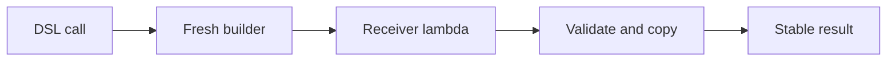

<TLDR>
  <TLDRCell label="what">
    Kotlin 内部 DSL 是普通 Kotlin API；它借助带接收者的 lambda 与尾随 lambda，让调用代码使用领域词汇来配置或构造值。
  </TLDRCell>
  <TLDRCell label="trap">
    类型安全只覆盖 API 编码进类型系统的约束。没有 `@DslMarker`、构建期校验和隔离后的结果对象，代码仍可能选错接收者、接受无效值或泄漏可变状态。
  </TLDRCell>
  <TLDRCell label="fix">
    先设计结果类型和合法状态，再定义最小的构建器表面；为嵌套接收者使用同一个 DSL 标记，并在 `build()` 边界验证和复制数据。
  </TLDRCell>
</TLDR>

## 是什么，为什么存在

Kotlin 内部<Term id="domain-specific-language">领域特定语言（domain-specific language，DSL）</Term>是一组普通 Kotlin 声明，调用时看起来像针对某个领域的小语言。它没有独立解析器，也没有绕过 Kotlin 语法。配置文件、测试描述、界面树和路由表都常用这种 API，因为调用方更关心领域结构，而不是对象创建顺序。

「内部」表示 DSL 仍由 Kotlin 编译器解析和检查。与 SQL 这类外部 DSL 不同，内部 DSL 只能使用宿主语言允许的词法结构，却能直接复用 Kotlin 的类型、控制流、变量和 IDE 导航。这种取舍适合由 Kotlin 开发者维护、需要与应用代码紧密交互的 API。

DSL 解决的是调用表面的噪音，而不是替代领域模型。`server { port = 8443 }` 比一串临时对象和 setter 更集中，但它背后仍需要明确的数据类型、默认值、校验和所有权规则。若这些规则没有进入类型或构建边界，语法再像自然语言也不会自动安全。

你会在 Gradle Kotlin DSL、Jetpack Compose 和 Ktor 等 API 中遇到相似形式。不过，尾随 lambda 或链式调用本身不等于 DSL。只有当一组操作形成受约束的领域词汇，并且读者能从调用结构看出意图时，这个名字才有用。

一个可维护的内部 DSL 通常分成两个层次：

- 调用表面使用领域名称，并隐藏暂时状态的装配过程。
- 构建器保存尚未完成的可变状态，最终结果则尽量使用明确、稳定的类型。
- 类型签名限制当前步骤能够执行的操作，运行期校验补上无法静态表达的规则。
- 错误信息指向调用者给出的值，而不是暴露构建器内部实现。

## 工作原理

核心类型是<Term id="lambda-with-receiver">带接收者的 lambda（lambda with receiver）</Term>。函数类型 `ServerBuilder.() -> Unit` 表示这段函数值以 `ServerBuilder` 为接收者，不接收额外参数，并返回 `Unit`。lambda 内的 `this` 指向构建器，因此可以省略 `this.` 直接访问它的成员。

接收者不是编译器临时发明的全局上下文。函数值仍可以写成 `block(builder)` 或 `builder.block()` 来调用，接收者在概念上相当于一个显式的首参数。普通 lambda 类型与带接收者的函数类型在适用位置还能互相转换，但显式写出接收者类型会让 DSL 的作用域边界更清楚。

Kotlin 允许把最后一个函数参数写到圆括号外，所以 `server(block = { ... })` 可以写成 `server { ... }`。构建入口通常创建一个新构建器，执行 lambda，然后调用 `build()`。这三个阶段分别决定初始状态、允许的配置操作和最终结果。

一次构建调用可以按下面的顺序理解：

1. 入口函数创建一个只属于本次调用的构建器。
2. 接收者 lambda 修改构建器中的暂时状态。
3. `build()` 检查跨字段约束，并复制仍由构建器拥有的可变集合。
4. 入口函数向调用方返回结果，不再暴露构建器。



扩展函数、扩展属性、中缀函数和操作符重载可以补充 DSL 的词汇，但都不是必需条件。先用普通成员函数设计可发现的 API，再为确实符合领域含义的操作选择特殊语法。若 `a shouldBe b` 的含义一眼可见，中缀形式有价值；若操作符需要注释才能解释，普通函数名通常更稳妥。

嵌套构建器会同时引入多个隐式接收者。未加限制时，内层 lambda 可能调用外层接收者的成员，代码能够编译，却构造出不符合层级的结果。用 `@DslMarker` 标注的注解把相关接收者归入同一个 DSL；同一作用域中，最靠近的接收者保留隐式访问资格，外层接收者必须显式限定。

<Term id="dsl-marker">DSL 标记（DSL marker）</Term>只影响编译期的隐式接收者解析。它不会验证端口范围，不会阻止空字符串，也不会把构建结果变成不可变对象。这些仍是领域类型与构建边界的责任。

## 示例

下面四个程序逐步增加约束。每个程序都是独立文件，并已使用 Kotlin 2.4.10 编译器编译，在 JRE 21 上运行；输出块来自实际执行。

### 从接收者 lambda 到稳定结果

第一个构建器只公开领域所需的配置操作。调用方看不到内部的可变 `features`，而 `build()` 返回列表副本，使之后对构建器的修改不会改变既有结果。

<Depth level="quick">

```kotlin title="server_config.kt"
data class ServerConfig(
    val host: String,
    val port: Int,
    val features: List<String>,
)

class ServerBuilder {
    var host: String = "127.0.0.1"
    var port: Int = 8080
    private val features = mutableListOf<String>()

    fun feature(name: String) {
        require(name.isNotBlank()) { "feature name must not be blank" }
        features += name
    }

    fun build(): ServerConfig {
        require(host.isNotBlank()) { "host must not be blank" }
        require(port in 1..65535) { "port must be in 1..65535" }
        return ServerConfig(host, port, features.toList())
    }
}

fun server(block: ServerBuilder.() -> Unit): ServerConfig =
    ServerBuilder().apply(block).build()

fun main() {
    val config = server {
        host = "0.0.0.0"
        port = 8443
        feature("metrics")
        feature("health")
    }

    println(config)
}
```

```text
ServerConfig(host=0.0.0.0, port=8443, features=[metrics, health])
```

</Depth>

`server` 的最后一个参数是函数类型，所以调用处能使用尾随 lambda。`apply(block)` 在 `ServerBuilder` 实例上执行配置并返回同一个实例，随后 `build()` 完成校验和结果转换。

这里的 `List<String>` 是只读接口，不等同于任意来源的深度不可变集合。真正隔离结果的是 `features.toList()`：构建器保留自己的 `MutableList`，结果拿到新的列表结构。列表元素是不可变字符串，因此这个边界已经足够。

### 用 `@DslMarker` 限制嵌套作用域

第二个程序把服务与数据库构建器标记为同一个 DSL。数据库块中的 `name` 本来会命中外层 `ServiceBuilder`；加上标记后，未限定的访问会被编译器拒绝。

```kotlin title="nested_receivers.kt"
@DslMarker
annotation class ConfigDsl

@ConfigDsl
class ServiceBuilder {
    var name: String = "unnamed"
    private var database: String = "none"

    fun database(block: DatabaseBuilder.() -> Unit) {
        database = DatabaseBuilder().apply(block).build()
    }

    fun build(): String = "$name -> $database"
}

@ConfigDsl
class DatabaseBuilder {
    var url: String = ""
    var poolSize: Int = 4

    fun build(): String = "$url (pool=$poolSize)"
}

fun service(block: ServiceBuilder.() -> Unit): String =
    ServiceBuilder().apply(block).build()

fun main() {
    val config = service {
        name = "catalog"
        database {
            url = "jdbc:postgresql://db/catalog"
            poolSize = 12
            // name = "wrong" 会被拒绝：外层接收者已隐藏。
            this@service.name = "catalog-api"
        }
    }

    println(config)
}
```

```text
catalog-api -> jdbc:postgresql://db/catalog (pool=12)
```

`this@service` 使用调用产生的隐式标签，明确选择外层接收者，所以仍可修改服务名称。标记的目标是消除意外访问，而不是彻底禁止层级之间的协作；需要跨层时，显式限定会把这项选择留在审查视线内。

实际 DSL 应让同一语言中的所有接收者类型都带上同一个标记。若漏标了一个中间类型，进入该类型的 lambda 后，外层成员可能再次进入隐式候选集，保护就会出现缺口。

### 用阶段类型表达必填顺序

有些约束不适合放进一个装满可空属性的构建器。创建端点时，路径和处理器都不可缺少；让每一步返回不同类型，调用方就无法在缺少处理器时得到 `Endpoint`。

```kotlin title="staged_builder.kt"
data class Endpoint(
    val path: String,
    val handler: () -> String,
)

class PathStage {
    fun path(value: String): HandlerStage {
        require(value.startsWith("/")) { "path must start with /" }
        return HandlerStage(value)
    }
}

class HandlerStage(private val path: String) {
    fun handle(block: () -> String): Endpoint = Endpoint(path, block)
}

fun endpoint(): PathStage = PathStage()

fun main() {
    val health = endpoint()
        .path("/health")
        .handle { "ok" }

    println("${health.path} -> ${health.handler()}")
}
```

```text
/health -> ok
```

这是<Term id="type-safe-builder">类型安全构建器（type-safe builder）</Term>的另一种形式。`PathStage` 没有 `build()`，`HandlerStage` 也不能重新选择路径；类型签名把合法顺序写进了自动补全和编译错误。

阶段类型不应为每个可选字段制造一个类型。它最适合少量、稳定且顺序明确的必填步骤。端口范围仍取决于运行时数值，所以前一个示例使用 `require` 更直接。

### 显式选择外层接收者

同名成员最容易暴露接收者解析规则。下面的内层 `name` 属于 `ItemBuilder`，外层名称只能通过 `this@menu` 取得。

```kotlin title="receiver_resolution.kt"
@DslMarker
annotation class MenuDsl

@MenuDsl
class MenuBuilder {
    var name: String = "unnamed"

    fun item(block: ItemBuilder.() -> Unit) {
        val item = ItemBuilder().apply(block)
        println("$name/${item.name}")
    }
}

@MenuDsl
class ItemBuilder {
    var name: String = "unnamed"
}

fun menu(block: MenuBuilder.() -> Unit) {
    MenuBuilder().apply(block)
}

fun main() {
    menu {
        name = "admin"
        item {
            name = "users"
            println("inner=$name")
            println("outer=${this@menu.name}")
        }
    }
}
```

```text
inner=users
outer=admin
admin/users
```

未限定的 `name` 总是选择最近的可用隐式接收者。`this@menu` 不是字符串查找，也不是运行期反射；标签在源码中确定具体接收者，编译器据此解析属性访问。

如果跨层访问频繁到每个块都有多个 `this@...`，问题通常不在标签语法。构建器的职责可能重叠，应把跨层操作提升为内层构建器的显式参数或方法。

## 陷阱

> [!PITFALL]
> 只给顶层构建器添加 DSL 标记，不能限制未标记的子构建器。进入漏标类型后，外层接收者的成员可能重新变得可见。

**修复方法：** 盘点每个接收者 lambda 的接收者类型，并让属于同一 DSL 的类型共享一个标记。再添加负向编译测试，证明不合法的嵌套调用确实无法通过编译。

> [!PITFALL]
> 从 `build()` 直接返回构建器持有的 `MutableList`，会让已经构建的结果继续随构建器变化。把属性声明成 `List` 也不能撤销已经泄漏的别名。

**修复方法：** 在结果边界复制由构建器拥有的集合，并判断元素本身是否也可变。更简单的规则是构建完成后不再暴露或复用构建器。

> [!PITFALL]
> 用一批可空属性表示所有必填步骤，只在最后用 `!!` 取值，会把清楚的配置错误变成晚到的空指针异常。错误也很难指出漏掉了哪个 DSL 操作。

**修复方法：** 对少量固定步骤使用构造参数或阶段类型；必须运行期检查时，用 `requireNotNull` 给出领域化消息。不要用虚假的默认值掩盖缺失配置。

> [!PITFALL]
> 中缀函数和操作符会改变代码形状，却不会自动赋予直观语义。中缀调用还有自己的优先级，混入算术、类型转换或布尔表达式后，阅读结果可能与解析结果不同。

**修复方法：** 只有领域已经普遍接受该符号或双操作数短语时才使用特殊语法。复杂表达式加括号；只要存在歧义，就退回带名称和圆括号的普通函数。

> [!PITFALL]
> 类型安全构建器只检查 Kotlin 类型，不会自动转义 HTML、参数化 SQL 或验证 URL。把不可信字符串插入最终文本，仍会造成注入或格式破坏。

**修复方法：** 在输出层使用该领域的编码器或参数绑定 API，并把原始文本与已验证值建模为不同类型。安全边界应有恶意输入测试，不能靠 DSL 的外观推断。

<Depth level="deep">

## 接收者解析与 DSL 标记

嵌套的类成员、扩展函数和带接收者 lambda 会形成一组可用接收者。编译器对未限定调用执行重载解析时，会考虑这些接收者及其优先级；内层接收者通常比外层接收者优先。同名成员因此可能在 DSL 增加一个嵌套层后改变绑定目标，即使调用文本没有变化。

DSL 标记把若干接收者类型归入同一个逻辑语言。当同一标记的多个接收者同时存在时，只有最近的一个能被隐式使用。外层对象仍然存在，也仍可通过限定的 `this` 访问，所以该机制是作用域控制，不是对象生命周期或访问权限系统。

标记注解可以放在接收者的类或共同基类上。官方文档也允许把标记应用到函数类型，但标记注解必须包含相应的 `AnnotationTarget.TYPE`。选择哪种方式取决于 DSL 是否拥有接收者类型；若类型来自外部库，标记函数类型可以避免修改那个类型。

负向编译测试比只运行合法示例更能证明边界。测试应保留一段预期无法编译的调用，并断言诊断出现；普通单元测试只能看到已经通过类型检查的程序，无法证明某个名字已从隐式作用域中消失。

## 构建器与结果的边界

构建器适合暂时可变，因为配置块需要逐步收集字段。最终结果承担的责任不同：它会离开构建作用域，被缓存、共享或长期保存。把两者设成同一个类型会让调用方拿到只为装配准备的方法，也使「已经完成」这一状态无法表达。

`build()` 是收紧契约的地方。它可以把可变集合复制成独立结构，把文本解析成领域值，检查需要多个字段才能判断的条件，并返回不再暴露 setter 的结果。每项转换都应对应一条可说明的所有权或合法性规则，而不是为了显得不可变而机械复制所有对象。

编译期约束与运行期校验并不竞争。阶段类型适合表达「必须先有路径，之后才能提供处理器」；`require(path.startsWith("/"))` 适合检查具体字符串内容。试图把任意值范围都编码成类型，会扩大 API；把固定步骤全部推迟到运行期，又会放弃自动补全与编译器原本能提供的帮助。

API 演进时还要考虑调用代码的源码兼容性。重命名构建器成员、改变中缀函数优先级周围的表达式，或把普通参数改成接收者成员，都可能让既有 DSL 调用重新绑定。发布前应编译一组真实调用样例，而不只测试构建器内部方法。

## 选择 DSL 的调用表面

内部 DSL 的调用表面就是一套小型语法，但每个词仍对应 Kotlin 声明。选择语法时应从约束和错误位置出发，而不是先追求「像句子」。最短的写法若隐藏了值来自哪里，维护成本反而更高。

几种常见形式承担不同责任：

| 形式 | 适合表达 | 主要风险 |
| --- | --- | --- |
| 普通成员函数 | 带名称的动作与参数 | 调用稍长，但解析最直接 |
| 接收者 lambda | 有层级的配置或树结构 | 隐式接收者可能混淆 |
| 中缀函数或操作符 | 已有稳定含义的二元关系 | 优先级与陌生符号会误导读者 |
| 阶段类型 | 少量必须按顺序完成的步骤 | 类型数量随状态组合增长 |

普通成员函数是可靠的起点。它保留参数名、圆括号和明确的接收者，IDE 也容易展示完整签名。只有当重复结构确实妨碍阅读时，才需要逐步引入接收者块或更特殊的语法。

设计公开表面时可以依次检查以下问题：

1. 最终结果必须始终满足哪些不变量？
2. 哪些信息能由 Kotlin 类型表达，哪些只能检查具体值？
3. 每段暂时可变状态由谁创建、复制和丢弃？
4. 调用失败时，诊断能否指向用户写下的那一步？

这个顺序会自然导出入口函数和结果类型，而不是先堆出一组互相可见的 setter。它也能揭示 DSL 是否真的必要：若调用没有重复层级，普通构造函数加命名参数可能已经足够清楚。

### 静态失败与动态失败

当非法状态可以由有限类型区分时，应优先让编译器拒绝它。阶段构建器缺少下一步方法、密封类型让分支必须穷尽，都是调用代码运行前就能看到的失败。这样的诊断通常靠近错误调用，也能进入 IDE 的即时反馈。

依赖具体字符串、文件或网络环境的规则仍要在运行时处理。构建入口应在产生结果之前集中校验，并保留原始失败原因；不要捕获所有异常后只抛出「invalid configuration」。调用方需要恢复时，返回结构化错误会比解析异常消息更稳定。

两类失败都要测试。编译测试保存应当被拒绝的源码，运行测试覆盖边界值和资源错误。只测试成功构建，会让 DSL 最重要的承诺，也就是限制错误表达，完全没有证据支持。

</Depth>

<Checkpoint id="kotlin/dsl" />

## 延伸阅读

以下链接指向 Kotlin 官方文档的源文件；它们避免了文档站在本地检查环境中的超时，并保留可审查的原始内容。

类型安全构建器页面解释 DSL 标记；其余页面分别覆盖接收者函数类型、尾随与中缀调用，以及限定的 `this`。

- [Kotlin 类型安全构建器（官方文档源码）](https://raw.githubusercontent.com/JetBrains/kotlin-web-site/master/docs/topics/type-safe-builders.md)
- [Kotlin 高阶函数与 lambda（官方文档源码）](https://raw.githubusercontent.com/JetBrains/kotlin-web-site/master/docs/topics/lambdas.md)
- [Kotlin 函数与中缀调用（官方文档源码）](https://raw.githubusercontent.com/JetBrains/kotlin-web-site/master/docs/topics/functions.md)
- [Kotlin `this` 表达式与限定接收者（官方文档源码）](https://raw.githubusercontent.com/JetBrains/kotlin-web-site/master/docs/topics/this-expressions.md)
