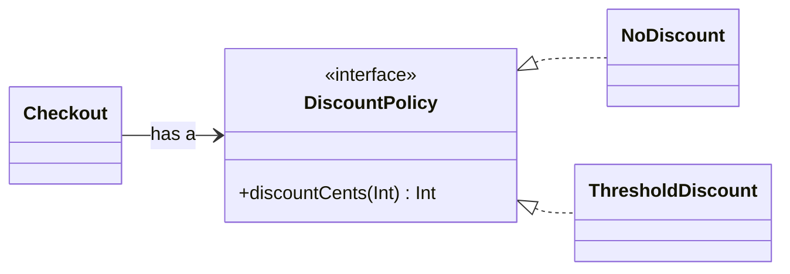

<TLDR>
  <TLDRCell label="what">
    Kotlin's object-oriented features use classes to hold state and behavior, interfaces to define roles, and runtime dispatch to let callers depend on contracts instead of implementations.
  </TLDRCell>
  <TLDRCell label="trap">
    Classes and members are `final` by default. An open member called during base-class construction can also run before derived state is initialized.
  </TLDRCell>
  <TLDRCell label="fix">
    Keep state private and preserve invariants through public operations. Open only deliberate replacement points, and connect objects with interfaces and composition by default.
  </TLDRCell>
</TLDR>

## What it is and why it exists

Object-oriented programming (OOP) puts related state and operations inside objects with explicit boundaries. A class defines what such an object can hold and which operations it permits; an instance is a concrete object created at runtime. Callers work through public members instead of manipulating the object's representation directly.

The main value of this boundary is preserving a <Term id="class-invariant">class invariant</Term>. Inventory can't be negative, for example, and an account's state must agree with its allowed operations. A constructor establishes the invariant, public methods preserve it while changing state, and `private` members stop callers from bypassing those checks.

<Term id="encapsulation">Encapsulation</Term> doesn't mean mechanically adding a getter and setter for every field. If arbitrary code can still assign a negative balance, wrapping the field in accessors hasn't created a useful boundary. A sound object API exposes domain operations such as `reserve()`, not unrestricted access to every internal assignment.

Inheritance describes an "is a" relationship: a derived instance can be used where its base type is expected. An interface describes a role an object performs without requiring it to inherit stored state. <Term id="composition">Composition</Term> describes a "has a" relationship: one object holds another and delegates part of its work to it.

You meet these mechanisms in services, domain entities, Android components, serialization models, and library APIs. Kotlin also has top-level functions, function values, and extensions, so every piece of logic doesn't need a class wrapper. A class earns its cost when state, lifetime, replacement points, or a public contract need an object boundary.

Data classes, sealed hierarchies, property delegation, and extension functions each have their own topic. This page covers only where they meet the ordinary object model rather than repeating their complete rules.

## How it works

### Classes, instances, and construction

A class body can contain properties, functions, initializer blocks, nested declarations, and a companion object. Calling a constructor creates an instance; Kotlin doesn't use `new`. A primary constructor appears in the class header, and a parameter declares a property only when it has `val` or `var`.

Property initializers and `init` blocks run in their source order within the class body. Constructor parameters are available during this initialization, so `require()` is a useful way to reject invalid input. Once initialization finishes, every publicly observable state should satisfy the class invariant.

A `val` property reference can't be reassigned after initialization; a `var` property can. Neither keyword decides whether the referenced object is mutable. When an object should update state only through methods, declare a `var` with `private set` so reads remain public and writes stay controlled.

Secondary constructors use the `constructor` keyword. When a class has a primary constructor, every secondary constructor must eventually delegate to it. Simple alternative creation paths are usually clearer as default parameters or companion-object factories because validation and final initialization remain in one place.

### Visibility sets the boundary

Kotlin declarations are `public` by default. A `private` class member is visible only within that class; `protected` is visible in the class and its derived classes; `internal` is visible to code in the same module. A top-level declaration can also be `private`, meaning file-private, but can't be `protected`.

Visibility should follow need, not implementation convenience. Start with the narrowest scope and widen it for a real caller. In particular, don't expose mutable state just to make tests easier. Test invariants through public behavior or inject collaborators behind interfaces.

`internal` is a Kotlin module boundary, not a security boundary or the equivalent of Java package-private access. JVM interop, reflection, and compiled artifacts have their own visibility details. Secrets and authorization boundaries still need real access controls.

### Inheritance and deliberate openness

An ordinary class can't be inherited by default, and ordinary members can't be overridden by default. Mark a class `open` to permit inheritance and mark only replaceable members `open`. A derived class must write `override`, turning accidental shadowing after an API change into a compilation error.

An abstract class is implicitly open. It can declare constructor state, concrete members, and unimplemented `abstract` members. A concrete derived class must implement every member that remains abstract. A class can inherit one class and implement several interfaces.

An overridden member remains open to another derived class by default. Write `final override` when one layer completes the protocol and later subclasses must not change the behavior. In an extensible API, each open point needs documented preconditions, postconditions, and a rule for whether an override may call `super`.

When a base-typed reference points to a derived instance, a call to an overridable member selects an implementation from the instance's runtime type. This is <Term id="subtype-polymorphism">subtype polymorphism</Term>. A caller can depend on a stable base class or interface while construction selects the concrete behavior.

### Interfaces and composition

An interface can declare abstract functions, functions with default implementations, and properties without backing fields. It can't hold instance fields or run construction logic as a class can. Interfaces work well for named roles such as discount policy, clock, or message sender.

Composition lets an object hold an interface through a constructor parameter. In the relationship below, `Checkout` doesn't inherit a discount implementation; it has a `DiscountPolicy`. Whichever implementation is supplied at runtime receives the dispatch from checkout logic.



Composition usually creates a smaller coupling surface than inheritance. Replacing a policy doesn't require opening `Checkout` internals, and a test can supply a deterministic stand-in. Inheritance still fits a stable semantic hierarchy with a shared template protocol, but it shouldn't exist merely to reuse a few lines.

## Examples

These four programs build controlled state, an interface strategy, an abstract template, and an object factory in that order. Each was compiled with the local Kotlin/JVM 2.4.10 compiler and executed with Java 21; the displayed output comes from that program.

### Preserve an invariant through public operations

`StockItem` makes inventory readable but allows only `receive()` and `reserve()` to change it. Construction and every mutation validate their inputs, and a failed reservation leaves the existing state intact.

<Depth level="quick">

```kotlin title="inventory.kt"
class StockItem(val sku: String, initialUnits: Int) {
    var units: Int = initialUnits
        private set

    init {
        require(sku.isNotBlank()) { "sku must not be blank" }
        require(initialUnits >= 0) { "units must not be negative" }
    }

    fun receive(amount: Int) {
        require(amount > 0) { "amount must be positive" }
        units += amount
    }

    fun reserve(amount: Int): Boolean {
        require(amount > 0) { "amount must be positive" }
        if (amount > units) return false
        units -= amount
        return true
    }
}

fun main() {
    val item = StockItem("KB-42", initialUnits = 5)
    item.receive(3)

    println("Reserved 6: ${item.reserve(6)}")
    println("Reserved 4: ${item.reserve(4)}")
    println("Units left: ${item.units}")
}
```

```text
Reserved 6: true
Reserved 4: false
Units left: 2
```

</Depth>

`units` must change, so it is a `var`; `private set` narrows the update paths to this class. The first reservation succeeds and deducts six units. The second returns `false` because only two remain. A caller can't assign to `item.units` directly.

This example uses integer units, which gives it clear boundaries. If an update must also persist data, write an audit record, or coordinate concurrent work, a higher layer must manage those responsibilities. One in-memory object doesn't make a cross-system operation atomic.

### Replace a strategy through an interface

`Checkout` depends on `DiscountPolicy`, not a concrete discount class. Two objects use the same checkout implementation but dispatch to different policies at runtime.

```kotlin title="discounts.kt"
interface DiscountPolicy {
    fun discountCents(subtotalCents: Int): Int
}

class NoDiscount : DiscountPolicy {
    override fun discountCents(subtotalCents: Int): Int = 0
}

class ThresholdDiscount(
    private val thresholdCents: Int,
    private val percent: Int,
) : DiscountPolicy {
    init {
        require(thresholdCents >= 0)
        require(percent in 0..100)
    }

    override fun discountCents(subtotalCents: Int): Int =
        if (subtotalCents >= thresholdCents) subtotalCents * percent / 100 else 0
}

class Checkout(private val policy: DiscountPolicy) {
    fun totalCents(subtotalCents: Int): Int {
        require(subtotalCents >= 0)
        return subtotalCents - policy.discountCents(subtotalCents)
    }
}

fun main() {
    val regular = Checkout(NoDiscount())
    val loyalty = Checkout(ThresholdDiscount(thresholdCents = 10_000, percent = 10))

    println("Regular: ${regular.totalCents(12_000)}")
    println("Loyalty: ${loyalty.totalCents(12_000)}")
    println("Small order: ${loyalty.totalCents(5_000)}")
}
```

```text
Regular: 12000
Loyalty: 10800
Small order: 5000
```

The static type of `policy` is the interface; the actual object selects the override. `Checkout` doesn't need a `when` that inspects policy types. A new policy only has to meet the interface contract and doesn't require a change to the checkout class.

The example uses integer cents and an integer percentage, so division discards any fraction smaller than one cent. That's an observable rounding rule, not a universal answer for monetary code. Production code should make its money type and rounding policy explicit.

### Fix a template with an abstract class

`Fulfillment.ship()` fixes the order of validation, dispatch, and recording. Derived classes supply only the middle step. Because `ship()` isn't marked `open`, a subclass can't bypass the template by replacing the whole operation.

```kotlin title="fulfillment.kt"
abstract class Fulfillment(private val orderId: String) {
    fun ship() {
        println("Validate $orderId")
        dispatch()
        println("Recorded $orderId")
    }

    protected abstract fun dispatch()
}

class Courier(orderId: String) : Fulfillment(orderId) {
    override fun dispatch() {
        println("Hand to courier")
    }
}

class StorePickup(orderId: String) : Fulfillment(orderId) {
    override fun dispatch() {
        println("Move to pickup desk")
    }
}

fun main() {
    val flows: List<Fulfillment> = listOf(Courier("A-17"), StorePickup("B-09"))
    flows.forEach(Fulfillment::ship)
}
```

```text
Validate A-17
Hand to courier
Recorded A-17
Validate B-09
Move to pickup desk
Recorded B-09
```

The list knows only `Fulfillment`, but `dispatch()` still follows each element's runtime type. The abstract method is the deliberate open point, while the public template stays final. This shape fits when the step order genuinely belongs to a shared protocol.

If flows also need independent choices for validation, recording, retries, and other dimensions, the number of subclass combinations grows quickly. Splitting those behaviors into small injected interfaces is usually easier to maintain than extending the inheritance tree.

### Control construction with a companion object

The private constructor ensures that `TicketNumber` is created only through `parse()`. Its companion object provides a factory associated with the class name, while `TicketLabels` is a named object declaration with no mutable state.

```kotlin title="factories.kt"
class TicketNumber private constructor(val value: String) {
    companion object {
        private val pattern = Regex("T-[0-9]{4}")

        fun parse(raw: String): TicketNumber? {
            val normalized = raw.trim().uppercase()
            return normalized.takeIf(pattern::matches)?.let(::TicketNumber)
        }
    }

    override fun toString(): String = value
}

object TicketLabels {
    fun format(number: TicketNumber, queue: String): String = "$number [$queue]"
}

fun main() {
    val number = TicketNumber.parse(" t-0042 ")
    val invalid = TicketNumber.parse("42")

    println(number)
    println(invalid)
    println(TicketLabels.format(requireNotNull(number), "billing"))
}
```

```text
T-0042
null
T-0042 [billing]
```

A companion object is a real object, not a `static` keyword added to the language. It can implement an interface and have members of its own. The private constructor and nullable factory keep raw-string parsing failure in the return type.

A named `object` has one instance in the program, which suits stateless utilities or a coordinator with genuinely singular identity. Putting mutable request state in an `object` makes every caller share it and lets test order and concurrent execution affect each other.

## Pitfalls

### Letting a public setter bypass invariants

> [!PITFALL]
> A domain property declared as a public `var` lets callers skip validation and related state updates. The object may have methods, but it doesn't control its own state.

**Fix:** use a private property or `private set`, then expose methods named after domain actions. Test successful, rejected, and boundary inputs, and confirm a failed operation doesn't leave a partial mutation.

### Forgetting the `final` defaults

> [!PITFALL]
> Code ported from Java often assumes classes and methods are naturally overridable, then fails to compile at a test double or derived implementation. Making every declaration `open` instead expands an extension surface that has no designed contract.

**Fix:** decide on the real replacement boundary first. Use an interface for a role with several implementations. Open a class only for shared state and a template protocol, mark only documented members `open`, and use `final override` to close further replacement.

### Calling open members during base construction

> [!PITFALL]
> When a base property initializer or `init` block calls an open member, runtime dispatch can enter a derived override before derived properties finish initializing. The result may be a default value, `null`, an exception, or behavior that depends on declaration order.

**Fix:** call only private or final logic during construction. Work that needs derived data should start explicitly after full construction or receive already validated values as base-constructor arguments.

### Mistaking code reuse for inheritance

> [!PITFALL]
> Making two classes parent and child merely because they share logging or retry code also gives the child unwanted state, lifetime, and open members. A later base-class change then puts every subclass in the regression scope.

**Fix:** test substitutability first: would the derived object satisfy the same contract at every base-type call site? Extract and compose a small collaborator when you only need a capability. Reserve inheritance for a stable "is a" relationship.

### Treating a singleton as an automatically safe global

> [!PITFALL]
> `object` guarantees one instance. It doesn't make mutable operations atomic or reset state between tests. A cache, current user, or counter stored there can leak across requests and race under concurrency.

**Fix:** keep named objects stateless by default. When state truly must be shared, define its owner, lifetime, and synchronization policy, and let tests create isolated instances. A process singleton shouldn't quietly own request-scoped work.

### Confusing identity and equality

> [!PITFALL]
> Unless an ordinary class overrides `equals()`, `==` eventually uses the implementation inherited from `Any`, so two separate instances with matching fields may still be unequal. `===` checks only whether two references point to one instance.

**Fix:** first decide whether the object compares by identity or value. A data class usually states value semantics clearly. If you write `equals()`, preserve the `hashCode()` contract and test hash collections too. Use `===` only when you mean <Term id="object-identity">object identity</Term>.

<Depth level="deep">

## Construction order and open members

When a derived instance is created, its base-class part initializes before the derived class. The derived class's own property initializers haven't finished while the base constructor, property initializers, and `init` blocks run. Only after construction should outside code receive the instance as a complete object.

Runtime dispatch doesn't pause because construction is incomplete. If the base construction path calls an open property getter or function, the derived override can still execute. When that override reads a derived property, it may observe a JVM default rather than the value its source initializer eventually assigns.

Ordinary tests can miss this bug because a simple subclass may not read any extra state. When reviewing a base class, treat property initializer expressions, `init` blocks, and secondary constructors as construction paths and search the members they call for open dispatch. Safe initialization logic is private or final.

When initialization work needs complete derived state, let the caller invoke an explicit method after construction or use a factory that prepares inputs before creating the instance. Don't cover the ordering problem with `lateinit`; it only moves the failure to a later `UninitializedPropertyAccessException`.

## Interface defaults and conflicts

An interface default implementation lets several implementations share stateless behavior. An interface property can provide a getter but has no backing field, so the interface itself can't hold per-instance mutable data. The implementation class or a composed state owner must supply any state.

If two implemented interfaces provide default functions with the same signature, the compiler doesn't guess which one wins. The class must override the conflicting member explicitly and can call a selected implementation with `super<InterfaceName>.member()`. That decision stays in source, and adding an interface doesn't silently change behavior.

A default implementation should rely only on the interface contract. If it has to downcast its receiver or reach into hidden state of one concrete class, the interface is no longer an independent role. Move that logic to the concrete class or an explicit collaborator to avoid brittle coupling.

An interface isn't useful merely because every class can have one. It pays for itself when there are several implementations, a clear test boundary, a platform adapter, or a stable caller contract. An accidental group of methods inside one implementation doesn't need a preemptive abstraction.

## Object declarations and companion objects

An `object` declaration defines a type and its single instance together, and callers access it by its declaration name. A `companion object` lives inside a class, and its members can be called through the outer class name. Both are objects: they can implement interfaces and be passed as values.

A companion is a good home for factories tied to a type's construction rules and constants that genuinely belong to the type. It can't directly access properties of an outer class instance because it isn't part of each instance. Behavior that needs instance state remains an instance member or receives an instance as an argument.

In multiplatform code, don't describe a companion as JVM `static`. Java interop may use `@JvmStatic` or `@JvmField` to change the generated call shape, but that is a JVM boundary and doesn't alter Kotlin's source object model. Those annotations don't belong in code that isn't teaching the interop requirement.

A singleton's unique identity also lengthens the lifetime of its state. When test replaceability, request isolation, or several configured instances matter, an ordinary class instantiated at the application entry point is clearer. One instance should be an architectural choice, not a shortcut around construction.

## Identity, equality, and copying

Every ordinary instance has <Term id="object-identity">object identity</Term>. `a === b` is `true` only when both references point to the same instance; `a !== b` is its opposite. Identity comparison belongs in algorithms that genuinely depend on instances, such as a sentinel object or graph traversal by node identity.

`a == b` makes a null-safe call to `equals()`. The implementation an ordinary class inherits from `Any` distinguishes instances by identity. If a class overrides it for value equality, equal objects must also return equal hash codes, or keys in `HashSet` and `HashMap` can't be found reliably.

A data class can generate equality and copying members from primary-constructor properties, but `copy()` is still shallow and may share nested mutable objects. Its constructor boundary, array properties, and mutable-hash-key traps are covered in the dedicated data-classes topic.

Equality is a public contract. Adding a property to equality, removing one, or making a hashed property mutable changes collection and cache behavior. Run equality, hashing, copying, and collection lookup tests together when the model changes.

</Depth>

<Checkpoint id="kotlin/oop" />

## Further reading

- [Kotlin documentation source: Classes](https://raw.githubusercontent.com/JetBrains/kotlin-web-site/master/docs/topics/classes.md)
- [Kotlin documentation source: Inheritance](https://raw.githubusercontent.com/JetBrains/kotlin-web-site/master/docs/topics/inheritance.md)
- [Kotlin documentation source: Interfaces](https://raw.githubusercontent.com/JetBrains/kotlin-web-site/master/docs/topics/interfaces.md)
- [Kotlin documentation source: Visibility modifiers](https://raw.githubusercontent.com/JetBrains/kotlin-web-site/master/docs/topics/visibility-modifiers.md)
- [Kotlin documentation source: Object declarations](https://raw.githubusercontent.com/JetBrains/kotlin-web-site/master/docs/topics/object-declarations.md)
