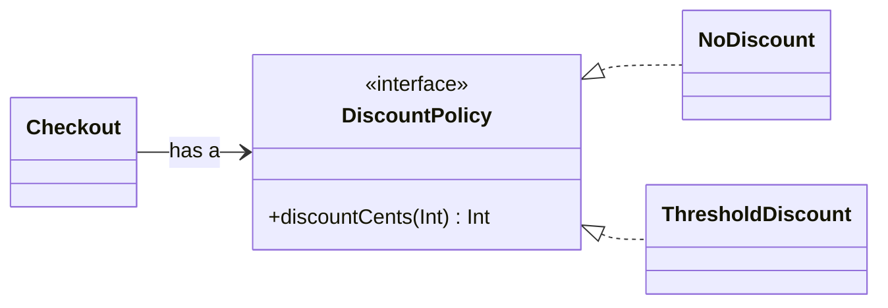

<TLDR>
  <TLDRCell label="what">
    Kotlin 的面向对象编程用类保存状态与行为，用接口表达角色，并通过运行时分派让调用方依赖契约而不是具体实现。
  </TLDRCell>
  <TLDRCell label="trap">
    类和成员默认是 `final`；开放成员若在基类构造期间被调用，还可能在派生状态初始化前执行。
  </TLDRCell>
  <TLDRCell label="fix">
    保持状态私有，在公开操作中维护不变量；只开放确实需要替换的行为，并优先用接口加组合连接对象。
  </TLDRCell>
</TLDR>

## 是什么，为什么存在

面向对象编程（object-oriented programming，OOP）把相关状态和操作放进具有明确边界的对象。类定义这种对象能保存什么、允许调用什么；实例则是运行时创建的具体对象。调用方通过公开成员协作，不必直接操作对象内部表示。

这套边界的主要价值是维护<Term id="class-invariant">类不变量（class invariant）</Term>。例如，库存不能为负数，账户状态必须与允许的操作一致。构造函数建立不变量，公开方法在改变状态时继续维护它，`private` 成员阻止调用方绕过这些检查。

<Term id="encapsulation">封装（encapsulation）</Term>并不等于给每个字段机械添加 getter 和 setter。若任意代码仍能把余额写成负数，对字段换一层访问器没有形成有用边界。好的对象接口公开领域操作，例如 `reserve()`，而不是公开所有内部赋值能力。

继承描述「是一个」关系：派生类可以在需要基类的地方使用。接口描述对象承担的角色，而不规定它必须继承哪份状态。<Term id="composition">组合（composition）</Term>描述「有一个」关系：对象持有另一个对象，并把一部分工作交给它。

你会在服务、领域实体、Android 组件、序列化模型和库 API 中遇到这些机制。Kotlin 也支持顶层函数、函数值和扩展，因此不必把每段逻辑都包进类。只有当状态、生命周期、替换点或公开契约确实需要一个对象边界时，类才承担成本。

数据类、密封层级、属性委托与扩展函数各有独立主题。本页只说明它们与普通对象模型相交的边界，不重复其完整规则。

## 工作原理

### 类、实例与构造

类体可以包含属性、函数、初始化块、嵌套声明和伴生对象。调用构造函数会创建实例；Kotlin 不使用 `new`。主构造函数写在类头中，参数只有带 `val` 或 `var` 时才同时声明属性。

属性初始化器与 `init` 块按照它们在类体中的源码顺序执行。构造参数在这段初始化期间可用，因此适合用 `require()` 拒绝不合法输入。初始化完成后，所有公开可观察状态都应满足类不变量。

`val` 属性的引用在初始化后不能重新赋值，`var` 属性可以。两者都不决定所引用对象是否可变。若对象只允许通过方法更新状态，可以把属性声明为 `var` 并给 setter 加 `private set`，让读取公开、写入受控。

次构造函数使用 `constructor` 声明。类有主构造函数时，每个次构造函数最终都必须委托给主构造函数；简单的替代创建方式通常更适合用默认参数或伴生对象工厂表达。这样能把验证和最终初始化路径集中在一个位置。

### 可见性划定边界

Kotlin 默认使用 `public`。类成员的 `private` 只允许该类访问；`protected` 允许该类及其派生类访问；`internal` 允许同一模块中的代码访问。顶层声明也能使用 `private`，此时只在当前文件内可见，但顶层声明不能使用 `protected`。

可见性应跟随需要，而不是跟随实现方便。先使用最窄范围，再为真实调用方扩大。尤其不要为了测试而把内部可变状态改成公开状态；测试应通过公开行为观察不变量，或把协作者作为接口注入。

`internal` 是 Kotlin 模块边界，不是安全边界，也不等同于 Java 的包私有。JVM 互操作、反射和编译产物都有自己的可见性细节。若数据属于秘密或权限边界，仍需用真正的访问控制保护。

### 继承与显式开放

普通类默认不能被继承，普通成员默认也不能被覆盖。允许继承时给类加 `open`；允许某个成员被覆盖时再给成员加 `open`。派生类必须写 `override`，这能让 API 变化导致的意外遮蔽成为编译错误。

抽象类隐含开放，可以声明构造状态、具体成员和没有实现的 `abstract` 成员。具体派生类必须实现仍然抽象的成员。一个类只能继承一个类，但可以实现多个接口。

覆盖后的成员默认仍可被下一层派生类覆盖。若某一层已经完成协议，不希望继续改变行为，应写 `final override`。在可扩展 API 中，开放点需要文档说明前置条件、后置条件，以及覆盖实现能否调用 `super`。

当基类类型的引用指向派生实例时，对可覆盖成员的调用会根据实例的运行时类型选择实现。这是<Term id="subtype-polymorphism">子类型多态（subtype polymorphism）</Term>。调用方只依赖稳定基类或接口，具体实现便可以在构造时替换。

### 接口与组合

接口可以声明抽象函数、带默认实现的函数，以及没有后备字段的属性。它不能像类一样持有实例字段或执行构造逻辑。接口适合命名一个角色，例如折扣策略、时钟或消息发送器。

组合让一个对象通过构造参数持有接口。下面的关系中，`Checkout` 不继承任何折扣实现；它只有一个 `DiscountPolicy`。运行时传入哪个实现，结算逻辑就分派到哪个实现。



组合通常比继承给出更小的耦合面。替换策略不需要打开 `Checkout` 的内部实现，测试也能传入确定性的替身。继承仍适合稳定的语义层级和共享的模板协议，但不应只为了复用几行代码而建立父子关系。

## 示例

下面四个程序依次建立受控状态、接口策略、抽象模板和对象工厂。它们都由本地 Kotlin/JVM 2.4.10 编译器编译，并使用 Java 21 实际执行；输出来自对应程序。

### 用公开操作维护不变量

`StockItem` 允许读取库存，却只允许 `receive()` 和 `reserve()` 修改它。构造与每次修改都验证输入，失败的预留不会破坏原状态。

<Depth level="quick">

```kotlin title="inventory.kt"
class StockItem(val sku: String, initialUnits: Int) {
    var units: Int = initialUnits
        private set

    init {
        require(sku.isNotBlank()) { "sku must not be blank" }
        require(initialUnits >= 0) { "units must not be negative" }
    }

    fun receive(amount: Int) {
        require(amount > 0) { "amount must be positive" }
        units += amount
    }

    fun reserve(amount: Int): Boolean {
        require(amount > 0) { "amount must be positive" }
        if (amount > units) return false
        units -= amount
        return true
    }
}

fun main() {
    val item = StockItem("KB-42", initialUnits = 5)
    item.receive(3)

    println("Reserved 6: ${item.reserve(6)}")
    println("Reserved 4: ${item.reserve(4)}")
    println("Units left: ${item.units}")
}
```

```text
Reserved 6: true
Reserved 4: false
Units left: 2
```

</Depth>

`units` 必须变化，所以它是 `var`；`private set` 则把变化路径缩小到类内部。第一次预留成功并扣除 6 件，第二次因为只剩 2 件而返回 `false`。调用方不能直接写入 `item.units`。

这里使用整数件数，边界条件很明确。若状态修改还需要持久化、审计或并发控制，这些职责应在更高层协调；单个内存对象不会自动让跨系统操作成为原子操作。

### 通过接口替换策略

`Checkout` 依赖 `DiscountPolicy`，不依赖具体折扣类。两个对象使用同一结算实现，但在运行时调用不同策略。

```kotlin title="discounts.kt"
interface DiscountPolicy {
    fun discountCents(subtotalCents: Int): Int
}

class NoDiscount : DiscountPolicy {
    override fun discountCents(subtotalCents: Int): Int = 0
}

class ThresholdDiscount(
    private val thresholdCents: Int,
    private val percent: Int,
) : DiscountPolicy {
    init {
        require(thresholdCents >= 0)
        require(percent in 0..100)
    }

    override fun discountCents(subtotalCents: Int): Int =
        if (subtotalCents >= thresholdCents) subtotalCents * percent / 100 else 0
}

class Checkout(private val policy: DiscountPolicy) {
    fun totalCents(subtotalCents: Int): Int {
        require(subtotalCents >= 0)
        return subtotalCents - policy.discountCents(subtotalCents)
    }
}

fun main() {
    val regular = Checkout(NoDiscount())
    val loyalty = Checkout(ThresholdDiscount(thresholdCents = 10_000, percent = 10))

    println("Regular: ${regular.totalCents(12_000)}")
    println("Loyalty: ${loyalty.totalCents(12_000)}")
    println("Small order: ${loyalty.totalCents(5_000)}")
}
```

```text
Regular: 12000
Loyalty: 10800
Small order: 5000
```

变量 `policy` 的静态类型是接口，实际对象决定覆盖实现。`Checkout` 无需用 `when` 检查策略类型。新增策略只需履行接口契约，不必修改结算类。

示例用整数分和整数百分比，因此除法会截去不足一分的部分。这是可观察的舍入规则，不是所有金额场景的默认答案。生产代码应让金额类型和舍入策略成为明确契约。

### 用抽象类固定模板

`Fulfillment.ship()` 固定验证、分派和记录的顺序，派生类只提供中间步骤。`ship()` 没有标记为 `open`，所以派生类不能绕过模板改写整个流程。

```kotlin title="fulfillment.kt"
abstract class Fulfillment(private val orderId: String) {
    fun ship() {
        println("Validate $orderId")
        dispatch()
        println("Recorded $orderId")
    }

    protected abstract fun dispatch()
}

class Courier(orderId: String) : Fulfillment(orderId) {
    override fun dispatch() {
        println("Hand to courier")
    }
}

class StorePickup(orderId: String) : Fulfillment(orderId) {
    override fun dispatch() {
        println("Move to pickup desk")
    }
}

fun main() {
    val flows: List<Fulfillment> = listOf(Courier("A-17"), StorePickup("B-09"))
    flows.forEach(Fulfillment::ship)
}
```

```text
Validate A-17
Hand to courier
Recorded A-17
Validate B-09
Move to pickup desk
Recorded B-09
```

列表只知道 `Fulfillment`，`dispatch()` 仍按每个元素的运行时类型执行。抽象方法是有意留下的开放点，公开模板则保持最终状态。这个结构适合步骤顺序确实属于共同协议的情况。

如果不同流程还需要替换验证、记录和重试等多个维度，子类组合数会迅速增加。此时把这些行为拆成几个小接口并注入，往往比继续增加继承层级更容易维护。

### 用伴生对象控制创建

私有构造函数确保 `TicketNumber` 只能通过 `parse()` 创建。伴生对象提供与类名关联的工厂，`TicketLabels` 则是没有可变状态的命名对象声明。

```kotlin title="factories.kt"
class TicketNumber private constructor(val value: String) {
    companion object {
        private val pattern = Regex("T-[0-9]{4}")

        fun parse(raw: String): TicketNumber? {
            val normalized = raw.trim().uppercase()
            return normalized.takeIf(pattern::matches)?.let(::TicketNumber)
        }
    }

    override fun toString(): String = value
}

object TicketLabels {
    fun format(number: TicketNumber, queue: String): String = "$number [$queue]"
}

fun main() {
    val number = TicketNumber.parse(" t-0042 ")
    val invalid = TicketNumber.parse("42")

    println(number)
    println(invalid)
    println(TicketLabels.format(requireNotNull(number), "billing"))
}
```

```text
T-0042
null
T-0042 [billing]
```

伴生对象是一个真实对象，不是把语言改成拥有 `static` 关键字。它可以实现接口，也可以有自己的成员。私有构造函数与可空工厂共同把原始字符串解析失败保留在返回类型中。

命名 `object` 在程序中只有一个实例，因此适合无状态工具或确实只有一个身份的协调者。把可变请求状态塞进 `object` 会让所有调用方共享它，也会让测试顺序和并发行为互相影响。

## 陷阱

### 用公开 setter 绕过不变量

> [!PITFALL]
> 把领域状态声明为公开 `var`，会允许调用方跳过验证和相关状态更新。对象看起来有方法，实际却没有控制自身状态。

**修复：** 使用私有属性或 `private set`，并公开以业务动作命名的方法。分别测试成功、拒绝和边界输入，确认失败操作不会留下部分修改。

### 忘记默认 `final`

> [!PITFALL]
> 从 Java 改写的代码常假定类与方法天然可覆盖，于是在测试替身或派生实现处才遇到编译错误。相反，把所有声明都改成 `open` 又会扩大未经设计的扩展面。

**修复：** 先决定真正的替换边界。跨实现的角色用接口，需要共享状态和模板协议时才开放类，并只给经过说明的成员加 `open`；封闭下一层覆盖时使用 `final override`。

### 在基类构造期间调用开放成员

> [!PITFALL]
> 基类属性初始化器或 `init` 块调用开放成员时，运行时分派可能进入派生覆盖；此时派生类属性还没有完成初始化。结果可能是默认值、`null`、异常或依赖声明顺序的行为。

**修复：** 构造期间只调用基类的私有或最终逻辑。需要派生数据参与的工作应在完整构造后显式启动，或者作为已经验证的构造参数传给基类。

### 把代码复用误当成继承关系

> [!PITFALL]
> 只因两个类共享几行日志或重试代码就建立父子关系，会让派生类同时继承不需要的状态、生命周期与开放成员。后续修改基类时，所有子类都进入回归范围。

**修复：** 先检验替换语义：派生对象是否在所有基类调用点都满足同一契约。仅需复用能力时，提取小型协作者并组合；只有稳定的「是一个」关系才使用继承。

### 把单例当成自动安全的全局容器

> [!PITFALL]
> `object` 保证一个实例，不保证其中的可变操作是原子的，也不会在测试之间自动重置。把缓存、当前用户或计数器放进去，容易产生跨请求泄漏和竞态。

**修复：** 优先让命名对象保持无状态。确需共享状态时，明确所有者、生命周期和同步策略，并让测试能够创建隔离实例；进程级单例不应偷偷承担请求级职责。

### 混淆标识与相等性

> [!PITFALL]
> 普通类若不覆盖 `equals()`，`==` 最终沿用 `Any` 的实现，两个字段相同的独立实例仍可能不相等。`===` 则只检查两个引用是否指向同一实例。

**修复：** 先决定对象按身份还是按值比较。值对象通常交给数据类表达；手写 `equals()` 时必须同时保持 `hashCode()` 契约，并用哈希集合测试。需要检查<Term id="object-identity">对象标识（object identity）</Term>时才使用 `===`。

<Depth level="deep">

## 构造顺序与开放成员

创建派生实例时，基类部分先于派生类初始化。基类构造函数、属性初始化器和 `init` 块执行期间，派生类自己的属性初始化器还没有完成。构造完成后，实例才应作为完整对象交给外部代码。

运行时分派不会因为构造尚未完成而暂停。若基类构造路径调用开放属性 getter 或开放函数，派生覆盖仍可能执行。覆盖实现读取派生属性时，看到的可能是 JVM 默认值，而不是源码初始化器最终赋予的值。

这类错误难以靠普通测试发现，因为简单派生类可能恰好不读取额外状态。审查基类时，应把属性初始化表达式、`init` 块和次构造函数都视为构造路径，并搜索它们调用的开放成员。安全的初始化逻辑应是私有或最终的。

若初始化工作依赖完整派生状态，可以让调用方在构造后调用明确方法，或使用工厂先准备输入再创建对象。不要用 `lateinit` 掩盖顺序问题；它只会把错误变成更晚的 `UninitializedPropertyAccessException`。

## 接口默认实现与冲突

接口默认实现允许多个实现共享无状态行为。接口属性可以提供 getter，但没有后备字段，因此不能在接口自身保存每个实例的可变值。需要状态时，由实现类提供属性或组合一个状态所有者。

一个类实现的两个接口若提供同签名默认函数，编译器不会猜测采用哪个。类必须显式覆盖冲突成员，并可用 `super<InterfaceName>.member()` 调用指定接口实现。这个决定会留在源码中，新增接口也不会悄悄改变行为。

默认实现应只依赖接口契约本身。若实现需要向下转换接收者、读取某个具体类的隐藏状态，接口已经不再是独立角色。把这种逻辑移到具体类或显式协作者，通常能避免脆弱耦合。

接口不是为了给每个类都加一层名称。只有存在多个实现、明确的测试边界、平台适配或稳定的调用方契约时，它才提供实际价值。单一实现内部的偶然方法集合不必提前抽象。

## 对象声明与伴生对象

`object` 声明同时定义类型和该类型的单个实例，调用方直接通过声明名称访问它。`companion object` 位于类内部，成员可通过外层类名调用。两者都是对象，可以实现接口，也可以作为值传递。

伴生对象适合放置必须与类型创建规则绑定的工厂，以及真正属于类型的常量。它不能直接访问某个外层类实例的属性，因为它不是每个实例的一部分。需要实例状态的行为仍应是实例成员或接收实例参数。

在多平台代码中，不要把伴生对象简单描述成 JVM `static`。Java 互操作可能需要 `@JvmStatic` 或 `@JvmField` 改变生成的调用形式，但这属于 JVM 边界，不改变 Kotlin 源码中的对象模型。除非文章专门讨论互操作，否则不应机械添加这些注解。

单例的唯一身份也会扩大状态寿命。测试可替换性、请求隔离或多个配置实例很重要时，普通类加一个在应用入口创建的实例更清楚。唯一实例应是架构决定，不是减少构造调用的快捷方式。

## 标识、相等性与复制

每个普通实例都有<Term id="object-identity">对象标识</Term>。`a === b` 只在两个引用指向同一实例时为 `true`，`a !== b` 是其反面。标识比较适合缓存哨兵、图遍历中的节点身份等确实依赖实例的算法。

`a == b` 会进行空安全的 `equals()` 调用。普通类从 `Any` 继承的默认实现按身份区分实例；若覆盖为值相等，就必须保证相等对象返回相同哈希码。否则 `HashSet` 和 `HashMap` 会出现无法可靠查找的键。

数据类能根据主构造函数属性生成相等性与复制成员，但 `copy()` 仍是浅拷贝，嵌套可变对象可能共享。该机制的构造函数边界、数组属性和可变哈希键陷阱由数据类主题单独说明。

相等性属于公开契约。把新属性加入比较、从比较中删除属性，或让参与哈希的属性可变，都会改变集合与缓存行为。模型变更时，应同时运行相等性、哈希、复制和集合查找测试。

</Depth>

<Checkpoint id="kotlin/oop" />

## 延伸阅读

- [Kotlin documentation source: Classes](https://raw.githubusercontent.com/JetBrains/kotlin-web-site/master/docs/topics/classes.md)
- [Kotlin documentation source: Inheritance](https://raw.githubusercontent.com/JetBrains/kotlin-web-site/master/docs/topics/inheritance.md)
- [Kotlin documentation source: Interfaces](https://raw.githubusercontent.com/JetBrains/kotlin-web-site/master/docs/topics/interfaces.md)
- [Kotlin documentation source: Visibility modifiers](https://raw.githubusercontent.com/JetBrains/kotlin-web-site/master/docs/topics/visibility-modifiers.md)
- [Kotlin documentation source: Object declarations](https://raw.githubusercontent.com/JetBrains/kotlin-web-site/master/docs/topics/object-declarations.md)
