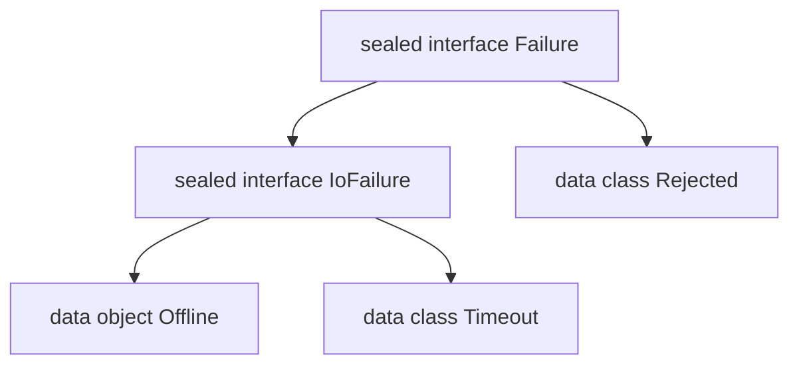

<TLDR>
  <TLDRCell label="what">
    A sealed class or <Term id="sealed-interface">sealed interface</Term> restricts where direct subtypes may be declared, giving the compiler a boundary for the hierarchy.
  </TLDRCell>
  <TLDRCell label="trap">
    A broad `else` swallows new cases, while a non-sealed, open direct subclass can still be extended elsewhere. Sealing doesn't list every descendant individually.
  </TLDRCell>
  <TLDRCell label="fix">
    List every branch over a closed domain and omit `else`. Check whether each direct subtype is actually `final`, `sealed`, or `open`.
  </TLDRCell>
</TLDR>

## What it is and why it exists

A sealed type represents a controlled inheritance hierarchy. The compiler knows which named types may inherit from it directly, so it can decide whether a `when` covers every possible case. After you add a case that needs distinct handling, old exhaustive decisions stop compiling and expose omissions before release.

This constraint fits domains with a finite set of forms whose payloads differ. A load operation, for example, can be in progress, carry retrieved data, or carry a failure reason. An enum can list fixed instances but can't give each entry a different property shape, while a regular interface admits implementations the compiler doesn't know about.

Sealed types commonly represent result types, UI states, protocol messages, commands, and abstract syntax trees. They aren't error-handling frameworks and don't validate state transitions automatically. They provide the boundary of a type set; constructors and handling functions still express the business rules.

A sealed class is abstract. It can have constructors, hold instance state, and provide protected members. A class can inherit from only one class, so choosing a sealed class occupies that inheritance position. Use one when every variant needs shared state or implementation.

A <Term id="sealed-interface">sealed interface</Term> has no constructor state, but a class can implement several interfaces. It usually fits when one variant belongs to two controlled classifications or when you only need a behavioral contract. Both forms support exhaustive `when`; state ownership and composition are the main differences.

A sealed hierarchy is an intentionally closed extension point. If third-party modules, local plugins, or application features need to add implementations freely, use a regular interface and handle unknown implementations explicitly. Modeling an open ecosystem as sealed merely turns valid extensions into compilation errors.

## How it works

### The direct-subtype boundary

A direct subtype of a sealed class or interface must be in the same package and module. It may be top-level or nested inside any number of named classes, interfaces, or objects, but it needs a qualified name. Local classes and anonymous objects can't inherit directly from a sealed type.

“Direct” matters. If `NetworkFailure` implements `Failure` directly, package and module restrictions apply to it. If `NetworkFailure` is itself `open`, code in other packages can still extend it. The sealed parent controls the first boundary; every direct subtype's own modifiers determine later extension.

Regular Kotlin classes are `final` by default, and data classes and objects can't be extended. To organize variants into layers, make a direct subtype `sealed` as well. The compiler follows those sealed nodes until it reaches the non-sealed leaves that must be covered.

In the hierarchy below, the direct subtypes of `Failure` are the sealed `IoFailure` and the final `Rejected`. A decision over `Failure` can cover the whole I/O subtree with one `is IoFailure` branch, or it can distinguish `Offline` from `Timeout`.



### How `when` proves exhaustiveness

An <Term id="exhaustive-when">exhaustive `when`</Term> guarantees that every possible value of its subject matches a branch. A `when` used as an expression to return a value must be exhaustive. With a sealed subject, covering the relevant subtypes lets you omit `else`.

The compiler reasons about the set of “direct non-sealed subtypes.” When an intermediate node remains sealed, it continues down the hierarchy. Once a direct node is non-sealed, one type check for that node covers all of its possible descendants. Exhaustiveness therefore proves coverage of type boundaries, not that every concrete runtime class appears separately in source.

An `is` check in a branch also enables a <Term id="smart-cast">smart cast</Term>. Once the compiler proves that the value has a subtype, the branch can access that subtype's properties directly. There is no runtime reflection registry here; adding a subtype produces feedback when affected source is recompiled.

Writing `else` over a closed domain is legal but weakens that feedback. If you later add `Expired`, an existing `else -> "unknown"` still compiles, and the new business state silently takes the old fallback. Keep a fallback only when unknown values are genuinely part of the contract.

### Classes, interfaces, and enums

All three declarations can support an exhaustive `when`, but they describe different sets. First ask whether variants need distinct payloads, then whether implementations need shared class state or multiple-interface composition.

| Choice | Members of the set | Data shape per member | Inheritance and composition |
| --- | --- | --- | --- |
| `enum class` | Fixed singleton constants | One shared set of constructor properties | Can't extend a class; can implement interfaces |
| `sealed class` | Controlled direct subclasses | Each subclass may differ | Can share constructor state; one class superclass |
| `sealed interface` | Controlled direct implementations | Each implementation may differ | No constructor state; can implement several interfaces |

Prefer an enum for fixed constants with no variant-specific payload. A sealed hierarchy better fits shapes such as `Success(value)` and `Failure(message)`. Don't expand a natural constant set into several object declarations solely to obtain `when` completion.

### Declaration location and visibility

Direct subtypes may share a file with their sealed parent or live in other files in the same package and module. Old drafts and tutorials often present “same file” as a permanent restriction. That was an older Kotlin rule and doesn't apply to the target version.

Subtype visibility must still satisfy ordinary inheritance rules. A sealed class constructor may only be `protected` or `private`, and it is `protected` by default; it can't be `public` or `internal`. A private constructor is useful when every direct subclass must be nested where it can access the parent declaration.

A sealed interface has no constructor and can't store backing fields. An interface property may require implementations to provide a value or compute one with an accessor, but it can't own per-instance constructor state. If every variant needs one validated field, a sealed class can often centralize that invariant.

## Examples

The three examples progress from payload-bearing states to explicit transitions and multiple-interface classification. Every output was produced by compiling the corresponding file with local `Kotlin 2.4.10` and running it on `Java 21`.

### Load states with distinct payloads

The three `LoadState` variants have different shapes. `Loading` has no occurrence-specific data, so it is a `data object`; the other variants use data classes to carry values.

<Depth level="quick">

```kotlin
sealed interface LoadState<out T> {
    data object Loading : LoadState<Nothing>
    data class Ready<T>(val value: T) : LoadState<T>
    data class Failed(val message: String) : LoadState<Nothing>
}

fun render(state: LoadState<String>): String = when (state) {
    LoadState.Loading -> "Loading"
    is LoadState.Ready -> "Welcome, ${state.value}"
    is LoadState.Failed -> "Failed: ${state.message}"
}

fun main() {
    val states = listOf<LoadState<String>>(
        LoadState.Loading,
        LoadState.Ready("Ada"),
        LoadState.Failed("timeout"),
    )

    states.forEach { println(render(it)) }
}
```

```text
Loading
Welcome, Ada
Failed: timeout
```

<TryToBreak items={['add a fourth state', 'make Failed a payload-free object', 'pass an empty error message']} />

</Depth>

The `when` has no `else`, so all three states must explicitly produce a string. In the `Ready` branch, `state` is smart-cast and exposes `value`. Adding a fourth non-sealed variant makes `render()` report the omission the next time it compiles.

The `out` modifier makes `LoadState` <Term id="covariance">covariant</Term>. `Loading` and `Failed` extend `LoadState<Nothing>` using the <Term id="bottom-type">bottom type</Term> `Nothing`. They can therefore appear in a `LoadState<String>` list without inventing a string value.

### Keeping invalid transitions in the model

A sealed state says only that the state set is finite; it doesn't make every command valid for every state. This reducer returns either `Applied` or `Rejected` for every combination instead of hiding expected invalid operations behind exceptions.

```kotlin
sealed interface OrderState {
    data class Created(val id: String) : OrderState
    data class Paid(val id: String, val receipt: String) : OrderState
    data class Cancelled(val id: String) : OrderState
}

sealed interface OrderCommand {
    data class Pay(val receipt: String) : OrderCommand
    data object Cancel : OrderCommand
}

sealed interface Transition {
    data class Applied(val state: OrderState) : Transition
    data class Rejected(val reason: String) : Transition
}

fun reduce(state: OrderState, command: OrderCommand): Transition = when (state) {
    is OrderState.Created -> when (command) {
        is OrderCommand.Pay -> Transition.Applied(
            OrderState.Paid(state.id, command.receipt),
        )
        OrderCommand.Cancel -> Transition.Applied(OrderState.Cancelled(state.id))
    }
    is OrderState.Paid -> Transition.Rejected("paid order is final")
    is OrderState.Cancelled -> Transition.Rejected("cancelled order is final")
}

fun main() {
    val created = OrderState.Created("O-17")
    val paid = reduce(created, OrderCommand.Pay("R-8"))
    val cancelled = reduce(created, OrderCommand.Cancel)

    println(paid)
    println(cancelled)
    println(reduce(OrderState.Cancelled("O-17"), OrderCommand.Cancel))
}
```

```text
Applied(state=Paid(id=O-17, receipt=R-8))
Applied(state=Cancelled(id=O-17))
Rejected(reason=cancelled order is final)
```

The outer `when` covers every order state. Only `Created` needs to inspect the command, so its inner `when` covers both commands. This structure makes new states and commands fail at the decision points that need them, while letting terminal states share one rejection rule.

`Transition` keeps an expected rejection as data. Its caller can use another exhaustive `when` to decide whether to display, record, or retry it. It doesn't prevent two concurrent requests from transitioning the same stored order; the state store still needs its own concurrency control and version check.

### Cross-classifying with sealed interfaces

`NetworkFailure` belongs to both the failure set and the retryable set, while `ValidationFailure` belongs only to the failure set. Sealed interfaces support this cross-classification; a single sealed class hierarchy can't occupy two class-supertype positions.

```kotlin
sealed interface Failure {
    val message: String
}

sealed interface Retryable {
    val delaySeconds: Int
}

data class NetworkFailure(
    override val message: String,
    override val delaySeconds: Int,
) : Failure, Retryable

data class ValidationFailure(
    val field: String,
    override val message: String,
) : Failure

data object Cancelled : Failure {
    override val message: String = "cancelled"
}

fun describe(failure: Failure): String = when (failure) {
    is NetworkFailure -> "network: ${failure.message}"
    is ValidationFailure -> "${failure.field}: ${failure.message}"
    Cancelled -> failure.message
}

fun retryPlan(value: Retryable): String =
    "retry in ${value.delaySeconds}s"

fun main() {
    val network = NetworkFailure("unreachable", 5)
    println(describe(network))
    println(retryPlan(network))
    println(describe(ValidationFailure("email", "invalid")))
    println(describe(Cancelled))
}
```

```text
network: unreachable
retry in 5s
email: invalid
cancelled
```

`describe()` decides over the whole failure set, while `retryPlan()` accepts only retryable values. The type relationship itself prevents a validation error from reaching the retry plan. Callers don't need a Boolean property and a convention about which combinations are valid.

Whether both interfaces should be sealed depends on the extension policy. If an external module needs to define new retryable objects, `Retryable` should be a regular interface. Don't close a role that should remain open merely to keep the diagram symmetrical.

## Pitfalls

### Swallowing new states with `else`

> [!PITFALL]
> Generated and handwritten handlers often add `else -> "unknown"` just to compile. After a sealed subtype is added, that branch keeps catching the new state, so the compiler can't identify business decisions with undefined behavior.

**Fix:** list each branch over a genuinely closed hierarchy and remove `else`. Add a new variant by first allowing compilation to fail, then decide whether every decision point supports, rejects, or transforms it. Don't apply one placeholder fallback everywhere.

### Assuming every descendant is fixed

> [!PITFALL]
> A sealed parent restricts direct subtypes. If a direct subclass is explicitly `open`, new indirect subclasses may still appear wherever it is visible, and one `is` check for that open node counts as covering the whole subtree.

**Fix:** inspect the modifier on every direct subtype. Leave leaf variants at the default `final`, keep grouping nodes `sealed`, and use `open` only when the domain truly needs extension at the second level. Treat the corresponding branch as an extension boundary.

### Placing direct subtypes across packages or modules

> [!PITFALL]
> A model generator may put the parent interface in a `domain` package and spread direct implementations across `network`, `storage`, or separate feature modules. Even with sensible dependency direction, that code violates sealed direct-inheritance restrictions.

**Fix:** keep direct variants in the same package and module, and let feature layers compose or wrap those domain values. If deployment boundaries require third-party implementations, switch to a regular interface. Don't hide the design conflict by moving package declarations or cloning a same-named sealed interface.

### Using a singleton for occurrence data

> [!PITFALL]
> An `object` or `data object` represents one payload-free instance in a process. Putting request IDs, progress, or error details in mutable properties makes separate events share state and prevents equality or logs from representing each occurrence.

**Fix:** use a `data object` for a truly payload-free state and a data class with `val` properties for a variant that carries per-occurrence data. Write down the payload consumers need before choosing the declaration form. Don't introduce shared mutable events to avoid allocation.

### Treating a sealed hierarchy as a state machine

> [!PITFALL]
> Listing `Created`, `Paid`, and `Cancelled` closes the state set but doesn't prevent a transition from `Cancelled` back to `Created`. Invalid edges can still appear at runtime when a transition function uses `else` or mutates fields in place.

**Fix:** match the current state and command in an explicit transition function, returning a typed rejection for invalid transitions. Test the state-command boundary. Add versions, transactions, or single-owner constraints when persistence or concurrent writes are involved.

### Sealing an open protocol

> [!PITFALL]
> The set of implementations for plugins, drivers, and cross-team extension points usually can't be listed by one module in advance. Once their interface is sealed, consumers can't implement it in their own modules; they must modify the module that owns it.

**Fix:** keep open protocols as regular interfaces and design an explicit fallback or capability query on the consuming side. Choose a sealed interface only when one owner controls every direct implementation and adding one should force all handlers to be reviewed.

<Depth level="deep">

## Which types exhaustiveness covers

Exhaustiveness isn't a simple list of a sealed parent's immediate subtype names. The compiler considers the direct non-sealed subtypes reachable from that parent. It continues through an intermediate node while that node remains sealed; after it reaches a non-sealed node, that node becomes the coverage boundary.

Consequently, `is IoFailure` can cover the entire still-sealed I/O group in one branch over `Failure`. To give offline and timeout cases different messages, either match the leaves in the outer decision or put another exhaustive `when` inside the `is IoFailure` branch. The former displays all differences together; the latter groups one policy family.

Several sealed interfaces may share one implementation class. A decision over one interface calculates only the coverage set reachable from that interface. Membership in another interface doesn't import every variant of that second interface. The static subject type of each `when` selects the hierarchy boundary the compiler uses.

A nullable sealed type also includes `null`. If a `when` subject is `Failure?`, covering every non-null variant still leaves a `null` branch, unless an `else` genuinely matches the contract. Changing a type from non-null to nullable changes the exhaustive set and deserves the same review as adding a business state.

A guard condition covers only values satisfying its additional predicate. An `is NetworkFailure if state.delaySeconds > 0` branch doesn't represent all `NetworkFailure` values; the remainder still needs a branch. Guards refine rules within a known type and don't replace unconditional handling for that type.

### Branch order and smart casts

`when` selects the first matching branch from top to bottom. If `is Failure` appears before `is NetworkFailure`, the latter can never run because every network failure is already a failure. Exhaustiveness doesn't prove that branch order matches business intent; specific type checks usually belong before broad ones.

Smart casts depend on control-flow proof and the stability of the checked value. A local `val` can usually be narrowed inside a branch; an open or mutable property that might change between check and use may not be. Read one stable snapshot first instead of forcing the type with an unsafe `as` cast.

When one concrete class implements several sealed interfaces, a branch can access members declared by the type it checks, but the static subject narrows only to that checked type. If code must express two capabilities at once, define a meaningful combined interface or use two clear capability checks rather than a chain of hard-to-read casts.

## Construction, state, and equality

The `sealed` modifier doesn't generate `equals()`, `hashCode()`, `toString()`, or `copy()`. Those members come from each concrete variant's own declaration form. Data classes fit value-carrying leaves, `data object` fits payload-free leaves, and a regular class retains identity equality unless it overrides it.

Nesting every variant inside its sealed parent is a naming and visibility choice, not a requirement for exhaustiveness. Top-level direct subtypes in the same package and module are equally controlled. Nesting avoids collisions between generic names; top-level declarations fit larger variants that need independent imports or files.

A sealed class can validate shared state in its constructor. With a `private` constructor, only nested subclasses that can access the parent declaration body may call it. The default `protected` constructor is available to valid subclasses. Don't use mutable protected fields to give every variant an implicit shared state machine.

A payload-free `data object` has stable name-based string output and singleton equality semantics. A regular `object` is also a singleton, but its default string includes an implementation-specific identity form. Neither should store mutable data belonging to one request occurrence.

### Generic result hierarchies

Result hierarchies often declare a covariant success type, such as `Outcome<out T>`. Covariance permits an `Outcome<Child>` where an `Outcome<Parent>` is expected, but the parent can't consume `T` in an unrestricted method parameter. That restriction prevents callers from writing an arbitrary parent into an object that only promises to produce child values.

A failure or loading branch produces no success value, so it can extend `Outcome<Nothing>`. `Nothing` has no ordinary runtime value and is a subtype of every Kotlin type. Combined with covariance, one failure value can serve as `Outcome<String>`, `Outcome<User>`, or any other success type.

This doesn't preserve `T` at runtime. JVM generics are generally erased, so checks such as `is Outcome.Success<String>` aren't generally available. Match the variant as `is Outcome.Success<*>`, then preserve payload relationships through the static API. Don't infer erased type arguments from a hierarchy being sealed.

If a hierarchy must both consume and produce the same `T`, covariance may be the wrong declaration. Don't add `@UnsafeVariance` solely to override the compiler. First check whether the interface mixes reading and writing responsibilities; split producer and consumer roles or move the operation to an external generic function when needed.

## Modules, multiplatform, and evolution

Sharing a package name isn't enough to inherit directly from a sealed type across modules; the module boundary also applies. That makes sealed hierarchies good models owned by one compilation unit and poor service-provider interfaces for unknown implementations. When splitting a module, treat hierarchy ownership as a migration condition.

In a multiplatform project, a sealed type without `expect` and `actual` also requires direct subclasses to share its source set. An `expect`/`actual` hierarchy lets platform source sets declare their own direct subclasses, and hierarchical source sets can add intermediate variants. A `when` in common code may therefore still need `else`, because platform code can have subclasses the common source set can't see.

Adding a variant to a published sealed hierarchy changes its contract. Recompiled consumers get errors at decisions without `else`, producing a source-level migration list. If an old binary that wasn't recompiled receives the new variant, its existing decision still has no behavior for it. A library author can't treat “the old code still links” as semantic compatibility.

Removing or renaming variants also affects construction sites, serialized forms, and consumer branches. How a serialization framework identifies variants depends on its configuration; `sealed` alone doesn't guarantee a stable wire discriminator. Specify stable identifiers for external formats and test compatibility samples rather than treating Kotlin class names as a permanent protocol.

### Testing a closed hierarchy

The compiler can prove branch coverage, not that each branch returns the right result. Unit tests still need representative payloads for every leaf and boundary values such as empty collections, empty messages, zero delays, and very large numbers. Exercise the path for a payload-free object instead of relying only on a coverage report.

State-transition tests should cover allowed and rejected edges. Happy-path-only tests miss terminal-state fallback, duplicate commands, and state shared across requests. If state lives in a database, test version conflicts and retries separately. Type exhaustiveness isn't concurrency correctness.

An evolution test can add a temporary variant and compile to see which `when` sites fail. You don't need to commit that change, but it reveals decisions hidden by a broad `else`. For an intentionally open boundary that retains `else`, separately test the contract for an unknown implementation or discriminator.

Tests should also check object shape. Two data-class variants with equal payloads should compare by value, a payload-free `data object` should render a stable name, and payload-bearing variants shouldn't share mutable properties across concurrent calls. The target is the concrete variant contract, not merely the presence of `sealed` on the parent.

</Depth>

<Checkpoint id="kotlin/sealed-classes" />

## Further reading

- [Kotlin documentation: sealed classes and interfaces](https://kotlinlang.org/docs/sealed-classes.html)
- [Kotlin documentation: `when` expressions and statements](https://kotlinlang.org/docs/control-flow.html#when-expressions-and-statements)
- [Kotlin documentation: generic variance](https://kotlinlang.org/docs/generics.html#variance)
- [Kotlin language specification: sealed classes and interfaces](https://kotlinlang.org/spec/inheritance.html#sealed-classes-and-interfaces)
- [Kotlin language specification: exhaustive `when` expressions](https://kotlinlang.org/spec/expressions.html#exhaustive-when-expressions)
