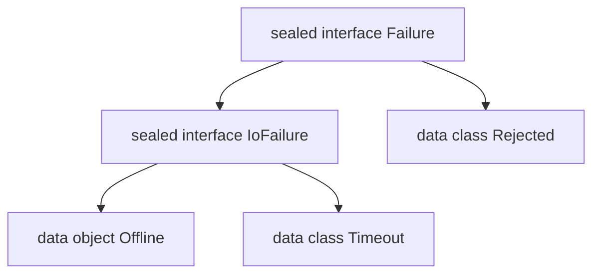

<TLDR>
  <TLDRCell label="what">
    密封类（sealed class）和<Term id="sealed-interface">密封接口（sealed interface）</Term>限制直接子类型的声明位置，让编译器知道层级边界。
  </TLDRCell>
  <TLDRCell label="trap">
    宽泛的 `else` 会吞掉新增分支；非密封且开放的直接子类也能在别处继续扩展，因此“密封”不等于所有后代都逐个固定。
  </TLDRCell>
  <TLDRCell label="fix">
    对封闭领域逐项写出 `when` 分支，并省略 `else`；检查每个直接子类型究竟是 `final`、`sealed` 还是 `open`。
  </TLDRCell>
</TLDR>

## 是什么，为什么存在

密封类型表示一个受控的继承层级。编译器知道哪些具名类型可以直接继承它，因此能判断针对该层级的 `when` 是否覆盖全部可能情况。新增一个需要单独处理的分支后，旧的穷尽判断会停止编译，把遗漏暴露在发布之前。

这种约束适合“取值形式有限、每种形式携带的数据不同”的领域。例如，一次加载可能正在进行、已经得到数据，或者携带失败原因。枚举可以列出固定实例，却不能让每个枚举项拥有不同的属性结构；普通接口又允许未知实现随时加入。

密封类型常用来表达结果类型、界面状态、协议消息、命令和抽象语法树。它不是一种错误处理框架，也不会自动验证状态转换。它提供的是类型集合的边界，具体业务规则仍要由构造逻辑和处理函数表达。

密封类本身是抽象类，可以有构造函数、保存实例状态，并提供受保护成员。一个类只能继承一个类，因此选择密封类会占用类继承位置。它适合所有变体需要共享状态或实现的层级。

<Term id="sealed-interface">密封接口</Term>没有构造函数状态，一个类却可以同时实现多个接口。需要让同一变体属于两个受控分类，或者只想规定行为契约时，密封接口通常更合适。两者都支持 `when` 的穷尽性检查，区别主要在状态所有权和组合方式。

密封层级表达的是刻意关闭的扩展点。若第三方模块、本地插件或应用功能需要自由增加实现，应使用普通接口并在处理位置保留明确的未知分支。把开放生态建模成密封层级，只会把合法扩展变成编译错误。

## 工作原理

### 直接子类型的边界

密封类或密封接口的直接子类型必须与它位于同一个包和同一个模块。它们可以是顶层声明，也可以嵌套在具名的类、接口或对象中，但必须有可限定名称；局部类和匿名对象不能直接继承密封类型。

“直接”是关键。若 `NetworkFailure` 直接实现 `Failure`，它受包和模块限制；若 `NetworkFailure` 本身是 `open`，其他包仍可继承 `NetworkFailure`。密封父类型只控制第一道边界，后续扩展由每个直接子类型自己的修饰符决定。

普通 Kotlin 类默认是 `final`，数据类和对象也不能继续继承。需要分层组织变体时，可以把直接子类型继续声明为 `sealed`；编译器会穿过这些密封节点，找到最终需要覆盖的非密封叶节点。

下面的层级中，`Failure` 的直接子类型是密封的 `IoFailure` 和最终的 `Rejected`。判断 `Failure` 时，可以用一个 `is IoFailure` 分支覆盖整个 I/O 子树，也可以继续区分 `Offline` 与 `Timeout`。



### `when` 如何判断穷尽

<Term id="exhaustive-when">穷尽 `when`（exhaustive when）</Term>保证其主题的每个可能值都会命中一个分支。`when` 用作表达式并返回值时必须穷尽；主题是密封类型时，逐项覆盖相关子类型便可以省略 `else`。

编译器围绕“直接非密封子类型”的集合判断覆盖情况。中间节点仍是密封类型时，它会沿层级继续寻找；某个直接节点已经是非密封类型时，一个针对该节点的类型检查就覆盖了它的所有可能后代。穷尽性因此证明的是类型边界覆盖，不是每个运行时具体类都在源码中单独出现。

分支中的 `is` 检查还会触发<Term id="smart-cast">智能转换（smart cast）</Term>。编译器证明值属于某个子类型后，该分支可以直接访问该类型的属性。这里没有运行时反射注册表，新增子类型后的反馈来自重新编译相关源码。

在封闭领域上写 `else` 虽然合法，却会削弱这种反馈。后来增加 `Expired` 时，已有 `else -> "unknown"` 仍能通过编译，新的业务状态便悄悄落入旧回退。只有未知值确实属于契约的一部分时，才应保留回退分支。

### 类、接口与枚举

这三种声明都能支持穷尽 `when`，但表达的集合不同。选择时先问每个变体是否需要不同载荷，再问实现是否需要共享类状态或多接口组合。

| 选择 | 集合中的成员 | 每个成员的数据形状 | 继承与组合 |
| --- | --- | --- | --- |
| `enum class` | 固定的单例常量 | 共享同一组构造属性 | 不能继承类，可实现接口 |
| `sealed class` | 受控的直接子类 | 每个子类可以不同 | 可共享构造状态，只能单类继承 |
| `sealed interface` | 受控的直接实现 | 每个实现可以不同 | 无构造状态，可实现多个接口 |

无载荷的固定常量通常优先使用枚举。需要 `Success(value)` 与 `Failure(message)` 这种不同载荷时，密封层级更贴切。不要仅为了获得 `when` 补全，就把本来是常量集合的类型展开成多个对象声明。

### 声明位置与可见性

直接子类型可以和密封父类型放在同一文件，也可以放在同包同模块的其他文件。旧草稿和旧教程常把“同一文件”说成永久限制；那是早期 Kotlin 的规则，不适用于当前目标版本。

子类型的可见性仍要满足普通继承规则。密封类的构造函数只能是 `protected` 或 `private`，默认是 `protected`；不能把它声明为 `public` 或 `internal`。私有构造函数适合强制所有直接子类都嵌套在父类能够访问的位置。

密封接口没有构造函数，也不能保存后备字段。接口属性可以要求实现提供值，或者用访问器计算值，但不能承担每个实例的构造状态。若所有变体都需要同一个已验证字段，密封类往往能把不变量放在一个位置。

## 示例

下面三个示例依次展示带载荷的状态、显式状态转换和多接口分类。每个输出都由本地 `Kotlin 2.4.10` 编译器编译并在 `Java 21` 上运行对应文件得到。

### 带载荷的加载状态

`LoadState` 的三个变体拥有不同结构。`Loading` 没有每次事件独有的数据，所以使用 `data object`；另外两个变体用数据类携带值。

<Depth level="quick">

```kotlin
sealed interface LoadState<out T> {
    data object Loading : LoadState<Nothing>
    data class Ready<T>(val value: T) : LoadState<T>
    data class Failed(val message: String) : LoadState<Nothing>
}

fun render(state: LoadState<String>): String = when (state) {
    LoadState.Loading -> "Loading"
    is LoadState.Ready -> "Welcome, ${state.value}"
    is LoadState.Failed -> "Failed: ${state.message}"
}

fun main() {
    val states = listOf<LoadState<String>>(
        LoadState.Loading,
        LoadState.Ready("Ada"),
        LoadState.Failed("timeout"),
    )

    states.forEach { println(render(it)) }
}
```

```text
Loading
Welcome, Ada
Failed: timeout
```

<TryToBreak items={['增加第四种状态', '把 Failed 改为无载荷对象', '传入空错误消息']} />

</Depth>

`when` 没有 `else`，三种状态都必须明确产生字符串。`Ready` 分支内的 `state` 已被智能转换，所以可以直接读取 `value`。若加入第四个非密封变体，`render()` 会在重新编译时指出遗漏。

类型参数上的 `out` 让 `LoadState` 具有<Term id="covariance">协变（covariance）</Term>。`Loading` 与 `Failed` 使用<Term id="bottom-type">底类型（bottom type）</Term> `Nothing`，因此它们可以出现在 `LoadState<String>` 列表中，而不必伪造一个字符串值。

### 把无效转换留在模型中

密封状态只说明状态集合有限，不代表任意命令都能作用于任意状态。这个规约器让每一组组合都返回 `Applied` 或 `Rejected`，避免用异常掩盖预期内的无效操作。

```kotlin
sealed interface OrderState {
    data class Created(val id: String) : OrderState
    data class Paid(val id: String, val receipt: String) : OrderState
    data class Cancelled(val id: String) : OrderState
}

sealed interface OrderCommand {
    data class Pay(val receipt: String) : OrderCommand
    data object Cancel : OrderCommand
}

sealed interface Transition {
    data class Applied(val state: OrderState) : Transition
    data class Rejected(val reason: String) : Transition
}

fun reduce(state: OrderState, command: OrderCommand): Transition = when (state) {
    is OrderState.Created -> when (command) {
        is OrderCommand.Pay -> Transition.Applied(
            OrderState.Paid(state.id, command.receipt),
        )
        OrderCommand.Cancel -> Transition.Applied(OrderState.Cancelled(state.id))
    }
    is OrderState.Paid -> Transition.Rejected("paid order is final")
    is OrderState.Cancelled -> Transition.Rejected("cancelled order is final")
}

fun main() {
    val created = OrderState.Created("O-17")
    val paid = reduce(created, OrderCommand.Pay("R-8"))
    val cancelled = reduce(created, OrderCommand.Cancel)

    println(paid)
    println(cancelled)
    println(reduce(OrderState.Cancelled("O-17"), OrderCommand.Cancel))
}
```

```text
Applied(state=Paid(id=O-17, receipt=R-8))
Applied(state=Cancelled(id=O-17))
Rejected(reason=cancelled order is final)
```

外层 `when` 覆盖所有订单状态；只有 `Created` 需要查看命令，因此内层 `when` 再覆盖两种命令。这个结构让新增状态和新增命令在真正相关的位置产生编译错误，却仍允许终态共享同一条拒绝规则。

`Transition` 把预期内的拒绝保留为数据，调用方可以继续用穷尽 `when` 决定显示、记录或重试。它并不会自动防止同一订单被两个并发请求同时转换；状态存储仍需要自己的并发控制和版本检查。

### 用密封接口交叉分类

`NetworkFailure` 同时属于失败集合和可重试集合，`ValidationFailure` 只属于失败集合。密封接口允许这种交叉分类，而单个密封类层级无法占据两个类父类型位置。

```kotlin
sealed interface Failure {
    val message: String
}

sealed interface Retryable {
    val delaySeconds: Int
}

data class NetworkFailure(
    override val message: String,
    override val delaySeconds: Int,
) : Failure, Retryable

data class ValidationFailure(
    val field: String,
    override val message: String,
) : Failure

data object Cancelled : Failure {
    override val message: String = "cancelled"
}

fun describe(failure: Failure): String = when (failure) {
    is NetworkFailure -> "network: ${failure.message}"
    is ValidationFailure -> "${failure.field}: ${failure.message}"
    Cancelled -> failure.message
}

fun retryPlan(value: Retryable): String =
    "retry in ${value.delaySeconds}s"

fun main() {
    val network = NetworkFailure("unreachable", 5)
    println(describe(network))
    println(retryPlan(network))
    println(describe(ValidationFailure("email", "invalid")))
    println(describe(Cancelled))
}
```

```text
network: unreachable
retry in 5s
email: invalid
cancelled
```

`describe()` 按完整失败集合进行判断，`retryPlan()` 则只接受可重试值。类型关系本身排除了把验证错误传给重试计划的调用，不需要再用布尔属性让调用方猜测哪些组合有效。

两个接口是否都该密封取决于扩展策略。如果外部模块需要定义新的重试对象，`Retryable` 应是普通接口；不能为了保持图形对称，就关闭一个本应开放的角色。

## 陷阱

### 用 `else` 吞掉新增状态

> [!PITFALL]
> 生成或手写的处理函数常用 `else -> "unknown"` 快速通过编译。新增密封子类型后，这个分支继续接住新状态，编译器无法指出哪些业务判断尚未决定其行为。

**修复方法：** 对确实封闭的层级逐项列出分支并删除 `else`。添加新变体时先让编译失败，再逐个决定每个判断点应该支持、拒绝还是转换它；不要批量加入同一个占位回退。

### 把所有后代都当成固定集合

> [!PITFALL]
> 密封父类型限制的是直接子类型。某个直接子类若显式声明为 `open`，其可见范围内仍能出现新的间接子类，而针对这个开放节点的一个 `is` 分支会被视为覆盖整个子树。

**修复方法：** 审查每个直接子类型的修饰符。叶变体保持默认 `final`；需要分组的中间节点继续使用 `sealed`；只有领域确实需要第二层开放扩展时才使用 `open`，并把该分支当作扩展边界处理。

### 跨包或跨模块放置直接子类型

> [!PITFALL]
> 模型生成器可能把父接口放进 `domain` 包，再把直接实现散到 `network`、`storage` 或独立功能模块。这样的代码即使依赖方向合理，也违反密封类型的直接继承限制。

**修复方法：** 把直接变体留在同包同模块，并让功能层组合或包装这些领域值。若部署边界要求第三方实现，就改用普通接口；不要靠移动包声明或复制同名密封接口掩盖设计冲突。

### 用单例表示带事件数据的变体

> [!PITFALL]
> `object` 和 `data object` 在进程中表示同一个无载荷实例。把请求编号、进度或错误详情塞进它的可变属性，会让不同事件共享状态，也使相等性和日志无法表示每次发生的差异。

**修复方法：** 真正无载荷的状态使用 `data object`，每次发生都携带数据的变体使用含 `val` 属性的数据类。先写出调用方需要读取的载荷，再选择声明形式；不要为减少分配而引入共享可变事件。

### 把密封层级当成状态机

> [!PITFALL]
> 列出 `Created`、`Paid` 和 `Cancelled` 只会关闭状态集合，不会阻止从 `Cancelled` 回到 `Created`。若转换函数用 `else` 或就地修改可变字段，非法边仍可能在运行时出现。

**修复方法：** 用显式转换函数同时匹配当前状态和命令，并让非法转换返回有类型的拒绝结果。测试状态与命令的组合边界；涉及持久化或并发写入时，再增加版本、事务或单一所有者约束。

### 在开放协议上强行密封

> [!PITFALL]
> 插件、驱动和跨团队扩展点的实现集合通常无法由一个模块预先列完。把接口声明为密封后，消费者不能在自己的模块实现它，只能修改拥有该接口的模块。

**修复方法：** 让开放协议保持普通接口，并在消费端设计明确的默认或能力查询。只有拥有方能控制全部直接实现、而且新增实现应触发所有处理点复审时，才选择密封接口。

<Depth level="deep">

## 穷尽性覆盖的是哪组类型

密封层级的穷尽检查不是简单枚举父类型的直接子类名称。编译器关注从父类型出发能够到达的直接非密封子类型：经过的中间节点若仍密封，就继续向下；遇到非密封节点后，该节点成为覆盖边界。

因此，对 `Failure` 写 `is IoFailure` 可以一次覆盖仍密封的整个 I/O 分组。若要为离线和超时给出不同文案，就在外层分别判断叶节点，或者在 `is IoFailure` 分支内再写一个穷尽 `when`。前者让所有差异集中展示，后者适合把同组策略放在一起。

多个密封接口可能共享同一个实现类。判断其中一个接口时，只计算从该接口可达的覆盖集合；实现类同时属于另一个接口，不会自动把另一个接口的所有变体带进来。每个 `when` 的静态主题类型决定编译器使用哪条层级边界。

可空密封类型还包含 `null`。`when` 的主题若是 `Failure?`，覆盖所有非空变体后仍要有 `null` 分支，或者使用真正符合契约的 `else`。把类型从非空改成可空会改变穷尽集合，应当触发与新增业务状态相同级别的审查。

守卫条件只覆盖满足额外条件的那部分值。一个 `is NetworkFailure if state.delaySeconds > 0` 分支不能代表所有 `NetworkFailure`，剩余值仍需要分支。守卫适合细分已知类型内部的规则，不应取代对该类型的无条件兜底处理。

### 分支顺序与智能转换

`when` 从上到下选择第一个匹配分支。若先写 `is Failure`，后面的 `is NetworkFailure` 永远没有机会运行，因为后者也是前者。穷尽不代表分支顺序符合业务意图，较具体的类型检查通常应放在较宽的检查之前。

智能转换依赖控制流证明和被检查值的稳定性。局部 `val` 通常可在分支内收窄；可能在检查与使用之间变化的开放属性或可变属性不一定能转换。遇到这种情况，应先读取一次稳定快照，而不是用不安全的 `as` 强制转换。

同一个具体类实现多个密封接口时，一个分支可以通过交叉关系访问它声明的成员，但静态主题仍只收窄到被检查的类型。需要同时表达两种能力时，定义有意义的组合接口或使用两次清晰的能力检查，不要依赖难以阅读的强制转换链。

## 构造、状态与相等性

密封修饰符不生成 `equals()`、`hashCode()`、`toString()` 或 `copy()`。这些成员来自具体变体自己的声明形式。数据类适合带值载荷的叶节点，`data object` 适合无载荷叶节点，普通类则保留标识相等性，除非显式覆盖。

把所有变体嵌套在密封父类型中只是命名和可见性选择，不是穷尽性的必要条件。同包同模块的顶层直接子类型同样受控。嵌套能避免通用名称冲突，顶层声明则更适合需要独立导入或文件组织的较大变体。

密封类可以在构造函数中验证共享状态。构造函数设为 `private` 时，只有父类声明体内可访问它的嵌套子类能够调用；默认的 `protected` 构造函数则允许合法子类调用。不要通过可变的受保护字段让所有变体共享隐式状态机。

无载荷单例的 `data object` 提供稳定的名称型字符串表示，并保持单例相等性语义。普通 `object` 也只有一个实例，但默认字符串包含实现相关的标识形式。二者都不适合保存某次请求独有的可变数据。

### 泛型结果层级

结果层级常把成功值声明为协变类型参数，例如 `Outcome<out T>`。协变允许 `Outcome<Child>` 用在需要 `Outcome<Parent>` 的位置，但父类型不能在不受约束的方法参数中消费 `T`。这项限制保护调用方不会向只承诺产生子类型值的对象写入任意父类型。

失败或加载分支不产生成功值，因此可以继承 `Outcome<Nothing>`。`Nothing` 没有普通运行时值，是所有 Kotlin 类型的子类型；配合协变后，同一个失败对象能作为 `Outcome<String>`、`Outcome<User>` 或其他成功类型使用。

这不等于在运行时保留了 `T`。JVM 泛型通常会发生类型擦除，`is Outcome.Success<String>` 之类的检查并不普遍可用。先按变体做 `is Outcome.Success<*>` 检查，再通过静态 API 保持载荷类型关系；不要用密封性推断被擦除的类型实参。

若层级需要消费和产生同一个 `T`，协变可能并不合适。不要用 `@UnsafeVariance` 只为压过编译器；先检查接口是否混合了读取与写入责任，必要时拆分生产者、消费者或把操作放到外部泛型函数中。

## 模块、多平台与演进

包名相同仍不足以跨模块直接继承密封类型，模块边界同样受限。这使密封层级适合作为一个编译单元拥有的模型，却不适合作为允许未知实现的跨模块服务提供者接口。模块拆分时，必须把层级所有权作为迁移条件检查。

在多平台项目中，没有 `expect` 和 `actual` 修饰的密封类型还要求直接子类位于同一源集。`expect`／`actual` 层级允许各平台源集声明自己的直接子类，分层源集也能增加中间变体；因此，共同代码中的 `when` 可能仍需要 `else`，因为平台端存在共同源集看不到的子类。

向已发布的密封层级添加变体是契约变化。重新编译的消费者会在没有 `else` 的判断点收到错误，这正是源代码层面的迁移清单。未重新编译的旧二进制若接收到新变体，其既有判断也没有新业务行为；库作者不能把“旧代码还能链接”当作语义兼容。

删除或重命名变体同样会影响构造位置、序列化形式和消费者分支。序列化框架如何标识变体取决于具体配置，密封修饰符本身不保证稳定的线上判别值。对外部数据格式，应显式规定稳定标识并用兼容性样本测试，而不是把 Kotlin 类名直接当永久协议。

### 测试封闭层级

编译器能证明分支覆盖，却不能证明每个分支返回正确结果。单元测试仍应为每个叶变体给出代表性载荷，并检查边界值，例如空集合、空消息、零延迟和极大数值。无载荷对象至少要验证其处理路径，而不是只依赖覆盖率工具显示代码执行过。

状态转换测试应覆盖允许边和拒绝边。只测试顺利路径会漏掉终态回退、重复命令和跨请求状态共享。若状态保存在数据库中，还要分别测试版本冲突与重试，不要把类型穷尽性误当作并发正确性。

层级演进测试可以临时添加一个变体并运行编译，观察哪些 `when` 失败。这个变更不必提交，却能发现被宽泛 `else` 隐藏的判断点。对于刻意保留 `else` 的开放边界，应单独测试未知实现或未知判别值的契约。

测试也要检查对象形态。两个带相同载荷的数据类实例应按值比较，无载荷 `data object` 应稳定显示名称，带事件数据的变体不应在并发调用间共享可变属性。这里的目标是验证具体变体契约，而不只是父类型声明上存在 `sealed` 关键字。

</Depth>

<Checkpoint id="kotlin/sealed-classes" />

## 延伸阅读

- [Kotlin 文档：密封类与密封接口](https://kotlinlang.org/docs/sealed-classes.html)
- [Kotlin 文档：`when` 表达式与语句](https://kotlinlang.org/docs/control-flow.html#when-expressions-and-statements)
- [Kotlin 文档：泛型型变](https://kotlinlang.org/docs/generics.html#variance)
- [Kotlin 语言规范：密封类与密封接口](https://kotlinlang.org/spec/inheritance.html#sealed-classes-and-interfaces)
- [Kotlin 语言规范：穷尽 `when` 表达式](https://kotlinlang.org/spec/expressions.html#exhaustive-when-expressions)
