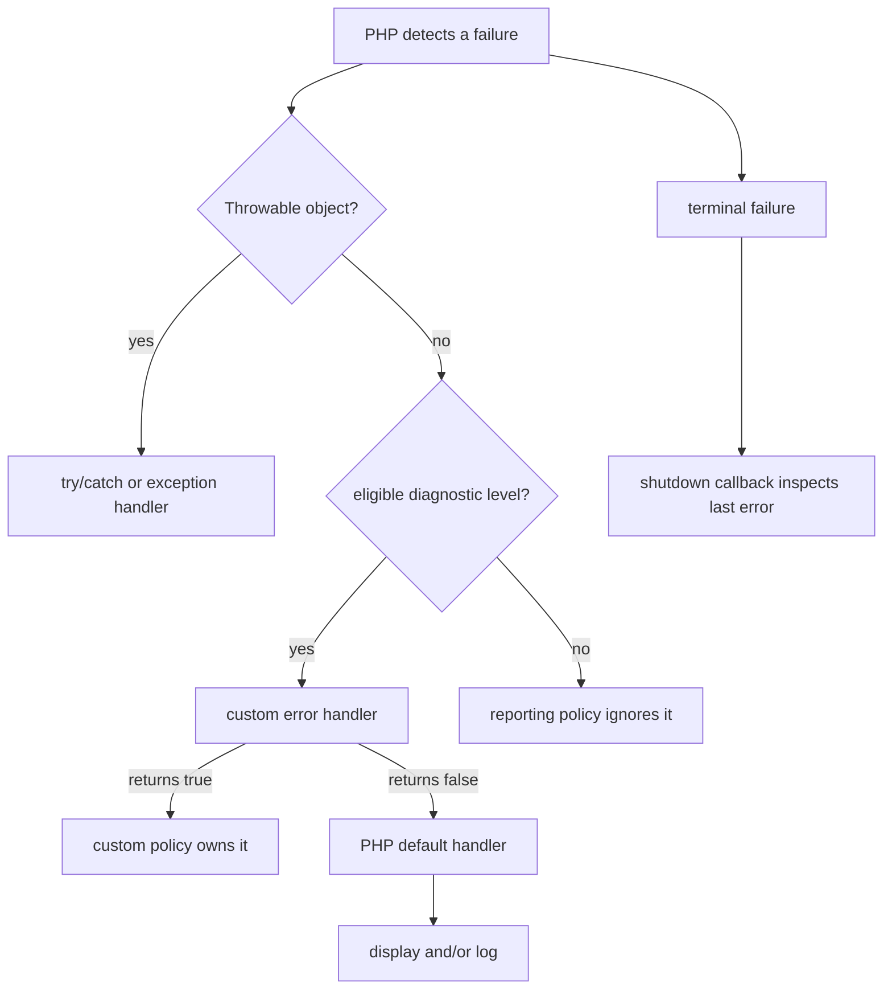

<TLDR>
  <TLDRCell label="what">
    PHP reports failures through two channels: diagnostics with `E_*` levels and objects that implement `Throwable`. `set_error_handler()` takes over only some diagnostics.
  </TLDRCell>
  <TLDRCell label="trap">
    The `Error` class is not `E_ERROR`, and a custom handler cannot catch every fatal condition. Handler return values, `@` suppression, and process-wide registration can also alter later code silently.
  </TLDRCell>
  <TLDRCell label="fix">
    Report `E_ALL` in development, testing, and production; disable display but retain logging in production. A handler should inspect the current mask, preserve original metadata, and restore the previous handler when its scope ends.
  </TLDRCell>
</TLDR>

## What it is and why it exists

PHP error handling starts with a diagnostic policy. When the engine finds an undefined array key, deprecated use, or user-triggered warning, it attaches an <Term id="error-level">error level</Term> to the diagnostic. The `error_reporting` mask decides which levels the default mechanism reports, while `display_errors` and `log_errors` decide where selected information goes.

The other failure channel consists of `Throwable` objects. User code commonly throws an <Term id="exception">exception</Term>, while the engine creates subclasses of `Error` for type errors, value errors, and many runtime failures. Both can be handled with `try`/`catch`, but `set_error_handler()` does not receive these objects.

The names invite confusion. `Error` is a class that implements `Throwable`; `E_ERROR` is an integer diagnostic level. Catching `Error` and registering an `E_ERROR` mask are not the same operation. Exception classification, propagation, and cleanup belong in `php/exceptions`; this topic concentrates on selecting, converting, recording, and containing diagnostics.

An application uses different presentation policies in development, testing, and production, but it should not use different correctness standards. Undefined keys and deprecation diagnostics still deserve recording in production; removing them from the mask only makes defects harder to find. Usually, development may display detail to a developer, while production records detail and returns a generic response to the user.

A custom <Term id="error-handler">error handler</Term> is useful for routing diagnostics into structured logs or converting warnings to `ErrorException` inside a controlled scope. It is not a universal recovery layer for damaged state, and it does not replace boundary validation. When you can detect a failure before an operation, an explicit return-value or input check is usually clearer than waiting for a warning.

| Failure form | PHP representation | Primary handling entry point | Guaranteed to continue |
| --- | --- | --- | --- |
| Reportable diagnostic | Integer level such as `E_WARNING` or `E_NOTICE` | `set_error_handler()` or the default handler | Depends on the level and application policy |
| User-triggered diagnostic | `E_USER_WARNING`, `E_USER_NOTICE`, and peers | Diagnostic path after `trigger_error()` | Depends on the level and handler |
| Throwable failure | `Exception` or `Error` object | `try`/`catch`, `set_exception_handler()` | Only when the caller handles it deliberately |
| Shutdown information | Record returned by `error_get_last()` | Shutdown function | No; it supports final recording and limited cleanup |

## How it works

### Two failure channels

The diagnostic channel carries a level, message, file, and line. After the engine or `trigger_error()` creates a diagnostic, PHP checks for a user handler eligible for that level. If the handler returns `true`, the default handler does not process the diagnostic again; returning `false` gives control back to the default handler.

The `Throwable` channel carries an object, type, and stack trace. A matching `catch` handles the object first; without one, the object propagates up the call stack and may eventually reach a global exception handler. `set_error_handler()` and `set_exception_handler()` therefore solve different problems, and setting an `E_ALL` mask does not merge them into one mechanism.



This flow describes control ownership, not a promise of recovery. An error handler can change what follows a warning, an exception handler can produce a final response, and a shutdown function can add a last record. None can restore broken invariants to a trustworthy state.

### Reporting masks and destinations

`error_reporting(E_ALL)` selects every currently defined error level for the request. Production should usually retain `E_ALL`, then use `display_errors=Off` to prevent paths, queries, or stacks from leaking into responses. `log_errors=On` sends diagnostics selected by the default handler to the configured logging destination.

`display_startup_errors` concerns PHP startup, so a script that has already begun cannot reliably repair it. Deployment configuration belongs in `php.ini`, a PHP-FPM pool, or environment-managed configuration. Request-time `ini_set()` calls are fine for small demonstrations and controlled CLI tools, but they should not be the only source of production policy.

The mask uses bit operations. `E_ALL & ~E_DEPRECATED` removes deprecation diagnostics, but that is rarely a sound long-term policy because dependency upgrades need those signals. If volume is excessive, sample and aggregate at the log transport or alerting layer instead of making the runtime blind to an entire defect category.

### Registering a handler

`set_error_handler($callback, $levels)` installs the current in-process handler and returns the previous one. The second argument restricts the levels delivered to the callback and defaults to `E_ALL`. PHP web workers may serve multiple requests, and test processes run multiple cases, so this registration is mutable global state that needs explicit ownership.

The callback receives the severity, message, file, and line. It should inspect whether the current `error_reporting()` mask contains the level before converting or recording it. Returning `false` continues to PHP's default handler; returning `true` says the custom policy handled it fully, so the default display and logging path does not run.

Logging and then always returning `true` can create silent loss. If the custom destination fails, the default channel has already been disabled. A handler needs an explicit failure policy, and it must never trigger itself recursively while trying to report a logging failure.

### Converting to `ErrorException`

The built-in `ErrorException` places a diagnostic's message, severity, file, and line in a throwable object. After conversion, a caller can use `catch` and `finally` at a clear boundary instead of relying on a function returning `false` while also inspecting global logs. This is useful for some older APIs that report failure with warnings.

Conversion changes control flow. A function that used to warn, return `false`, and continue may now throw where the warning occurs, so do not enable conversion indiscriminately across an application. Keep it within an entry point or test scope with a clear contract, and make sure diagnostics expected by dependencies are not accidentally turned into exceptions.

Do not declare your own global class named `ErrorException`. PHP already provides it, and redeclaration causes a fatal error. Pass the original level to the constructor's `severity` parameter so a caller can preserve the diagnostic meaning through `getSeverity()`.

### Shutdown phase

Functions registered by `register_shutdown_function()` run after normal completion and on many termination paths. A shutdown function can inspect the latest error record through `error_get_last()`, but that record is not guaranteed to be fatal and may come from an earlier handled diagnostic. Code must first check that a record exists, then strictly filter accepted levels.

The shutdown phase is suitable only for final recording, releasing small process resources, or submitting telemetry that is already prepared. During memory exhaustion, after output has started, or with incomplete runtime state, complex templates, dependency-injection containers, and network clients may be unavailable. A shutdown handler is not a place to replay a request or continue a business transaction.

## Examples

The three examples build from diagnostic ownership to scoped exception conversion and final inspection at termination. Every output was produced by the local PHP 8.3.33 CLI; the last program intentionally exits with a nonzero status.

### Own selected user diagnostics

The handler receives only user warnings and user notices and gives each level a stable name. Returning `true` says the default handler should not display or log the same message again.

<Depth level="quick">

```php title="diagnostic_handler.php"
<?php

declare(strict_types=1);

error_reporting(E_ALL);

$levelNames = [
    E_USER_WARNING => 'E_USER_WARNING',
    E_USER_NOTICE => 'E_USER_NOTICE',
];

set_error_handler(
    static function (int $severity, string $message) use ($levelNames): bool {
        if (!(error_reporting() & $severity)) {
            return false;
        }

        printf("handled %s: %s\n", $levelNames[$severity], $message);
        return true;
    },
    E_USER_WARNING | E_USER_NOTICE,
);

trigger_error('inventory below reorder point', E_USER_WARNING);
trigger_error('cache entry rebuilt', E_USER_NOTICE);
restore_error_handler();

echo "request continues\n";
```

```text
handled E_USER_WARNING: inventory below reorder point
handled E_USER_NOTICE: cache entry rebuilt
request continues
```

</Depth>

The `$levelNames` array is not a complete copy of the error taxonomy; it contains only the two levels registered here. If a callback may receive other levels, give unknown values an explicit representation instead of reading a missing array key.

`restore_error_handler()` restores the previous handler rather than assuming the default handler has always been underneath. A framework, test runner, or caller may already have installed a handler, and library code must give it back unchanged.

### Convert a warning at a narrow boundary

Directly reading a missing array key produces `E_WARNING`. A temporary handler converts it to the built-in `ErrorException`, and the caller can continue after handling it; `finally` restores the handler on success and failure.

```php title="warning_exception.php"
<?php

declare(strict_types=1);

function stockFor(array $stockBySku, string $sku): int
{
    return $stockBySku[$sku];
}

set_error_handler(
    static function (
        int $severity,
        string $message,
        string $file,
        int $line,
    ): bool {
        if (!(error_reporting() & $severity)) {
            return false;
        }

        throw new ErrorException($message, 0, $severity, $file, $line);
    },
);

try {
    stockFor(['BK-101' => 4], 'BK-404');
} catch (ErrorException $error) {
    printf("caught %s severity=%d\n", $error::class, $error->getSeverity());
} finally {
    restore_error_handler();
}

echo "recovered at boundary\n";
```

```text
caught ErrorException severity=2
recovered at boundary
```

Severity `2` is `E_WARNING` in this runtime. The example prints the number to prove that metadata survived; production logs should generally include the symbolic name, a stable event code, and safe business context as well.

This technique should not hide the real fix. If a missing SKU is valid, `array_key_exists()` or a nullable result expresses the contract better. If it violates an internal invariant, conversion to an exception is appropriate for handing failure to an upper boundary.

### Filter the last error at termination

An uncaught `Error` eventually terminates the program. The shutdown function inspects the last record and prints a fixed message only when it belongs to an explicit set of fatal levels.

```php title="shutdown_fatal.php"
<?php

declare(strict_types=1);

ini_set('display_errors', '0');
ini_set('log_errors', '0');

register_shutdown_function(static function (): void {
    $last = error_get_last();
    $terminalLevels = [
        E_ERROR,
        E_PARSE,
        E_CORE_ERROR,
        E_COMPILE_ERROR,
    ];

    if ($last === null || !in_array($last['type'], $terminalLevels, true)) {
        return;
    }

    printf("shutdown observed type=%d\n", $last['type']);
});

echo "before uncaught Error\n";
undefined_entry_point();
```

```text
before uncaught Error
shutdown observed type=1
```

Type `1` is `E_ERROR`, but the original failure was an uncaught `Error` object. If code catches that object near the call, or a global exception handler handles it normally, the shutdown function does not need to create a replacement response.

The example disables default display and logging only to make the output reproducible. Real production configuration must retain a safe log. A shutdown function should also avoid writing into a response that has already started because it may corrupt JSON, HTML, or protocol frames.

## Pitfalls

### Treating `E_ALL` as a universal catch

> [!PITFALL]
> `E_ALL` is a diagnostic bit mask. It does not make `set_error_handler()` receive `Error` or `Exception` objects, and it does not let a user handler take over every startup, parse, and compile-time termination.

**Fix:** design the channels separately. Use an error handler for eligible diagnostics and a local `catch` or application-entry exception handler for `Throwable`; use a shutdown function only for final observation.

### Always returning `true` after logging

> [!PITFALL]
> After a handler returns `true`, PHP's default handler does not continue. If the custom handler writes to one fallible logging destination, the diagnostic may disappear completely.

**Fix:** state who owns display and logging. Return `true` only after the custom path has completed the policy; return `false` when the default log should continue, and test failure of the logging destination.

### Ignoring the current mask under `@`

> [!PITFALL]
> The `@` <Term id="error-suppression">error-suppression</Term> operator does not guarantee that a custom callback will never run. Throwing `ErrorException` unconditionally can make deliberately suppressed probe code fail unexpectedly.

**Fix:** check `error_reporting() & $severity` before converting. Also review whether `@` is justified at all; remove it when a condition or explicit return-value check can handle the failure.

### Leaving a handler installed for later code

> [!PITFALL]
> An error handler is mutable process-wide state. When a library function or test installs one without restoring it, later requests, tests, and framework code get different control flow.

**Fix:** surround temporary registration with `try`/`finally`, and call `restore_error_handler()` in `finally`. A test should trigger a fresh diagnostic after a failure path and confirm that the original handler is active.

### Displaying detail in production responses

> [!PITFALL]
> Error messages and stacks can contain absolute paths, SQL, internal class names, request data, or credentials. Returning `$error->getMessage()` directly turns a diagnostic boundary into an information leak.

**Fix:** disable `display_errors` in production, return a stable generic error and correlation ID to the client, and record allowlisted context in a controlled log. Passwords, tokens, cookies, and authorization headers belong in neither raw responses nor raw logs.

## In the AI era

**What generated code gets wrong here**

Models often redeclare the global `ErrorException` class or write an entry handler that catches `Exception` while claiming to cover every PHP failure. They also convert every diagnostic into an exception without checking `error_reporting()`, register handlers inside library functions without restoring them, and log request passwords, authorization headers, and complete stacks before returning the raw error message to the client.

**Ask your AI to check**

- Classify every failure site as a diagnostic or `Throwable`, and identify the handler that actually owns it.
- Check the level mask, return value, suppression guard, and restoration path of every `set_error_handler()` call.
- Trace fields in error responses and logs, marking paths, queries, credentials, cookies, tokens, and personal data.

**Review checklist**

- Trigger `E_USER_WARNING`, a warning suppressed with `@`, `TypeError`, and an uncaught `Error` separately.
- Make the handler's own log destination fail and confirm there is still an observable signal without handler recursion.
- Trigger a fresh diagnostic after success, an exception, and an early return to confirm every previous handler was restored.

**Prompt vocabulary**

Use the exact terms `error level`, `error_reporting mask`, `custom error handler`, `default error handler`, `ErrorException conversion`, `error suppression`, `Throwable boundary`, and `shutdown handler`. Ask the AI for separate control flow for diagnostics, `Error`, and `Exception`; “add global error handling” does not constrain ownership or disclosure policy.

<Depth level="deep">

## Handler scope and stack

PHP maintains a handler stack, not just a switch. Consecutive `set_error_handler()` calls make the last registered handler current, and each `restore_error_handler()` pops only the top entry. If a nested library restores more than once, it can remove a handler owned by its caller.

The safest temporary pattern enters a `try` immediately after installation and restores exactly once in its corresponding `finally`. Do not pass the returned old callback back into `set_error_handler()` to simulate restoration. That creates another registration layer and changes the order of later pops.

Long-lived applications must also consider interleaved execution in coroutines, Fibers, or event loops. Handler state is not local to each logical task, so one task can trigger a diagnostic while another has changed the handler temporarily. If exclusive execution cannot be guaranteed, do not use a global handler to express a local business policy.

### Returning control to PHP

The callback's Boolean result is an ownership decision. `false` means “this diagnostic should still enter standard PHP handling”; `true` means “the custom path has handled it completely.” `null` is not `false`, so omitting an explicit return can disable default handling accidentally.

One handler can make different choices for different levels. It might record user deprecations in a migration metric and return `true`, while enriching an ordinary warning and returning `false` to retain default logging. The policy must prevent duplicate alerts for one event without leaving no record when every custom path fails.

A new error raised while the handler runs is not handled recursively by that same handler; PHP uses its ordinary error mechanism. Even so, formatting untrusted objects, reading missing fields, or writing to an unavailable path can obscure the original signal. Keep the callback small, avoid complex dependencies, and prefer already validated scalar context.

### Suppression semantics

`@expression` changes the current reporting mask while the expression executes. A custom handler may still be called, so a converting handler commonly evaluates `error_reporting() & $severity` first. When the result is zero, it returns `false` instead of upgrading the diagnostic to an exception.

This guard respects a suppression decision already made at the call site, but it does not prove that decision is sound. Legacy probe code may use `@` for expected failure, while generated code often uses it to hide unhandled network, file, or parse errors. A reviewer should still look for calls that can use explicit conditions and return-value checks.

Do not use `error_reporting(0)` as a temporary muting trick unless every exit restores the exact old value. An exception or early return can leave the mask in the wrong state. Restricting the custom handler's levels or handling a result at the boundary that owns its failure contract is usually clearer.

### Choosing a conversion boundary

A suitable conversion boundary knows which diagnostics a lower-level function may produce and can define what failure its caller should see. A file importer can convert a known set of warnings into an import failure, but a general utility library should not redefine warning semantics for the whole process.

Keep the level mask as narrow as possible. If only `E_WARNING` belongs to the boundary, do not register `E_ALL` and then guess which notices are harmless. A narrow mask documents intent and limits surprising control-flow changes after dependency upgrades.

The converted exception should preserve the original message, file, line, and severity, but a public boundary need not expose those fields. Internal logs use the original diagnostic to locate code, while a client receives a stable domain error or generic error code.

Test the success path too. A handler may convert failure correctly but contaminate the next operation because it was not restored. Running two operations consecutively catches lifecycle errors that a single `catch` assertion misses.

When an API already represents an expected failure clearly with a return value, honor that contract first. Promoting every `false` to an exception confuses “not found” with runtime damage and may break callers that depend on the documented result.

### Testing handler lifetime

A test can install a sentinel handler, invoke the code under test, and then trigger a diagnostic. If the sentinel receives that event again, the tested code restored prior state; if an internal handler responds, its scope leaked.

Failure tests should cover the handler callback throwing, the business callback throwing, and the business callback returning early. All three paths must execute the same `finally` instead of duplicating restoration in branches.

Nested cases need separate observations of the inner and outer levels. When the inner scope ends, the outer handler should become current again. When the outer scope ends, the test runner's or framework's original handler should be restored.

Do not infer the current stack by comparing callback objects. PHP exposes no public API for reading the complete error-handler stack, so behavioral tests are more reliable than assumptions about invisible internal state.

Concurrent execution models need isolation tests as well. If two Fibers can interleave while installing different handlers, prove that scheduling cannot route a diagnostic across tasks. If that cannot be proven, move the policy to an explicit call boundary that does not depend on global registration.

## Terminal failures and shutdown

A user error handler cannot take over every PHP startup, parse, and compile-time error. Failures that occur before the current file can call `set_error_handler()` obviously cannot reach it. Putting registration on the first executable line does not remove that time boundary.

Many modern runtime failures first become `Error` objects, including parameter type mismatches and calls to undefined functions. These objects can be caught in a suitable `try` scope; if they remain uncaught, they eventually terminate execution and may leave an `E_ERROR` record. Treating the object path and final diagnostic record as two observations of the same event is more accurate than assuming there is only one kind of “fatal error.”

Some failures while parsing a file loaded by `include` appear as `ParseError` and can be caught by the caller. A syntax failure in the main file occurs before it can install a handler. Whether a failure is handleable depends on its phase and control boundary, not merely on whether its message contains “fatal.”

### Filtering the last record

`error_get_last()` returns the latest error's `type`, `message`, `file`, and `line`, or `null` when no record exists. It does not decide whether that error caused shutdown. An earlier nonfatal warning may still be the “last error,” and shutdown functions run after normal completion too.

A shutdown handler must therefore use a strict allowlist such as `E_ERROR`, `E_PARSE`, `E_CORE_ERROR`, and `E_COMPILE_ERROR`. Verify the list against the deployed runtime, and do not misreport a continuable level such as `E_WARNING` as a crash. Controlled tests that need to discard a stale record can call `error_clear_last()`.

Shutdown functions run in registration order, but a shutdown function that calls `exit` prevents later shutdown functions from running. Multiple modules registering shutdown work create an implicit ordering dependency. The application entry point should own the final response and telemetry policy centrally.

### Shutdown is not recovery

At termination, a database transaction may be uncommitted, headers may already be sent, or memory may be exhausted. A shutdown handler cannot reliably determine how far arbitrary business work progressed, so it must not mark an order successful, dispatch a payment again, or continue writing domain data.

Safe work is idempotent and bounded, such as recording a stable event code with a correlation ID or releasing a process resource that does not depend on a complex object graph. An external queue or caller should decide retries from durable state; the failing process should not guess.

Even producing a generic 500 response requires knowing the interface. HTML, JSON, streaming downloads, and CLI programs need different boundary policies. A global shutdown function that prints HTML can turn an API's JSON response into invalid mixed content.

## Production reporting policy

Production policy records every useful diagnostic without showing internal detail to an untrusted client. `error_reporting=E_ALL`, `display_errors=Off`, and `log_errors=On` form a reasonable baseline, but the log destination, permissions, retention, and redaction are also part of the policy. Deployment should own the configuration and verify effective values during a startup health check.

A log event should include time, a stable event code, severity, application version, and correlation ID. File and line belong in controlled internal logs, but request bodies, sessions, cookies, authorization headers, and arbitrary object dumps need an allowlist. Full stacks should go only to an access-controlled system with a retention policy.

Client responses use a stable public format rather than reusing an internal message. A service can return a generic error code and correlation ID so operators can locate the same event in logs. Tests should assert both that the internal log has enough context and that the response lacks secrets, absolute paths, stacks, and query text.

</Depth>

<Checkpoint id="php/error-handling" />

## Further reading

- [PHP manual: Error basics](https://www.php.net/manual/en/language.errors.basics.php)
- [PHP manual: Runtime configuration](https://www.php.net/manual/en/errorfunc.configuration.php)
- [PHP manual: `set_error_handler()`](https://www.php.net/manual/en/function.set-error-handler.php)
- [PHP manual: `ErrorException`](https://www.php.net/manual/en/class.errorexception.php)
- [PHP manual: `register_shutdown_function()`](https://www.php.net/manual/en/function.register-shutdown-function.php)
