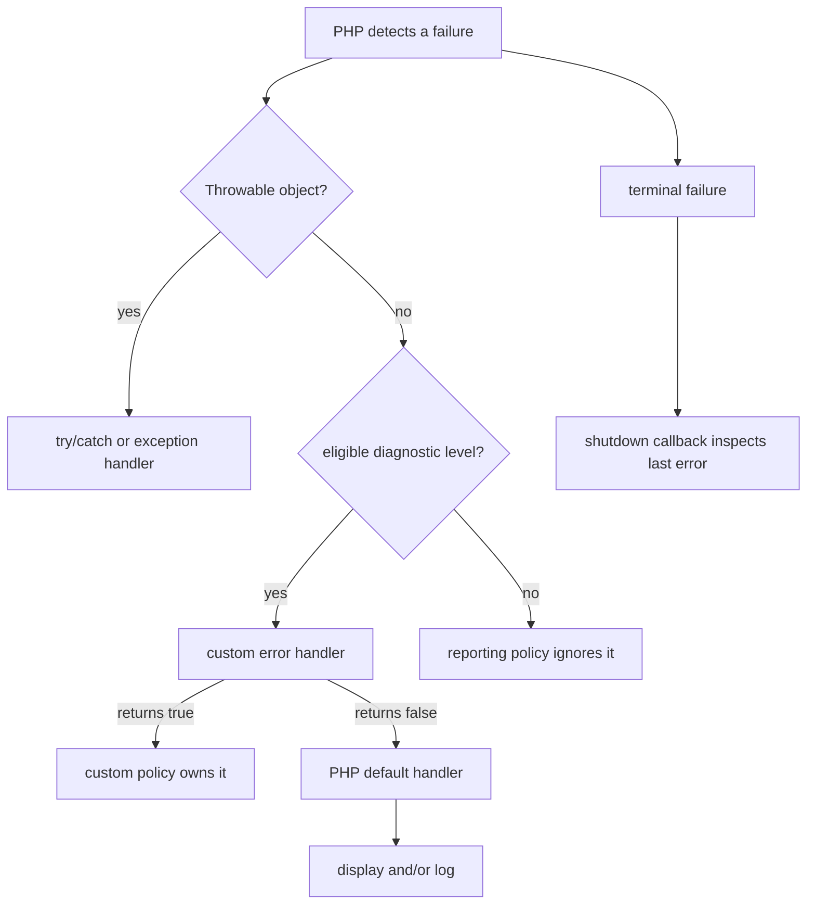

<TLDR>
  <TLDRCell label="what">
    PHP 通过两条通道报告失败：带有 `E_*` 级别的诊断，以及实现 `Throwable` 的对象。`set_error_handler()` 只接管其中部分诊断。
  </TLDRCell>
  <TLDRCell label="trap">
    `Error` 类不是 `E_ERROR`，自定义处理器也捕获不了所有致命条件。处理器返回值、`@` 抑制和进程级注册还会悄悄改变后续代码的行为。
  </TLDRCell>
  <TLDRCell label="fix">
    开发与测试环境报告 `E_ALL`，生产环境关闭错误展示并保留日志。处理器应检查当前掩码、保留原始元数据，并在作用域结束时恢复前一个处理器。
  </TLDRCell>
</TLDR>

## 是什么，为什么存在

PHP 的错误处理首先是一套诊断政策。引擎发现未定义数组键、弃用用法或用户触发的警告时，会给诊断附上<Term id="error-level">错误级别（error level）</Term>。`error_reporting` 掩码决定默认机制报告哪些级别，`display_errors` 与 `log_errors` 再决定把选中的信息送到哪里。

另一条失败通道是 `Throwable` 对象。用户代码通常抛出<Term id="exception">异常（exception）</Term>，引擎则会为类型错误、值错误和许多运行时失败创建 `Error` 子类。两者都可以通过 `try`/`catch` 处理，但 `set_error_handler()` 不会接收这些对象。

名称很容易造成混淆。`Error` 是实现 `Throwable` 的类，`E_ERROR` 是整数诊断级别；捕获 `Error` 与注册 `E_ERROR` 掩码不是同一件事。异常的分类、传播和清理属于 `php/exceptions`，这里关注诊断如何被选择、转换、记录和限制。

应用会在开发、测试和生产中采用不同的展示政策，但不应采用不同的正确性标准。未定义键和弃用诊断在生产环境同样值得记录；把它们从掩码中删除只会让缺陷更难发现。通常的差别是开发环境可以把细节展示给开发者，生产环境只记录细节并向用户返回通用响应。

自定义<Term id="error-handler">错误处理器（error handler）</Term>适合把诊断接入结构化日志，或在一段受控代码中把警告转换为 `ErrorException`。它不是修复损坏状态的通用恢复层，也不应替代边界校验。能够在操作前检测失败时，显式检查返回值或输入通常比等待警告更清楚。

| 失败形式 | PHP 表示 | 主要处理入口 | 是否一定可继续 |
| --- | --- | --- | --- |
| 可报告诊断 | `E_WARNING`、`E_NOTICE` 等整数级别 | `set_error_handler()` 或默认处理器 | 取决于级别与应用政策 |
| 用户触发诊断 | `E_USER_WARNING`、`E_USER_NOTICE` 等 | `trigger_error()` 后进入诊断路径 | 取决于级别与处理器 |
| 可抛出失败 | `Exception` 或 `Error` 对象 | `try`/`catch`、`set_exception_handler()` | 只有调用方明确处理时 |
| 终止阶段信息 | `error_get_last()` 返回的记录 | 关闭函数 | 否；只适合最后记录与有限清理 |

## 工作原理

### 两条失败通道

诊断通道携带级别、消息、文件和行号。引擎或 `trigger_error()` 产生诊断后，PHP 先判断是否存在能处理该级别的用户处理器。处理器若返回 `true`，默认处理器不会再处理这条诊断；返回 `false`，控制权会交还给默认处理器。

`Throwable` 通道携带对象、类型和堆栈跟踪。匹配的 `catch` 先处理对象；没有匹配项时，对象沿调用栈传播，最后可能交给全局异常处理器。`set_error_handler()` 与 `set_exception_handler()` 因此解决不同问题，不能通过把掩码设成 `E_ALL` 合并成一个机制。



这个流程描述的是控制权，不表示每条路径都能恢复。错误处理器可以改变警告的后续行为，异常处理器可以生成最终响应，关闭函数可以补记信息；它们都无法把已经破坏的不变量恢复成可信状态。

### 报告掩码与输出目的地

`error_reporting(E_ALL)` 在当前请求中选择全部已定义的错误级别。生产环境通常仍应使用 `E_ALL`，再用 `display_errors=Off` 防止响应泄露路径、查询或堆栈。`log_errors=On` 则把默认处理器选中的诊断送往配置的日志目标。

`display_startup_errors` 涉及 PHP 启动阶段，不能依赖已经开始执行的脚本来可靠修正。部署配置应放在 `php.ini`、PHP-FPM 池或运行环境管理的配置中。请求内调用 `ini_set()` 适合小型演示和受控 CLI 工具，不应成为生产配置的唯一来源。

掩码使用位运算。`E_ALL & ~E_DEPRECATED` 会删除弃用诊断，但这通常不是理想的长期政策；依赖升级正需要这些信号。若日志量过大，应在日志传输或告警层采样和聚合，而不是让运行时看不见一整类缺陷。

### 注册处理器

`set_error_handler($callback, $levels)` 安装一个进程内的当前处理器，并返回先前的处理器。第二个参数限制回调接收的级别；省略时默认为 `E_ALL`。PHP 的 Web 工作进程可能服务多个请求，测试进程也会运行多个用例，因此这种注册属于需要明确所有权的可变全局状态。

回调接收严重级别、消息、文件和行号。它应先判断当前 `error_reporting()` 是否包含该级别，再执行转换或记录。返回 `false` 会继续使用 PHP 默认处理器；返回 `true` 表示自定义政策已经完全处理，默认展示和日志都不会再发生。

只记录后返回 `true` 很容易造成静默丢失。如果自定义日志写入失败，默认通道也已经被关闭。处理器应有明确的失败政策，并且绝不能在处理日志错误时递归触发同一处理器。

### 转换为 `ErrorException`

内建 `ErrorException` 把诊断的消息、级别、文件和行号装进可抛出对象。转换后，调用方可以在一个明确边界使用 `catch` 和 `finally`，而不必依赖函数返回 `false` 的同时检查全局日志。这对一些会通过警告报告失败的旧式 API 很有用。

转换会改变控制流。原本会返回 `false` 并继续的函数，现在可能在警告发生处抛出，因此不能在整个应用里不加选择地启用。应该把转换限制在拥有明确契约的入口层或测试范围，并确保依赖库预期的诊断没有被意外改成异常。

不要自行声明名为 `ErrorException` 的全局类。PHP 已提供该类，重复声明会造成致命错误。创建实例时应把原始严重级别传给构造函数的 `severity` 参数，调用方才能用 `getSeverity()` 保留诊断含义。

### 关闭阶段

`register_shutdown_function()` 注册的函数会在正常结束和许多终止路径上运行。关闭函数可通过 `error_get_last()` 查看最近一条错误记录，但该记录不保证是致命错误，也可能来自早先已经处理的诊断。代码必须先检查记录是否存在，再严格筛选允许的级别。

关闭阶段只适合最后记录、释放少量进程资源或提交已经准备好的遥测。内存耗尽、输出已经发送或运行时状态不完整时，复杂的模板、依赖注入容器和网络客户端都可能不可用。关闭处理器不是重新执行请求或继续业务事务的地方。

## 示例

下面三个示例依次展示诊断所有权、受控的异常转换，以及终止时的最后检查。输出均由本地 PHP 8.3.33 CLI 实际生成；最后一个程序按设计以非零状态结束。

### 接管选定的用户诊断

处理器只接收用户警告和用户通知，并为每个级别生成稳定名称。返回 `true` 表示默认处理器不应再次展示或记录同一条消息。

<Depth level="quick">

```php title="diagnostic_handler.php"
<?php

declare(strict_types=1);

error_reporting(E_ALL);

$levelNames = [
    E_USER_WARNING => 'E_USER_WARNING',
    E_USER_NOTICE => 'E_USER_NOTICE',
];

set_error_handler(
    static function (int $severity, string $message) use ($levelNames): bool {
        if (!(error_reporting() & $severity)) {
            return false;
        }

        printf("handled %s: %s\n", $levelNames[$severity], $message);
        return true;
    },
    E_USER_WARNING | E_USER_NOTICE,
);

trigger_error('inventory below reorder point', E_USER_WARNING);
trigger_error('cache entry rebuilt', E_USER_NOTICE);
restore_error_handler();

echo "request continues\n";
```

```text
handled E_USER_WARNING: inventory below reorder point
handled E_USER_NOTICE: cache entry rebuilt
request continues
```

</Depth>

`$levels` 数组不是错误分类的完整副本，只包含本例注册的两个级别。若回调可能收到其他级别，应为未知值提供明确表示，而不是直接读取一个不存在的数组键。

`restore_error_handler()` 恢复先前处理器，而不是假定默认处理器一直在下面。框架、测试运行器或调用方可能已经安装自己的处理器，库代码必须把它原样交还。

### 在窄边界转换警告

直接读取缺失数组键会产生 `E_WARNING`。临时处理器把它转换为内建 `ErrorException`，调用方处理后仍能继续；`finally` 保证无论成功还是失败都会恢复处理器。

```php title="warning_exception.php"
<?php

declare(strict_types=1);

function stockFor(array $stockBySku, string $sku): int
{
    return $stockBySku[$sku];
}

set_error_handler(
    static function (
        int $severity,
        string $message,
        string $file,
        int $line,
    ): bool {
        if (!(error_reporting() & $severity)) {
            return false;
        }

        throw new ErrorException($message, 0, $severity, $file, $line);
    },
);

try {
    stockFor(['BK-101' => 4], 'BK-404');
} catch (ErrorException $error) {
    printf("caught %s severity=%d\n", $error::class, $error->getSeverity());
} finally {
    restore_error_handler();
}

echo "recovered at boundary\n";
```

```text
caught ErrorException severity=2
recovered at boundary
```

这里的严重级别 `2` 就是当前运行时中的 `E_WARNING`。示例输出数值是为了证明元数据被保留；生产日志通常还应保存符号名称、稳定事件码和安全的业务上下文。

这个技巧不应掩盖真正的修复。若缺失 SKU 是合法情况，`array_key_exists()` 或返回可空结果更能表达契约；若它违反内部不变量，转换成异常才适合把失败交给上层边界。

### 在终止时筛选最后错误

未捕获的 `Error` 最终会终止程序。关闭函数查看最后记录，只在它属于明确的致命级别集合时输出一条固定消息。

```php title="shutdown_fatal.php"
<?php

declare(strict_types=1);

ini_set('display_errors', '0');
ini_set('log_errors', '0');

register_shutdown_function(static function (): void {
    $last = error_get_last();
    $terminalLevels = [
        E_ERROR,
        E_PARSE,
        E_CORE_ERROR,
        E_COMPILE_ERROR,
    ];

    if ($last === null || !in_array($last['type'], $terminalLevels, true)) {
        return;
    }

    printf("shutdown observed type=%d\n", $last['type']);
});

echo "before uncaught Error\n";
undefined_entry_point();
```

```text
before uncaught Error
shutdown observed type=1
```

类型 `1` 对应 `E_ERROR`，但原始失败是一个未捕获的 `Error` 对象。若在调用附近捕获该对象，或者全局异常处理器正常处理它，就不会需要关闭函数生成替代响应。

示例关闭默认展示和日志，只为得到可复现输出。真实生产配置必须保留安全日志；关闭函数还应避免输出已经开始的响应，因为那可能产生损坏的 JSON、HTML 或协议帧。

## 陷阱

### 把 `E_ALL` 当成万能捕获

> [!PITFALL]
> `E_ALL` 是诊断位掩码，不会让 `set_error_handler()` 接收 `Error` 或 `Exception` 对象，也不会让用户处理器接管启动、解析和编译阶段的所有终止条件。

**修复方法：** 分开设计两条路径。可恢复诊断使用错误处理器，`Throwable` 使用局部 `catch` 或应用入口的异常处理器；关闭函数只补充最后观测。

### 记录后总是返回 `true`

> [!PITFALL]
> 处理器返回 `true` 后，PHP 默认处理器不会继续运行。如果自定义处理器只写了一个可能失败的日志目标，诊断可能完全消失。

**修复方法：** 明确谁拥有展示与日志。只有确认自定义路径已经完成政策时才返回 `true`；希望默认日志继续时返回 `false`，并测试日志目标故障。

### 忽略 `@` 的当前掩码

> [!PITFALL]
> <Term id="error-suppression">错误抑制（error suppression）</Term>运算符 `@` 不保证自定义回调完全不被调用。无条件抛出 `ErrorException` 会让调用方有意抑制的探测代码突然失败。

**修复方法：** 在转换前检查 `error_reporting() & $severity`。同时审查 `@` 是否真的有必要；能够先检查条件或显式处理返回值时，应删除抑制。

### 把处理器留给后续代码

> [!PITFALL]
> 错误处理器是进程级可变状态。库函数或测试安装后不恢复，会改变随后请求、测试和框架代码的控制流。

**修复方法：** 用 `try`/`finally` 包围临时注册，并在 `finally` 中调用 `restore_error_handler()`。测试应在失败路径后再触发一条诊断，确认原处理器已经恢复。

### 在生产响应中展示细节

> [!PITFALL]
> 错误消息和堆栈可能包含绝对路径、SQL、内部类名、请求数据或凭据。直接把 `$error->getMessage()` 返回给用户会把诊断边界变成信息泄露。

**修复方法：** 生产环境关闭 `display_errors`，向客户端返回稳定的通用错误与关联 ID，在受控日志中记录经过筛选的上下文。密码、令牌、Cookie 和授权头既不能写入响应，也不能原样写入日志。

## AI 时代

**生成代码在这里常犯的错**

模型常把全局 `ErrorException` 再声明一遍，或写出捕获 `Exception` 却声称覆盖所有 PHP 失败的入口处理器。它还会把每条诊断无条件转成异常，不检查 `error_reporting()`，并把处理器注册在库函数中却从不恢复。生成的生产处理器尤其容易同时记录请求密码、授权头和完整堆栈，再把原始错误消息返回给客户端。

**让 AI 检查**

- 列出每个失败点产生的是诊断还是 `Throwable`，并指出实际接管它的处理器。
- 检查每个 `set_error_handler()` 的级别掩码、返回值、抑制判断和恢复路径。
- 跟踪错误响应与日志中的字段，标出路径、查询、凭据、Cookie、令牌和个人数据。

**审查清单**

- 分别触发 `E_USER_WARNING`、被 `@` 抑制的警告、`TypeError` 和未捕获的 `Error`。
- 让处理器自身的日志目标失败，确认仍有可观测信号，而且不会递归触发处理器。
- 在成功、异常和提前返回后触发一条新诊断，确认先前处理器均已恢复。

**提示词词汇**

使用准确术语：`error level`（错误级别）、`error_reporting mask`（错误报告掩码）、`custom error handler`（自定义错误处理器）、`default error handler`（默认错误处理器）、`ErrorException conversion`（`ErrorException` 转换）、`error suppression`（错误抑制）、`Throwable boundary`（`Throwable` 边界）和 `shutdown handler`（关闭处理器）。要求 AI 给出诊断、`Error` 与 `Exception` 的控制流；“加上全局错误处理”不足以约束所有权和泄露政策。

<Depth level="deep">

## 处理器作用域与栈

PHP 维护的是处理器栈，而不只是一个开关。连续调用 `set_error_handler()` 会让后注册的处理器成为当前处理器，每次 `restore_error_handler()` 只弹出最上层。嵌套库若错误地重复恢复，可能移除调用方拥有的处理器。

最安全的临时用法是在安装后立即进入 `try`，并在对应的 `finally` 中恢复一次。不要把返回的旧回调重新传给 `set_error_handler()` 来模拟恢复；这会增加一层新注册，改变之后的弹栈顺序。

长生命周期应用还需要考虑协程、Fiber 或事件循环中的交错执行。处理器状态不是每个逻辑任务的局部变量，一个任务临时修改它时，另一个任务可能同时触发诊断。无法保证独占执行时，应避免用全局处理器表达局部业务政策。

### 把控制权交还 PHP

回调的布尔返回值是一项所有权决定。返回 `false` 表示“这条诊断仍应进入标准 PHP 处理”，返回 `true` 表示“自定义路径已经完全处理”。`null` 不等同于 `false`，因此省略显式返回可能意外关闭默认处理。

同一处理器可对不同级别采取不同决定。例如，它可以把用户弃用诊断写入迁移指标后返回 `true`，对普通警告添加上下文后返回 `false` 以保留默认日志。政策必须防止同一事件被重复告警，也要防止所有路径同时失败后没有记录。

处理器执行期间发生的新错误不会由同一个处理器递归接管，PHP 会使用普通错误机制。即便如此，格式化不可信对象、访问不存在字段或写入不可用路径仍会让原始信号变得混乱。回调应短小、无复杂依赖，并优先使用已经验证的标量上下文。

### 抑制语义

`@expression` 会在表达式执行期间修改当前报告掩码。自定义处理器仍可能被调用，所以常见的转换处理器先计算 `error_reporting() & $severity`。结果为零时返回 `false`，不应把诊断升级为异常。

这个检查尊重调用点已有的抑制决定，却不证明抑制决定正确。旧式探测代码可能用 `@` 处理可预期失败，但生成代码也常用它隐藏未经处理的网络、文件或解析错误。审查者仍应寻找可以替换为显式条件和返回值检查的调用。

不要把 `error_reporting(0)` 当成临时静音技巧，除非能在所有退出路径恢复精确旧值。异常或提前返回会把掩码留在错误状态。更清楚的办法通常是限制自定义处理器的级别，或者在拥有失败契约的边界直接处理结果。

### 选择转换边界

适合转换的边界知道底层函数可能产生哪些诊断，也能定义上层调用方应看到什么失败。文件导入器可以把一组预期警告转换为导入失败异常，但通用工具库不应擅自改变整个进程的警告语义。

级别掩码应尽量窄。只需要接管 `E_WARNING` 时，不要注册 `E_ALL` 后再猜测哪些通知无害；窄掩码既记录意图，也减少依赖升级后出现意外控制流的范围。

转换后的异常应保留原始消息、文件、行号和严重级别，但公开边界不必暴露这些字段。内部日志使用原始诊断定位代码，客户端则接收稳定的领域错误或通用错误码。

成功路径同样需要测试。处理器可能正确转换失败，却因忘记恢复而污染下一次操作。连续运行两个用例比只断言一次 `catch` 更容易发现生命周期错误。

如果 API 已经用返回值清楚表示可预期失败，就先遵守该契约。把所有 `false` 都升级成异常会混淆“未找到”与“运行时损坏”，还可能破坏依赖该返回值的调用方。

### 验证处理器生命周期

测试可以先安装一个哨兵处理器，再调用被测代码，最后触发一条诊断。若哨兵再次收到事件，说明被测代码恢复了先前状态；若收到的是内部处理器输出，作用域已经泄漏。

失败路径应覆盖处理器回调抛出、业务回调抛出和业务回调提前返回。三条路径都必须执行同一个 `finally`，而不是在每个分支手写恢复。

嵌套场景需要分别观察内层和外层。内层结束后，外层处理器应重新成为当前项；外层结束后，测试运行器或框架原有处理器应恢复。

不要通过比较回调对象来推断当前栈。PHP 没有提供读取完整错误处理器栈的公开 API，行为测试比依赖不可见内部状态更可靠。

并发执行模型还需要隔离测试。若两个 Fiber 会交错安装不同处理器，应证明调度期间不会跨任务接管诊断；证明不了时，就应把政策移到不依赖全局注册的显式调用边界。

## 终止失败与关闭阶段

用户错误处理器不能接管 PHP 启动、解析和编译阶段的所有错误。在当前文件能够调用 `set_error_handler()` 之前发生的失败，显然也不可能由它处理。把处理器放在入口第一行仍不能改变这个时间边界。

许多现代运行时失败会先成为 `Error` 对象，例如参数类型不匹配或调用未定义函数。这些对象可以在合适的 `try` 范围捕获；如果一直未捕获，它们最终造成终止，并可能留下 `E_ERROR` 记录。把对象路径和最终诊断记录看成同一时刻的两个观察，会比假设只有一种“致命错误”更准确。

解析由 `include` 加载的文件时，一些失败会以 `ParseError` 出现并可由调用方捕获；主文件自身在执行前解析失败则没有机会安装处理器。错误能否处理取决于发生阶段和控制边界，不能只看消息中是否出现 “fatal”。

### 筛选最后记录

`error_get_last()` 返回最近一次错误的 `type`、`message`、`file` 和 `line`，没有记录时返回 `null`。它不会替调用方判断该错误是否导致关闭。一个早先的非致命警告可能仍是“最后错误”，而关闭函数也会在正常结束时运行。

因此关闭处理器必须使用严格的允许列表，例如 `E_ERROR`、`E_PARSE`、`E_CORE_ERROR` 和 `E_COMPILE_ERROR`。列表应与部署运行时验证，并避免把 `E_WARNING` 之类的可继续诊断误报成崩溃。需要清除旧记录的受控测试可以使用 `error_clear_last()`。

关闭函数的执行顺序按注册顺序进行，但某个关闭函数调用 `exit` 会阻止后续关闭函数运行。模块之间若各自注册关闭逻辑，就形成隐式顺序依赖。应用入口应集中拥有最终响应和遥测政策。

### 关闭不是恢复

终止时，数据库事务可能尚未提交，响应头可能已经发送，内存也可能不足。关闭处理器无法可靠判断任意业务操作完成到哪一步，因此不应把订单标为成功、重新派发支付或继续写入领域数据。

安全的工作应是幂等且规模有限的，例如记录稳定事件码和关联 ID，或释放不依赖复杂对象图的进程资源。外部重试应由队列或调用方依据持久状态决定，不能由正在失败的进程猜测。

即使要生成通用 500 响应，也必须检查当前接口。HTML、JSON、流式下载和 CLI 各自需要不同的边界策略。一个全局关闭函数直接输出 HTML，可能把 API 的 JSON 响应变成无效的混合内容。

## 生产报告政策

生产配置的核心是记录全部有用诊断而不向不可信客户端展示内部细节。`error_reporting=E_ALL`、`display_errors=Off` 与 `log_errors=On` 是合理基线，但日志目标、权限、保留期和脱敏同样属于政策。配置应由部署系统管理，并在启动健康检查中验证实际生效值。

日志事件应包含时间、稳定事件码、严重级别、应用版本和关联 ID。文件与行号适合受控内部日志，但请求体、会话、Cookie、授权头和任意对象转储必须按允许列表处理。完整堆栈只应进入访问受限且有保留政策的系统。

客户端响应使用稳定公开格式，不应直接复用内部消息。服务可以返回通用错误码和关联 ID，让运维人员从日志定位同一事件。测试既要断言内部日志拥有足够上下文，也要断言响应中不存在秘密、绝对路径、堆栈和查询文本。

</Depth>

<Checkpoint id="php/error-handling" />

## 延伸阅读

- [PHP 手册：错误基础](https://www.php.net/manual/en/language.errors.basics.php)
- [PHP 手册：错误配置](https://www.php.net/manual/en/errorfunc.configuration.php)
- [PHP 手册：`set_error_handler()`](https://www.php.net/manual/en/function.set-error-handler.php)
- [PHP 手册：`ErrorException`](https://www.php.net/manual/en/class.errorexception.php)
- [PHP 手册：`register_shutdown_function()`](https://www.php.net/manual/en/function.register-shutdown-function.php)
