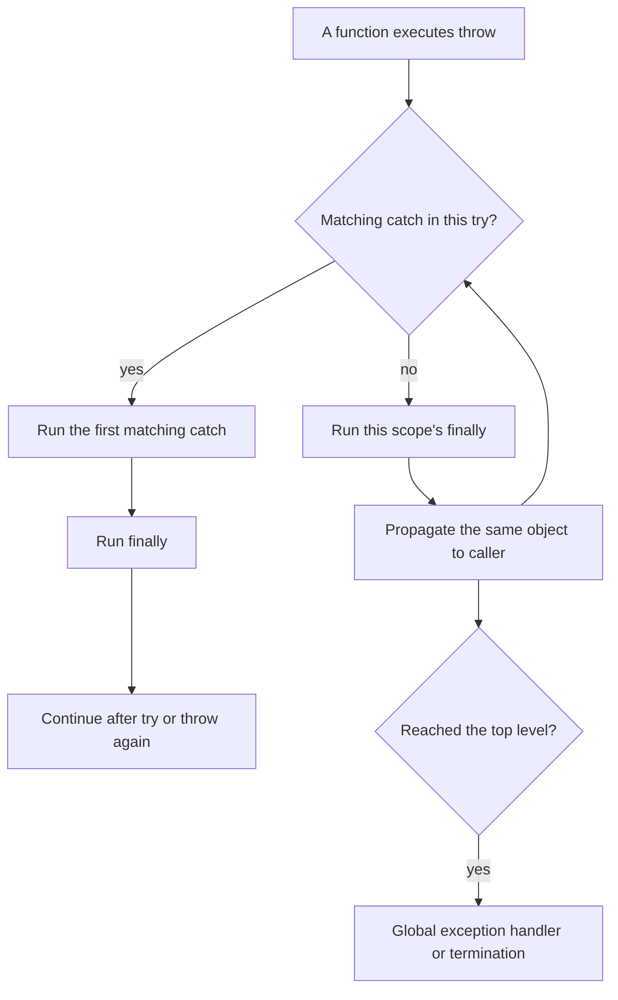

<TLDR>
  <TLDRCell label="what">
    A PHP exception is an object that implements `Throwable`. Throwing one leaves the current path and searches up the call stack for the first type-compatible `catch`.
  </TLDRCell>
  <TLDRCell label="trap">
    `catch (Exception)` misses `Error` objects such as `TypeError`, while an overly broad catch can disguise a programming defect as a recoverable failure.
  </TLDRCell>
  <TLDRCell label="fix">
    Throw a specific type that expresses the contract, catch only where you can recover, translate, or establish a top-level boundary, and use `finally` to release resources owned by that scope.
  </TLDRCell>
</TLDR>

## What it is and why it exists

An <Term id="exception">exception</Term> is an object that describes a failure and a control-flow mechanism. After `throw` executes, PHP stops following the normal path and searches up the call stack for a compatible `catch`. Callers don't have to relay an error code through every layer, and a missed Boolean check can't let code continue with an invalid result.

Every object that can be thrown implements the <Term id="throwable">`Throwable` interface</Term>. It has two direct branches: application code usually throws a subclass of `Exception`, while the PHP engine creates subclasses of `Error` for many type, argument, or arithmetic failures. `catch (Throwable $error)` can receive either branch, but `catch (Exception $error)` covers only the first.

Exceptions fit operations that cannot honor their contract, such as a stock reservation that can't be filled, corrupt file contents, or a failed repository query. An absent optional search result or a form with several ordinary validation problems may be better represented by `null` or an explicit result object. The question isn't whether an error feels serious. It is whether the caller should leave the current normal path, and which layer knows how to recover.

PHP doesn't require a function signature to declare what it may throw, so its exceptions are <Term id="unchecked-exception">unchecked exceptions</Term>. Public methods should document and test important failure contracts. Type names, messages, and previous exceptions are part of that contract; they aren't arbitrary log copy.

This topic covers `throw`, `try`, `catch`, `finally`, custom exception types, and exception chains. PHP diagnostics such as `E_WARNING` and `E_DEPRECATED`, `set_error_handler()`, and conversion to `ErrorException` belong to `php/error-handling`. They use a separate channel and do not automatically become exceptions because code contains a `catch`.

| Failure form | Common source | Local handling entry point | Typical intent |
| --- | --- | --- | --- |
| `Exception` subclass | Application or library code | Catch a concrete class or application base class | Recover, translate, or reject the operation |
| `Error` subclass | PHP engine, though code can throw one explicitly | Usually catch `Throwable` only at a process or request boundary | Record and safely end the current work |
| PHP diagnostic | Engine or `trigger_error()` | Default handler or `set_error_handler()` | Display, record, or explicitly convert |

## How it works

### Throwing and propagation

The operand of `throw` must be a `Throwable`. After it is thrown, the rest of the current function does not run; if the current `try` has no matching `catch`, the object travels to the caller. This is <Term id="error-propagation">error propagation</Term>, and every `finally` block encountered along the way still runs.

The exception object keeps its identity while it propagates. A direct `throw $error` continues with the same object; constructing another object starts a new abstraction layer. If that new object doesn't receive the old object as `$previous`, the low-level cause is no longer available through a programmatic link.



### Type matching and order

PHP checks `catch` blocks in source order, and the first compatible type wins. Put a subclass handler before a parent-class handler, or the parent will take the object first. A union such as `catch (A | B $error)` lets unrelated types share code when they have the same policy; it doesn't create an inheritance relationship between them.

PHP 8 lets you omit the variable when you don't read the object, as in `catch (RetryableFailure) { ... }`. Omit it only when the message, cause, and type truly aren't needed. Removing `$error` to satisfy an unused-variable rule shouldn't also remove necessary recording or exception chaining.

### When `finally` runs

`finally` follows the `try` and all its `catch` blocks. It runs before the structure is left, whether the path returns normally, handles an exception, or keeps propagating one. It suits files, locks, and temporary registrations acquired by the current scope. If acquisition occurs before the `try`, an acquisition failure naturally skips cleanup; if it occurs inside the `try`, cleanup must check whether the resource was actually established.

`finally` isn't a second return point. A `return` there replaces a value already computed by `try` or `catch` and can hide a failure in flight. Cleanup failure also needs an explicit policy, but an unconditional return must not erase the original exception.

### Three useful catch outcomes

A meaningful `catch` normally recovers, translates, or terminates the current boundary. Recovery selects a designed fallback and continues. Translation throws a new exception with clearer meaning at this layer. A top-level boundary records internal detail and exposes only a stable, safe failure representation. Logging one line and continuing is usually none of these.

When translating, pass the original object as the exception constructor's third argument: `new OrderException($message, 0, $error)`. This is <Term id="error-wrapping">error wrapping</Term>. The upper layer can walk the cause chain with `getPrevious()` while depending only on the current layer's public exception type.

## Examples

These three examples progress from a specific exception to semantic layers and `finally` cleanup. Their output was produced with the local PHP 8.3.33 CLI.

### Express a stock failure with a type

`reserveStock()` distinguishes an invalid call from a reservation that the business can't fulfill. The sample caller handles only the `StockUnavailable` it knows how to present. An `InvalidArgumentException` caused by violating the positive-integer contract keeps propagating.

<Depth level="quick">

```php title="reserve_stock.php"
<?php

declare(strict_types=1);

final class StockUnavailable extends RuntimeException {}

function reserveStock(
    string $sku,
    int $requested,
    int $available,
): int {
    if ($requested < 1) {
        throw new InvalidArgumentException('Requested quantity must be positive');
    }

    if ($requested > $available) {
        throw new StockUnavailable(sprintf(
            'requested %d, only %d available',
            $requested,
            $available,
        ));
    }

    return $available - $requested;
}

$requests = [
    ['BK-101', 2, 5],
    ['BK-404', 4, 1],
];

foreach ($requests as [$sku, $requested, $available]) {
    try {
        $left = reserveStock($sku, $requested, $available);
        printf("%s: %d left\n", $sku, $left);
    } catch (StockUnavailable $error) {
        printf("%s: %s\n", $sku, $error->getMessage());
    }
}
```

```text
BK-101: 3 left
BK-404: requested 4, only 1 available
```

</Depth>

The first request returns its remaining stock normally. The second leaves the return path and reaches the type-compatible handler. The handler doesn't catch a broad `RuntimeException`, so another runtime failure can't be mislabeled as insufficient stock.

An exception class need not add properties. A stable, concrete class name is enough for callers to choose a policy without parsing message text that may change.

### Preserve causes across abstraction layers

A repository layer shouldn't expose "replica timed out" as the order service's public contract. It wraps the low-level failure as an inventory lookup failure, then the service adds order-allocation context. Each layer retains the original object through `$previous`.

```php title="exception_chain.php"
<?php

declare(strict_types=1);

final class InventoryLookupException extends RuntimeException {}
final class OrderAllocationException extends RuntimeException {}

function fetchAvailable(string $sku): int
{
    throw new RuntimeException('inventory replica timed out');
}

function loadAvailable(string $sku): int
{
    try {
        return fetchAvailable($sku);
    } catch (RuntimeException $cause) {
        throw new InventoryLookupException(
            "Cannot read stock for {$sku}",
            0,
            $cause,
        );
    }
}

function allocateOrder(string $orderId, string $sku): void
{
    try {
        loadAvailable($sku);
    } catch (InventoryLookupException $cause) {
        throw new OrderAllocationException(
            "Cannot allocate order {$orderId}",
            0,
            $cause,
        );
    }
}

try {
    allocateOrder('ORD-7', 'BK-101');
} catch (OrderAllocationException $error) {
    for ($current = $error; $current !== null; $current = $current->getPrevious()) {
        printf("%s: %s\n", $current::class, $current->getMessage());
    }
}
```

```text
OrderAllocationException: Cannot allocate order ORD-7
InventoryLookupException: Cannot read stock for BK-101
RuntimeException: inventory replica timed out
```

The outer layer depends only on `OrderAllocationException` but can still reach the complete cause chain for diagnostics. The catch type at the order layer can remain stable if the storage client is later replaced.

Don't log and rethrow at every layer, or one failure will create several nearly identical records. Usually the boundary that owns the request ID, job ID, or safe user context should record the full chain once.

### Close an owned resource in `finally`

`parseManifest()` owns the temporary stream it creates, so it also closes it. Even if parsing throws `UnexpectedValueException`, `finally` runs before the exception continues outward.

```php title="manifest_cleanup.php"
<?php

declare(strict_types=1);

function parseManifest(string $line): array
{
    $stream = fopen('php://temp', 'w+');
    if ($stream === false) {
        throw new RuntimeException('Cannot open temporary stream');
    }

    try {
        fwrite($stream, $line);
        rewind($stream);
        $stored = fgets($stream);

        if ($stored === false) {
            throw new UnexpectedValueException('Manifest is empty');
        }

        $parts = explode(':', trim($stored), 2);
        if (count($parts) !== 2) {
            throw new UnexpectedValueException('Manifest must contain sku:quantity');
        }

        return [
            'sku' => $parts[0],
            'quantity' => (int) $parts[1],
        ];
    } finally {
        fclose($stream);
        echo "stream closed\n";
    }
}

try {
    $manifest = parseManifest('BK-101:3');
    printf("%s x %d\n", $manifest['sku'], $manifest['quantity']);
} catch (Throwable $error) {
    printf("failed: %s\n", $error->getMessage());
}
```

```text
stream closed
BK-101 x 3
```

The output order shows that `finally` runs before the function actually returns. Here, `catch (Throwable)` sits at the boundary of the complete CLI job and forms its last failure output. It isn't universal recovery code placed inside the parser.

A real manifest parser must also validate the quantity's text and range. This example demonstrates resource ownership only; using `(int)` as external-input validation would merge malformed text with a legitimate zero.

## Pitfalls

### Treating `Exception` as every failure

> [!PITFALL]
> `catch (Exception $error)` cannot receive `TypeError`, `ValueError`, or other `Error` subclasses. Generated code often leaves boundary cleanup or a unified response uncovered for this reason.

That doesn't mean every local handler should become `Throwable`. Local code should catch the specific failures it can handle. Only the outer <Term id="recovery-boundary">recovery boundary</Term> for a request, message, or CLI command may need `Throwable`, and it will usually roll back, record, and stop the current work.

**Fix:** list the types this layer may recover from or translate, then test one `Exception` subclass and one engine `Error` separately. Catch `Throwable` only when the top-level policy genuinely covers both branches.

### Catching and silently continuing

> [!PITFALL]
> An empty `catch`, or one that only logs and continues, lets later code run after a precondition has failed. The eventual data damage may occur far from the real throw site.

The handler must select a deliberate result: return a designed fallback, translate the failure into the current layer's type, or end the current operation. Logging is not recovery, and writing a record does not make state valid again.

**Fix:** write one testable policy sentence for each `catch`. If you can't explain why the next statement is safe, remove the handler and let the exception reach a caller with more context.

### Breaking the chain while wrapping

> [!PITFALL]
> `throw new RepositoryException('Query failed')` loses the programmatic cause relationship. Copying the old message into the new one still doesn't preserve types or stacks for reliable traversal.

The new message should add current operation context, such as an order ID or storage action, instead of repeating the low-level class name. Sensitive SQL, credentials, or complete requests do not belong in exception messages because those messages may reach logs or development responses.

**Fix:** use `throw new RepositoryException($message, 0, $error)` and test that `getPrevious()` points to the original object. If you only need to continue with the same object, write `throw $error` instead of adding an empty wrapper.

### Returning from `finally`

> [!PITFALL]
> A `return` in `finally` replaces the pending return value from `try` or `catch` and can swallow an exception already in flight. Code that looks like cleanup then changes the business result.

Also inspect complicated cleanup that always throws a new failure. Closing a connection or releasing a lock may fail, but the cleanup policy should preserve diagnostics for the primary failure rather than replacing it accidentally.

**Fix:** keep `finally` to bounded cleanup and don't return from it. Test normal return, handled failure, and unhandled failure paths, confirming that cleanup occurs while the original result stays intact.

### Using exceptions for an ordinary branch

> [!PITFALL]
> Throwing to end a search loop, or treating every "not found" result as an exception, disguises an expected branch as a failure. It also makes the normal result set harder to see from the signature.

Whether "not found" is exceptional depends on the method contract. A search method can return `null`, while a `getRequiredUser()` promise may throw `UserNotFound`. The name and return type should make the distinction visible.

**Fix:** define the normal result set first. Represent expected, frequent negative results with a return value or result object. Throw only when the current operation can't fulfill its promise.

### Exposing internals to users

> [!PITFALL]
> Writing `$error->getMessage()`, file paths, or a <Term id="stack-trace">stack trace</Term> into an HTTP response exposes implementation detail and may also expose queries or personal data.

Public errors and internal diagnostics have different readers. A client needs a stable code and safe wording. Operations logs need the exception type, full chain, correlation ID, and business fields selected by an allowlist.

**Fix:** map the public response at the entry boundary and record internal information centrally. Test that responses contain no paths, stacks, SQL, tokens, or raw request bodies while logs remain sufficient to correlate the failed operation.

## In the AI era

**What generated code gets wrong here**

Models often generate `catch (Exception)` and describe it as catching every error, so common PHP 8 failures such as `TypeError` and `ValueError` escape. They also produce empty handlers, log and rethrow at every layer, omit `$previous` while wrapping, or `return` from `finally`. Another real failure is copying an exception message into a JSON response, leaking file paths, SQL, or upstream-service detail.

**Ask your AI to check**

- List the concrete `Throwable` types each `try` can produce and explain whether every `catch` recovers, translates, or terminates.
- Trace transactions, locks, streams, and temporary handlers across every return and throw path, pairing ownership with `finally` cleanup.
- Find every wrapper and user response; verify that `$previous` is preserved while internal messages, stacks, and secrets stay behind the public boundary.

**Review checklist**

- Send one expected business exception and one `TypeError` through the same entry point, then confirm the catch scope matches the design.
- Assert that rollback or resource release happens exactly once on success, failure, and early return without replacing the original result.
- Check log deduplication, correlation fields, and redaction; the boundary with complete context should record a failure once.

**Prompt vocabulary**

Use the exact terms `Throwable hierarchy`, `first matching catch`, `multi-catch`, `exception propagation`, `exception wrapping`, `previous exception`, `stack unwinding`, `recovery boundary`, and `finally cleanup`. Ask the model for a table of types and resource ownership. That request exposes broad catches and cleanup gaps more reliably than "add error handling."

<Depth level="deep">

## Designing exception contracts

### Custom and SPL types

A user-defined exception must extend `Exception` or one of its subclasses; a PHP class cannot implement `Throwable` directly. A package can declare a marker interface that extends `Throwable`, then make its exceptions both extend `Exception` and implement that marker. Callers can catch package failures while retaining standard exception behavior.

SPL supplies general types such as `InvalidArgumentException`, `LogicException`, `RuntimeException`, and `UnexpectedValueException`. Their names express broad categories, but they don't define your domain contract. If callers need different policies for insufficient stock and storage failure, two concrete application types are more reliable than two `RuntimeException` messages.

| Type choice | Suitable situation | Meaning available to caller |
| --- | --- | --- |
| `InvalidArgumentException` | Caller violates an argument contract | Fix the calling code or input boundary |
| `UnexpectedValueException` | A dependency or data source returns an unacceptable shape | Reject the result and investigate its source |
| Application base class | A package or subsystem needs one boundary | Catch every public exception from that subsystem |
| Concrete domain exception | Callers need a specific recovery policy | Handle a stable business meaning |

Exception types should be stable; messages can improve with diagnostic needs. Don't make callers search strings to decide whether to retry, which HTTP status to show, or which compensation to run. Those policies need concrete subclasses, read-only properties, or another explicit interface.

### Catch location assigns responsibility

Being able to see an exception doesn't mean a layer should catch it. A repository can add query context to a driver failure, but it doesn't know the HTTP status. A controller can form a response, but it shouldn't understand database error codes. Each layer should act only on information and resources it owns.

A useful test is to ask whether the handler can establish a new valid state. Recover if it can choose a dependable fallback. Wrap and propagate if it can only add meaning. Roll back, record, and terminate if the failure has reached the work entry point. Most other locations should let the object keep moving outward.

Transactions make this boundary especially important. The handler around a transaction body should cover every `Throwable` that can leave it, or a `TypeError` may bypass rollback. Rollback itself can fail, so production code needs a policy that preserves both the primary and cleanup failures instead of assuming the second operation always succeeds.

### `finally` and resource ownership

Keep acquisition and release in a nearby lexical scope so a reviewer can verify the pair. A function that creates a file handle should close it. A function that receives a caller-owned connection usually shouldn't close it. `finally` solves the many-exit-path problem; it doesn't replace an ownership convention.

PHP object destructors shouldn't be the only guarantee for business cleanup because their timing and failure handling aren't explicit enough. Files, locks, and transactions need visible close, release, or rollback paths; a destructor is at most a last safeguard. Make the body throw after acquisition in a test to prove that the failure path really cleans up.

### Diagnostics carried by an exception

`Throwable` exposes a message, code, creation file, creation line, stack, and previous object. `getTrace()` or `getTraceAsString()` yields the <Term id="stack-trace">stack trace</Term> that reconstructs the call path. `getPrevious()` expresses the cause relationship across abstraction layers. They complement each other; a concatenated message cannot replace either.

`Exception::$code` is only an integer. It doesn't automatically mean an HTTP status, process exit code, or database error code. If an application needs those concepts, use a named property or mapper so the same number doesn't change meaning between layers. A public interface also shouldn't promise that PHP-generated files and line numbers remain stable.

When recording an exception, start at the outer object and traverse `$previous`, adding a safe request or job identifier. Don't record passwords, tokens, cookies, authorization headers, or unfiltered request bodies. Give public responses a separate stable error code, retaining internal diagnostics without turning implementation detail into a client protocol.

### The last boundary for uncaught failures

A callback registered with `set_exception_handler()` receives only a `Throwable` that no other code caught. PHP doesn't resume at the throw site after the callback returns, so this hook suits final recording and a terminating response. It isn't a jump mechanism for recovering arbitrary business flow.

Web, queue, and CLI boundaries have different contracts. A web entry point must respect any response and content type already sent. A queue worker needs to tell its infrastructure the job failed. A CLI command needs a nonzero exit status. One global handler that always emits HTML often breaks JSON, streamed responses, or background-job protocols.

Frameworks usually own this boundary already. Application code should use the framework's exception mapping, logging, and test entry points instead of registering a competing global handler. If you do register one, verify that bootstrapping happens early enough, the handler cannot fail recursively, and no secret reaches its final output.

</Depth>

<Checkpoint id="php/exceptions" />

## Further reading

- [PHP manual: exceptions](https://www.php.net/manual/en/language.exceptions.php)
- [PHP manual: `Throwable`](https://www.php.net/manual/en/class.throwable.php)
- [PHP manual: `Exception`](https://www.php.net/manual/en/class.exception.php)
- [PHP manual: extending exceptions](https://www.php.net/manual/en/language.exceptions.extending.php)
