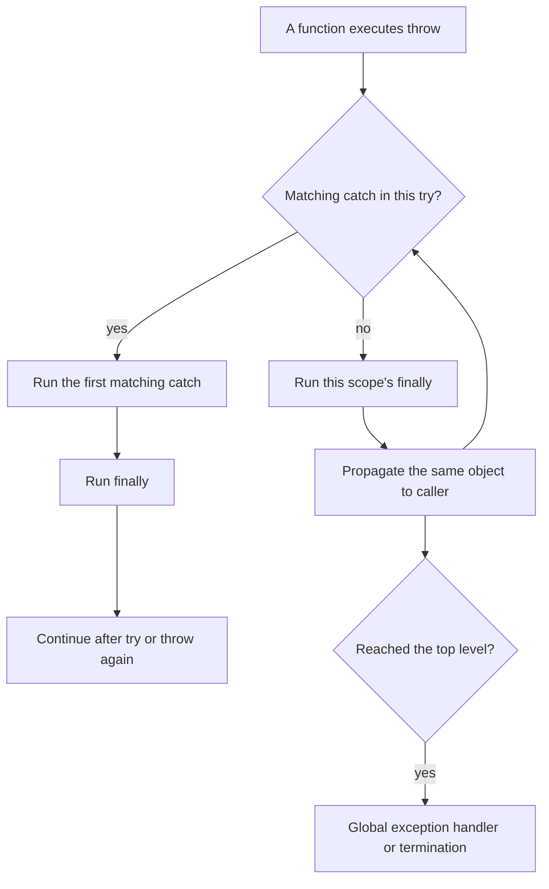

<TLDR>
  <TLDRCell label="what">
    PHP 异常是实现 `Throwable` 的对象。抛出异常会中断当前路径，并沿调用栈寻找第一个类型匹配的 `catch`。
  </TLDRCell>
  <TLDRCell label="trap">
    `catch (Exception)` 接不到 `TypeError` 等 `Error` 对象；过宽的捕获又会把程序缺陷误装成可恢复失败。
  </TLDRCell>
  <TLDRCell label="fix">
    抛出能表达契约的具体类型，只在能够恢复、转换或建立顶层边界的位置捕获，并用 `finally` 释放本层拥有的资源。
  </TLDRCell>
</TLDR>

## 是什么，为什么存在

<Term id="exception">异常（exception）</Term>是描述失败的对象，也是一种控制流机制。执行 `throw` 后，PHP 不再继续当前语句后的正常路径，而是沿调用栈查找兼容的 `catch`。调用者无需让每一层都返回错误码，也不会因为漏查一个布尔值而继续使用无效结果。

可抛出的对象都实现<Term id="throwable">`Throwable` 接口</Term>。它有两个直接分支：应用代码通常抛出 `Exception` 的子类，PHP 引擎则会为许多类型、参数或算术失败创建 `Error` 的子类。二者都能被 `catch (Throwable $error)` 捕获，但 `catch (Exception $error)` 只覆盖前一个分支。

异常适合表示某次操作无法履行契约，例如库存不足、文件内容损坏或仓储查询失败。缺少可选搜索结果、验证表单时发现多个普通问题等情况，可能更适合 `null` 或显式结果对象。判断标准不是“错误是否严重”，而是调用者是否应离开当前正常路径，以及哪一层掌握恢复办法。

PHP 不要求函数在签名中声明可能抛出的类型，因此其异常属于<Term id="unchecked-exception">非检查型异常（unchecked exception）</Term>。公共方法应在文档和测试中说明重要的失败契约。类型名称、消息和前一个异常共同构成这份契约的一部分，不能把它们当成随意的日志文案。

这个主题处理 `throw`、`try`、`catch`、`finally`、自定义异常和异常链。PHP 的 `E_WARNING`、`E_DEPRECATED`、`set_error_handler()` 与 `ErrorException` 转换属于 `php/error-handling`；它们是另一条诊断通道，不会因为写了 `catch` 就自动变成异常。

| 失败形式 | 常见来源 | 本地处理方式 | 典型意图 |
| --- | --- | --- | --- |
| `Exception` 子类 | 应用或库代码 | 捕获具体类或其业务基类 | 恢复、转换或拒绝操作 |
| `Error` 子类 | PHP 引擎，也可由代码显式抛出 | 通常只在进程或请求边界捕获 `Throwable` | 记录并安全终止当前工作 |
| PHP 诊断 | 引擎或 `trigger_error()` | 默认处理器或 `set_error_handler()` | 展示、记录或显式转换 |

## 工作原理

### 抛出与传播

`throw` 的操作数必须是 `Throwable`。抛出后，当前函数余下的语句不会执行；如果当前 `try` 没有匹配的 `catch`，对象会向调用者传播。这个过程称为<Term id="error-propagation">错误传播（error propagation）</Term>，沿途遇到的 `finally` 块仍会执行。

异常对象在传播时保持身份不变。直接写 `throw $error` 会继续传播同一个对象；创建新对象则开始一个新的抽象层。若新对象没有把原对象传给 `$previous`，底层原因就不再能通过程序接口访问。



### 类型匹配与顺序

PHP 按源码顺序检查 `catch`，第一个兼容类型获胜。子类处理器应写在父类处理器前面，否则父类会先接走对象。一个 `catch (A | B $error)` 可以让互不相关、处理政策相同的类型共用代码；它不会改变两种异常的继承关系。

PHP 8 允许在不读取对象时省略变量，例如 `catch (RetryableFailure) { ... }`。只有确实不需要消息、原因或类型时才省略。为了消除未使用变量而删掉 `$error`，不应顺手删掉记录或异常链。

### `finally` 的时机

`finally` 位于 `try` 和所有 `catch` 之后，无论正常返回、已经捕获，还是继续向外传播，都会在离开该结构前执行。它适合释放由当前作用域取得的文件句柄、锁或临时注册。资源的取得发生在 `try` 之前时，取得失败自然不会进入清理；发生在 `try` 内时，清理代码必须能判断资源是否真的建立。

`finally` 不是第二个返回点。放在其中的 `return` 会覆盖 `try` 或 `catch` 已经算出的返回值，也可能掩盖正在传播的失败。清理失败本身也需要明确政策，但不应通过无条件返回让原始异常消失。

### 捕获后的三种动作

一个有意义的 `catch` 通常会恢复、转换或终止当前边界。恢复意味着选用明确的后备结果并继续；转换意味着抛出本层语义更清楚的新异常；顶层边界则记录内部细节，对外只返回稳定且安全的失败表示。仅记录一行然后继续，往往不属于任何一种。

转换时把原始对象传给异常构造器的第三个参数：`new OrderException($message, 0, $error)`。这叫<Term id="error-wrapping">错误包装（error wrapping）</Term>。上层可以用 `getPrevious()` 遍历原因链，同时只依赖当前层公开的异常类型。

## 示例

下面三个示例依次展示具体异常、自定义语义层和 `finally` 清理。输出由本地 PHP 8.3.33 CLI 实际执行得到。

### 用具体类型表达库存失败

`reserveStock()` 把非法调用和业务上无法满足的预订区分开。示例调用方只处理它知道怎样展示的 `StockUnavailable`；若自身违反了正整数契约，`InvalidArgumentException` 会继续向外传播。

<Depth level="quick">

```php title="reserve_stock.php"
<?php

declare(strict_types=1);

final class StockUnavailable extends RuntimeException {}

function reserveStock(
    string $sku,
    int $requested,
    int $available,
): int {
    if ($requested < 1) {
        throw new InvalidArgumentException('Requested quantity must be positive');
    }

    if ($requested > $available) {
        throw new StockUnavailable(sprintf(
            'requested %d, only %d available',
            $requested,
            $available,
        ));
    }

    return $available - $requested;
}

$requests = [
    ['BK-101', 2, 5],
    ['BK-404', 4, 1],
];

foreach ($requests as [$sku, $requested, $available]) {
    try {
        $left = reserveStock($sku, $requested, $available);
        printf("%s: %d left\n", $sku, $left);
    } catch (StockUnavailable $error) {
        printf("%s: %s\n", $sku, $error->getMessage());
    }
}
```

```text
BK-101: 3 left
BK-404: requested 4, only 1 available
```

</Depth>

第一个请求正常返回剩余库存。第二个请求跳过正常返回路径，由类型匹配的 `catch` 生成可预期输出。处理器没有捕获宽泛的 `RuntimeException`，因此其他运行时故障不会被误报成库存不足。

异常类可以不增加任何属性。仅仅拥有稳定而具体的类名，就能让调用方按语义选择政策，而不必解析容易变化的消息文本。

### 在抽象层之间保留原因

仓储层不应把“副本超时”直接暴露成订单服务的公共契约。它把底层失败包装为库存查询失败，服务层再添加订单分配语境；每层都通过 `$previous` 保留原始对象。

```php title="exception_chain.php"
<?php

declare(strict_types=1);

final class InventoryLookupException extends RuntimeException {}
final class OrderAllocationException extends RuntimeException {}

function fetchAvailable(string $sku): int
{
    throw new RuntimeException('inventory replica timed out');
}

function loadAvailable(string $sku): int
{
    try {
        return fetchAvailable($sku);
    } catch (RuntimeException $cause) {
        throw new InventoryLookupException(
            "Cannot read stock for {$sku}",
            0,
            $cause,
        );
    }
}

function allocateOrder(string $orderId, string $sku): void
{
    try {
        loadAvailable($sku);
    } catch (InventoryLookupException $cause) {
        throw new OrderAllocationException(
            "Cannot allocate order {$orderId}",
            0,
            $cause,
        );
    }
}

try {
    allocateOrder('ORD-7', 'BK-101');
} catch (OrderAllocationException $error) {
    for ($current = $error; $current !== null; $current = $current->getPrevious()) {
        printf("%s: %s\n", $current::class, $current->getMessage());
    }
}
```

```text
OrderAllocationException: Cannot allocate order ORD-7
InventoryLookupException: Cannot read stock for BK-101
RuntimeException: inventory replica timed out
```

最外层只需要依赖 `OrderAllocationException`，却仍能在诊断时访问完整原因链。若以后替换存储客户端，订单层的捕获类型可以保持不变。

不要在每层都记录再抛出，否则一次失败会制造多条近似日志。通常由拥有请求 ID、任务 ID 或用户安全上下文的边界记录整条链。

### 用 `finally` 关闭本层资源

`parseManifest()` 拥有它创建的临时流，因此也负责关闭。即使解析抛出 `UnexpectedValueException`，`finally` 仍会在异常继续传播前运行。

```php title="manifest_cleanup.php"
<?php

declare(strict_types=1);

function parseManifest(string $line): array
{
    $stream = fopen('php://temp', 'w+');
    if ($stream === false) {
        throw new RuntimeException('Cannot open temporary stream');
    }

    try {
        fwrite($stream, $line);
        rewind($stream);
        $stored = fgets($stream);

        if ($stored === false) {
            throw new UnexpectedValueException('Manifest is empty');
        }

        $parts = explode(':', trim($stored), 2);
        if (count($parts) !== 2) {
            throw new UnexpectedValueException('Manifest must contain sku:quantity');
        }

        return [
            'sku' => $parts[0],
            'quantity' => (int) $parts[1],
        ];
    } finally {
        fclose($stream);
        echo "stream closed\n";
    }
}

try {
    $manifest = parseManifest('BK-101:3');
    printf("%s x %d\n", $manifest['sku'], $manifest['quantity']);
} catch (Throwable $error) {
    printf("failed: %s\n", $error->getMessage());
}
```

```text
stream closed
BK-101 x 3
```

输出顺序说明 `finally` 在函数真正返回之前运行。这里的 `catch (Throwable)` 位于完整 CLI 工作的外边界，用于形成最后的失败输出，不是放在解析函数内部的万能恢复代码。

真实清单解析还应验证数量文本与范围。本例只演示资源所有权；把 `(int)` 当成外部输入验证会合并非法文本与合法的零值。

## 陷阱

### 把 `Exception` 当成全部失败

> [!PITFALL]
> `catch (Exception $error)` 无法捕获 `TypeError`、`ValueError` 和其他 `Error` 子类。生成代码经常因此漏掉边界清理或统一响应。

这不代表每个局部处理器都应改成 `Throwable`。局部代码应捕获它能处理的具体失败；请求、消息或 CLI 命令的最外层<Term id="recovery-boundary">恢复边界（recovery boundary）</Term>才可能需要 `Throwable`，而且通常只负责回滚、记录和结束当前工作。

**修复：** 先列出本层允许恢复或转换的类型，并分别测试一个 `Exception` 子类和一个引擎 `Error`。只有顶层政策确实覆盖两条分支时才捕获 `Throwable`。

### 捕获后静默继续

> [!PITFALL]
> 空 `catch` 或只写日志后继续，会让后续代码在前置条件已经失败时运行。最后出现的数据损坏往往离真正的抛出点很远。

处理器必须选定明确结果：返回经过设计的后备值、把失败转换为当前层类型，或者结束当前操作。日志不是恢复策略，写过日志也不表示状态重新有效。

**修复：** 为每个 `catch` 写一句可测试的政策说明。说不出后续为何安全，就删除该处理器，让异常传播到更了解上下文的调用方。

### 包装时切断异常链

> [!PITFALL]
> `throw new RepositoryException('Query failed')` 会丢掉原对象的可编程原因关系。仅把旧消息拼进新消息，仍然无法可靠遍历类型和堆栈。

新消息应增加当前操作语境，例如订单 ID 或存储动作，而不是复制底层类名。敏感 SQL、凭据或完整请求不应放进异常消息，因为它们可能进入日志或开发响应。

**修复：** 使用 `throw new RepositoryException($message, 0, $error)`，并测试 `getPrevious()` 指向原对象。若只是原样继续传播，就写 `throw $error`，不要无意义地换壳。

### 在 `finally` 中返回

> [!PITFALL]
> `finally` 中的 `return` 会取代 `try` 或 `catch` 的待返回值，还可能吞掉正在传播的异常。代码表面像清理，实际却改变了业务结果。

同样要警惕会无条件抛出新失败的复杂清理。关闭连接或释放锁可能失败，但清理政策应保留主失败的诊断信息，不能偶然把它覆盖。

**修复：** 让 `finally` 只做有界清理，不在其中返回。分别测试正常返回、已捕获异常和未捕获异常三条路径，确认清理发生且原结果保持不变。

### 用异常表示普通分支

> [!PITFALL]
> 在循环中靠抛出结束查找，或把每次“未找到”都当异常，会把预期分支伪装成故障。调用者也更难从签名看出正常结果集合。

“未找到”是否异常取决于方法契约。搜索方法可以返回 `null`，而承诺必须取得实体的 `getRequiredUser()` 则可以抛出 `UserNotFound`。名称和返回类型应让区别清楚。

**修复：** 先写出正常结果集合。预期且频繁的否定结果使用返回值或结果对象；只有无法履行当前操作承诺时才抛出异常。

### 把内部细节交给用户

> [!PITFALL]
> 直接把 `$error->getMessage()`、文件路径或<Term id="stack-trace">堆栈跟踪（stack trace）</Term>写入 HTTP 响应，会暴露内部结构，有时还包含查询或个人数据。

公开错误与内部诊断服务于不同读者。客户端需要稳定代码和安全文案；运维日志需要异常类型、完整链、关联 ID 与经过允许列表筛选的业务字段。

**修复：** 在入口边界映射公开响应，并集中记录内部信息。测试响应不含路径、堆栈、SQL、令牌和原始请求体，同时确认日志仍足以关联失败操作。

<Depth level="deep">

## 设计异常契约

### 自定义类型与 SPL 类型

用户定义的异常必须继承 `Exception` 或其子类；PHP 类不能直接实现 `Throwable`。一个包可以声明继承 `Throwable` 的标记接口，再让自己的异常同时继承 `Exception` 并实现该接口。这样调用方既能捕获包级失败，也能继续使用标准异常行为。

SPL 提供 `InvalidArgumentException`、`LogicException`、`RuntimeException`、`UnexpectedValueException` 等通用类型。它们的名称表达宽泛类别，却不会替你定义领域契约。如果调用方需要把库存不足与存储故障采取不同政策，两个具体应用类型比两个相同的 `RuntimeException` 消息更可靠。

| 类型选择 | 适用情形 | 调用方可依赖的含义 |
| --- | --- | --- |
| `InvalidArgumentException` | 调用者违反参数契约 | 修正调用代码或输入边界 |
| `UnexpectedValueException` | 依赖或数据源返回不可接受的形状 | 拒绝该结果并调查来源 |
| 应用基类 | 一个包或子系统的失败需要统一边界 | 捕获该子系统公开的全部异常 |
| 具体领域异常 | 调用方需要选择专门恢复政策 | 按稳定业务语义处理 |

异常类型应该稳定，消息可以随诊断需求改进。不要要求调用方用字符串包含关系判断是否重试、显示哪个状态码或执行哪种补偿；这些政策需要具体子类、只读属性或其他明确接口。

### 捕获位置决定责任

能看见异常不等于应该捕获。仓储层知道怎样给驱动失败增加查询语境，却不知道 HTTP 状态；控制器知道怎样形成响应，却不应理解数据库错误码。每层只做自己拥有的信息和资源允许它完成的动作。

一个好用的判断方法是问：处理器运行后，当前层能否建立新的有效状态。如果能选出可靠后备值，就恢复；如果只能增加语义，就包装并传播；如果已经到达工作入口，就回滚、记录并结束。其他位置通常让对象继续向外走。

事务尤其需要清楚的边界。`catch` 应覆盖事务体可能抛出的全部 `Throwable`，否则 `TypeError` 可能绕过回滚。回滚本身也可能失败，所以生产代码需要决定如何同时保留主失败与清理失败，而不是假设第二次操作永远成功。

### `finally` 与资源所有权

把取得资源与释放资源放在相邻词法范围，审查者才能确认配对。函数创建文件句柄就由函数关闭；调用者传入连接时，函数通常不应擅自关闭。`finally` 解决“离开路径很多”的问题，不替代所有权约定。

PHP 对象析构函数不适合作为业务清理的唯一保证，因为执行时机和失败处理都不够明确。文件、锁和事务应有显式关闭、释放或回滚路径，析构最多充当最后保险。测试时故意让主体在取得资源后抛出，才能证明失败路径真的清理。

### 异常对象保存的诊断

`Throwable` 提供消息、代码、创建文件、创建行号、堆栈和前一个对象。`getTrace()` 或 `getTraceAsString()` 返回<Term id="stack-trace">堆栈跟踪</Term>，用于重建调用路径；`getPrevious()` 则表达跨抽象层的原因关系。两者互补，不能用一段拼接消息替代。

`Exception::$code` 只是整数，没有自动等同于 HTTP 状态、进程退出码或数据库错误码。若应用需要这些概念，应使用命名属性或映射器，避免同一个数字在不同层改变含义。公开接口也不应承诺 PHP 自动生成的文件和行号长期稳定。

记录异常时从最外层遍历 `$previous`，并添加安全的请求或任务标识。不要记录密码、令牌、Cookie、授权头或未经筛选的请求体。对外响应使用独立的稳定错误码，既保留内部诊断，又避免让实现细节成为客户端协议。

### 未捕获异常的最后边界

`set_exception_handler()` 注册的回调只接收没有被其他代码捕获的 `Throwable`。处理器返回后，PHP 不会回到抛出点继续正常工作，因此它适合最后记录和生成终止响应，不是恢复任意业务流程的跳转机制。

Web、队列和 CLI 的边界不同。Web 入口需要尊重已经发送的响应与内容类型；队列工作进程需要让基础设施知道任务失败；CLI 需要非零退出状态。共享一个格式固定的全局 HTML 处理器，常会破坏 JSON、流式响应或后台任务协议。

框架通常已经拥有这个边界。应用代码应使用框架提供的异常映射、日志与测试入口，而不是再注册一个竞争的全局处理器。若确实自行注册，就要验证引导阶段足够早、处理器自身不会再次失败，并且秘密不会进入最终输出。

</Depth>

<Checkpoint id="php/exceptions" />

## 延伸阅读

- [PHP 手册：异常](https://www.php.net/manual/en/language.exceptions.php)
- [PHP 手册：`Throwable`](https://www.php.net/manual/en/class.throwable.php)
- [PHP 手册：`Exception`](https://www.php.net/manual/en/class.exception.php)
- [PHP 手册：扩展异常](https://www.php.net/manual/en/language.exceptions.extending.php)
