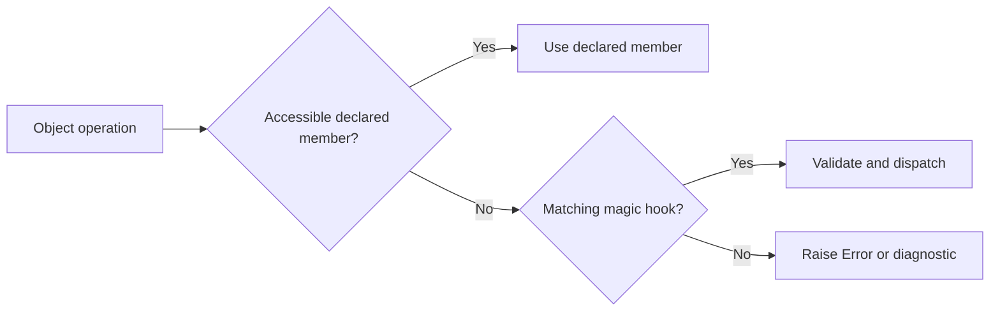

<TLDR>
  <TLDRCell label="what">
    A <Term id="magic-method">magic method</Term> is a `__*` hook that PHP calls for a specific object operation. These methods define how an object handles inaccessible members, string contexts, invocation, cloning, and serialization.
  </TLDRCell>
  <TLDRCell label="trap">
    Hooks aren't universal interceptors. Returning `null`, forwarding arbitrary names, or serializing every property hides typos, widens an interface, and leaks internal state.
  </TLDRCell>
  <TLDRCell label="fix">
    Define the trigger and public contract first, then use name allowlists, exact signatures, and explicit state arrays. Put resource release and untrusted-input parsing behind explicit boundaries instead of destructors or `unserialize()`.
  </TLDRCell>
</TLDR>

## What it is and why it exists

PHP magic methods are double-underscore methods that the engine calls according to a protocol. Business code usually doesn't call them directly. It reads a property, calls a method, uses `clone`, calls `serialize()`, or requests a string conversion; the engine recognizes the operation-method pair and gives the object control.

These hooks adapt behavior at the edges of the object model. An object can map dynamic fields into an internal array, act as a callable strategy, or restore its invariants during copying and persistence. Framework models, proxies, lazy loaders, and test doubles often use them, but an ordinary domain object may need none.

PHP <Term id="property-overloading">property overloading</Term> isn't Java- or C++-style selection by parameter signature. It means dynamically handling a read, write, existence check, or deletion of an inaccessible property. Inaccessible includes an undefined property and a `private` or `protected` property that the current calling scope can't access.

PHP reserves the double-underscore prefix. Don't invent application protocols such as `__publish()` unless the manual defines that magic method. Business entry points should be ordinary methods so callers, IDEs, and static analyzers can see the contract.

The common hooks group by triggering operation:

| Operation | Magic methods | Trigger |
| --- | --- | --- |
| Lifecycle | `__construct()`, `__destruct()` | Object creation, object destruction, or shutdown |
| Properties | `__get()`, `__set()`, `__isset()`, `__unset()` | The corresponding operation on an inaccessible property |
| Methods | `__call()`, `__callStatic()` | An inaccessible instance or static method call |
| Representation and calls | `__toString()`, `__invoke()`, `__set_state()`, `__debugInfo()` | String conversion, function-style call, export restoration, or debug output |
| Copy and storage | `__clone()`, `__serialize()`, `__unserialize()` | Cloning, serializing, or unserializing an object |
| Legacy storage hooks | `__sleep()`, `__wakeup()` | Customizing the legacy path when new serialization hooks aren't defined |

## How it works

A specific syntax form or built-in function triggers each magic method; magic methods don't take over every operation on an object. Reading an accessible declared property reads it directly, and calling an accessible declared method executes it directly. A property or method overloading hook gets a chance only when ordinary lookup can't complete the current operation.

The simplified flow for one operation looks like this. Each hook receives different arguments and returns a different type, but all should translate an engine entry point into a narrow, testable object contract.



### Property access is a protocol family

`__get(string $name): mixed` handles reads, and `__set(string $name, mixed $value): void` handles writes. `__isset(string $name): bool` decides the result of `isset()` and is also consulted by `empty()`; if the result says a value exists, `empty()` may then read that value. `__unset(string $name): void` handles deletion.

All four methods should share one policy for names, nullability, and write access. If `__get()` accepts `nickname => null`, `__isset()` can still return `false` according to native `isset()` semantics, but an unknown name shouldn't silently become the same `null`. Use `array_key_exists()` when internal storage must distinguish a missing key from a key whose value is `null`.

### Method overloading is fallback dispatch

`__call(string $name, array $arguments): mixed` handles an inaccessible instance method, and `__callStatic(string $name, array $arguments): mixed` handles the static equivalent. The latter must be declared `static`. Both the name and arguments are runtime data, so the hook must enforce its own allowlist, arity, and type checks.

Don't forward `$name` to a service object without restriction. Doing so makes the proxy's public interface change with the service implementation and can expose methods callers shouldn't trigger. An explicit `match` or a closed name-to-closure map is easier to review.

### Conversion, invocation, and object state

A string context calls `__toString(): string`. PHP also treats a class with this method as implementing `Stringable`, though declaring the interface makes the intent clearer. Parentheses after an object call `__invoke()`, so such an instance can be passed to an API that expects a <Term id="callback">callback</Term>.

`clone` first makes a shallow property copy and then calls `__clone()` on the new object. `serialize()` prefers the state array supplied by `__serialize()`, while `unserialize()` uses `__unserialize()` to restore state. A constructor doesn't replace the unserialization hook, so restoration must establish valid state itself.

## Examples

These four examples progress through a property protocol, restricted method dispatch, a callable value object, and cloning plus serialization. Every output shown came from running the corresponding file with local PHP 8.3.33.

### Building a strict property protocol

`Profile` permits only three dynamic names and keeps their data in one declared array. Reading an unknown name fails, so a capitalization typo can't masquerade as a missing value.

<Depth level="quick">

```php title="profile.php"
<?php

declare(strict_types=1);

final class Profile
{
    private const ALLOWED = ['displayName', 'timezone', 'nickname'];

    public function __construct(private array $values = []) {}

    public function __get(string $name): mixed
    {
        if (!array_key_exists($name, $this->values)) {
            throw new OutOfBoundsException("Unknown property: {$name}");
        }
        return $this->values[$name];
    }

    public function __set(string $name, mixed $value): void
    {
        if (!in_array($name, self::ALLOWED, true) || !is_string($value)) {
            throw new InvalidArgumentException("Invalid property: {$name}");
        }
        $this->values[$name] = $value;
    }

    public function __isset(string $name): bool
    {
        return isset($this->values[$name]);
    }
}

$profile = new Profile(['nickname' => null]);
$profile->displayName = 'Ada';
$profile->timezone = 'UTC';
echo "{$profile->displayName} @ {$profile->timezone}\n";
echo 'nickname set: ', isset($profile->nickname) ? 'yes' : 'no', "\n";

try {
    echo $profile->timeZone;
} catch (OutOfBoundsException $error) {
    echo $error->getMessage(), "\n";
}
```

```text
Ada @ UTC
nickname set: no
Unknown property: timeZone
```

<TryToBreak items={['set nickname to an empty string', 'read locale, which is not allowlisted', 'assign an integer to timezone']} />

</Depth>

The constructor state contains `nickname => null`, so reading that property is legal while `isset()` still returns `false` under native null semantics. If the domain needs a key-presence query, add a separate named method instead of changing the familiar meaning of `isset()`.

`__set()` doesn't execute `$this->{$name} = $value`. That form creates a real dynamic property and enters a deprecation path on PHP 8.2 and later. An internal array also centralizes the name and type policy.

### Restricting dynamic method dispatch

`OrderActions` exposes two dynamic actions without handing every name to its implementation. The hook validates the method name, argument count, and order ID type together.

```php title="actions.php"
<?php

declare(strict_types=1);

final class OrderActions
{
    public function __call(string $name, array $arguments): string
    {
        if (!in_array($name, ['cancel', 'resendReceipt'], true)) {
            throw new BadMethodCallException("Unsupported action: {$name}");
        }
        if (count($arguments) !== 1 || !is_int($arguments[0])) {
            throw new InvalidArgumentException('Expected one integer order ID');
        }

        return match ($name) {
            'cancel' => $this->cancelOrder($arguments[0]),
            'resendReceipt' => $this->resend($arguments[0]),
        };
    }

    private function cancelOrder(int $orderId): string
    {
        return "Order {$orderId} cancelled";
    }

    private function resend(int $orderId): string
    {
        return "Receipt {$orderId} resent";
    }
}

$actions = new OrderActions();
echo $actions->cancel(17), "\n";
echo $actions->resendReceipt(23), "\n";

try {
    echo $actions->delete(31);
} catch (BadMethodCallException $error) {
    echo $error->getMessage(), "\n";
}
```

```text
Order 17 cancelled
Receipt 23 resent
Unsupported action: delete
```

The allowlist is this object's real public protocol. If the actions are stable, directly declaring `cancel(int $orderId)` and `resendReceipt(int $orderId)` is usually better. Dynamic dispatch fits a narrow boundary whose name set comes from explicit metadata.

The example doesn't use `method_exists()` as an authorization check. That function answers whether a method exists in the implementation, not whether a caller should access it or whether the current scope can call it legally.

### Using an object as a function and string

The discount object stores validated basis points and exposes one main operation through `__invoke()`. Its `__toString()` produces only a concise human-readable label, not a JSON or persistence protocol.

```php title="discount.php"
<?php

declare(strict_types=1);

final class PercentageDiscount implements Stringable
{
    public function __construct(private int $basisPoints)
    {
        if ($basisPoints < 0 || $basisPoints > 10_000) {
            throw new InvalidArgumentException('Invalid discount');
        }
    }

    public function __invoke(int $priceInCents): int
    {
        return intdiv($priceInCents * (10_000 - $this->basisPoints), 10_000);
    }

    public function __toString(): string
    {
        return number_format($this->basisPoints / 100, 2) . '% off';
    }
}

$discount = new PercentageDiscount(1_500);
echo $discount, "\n";
echo 'callable: ', is_callable($discount) ? 'yes' : 'no', "\n";
printf("final price: $%.2f\n", $discount(12_000) / 100);
```

```text
15.00% off
callable: yes
final price: $102.00
```

The amount uses integer cents so the example doesn't mix binary floating-point rounding into a magic-method lesson. `__invoke()` parameters and return values remain ordinary PHP type contracts; calling an object doesn't bypass type checking.

The string form is an <Term id="object-representation">object representation</Term>. This `__toString()` result is suitable for a log label or UI fragment but shouldn't be parsed back; machine protocols need explicit fields and versioned formats.

### Separating copied state from persistent state

The cart clones its owned address and drops a session token. The modern serialization hooks keep only business state. This example unserializes only bytes that the same process has just produced and therefore trusts.

```php title="cart.php"
<?php

declare(strict_types=1);

final class Address
{
    public function __construct(public string $city) {}
}

final class CartDraft
{
    public function __construct(
        public Address $address,
        private array $items,
        private string $sessionToken,
    ) {}

    public function __clone(): void
    {
        $this->address = clone $this->address;
        $this->sessionToken = '';
    }

    public function __serialize(): array
    {
        return ['address' => $this->address, 'items' => $this->items];
    }

    public function __unserialize(array $data): void
    {
        if (!($data['address'] ?? null) instanceof Address || !is_array($data['items'] ?? null)) {
            throw new UnexpectedValueException('Invalid cart data');
        }
        $this->address = $data['address'];
        $this->items = $data['items'];
        $this->sessionToken = '';
    }

    public function hasSessionToken(): bool
    {
        return $this->sessionToken !== '';
    }
}

$original = new CartDraft(new Address('Paris'), ['BK-1' => 2], 'secret');
$copy = clone $original;
$copy->address->city = 'Lyon';
$restored = unserialize(serialize($original), [
    'allowed_classes' => [CartDraft::class, Address::class],
]);

echo "original: {$original->address->city}\n";
echo "copy: {$copy->address->city}\n";
echo 'clone token: ', $copy->hasSessionToken() ? 'yes' : 'no', "\n";
echo "restored: {$restored->address->city}\n";
echo 'restored token: ', $restored->hasSessionToken() ? 'yes' : 'no', "\n";
```

```text
original: Paris
copy: Lyon
clone token: no
restored: Paris
restored token: no
```

Without `__clone()`, both carts would point to the same `Address`, and changing the copy's city would change the original. A <Term id="deep-copy">deep copy</Term> doesn't mean mechanically cloning every object. This implementation copies the mutable value the cart owns and explicitly resets an ephemeral credential.

`allowed_classes` narrows the types this trusted example can restore, but it isn't a safety promise for attacker-controlled input. External JSON, cookies, or database fields should use a data-only format, strict schema validation, and explicit construction.

## Pitfalls

### Treating a hook as a universal interceptor

> [!PITFALL]
> `__get()` doesn't observe an ordinary read of an accessible public property, and `__call()` doesn't wrap a declared public method. Putting all authorization, auditing, or caching in these fallback hooks leaves bypass paths.

**Fix:** enumerate the triggering syntax, member visibility, and expected hook. Cross-cutting logic that must cover every call belongs in an explicit service, decorator, or unified entry point rather than lookup failure.

### Swallowing name errors as `null`

> [!PITFALL]
> Returning `null` for every unknown property makes `$order->statsu` look like a valid missing value. If `__isset()`, `__get()`, and `__unset()` use different name rules, one property also presents contradictory states across operations.

**Fix:** share one allowlist and distinguish unknown, missing, and explicitly `null`. Throw a name-bearing exception for an unknown member and handle an optional field through a documented nullable contract.

### Forwarding methods without restriction

> [!PITFALL]
> `$service->$name(...$arguments)` turns a caller-supplied name into a capability choice. When the service gains a public maintenance method, the proxy may expose it without any proxy code change.

**Fix:** map external names to fixed actions, validate each argument list, and reject everything else. Prefer ordinary named methods and an interface when the set is fixed; `method_exists()` isn't an authorization policy.

### Depending on a destructor for critical work

> [!PITFALL]
> Cycles, garbage collection, and script shutdown affect when `__destruct()` runs. Putting a transaction commit, queue acknowledgment, or only remote write there makes correctness depend on an uncontrolled lifetime.

**Fix:** give the resource a `close()`, `commit()`, or scoped management method and pair it with `try`/`finally`. A destructor may perform small, idempotent local fallback cleanup, but it isn't a business success signal.

### Serializing the whole object state

> [!PITFALL]
> `get_object_vars($this)` may include tokens, connections, closures, caches, and framework services. It turns internal field names into a durable format and may restore an object that hasn't passed constructor validation.

**Fix:** make `__serialize()` return only necessary, versioned data. Make `__unserialize()` validate keys, types, and invariants and establish safe defaults for ephemeral dependencies. A password or token isn't confidential merely because it sits in a private property.

### Calling `unserialize()` on untrusted bytes

> [!PITFALL]
> Attacker-controlled serialized data can construct an object graph and engage autoloading and magic hooks. Restricting allowed classes doesn't turn this format into a generally safe input protocol.

**Fix:** use a data-only format such as JSON at external boundaries, then validate and construct domain objects explicitly. When PHP serialized data must be read from trusted storage, verify its integrity and minimize the restorable class set.

## In the AI era

**What generated code gets wrong here**

Models often generate a `__get()` that returns `null` for every name or a `__set()` that executes `$this->{$name} = $value`, hiding typos and creating deprecated dynamic properties. They also build unrestricted proxies with `call_user_func_array([$service, $name], $arguments)`, serialize the entire result of `get_object_vars()`, or put buffer flushes and transaction commits in `__destruct()`. These implementations may pass a one-path demo but don't define unknown names, nullable fields, hostile method names, nested-object copies, or abnormal process exit.

**Ask your AI to check**

- List the exact triggering operation for every magic method and give one control operation that doesn't trigger it.
- Trace each external name to its final property or method, marking allowlists, type checks, authorization, and rejection paths.
- Inventory clone and serialization state, separating owned objects, shared services, secrets, temporary caches, and fields that restoration must rebuild.

**Review checklist**

- Test fallback hooks with a typo, case variant, unknown method, extra argument, and explicit `null`.
- Mutate every nested mutable object in a clone and verify that the original shares only contractually shared references.
- Inspect serialized bytes for secrets and prove critical cleanup completes without relying on a destructor call.

**Prompt vocabulary**

Use the exact terms `magic method`, `property overloading`, `inaccessible member`, `fallback dispatch`, `dynamic property`, `shallow copy`, `deep copy`, `serialization hook`, and `object injection`. Ask for a trigger matrix, name allowlist, and state-ownership table; “add magic methods to this class” is too vague to reveal the hidden contract.

<Depth level="deep">

## Signatures, visibility, and inheritance

PHP 8.3 checks the fixed signatures of most magic methods. Every magic method except `__construct()`, `__destruct()`, and `__clone()` must be `public`; unsuitable visibility produces a diagnostic. `__callStatic()` must be static, while the other non-static hooks can't be changed to static methods for convenience.

| Method | Key signature constraint | Return responsibility |
| --- | --- | --- |
| `__get` | One `string` name | The property value |
| `__set` | A `string` name and `mixed` value | `void` |
| `__isset` | One `string` name | `bool` |
| `__call` | A `string` name and `array` arguments | The dynamic result |
| `__callStatic` | Same as `__call`, and `static` | The dynamic result |
| `__toString` | No arguments | `string` |
| `__serialize` | No arguments | A state `array` |
| `__unserialize` | One state `array` | `void` |

If you declare parameter or return types, they must be compatible with PHP's required magic-method types. Omitting a type where omission is allowed may still run, but it weakens the contract tools can check. Start from the official signature, then use narrower business types on ordinary helper methods.

Inheritance adds another visibility layer. Calling a method that is inaccessible from outside a subclass may enter an inherited `__call()`, while calls from inside a parent to its own accessible members use ordinary dispatch. Tests should start from the real calling scope instead of invoking a hook by hand from inside the class.

The visibility of `__clone()` can restrict external cloning because the `clone` operation must be able to access that method. Even without custom copy work, a non-public `__clone()` can state that the object's identity isn't copyable. Callers should see a deliberate type policy instead of discovering an access error accidentally.

## Property overloading and dynamic properties

Property hooks fit a fixed but dynamically presented name set mapped to controlled storage. They shouldn't be the default excuse for an arbitrary key-value bag. When names come from a schema, field metadata, or protocol, the class should still be able to list, document, and test the complete set.

Creating an undeclared dynamic property is deprecated as of PHP 8.2, but a class with `__set()` can intercept external writes. That exception doesn't mean `$this->{$name} = $value` inside `__set()` is safe; that write still creates a dynamic property. Writing to a declared array or dedicated value object keeps the state shape explicit.

Access backing storage directly through a declared property such as `$this->values[$name]`. Going through the same dynamic object name again adds no abstraction and can produce an undefined-property diagnostic or write to the wrong place. Helpers should receive an already validated name and value.

`isset()` returns `false` for `null`, while `array_key_exists()` checks only the key. `__isset()` should decide whether it models native `isset()` or domain presence. The former usually matches caller expectations; expose the latter as an ordinary method such as `hasField()`. `empty()` also considers `0`, `'0'`, an empty string, and an empty array empty, so it can't perform field-validity checks.

## Copying, serialization, and lifetime

### References after cloning

PHP object cloning starts as a shallow copy. Scalar and array properties follow ordinary PHP value semantics, but object properties still point to the same instances; only then does `__clone()` run on the copy. The hook therefore handles ownership relationships that the default copy doesn't express.

Classify every object property first: a value object may be cloned, a service or connection is usually shared or reinjected, an entity may prohibit cloning, and secrets or caches often need clearing. Mechanically cloning an entire graph can duplicate identities that shouldn't be duplicated and can fail on cycles.

If an object has nested objects inside an array, copying the array doesn't clone those objects. Tests must mutate each category of nested mutable value, not merely compare top-level object IDs. They should also assert that deliberately shared dependencies remain the same instance.

### Modern and legacy serialization hooks

`__serialize()` returns an array that PHP encodes, with keys and values chosen by the class. `__unserialize(array $data)` receives the decoded array during restoration. When both modern hooks exist, they take precedence over `__sleep()` and `__wakeup()`, so don't maintain two formats that can drift apart.

Once a serialized form reaches a cache, session, or queue, it becomes a compatibility protocol. Include a format version in the state array, define which versions the reader supports, and plan migration before removing or renaming fields. Private property names aren't a designed external format.

Restoration can't assume the constructor just ran. `__unserialize()` must initialize every typed property that later code may read, validate nested values, and reject unknown or incomplete versions. Service connections, closures, and request objects should stay out of serialized state and be supplied again at a controlled boundary.

`__sleep()` returns property names to preserve, and `__wakeup()` runs after restoration. They still appear in legacy code, but new code can express its format more directly with state arrays. Test migration with real old payload fixtures instead of changing both writer and reader and testing only a fresh round trip.

`unserialize()` parses an executable object protocol, not just a data container. Autoloading and restoration hooks expand the attack surface even when application code doesn't explicitly invoke a constructor. For untrusted input, the official manual directs callers to a safe standard interchange format; even trusted stored data should carry a signature or message authentication code against tampering.

### A destructor isn't a commit point

Reference counts may trigger `__destruct()` immediately, cyclic garbage may wait for the collector, and shutdown destroys remaining objects. That timing variation is enough to make lock, transaction, and external-message semantics unreliable. Destruction order shouldn't become a dependency protocol between objects either.

An explicit release method lets failure stay in normal control flow. A caller can execute it in `finally`, and a test can assert both success and failure paths. A fallback destructor should avoid throwing, waiting on a network, or creating another complex object graph.

Constructors likewise shouldn't hide a large amount of external work that is hard to roll back. Establishing valid local state first and using a named method or factory for fallible connection and registration work usually gives callers a clearer failure boundary.

## Representation, debugging, and testing

`__toString()` defines a compact string, not a serialization format. Logs and interfaces may come to depend on it, so keep it stable and free of secrets. Use an explicit `toArray()`, `jsonSerialize()`, or presentation mapping for structured information, and don't parse a human-facing string back into an object.

`__debugInfo()` can control the properties shown by `var_dump()`. It is useful for hiding noise and secrets but isn't a security boundary, because reflection, other export paths, or application methods may still expose state. Test both debug output and ordinary error and logging paths for token leakage.

`__set_state(array $properties)` is the static entry point used by a restoration expression from `var_export()`. A class that doesn't promise reconstruction from exported PHP text needn't implement it. An implementation should validate the property array and use the same invariants as ordinary construction instead of assigning blindly.

Magic-method tests should start with the triggering operation rather than calling `__get('name')` directly. A useful contract suite includes:

1. Perform real reads, writes, `isset()` checks, or calls for every allowed name and assert the result.
2. Assert specific failures for unknown names, wrong case, wrong arity, and wrong types.
3. Mutate nested state in a clone and verify both independent and intentionally shared references.
4. Restore fixed, versioned serialization fixtures and inspect the raw bytes for secrets.
5. Destroy an object after explicit cleanup and confirm the destructor neither commits twice nor adds a side effect.

Static analyzers can see only declared interfaces. PHPDoc `@property` and `@method` annotations help existing frameworks describe dynamic members, but they don't create runtime validation or authorization. If a large annotation block exists mainly so tools can guess the dynamic protocol, ordinary properties, interfaces, or generated code are usually easier to maintain.

</Depth>

<Checkpoint id="php/magic-methods" />

## Further reading

- [PHP manual: Magic methods](https://www.php.net/manual/en/language.oop5.magic.php)
- [PHP manual: Overloading](https://www.php.net/manual/en/language.oop5.overloading.php)
- [PHP manual: Object cloning](https://www.php.net/manual/en/language.oop5.cloning.php)
- [PHP manual: Serializing objects](https://www.php.net/manual/en/language.oop5.serialization.php)
- [PHP manual: `unserialize()`](https://www.php.net/manual/en/function.unserialize.php)
- [PHP manual: Dynamic properties](https://www.php.net/manual/en/language.oop5.properties.php#language.oop5.properties.dynamic-properties)
