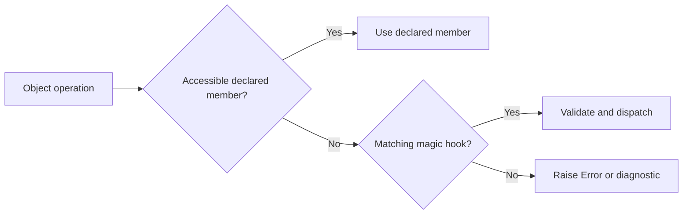

<TLDR>
  <TLDRCell label="what">
    <Term id="magic-method">魔术方法（magic method）</Term>是由PHP在特定对象操作发生时调用的`__*`钩子。它们定义对象如何处理不可访问成员、字符串上下文、调用、克隆与序列化。
  </TLDRCell>
  <TLDRCell label="trap">
    钩子不是所有访问的通用拦截器。返回`null`、转发任意名称或序列化全部属性，会掩盖拼写错误、扩大接口并泄露内部状态。
  </TLDRCell>
  <TLDRCell label="fix">
    先写清触发条件与公开契约，再使用名称允许列表、准确签名和显式状态数组。资源释放与不可信数据解析应使用明确边界，不要依赖析构或`unserialize()`。
  </TLDRCell>
</TLDR>

## 是什么，为什么存在

PHP魔术方法是一组名称以双下划线开头、由引擎按协议调用的方法。普通业务代码通常不直接调用它们，而是执行属性读取、方法调用、`clone`、`serialize()`或字符串转换等操作。引擎识别操作和方法名称的组合，然后把控制权交给对象。

这些钩子解决的是对象模型边界上的适配问题。对象可以把动态字段映射到一个内部数组，把对象变成可调用的策略，或者在复制与持久化时重建自己的不变量。框架中的模型、代理、延迟加载器和测试替身常用这些能力，但一个普通领域对象未必需要它们。

PHP所说的<Term id="property-overloading">属性重载（property overloading）</Term>不是Java或C++中按参数签名选择方法的重载。这里的含义是在读取、写入、检查或删除不可访问属性时动态处理操作。不可访问包括不存在的属性，也包括当前调用作用域不能访问的`private`或`protected`属性。

双下划线前缀由PHP保留。除了文档规定的魔术方法，不要为应用协议发明`__publish()`一类名称。业务入口应使用普通方法，让IDE、静态分析器和调用方都能看见契约。

常见钩子可按触发操作分组：

| 操作 | 魔术方法 | 触发时机 |
| --- | --- | --- |
| 生命周期 | `__construct()`、`__destruct()` | 创建对象，或对象销毁与脚本关闭 |
| 属性 | `__get()`、`__set()`、`__isset()`、`__unset()` | 对不可访问属性执行对应操作 |
| 方法 | `__call()`、`__callStatic()` | 调用不可访问的实例方法或静态方法 |
| 表示与调用 | `__toString()`、`__invoke()`、`__set_state()`、`__debugInfo()` | 字符串转换、函数式调用、导出恢复或调试输出 |
| 复制与存储 | `__clone()`、`__serialize()`、`__unserialize()` | 克隆、序列化或反序列化对象 |
| 旧式存储钩子 | `__sleep()`、`__wakeup()` | 未定义新式序列化钩子时定制旧式流程 |

## 工作原理

魔术方法由具体语法或内置函数触发，不会接管对象上的每个操作。读取一个可访问的已声明属性会直接读取该属性；调用一个可访问的已声明方法会直接执行该方法。只有普通查找无法完成当前操作时，属性或方法重载钩子才有机会运行。

一次操作的简化流程如下。不同钩子接收的参数和返回值不同，但都应把引擎入口转换成一个窄小、可测试的对象契约。



### 属性访问是一组协议

`__get(string $name): mixed`处理读取，`__set(string $name, mixed $value): void`处理写入。`__isset(string $name): bool`决定`isset()`的结果，`empty()`也会先使用它；当结果表明值存在时，`empty()`还可能读取值。`__unset(string $name): void`处理删除。

这四个方法应共享同一套名称、可空性和读写政策。若`__get()`接受`nickname => null`，`__isset()`仍可按`isset()`的原生语义返回`false`；但未知名称不应因此也被悄悄当作`null`。内部存储需要区分“键不存在”与“键存在且值为`null`”时，应使用`array_key_exists()`。

### 方法重载是后备分派

`__call(string $name, array $arguments): mixed`处理不可访问的实例方法，`__callStatic(string $name, array $arguments): mixed`处理对应静态调用。后者必须声明为`static`。名称与实参都是运行时数据，所以钩子本身必须完成允许列表、数量和类型验证。

不要把`$name`不加限制地转发给服务对象。这样会让代理的公开接口随着服务实现变化，还可能暴露本来不应由调用方触发的方法。明确的`match`或名称到闭包的封闭映射更容易审查。

### 转换、调用与对象状态

字符串上下文调用`__toString(): string`。拥有该方法的类也会被PHP视为实现了`Stringable`，但显式声明接口能让意图更清楚。对象后跟圆括号时调用`__invoke()`，因此这类实例可以传给需要<Term id="callback">回调（callback）</Term>的API。

`clone`先浅复制属性，再在新对象上调用`__clone()`。`serialize()`优先使用`__serialize()`提供的状态数组，`unserialize()`则用`__unserialize()`恢复状态。构造器不会替代反序列化钩子，所以恢复逻辑必须自行建立有效状态。

## 示例

下面四个示例依次展示属性协议、受限方法分派、可调用值对象，以及克隆和序列化。所有输出均由本地PHP 8.3.33实际执行对应文件得到。

### 建立严格的属性协议

`Profile`只允许三个动态名称，并把数据保存在一个已声明数组中。读取未知名称会失败，因此大小写拼写错误不会伪装成缺失值。

<Depth level="quick">

```php title="profile.php"
<?php

declare(strict_types=1);

final class Profile
{
    private const ALLOWED = ['displayName', 'timezone', 'nickname'];

    public function __construct(private array $values = []) {}

    public function __get(string $name): mixed
    {
        if (!array_key_exists($name, $this->values)) {
            throw new OutOfBoundsException("Unknown property: {$name}");
        }
        return $this->values[$name];
    }

    public function __set(string $name, mixed $value): void
    {
        if (!in_array($name, self::ALLOWED, true) || !is_string($value)) {
            throw new InvalidArgumentException("Invalid property: {$name}");
        }
        $this->values[$name] = $value;
    }

    public function __isset(string $name): bool
    {
        return isset($this->values[$name]);
    }
}

$profile = new Profile(['nickname' => null]);
$profile->displayName = 'Ada';
$profile->timezone = 'UTC';
echo "{$profile->displayName} @ {$profile->timezone}\n";
echo 'nickname set: ', isset($profile->nickname) ? 'yes' : 'no', "\n";

try {
    echo $profile->timeZone;
} catch (OutOfBoundsException $error) {
    echo $error->getMessage(), "\n";
}
```

```text
Ada @ UTC
nickname set: no
Unknown property: timeZone
```

<TryToBreak items={['把nickname设为空字符串', '读取未列入允许列表的locale', '给timezone赋整数']} />

</Depth>

构造器接收的初始状态包含`nickname => null`，所以读取该属性是合法的；`isset()`仍返回`false`，符合原生可空语义。若领域需要“键存在”检查，应提供另一个具名方法，不要改变调用方熟悉的`isset()`含义。

`__set()`没有执行`$this->{$name} = $value`。那种写法会创建真正的动态属性，在PHP 8.2及以后会进入弃用路径；内部数组还能集中实施名称和类型政策。

### 限制动态方法分派

`OrderActions`暴露两个动态动作，但不会把任意名称直接交给内部实现。钩子同时验证方法名、实参数量和订单ID类型。

```php title="actions.php"
<?php

declare(strict_types=1);

final class OrderActions
{
    public function __call(string $name, array $arguments): string
    {
        if (!in_array($name, ['cancel', 'resendReceipt'], true)) {
            throw new BadMethodCallException("Unsupported action: {$name}");
        }
        if (count($arguments) !== 1 || !is_int($arguments[0])) {
            throw new InvalidArgumentException('Expected one integer order ID');
        }

        return match ($name) {
            'cancel' => $this->cancelOrder($arguments[0]),
            'resendReceipt' => $this->resend($arguments[0]),
        };
    }

    private function cancelOrder(int $orderId): string
    {
        return "Order {$orderId} cancelled";
    }

    private function resend(int $orderId): string
    {
        return "Receipt {$orderId} resent";
    }
}

$actions = new OrderActions();
echo $actions->cancel(17), "\n";
echo $actions->resendReceipt(23), "\n";

try {
    echo $actions->delete(31);
} catch (BadMethodCallException $error) {
    echo $error->getMessage(), "\n";
}
```

```text
Order 17 cancelled
Receipt 23 resent
Unsupported action: delete
```

允许列表是这个对象的真实公开协议。若动作长期稳定，直接声明`cancel(int $orderId)`和`resendReceipt(int $orderId)`通常更好；动态分派适合名称集合由明确元数据生成的窄小边界。

这里没有用`method_exists()`作为授权检查。该函数回答实现中是否存在方法，不回答调用方是否应该访问它，也不保证当前作用域能合法调用它。

### 把对象用作函数和字符串

折扣对象保存经过验证的基点数，并通过`__invoke()`完成一种主要操作。`__toString()`只生成简短的人类可读标签，不承担JSON或持久化协议。

```php title="discount.php"
<?php

declare(strict_types=1);

final class PercentageDiscount implements Stringable
{
    public function __construct(private int $basisPoints)
    {
        if ($basisPoints < 0 || $basisPoints > 10_000) {
            throw new InvalidArgumentException('Invalid discount');
        }
    }

    public function __invoke(int $priceInCents): int
    {
        return intdiv($priceInCents * (10_000 - $this->basisPoints), 10_000);
    }

    public function __toString(): string
    {
        return number_format($this->basisPoints / 100, 2) . '% off';
    }
}

$discount = new PercentageDiscount(1_500);
echo $discount, "\n";
echo 'callable: ', is_callable($discount) ? 'yes' : 'no', "\n";
printf("final price: $%.2f\n", $discount(12_000) / 100);
```

```text
15.00% off
callable: yes
final price: $102.00
```

以整数分表示金额，避免示例把二进制浮点舍入混入魔术方法主题。`__invoke()`的参数和返回类型仍是普通PHP类型契约，调用对象不会绕过类型检查。

字符串形式是一种<Term id="object-representation">对象表示（object representation）</Term>。这里的`__toString()`结果适合日志标签或界面片段，但不应被解析回来；机器协议应使用明确字段和版本化格式。

### 分离复制状态与持久状态

购物车克隆时复制其拥有的地址，并丢弃会话令牌。新式序列化钩子只保存业务状态；示例只反序列化刚刚由进程自身生成的可信字节。

```php title="cart.php"
<?php

declare(strict_types=1);

final class Address
{
    public function __construct(public string $city) {}
}

final class CartDraft
{
    public function __construct(
        public Address $address,
        private array $items,
        private string $sessionToken,
    ) {}

    public function __clone(): void
    {
        $this->address = clone $this->address;
        $this->sessionToken = '';
    }

    public function __serialize(): array
    {
        return ['address' => $this->address, 'items' => $this->items];
    }

    public function __unserialize(array $data): void
    {
        if (!($data['address'] ?? null) instanceof Address || !is_array($data['items'] ?? null)) {
            throw new UnexpectedValueException('Invalid cart data');
        }
        $this->address = $data['address'];
        $this->items = $data['items'];
        $this->sessionToken = '';
    }

    public function hasSessionToken(): bool
    {
        return $this->sessionToken !== '';
    }
}

$original = new CartDraft(new Address('Paris'), ['BK-1' => 2], 'secret');
$copy = clone $original;
$copy->address->city = 'Lyon';
$restored = unserialize(serialize($original), [
    'allowed_classes' => [CartDraft::class, Address::class],
]);

echo "original: {$original->address->city}\n";
echo "copy: {$copy->address->city}\n";
echo 'clone token: ', $copy->hasSessionToken() ? 'yes' : 'no', "\n";
echo "restored: {$restored->address->city}\n";
echo 'restored token: ', $restored->hasSessionToken() ? 'yes' : 'no', "\n";
```

```text
original: Paris
copy: Lyon
clone token: no
restored: Paris
restored token: no
```

没有`__clone()`时，两个购物车会指向同一个`Address`，修改副本城市也会改变原对象。<Term id="deep-copy">深拷贝（deep copy）</Term>不等于机械克隆所有对象；这里只复制购物车拥有的可变值，并明确重置短期凭据。

`allowed_classes`缩小了这个可信示例可恢复的类型集合，但它不是处理攻击者输入的安全承诺。外部JSON、Cookie或数据库字段应使用只包含数据的格式、严格模式校验和明确构造过程。

## 陷阱

### 把钩子当作通用拦截器

> [!PITFALL]
> `__get()`不会观察对可访问公开属性的普通读取，`__call()`也不会包住已声明公开方法。把授权、审计或缓存完全放在这些后备钩子里，会留下绕过路径。

**修复方法：** 逐项写出触发语法、成员可见性和期望钩子。必须覆盖所有调用的横切逻辑应放在显式服务、装饰器或统一入口，而不是依赖查找失败。

### 用`null`吞掉名称错误

> [!PITFALL]
> 对每个未知属性返回`null`，会让`$order->statsu`看起来像合法缺失值。若`__isset()`、`__get()`和`__unset()`使用不同名称规则，同一属性还会在不同操作下呈现矛盾状态。

**修复方法：** 建立一个共享允许列表，并明确区分未知、缺失与显式`null`。未知名称抛出包含名称的异常；可选字段则通过文档化的可空契约处理。

### 无限制地转发方法

> [!PITFALL]
> `$service->$name(...$arguments)`把调用者提供的名称变成能力选择。服务新增公开维护方法后，代理可能在没有代码变更的情况下意外暴露它。

**修复方法：** 把外部名称映射到固定动作，分别验证参数并拒绝其他名称。若集合是固定的，优先使用普通具名方法和接口；`method_exists()`不能替代授权政策。

### 依赖析构器完成关键工作

> [!PITFALL]
> 循环引用、垃圾回收和脚本关闭会改变`__destruct()`的调用时机。把事务提交、队列确认或唯一一次远程写入放进去，会让正确性依赖不可控的生命周期。

**修复方法：** 为资源提供`close()`、`commit()`或作用域管理方法，并用`try`／`finally`配对。析构器最多执行小型、幂等的本地兜底清理，不能成为业务成功信号。

### 把对象状态全部序列化

> [!PITFALL]
> `get_object_vars($this)`可能包含令牌、连接、闭包、缓存和框架服务。它把内部字段名变成长期格式，还可能恢复出没有通过构造器校验的对象。

**修复方法：** `__serialize()`只返回版本化的必要数据，`__unserialize()`验证键、类型和不变量，并为短期依赖建立安全默认值。密码和令牌不是因为位于私有属性就自动保密。

### 对不可信字节调用`unserialize()`

> [!PITFALL]
> 攻击者控制的序列化数据可以构造对象图并触发自动加载与魔术方法。限制允许类不能把这种格式变成通用的安全输入协议。

**修复方法：** 外部边界使用JSON等纯数据格式，再显式验证并构造领域对象。必须读取可信存储中的PHP序列化数据时，还要验证完整性，并把可恢复类限制到最小集合。

<Depth level="deep">

## 签名、可见性与继承

PHP 8.3会检查多数魔术方法的固定签名。除`__construct()`、`__destruct()`和`__clone()`外，魔术方法必须是`public`；不合适的可见性会产生诊断。`__callStatic()`必须是静态方法，而其他非静态钩子不能为了方便随意改成静态方法。

| 方法 | 关键签名约束 | 返回职责 |
| --- | --- | --- |
| `__get` | 一个`string`名称 | 返回属性值 |
| `__set` | `string`名称与`mixed`值 | `void` |
| `__isset` | 一个`string`名称 | `bool` |
| `__call` | `string`名称与`array`实参 | 动态结果 |
| `__callStatic` | 与`__call`相同，并且为`static` | 动态结果 |
| `__toString` | 无实参 | `string` |
| `__serialize` | 无实参 | 状态`array` |
| `__unserialize` | 一个状态`array` | `void` |

如果声明参数或返回类型，就必须与PHP为该魔术方法规定的类型兼容。省略允许省略的类型可能仍可运行，但会削弱工具能检查的契约。复制官方签名后，再为普通辅助方法使用更窄的业务类型。

继承会增加另一层可见性判断。从类外调用子类不可访问的方法可能进入继承到的`__call()`；但父类内部对自己可访问成员的调用按普通分派执行。测试应从真实调用作用域发起，不要只在类内部手工调用钩子。

`__clone()`的可见性可以用于限制外部克隆，因为`clone`必须能够访问该方法。即使不需要自定义复制，也可用非公开`__clone()`表明对象身份不允许复制。调用方应看到明确类型政策，而不是在运行中偶然遇到访问错误。

## 属性重载与动态属性

属性钩子适合把固定但动态呈现的名称映射到受控存储。它们不应成为任意键值袋的默认借口。名称集合来自模式、字段元数据或协议时，类仍应能列出、记录并测试完整集合。

PHP 8.2起，创建未声明的动态属性会产生弃用诊断，但定义`__set()`的类可接管外部写入。这个例外不意味着应在`__set()`内再次执行`$this->{$name} = $value`；该写入仍是在创建动态属性。写入已声明数组或专用值对象能保持状态形状明确。

在钩子中访问后备存储时，应直接使用已声明属性，例如`$this->values[$name]`。再次通过同一个动态名称访问对象本身，既没有增加抽象，也容易触发未定义属性诊断或写入错误位置。辅助方法应接收已经验证的名称和值。

`isset()`对`null`返回`false`，而`array_key_exists()`只检查键。`__isset()`应先决定自己是在模拟原生`isset()`，还是提供领域存在性；通常前者更符合调用方预期，后者应成为`hasField()`一类普通方法。`empty()`还把`0`、`'0'`、空字符串和空数组视为空，所以不能用它承担字段合法性检查。

## 复制、序列化与生命周期

### 克隆后的引用关系

PHP对象克隆从浅复制开始。标量和数组属性按PHP的普通值语义复制，但对象属性仍指向相同实例；随后才在副本上执行`__clone()`。因此，钩子只需处理默认复制没有表达的所有权关系。

先为每个对象属性分类：值对象可以克隆，服务和连接通常应共享或重新注入，实体可能根本不允许克隆，秘密与缓存往往需要清空。机械地递归克隆整个对象图可能复制不应复制的身份，也可能在循环图上失败。

若对象包含数组中的嵌套对象，复制数组本身不会克隆其中的对象。测试要修改每一类嵌套可变值，而不是只比较顶层对象ID。预期共享的依赖也要断言仍是同一实例。

### 新旧序列化钩子

`__serialize()`返回由PHP继续编码的数组，键和值由类定义。`__unserialize(array $data)`在恢复对象时接收解码后的数组。两者同时存在时，新式钩子优先于`__sleep()`和`__wakeup()`，所以不要维护两套互相漂移的格式。

序列化格式一旦写入缓存、会话或队列，就成为兼容性协议。状态数组应包含格式版本，读取端应明确支持哪些版本，并在删除或重命名字段前安排迁移。私有属性名称不适合作为未经设计的外部格式。

恢复过程不能假定构造器刚刚运行。`__unserialize()`必须初始化之后可能读取的每个带类型属性，验证嵌套值，并拒绝未知或不完整版本。服务连接、闭包和请求对象应从序列化状态排除，在受控边界重新提供。

`__sleep()`返回要保存的属性名称，`__wakeup()`在恢复后运行。它们仍可出现在旧代码中，但新代码更适合使用状态数组明确表达格式。迁移时要用真实旧载荷测试，而不是同时改变写入端和读取端后只测试一次往返。

`unserialize()`解析的是可执行对象协议，不只是数据容器。即使代码没有显式调用某个类的构造器，自动加载和恢复钩子也会扩大攻击面。对于不可信输入，官方手册要求改用安全的标准数据格式；若数据来自可信存储，也应使用签名或消息认证码检测篡改。

### 析构不是提交点

引用计数归零时可能立即调用`__destruct()`，循环垃圾可能稍后由垃圾回收器处理，脚本关闭还会销毁剩余对象。这个时间差足以让锁、事务和外部消息的语义变得不可靠。析构顺序也不应成为对象间依赖协议。

显式释放方法让失败能够在正常控制流中处理。调用方可以在`finally`中执行它，测试也能断言成功与失败路径。析构器若作为兜底，应避免抛出异常、等待网络或启动新的复杂对象图。

构造器同样不适合隐藏难以回滚的大量外部工作。让对象先建立有效本地状态，再由具名方法或工厂执行可能失败的连接与注册，通常能给调用方更清楚的失败边界。

## 表示、调试与测试

`__toString()`定义一个紧凑字符串，不等于序列化格式。日志和界面可能长期依赖它，因此输出应稳定且避免秘密；需要结构化信息时，使用显式`toArray()`、`jsonSerialize()`或展示层映射。不要让解析器反向读取面向人的字符串。

`__debugInfo()`可以控制`var_dump()`展示的属性。它适合隐藏噪声和秘密，不能提供安全边界，因为对象仍可能通过反射、其他导出路径或应用方法暴露状态。测试既要检查调试输出不含令牌，也要检查正常错误和日志路径。

`__set_state(array $properties)`是`var_export()`生成恢复表达式时使用的静态入口。若类不承诺由导出文本重建，就不必实现它。实现时应验证属性数组并走与普通构造相同的不变量，而不是盲目赋值。

魔术方法测试需要从触发操作开始，而不是直接调用`__get('name')`。一组有用的契约测试包括：

1. 对每个允许名称执行真实读取、写入、`isset()`或调用，并断言结果。
2. 对未知名称、错误大小写、错误参数数量和错误类型断言具体失败。
3. 对克隆修改嵌套状态，同时验证应独立与应共享的引用。
4. 用固定版本夹具测试序列化恢复，并检查秘密不会出现在原始字节中。
5. 在显式清理之后销毁对象，确认析构不会重复提交或产生额外副作用。

静态分析器只能看到声明出来的接口。PHPDoc的`@property`和`@method`可以帮助现有框架描述动态成员，但它们不会在运行时创建验证或授权。若大量注解只是为了让工具猜出动态协议，普通属性、接口或生成代码通常更容易维护。

</Depth>

<Checkpoint id="php/magic-methods" />

## 延伸阅读

- [PHP手册：魔术方法](https://www.php.net/manual/en/language.oop5.magic.php)
- [PHP手册：重载](https://www.php.net/manual/en/language.oop5.overloading.php)
- [PHP手册：对象克隆](https://www.php.net/manual/en/language.oop5.cloning.php)
- [PHP手册：对象序列化](https://www.php.net/manual/en/language.oop5.serialization.php)
- [PHP手册：`unserialize()`](https://www.php.net/manual/en/function.unserialize.php)
- [PHP手册：动态属性](https://www.php.net/manual/en/language.oop5.properties.php#language.oop5.properties.dynamic-properties)
