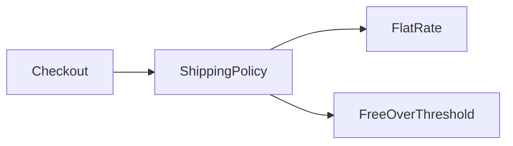

<TLDR>
  <TLDRCell label="what">
    PHP object-oriented programming organizes state and operations in classes, then uses objects as runtime instances with their own identity and lifecycle.
  </TLDRCell>
  <TLDRCell label="trap">
    Public mutable properties, deep inheritance trees, and skipped parent constructors let objects bypass validation or remain partly uninitialized.
  </TLDRCell>
  <TLDRCell label="fix">
    Establish invariants in constructors, protect mutation behind narrow interfaces, and inject collaborators through composition by default.
  </TLDRCell>
</TLDR>

## What it is and why it exists

Object-oriented programming (OOP) uses classes to describe the state a kind of value can hold and the operations it can perform. An object is a runtime instance of a class; one class can create many objects, each with its own <Term id="object-identity">object identity</Term>. A class isn't a mechanical copy of a real-world entity. It is a tool for drawing boundaries around responsibility, state ownership, and calls.

The central purpose of OOP isn't to reduce characters. It is to keep valid state and allowed changes in one place. <Term id="encapsulation">Encapsulation</Term> puts representation behind a public API, so callers state intent instead of assembling internals. A balance can't become negative by accident, an order can't skip a required state, and the relevant rules don't have to be repeated at every call site.

You encounter PHP classes in services, domain models, framework controllers, database entities, and value objects. Objects are especially useful for concepts with a distinct lifecycle, several related operations, or replaceable collaborators. If data merely passes through briefly and has no behavior, an array with a documented key shape may be more direct; not every group of fields needs a class.

A class can implement interfaces, extend one parent class, and use traits. An interface states capabilities callers can depend on, inheritance expresses a substitutable type relationship, and a trait reuses implementation fragments. They solve different problems. This topic focuses on classes, interfaces, and inheritance; `php/traits` and `php/magic-methods` cover horizontal reuse and engine hooks separately.

## How it works

A `class` declaration defines properties and methods. Properties hold object state, while an instance method uses `$this` to access the current object. Callers use `->` for instance members and `::` for class constants and static members. The `public`, `protected`, and `private` visibility of a property or method determines which scopes may access it.

`public` is a lasting promise to callers and suits stable operations. `private` keeps representation and helper steps inside the declaring class; subclasses can't access it directly. `protected` also opens a member to every subclass, which expands the inheritance contract. Starting with the narrowest visibility and widening it for a real caller is usually more compatible than publishing internals and trying to retract them later.

A typed property is uninitialized before its first assignment; it doesn't automatically contain `null`. Reading one raises `Error`. If absence is valid, the type must be nullable and the property must be initialized explicitly. A constructor should complete every required assignment and establish the <Term id="class-invariant">class invariants</Term> before exposing the object.

A visibility modifier on a constructor parameter uses <Term id="constructor-property-promotion">constructor property promotion</Term> to declare and initialize a property at once. Promotion removes repeated syntax but doesn't replace validation; the constructor body should still reject invalid combinations. A `readonly` property prevents reassignment of the property, but it doesn't recursively freeze an object stored in that property.

An interface states a public contract without holding ordinary instance state. A class may implement several interfaces, but every method signature must be compatible with the interface. Accepting an interface instead of a concrete implementation lets a caller swap strategies, supply a test double, and leave object creation at the application's composition boundary.

A PHP class can directly extend only one parent. A child inherits accessible members, may override methods that permit it, and uses `parent::` to call parent behavior. Calling through a parent type while the runtime executes the concrete child's override is <Term id="subtype-polymorphism">subtype polymorphism</Term>.

Inheritance works only when the child behaves correctly everywhere the parent contract permits. If the goal is merely to reuse an implementation, <Term id="composition">composition</Term> with a held collaborator is usually clearer. Composition makes the dependency a constructor argument and avoids coupling a child to protected parent state.

The following diagram shows the dependency direction. `Checkout` knows only `ShippingPolicy`; startup code chooses whether to inject a flat rate or a free-over-threshold policy.



An object variable holds an identifier that locates the object. Assigning it to another variable doesn't copy the object; both variables still access the same instance. This isn't the same as creating variable references with `&`. The `clone` operator creates a new object identity, and its default property copy is shallow.

## Examples

These four examples start with a class that protects its own state, then add a replaceable strategy, controlled inheritance, and object identity. Every output shown was produced by running the corresponding file with the local PHP 8.3.33 CLI.

### Establish valid state in the constructor

`CartLine` exposes no writable properties. The constructor and `add()` are the two paths through which quantities enter the object, so validation stays in those two places.

<Depth level="quick">

```php title="cart_line.php"
<?php
declare(strict_types=1);

final class CartLine
{
    public function __construct(
        private string $sku,
        private int $unitCents,
        private int $quantity,
    ) {
        if ($unitCents <= 0 || $quantity <= 0) {
            throw new InvalidArgumentException('Price and quantity must be positive');
        }
    }

    public function add(int $units): void
    {
        if ($units <= 0) {
            throw new InvalidArgumentException('Units must be positive');
        }
        $this->quantity += $units;
    }

    public function summary(): string
    {
        return sprintf('%s x%d = %d', $this->sku, $this->quantity, $this->unitCents * $this->quantity);
    }
}

$line = new CartLine('BK-104', 1499, 3);
echo $line->summary(), "\n";
$line->add(2);
echo $line->summary(), "\n";
```

```text
BK-104 x3 = 4497
BK-104 x5 = 7495
```

<TryToBreak items={['a quantity of 0', 'a negative unit price', 'adding a negative number of units']} />

</Depth>

The promoted parameters become private properties, but callers don't need to know how the fields are stored. As long as every public operation preserves positive prices and quantities, the invariant holds in every observable state. If money needs decimals or currencies, introduce a dedicated money type instead of silently switching to binary floating point.

### Replace a strategy through an interface

The checkout object depends on one narrow shipping interface. The two strategies own different state and algorithms; `Checkout` doesn't need a type test to select a branch.

```php title="shipping_policy.php"
<?php
declare(strict_types=1);

interface ShippingPolicy
{
    public function fee(int $subtotalCents): int;
}
final class FlatRate implements ShippingPolicy
{
    public function __construct(private int $feeCents) {}

    public function fee(int $subtotalCents): int
    {
        return $this->feeCents;
    }
}
final class FreeOverThreshold implements ShippingPolicy
{
    public function __construct(
        private int $thresholdCents,
        private int $feeCents,
    ) {}

    public function fee(int $subtotalCents): int
    {
        return $subtotalCents >= $this->thresholdCents ? 0 : $this->feeCents;
    }
}
final class Checkout
{
    public function __construct(private ShippingPolicy $shipping) {}

    public function total(int $subtotalCents): int
    {
        return $subtotalCents + $this->shipping->fee($subtotalCents);
    }
}

echo 'standard=', (new Checkout(new FlatRate(600)))->total(5000), "\n";
echo 'campaign=', (new Checkout(new FreeOverThreshold(5000, 600)))->total(5000), "\n";
```

```text
standard=5600
campaign=5000
```

Constructor injection makes the dependency complete and visible when the object is created. A test can provide a deterministic implementation of the same interface, while production startup code selects the real policy. The interface doesn't automatically guarantee positive money values; the boundary accepting input must still enforce domain constraints.

### Fix a process in an abstract class

An abstract class fits shared state and a fixed algorithm skeleton. Here `deliver()` is the non-overridable public process, and subclasses supply only the formatting step, so they can't skip the parent contract.

```php title="message_delivery.php"
<?php
declare(strict_types=1);

abstract class Message
{
    public function __construct(protected string $recipient) {}

    final public function deliver(): string
    {
        return 'send ' . $this->format();
    }

    abstract protected function format(): string;
}

final class EmailMessage extends Message
{
    protected function format(): string
    {
        return "email to {$this->recipient}";
    }
}

final class SmsMessage extends Message
{
    protected function format(): string
    {
        return "sms to {$this->recipient}";
    }
}

function preview(Message $message): void
{
    echo $message->deliver(), "\n";
}

preview(new EmailMessage('ops@example.com'));
preview(new SmsMessage('+33123456789'));
```

```text
send email to ops@example.com
send sms to +33123456789
```

`preview()` depends only on the parent type but receives behavior from the concrete child. The design requires every child to support the uses promised by `Message`. If one channel needs a fundamentally different lifecycle or error policy, a common interface plus composition may fit better than shared parent code.

### Distinguish assignment from cloning

Object assignment copies access to the same object identity. Cloning produces a new identity; this example has only an integer property, so the default shallow copy is enough.

```php title="object_identity.php"
<?php
declare(strict_types=1);

final class CreditBalance
{
    public function __construct(private int $cents) {}

    public function deposit(int $cents): void
    {
        if ($cents <= 0) {
            throw new InvalidArgumentException('Deposit must be positive');
        }
        $this->cents += $cents;
    }

    public function amount(): int
    {
        return $this->cents;
    }
}

$account = new CreditBalance(1000);
$alias = $account;
$alias->deposit(250);
$copy = clone $account;
$copy->deposit(100);

echo 'same-instance=', $alias === $account ? 'yes' : 'no', "\n";
echo 'original=', $account->amount(), "\n";
echo 'clone=', $copy->amount(), "\n";
```

```text
same-instance=yes
original=1250
clone=1350
```

The change through `$alias` is visible through `$account` because both locate the same instance. `$copy` begins with the same integer state and then changes independently. If a property contains another object, default cloning still shares that nested instance. The ownership contract should decide what to copy instead of recursively cloning everything.

## Pitfalls

> [!PITFALL]
> Public writable properties let callers bypass object rules. Generated code often constructs an empty object and assigns fields one by one; omit one typed property and the failure is delayed until its first read.

**Fix:** accept required state in the constructor, then handle changes through private properties and validated methods. Give optional state an explicit default as well; don't use uninitialized as if it meant `null`.

> [!PITFALL]
> A child constructor doesn't automatically execute the parent constructor it overrides. If it omits `parent::__construct()`, required parent properties may remain uninitialized.

**Fix:** call `parent::__construct()` explicitly when the child needs parent initialization, and immediately test a public operation that depends on parent state. If every child must remember a complex initialization protocol, reconsider the boundary with a `final` construction flow, a factory, or composition.

> [!PITFALL]
> Inheriting to reuse code couples protected parent state and lifecycle into the child. Once a child rejects input the parent accepts or changes promised side effects, it no longer safely substitutes for the parent.

**Fix:** write the interface callers actually need, then ask whether the implementations have a stable "is a" relationship. When only implementation reuse is needed, move the behavior to a collaborator and compose it through the constructor.

> [!PITFALL]
> `readonly` prevents property reassignment but doesn't make the referenced object immutable. Calling `$order->customer->rename()` may still mutate the nested object.

**Fix:** treat readonly as an assignment restriction, not a deep-immutability promise. For an immutable object graph, nested types must also expose no mutation operations, and the class must not leak mutable internals.

> [!PITFALL]
> Object `==` compares class and property values, while `===` checks whether both expressions point to the same instance. Swapping them confuses equal contents with identical identity.

**Fix:** choose from domain semantics. Entities usually compare a stable identifier, value objects should expose a meaningfully named equality operation, and `===` belongs where the same runtime instance is required.

## In the AI era

**What generated code gets wrong here**

Models often project the Java or C# object model onto PHP: they generate same-name method overloads, multiple class inheritance, `.` member access, or assume declared types recursively validate array contents. Another failure is constructing an empty object and then writing dynamic properties. Most undeclared dynamic properties have been deprecated since PHP 8.2, and this pattern bypasses constructor invariants.

With inheritance, generated code frequently overrides a child constructor but skips `parent::__construct()`, widens public mutable state, or makes an override reject inputs allowed by the parent contract. It also treats `readonly` as deep immutability, describes object assignment as cloning, and uses `==` to check identity. Such code can pass `php -l` and still fail during initialization, implementation substitution, or nested mutation.

**Ask your AI to check**

- List which construction path initializes every property and which invariants must hold before each public method runs.
- Give a substitutability test for every `extends` relationship and identify inheritance used only for implementation reuse.
- Find dynamic properties, public writable properties, missing parent-constructor calls, and code that treats `readonly` as deep immutability.

**Review checklist**

- Run `php -l` and tests on the target PHP 8.3.33 runtime, covering invalid constructor arguments, every implementation, and object-copy boundaries.
- Confirm that callers depend on an interface or necessary parent type and that concrete implementations are created only at the composition boundary.
- Inspect every property's visibility, initialization, mutation paths, and identity comparisons for a route around the invariants.

**Prompt vocabulary**

Use the exact terms `encapsulation`, `class invariant`, `constructor property promotion`, `interface contract`, `subtype polymorphism`, `composition over inheritance`, `object identity`, and `shallow clone`. Asking a model to trace an object through construction, calls, substitution, and copying is more likely to expose a contract bug than asking it to "optimize the OOP."

<Depth level="deep">

## Object identity and copy boundaries

A PHP object variable holds an object identifier. Ordinary assignment copies that identifier, so two variables access the same object; reassigning one variable changes only which object that variable locates afterward. Only an explicit `&` makes the variables themselves reference aliases, and that is usually unnecessary for sharing an object.

`===` compares object identity, while `==` compares class and properties. Value comparison may recurse through nested properties and isn't the same as a business equality rule. A database ID on an entity also doesn't make any two in-memory objects with that ID the same instance. Runtime identity and domain identity need separate names.

`clone` creates a new top-level object and then shallow-copies its properties. Scalars and arrays follow their ordinary copy semantics, but an object held in a property still points to the original nested instance. An owned mutable value object may be copied in `__clone()`; a service, connection, or entity with independent identity should not be cloned mechanically.

Copy policy belongs to the class contract. Tests should mutate scalar, array, and nested-object state separately, then assert which changes are isolated and which remain shared. Comparing property output only before and after a clone doesn't prove nested ownership is correct.

## Construction, inheritance, and invariants

Once an object returns from its constructor, callers should be able to execute any public operation safely. Constructor promotion assigns its corresponding properties before the constructor body runs, so the body can validate their combination. On failure, throw an exception instead of exposing a partial object.

Private parent properties belong to the parent implementation; children participate through protected or public operations. Changing every field to `protected` may remove access errors, but it lets every child break parent invariants. A stronger parent offers narrow protected steps and uses `final` for a public process that must not be skipped.

An override must preserve both a compatible signature and the behavioral contract. PHP permits compatible parameter contravariance and return covariance, but its type system can't check side effects, exception policies, or business preconditions. A child can pass load-time signature checks and still violate substitutability at runtime.

An abstract class can carry shared implementation and state, whereas an interface lets types without one parent implementation promise the same capability. Prefer an interface when callers need only behavior; consider an abstract parent when implementations truly share a stable lifecycle. That choice determines which classes future changes affect, not merely which syntax looks shorter.

## Interface evolution

Once several implementations and callers adopt an interface, adding an abstract method is a breaking change. Every implementation class, anonymous test double, and external extension must add it. Treat an interface in a shared library as a versioned API, not an internal checklist that can grow at any time.

An oversized interface forces callers to depend on capabilities they don't use. Split it into cohesive role-based interfaces so a class can implement several contracts as needed and a test double can implement only what the subject actually calls. Let caller needs drive the split; don't mechanically reduce every interface to one method.

Returning a concrete class exposes its full public surface, while returning an interface preserves replacement space. Don't add a hollow abstraction only for imagined future implementations, though. The cost of an interface has evidence when a second implementation, isolated test, or explicit boundary genuinely needs substitution.

## Factories and named construction paths

A class has one `__construct()`; PHP doesn't overload several constructors by parameter list. When an object has several valid creation paths, provide `public static` named factories such as `fromPayload()` or `restore()`, then make each path establish the same invariants.

A named factory can parse and validate an external representation before calling a non-public constructor. It may also return an interface, cache an instance, or select a concrete subtype, so callers shouldn't assume it always runs `new self`. Use a name that states the input semantics, not an ambiguous `create2()`.

Restoring a persisted object and creating a new one usually have different policies. A restoration path must still validate versions and invariants instead of assigning private fields one at a time for convenience. If a framework hydrates without the constructor, an integration test should prove that the object is fully initialized before business code receives it.

## Lifecycle and resources

Constructors fit in-memory state establishment, but they shouldn't hide many irreversible side effects. If construction writes a database row and later validation throws, the caller receives no object but an external change may remain. Validate plain data first, then let an explicit service coordinate persistence and messaging so the failure boundary can be tested.

A destructor may run when an object is no longer referenced or during request shutdown, but resource correctness shouldn't depend on precise destruction timing. Transaction completion, lock release, and temporary-file cleanup need explicit `try` / `finally` or a scoped API. A destructor is also a poor place for business exceptions that callers must handle.

Static properties hold class-level state, not state owned by an instance. Storing a cache, current user, or test double there hides ownership across requests and tests. If state must be shared, name its lifecycle, provide a reset or isolation policy, and don't disguise static access as a dependency-free instance method.

Reachable references collectively determine an object graph's lifetime. Event listeners, callbacks, and containers can keep objects alive longer than expected, while back-references may form cycles. When diagnosing memory growth, inspect who still holds the object instead of merely adding a destructor to its class.

## Testing object contracts

Test an object through its public interface and assert behavior and invariants. Reading private properties directly couples a test to the current representation, making safe refactoring fail. When a result must be observed, prefer a domain query method or a verifiable effect on a real collaborator.

Run the same contract cases against every implementation of a polymorphic interface, then add implementation-specific boundary tests. Shared cases catch a child that rejects valid input, changes result semantics, or skips parent initialization. Testing only each concrete class's happy path doesn't prove substitutability.

An identity test should create at least two instances and distinguish equal values, the same domain ID, and the same runtime instance. A copy test should also mutate nested mutable objects to confirm that the ownership policy works. Those assertions catch shared-state leaks that one formatted-output comparison cannot.

</Depth>

<Checkpoint id="php/oop" />

## Further reading

- [PHP manual: Classes and objects basics](https://www.php.net/manual/en/language.oop5.basic.php)
- [PHP manual: Visibility](https://www.php.net/manual/en/language.oop5.visibility.php)
- [PHP manual: Constructors and destructors](https://www.php.net/manual/en/language.oop5.decon.php)
- [PHP manual: Object interfaces](https://www.php.net/manual/en/language.oop5.interfaces.php)
- [PHP manual: Object inheritance](https://www.php.net/manual/en/language.oop5.inheritance.php)
- [PHP manual: Objects and references](https://www.php.net/manual/en/language.oop5.references.php)
