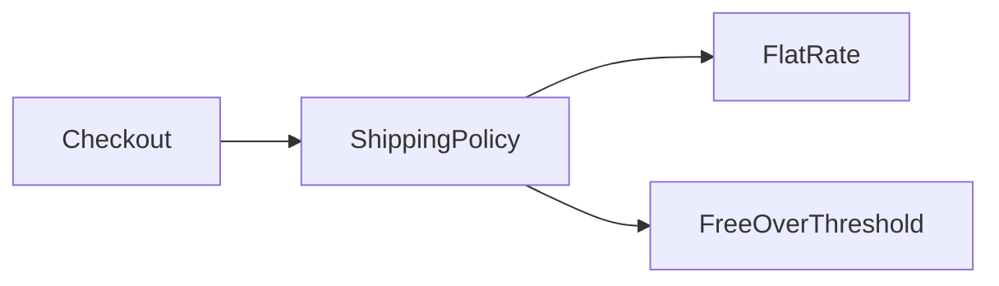

<TLDR>
  <TLDRCell label="what">
    PHP面向对象编程把状态和操作组织到类中，再用对象表示各自拥有身份与生命周期的运行时实例。
  </TLDRCell>
  <TLDRCell label="trap">
    公开可变属性、过深的继承层级和遗漏的父类构造器调用，会让对象绕过校验或停留在未初始化状态。
  </TLDRCell>
  <TLDRCell label="fix">
    在构造器建立不变量，用私有状态与窄接口守住修改路径，并优先通过组合注入协作者。
  </TLDRCell>
</TLDR>

## 是什么，为什么存在

面向对象编程（object-oriented programming，OOP）用类描述一类值允许保存的状态和执行的操作。对象是类在运行时的实例；同一个类可以创建多个对象，每个对象都有自己的<Term id="object-identity">对象标识（object identity）</Term>。类不是业务实体的机械复刻，而是一种为代码划定职责、状态所有权和调用边界的工具。

OOP解决的核心问题不是减少字符，而是让有效状态和允许的变化集中在一处。<Term id="encapsulation">封装（encapsulation）</Term>把内部表示藏在公开API后面，调用方只表达意图，不直接拼装对象内部。这样，余额不能凭空变成负数、订单不能跳过必要状态，相关规则也不必散落在每个调用点。

你会在服务、领域模型、框架控制器、数据库实体和值对象中遇到PHP类。对象尤其适合有明确生命周期、多个相关操作或可替换协作者的概念。若数据只是短暂传递且没有行为，带清楚键结构的数组也可能更直接，不必把每组字段都包装成类。

类可以实现接口、继承一个父类，并使用trait。接口声明调用方可依赖的能力，继承表达可替换的类型关系，trait复用实现片段。三者目的不同；本主题聚焦类、接口和继承，横向复用与引擎钩子分别由`php/traits`和`php/magic-methods`展开。

## 工作原理

`class`声明定义属性和方法。属性保存对象状态，实例方法通过`$this`访问当前对象；调用方使用`->`访问实例成员，使用`::`访问类常量和静态成员。属性与方法的`public`、`protected`、`private`可见性决定哪些作用域能够访问它们。

`public`是对调用方的长期承诺，适合稳定操作。`private`把表示与辅助步骤留在声明类内部，子类也不能直接访问；`protected`同时向所有子类开放，因此会扩大继承契约。默认选择最窄可见性，再因为真实调用需要而放宽，通常比先公开再收回兼容性更好。

带类型属性在第一次赋值前处于未初始化状态，而不是自动得到`null`。读取未初始化属性会抛出`Error`；需要`null`时必须把类型写成可空，并显式初始化。构造器应在对象交给调用方前完成所有必需赋值，并建立<Term id="class-invariant">类不变量（class invariant）</Term>。

构造器参数前带可见性时，PHP会使用<Term id="constructor-property-promotion">构造器属性提升（constructor property promotion）</Term>同时声明并初始化属性。提升减少重复语法，但不会替代校验；构造器体仍应拒绝非法组合。`readonly`属性限制属性重新赋值，却不会递归冻结属性指向的对象。

接口只规定公开契约，不保存普通实例状态。类可以实现多个接口，但每个方法签名都必须与接口兼容。接收接口类型而不是具体实现，使调用方能替换策略、传入测试替身，并把对象创建留在程序的组合边界。

PHP类只能直接继承一个父类。子类继承可访问成员，可以覆盖允许覆盖的方法，并通过`parent::`调用父类实现。运行时通过父类型调用方法，却执行实际子类的覆盖实现，这就是<Term id="subtype-polymorphism">子类型多态（subtype polymorphism）</Term>。

继承只有在子类能在父类契约允许的每个位置正确工作时才成立。若只是想复用一段实现，持有协作者的<Term id="composition">组合（composition）</Term>通常更清楚。组合让依赖成为构造器参数，也能避免子类依赖父类的受保护内部状态。

下面的关系图展示了依赖方向。`Checkout`只认识`ShippingPolicy`；启动代码决定注入固定运费还是满额免运费策略。



对象变量保存能定位对象的标识。把一个对象变量赋给另一个变量不会复制对象，两个变量仍访问同一个实例；这与使用`&`创建变量引用不是一回事。`clone`才创建新对象标识，而且默认只浅复制属性。

## 示例

下面四个示例从一个守住自身状态的类开始，再加入可替换策略、受控继承和对象身份。所有输出都由本地PHP 8.3.33 CLI实际执行对应文件得到。

### 在构造器建立有效状态

`CartLine`不暴露可写属性。构造器和`add()`是数量进入对象的两个入口，因此校验集中在这两处。

<Depth level="quick">

```php title="cart_line.php"
<?php
declare(strict_types=1);

final class CartLine
{
    public function __construct(
        private string $sku,
        private int $unitCents,
        private int $quantity,
    ) {
        if ($unitCents <= 0 || $quantity <= 0) {
            throw new InvalidArgumentException('Price and quantity must be positive');
        }
    }

    public function add(int $units): void
    {
        if ($units <= 0) {
            throw new InvalidArgumentException('Units must be positive');
        }
        $this->quantity += $units;
    }

    public function summary(): string
    {
        return sprintf('%s x%d = %d', $this->sku, $this->quantity, $this->unitCents * $this->quantity);
    }
}

$line = new CartLine('BK-104', 1499, 3);
echo $line->summary(), "\n";
$line->add(2);
echo $line->summary(), "\n";
```

```text
BK-104 x3 = 4497
BK-104 x5 = 7495
```

<TryToBreak items={['数量为0', '负数单价', '增加负数件数']} />

</Depth>

提升参数会成为私有属性，但调用方不需要知道内部字段怎样保存。只要所有公开操作都维护正数价格和数量，不变量在每次可观察状态中都成立。若货币需要小数或币种，应建立专门的金额类型，而不是悄悄改用二进制浮点数。

### 通过接口替换策略

结账对象依赖一个很窄的运费接口。两个策略拥有不同状态和算法，`Checkout`无需用类型判断选择分支。

```php title="shipping_policy.php"
<?php
declare(strict_types=1);

interface ShippingPolicy
{
    public function fee(int $subtotalCents): int;
}
final class FlatRate implements ShippingPolicy
{
    public function __construct(private int $feeCents) {}

    public function fee(int $subtotalCents): int
    {
        return $this->feeCents;
    }
}
final class FreeOverThreshold implements ShippingPolicy
{
    public function __construct(
        private int $thresholdCents,
        private int $feeCents,
    ) {}

    public function fee(int $subtotalCents): int
    {
        return $subtotalCents >= $this->thresholdCents ? 0 : $this->feeCents;
    }
}
final class Checkout
{
    public function __construct(private ShippingPolicy $shipping) {}

    public function total(int $subtotalCents): int
    {
        return $subtotalCents + $this->shipping->fee($subtotalCents);
    }
}

echo 'standard=', (new Checkout(new FlatRate(600)))->total(5000), "\n";
echo 'campaign=', (new Checkout(new FreeOverThreshold(5000, 600)))->total(5000), "\n";
```

```text
standard=5600
campaign=5000
```

构造器注入让依赖在对象创建时就完整可见。测试可以传入实现同一接口的确定性策略，生产启动代码则选择真实策略。接口并不自动保证金额为正，领域约束仍要由接收输入的边界验证。

### 用抽象类固定流程

抽象类适合共享状态和固定算法骨架。这里`deliver()`是不可覆盖的公开流程，子类只提供格式化步骤，因此父类契约不会被子类跳过。

```php title="message_delivery.php"
<?php
declare(strict_types=1);

abstract class Message
{
    public function __construct(protected string $recipient) {}

    final public function deliver(): string
    {
        return 'send ' . $this->format();
    }

    abstract protected function format(): string;
}

final class EmailMessage extends Message
{
    protected function format(): string
    {
        return "email to {$this->recipient}";
    }
}

final class SmsMessage extends Message
{
    protected function format(): string
    {
        return "sms to {$this->recipient}";
    }
}

function preview(Message $message): void
{
    echo $message->deliver(), "\n";
}

preview(new EmailMessage('ops@example.com'));
preview(new SmsMessage('+33123456789'));
```

```text
send email to ops@example.com
send sms to +33123456789
```

`preview()`只依赖父类型，却得到实际子类的行为。这个设计要求每个子类都能接受`Message`承诺的使用方式；如果某个渠道需要完全不同的生命周期或错误政策，一个共同接口配合组合可能比共享父类更合适。

### 区分赋值与克隆

对象赋值复制的是访问同一对象的标识。克隆得到新标识；本例只含整数属性，所以默认浅复制已经足够。

```php title="object_identity.php"
<?php
declare(strict_types=1);

final class CreditBalance
{
    public function __construct(private int $cents) {}

    public function deposit(int $cents): void
    {
        if ($cents <= 0) {
            throw new InvalidArgumentException('Deposit must be positive');
        }
        $this->cents += $cents;
    }

    public function amount(): int
    {
        return $this->cents;
    }
}

$account = new CreditBalance(1000);
$alias = $account;
$alias->deposit(250);
$copy = clone $account;
$copy->deposit(100);

echo 'same-instance=', $alias === $account ? 'yes' : 'no', "\n";
echo 'original=', $account->amount(), "\n";
echo 'clone=', $copy->amount(), "\n";
```

```text
same-instance=yes
original=1250
clone=1350
```

`$alias`上的修改能从`$account`观察到，因为两者定位同一实例。`$copy`起初取得相同整数状态，之后独立变化。若属性包含其他对象，默认克隆仍会共享那些嵌套实例；需要怎样复制取决于所有权契约，而不是一律递归克隆。

## 陷阱

> [!PITFALL]
> 公开可写属性允许调用方绕过对象规则。生成代码常先构造空对象，再逐个赋值；漏掉一个带类型属性后，错误会推迟到第一次读取。

**修复方法：**在构造器接收必需状态，用私有属性和验证过的方法处理变化。可选状态也要显式设定默认值；不要把未初始化当作`null`。

> [!PITFALL]
> 子类构造器不会自动执行被它覆盖的父类构造器。子类若遗漏`parent::__construct()`，父类必需属性可能保持未初始化。

**修复方法：**子类需要父类初始化时显式调用`parent::__construct()`，并在测试中立即执行依赖父类状态的公开操作。若每个子类都必须记住复杂初始化协议，考虑用`final`构造流程、工厂或组合重新划分职责。

> [!PITFALL]
> 为复用代码而建立继承关系，会把父类的受保护状态和生命周期一起耦合进子类。某个子类一旦拒绝父类允许的输入或改变副作用，它就不能安全替代父类。

**修复方法：**先写调用方真正需要的接口，再判断实现之间是否存在稳定的“是一种”关系。只有复用需求时，把行为放进协作者并通过构造器组合。

> [!PITFALL]
> `readonly`只阻止属性被重新赋值，不会让属性所指对象不可变。调用`$order->customer->rename()`仍可能改变内部对象。

**修复方法：**把只读看作赋值限制，不是深度不可变承诺。需要不可变对象图时，让嵌套类型也不提供修改操作，并避免泄漏可变内部对象。

> [!PITFALL]
> 对象的`==`比较类与属性值，`===`才检查两个表达式是否指向同一实例。把两者互换会混淆“内容相等”与“身份相同”。

**修复方法：**根据领域语义明确选择。实体通常按稳定标识比较，值对象应提供能说明含义的相等方法；只在确实需要同一实例时使用`===`。

<Depth level="deep">

## 对象标识与复制边界

PHP对象变量保存的是对象标识符。普通赋值会复制这个标识符，因此两个变量访问同一个对象；给其中一个变量重新赋值，只会改变该变量之后定位哪个对象。只有显式`&`才让两个变量本身成为引用别名，这通常不是共享对象所必需的。

`===`比较对象标识，`==`则比较类和属性。值比较可能递归进入嵌套属性，并不等同于业务相等规则。领域实体若有数据库ID，也不表示任何两个同ID的内存对象都是同一实例；运行时身份和领域身份需要分开命名。

`clone`先创建新的顶层对象，再浅复制属性。标量和数组遵循各自的普通复制语义，属性中的对象仍指向原来的嵌套实例。若对象拥有可变值对象，可以在`__clone()`中复制它；服务、连接和有独立身份的实体则不应被机械克隆。

复制政策属于类契约。测试应分别修改标量、数组和嵌套对象，再断言哪些变化隔离、哪些依然共享。只比较克隆前后的属性输出，无法证明嵌套所有权正确。

## 构造、继承与不变量

对象一旦从构造器返回，调用方就应能安全执行任何公开操作。构造器参数提升会先完成对应属性赋值，再执行构造器体，因此构造器体可以校验属性组合；校验失败时抛出异常，不把半成品对象交给调用方。

父类私有属性属于父类实现，子类应通过受保护或公开操作参与父类协议。把所有字段改成`protected`虽然能减少访问错误，却让每个子类都能破坏父类不变量。更稳妥的父类提供窄小的受保护步骤，并用`final`固定不能跳过的公开流程。

覆盖方法必须保持兼容签名和行为契约。PHP允许兼容的参数逆变与返回值协变，但类型系统无法检查副作用、异常政策和业务前置条件。子类即使通过加载期签名检查，也可能在运行时违反可替换性。

抽象类可以携带共享实现与状态，接口则允许无共同父实现的多个类型承诺同一能力。调用方只需要行为时优先依赖接口；实现确实共享稳定生命周期时，再考虑抽象父类。这个选择决定未来修改影响哪些类，不只是语法偏好。

## 接口演进

接口一经被多个实现和调用方采用，新增抽象方法就是破坏性变更。所有实现类、匿名测试替身和外部扩展都必须同步提供方法。发布共享库时，应把接口看作版本化API，而不是随时可补充的内部清单。

接口过大时，调用方会被迫依赖自己不用的能力。按角色拆成内聚的小接口，让一个类按需实现多个契约，也让测试替身只实现被测代码真正调用的部分。拆分依据是调用方需求，不是机械地让每个接口只剩一个方法。

返回具体类会让调用方看到其全部公开表面，返回接口则保留替换空间。但不要只为猜测中的未来实现创建空洞抽象；当第二个实现、隔离测试或明确边界确实需要替换时，接口的成本才有证据支撑。

## 工厂与命名构造入口

一个类只有一个`__construct()`，PHP不支持按参数列表重载多个同名构造器。对象存在几种合法创建方式时，可以提供`public static`命名工厂，例如`fromPayload()`或`restore()`，并让每个入口最终建立相同不变量。

命名工厂可以先解析和验证外部表示，再调用非公开构造器。它也可以返回接口、缓存实例或选择具体子类型，因此调用方不应假设工厂总是执行`new self`。名称要说明输入语义，而不是使用含糊的`create2()`。

恢复持久化对象与创建新对象通常有不同政策。恢复入口仍要验证版本和不变量，不能仅为方便而逐个写私有属性。若框架绕过构造器进行水合，应在集成测试中证明最终对象进入业务代码前已经完整初始化。

## 生命周期与资源

构造器适合建立内存对象状态，但不适合隐藏大量不可逆副作用。构造过程中若先写数据库、再因校验失败抛出异常，调用方拿不到对象，却可能已经留下外部变化。先验证纯数据，再由明确服务协调持久化和消息发送，失败边界更容易测试。

析构器在对象不再被引用或请求关闭时可能运行，但资源正确性不应依赖精确析构时机。事务提交、锁释放和临时文件清理需要显式的`try` / `finally`或范围明确的API。析构器也不适合抛出调用方必须处理的业务异常。

静态属性属于类级状态，而不是某个实例。把缓存、当前用户或测试替身放进静态属性，会让请求和测试之间的所有权变得隐蔽。确需共享状态时，应命名生命周期、提供重置或隔离策略，并避免把静态访问伪装成无依赖的实例方法。

对象图的生命周期由可达引用共同决定。事件监听器、回调和容器可能让对象比预期存活更久；反向引用又可能形成环。诊断内存增长时，要检查谁仍持有对象，而不是只在类上添加析构器。

## 测试对象契约

对象测试应通过公开接口断言行为和不变量。直接读取私有属性会把测试绑在当前表示上，使安全重构也产生失败。需要观察结果时，优先使用领域查询方法或来自真实协作者的可验证副作用。

多态测试应对接口的每个实现运行同一组契约用例，再为实现特有边界补充测试。共同用例能发现某个子类拒绝合法输入、改变返回语义或遗漏父类初始化。只测试每个具体类自己的快乐路径，无法证明可替换性。

对象身份测试要同时创建至少两个实例，并区分相等值、相同领域ID与同一运行时实例。复制测试还应修改嵌套可变对象，确认所有权政策真实生效。这样的断言比只比较一次格式化输出更能捕捉共享状态泄漏。

</Depth>

<Checkpoint id="php/oop" />

## 延伸阅读

- [PHP手册：类与对象基础](https://www.php.net/manual/en/language.oop5.basic.php)
- [PHP手册：可见性](https://www.php.net/manual/en/language.oop5.visibility.php)
- [PHP手册：构造器与析构器](https://www.php.net/manual/en/language.oop5.decon.php)
- [PHP手册：对象接口](https://www.php.net/manual/en/language.oop5.interfaces.php)
- [PHP手册：对象继承](https://www.php.net/manual/en/language.oop5.inheritance.php)
- [PHP手册：对象与引用](https://www.php.net/manual/en/language.oop5.references.php)
