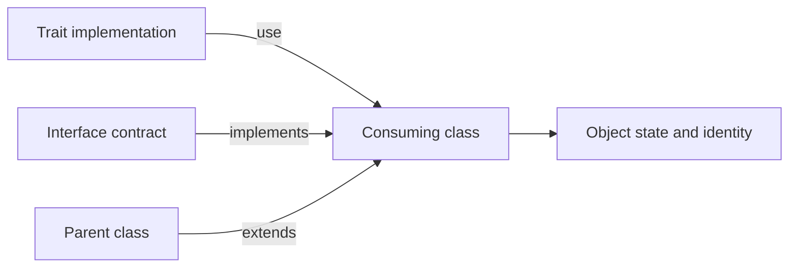

<TLDR>
  <TLDRCell label="what">
    A <Term id="trait">trait</Term> is a code-reuse unit that composes methods, properties, and constants into a class. It cannot be instantiated and is not a runtime capability type you can use for a parameter contract.
  </TLDRCell>
  <TLDRCell label="trap">
    Two traits that provide the same method make the class declaration fail. A trait's hidden assumptions about `$this`, properties, or static state can also create a host contract that is hard to see.
  </TLDRCell>
  <TLDRCell label="fix">
    Select implementations with `insteadof` and retain aliases with `as`. Declare the trait's requirements as abstract methods, and express the public capability that callers need with an interface.
  </TLDRCell>
</TLDR>

## What it is and why it exists

A trait is PHP's mechanism for horizontal code reuse. A class can extend only one parent but can `use` several traits, so a trait can place the same members in otherwise unrelated classes without inventing an unnatural common parent.

A trait resembles a class and can declare concrete methods, abstract methods, properties, static members, and constants, but it has no independent instances. PHP composes those members when it defines the consuming class. The object remains an instance of that class, and `$this` in an imported method refers to that object.

This mechanism reuses implementation; it does not define a type contract. Callers cannot reliably require a capability merely because a class uses a particular trait. When implementations must be substitutable, make the classes implement an interface and let the trait provide their shared implementation of the interface methods.

Traits fit fine-grained, cohesive behavior that is genuinely identical across several classes, such as formatting identifiers or recording domain events. If behavior needs a replaceable service, its own lifecycle, or extensive configuration, object <Term id="composition">composition</Term> through constructor injection is usually clearer and easier to test independently.

Horizontal composition and object composition are different mechanisms. A trait contributes members to its consuming class. Object composition gives an object a collaborator and delegates work across an explicit runtime reference; the former reuses implementation, while the latter preserves a runtime boundary.

## How it works

PHP processes each `use` when it resolves a class declaration. You can reason about the result as trait members becoming members of the consuming class, but this is not raw textual pasting: the language still applies method precedence, signature compatibility, property compatibility, and visibility checks.

Ordinary method precedence is fixed as current class, trait, then parent class. A trait method therefore overrides an inherited method with the same name, while a method declared in the current class overrides the trait method. This order does not require `insteadof`.

If two used traits provide the same method name, PHP does not guess your intent. The class must select one implementation in the `use` adaptation block with `TraitA::method insteadof TraitB`, or the class declaration raises a fatal error.

`as` adds another entry point and can adjust that entry point's visibility; it does not remove or rename the original method. The usual pattern is to select the default implementation with `insteadof`, then alias the excluded implementation when both versions must remain available.



A trait can list operations required from its host as abstract methods. The consuming class or its parent must supply compatible implementations. This turns hidden assumptions such as `$this->property` into method requirements the compiler can check.

Interfaces and traits often work together, but their responsibilities differ. This comparison targets PHP 8.3: interface methods have no method bodies in that version, and interface properties arrive only in PHP 8.4.

| Mechanism | Reuses method implementations | Holds instance state | Usable as a parameter type | Primary purpose |
| --- | --- | --- | --- | --- |
| Trait | Yes | May declare properties | No | Reuse members across classes |
| Interface | No | No | Yes | Define a substitutable capability |
| Abstract class | Yes | Yes | Yes | Share a parent contract and lifecycle |
| Object composition | Through delegation | Each collaborator owns its state | Depend on an interface | Preserve runtime boundaries |

A trait property becomes an instance property on each object, while a static property belongs to the resulting class-level storage. The recurring mistake is to confuse reusing one declaration with every object or every class sharing one value. Instance, class, and inheritance boundaries must be analyzed separately.

## Examples

These four examples build from basic reuse to method adaptation, member precedence, and PHP 8.3 static-property behavior. Each file was executed with local PHP 8.3.33, and every output below is from that run.

### Declare host requirements with abstract methods

`FormatsReference` implements only the formatting algorithm and leaves the prefix and numeric source to each consumer. The interface lets callers depend on `reference()` without knowing which trait the class uses.

<Depth level="quick">

```php title="reference_format.php"
<?php
declare(strict_types=1);

interface Referenceable
{
    public function reference(): string;
}

trait FormatsReference
{
    abstract protected function referencePrefix(): string;
    abstract protected function referenceId(): int;

    public function reference(): string
    {
        return sprintf('%s-%05d', $this->referencePrefix(), $this->referenceId());
    }
}

final class Invoice implements Referenceable
{
    use FormatsReference;

    public function __construct(private int $id) {}
    protected function referencePrefix(): string { return 'INV'; }
    protected function referenceId(): int { return $this->id; }
}

final class ReturnRequest implements Referenceable
{
    use FormatsReference;

    public function __construct(private int $id) {}
    protected function referencePrefix(): string { return 'RET'; }
    protected function referenceId(): int { return $this->id; }
}

echo (new Invoice(42))->reference(), "\n";
echo (new ReturnRequest(7))->reference(), "\n";
```

```text
INV-00042
RET-00007
```

<TryToBreak items={['an ID of 0', 'a negative ID', 'a prefix containing whitespace']} />

</Depth>

The two classes reuse one concrete method while supplying the protected operations the trait requires. The example does not validate IDs because the trait cannot know whether a domain permits zero or negative values. Each consumer should make that invariant explicit at its construction boundary.

The implementation would still run without `Referenceable`, but callers could then depend only on the concrete classes or an informal convention. The interface and trait are not redundant: one describes the externally visible capability, and the other removes duplicate implementation.

### Resolve a method conflict between traits

Both formatting traits declare `format()`. The adaptation block selects JSON as the default and retains the text implementation through `formatText()`.

```php title="conflict_resolution.php"
<?php
declare(strict_types=1);

trait TextFormatter
{
    public function format(array $record): string
    {
        return sprintf('%s#%d', $record['event'], $record['id']);
    }
}

trait JsonFormatter
{
    public function format(array $record): string
    {
        return json_encode($record, JSON_THROW_ON_ERROR);
    }
}

final class AuditFormatter
{
    use TextFormatter, JsonFormatter {
        JsonFormatter::format insteadof TextFormatter;
        TextFormatter::format as formatText;
    }
}

$formatter = new AuditFormatter();
$record = ['event' => 'paid', 'id' => 17];

echo $formatter->format($record), "\n";
echo $formatter->formatText($record), "\n";
```

```text
{"event":"paid","id":17}
paid#17
```

`insteadof` decides only which trait implementation occupies the original method name. `as formatText` does not alter `TextFormatter::format()`; it adds another name for that implementation on the resulting class.

When the alias is only for internal use, you can write `TextFormatter::format as private formatText`. Only the new entry point becomes `private`; the original entry point's visibility does not change with it.

### Observe class, trait, and parent precedence

`CsvImport` has no `source()` declaration of its own, so the trait overrides the parent implementation. `NamedImport` declares the same method in its class body, so the class implementation wins.

```php title="member_precedence.php"
<?php
declare(strict_types=1);

trait DescribesSource
{
    public function source(): string
    {
        return 'trait';
    }
}

class BaseImport
{
    public function source(): string
    {
        return 'parent';
    }
}

class CsvImport extends BaseImport
{
    use DescribesSource;
}

final class NamedImport extends BaseImport
{
    use DescribesSource;

    public function source(): string
    {
        return 'class';
    }
}

echo (new BaseImport())->source(), "\n";
echo (new CsvImport())->source(), "\n";
echo (new NamedImport())->source(), "\n";
```

```text
parent
trait
class
```

This precedence matters during refactoring. Adding a same-named method to the class can silently replace trait behavior. Removing the class method can expose the trait implementation rather than falling back to the parent.

If a class must extend a trait implementation, preserve the trait method under an alias in the adaptation block and call that alias from the class method. Calling `$this->source()` directly inside the overriding method only enters the current method again and recurses.

### Distinguish inheritance from using the trait again

In PHP 8.3, a child that merely inherits its parent's trait static property sees the same class-level storage. A child that `use`s the trait again gets a distinct static property. The three recordings below therefore produce `2, 2, 1`.

```php title="static_state.php"
<?php
declare(strict_types=1);

trait CountsRuns
{
    public static int $runs = 0;

    public static function record(): void
    {
        static::$runs++;
    }
}

class BaseWorker
{
    use CountsRuns;
}

class InheritedWorker extends BaseWorker {}

class ReusingWorker extends BaseWorker
{
    use CountsRuns;
}

BaseWorker::record();
InheritedWorker::record();
ReusingWorker::record();

echo BaseWorker::$runs, "\n";
echo InheritedWorker::$runs, "\n";
echo ReusingWorker::$runs, "\n";
```

```text
2
2
1
```

This is not a per-object counter. A static property persists across instances of that class and does not automatically reset between requests in a long-running worker or between tests in one process.

The PHP 8.3 change applies when a child class uses the same trait again within an inheritance hierarchy. If a library must support older PHP versions, encode this version boundary in tests instead of relying on the simplified claim that every class always gets its own copy.

## Pitfalls

### Treating a trait as a capability type

> [!PITFALL]
> A class using a trait does not mean its objects implement a type contract named after that trait. A parameter type named for the trait cannot mean "any object that uses this trait" and makes substitution depend on an implementation detail.

**Fix:** define a small interface for the methods the caller actually needs, then implement it on the consuming classes. The trait may provide the shared implementation, but business code should depend on the interface or a concrete domain type.

### Hiding assumptions about the host class

> [!PITFALL]
> Generated or copied traits often read `$this->name`, call `$this->save()`, or declare a constructor. Those dependencies and the required initialization order are not visible from the trait's public methods.

**Fix:** declare required operations as abstract methods and let the class constructor establish its invariant. When a trait genuinely needs private internal state, use specific names and test compatibility with every consumer's properties and lifecycle.

### Treating `as` as a rename

> [!PITFALL]
> `Logger::write as private writeLog` adds a private alias but does not remove the original `write()` or resolve a conflict with another trait's `write()`. Misreading it can leave an unintended public API or preserve a fatal collision.

**Fix:** select the implementation for the original name with `insteadof`, then create any aliases. Inspect the final visibility of both the original method name and every alias.

### Declaring incompatible properties or constants

> [!PITFALL]
> A trait property and same-named class property can be composed only when their visibility, type, `readonly` modifier, and initial value are compatible. Trait and class constants have their own compatibility rules, and a mismatch makes class loading fail.

**Fix:** avoid giving a general-purpose trait collision-prone public state. When internal state is necessary, declare it in one place in the trait and expose methods around it. Load and test every consumer before upgrading the trait.

### Misidentifying the owner of static state

> [!PITFALL]
> A trait static property is not object state, and inheritance sharing depends on whether the child uses the trait again. Accessing static members directly through the trait name has also been deprecated since PHP 8.1.

**Fix:** access static members through a consuming class and test the parent, an inheriting child, and a child that uses the trait again separately. Do not keep request- or tenant-owned state in an unbounded static property.

### Hiding service dependencies in a trait

> [!PITFALL]
> A trait that pulls a database, cache, or network client from a global container makes its class constructor appear dependency-free while requiring external resources at runtime. Tests must replace globals, and several traits can create an implicit call order.

**Fix:** inject lifecycle-bearing services as interface collaborators. Keep a trait focused on a small algorithm, or let it call only host operations declared explicitly as abstract methods.

<Depth level="deep">

## Semantics after members enter the class

Trait methods use the consuming class's scope and can therefore access its private and protected members. That is convenient for reusing internal algorithms, but it can bind the trait more tightly to its host than the public API reveals. Abstract methods can expose method dependencies, but they cannot fully declare a required property layout.

When a class method overrides a trait method, the trait implementation does not automatically gain a `parent::`-like name. If the class still needs to call it, preserve an alias in the `use` adaptation block and call the alias explicitly. The alias becomes another method entry point on the class, and reflection can report the trait alias mapping.

A trait can use other traits. The outer trait still contributes their combined members to the class, so nesting does not postpone conflicts. Same-named members arriving through two branches must be resolved in an adaptation block where both traits are visible.

PHP 8.3 allows an imported method to be marked `final` in an adaptation block with `SomeTrait::method as final`. This prevents child classes from overriding the imported method, but the class that directly uses the trait may still declare its own same-named method. `final` is therefore neither a conflict selection mechanism nor a global property of the trait.

Visibility adaptation likewise affects an entry point on the resulting class. Making a method `protected` or `private` can break an interface promised by the consumer. PHP checks at class declaration that a compatible `public` implementation still satisfies every public interface method.

## Properties, constants, and static state

Instance properties in a trait participate in initialization, visibility, and type rules just like class properties. Each object has its own instance value, but property names enter one class namespace, so same-named declarations from two traits or from a trait and class must be compatible.

PHP 8.3 property compatibility requires the same visibility, type, `readonly` modifier, and initial value. Even when two declarations express the same business intent, PHP rejects the class if those structural conditions differ. `insteadof` and `as` apply only to methods and cannot resolve property conflicts.

Traits have been able to declare constants since PHP 8.2. If the class declares the same constant, its value, visibility, and `final` status must remain compatible. Method adaptation syntax cannot select between two conflicting constants either.

| State location | Owner | Common misconception | Boundary to test |
| --- | --- | --- | --- |
| Trait instance property | Each object | All consumers share it | Interleave two objects |
| Trait static property | Effective class-level storage | Each object gets one | Two instances and two classes |
| Inherited static property | Inheritance hierarchy | Every child is necessarily isolated | Parent and inheritance-only child |
| Static property from child using trait again | Separate in PHP 8.3 | It still shares with the parent | Parent and trait-reusing child |

Static properties readily contaminate tests because the next test in the same PHP process sees the previous test's value. Maintaining invisible global state through reset methods is often less reliable than putting the counter or registry in an explicit object and giving its lifetime to application assembly code.

## Abstract requirements and public contracts

An abstract trait method specifies requirements for its name, visibility, parameters, and return type. A compatible implementation may come from the consuming class or an inherited parent method, but it must satisfy PHP's signature compatibility rules. Callers can also observe public parameter names through named arguments, so public implementations should preserve the interface names.

Abstract methods expose errors earlier, but they still do not create a runtime capability type. A service receiving `Referenceable` can accept any compatible implementation. A service checking `class_uses()` or `ReflectionClass::getTraits()` instead forces every implementation to adopt one code-reuse technique.

Reflection is appropriate for diagnosing which traits contributed members, inspecting aliases after adaptation, or implementing a framework's explicit metaprogramming convention. Ordinary domain dispatch should use interfaces, attributes, or explicit registration rather than trait presence. Otherwise, refactoring a trait into a delegated object breaks callers for no behavioral reason.

In PHP 8.3, interfaces declare public methods and constants but do not provide default method bodies. The old draft's claim that interfaces gained default implementations after PHP 8.0 was incorrect. PHP 8.0 introduced changes such as named arguments, not Java-style default interface methods.

## Design boundaries and tests

A good trait usually has a narrow entry point, little internal state, and explicit host requirements. If it needs a constructor, several mutable properties, global services, and documentation for call ordering, the design is no longer merely reusing a small implementation. A separate collaborator expresses identity, lifetime, and substitution boundaries more directly.

Test behavior through final consuming classes rather than trying to test a trait that cannot be instantiated. Use at least two consumers to prove the implementation does not rely on one class's accidental properties. Then add an interface implementation that does not use the trait to prove callers depend on the contract.

Conflict tests must actually load the class that combines all traits. Running a syntax check only on individual trait files cannot prove that the final composition has no duplicate members. In an autoloaded project, make tests or a preload step reach every consuming class.

State tests must separate object boundaries from class boundaries. Interleave operations on two objects for instance properties; exercise two classes and inheritance variants for static properties. If the code runs in a persistent worker, also simulate two requests and verify when state resets.

Before refactoring a trait, pin down public interface behavior and member-conflict tests, then change the reuse technique. That keeps a move from a trait to a collaborator as an implementation change and prevents callers from depending on the trait name, alias layout, or reflection details.

</Depth>

<Checkpoint id="php/traits" />

## Further reading

- [PHP manual: Traits](https://www.php.net/manual/en/language.oop5.traits.php)
- [PHP manual: Visibility](https://www.php.net/manual/en/language.oop5.visibility.php)
- [PHP manual: Object Interfaces](https://www.php.net/manual/en/language.oop5.interfaces.php)
- [PHP manual: `ReflectionClass::getTraits()`](https://www.php.net/manual/en/reflectionclass.gettraits.php)
- [PHP manual: `ReflectionClass::getTraitAliases()`](https://www.php.net/manual/en/reflectionclass.gettraitaliases.php)
