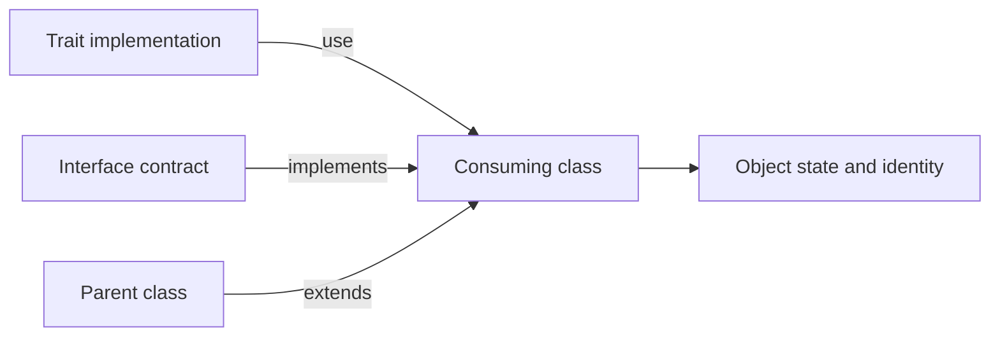

<TLDR>
  <TLDRCell label="what">
    <Term id="trait">Trait</Term> 是把方法、属性和常量组合进类的代码复用单元。它不能实例化，也不是可以用于参数类型声明的运行时能力类型。
  </TLDRCell>
  <TLDRCell label="trap">
    两个 Trait 提供同名方法会让类声明失败；Trait 对 `$this`、属性或静态状态的隐含假设还会制造难以发现的宿主契约。
  </TLDRCell>
  <TLDRCell label="fix">
    用 `insteadof` 选择实现、用 `as` 保留别名；用抽象方法声明 Trait 的需求，并用接口表达调用方依赖的公开能力。
  </TLDRCell>
</TLDR>

## 是什么，为什么存在

Trait 是 PHP 的横向代码复用机制。一个类只能继承一个父类，却可以 `use` 多个 Trait；Trait 因而能把同一组成员放进彼此无关的类，而不必制造一个不自然的公共父类。

Trait 看起来像类，也能声明具体方法、抽象方法、属性、静态成员和常量，但它没有独立实例。PHP 在定义使用方的类时组合这些成员；对象仍然是使用方类的实例，方法调用中的 `$this` 也指向该对象。

这解决的是实现复用，不是类型契约。调用方不能仅凭某个类使用了 Trait，就通过 Trait 名称稳定地要求一种能力。需要可替换实现时，应让类实现接口；Trait 可以为多个实现类提供接口方法的共同实现。

Trait 适合细粒度、内聚而且在多个类中确实相同的行为，例如统一格式化标识或记录领域事件。若行为需要可替换的服务、独立生命周期或大量配置，构造器注入的<Term id="composition">对象组合（composition）</Term>通常更清楚，也更容易单独测试。

「横向组合」和对象组合不是同一件事。Trait 把成员纳入使用方类；对象组合则让一个对象持有协作者，并通过明确引用转发工作。前者复用实现，后者保留运行时边界。

## 工作原理

解析类声明时，PHP 会处理其中的 `use`。可以把结果理解为 Trait 成员成为使用方类的成员，但这不是简单的文本粘贴：语言仍会执行方法优先级、签名兼容性、属性兼容性和可见性检查。

普通方法的优先级固定为「当前类、Trait、父类」。因此，Trait 方法会覆盖继承来的同名方法，而当前类自己声明的同名方法又会覆盖 Trait 方法。这个顺序不需要 `insteadof`。

两个被使用的 Trait 若提供同名方法，PHP 不会猜测意图。类必须在 `use` 适配块中用 `TraitA::method insteadof TraitB` 选出一个实现，否则类声明产生致命错误。

`as` 创建另一个入口，也可以调整该入口的可见性；它不会把原方法删除或改名。通常先用 `insteadof` 选出默认实现，再为被排除的实现建立别名，才能同时保留两个版本。



Trait 可以用抽象方法列出具体方法所依赖的宿主操作。使用方类或它的父类必须提供兼容实现；这样，隐藏的 `$this->property` 假设就能变成编译器可检查的方法需求。

接口与 Trait 经常配合，但职责不同。下面的对比以 PHP 8.3 为准；该版本的接口方法没有方法体，接口属性则是 PHP 8.4 才加入的能力。

| 机制 | 复用方法实现 | 保存实例状态 | 作为参数类型 | 主要用途 |
| --- | --- | --- | --- | --- |
| Trait | 是 | 可声明属性 | 否 | 在类之间复用成员 |
| 接口 | 否 | 否 | 是 | 定义可替换能力 |
| 抽象类 | 是 | 是 | 是 | 共享父类契约与生命周期 |
| 对象组合 | 通过委托 | 协作者各自拥有 | 依赖接口 | 保留运行时边界 |

Trait 属性会成为每个对象的属性，静态属性则属于最终形成的类级存储。这里最容易出错的是把「复用一份声明」误解成「所有对象或所有类共享同一份状态」；实例、类和继承层次必须分别判断。

## 示例

下面四个示例依次展示基本复用、同名方法适配、成员优先级和 PHP 8.3 的静态属性规则。每个文件都使用本地 PHP 8.3.33 实际执行，输出来自对应命令。

### 用抽象方法声明宿主需求

`FormatsReference` 只实现格式化算法，把前缀与数字来源留给使用方。接口则让调用方能够依赖 `reference()`，不必知道类使用了哪个 Trait。

<Depth level="quick">

```php title="reference_format.php"
<?php
declare(strict_types=1);

interface Referenceable
{
    public function reference(): string;
}

trait FormatsReference
{
    abstract protected function referencePrefix(): string;
    abstract protected function referenceId(): int;

    public function reference(): string
    {
        return sprintf('%s-%05d', $this->referencePrefix(), $this->referenceId());
    }
}

final class Invoice implements Referenceable
{
    use FormatsReference;

    public function __construct(private int $id) {}
    protected function referencePrefix(): string { return 'INV'; }
    protected function referenceId(): int { return $this->id; }
}

final class ReturnRequest implements Referenceable
{
    use FormatsReference;

    public function __construct(private int $id) {}
    protected function referencePrefix(): string { return 'RET'; }
    protected function referenceId(): int { return $this->id; }
}

echo (new Invoice(42))->reference(), "\n";
echo (new ReturnRequest(7))->reference(), "\n";
```

```text
INV-00042
RET-00007
```

<TryToBreak items={['ID 为 0', '负数 ID', '包含空格的前缀']} />

</Depth>

两个类复用同一个具体方法，却各自提供 Trait 要求的受保护操作。示例没有验证 ID，因为 Trait 不知道领域是否允许零或负数；该不变量应由各使用方在构造边界明确决定。

如果只写 Trait 而不写 `Referenceable`，实现仍能工作，但调用方只能依赖具体类或另建约定。接口与 Trait 同时出现不是重复：一个描述外部可见能力，另一个消除实现重复。

### 解决两个 Trait 的方法冲突

两个格式化 Trait 都声明 `format()`。适配块选择 JSON 作为默认格式，同时为文本版本保留 `formatText()` 入口。

```php title="conflict_resolution.php"
<?php
declare(strict_types=1);

trait TextFormatter
{
    public function format(array $record): string
    {
        return sprintf('%s#%d', $record['event'], $record['id']);
    }
}

trait JsonFormatter
{
    public function format(array $record): string
    {
        return json_encode($record, JSON_THROW_ON_ERROR);
    }
}

final class AuditFormatter
{
    use TextFormatter, JsonFormatter {
        JsonFormatter::format insteadof TextFormatter;
        TextFormatter::format as formatText;
    }
}

$formatter = new AuditFormatter();
$record = ['event' => 'paid', 'id' => 17];

echo $formatter->format($record), "\n";
echo $formatter->formatText($record), "\n";
```

```text
{"event":"paid","id":17}
paid#17
```

`insteadof` 只决定两个 Trait 之间哪个实现占用原方法名。`as formatText` 没有修改 `TextFormatter::format()` 的实现，只是在最终类上为它增加了另一个名称。

若别名只供类内部使用，可以写成 `TextFormatter::format as private formatText`。这只会让新入口变成 `private`；原入口的可见性不会随之改变。

### 观察类、Trait 与父类的优先级

`CsvImport` 没有自己声明 `source()`，所以 Trait 覆盖父类实现。`NamedImport` 在类体中声明同名方法，因此类自己的实现获胜。

```php title="member_precedence.php"
<?php
declare(strict_types=1);

trait DescribesSource
{
    public function source(): string
    {
        return 'trait';
    }
}

class BaseImport
{
    public function source(): string
    {
        return 'parent';
    }
}

class CsvImport extends BaseImport
{
    use DescribesSource;
}

final class NamedImport extends BaseImport
{
    use DescribesSource;

    public function source(): string
    {
        return 'class';
    }
}

echo (new BaseImport())->source(), "\n";
echo (new CsvImport())->source(), "\n";
echo (new NamedImport())->source(), "\n";
```

```text
parent
trait
class
```

这项优先级在重构时很重要。给类增加一个同名方法可能悄悄替换原先的 Trait 行为；删除类方法则可能让调用落到 Trait，而不是落回父类。

若类需要扩展 Trait 实现，应先用 `as` 保存别名，再从类方法调用该别名。直接在覆盖方法中调用 `$this->source()` 只会再次进入当前方法并导致递归。

### 区分继承与再次使用 Trait

PHP 8.3 中，子类仅继承父类的 Trait 静态属性时，两者看到同一份类级存储；子类再次 `use` 该 Trait 后会得到独立静态属性。下面三次记录因此形成 `2、2、1`。

```php title="static_state.php"
<?php
declare(strict_types=1);

trait CountsRuns
{
    public static int $runs = 0;

    public static function record(): void
    {
        static::$runs++;
    }
}

class BaseWorker
{
    use CountsRuns;
}

class InheritedWorker extends BaseWorker {}

class ReusingWorker extends BaseWorker
{
    use CountsRuns;
}

BaseWorker::record();
InheritedWorker::record();
ReusingWorker::record();

echo BaseWorker::$runs, "\n";
echo InheritedWorker::$runs, "\n";
echo ReusingWorker::$runs, "\n";
```

```text
2
2
1
```

这不是每对象计数器。静态属性会跨该类的实例持续存在，在长生命周期工作进程和测试进程中也不会自动按请求清零。

PHP 8.3 改变的是子类再次使用同一 Trait 时的继承层次行为。维护需要兼容旧版本的库时，应把这个版本边界写进测试，不要靠「每个类各有一份」这样的简化口号。

## 陷阱

### 把 Trait 当作能力类型

> [!PITFALL]
> 类使用某个 Trait，不等于对象实现了以该 Trait 命名的类型契约。以 Trait 名称写参数类型不能表达「任何使用这个 Trait 的对象」，也让替换实现依赖代码组织细节。

**修复方法：** 为调用方真正需要的方法定义小接口，让使用方类实现该接口。Trait 可以提供接口方法的默认实现，但业务代码应依赖接口或具体领域类型。

### 隐藏对宿主类的假设

> [!PITFALL]
> 生成或复制的 Trait 经常直接读取 `$this->name`、调用 `$this->save()`，或者声明构造器。只看 Trait 的公开方法时，这些依赖与初始化顺序并不明显。

**修复方法：** 用抽象方法声明必要操作，让类自己的构造器建立不变量。Trait 确实需要私有内部状态时，使用足够具体的名称，并测试它与每个使用方的属性和生命周期是否兼容。

### 把 `as` 当成重命名

> [!PITFALL]
> `Logger::write as private writeLog` 会增加一个私有别名，但不会删除原来的 `write()`，也不会自动解决另一个 Trait 提供的 `write()` 冲突。错误理解会意外扩大公开 API，或仍然得到致命错误。

**修复方法：** 有冲突时先用 `insteadof` 选出原名称对应的实现，再按需要建立别名。分别检查原方法名与别名的最终可见性。

### 声明不兼容的同名属性或常量

> [!PITFALL]
> Trait 与类声明同名属性时，只有可见性、类型、`readonly` 修饰符和初始值兼容才允许组合。Trait 常量与类常量也必须满足自身的兼容规则，否则类在加载时失败。

**修复方法：** 避免让通用 Trait 拥有容易冲突的公共状态。必须保存内部状态时，统一由 Trait 声明并通过方法访问；升级 Trait 前，在所有使用方上执行加载与测试。

### 误判静态状态的所有者

> [!PITFALL]
> Trait 静态属性不是对象状态，继承链中的共享方式还取决于子类是否再次使用 Trait。直接通过 Trait 名称访问静态成员自 PHP 8.1 起已经弃用。

**修复方法：** 通过使用方类访问静态成员，并针对父类、仅继承的子类和再次使用 Trait 的子类分别测试。请求级或租户级状态不要放在无边界的静态属性中。

### 用 Trait 隐藏服务依赖

> [!PITFALL]
> 一个 Trait 若从全局容器取数据库、缓存或网络客户端，类的构造器看起来没有依赖，运行时却依赖外部资源。测试只能靠全局替换，多个 Trait 之间也容易形成隐含调用顺序。

**修复方法：** 把有生命周期的服务作为接口协作者注入类。Trait 保留纯粹、细粒度的算法，或者只调用由抽象方法明确声明的宿主操作。

## AI 时代

**生成代码在这里常犯的错**

模型常把两个各自可用的 Trait 同时加入类，却漏掉同名方法适配，导致自动加载该类时出现致命错误。它也会把 `as private alias` 误写成对原方法的改名，把仍然公开的入口留在 API 中；另一类错误是直接假设 `$this->repository` 存在，或为了「复用计数器」把请求状态放进 Trait 静态属性。针对旧版 PHP 学到的代码还可能假设父类与再次使用 Trait 的子类共享静态属性，这在 PHP 8.3 已不成立。

**让 AI 检查**

- 列出类、父类和所有直接或嵌套 Trait 提供的成员，标出同名方法、属性与常量，并给出最终来源。
- 对每个 `insteadof` 和 `as` 写出原名称、别名、可见性与可调用入口，不要只解释语法。
- 查找 Trait 中每个 `$this` 访问和静态写入，说明宿主契约、状态所有者、初始化位置与进程生命周期。

**审查清单**

- 对所有修改过的使用方运行 `php -l` 和测试，确保冲突在自动加载前就被发现。
- 通过接口调用复用行为，并验证不使用该 Trait 的第二个实现也能替换。
- 在 PHP 8.3 上分别测试父类、仅继承的子类和再次使用 Trait 的子类静态状态。

**提示词词汇**

使用准确术语：`trait composition`（Trait 组合）、`method precedence`（方法优先级）、`conflict resolution`（冲突解决）、`insteadof adaptation`（`insteadof` 适配）、`method alias`（方法别名）、`abstract trait method`（Trait 抽象方法）、`host class requirement`（宿主类需求）和 `trait static property`（Trait 静态属性）。要求模型输出成员来源表和状态所有权表；只说「复用这段代码」不足以确定公开契约。

<Depth level="deep">

## 成员进入类后的语义

Trait 方法采用使用方类的作用域，因此能够访问该类的私有和受保护成员。这种能力方便复用内部算法，也意味着 Trait 与宿主类可能形成比公开 API 更紧的耦合；抽象方法只能暴露方法依赖，不能完整声明所需属性布局。

当前类的方法覆盖 Trait 方法时，Trait 实现不会自动获得类似 `parent::` 的名称。若仍要调用它，应在 `use` 适配块中提前建立别名，再由类方法显式调用。别名是类上的新方法入口，反射也能看到 Trait 别名映射。

Trait 还能使用其他 Trait。外层 Trait 最终仍把组合后的成员交给类，因此嵌套不会推迟冲突：两个分支带来的同名成员仍必须在能同时看见它们的 `use` 适配块中解决。

PHP 8.3 允许在适配块中把导入方法标记为 `final`，写法是 `SomeTrait::method as final`。它阻止子类覆盖导入后的方法，但当前这个使用 Trait 的类仍可声明自己的同名方法；因此 `final` 不是选择冲突实现的替代品，也不是 Trait 自身的全局属性。

可见性适配同样只作用于最终类中的入口。把方法改成 `protected` 或 `private` 可能破坏使用方承诺的接口；PHP 会在类声明时检查公开接口方法是否仍由兼容的 `public` 实现满足。

## 属性、常量与静态状态

Trait 中的实例属性会像类属性一样参与初始化、可见性和类型规则。每个对象拥有自己的实例值，但属性名称进入同一个类命名空间，所以两个 Trait 或 Trait 与类之间的同名声明必须兼容。

PHP 8.3 对兼容属性要求相同的可见性、类型、`readonly` 修饰符和初始值。即使两个声明表达的业务意图相同，只要这些结构条件不同，PHP 也会拒绝类；`insteadof` 与 `as` 只处理方法，不能解决属性冲突。

Trait 从 PHP 8.2 起可以声明常量。类若声明同名常量，需要保持值、可见性和 `final` 状态兼容；方法适配语法同样不能选择两个冲突常量中的一个。

| 状态位置 | 所有者 | 常见误判 | 应测试的边界 |
| --- | --- | --- | --- |
| Trait 实例属性 | 每个对象 | 所有使用方共享 | 两个对象交错修改 |
| Trait 静态属性 | 有效类级存储 | 每个对象独立 | 两个实例与两个类 |
| 继承的静态属性 | 继承层次 | 每个子类必然独立 | 父类与仅继承子类 |
| 子类再次 `use` 的静态属性 | PHP 8.3 中独立 | 仍与父类共享 | 父类与再次使用子类 |

静态属性很容易让测试相互污染，因为同一个 PHP 进程中的下一项测试会看到前一项留下的值。与其在清理方法中维护隐形全局状态，通常更稳妥的做法是把计数器或注册表放进显式对象，并把它的生命周期交给应用装配代码。

## 抽象要求与公开契约

Trait 的抽象方法规定名称、可见性、参数和返回类型需求。具体实现可以来自使用方类，也可以来自它继承的父类，但必须满足 PHP 的签名兼容规则；参数名还可能被具名参数调用方观察到，因此公开方法应保持接口中的名称。

抽象方法让错误更早暴露，但它仍不是运行时可查询的能力类型。业务服务若接收 `Referenceable`，任何兼容实现都能参与；若服务改为检查 `class_uses()` 或 `ReflectionClass::getTraits()`，实现就被迫采用某种代码复用方式。

反射适合诊断成员来自哪些 Trait、适配后有哪些别名，或供框架执行明确约定的元编程。普通领域分派应依据接口、属性或显式注册，而不是依据 Trait 是否存在；否则把 Trait 重构成委托对象会无谓地破坏调用方。

接口在 PHP 8.3 中只声明公开方法与常量，不提供默认方法体。旧稿中「PHP 8.0 后接口可有默认实现」的说法不正确；PHP 8.0 引入具名参数等变化，并没有把 Java 风格的默认接口方法加入语言。

## 设计边界与测试

一个好的 Trait 通常有很窄的入口、很少的内部状态和明确的宿主需求。若它需要构造器、多个可变属性、全局服务和调用顺序文档，问题已经不只是复用几行实现；独立协作者能更直接地表达身份、生命周期与替换边界。

测试应从最终使用方观察行为，而不是直接测试不能实例化的 Trait。至少准备两个使用方，证明复用没有依赖某个类的偶然属性；再准备一个只实现接口、不使用 Trait 的替代实现，证明调用方依赖的是契约。

冲突测试必须让包含所有 Trait 的类真正被加载。只对单个 Trait 文件运行语法检查，无法证明最终组合没有同名成员；在依赖自动加载的项目里，应让测试或预加载步骤覆盖每个使用方类。

状态测试需要区分对象边界与类边界。实例属性用两个对象交错操作，静态属性用两个类和继承变体操作；若代码运行在常驻 Worker 中，还要跨两个模拟请求验证状态是否按预期重置。

重构 Trait 时，先固定公开接口测试与成员冲突测试，再改变内部复用方式。这样可以把「从 Trait 改成协作者」保持为实现变化，而不会让调用方依赖 Trait 名称、别名布局或反射细节。

</Depth>

<Checkpoint id="php/traits" />

## 延伸阅读

- [PHP 手册：Trait](https://www.php.net/manual/en/language.oop5.traits.php)
- [PHP 手册：可见性](https://www.php.net/manual/en/language.oop5.visibility.php)
- [PHP 手册：对象接口](https://www.php.net/manual/en/language.oop5.interfaces.php)
- [PHP 手册：`ReflectionClass::getTraits()`](https://www.php.net/manual/en/reflectionclass.gettraits.php)
- [PHP 手册：`ReflectionClass::getTraitAliases()`](https://www.php.net/manual/en/reflectionclass.gettraitaliases.php)
