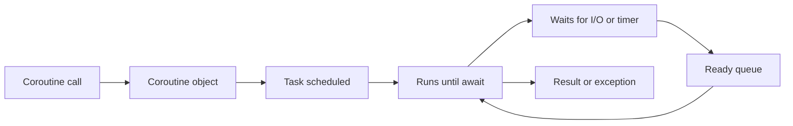

<TLDR>
  <TLDRCell label="what">
    `asyncio` lets one thread advance other coroutines while one is waiting for I/O. The concurrency
    comes from interleaving tasks, not from running Python code on several CPU cores at once.
  </TLDRCell>
  <TLDRCell label="trap">
    `async def` does not make a blocking call asynchronous. A missing `await`, a discarded task
    reference, or swallowed cancellation can silently lose work or prevent it from stopping on time.
  </TLDRCell>
  <TLDRCell label="fix">
    Use `asyncio.run()` for the top-level entry point, own child tasks with `TaskGroup`, and give
    external calls both a deadline and a concurrency limit.
  </TLDRCell>
</TLDR>

## What it is and why it exists

`asyncio` is Python's standard-library framework for asynchronous I/O. It provides an event loop,
<Term id="coroutine">coroutines</Term>, <Term id="asyncio-task">tasks</Term>, networking,
synchronization primitives, and queues. Its purpose is not to make one computation faster. It lets
the program keep working while an operation waits for a network, pipe, or timer.

A function defined with `async def` is a coroutine function. Calling it creates a coroutine object;
the body starts only when that object is awaited or wrapped in a task and scheduled by the event
loop. A task drives one coroutine and stores its eventual return value or exception.

You meet `asyncio` when a request must call several services concurrently, a client maintains many
connections, or a consumer waits for a continuing stream of messages. If the work is mostly CPU
computation, or a dependency can only block its current thread, changing the function to
`async def` does not create useful concurrency.

## How it works

A program normally calls `asyncio.run(main())` once. It creates an event loop, runs the entry
coroutine, finalizes asynchronous generators, and closes the executor on exit. Application code
usually uses these high-level interfaces instead of creating or closing a loop manually.

The event loop uses cooperative scheduling. One task runs until it finishes, raises an exception,
or waits on an awaitable that is not ready. The loop can then run another ready task. When a timer
or I/O operation becomes ready, the original task joins the ready queue again.



`await` expresses a dependency; `create_task()` expresses work that may overlap. Awaiting the first
call and then the second is still sequential. Creating both tasks before waiting for them allows
their waiting periods to overlap.

A controlled asynchronous operation usually follows this sequence:

1. The top-level entry point creates child tasks with an explicit owner.
2. Each child runs to a suspension point and gives control back to the event loop.
3. The event loop resumes the task when its resource is ready and records a result or exception.
4. The owner waits for its children and propagates failure, timeout, or cancellation.

Task switches occur only at boundaries that can suspend, but two tasks can still interleave state
changes across an `await`. Single-threaded does not mean race-free. If an invariant spans a
suspension point, protect it with a `Lock`, a message queue, or a better data-ownership design.

## Examples

### From coroutines to tasks

These two calls become tasks before `gather()` waits for both. The shorter wait lets `orders`
finish first, but the result list still follows the argument order passed to `gather()`.

<Depth level="quick">

```python run title="schedule_tasks.py"
import asyncio


async def fetch(label, delay):
    print(f"start {label}")
    await asyncio.sleep(delay)
    print(f"done {label}")
    return label.upper()


async def main():
    profile = asyncio.create_task(fetch("profile", 0.03), name="profile")
    orders = asyncio.create_task(fetch("orders", 0.01), name="orders")
    results = await asyncio.gather(profile, orders)
    print(results)


asyncio.run(main())
```

```text
start profile
start orders
done orders
done profile
['PROFILE', 'ORDERS']
```

</Depth>

Task names do not change scheduling, but they make logs, debuggers, and task dumps easier to follow.
`gather()` fits cases where you need to collect a set of results in input order. If the tasks belong
to one operation and the rest become pointless after one fails, `TaskGroup` has safer failure
semantics.

### Bind lifetimes with `TaskGroup`

<Term id="structured-concurrency">Structured concurrency</Term> constrains child-task lifetimes to
a lexical scope. Before the `TaskGroup` context exits, its tasks either all finish or complete
cancellation and cleanup on the failure path.

```python run title="task_group_failure.py"
import asyncio


async def worker(name, delay, fail=False):
    print(f"start {name}")
    try:
        await asyncio.sleep(delay)
        if fail:
            raise LookupError(f"missing {name}")
        print(f"done {name}")
    finally:
        print(f"cleanup {name}")


async def main():
    try:
        async with asyncio.TaskGroup() as group:
            group.create_task(worker("cache", 0.03))
            group.create_task(worker("database", 0.01, fail=True))
    except* LookupError as errors:
        print([str(error) for error in errors.exceptions])


asyncio.run(main())
```

```text
start cache
start database
cleanup database
cleanup cache
['missing database']
```

After `database` raises a non-cancellation exception, the group cancels the unfinished `cache`,
waits for its `finally` block, and then raises the failures as an exception group.
`except* LookupError` handles only the matching part of that group; unmatched exceptions continue
to propagate.

The example puts its cleanup log in `finally`, so it runs after success, failure, or cancellation.
Real resources need the same shape: acquire the resource, then guarantee release with
`try/finally` or an asynchronous context manager.

### Turn a deadline into cancellation

`asyncio.timeout()` applies a deadline to a region of waiting in the current task. When the deadline
expires, the context manager interrupts the wait through cancellation, then raises the built-in
`TimeoutError` to the caller after the context exits.

```python run title="timeout_cleanup.py"
import asyncio


async def reserve_inventory():
    print("reservation started")
    try:
        await asyncio.sleep(0.05)
        return "reserved"
    finally:
        print("reservation released")


async def main():
    try:
        async with asyncio.timeout(0.01):
            result = await reserve_inventory()
            print(result)
    except TimeoutError:
        print("deadline exceeded")
    print("caller continues")


asyncio.run(main())
```

```text
reservation started
reservation released
deadline exceeded
caller continues
```

Catch the exception outside the `async with`, because `TimeoutError` is formed while leaving the
context. The inner coroutine runs `finally` first, so the resource enters its cleanup path before
the caller observes the timeout. Cleanup should also be bounded; an endless cleanup defeats the
deadline.

### Bound concurrency

The number of tasks that exist and the number allowed to access an external resource are different.
`Semaphore(2)` lets all four tasks exist while allowing at most two into the guarded region at any
moment.

```python run title="bounded_work.py"
import asyncio


async def main():
    semaphore = asyncio.Semaphore(2)
    active = 0
    peak = 0

    async def convert(record):
        nonlocal active, peak
        async with semaphore:
            active += 1
            peak = max(peak, active)
            try:
                await asyncio.sleep(0.01)
                return record.upper()
            finally:
                active -= 1

    async with asyncio.TaskGroup() as group:
        tasks = [group.create_task(convert(name)) for name in ["a", "b", "c", "d"]]

    print([task.result() for task in tasks])
    print(f"peak={peak}")


asyncio.run(main())
```

```text
['A', 'B', 'C', 'D']
peak=2
```

All tasks have ended after the task group exits, so `task.result()` cannot encounter a task that is
still running. The reference list also retains creation order, making the result order stable even
when individual wait times determine a different completion order.

A semaphore is useful for placing a capacity limit around an existing batch of calls. For a
continuous work stream, a bounded `asyncio.Queue` is often a better fit: producers wait when the
queue is full, creating backpressure at ingestion instead of creating an unlimited number of tasks
that wait on a semaphore.

## Pitfalls

> [!PITFALL]
> Calling a coroutine function without `await` only creates a coroutine object. Its body does not
> run, and collection of that object may produce `RuntimeWarning: coroutine was never awaited`.
> **Fix:** `await` it in the current coroutine. For concurrent work, schedule it with
> `TaskGroup.create_task()` or `asyncio.create_task()`, then retain and await the task.

> [!PITFALL]
> `time.sleep()`, a synchronous HTTP client, and ordinary file reads still block the event loop
> when called inside `async def`. Other tasks cannot run during that block even when they are ready.
> **Fix:** prefer a genuinely asynchronous library. Send short, unavoidable blocking I/O through
> `asyncio.to_thread()`, and send CPU-heavy work to processes or a dedicated compute environment.

> [!PITFALL]
> Treating `asyncio.create_task(do_work())` as unmanaged background work loses ownership. The loop
> keeps only weak references to tasks, so an unreferenced task may be collected before completion,
> and nobody may retrieve its exception. **Fix:** prefer `TaskGroup`. For genuinely long-lived
> background tasks, keep strong references in a set, remove them on completion, and define shutdown.

> [!PITFALL]
> Catching `CancelledError` and returning breaks the cancellation protocol used by `TaskGroup` and
> `asyncio.timeout()`. The task may retain resources, and the caller cannot tell whether work stopped.
> **Fix:** release resources in `finally` and normally let `CancelledError` propagate. Only code that
> deliberately suppresses cancellation should also clear the task's cancellation state.

> [!PITFALL]
> Calling `gather(*(fetch(x) for x in items))` over an arbitrary input creates all the work at once.
> That can exhaust a connection pool, file descriptors, or downstream service capacity.
> **Fix:** bound in-flight calls with a semaphore, or connect production to consumption with a
> bounded queue. Derive the limit from resource budgets and service constraints, not a guess.

> [!PITFALL]
> Calling `asyncio.run()` inside a notebook, test runner, or web framework that already owns a
> running event loop raises `RuntimeError` and splits the host's lifecycle. **Fix:** call
> `asyncio.run()` only at the top of a synchronous program. Inside an async entry point, `await`
> directly and leave ownership of the event loop with the host framework.

<Depth level="deep">

## Suspension points and fairness

When the object being awaited is unfinished, the current task normally suspends. If the result is
already ready, the expression may return immediately and does not guarantee that another task gets
to run. A long loop that repeatedly awaits immediately completing coroutines can therefore occupy
the event loop for a long time.

When code truly needs to yield explicitly, `await asyncio.sleep(0)` provides an optimized path.
Frequent manual yields, however, usually signal that work partitioning or API boundaries need a
redesign. Fairness should not depend on which task happens to enter the ready queue first.

The loop executes Python code from only one task at a time, but races can still cross suspension
points. Reading a balance, awaiting, and then writing it back allows another task to change the
same state in between. Put the complete invariant under one lock, or give one consumer exclusive
ownership of the mutable state.

`asyncio.Lock` provides mutual exclusion; it does not make synchronous blocking code safe or fast.
Avoid uncontrolled remote calls while holding the lock, or one slow request will block every
contender. When the goal is to transfer work rather than share state, a queue is often easier to
reason about than a lock.

## Structured failure

By default, `gather()` propagates the first non-cancellation exception to its waiter, but it does not
automatically cancel the other awaitables for that reason. They may continue running. This suits
independent work whose remaining results still matter, but the caller must explicitly retain and
manage those tasks.

`TaskGroup` provides stronger whole-operation semantics. The first failure other than
`CancelledError` triggers cancellation of the remaining tasks. After waiting for every task to end,
the group raises the failures that still need reporting in an `ExceptionGroup` or
`BaseExceptionGroup`. `KeyboardInterrupt` and `SystemExit` have special re-raise rules.

An exception group preserves concurrent failures instead of retaining only the last exception.
`except*` splits out matching subgroups by type, letting you handle expected domain errors while
programming errors keep propagating. Do not use a broad `except* Exception` to turn every failure
into an empty result.

Tasks inside a group can add more tasks while the context remains active. Once the group has
finished, has not yet been entered, or has started shutting down, submitting a coroutine does not
start new work in that group. Keeping creation inside its owning scope makes this boundary visible.

## Cancellation, timeouts, and shielding

<Term id="cancellation">Cancellation</Term> is a request, not immediate thread termination.
`task.cancel()` arranges for the task to receive `CancelledError` at its next opportunity to run,
and the coroutine can execute `finally` first. After cleanup, cancellation should normally be
re-raised so owners throughout the task tree receive a consistent stop signal.

`CancelledError` directly subclasses `BaseException`, so an ordinary `except Exception` does not
catch it. Explicitly catching and not re-raising cancellation is the subtler failure. Code that
truly suppresses cancellation also needs `uncancel()` to clear the state, but application code
rarely needs to do this.

`asyncio.timeout()` limits a region in the current task and can be nested safely.
`asyncio.wait_for()` instead waits for one awaitable; after a timeout, it cancels that awaitable and
waits for cancellation to finish. If the target cleans up slowly, the actual return can therefore
occur after the nominal timeout.

`asyncio.shield()` can prevent cancellation of a caller from directly cancelling one inner task,
but the caller awaiting it still receives `CancelledError`. Shielding is not a mechanism for
ignoring background failures: keep a strong task reference and identify who will await the result.
It fits a short commit phase that must finish, not arbitrary work that must become unstoppable.

## Blocking boundaries and threads

`asyncio.to_thread()` calls a synchronous function in a separate thread and propagates the current
`contextvars` context. Because of the global interpreter lock, it is normally for blocking I/O.
Only extension code that releases the lock, or an implementation without that restriction, can use
it to run CPU work in parallel.

Code in that thread cannot manipulate event-loop objects arbitrarily. From another operating-system
thread, use `loop.call_soon_threadsafe()` to schedule an ordinary callback. Use
`asyncio.run_coroutine_threadsafe()` to submit a coroutine, then handle the returned concurrent
Future in the submitting thread.

Most `asyncio` objects are not thread-safe. That is a different problem from tasks needing an
`asyncio.Lock`: the former concerns operating-system threads crossing the event-loop boundary,
while the latter concerns coroutine interleaving within one loop. Establish which thread runs the
code before choosing a synchronization mechanism.

## Observability and debug mode

During development, set `PYTHONASYNCIODEBUG=1` or pass `debug=True` to `asyncio.run()`. Debug mode
reports never-awaited coroutines and non-thread-safe API calls from the wrong thread. It also logs
selector steps and callbacks that take too long.

Naming tasks and attaching request or job identifiers to logs helps reconstruct a task tree from
concurrent output. Do not rely on a task's default string representation as a stable interface.
Applications should record their own operation name, deadline, and outcome state.

Debug warnings only help when tests and shutdown paths actually run. Cover normal completion, child
failure, external cancellation, and timeout. Before the loop closes, verify that no tasks remain
and no task exception went unretrieved.

</Depth>

<Checkpoint id="python/asyncio" />

## Further reading

- [Python documentation: coroutines and tasks](https://docs.python.org/3.14/library/asyncio-task.html)
- [Python documentation: synchronization primitives](https://docs.python.org/3.14/library/asyncio-sync.html)
- [Python documentation: asynchronous queues](https://docs.python.org/3.14/library/asyncio-queue.html)
- [Python documentation: developing with asyncio](https://docs.python.org/3.14/library/asyncio-dev.html)
- [PEP 654: Exception Groups and `except*`](https://peps.python.org/pep-0654/)
