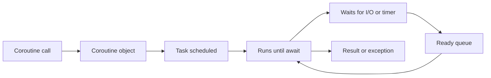

<TLDR>
  <TLDRCell label="what">
    `asyncio` 让一个线程在等待 I/O 时推进其他协程；并发来自任务交错执行，
    不是 Python 代码同时占用多个 CPU 核心。
  </TLDRCell>
  <TLDRCell label="trap">
    `async def` 不会把阻塞调用变成异步调用；遗漏 `await`、丢弃任务引用或吞掉取消，
    都会让工作静默丢失或无法按时停止。
  </TLDRCell>
  <TLDRCell label="fix">
    用 `asyncio.run()` 建立顶层入口，用 `TaskGroup` 管理子任务，并为外部调用设置截止时间和并发上限。
  </TLDRCell>
</TLDR>

## 它是什么以及为何存在

`asyncio` 是 Python 标准库中的异步 I/O 框架。它提供事件循环、
<Term id="coroutine">协程（coroutine）</Term>、<Term id="asyncio-task">任务（task）</Term>、
网络 I/O、同步原语和队列。它解决的问题不是让一次计算更快，
而是让程序在某项操作等待网络、管道或计时器时，不必让整个线程一起等待。

用 `async def` 定义的函数是协程函数。调用它只会创建协程对象，
函数体要等到对象被 `await`，或被包装成任务并由事件循环调度后才开始运行。
任务负责驱动一个协程，并保存它最终返回的结果或抛出的异常。

当一个请求需要并发访问多个服务、一个客户端要维持许多连接，
或一个消费者要等待持续到来的消息时，你会遇到 `asyncio`。
如果工作主要消耗 CPU，或依赖只能阻塞当前线程的库，
仅把函数改成 `async def` 并不会带来有效并发。

## 工作机制

程序通常只调用一次 `asyncio.run(main())`。它创建事件循环，
运行入口协程，完成异步生成器的收尾，并在退出时关闭执行器。
应用代码一般使用这些高层接口，而不是手动创建或关闭循环。

事件循环采用协作式调度。一个任务持续运行，直到它完成、抛出异常，
或等待一个尚未就绪的 awaitable。此时循环可以运行另一个就绪任务；
计时器或 I/O 变为就绪后，原任务会再次进入就绪队列。



`await` 表达依赖关系，`create_task()` 表达可重叠的工作。
先 `await` 第一个调用，再 `await` 第二个调用，仍然是顺序执行；
先创建两个任务再等待它们，才允许两个等待阶段重叠。

一次受控的异步调用通常经历以下过程：

1. 顶层入口创建具有明确所有者的子任务。
2. 子任务运行到等待点，把控制权交还事件循环。
3. 事件循环在资源就绪后恢复任务，并记录结果或异常。
4. 所有者等待子任务完成，并传播失败、超时或取消。

任务切换只会发生在能够暂停的边界，因此两个任务仍可能在多个 `await` 之间交错修改状态。
单线程不等于没有竞态；如果一项不变量跨越等待点，
应使用 `Lock`、消息队列或重新设计数据所有权来保护它。

## 示例

### 从协程创建任务

下面两个调用先被创建为任务，再由 `gather()` 一起等待。
`orders` 的等待时间更短，所以先完成；结果列表仍按传入 `gather()` 的顺序排列。

<Depth level="quick">

```python run title="schedule_tasks.py"
import asyncio


async def fetch(label, delay):
    print(f"start {label}")
    await asyncio.sleep(delay)
    print(f"done {label}")
    return label.upper()


async def main():
    profile = asyncio.create_task(fetch("profile", 0.03), name="profile")
    orders = asyncio.create_task(fetch("orders", 0.01), name="orders")
    results = await asyncio.gather(profile, orders)
    print(results)


asyncio.run(main())
```

```text
start profile
start orders
done orders
done profile
['PROFILE', 'ORDERS']
```

</Depth>

任务名称不会改变调度行为，但会让日志、调试器和任务转储更容易定位。
`gather()` 适合你确实需要按输入顺序收集一组结果的情况；
如果这些任务属于同一项操作，并且一个失败后其余任务就不再有意义，`TaskGroup` 的故障语义更安全。

### 用 `TaskGroup` 绑定生命周期

<Term id="structured-concurrency">结构化并发（structured concurrency）</Term>
要求子任务的生命周期受词法作用域约束。退出 `TaskGroup` 的 `async with` 之前，
组内任务要么全部完成，要么在失败路径上完成取消与收尾。

```python run title="task_group_failure.py"
import asyncio


async def worker(name, delay, fail=False):
    print(f"start {name}")
    try:
        await asyncio.sleep(delay)
        if fail:
            raise LookupError(f"missing {name}")
        print(f"done {name}")
    finally:
        print(f"cleanup {name}")


async def main():
    try:
        async with asyncio.TaskGroup() as group:
            group.create_task(worker("cache", 0.03))
            group.create_task(worker("database", 0.01, fail=True))
    except* LookupError as errors:
        print([str(error) for error in errors.exceptions])


asyncio.run(main())
```

```text
start cache
start database
cleanup database
cleanup cache
['missing database']
```

`database` 抛出非取消异常后，任务组会取消尚未结束的 `cache`，
等待它的 `finally` 完成，再把失败组合成异常组抛出。
`except* LookupError` 只处理异常组中匹配的部分；未匹配的异常仍会继续传播。

这个例子把清理日志放在 `finally` 中，因此正常完成、失败和取消都会执行它。
真实资源也应采用同样的形状：先获得资源，再用 `try/finally` 或异步上下文管理器保证释放。

### 用截止时间触发取消

`asyncio.timeout()` 把当前任务中的一段等待限制在给定截止时间内。
超时发生时，上下文管理器内部通过取消打断等待，
离开上下文后再向调用者抛出内置的 `TimeoutError`。

```python run title="timeout_cleanup.py"
import asyncio


async def reserve_inventory():
    print("reservation started")
    try:
        await asyncio.sleep(0.05)
        return "reserved"
    finally:
        print("reservation released")


async def main():
    try:
        async with asyncio.timeout(0.01):
            result = await reserve_inventory()
            print(result)
    except TimeoutError:
        print("deadline exceeded")
    print("caller continues")


asyncio.run(main())
```

```text
reservation started
reservation released
deadline exceeded
caller continues
```

异常必须在 `async with` 外捕获，因为 `TimeoutError` 是在退出上下文时形成的。
内部协程先运行 `finally`，所以调用者看到超时之前，资源已经进入清理路径。
清理代码本身也应有界；无限等待的收尾会让截止时间失去意义。

### 限制并发量

同时创建的任务数和同时访问外部资源的任务数是两个不同概念。
`Semaphore(2)` 允许四个任务存在，但任何时刻最多只有两个任务进入受保护区域。

```python run title="bounded_work.py"
import asyncio


async def main():
    semaphore = asyncio.Semaphore(2)
    active = 0
    peak = 0

    async def convert(record):
        nonlocal active, peak
        async with semaphore:
            active += 1
            peak = max(peak, active)
            try:
                await asyncio.sleep(0.01)
                return record.upper()
            finally:
                active -= 1

    async with asyncio.TaskGroup() as group:
        tasks = [group.create_task(convert(name)) for name in ["a", "b", "c", "d"]]

    print([task.result() for task in tasks])
    print(f"peak={peak}")


asyncio.run(main())
```

```text
['A', 'B', 'C', 'D']
peak=2
```

任务组退出后，所有任务都已结束，所以读取 `task.result()` 不会遇到仍在运行的任务。
任务引用列表还保留了创建顺序，因此结果顺序稳定，
而实际完成顺序仍可由每项工作的等待时间决定。

信号量适合给已有的一批调用加容量上限。对于持续到来的工作流，
有界 `asyncio.Queue` 通常更合适：生产者在队列已满时等待，
从入口处形成背压，而不是先创建无限多等待信号量的任务。

## 常见陷阱

> [!PITFALL]
> 调用协程函数却不 `await`，只会得到协程对象；函数体不会因此运行，
> 对象被回收时还可能出现 `RuntimeWarning: coroutine was never awaited`。
> **修复方法：** 在当前协程中 `await` 它；需要并发时，用 `TaskGroup.create_task()`
> 或 `asyncio.create_task()` 调度它，并由调用方保留和等待任务。

> [!PITFALL]
> `async def` 内的 `time.sleep()`、同步 HTTP 客户端和普通文件读取仍会阻塞事件循环。
> 阻塞期间，其他任务即使已经就绪也无法运行。
> **修复方法：** 优先使用真正的异步库；无法替换的短时阻塞 I/O 可交给 `asyncio.to_thread()`，
> CPU 密集工作则交给进程或专门的计算执行环境。

> [!PITFALL]
> 把 `asyncio.create_task(do_work())` 当作无需管理的后台工作，会丢掉所有权。
> 循环只保存任务的弱引用，未保留的任务可能在完成前被回收，异常也可能无人读取。
> **修复方法：** 首选 `TaskGroup`；确实需要长寿命后台任务时，
> 用集合保存强引用，在完成回调中移除它们，并定义关闭时的等待与取消策略。

> [!PITFALL]
> 捕获 `CancelledError` 后直接返回，会破坏 `TaskGroup` 和 `asyncio.timeout()` 使用的取消协议。
> 任务可能继续持有资源，调用方也无法判断工作是否真正停止。
> **修复方法：** 把资源释放放进 `finally`，通常让 `CancelledError` 继续传播；
> 只有明确要抑制取消时，才同时处理任务的取消状态。

> [!PITFALL]
> 对任意长度的输入直接 `gather(*(fetch(x) for x in items))` 会一次创建所有工作。
> 这可能耗尽连接池、文件描述符或下游服务容量。
> **修复方法：** 用信号量限制在途调用，或用有界队列把生产速率连接到消费能力；
> 并发上限应来自资源预算和服务约束，而不是随手选择的常数。

> [!PITFALL]
> 在已经运行事件循环的笔记本、测试运行器或 Web 框架中再次调用 `asyncio.run()`，
> 会抛出 `RuntimeError`，还会把框架管理的生命周期切开。
> **修复方法：** 只在同步程序的顶层调用 `asyncio.run()`；
> 在异步入口内直接 `await`，并让宿主框架拥有事件循环。

## AI 时代

**生成代码在这里常犯的错**

生成代码常把每次调用立即 `await`，表面上用了异步语法，实际仍完全串行。
相反的错误是把任意输入全部交给 `gather()`，既没有并发上限，也没有总体截止时间。
模型还会在 `async def` 中调用同步 SDK、丢弃 `create_task()` 的返回值，
或捕获取消后继续执行，导致事件循环卡顿、任务失联和关闭挂起。

**让 AI 检查**

- 标出每个可能阻塞事件循环的调用，并确认所用库的具体方法是否真的异步。
- 为每个创建的任务说明所有者、等待位置、异常传播路径和关闭时的取消策略。
- 推演一个子任务失败和总体超时两条路径，确认兄弟任务、资源清理与调用者结果。

**审查清单**

- 检查本应重叠的 I/O 是否先创建任务再等待，同时确认有明确的并发上限。
- 检查所有资源释放是否位于 `finally` 或 `async with`，且没有吞掉取消。
- 检查顶层入口、后台任务集合和任务组是否形成完整而唯一的生命周期所有权。

**提示词词汇**

使用准确术语：`coroutine object`（协程对象）、`awaitable`（可等待对象）、
`cooperative scheduling`（协作式调度）、`structured concurrency`（结构化并发）、
`cancellation propagation`（取消传播）、`deadline`（截止时间）、
`backpressure`（背压）和 `bounded concurrency`（有界并发）。
要求 AI 画出任务树和失败传播路径，比笼统地要求“改成异步”更容易暴露生命周期错误。

<Depth level="deep">

## 等待点与公平性

`await` 的对象如果尚未完成，当前任务通常会暂停；如果结果已经就绪，
表达式可以立即返回，并不保证让其他任务运行。因此，
在长循环中反复等待立即完成的协程，仍可能长时间占用事件循环。

确实需要主动让出执行权时，`await asyncio.sleep(0)` 提供了专门的优化路径。
不过，频繁手动让出通常说明工作分块或 API 边界需要重新设计。
公平性不应依赖某个任务恰好先进入就绪队列。

事件循环一次只执行一个任务中的 Python 代码，但竞态仍可能跨等待点发生。
例如，先读取余额、再 `await`、最后写回余额，会允许另一个任务在中间修改同一状态。
把完整不变量放在同一个锁作用域内，或让单个消费者独占可变状态。

`asyncio.Lock` 保证互斥，不会把同步阻塞代码变得安全或快速。
锁作用域内仍应避免不受控的远程调用，否则一个慢请求会阻塞所有竞争者。
需要传递工作而不是共享状态时，队列往往比锁更容易推理。

## 结构化失败

`gather()` 默认会把第一个非取消异常传播给等待者，
但不会因此自动取消其他 awaitable；它们可以继续运行。
这适合各项工作彼此独立、调用方仍愿意接收其余结果的情况，
但调用方必须明确保存并处理这些任务的生命周期。

`TaskGroup` 提供更强的整体语义。组内首个非 `CancelledError` 失败会触发其余任务取消，
任务组等待所有任务结束后，再把仍需报告的失败组成 `ExceptionGroup` 或
`BaseExceptionGroup` 抛出。`KeyboardInterrupt` 和 `SystemExit` 有专门的重新抛出规则。

异常组保留并发失败，而不是只留下最后一个异常。`except*` 按类型拆分匹配子组，
所以可以处理预期的领域错误，同时让程序错误继续向上传播。
不要用宽泛的 `except* Exception` 把所有失败转换成空结果。

任务组中的任务可以在上下文仍处于活动状态时继续添加任务。
一旦组结束、尚未进入或已经开始关闭，再提交协程不会启动新的组内工作。
把任务创建限制在拥有它的作用域内，可以让这一边界更明显。

## 取消、超时与屏蔽

<Term id="cancellation">取消（cancellation）</Term>是一项请求，不是立即终止线程。
`task.cancel()` 安排任务在下一次可运行机会抛出 `CancelledError`；
协程可以先执行 `finally`。清理完成后通常要重新抛出取消，
让任务树中的所有者得到一致的停止信号。

`CancelledError` 直接继承 `BaseException`，所以普通的 `except Exception` 不会捕获它。
显式捕获取消后不重新抛出是更隐蔽的错误。
如果代码确实要完全抑制取消，还需要调用 `uncancel()` 清除取消状态，
但应用代码很少需要这样做。

`asyncio.timeout()` 限制当前任务中的一段代码，并可安全嵌套。
`asyncio.wait_for()` 则等待一个具体 awaitable；超时后会取消该 awaitable，
并等待它完成取消。因此，如果目标的收尾很慢，实际返回时间可能超过名义超时时间。

`asyncio.shield()` 可以阻止调用方的取消直接取消某个内部任务，
但等待它的调用方仍会收到 `CancelledError`。屏蔽不是忽略失败的后台运行机制；
必须保存任务的强引用，并明确之后由谁等待结果。它适合必须完成的短小提交阶段，
不适合把任意操作变成无法停止的工作。

## 阻塞边界与线程

`asyncio.to_thread()` 在单独线程中调用同步函数，并把当前 `contextvars` 上下文传播过去。
由于全局解释器锁的约束，它通常用于会阻塞的 I/O；
只有释放全局解释器锁的扩展代码，或没有该限制的实现，才可能借它并行执行 CPU 工作。

线程中的函数不能随意操作事件循环对象。其他操作系统线程需要安排普通回调时，
使用 `loop.call_soon_threadsafe()`；需要提交协程时，使用
`asyncio.run_coroutine_threadsafe()`，并在提交线程中处理返回的并发 Future。

大多数 `asyncio` 对象不是线程安全的，这与任务之间是否需要 `asyncio.Lock` 是不同层次的问题。
前者涉及操作系统线程跨边界访问循环，后者涉及同一循环内的协程交错。
先确定代码在哪个线程运行，再选择同步机制。

## 可观测性与调试模式

开发期间可以设置 `PYTHONASYNCIODEBUG=1`，或给 `asyncio.run()` 传入 `debug=True`。
调试模式会报告未等待的协程、错误线程中的非线程安全 API 调用，
并记录耗时过长的选择器步骤和回调。

为任务命名，并在日志中携带请求或作业标识，可以把并发日志还原成任务树。
不要依赖任务的默认字符串表示作为稳定接口；
应用应记录自己的操作名称、截止时间和结果状态。

调试警告只有在测试和关闭路径真正运行时才有价值。
测试应覆盖正常完成、子任务失败、外部取消和超时，
并在事件循环关闭前确认没有遗留任务或未读取的异常。

</Depth>

<Checkpoint id="python/asyncio" />

## 延伸阅读

- [Python 文档：协程与任务](https://docs.python.org/3.14/library/asyncio-task.html)
- [Python 文档：同步原语](https://docs.python.org/3.14/library/asyncio-sync.html)
- [Python 文档：异步队列](https://docs.python.org/3.14/library/asyncio-queue.html)
- [Python 文档：使用 asyncio 开发](https://docs.python.org/3.14/library/asyncio-dev.html)
- [PEP 654：异常组与 `except*`](https://peps.python.org/pep-0654/)
