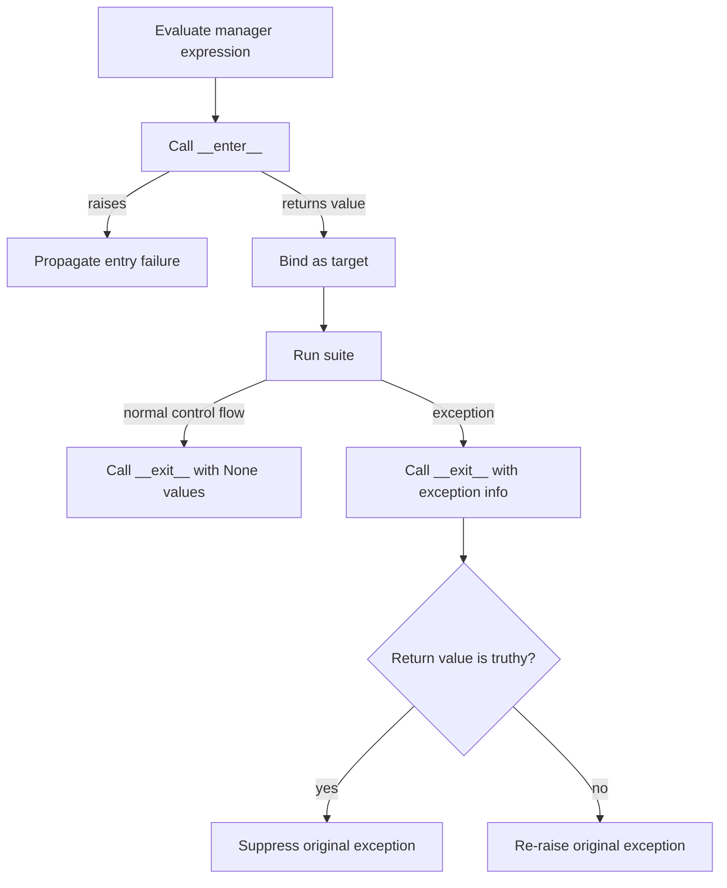

<TLDR>
  <TLDRCell label="what">
    A <Term id="context-manager">context manager</Term> establishes and tears down a runtime context around a block; `with` guarantees that every manager entered successfully receives an exit call.
  </TLDRCell>
  <TLDRCell label="trap">
    The `as` target receives the result of `__enter__()`, which need not be the manager itself; a truthy result from `__exit__()` also suppresses an exception raised by the block.
  </TLDRCell>
  <TLDRCell label="fix">
    Put release on an unconditional exit path, propagate exceptions by default, and test entry failure, block failure, and exit failure separately.
  </TLDRCell>
</TLDR>

## What it is and why it exists

A context manager is an object that implements the context management protocol. The synchronous protocol consists of `__enter__()` and `__exit__()`, and the `with` statement calls them around a block. Files, locks, transactions, temporary settings, and output redirection all need this kind of paired operation.

The main problem it solves isn't saving one call to `close()`. It binds cleanup to control flow. A block can finish normally or leave through an exception, `return`, `break`, or `continue`; once entry succeeds, the exit method runs. That guarantee keeps the resource lifetime near its creation point, so a reviewer doesn't have to trace every path out.

A context doesn't have to own an external resource. It can temporarily change process or object state and restore the old value on exit, or commit a transaction on success and roll it back on failure. The common feature is an explicit enter/exit boundary, not a particular API call.

That boundary provides an <Term id="exception-safety-guarantee">exception-safety guarantee</Term>: when an exception occurs, the manager still has a chance to restore invariants and release resources it acquired. It doesn't automatically make the operation atomic or decide whether an exception should be ignored; those choices remain part of the manager's contract.

Prefer `with` when cleanup belongs to one lexical block. If a resource must live across functions, tasks, or requests, move ownership outward and make that owner eventually enter and exit the context. Don't retain the `as` target while losing track of the manager's lifetime.

## How it works

For `with manager_expression as target:`, Python first evaluates the manager expression, then calls its enter method. It assigns the enter result to `target` before running the suite. When control leaves the suite, Python calls the same manager's exit method.

On a normal exit, `__exit__()` receives three `None` values. If the suite or assignment to the `as` target raises, it receives the exception type, exception instance, and traceback. The exit method's return value controls propagation only on an exception path: truthy suppresses the original exception, while falsy re-raises it.

The diagram deliberately places entry failure outside the protected region. If `__enter__()` raises, Python doesn't call the matching `__exit__()`; an enter method that has partially acquired resources must undo that work itself.



You can approximate the protocol with these steps:

1. Evaluate the context expression and save the manager.
2. Find the special methods supplied by the manager's type, then call `__enter__()`.
3. Bind the enter result to the `as` target and run the suite.
4. On a normal exit, call `__exit__()` with three `None` values.
5. On an exceptional exit, pass exception information to `__exit__()`, then propagate or suppress it according to the return value.

“Approximate” matters here. The interpreter uses implicit special-method lookup for the protocol methods, so assigning an `__exit__` attribute to one instance isn't a reliable way to alter the behavior. Implement the protocol on the class, or express composition through another manager object.

`__enter__()` may return the manager itself or the resource the block should actually use. A file object normally returns itself, while another manager's `as` target need not be the manager. API documentation must state the enter-result type; callers can't infer it from the manager's type.

`with A() as a, B() as b:` is equivalent to two nested `with` statements. Entry runs left to right and exit runs right to left. If `B.__enter__()` fails, the already-entered `A` still exits. This stack behavior is the basis for safely composing resources.

## Examples

These four examples progress from a built-in manager to a class protocol, a generator wrapper, and a dynamic cleanup stack. Every output below came from running the corresponding file with local `python3`.

### A file closes after an exception

File objects already implement the context management protocol. After the block raises deliberately, the file closes before the exception reaches the outer `except`.

<Depth level="quick">

```python run title="read_orders.py"
from pathlib import Path

path = Path("orders.txt")
path.write_text("A-17\nB-04\n", encoding="utf-8")

try:
    with path.open(encoding="utf-8") as handle:
        print(f"first order: {handle.readline().strip()}")
        print(f"open inside: {not handle.closed}")
        raise LookupError("customer record missing")
except LookupError as error:
    print(f"caught: {error}")

print(f"closed outside: {handle.closed}")
path.unlink()
```

```text
first order: A-17
open inside: True
caught: customer record missing
closed outside: True
```

</Depth>

`handle` remains a binding outside the block, but it points to a closed file. A context manager controls resource state; it doesn't delete variables. Further reads and writes fail, so don't mistake a surviving name for a usable resource.

The example removes the file it created so repeated runs start in the same state. Removing sample data and closing its handle are separate responsibilities: the file manager owns the latter, while the example owns the former.

### Temporary state with a class

`TemporaryValue` remembers whether the key existed and saves its old value, writes a temporary value on entry, then restores the exact prior state on exit. It returns the temporary value rather than `self`, demonstrating that the protocol designer chooses the `as` target.

```python run title="temporary_value.py"
class TemporaryValue:
    _missing = object()

    def __init__(self, mapping, key, value):
        self.mapping = mapping
        self.key = key
        self.value = value
        self.previous = self._missing

    def __enter__(self):
        self.previous = self.mapping.get(self.key, self._missing)
        self.mapping[self.key] = self.value
        return self.value

    def __exit__(self, exc_type, exc_value, traceback):
        if self.previous is self._missing:
            del self.mapping[self.key]
        else:
            self.mapping[self.key] = self.previous
        name = exc_type.__name__ if exc_type else "None"
        print(f"exit saw: {name}")
        return False


settings = {}
try:
    with TemporaryValue(settings, "mode", "preview") as mode:
        print(mode, settings)
        raise ValueError("invalid draft")
except ValueError as error:
    print(f"propagated: {error}")

print(settings)
```

```text
preview {'mode': 'preview'}
exit saw: ValueError
propagated: invalid draft
{}
```

The sentinel distinguishes a missing key from a key whose value is `None`. Recording the old value with `mapping.get(key)` would merge those states and could leave behind a key that didn't originally exist.

The exit method restores state before returning `False`. The outer layer therefore sees the original `ValueError` and an empty dictionary. Those are the two results an exception-safety test should check together.

### Commit and rollback with a generator

`contextlib.contextmanager` adapts a <Term id="generator">generator</Term> function that yields exactly once into a context manager. Code before `yield` corresponds to entry, the yielded value becomes the `as` target, and the path after the generator resumes corresponds to exit.

```python run title="staged_update.py"
from contextlib import contextmanager


@contextmanager
def staged_update(store):
    before = store.copy()
    try:
        yield store
    except BaseException:
        store.clear()
        store.update(before)
        print("rollback")
        raise
    else:
        print("commit")


inventory = {"tea": 2}
with staged_update(inventory) as draft:
    draft["tea"] -= 1
print(inventory)

try:
    with staged_update(inventory) as draft:
        draft["coffee"] = 3
        raise KeyError("missing sku")
except KeyError as error:
    print(f"caught: {error}")
print(inventory)
```

```text
commit
{'tea': 1}
rollback
caught: 'missing sku'
{'tea': 1}
```

The second block mutates the dictionary and then fails, so the manager restores its shallow snapshot and re-raises. A shallow copy is sufficient for the integer values here. If values contain mutable objects, the contract needs a defined copy depth or a real transaction mechanism.

This example catches `BaseException` because its simulated rollback must cover cancellation and process-level interruption, then immediately uses bare `raise` to preserve the original exception. Ordinary business error handling usually catches narrower `Exception` subclasses. Resource restoration and business recovery aren't the same boundary.

### Dynamic composition with `ExitStack`

Static multi-item `with` syntax is awkward when runtime data determines the number of managers. Every successful `ExitStack.enter_context()` call immediately records that manager's exit method on a stack.

```python run title="dynamic_cleanup.py"
from contextlib import ExitStack, contextmanager


@contextmanager
def connected(service):
    print(f"connect {service}")
    try:
        yield service.upper()
    finally:
        print(f"disconnect {service}")


services = ["cache", "search"]
with ExitStack() as stack:
    connections = [
        stack.enter_context(connected(service))
        for service in services
    ]
    stack.callback(print, "clear request cache")
    print(" + ".join(connections))
```

```text
connect cache
connect search
CACHE + SEARCH
clear request cache
disconnect search
disconnect cache
```

The output shows strict last-in, first-out order. The ordinary callback registered last runs first, followed by releasing `search` and then `cache`. This matches nested `with` statements exiting from the inside out.

If entering the second service fails, the first service is already on the stack and still gets released. Acquiring all connections in a list before handing the completed list to the stack would lose that partial-acquisition guarantee.

## Pitfalls

### Assuming failed entry triggers exit

> [!PITFALL]
> Python doesn't call an object's `__exit__()` when its `__enter__()` raises after partially acquiring resources. Leaving all rollback work to the exit method leaks anything already acquired during entry.

**Fix:** Have `__enter__()` undo partial work before failing, or use an internal `ExitStack` to register cleanup as acquisition proceeds. Inject a failure into the second acquisition step and verify the first one was released.

### Confusing the manager with the enter result

> [!PITFALL]
> In `with manager as value`, `value` is the result of `manager.__enter__()`. Generated code often assumes it must be `manager`, calls the wrong interface, or loses track of the true resource owner.

**Fix:** Annotate the manager-expression type and enter-result type separately. When implementing the protocol, decide whether to return `self` or a resource proxy; when consuming another API, read its contract instead of inferring from names.

### Suppressing exceptions accidentally

> [!PITFALL]
> Any truthy return from `__exit__()` suppresses an exception from the block. Returning an exception object, status dictionary, or `self` can turn failure into normal control flow without intending to.

**Fix:** Return `False` or `None` by default. When suppression is intentional, match only documented exception types and test that every other exception still propagates. Don't use broad suppression in place of input validation.

### Putting cleanup after `yield` without `finally`

> [!PITFALL]
> A generator wrapped by `@contextmanager` receives a block exception at the `yield` expression. Cleanup written only on the following line can be skipped, and catching the exception without re-raising it suppresses the original failure.

**Fix:** Put unconditional release in `finally`; use explicit `else`, `except`, and `raise` branches for commit and rollback. Test a block exception and a failure in exit code, not only the successful path.

### Registering cleanup after bulk acquisition

> [!PITFALL]
> `resources = [open(path) for path in paths]` completes the entire list before anything is registered with an `ExitStack`. If a middle `open()` fails, the expression never returns and the earlier files have no owner.

**Fix:** Call `stack.enter_context()` in the same loop so every successful acquisition immediately gains cleanup coverage. Make a second or later resource fail in the dynamic-acquisition test.

### Reusing a one-shot manager or mixing protocols

> [!PITFALL]
> A generator context-manager instance can normally be entered only once, and a file is closed after its first exit. Putting an async resource in ordinary `with`, or a synchronous resource in `async with`, also selects the wrong protocol.

**Fix:** Call the manager factory for each use unless its documentation promises reuse or reentrancy. Choose the synchronous or asynchronous protocol according to whether cleanup requires `await`, and let a type checker inspect the boundary.

## In the AI era

**What generated code gets wrong here**

Models often generate an unconditional `return True` in `__exit__()`, silently hiding parse errors, transaction failures, and even failed assertions. They also put `close()` after an `@contextmanager` function's `yield` without `finally`, or bulk-open files before giving them to an `ExitStack`, which leaks on exceptional paths. In async code, common errors include using synchronous `with` for an async client, omitting `await` in `__aexit__()`, and catching `BaseException` without re-raising cancellation.

**Ask your AI to check**

- Draw the call sequence for normal exit, block failure, entry failure, and exit failure, and state which exception ultimately propagates.
- List when every resource is acquired, when its cleanup is registered, who owns it, and what has been registered if partial acquisition fails.
- Inspect every return or re-raise path in `__exit__()`, `__aexit__()`, and generator exception handling, marking any path that can suppress an exception.

**Review checklist**

- Raise a specific exception inside the block; confirm cleanup runs and propagation matches the contract.
- Fail the second resource acquisition; confirm the first resource is released and exits run in last-in, first-out order.
- Classify each instance as single-use, reusable, or reentrant, and match the synchronous or asynchronous protocol to the resource.

**Prompt vocabulary**

Use precise terms: `context manager`, `context management protocol`, `enter result`, `exception suppression`, `partial acquisition`, `LIFO unwinding`, `single-use`, `reentrant`, and `asynchronous context manager`. Ask for a failure-path table and a resource-ownership table; “remember to close resources” isn't enough to verify the protocol.

<Depth level="deep">

## Exception paths are the contract

`with` protects more than its visibly indented suite. Assignment to the `as` target is also inside the exit method's protected region, so a failed unpacking target still invokes `__exit__()`. Evaluation of the manager expression, special-method lookup, and the call to `__enter__()` happen before that protection is established.

The three exception arguments passed to the exit method correspond to `sys.exc_info()`. They are all `None` without an exception; otherwise, the type supports classification, the instance carries data, and the traceback records the propagation path. Most managers need only test `exc_type is None`; they shouldn't parse exception-message text.

A truthy return states that the manager fully handled the exception, and execution continues after the `with`. That capability fits narrow, explicit suppression, such as ignoring one expected missing optional file. Transaction, lock, and file managers normally clean up and return a falsy value so failure stays visible.

If `__exit__()` raises a new exception, the new one propagates and the original is normally retained in its exception context. Cleanup failure can't safely be encoded only in a return value because callers may never see it. Raise an exception with operational meaning and retain the original cause chain.

`return`, `break`, and `continue` don't supply exception information to the exit method, so they use the normal-exit path. The method still runs, but it can't distinguish those control transfers from three `None` values alone. A design that needs the distinction shouldn't hide that decision in the protocol.

Multiple managers exit as nested contexts, so an inner exit method can change what an outer one sees. If the inner manager suppresses an exception, the outer manager gets three `None` values; if the inner manager raises a replacement, the outer manager sees the new exception. Trace composed managers one layer at a time rather than treating their exits as independent.

### Transactional entry

A complex `__enter__()` may acquire several subresources in sequence. An internal `ExitStack` can temporarily hold cleanup for each completed step. After every acquisition succeeds, `pop_all()` transfers ownership to the object's long-lived cleanup stack.

This pattern makes entry a small transaction. The temporary stack unwinds on failure, while the real `__exit__()` owns all callbacks after success. Don't call `pop_all()` before success, or a later acquisition failure will again lose protection.

Keep the gap between acquisition and registration free of fallible work. Open a file and immediately call `enter_context()`; don't parse data, format log records, or invoke user callbacks in between. The smaller the window, the easier ownership is to prove.

### Cleanup-exception priority

An exit method can face both a block exception and a cleanup exception. Replacing the original can be correct when a failed commit is the final operation failure. A failed log-handle close that hides the main business error, however, makes diagnosis harder. State the priority in the contract and retain both through exception chaining.

Several nested exits can fail in sequence. `ExitStack` calls exit functions in reverse registration order and updates the current exception context, matching nested `with` behavior. Don't assume the first cleanup error prevents every later cleanup; test the concrete managers in use.

## Generator managers and dynamic stacks

Calling a function decorated with `@contextmanager` doesn't immediately execute its body. It creates a manager around a generator. Entry advances to the single `yield`; normal exit advances again, while exceptional exit throws the exception at the `yield` point.

The generator must yield exactly once. Finishing without a yield raises `RuntimeError` during entry, and yielding a second value raises `RuntimeError` during exit. This isn't an iteration API, so multiple yields can't represent repeated entries.

The safest basic shape acquires first, then places `try: yield resource` before release in `finally`. If success and failure differ, add an `except` branch that rolls back and re-raises, or an `else` branch that commits. The branches still need to release resources if the commit itself fails.

If the generator catches the block exception at `yield` and then ends normally, the adapter treats the exception as handled and suppresses it. “Log and forget to `raise`” therefore changes caller control flow, not just traceback detail. Logging isn't a propagation decision.

Every call to the generator function creates a fresh manager instance. Retaining that instance and entering it again doesn't restart the generator and normally fails. An API that supports repeated independent uses should expose a factory or callable that creates a new instance for every `with`.

### Three `ExitStack` registration forms

`enter_context(cm)` enters a manager, stores its exit method, and returns its enter result. It handles a runtime number of full context managers. Since Python 3.11, passing an object without the synchronous protocol raises `TypeError`.

`push(exit)` directly registers a callable with the exit-method signature, or takes over a manager's exit method. It can receive exception information and suppress an exception, but it doesn't invoke the corresponding enter method. Use it only for a resource that was partially acquired or entered elsewhere.

`callback(func, *args, **kwargs)` registers an ordinary callback. The callback receives no exception information and can't suppress an exception, making it suitable for release that runs regardless of the outcome. All three registration forms unwind in last-in, first-out order.

`pop_all()` transfers the whole callback set to a new stack without invoking it. This supports “keep all resources only if all acquisitions succeed” entry transactions. A clear owner must call `close()` on the new stack or put it inside another `with`; otherwise, the operation has only moved the leak.

## Asynchronous context managers

The asynchronous protocol replaces the methods with `__aenter__()` and `__aexit__()`, both returning awaitables. `async with` awaits entry and exit, fitting acquisition and release that need network round trips, async locks, or other asynchronous I/O. It can appear only inside a coroutine function.

The <Term id="coroutine">coroutine</Term> boundary depends on cleanup, not on whether the suite happens to contain another `await`. If closing a client must be awaited, use an async manager. If release only closes an in-memory synchronous object, an ordinary manager remains appropriate.

Cancellation is another exceptional path. When a task is cancelled in the suite, `__aexit__()` must perform required cleanup and normally let `CancelledError` propagate. Catching `BaseException` and returning normally breaks structured concurrency by making the parent believe the task succeeded.

Async exit may itself be cancelled while awaiting. The resource library's contract determines what minimum cleanup needs protection. Don't mechanically shield the entire exit operation, because excessive shielding delays shutdown. Cancel a real task in an integration test and observe connections, locks, and children.

`AsyncExitStack` combines synchronous and asynchronous managers in one stack and can register async callbacks. Dynamically enter an async manager with `await stack.enter_async_context(cm)`. Explicit release uses `await stack.aclose()`; there is no synchronous `close()` substitute.

`asynccontextmanager` follows the same one-`yield` rule as its synchronous counterpart, while allowing entry and exit code to await. If its async generator catches cancellation or a business exception, it must still re-raise according to the contract. Awaiting in `finally` also needs cancellation tests.

## Reuse, typing, and tests

“Reusable” means one instance supports multiple non-overlapping `with` statements. “Reentrant” additionally allows the same instance to enter again before its current exit. Every reentrant manager is reusable, but not every reusable manager is reentrant. The protocol itself provides neither property.

Files and generator managers are effectively single-use. Locks, `suppress()`, and other managers have their own reuse or reentrancy semantics, which you must take from the particular API's documentation. A custom manager that stores one old value in an instance field will probably overwrite outer state on nested entry.

Type annotations should describe the enter result, not only the manager object. A synchronous API can accept `contextlib.AbstractContextManager[T]`, and an async API can accept `AbstractAsyncContextManager[T]`. If a function controls each lifetime itself, accepting a factory that returns a manager is often more accurate than accepting a one-shot instance.

Static types can't prove that a resource exits or validate an exception-suppression policy. Review still has to trace control flow, and tests still have to observe state. In particular, a broadly typed return from `__exit__()` can be type-correct and truthy while hiding a failure.

### A minimum failure matrix

A custom manager should cover at least these paths:

1. Entry succeeds, the suite finishes normally, and exit succeeds.
2. Entry succeeds, the suite raises an expected exception, and cleanup propagates it.
3. Entry fails partway through, and every partially acquired resource is released.
4. Both the suite and exit fail, and the exception chain matches the contract.
5. A later manager fails to enter, and earlier managers exit in reverse order.

Add “a matching exception is suppressed and every other exception propagates” only when suppression is public behavior. Don't invent domain-free suppression merely to cover a `return True` branch.

Resource tests should assert state, not just printed output or mocked method calls. Check that a file is actually closed, another execution unit can acquire a lock, a temporary key is missing again, or transaction contents returned to their old state. Call records help diagnosis but aren't the lifecycle contract itself.

Concurrent environments also need ownership-interleaving tests. If two tasks share a reusable manager with instance fields, their exit order may restore the wrong old value. Unless the implementation explicitly supports concurrency, the safest default is that one instance belongs to one lexical use.

</Depth>

<Checkpoint id="python/context-managers" />

## Further reading

- [Python language reference: Context manager types](https://docs.python.org/3.14/reference/datamodel.html#context-managers)
- [Python language reference: The `with` statement](https://docs.python.org/3.14/reference/compound_stmts.html#the-with-statement)
- [Python standard library: `contextlib`](https://docs.python.org/3.14/library/contextlib.html)
- [Python language reference: Asynchronous context managers](https://docs.python.org/3.14/reference/datamodel.html#asynchronous-context-managers)
