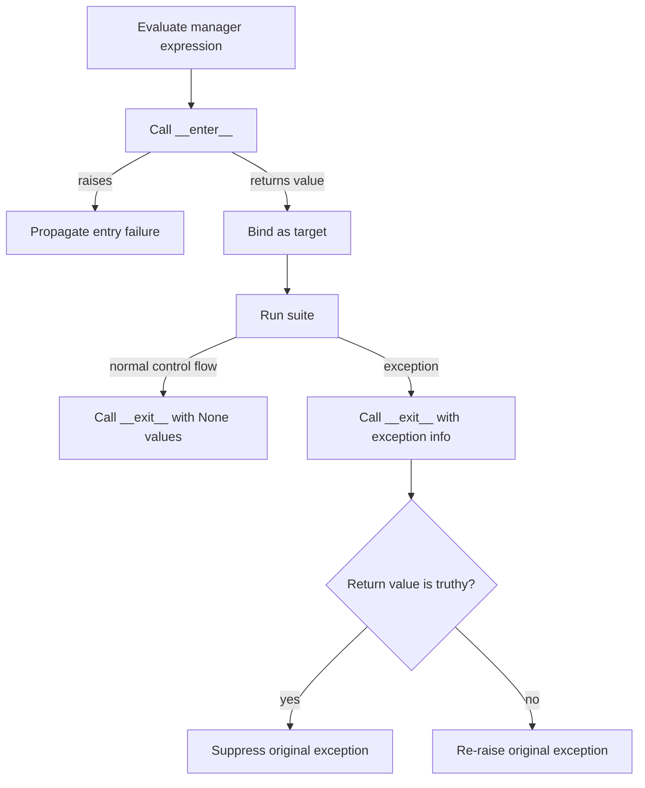

<TLDR>
  <TLDRCell label="what">
    <Term id="context-manager">上下文管理器（context manager）</Term>为一段代码建立并撤销运行时上下文；`with` 保证已经成功进入的管理器会收到退出通知。
  </TLDRCell>
  <TLDRCell label="trap">
    `as` 绑定的是 `__enter__()` 的返回值，不一定是管理器本身；`__exit__()` 返回真值还会抑制代码块抛出的异常。
  </TLDRCell>
  <TLDRCell label="fix">
    把释放放在无条件执行的退出路径中，默认让异常继续传播，并测试进入失败、代码块失败和退出失败三条路径。
  </TLDRCell>
</TLDR>

## 是什么，为什么存在

上下文管理器是实现上下文管理协议的对象。同步协议由 `__enter__()` 和 `__exit__()` 组成，`with` 语句负责在代码块前后调用它们。文件、锁、事务、临时配置和输出重定向都需要这种成对操作。

它解决的核心问题不是少写一次 `close()`，而是让清理与控制流绑定。代码块可能正常结束，也可能通过异常、`return`、`break` 或 `continue` 离开；只要进入成功，退出方法就会运行。这个保证把资源生命周期放在创建位置附近，审查者不必追踪每条离开路径。

上下文不一定拥有外部资源。它也可以暂时修改进程或对象状态，退出时恢复旧值；还可以在事务成功时提交、失败时回滚。共同点是进入和退出构成一个明确边界，而不是具体调用了哪个 API。

这种边界提供一种<Term id="exception-safety-guarantee">异常安全保证（exception-safety guarantee）</Term>：发生异常时，管理器仍有机会恢复不变量并释放已取得的资源。它不自动保证操作原子性，也不会自动决定异常是否应被忽略；这些仍是管理器契约的一部分。

当清理只取决于一个词法代码块时，优先使用 `with`。若资源需要跨函数、任务或请求长期存活，就要把所有权放在更外层，并让那个所有者最终进入和退出上下文；不要保存 `as` 目标后便丢失管理器生命周期。

## 工作原理

执行 `with manager_expression as target:` 时，Python 先求值管理器表达式，再调用进入方法。进入方法的返回值赋给 `target`，随后才执行代码块。代码块离开后，Python 调用同一个管理器的退出方法。

正常离开时，`__exit__()` 收到三个 `None`。代码块或 `as` 目标绑定抛出异常时，它收到异常类型、异常实例和 traceback。退出方法的返回值只在处理异常时决定传播：真值表示抑制原异常，假值表示继续抛出。

下面的流程图刻意把进入失败放在受保护区域之外。若 `__enter__()` 自己抛出异常，对应的 `__exit__()` 不会被调用；已经完成部分获取的进入方法必须自行撤销那部分工作。



可以把协议近似理解为下列步骤：

1. 求值上下文表达式并保存管理器。
2. 查找管理器类型提供的特殊方法，再调用 `__enter__()`。
3. 把进入结果绑定给 `as` 目标并运行代码块。
4. 正常离开时，用三个 `None` 调用 `__exit__()`。
5. 异常离开时，把异常信息交给 `__exit__()`，再依据返回值传播或抑制异常。

这里的「近似」很重要。解释器对协议方法使用隐式特殊方法查找，不能靠给单个实例临时赋一个 `__exit__` 属性来可靠改变行为。协议应实现在类上，组合行为则应通过另一个管理器对象表达。

`__enter__()` 可以返回管理器自身，也可以返回真正供代码块使用的资源。例如文件对象通常返回自身，锁对象的上下文协议则不要求 `as` 目标就是锁。API 文档必须说明进入结果的类型，调用方不能从管理器类型猜测。

一条 `with A() as a, B() as b:` 与两层嵌套 `with` 等价。进入顺序从左到右，退出顺序从右到左；若 `B.__enter__()` 失败，已经进入的 `A` 仍会退出。这种栈式行为是安全组合多个资源的基础。

## 示例

下面四个示例依次展示内置管理器、类协议、生成器封装和动态清理栈。输出均由本地 `python3` 执行对应文件得到。

### 文件在异常后仍关闭

文件对象已经实现上下文管理协议。代码块主动抛出异常后，文件先被关闭，异常才到达外层 `except`。

<Depth level="quick">

```python run title="read_orders.py"
from pathlib import Path

path = Path("orders.txt")
path.write_text("A-17\nB-04\n", encoding="utf-8")

try:
    with path.open(encoding="utf-8") as handle:
        print(f"first order: {handle.readline().strip()}")
        print(f"open inside: {not handle.closed}")
        raise LookupError("customer record missing")
except LookupError as error:
    print(f"caught: {error}")

print(f"closed outside: {handle.closed}")
path.unlink()
```

```text
first order: A-17
open inside: True
caught: customer record missing
closed outside: True
```

</Depth>

`handle` 在代码块外仍然是一个绑定，但它指向已关闭的文件。上下文管理器控制资源状态，不会删除变量。后续读写会失败，因此不要把名称仍存在误当成资源仍可用。

示例最后删除自己创建的文件，使重复运行具有相同初始状态。清理样例数据与关闭文件是两个不同责任：文件管理器负责后者，示例所有者负责前者。

### 用类实现临时状态

`TemporaryValue` 保存键原来是否存在以及旧值，进入时写入临时值，退出时精确恢复。它返回临时值而不是 `self`，说明 `as` 目标由协议设计者决定。

```python run title="temporary_value.py"
class TemporaryValue:
    _missing = object()

    def __init__(self, mapping, key, value):
        self.mapping = mapping
        self.key = key
        self.value = value
        self.previous = self._missing

    def __enter__(self):
        self.previous = self.mapping.get(self.key, self._missing)
        self.mapping[self.key] = self.value
        return self.value

    def __exit__(self, exc_type, exc_value, traceback):
        if self.previous is self._missing:
            del self.mapping[self.key]
        else:
            self.mapping[self.key] = self.previous
        name = exc_type.__name__ if exc_type else "None"
        print(f"exit saw: {name}")
        return False


settings = {}
try:
    with TemporaryValue(settings, "mode", "preview") as mode:
        print(mode, settings)
        raise ValueError("invalid draft")
except ValueError as error:
    print(f"propagated: {error}")

print(settings)
```

```text
preview {'mode': 'preview'}
exit saw: ValueError
propagated: invalid draft
{}
```

哨兵对象区分「键不存在」和「键存在但值为 `None`」。若用 `mapping.get(key)` 记录旧值，这两种状态会混在一起，退出时可能留下原本不存在的键。

退出方法先恢复状态，再返回 `False`。外层因此看见原来的 `ValueError`，同时观察到空字典已经恢复；这是测试异常安全契约时应同时检查的两个结果。

### 用生成器表达提交与回滚

`contextlib.contextmanager` 把只产生一次值的<Term id="generator">生成器（generator）</Term>函数适配为上下文管理器。`yield` 之前对应进入，产生的值成为 `as` 目标，恢复生成器后的路径对应退出。

```python run title="staged_update.py"
from contextlib import contextmanager


@contextmanager
def staged_update(store):
    before = store.copy()
    try:
        yield store
    except BaseException:
        store.clear()
        store.update(before)
        print("rollback")
        raise
    else:
        print("commit")


inventory = {"tea": 2}
with staged_update(inventory) as draft:
    draft["tea"] -= 1
print(inventory)

try:
    with staged_update(inventory) as draft:
        draft["coffee"] = 3
        raise KeyError("missing sku")
except KeyError as error:
    print(f"caught: {error}")
print(inventory)
```

```text
commit
{'tea': 1}
rollback
caught: 'missing sku'
{'tea': 1}
```

第二个代码块修改了字典后失败，管理器恢复进入前的浅副本并重新抛出异常。浅副本只适合这里的整数值；若值中还有可变对象，契约需要明确复制深度或采用真正的事务机制。

捕获 `BaseException` 是因为这段模拟回滚必须覆盖取消和进程级中断，再立即使用裸 `raise` 保留原异常。普通业务错误处理通常捕获更窄的 `Exception` 子类；资源恢复与业务恢复不是同一个边界。

### 用 `ExitStack` 动态组合

上下文管理器数量由运行时数据决定时，静态写出多项 `with` 不够方便。`ExitStack.enter_context()` 每成功进入一个管理器，就立刻把其退出方法登记到栈中。

```python run title="dynamic_cleanup.py"
from contextlib import ExitStack, contextmanager


@contextmanager
def connected(service):
    print(f"connect {service}")
    try:
        yield service.upper()
    finally:
        print(f"disconnect {service}")


services = ["cache", "search"]
with ExitStack() as stack:
    connections = [
        stack.enter_context(connected(service))
        for service in services
    ]
    stack.callback(print, "clear request cache")
    print(" + ".join(connections))
```

```text
connect cache
connect search
CACHE + SEARCH
clear request cache
disconnect search
disconnect cache
```

输出显示严格的后进先出顺序。最后登记的普通回调最先运行，然后释放 `search`，最后释放 `cache`；这与嵌套 `with` 从内向外退出一致。

若进入第二个服务时失败，第一个服务已经在栈中，因此仍会释放。先用列表推导一次性建立所有连接，再把完成的列表交给栈，会失去这个部分获取失败时的保证。

## 陷阱

### 假设进入失败会自动退出

> [!PITFALL]
> `__enter__()` 在完成部分获取后抛出异常时，Python 不会调用同一个对象的 `__exit__()`。把全部回滚都留在退出方法里，会泄漏进入阶段已经取得的资源。

**修复方法：** 让 `__enter__()` 在失败前自行撤销部分工作，或用内部 `ExitStack` 边获取边登记清理。专门注入第二步获取失败，验证第一步已释放。

### 混淆管理器与进入结果

> [!PITFALL]
> `with manager as value` 中的 `value` 是 `manager.__enter__()` 的返回值。生成代码常假定它总是 `manager`，随后访问错误接口或把真正的资源所有者丢掉。

**修复方法：** 分别标注管理器表达式类型与进入结果类型。实现协议时明确返回 `self` 还是代理资源；使用第三方 API 时查其契约，不靠命名推断。

### 意外抑制异常

> [!PITFALL]
> `__exit__()` 返回任何真值都会抑制代码块中的异常。返回异常对象、状态字典或 `self` 都可能在没有明确意图时把失败变成正常控制流。

**修复方法：** 默认显式返回 `False` 或 `None`。确实要抑制时，只匹配文档列出的异常类型，并测试其他异常仍会传播；不要用宽泛抑制代替输入验证。

### 把清理写在 `yield` 后但没有 `finally`

> [!PITFALL]
> `@contextmanager` 生成器在代码块抛出异常时会在 `yield` 位置收到该异常。单纯放在下一行的清理可能被跳过，捕获后不重新抛出还会抑制原异常。

**修复方法：** 无条件释放放在 `finally` 中；提交与回滚使用清楚的 `else`、`except` 和 `raise` 分支。测试代码块异常和退出代码自身异常，而不只测试成功路径。

### 一次性获取后才登记清理

> [!PITFALL]
> `resources = [open(path) for path in paths]` 会先完成整个列表，再给 `ExitStack` 登记。中间一次 `open()` 失败时，列表表达式不会返回，前面打开的文件也无人接管。

**修复方法：** 在同一个循环中调用 `stack.enter_context()`，每次成功后立即获得清理保证。动态获取的测试要让第二个或更晚的资源失败。

### 复用一次性管理器或混用同步协议

> [!PITFALL]
> 生成器上下文管理器实例通常只能进入一次，文件退出后也已经关闭。异步资源若被塞进普通 `with`，或者同步资源被塞进 `async with`，协议同样不匹配。

**修复方法：** 每次使用时调用管理器工厂，除非文档明确承诺可复用或可重入。根据清理操作是否需要 `await` 选择同步或异步协议，并让类型检查器检查边界。

## AI 时代

**生成代码在这里常犯的错**

模型常生成一个无条件 `return True` 的 `__exit__()`，于是解析错误、事务错误甚至断言失败都静默消失。它也会把 `close()` 写在 `@contextmanager` 的 `yield` 后却没有 `finally`，或先批量打开文件再交给 `ExitStack`，导致异常路径泄漏。异步代码中，常见错误包括用同步 `with` 管理异步客户端、在 `__aexit__()` 中漏掉 `await`，以及捕获 `BaseException` 后不重新抛出取消异常。

**让 AI 检查**

- 为正常离开、代码块异常、进入异常和退出异常分别画出调用序列，并写明最终传播哪个异常。
- 列出每项资源何时获取、何时登记清理、由谁拥有，以及部分获取失败时已经登记了什么。
- 检查所有 `__exit__()`、`__aexit__()` 和生成器异常分支的返回或重新抛出行为，标出任何可能的异常抑制。

**审查清单**

- 在代码块中主动抛出具体异常，确认清理执行且异常按契约传播。
- 让第二项资源获取失败，确认第一项资源仍被释放，并验证退出顺序为后进先出。
- 检查每个实例是一次性、可复用还是可重入，并确认同步／异步协议与资源一致。

**提示词词汇**

使用准确术语：`context manager`（上下文管理器）、`context management protocol`（上下文管理协议）、`enter result`（进入结果）、`exception suppression`（异常抑制）、`partial acquisition`（部分获取）、`LIFO unwinding`（后进先出展开）、`single-use`（一次性）、`reentrant`（可重入）、`asynchronous context manager`（异步上下文管理器）。要求模型给出失败路径表和资源所有权表；只说「记得关闭资源」无法验证协议。

<Depth level="deep">

## 异常路径就是契约

`with` 保护的不只是缩进代码块。`as` 目标绑定也位于退出方法保护范围内，因此解包目标失败时仍会调用 `__exit__()`。相反，管理器表达式求值、特殊方法查找和 `__enter__()` 调用发生在保护范围建立之前。

退出方法收到的三个异常参数与 `sys.exc_info()` 对应。没有异常时三个值都是 `None`；有异常时，类型用于分类，实例携带数据，traceback 记录传播路径。多数管理器只需要判断 `exc_type is None`，不应解析异常消息文本。

返回真值表示管理器已经把异常处理完，调用方会从 `with` 后继续执行。这个能力适合范围极窄、语义明确的抑制，例如忽略一个预期不存在的可选文件；事务、锁和文件管理器通常应清理后返回假值，让失败保持可见。

若 `__exit__()` 自己抛出新异常，新异常会传播，原异常通常保留在异常上下文中。清理失败不能安全地靠返回值表示，因为调用方可能看不到它；应抛出具有操作语义的异常，并保留原始原因链。

`return`、`break` 和 `continue` 不向退出方法提供异常信息，所以它们走正常退出路径。退出方法仍会执行，但不能仅凭三个 `None` 区分是哪一种控制转移；需要这种区别的设计不应把判断隐藏在协议里。

多个管理器按嵌套方式退出，内层退出方法可以改变外层看到的状态。内层若抑制异常，外层会收到三个 `None`；内层若抛出另一个异常，外层会看到新异常。审查组合管理器时要逐层追踪，而不是把所有退出调用视为互不影响。

### 进入阶段的事务化

复杂的 `__enter__()` 可能依次获取多个子资源。可用一个内部 `ExitStack` 暂存已经成功的清理动作：每完成一步就登记，全部成功后再用 `pop_all()` 转移所有权给对象的长期清理栈。

这种模式把进入阶段本身变成小型事务。失败时临时栈自动展开；成功时，正式 `__exit__()` 接管全部回调。不要在成功前调用 `pop_all()`，否则后续获取失败又会失去保护。

获取与登记之间仍应尽量没有可失败操作。例如先打开文件，紧接着调用 `enter_context()`；不要在两者之间执行解析、日志格式化或用户回调。窗口越短，所有权越容易证明。

### 清理异常的优先级

一个退出方法可能同时面对代码块异常与自身清理异常。覆盖原异常有时合理，例如提交失败就是最终操作失败；但若关闭日志句柄失败掩盖了主要业务异常，诊断会更困难。契约应说明优先级，并用异常链保留两者。

多层退出可能连续失败。`ExitStack` 按注册的逆序调用退出函数，并更新当前异常上下文，模拟嵌套 `with` 的行为。不要假设第一个清理错误会让后续清理全部停止；应对所用管理器的具体契约编写测试。

## 生成器管理器与动态栈

`@contextmanager` 调用被装饰函数时，并不会立即运行函数体，而是创建一个包装生成器的管理器。进入时推进到唯一的 `yield`；正常退出时继续推进，异常退出时则把异常注入 `yield` 位置。

生成器必须恰好产生一次值。没有产生值就结束会在进入时触发 `RuntimeError`，产生第二次值会在退出时触发 `RuntimeError`。这不是迭代 API，不能用多个 `yield` 表示多次进入。

最稳妥的基本形状是在获取之后写 `try: yield resource`，并在 `finally` 释放。需要区分成功与失败时，再增加 `except` 做回滚并重新抛出，或增加 `else` 做提交。分支必须覆盖提交自身失败时的资源释放。

生成器在 `yield` 处捕获代码块异常后，如果正常结束，适配器会认为异常已经处理并抑制它。因此，「记录后忘记 `raise`」不只是丢失 traceback，而是改变调用方控制流。日志语句不能代替传播决定。

每次调用生成器函数都会创建一个新的管理器实例。保存实例并再次进入不是重启生成器；通常会失败。若 API 需要多次独立使用，应暴露工厂或可调用对象，让每次 `with` 都创建新实例。

### `ExitStack` 的三类登记

`enter_context(cm)` 先进入管理器，再保存它的退出方法，并返回进入结果。它适合动态数量的完整上下文管理器。若传入对象不支持同步协议，Python 3.11 及以后抛出 `TypeError`。

`push(exit)` 直接登记具有退出方法签名的可调用对象，或接管一个管理器的退出方法。它可以接收异常信息并抑制异常，但不会替你调用对应的进入方法，因此只适合已经部分获取或由别处进入的资源。

`callback(func, *args, **kwargs)` 登记普通回调。回调不会收到异常信息，也不能抑制异常；它适合无论结果如何都执行的释放函数。三种登记都会以后进先出顺序展开。

`pop_all()` 把整组回调转移到一个新栈，而不是执行回调。它适合「全部资源成功获取才保留，否则全部释放」的事务式进入。新栈必须由明确所有者调用 `close()` 或放入另一个 `with`，否则只是移动了泄漏责任。

## 异步上下文管理器

异步协议把方法换成 `__aenter__()` 与 `__aexit__()`，两者返回可等待对象。`async with` 会等待进入和退出，因此适合需要网络往返、异步锁或其他异步 I/O 的获取与释放。它只能出现在协程函数体中。

这里的<Term id="coroutine">协程（coroutine）</Term>边界取决于清理动作，而不取决于代码块中是否有其他 `await`。若关闭客户端必须等待，就要使用异步管理器；若只是同步关闭内存对象，普通管理器仍然合适。

取消也是异常路径。任务在代码块中被取消时，`__aexit__()` 必须完成必要清理，并通常让 `CancelledError` 继续传播。宽泛捕获 `BaseException` 后正常返回会破坏结构化并发，使上层误以为任务成功。

异步退出本身也可能在等待时被再次取消。需要不可中断地完成哪些最小清理取决于资源库契约；不要机械地给整个退出过程套屏蔽，因为过度屏蔽会拖延关闭。应在集成测试中真实取消任务并观察连接、锁与子任务。

`AsyncExitStack` 可以在同一栈中组合同步和异步管理器，也能登记异步回调。动态进入异步管理器使用 `await stack.enter_async_context(cm)`；显式释放使用 `await stack.aclose()`，它没有同步 `close()` 替代品。

`asynccontextmanager` 与同步装饰器遵循相同的一次 `yield` 规则，只是进入和退出代码可以等待。异步生成器若捕获取消或业务异常，仍必须按契约重新抛出；`finally` 中的等待也需要取消测试。

## 复用、类型与测试

「可复用」表示同一个实例能用于多个不重叠的 `with`；「可重入」还允许同一个实例在尚未退出时再次进入。可重入一定可复用，可复用不一定可重入。两者都不是协议自动提供的性质。

文件和生成器管理器实际上是一次性的。锁、`suppress()` 等某些管理器具有自己的复用或重入语义，但只能以具体 API 文档为准。自定义管理器若把旧状态只保存在一个实例字段中，嵌套进入很可能覆盖外层状态。

类型注解应描述进入结果，而不只是管理器对象。同步接口可接受 `contextlib.AbstractContextManager[T]`，异步接口可接受 `AbstractAsyncContextManager[T]`；若函数需要自行控制每次生命周期，接收「返回管理器的工厂」通常比接收一次性实例更准确。

静态类型不会证明资源一定退出，也不会验证异常抑制策略。代码审查仍要检查控制流，测试仍要观察可见状态。特别是 `__exit__()` 的返回类型过宽时，类型正确的真值仍可能隐藏错误。

### 最小故障矩阵

一个自定义管理器至少需要覆盖以下路径：

1. 进入成功，代码块正常结束，退出成功。
2. 进入成功，代码块抛出预期异常，清理后继续传播。
3. 进入过程中失败，已经部分获取的资源得到释放。
4. 代码块失败且退出也失败，异常链符合契约。
5. 多个管理器中后一个进入失败，先进入者按逆序退出。

只有抑制异常属于公开行为时，才增加「匹配的异常被抑制，其他异常传播」测试。不要为了覆盖返回 `True` 的分支而创造没有领域含义的抑制功能。

资源测试应断言状态，而不只断言打印或模拟方法被调用。例如检查文件确实关闭、锁可被另一执行单元取得、临时键恢复为不存在、事务内容回到旧状态。调用记录可以辅助定位，但不是生命周期契约本身。

并发环境还要测试所有权交错。同一个可复用管理器若在两个任务中共享实例字段，退出顺序可能恢复错误的旧值。除非实现明确支持并发，最安全的默认是假定实例属于一次词法使用。

</Depth>

<Checkpoint id="python/context-managers" />

## 延伸阅读

- [Python 语言参考：上下文管理器类型](https://docs.python.org/3.14/reference/datamodel.html#context-managers)
- [Python 语言参考：`with` 语句](https://docs.python.org/3.14/reference/compound_stmts.html#the-with-statement)
- [Python 标准库：`contextlib`](https://docs.python.org/3.14/library/contextlib.html)
- [Python 语言参考：异步上下文管理器](https://docs.python.org/3.14/reference/datamodel.html#asynchronous-context-managers)
