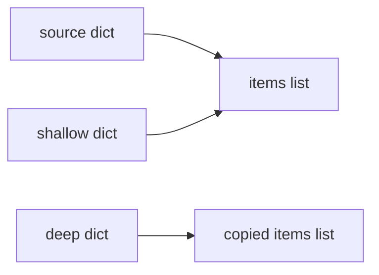

<TLDR>
  <TLDRCell label="what">
    Assignment binds another name to an object; `copy.copy()` creates a new outer object, while `copy.deepcopy()` recursively copies its contents.
  </TLDRCell>
  <TLDRCell label="trap">
    A shallow copy still shares nested mutable objects, and a deep copy preserves aliases and cycles rather than turning every reference into a distinct object.
  </TLDRCell>
  <TLDRCell label="fix">
    Choose the boundary that must be independent, test it with `is`, and implement `__deepcopy__()` with the supplied `memo` when a class needs a policy of its own.
  </TLDRCell>
</TLDR>

## What it is and why it exists

Python variables hold references to objects. An assignment such as `backup = settings` creates another binding to the same object; it does not duplicate the object. If either name reaches a mutable object and changes it, the other name observes that change.

An object's <Term id="object-identity">identity</Term> tells you whether two references designate that exact object. The `is` operator compares identity, while `==` asks the objects whether their values are equal. Two copied lists can therefore satisfy `left == right` while `left is right` is false.

Copying is useful when code must preserve a source value but mutate a derived value. Common boundaries include a configuration template used to create one request's settings, a test fixture reused by several tests, or a mutable snapshot passed to code that must not alter the stored state. The required boundary, not the mere presence of nesting, determines which operation fits.

The `copy` module offers three related operations. `copy.copy()` makes a shallow copy, `copy.deepcopy()` makes a deep copy, and `copy.replace()` creates an object of the same type with selected fields replaced. The third operation was added in Python 3.13 and is available in the verified Python 3.14 target.

These operations do not promise that every reachable object gets a new identity. Immutable values are normally safe to share, functions and classes are returned unchanged, and some resource-bearing objects cannot be copied. A useful copy is a deliberate object-ownership policy, not a byte-for-byte duplication of memory.

## How it works

Treat a compound object as an <Term id="object-graph">object graph</Term>. Containers and instances are nodes, and their references to other objects are edges. A copy operation decides which nodes are new and which edges still point to existing nodes.

Assignment creates no new graph node. A <Term id="shallow-copy">shallow copy</Term> creates one new outer node and inserts references to the source's immediate children. A <Term id="deep-copy">deep copy</Term> walks reachable objects and recursively constructs replacements where the protocol says copying is supported.



The diagram shows why changing a top-level field of `shallow` does not rebind a field in `source`, yet mutating the shared `items` list is visible through both. The deep copy points to another list, so mutations through that edge are isolated.

### Shallow copying

`copy.copy(value)` asks the value's type how to make a shallow copy. For built-in containers, direct forms such as `records.copy()`, `dict(mapping)`, or a full slice may express the same immediate-container intent more clearly. For subclasses, those direct forms may return a base-class instance, while `copy.copy()` normally preserves the source type.

Only the outer object is promised to be new where copying is meaningful. Elements of a list, values of a dictionary, and attributes of an ordinary instance remain the same referenced objects. Replacing one slot in the copy is isolated; mutating an object reached through a shared slot is not.

The common surface forms have different scopes:

| Form | Result | Nested references |
| --- | --- | --- |
| `alias = source` | Same object | Same |
| `source.copy()` | New built-in container | Shared |
| `copy.copy(source)` | New shallow result | Shared |
| `copy.deepcopy(source)` | New graph according to the protocol | Recursively resolved through the memo |
| `copy.replace(source, field=value)` | New supported record | Unchanged fields follow replacement semantics |

This table describes ownership, not equality. All five results can compare equal to the source immediately after construction. Identity and a later mutation reveal the differences that matter.

### Deep copying

`copy.deepcopy(value)` recursively follows references, but it does not independently clone every edge. During one traversal it keeps a <Term id="memo-dictionary">memo dictionary</Term> from source identity to copied object. Encountering the same source again reuses the already-created copy.

The memo solves two structural problems. A cycle can point back to the new object instead of recursing forever, and two source edges that share one child can share one corresponding child in the copied graph. This preservation of topology is part of correct deep-copy behavior.

Deep copying can also copy too much. A class may contain an immutable catalog intended to be shared, a cache that should be cleared, or a lock that should be freshly constructed rather than copied. That is why classes can define `__deepcopy__(self, memo)` instead of accepting a generic field-by-field policy.

### Choosing the operation

Start from the mutation you intend to perform and draw the path from the root to that object. The copy must create new nodes along every path where mutation must be isolated. Sharing elsewhere can be correct and useful when ownership is explicit.

Use this decision order:

1. Use assignment when shared identity is intentional.
2. Use a shallow copy when only the outer container or instance will change.
3. Use a deep copy when the reachable mutable graph must be isolated and all members support a sensible copy policy.
4. Use `copy.replace()` when you want a new record with named field changes, not recursive duplication.

Tests should assert both value and identity relationships. `==` confirms expected data, while carefully chosen `is` checks confirm which mutable components are shared or independent. Mutating one copy after those checks verifies the ownership boundary in behavior rather than only in structure.

### Copy boundaries in API design

Copying at every entry and exit is not automatically defensive. It can conceal unclear ownership, and callers cannot tell whether the API returns a live view, a shallow snapshot, or an isolated graph. Put that contract in the operation's name or documentation.

An immutable return type often communicates the boundary more clearly than a deep copy. A tuple of immutable records needs no recursive duplication before every read. When mutation is required, a method that creates the next valid domain value can validate changes at the same boundary.

For mutable inputs, decide whether the callee borrows the object for the duration of the call, stores the reference, takes a shallow snapshot, or owns an isolated copy. That decision also determines what concurrent callers may observe. Copying does not make otherwise unsafe shared services thread-safe.

The narrowest correct boundary is usually easiest to test. Copy a particular list when that list is the only state you will mutate. Choose a class policy or named constructor when fields have different ownership rules.

## Examples

The examples move from ordinary containers to graph topology, structural replacement, and a class-defined policy. Each output below was produced with Python 3.14.

### Assignment, shallow copy, and deep copy

This example takes all three routes from one nested dictionary. The mutations deliberately target one top-level field and two nested lists so the boundaries become visible.

<Depth level="quick">

```python run title="copy_levels.py"
import copy

source = {"owner": "Ada", "items": [{"sku": "A-1", "qty": 1}]}
alias = source
shallow = copy.copy(source)
deep = copy.deepcopy(source)

alias["owner"] = "Grace"
shallow["items"][0]["qty"] = 2
deep["items"].append({"sku": "B-2", "qty": 1})

print("source:", source)
print("shallow:", shallow)
print("deep:", deep)
print("same outer:", alias is source, shallow is source, deep is source)
print("same items:", shallow["items"] is source["items"], deep["items"] is source["items"])
```

```text
source: {'owner': 'Grace', 'items': [{'sku': 'A-1', 'qty': 2}]}
shallow: {'owner': 'Ada', 'items': [{'sku': 'A-1', 'qty': 2}]}
deep: {'owner': 'Ada', 'items': [{'sku': 'A-1', 'qty': 1}, {'sku': 'B-2', 'qty': 1}]}
same outer: True False False
same items: True False
```

</Depth>

Changing `alias["owner"]` changes `source` because those names identify the same dictionary. The shallow copy already has its own top-level `owner` slot, so that rebinding does not reach it.

The source and shallow dictionaries both point to the same `items` list. Updating a dictionary inside that list is therefore visible through both roots. The deep copy has a different list and a different nested dictionary, so its append and its original quantity remain isolated.

### Shared children and a cycle

A deep copy preserves relationships inside the graph. Here two keys share one roles list, and the `self` key points back to the root dictionary.

```python run title="graph_copy.py"
import copy

shared_roles = ["reader"]
account = {"primary": shared_roles, "backup": shared_roles}
account["self"] = account

clone = copy.deepcopy(account)

print("new root:", clone is not account)
print("new roles:", clone["primary"] is not account["primary"])
print("alias preserved:", clone["primary"] is clone["backup"])
print("cycle preserved:", clone["self"] is clone)

clone["primary"].append("editor")
print("source roles:", account["primary"])
print("clone roles:", clone["backup"])
```

```text
new root: True
new roles: True
alias preserved: True
cycle preserved: True
source roles: ['reader']
clone roles: ['reader', 'editor']
```

The cloned roles list is independent from the source, but the clone's `primary` and `backup` keys still share one list. `deepcopy()` does not turn those two source references into unrelated values. The back-reference also targets `clone`, not `account`.

This is why a test for deep copying needs more than a mutation assertion. It should also verify repeated references and cycles when the domain model relies on them. A tree-shaped fixture will not expose errors that appear only in a graph.

### Replacing fields without recursive copying

`copy.replace()` supports named tuples, data classes, and classes that implement `__replace__()`. It constructs the same type with named changes, while unchanged fields follow that type's replacement semantics.

```python run title="replace_record.py"
from copy import replace
from dataclasses import dataclass


@dataclass(frozen=True)
class Job:
    queue: str
    labels: list[str]


template = Job(queue="normal", labels=["billing"])
urgent = replace(template, queue="urgent")

print(template)
print(urgent)
print("same labels:", urgent.labels is template.labels)

urgent.labels.append("priority")
print("template labels:", template.labels)
```

```text
Job(queue='normal', labels=['billing'])
Job(queue='urgent', labels=['billing'])
same labels: True
template labels: ['billing', 'priority']
```

The new `Job` has a different `queue`, but `replace()` does not deep-copy `labels`. Even a frozen data class can contain a mutable object, and freezing prevents rebinding the field rather than mutation through the list reference.

Use replacement when the unchanged fields are safe to share or are themselves immutable values. If `labels` must be isolated, pass an explicit copied list in the change: `replace(template, queue="urgent", labels=template.labels.copy())`.

### Defining copy behavior for a class

This `Node` class makes its shallow policy explicit and implements a graph-safe deep policy. The deep hook registers the new node before recursively copying its children.

```python run title="custom_copy.py"
import copy


class Node:
    def __init__(self, name):
        self.name = name
        self.children = []

    def __copy__(self):
        clone = type(self)(self.name)
        clone.children = self.children
        return clone

    def __deepcopy__(self, memo):
        clone = type(self)(self.name)
        memo[id(self)] = clone
        clone.children = copy.deepcopy(self.children, memo)
        return clone


root = Node("root")
leaf = Node("leaf")
root.children = [leaf, leaf, root]

shallow = copy.copy(root)
deep = copy.deepcopy(root)

print("shallow shares list:", shallow.children is root.children)
print("deep has new list:", deep.children is not root.children)
print("deep keeps alias:", deep.children[0] is deep.children[1])
print("deep keeps cycle:", deep.children[2] is deep)
```

```text
shallow shares list: True
deep has new list: True
deep keeps alias: True
deep keeps cycle: True
```

`__copy__()` receives no memo and intentionally reuses the children list. `__deepcopy__()` receives the traversal's memo, records its placeholder, and passes the same dictionary into the recursive call. The memo must be treated as opaque bookkeeping owned by `deepcopy()`.

Registering the clone first matters because `root` appears again among its own children. When recursion reaches that edge, the memo already maps the source root to the clone. The repeated `leaf` edge likewise resolves to one copied leaf.

## Pitfalls

### Treating assignment as copying

> [!PITFALL]
> An AI suggestion or quick refactor may rename `working = template` as though it created a working copy. Both names still designate the same object, so an in-place update changes the template.
>
> **Fix:** state whether shared identity is intended. If not, choose a shallow, deep, or replacement operation from the exact mutation path, then add an `is not` assertion for the boundary that must be new.

### Assuming a shallow copy isolates nested state

> [!PITFALL]
> `dict.copy()` and `copy.copy()` create a new dictionary, but a nested list, set, dictionary, or instance remains shared. Tests that change only top-level keys can pass while production later mutates a shared child.
>
> **Fix:** exercise a nested mutation in the test. If only one known child needs independence, copy that child explicitly; use `deepcopy()` only when the broader reachable graph should follow deep-copy semantics.

### Applying `deepcopy()` as a universal safety wrapper

> [!PITFALL]
> A deep copy may duplicate identity-sensitive domain objects, retain an unsuitable copying policy, or fail on a file, socket, lock, frame, or similar resource. Functions and classes are returned unchanged, so deep does not mean every identity becomes new.
>
> **Fix:** define ownership at the API boundary. Prefer immutable inputs, explicit constructors, or a domain method such as `clone_for_request()` when the class mixes value state with services or resources.

### Breaking the memo contract

> [!PITFALL]
> A hand-written `__deepcopy__()` that omits the supplied memo, passes a fresh dictionary to each child, or registers the clone after recursion can duplicate shared children or recurse forever on cycles.
>
> **Fix:** create the unpopulated clone, store it as `memo[id(self)]`, and pass the same memo to every recursive `copy.deepcopy()` call. Test one repeated child and one back-reference, not only a tree.

### Confusing replacement with deep copying

> [!PITFALL]
> `copy.replace(record, field=value)` sounds like a copy operation, but unchanged mutable fields can remain shared. A frozen data class does not make objects stored in its fields immutable.
>
> **Fix:** use replacement to express named field changes and explicitly copy any changed ownership boundary. Assert the identity of unchanged mutable fields so sharing is a conscious part of the design.

### Using equality to test independence

> [!PITFALL]
> A copy and its source normally start with equal values, so `copied == source` says nothing about whether a mutable child is shared. A test can report success even though the first nested mutation will cross the intended boundary.
>
> **Fix:** combine value checks with targeted identity assertions and mutation probes. Avoid asserting new identity for immutable leaves unless the domain actually assigns meaning to that identity.

## In the AI era

**What generated code gets wrong here**

Generated code often inserts `deepcopy()` at every function boundary to appear defensive. That can fail when a model object contains a lock or open handle, and it can duplicate objects whose identity carries domain meaning. The opposite failure is replacing assignment with `.copy()` while later code mutates nested dictionaries, so the apparent fix leaves the original bug intact.

Models also generate `__deepcopy__()` hooks that copy each attribute with a fresh memo or forget to register `self` before descending. Such code passes acyclic examples yet breaks repeated references and cycles. Generated uses of `copy.replace()` may incorrectly describe unchanged lists or dictionaries as independent.

**Ask your AI to check**

- Draw the source and result object graphs, marking every mutable node as shared or new.
- Identify resource-bearing or identity-sensitive attributes and propose an explicit policy for each.
- Build tests with a repeated child, a cycle, and a nested mutation, then state which `is` assertions must hold.

**Review checklist**

- Trace the mutation path and confirm the copy creates every required ownership boundary.
- Check every custom deep-copy hook for early memo registration and propagation of the same memo.
- Verify that replacement calls do not silently share a mutable field that callers expect to own.

**Prompt vocabulary**

Use `object identity`, `aliasing`, `object graph`, `shallow copy`, `deep copy`, `memo dictionary`, `cycle preservation`, `shared-reference preservation`, `copy protocol`, and `structural replacement`. Ask for an identity map and mutation test rather than the vague instruction to make an object independent.

<Depth level="deep">

## Object topology in a deep copy

The source graph may be a directed graph rather than a tree. A child can be reachable by several paths, and a later edge can lead back to an ancestor. Copying each edge independently would change that topology even if all printed values initially looked equal.

`deepcopy()` associates each visited source identity with one destination object in the memo. On the first visit it creates or begins creating the destination. On later visits it returns the memoized destination instead of recursively copying the source again.

This algorithm explains two results from `graph_copy.py`: both role fields point to one copied list, and the copied `self` field points to the copied dictionary. The clone is isolated from the source while preserving meaningful sharing inside itself.

The memo is scoped to one top-level `deepcopy()` call. Separate calls normally build separate destination graphs. Application code should not retain or interpret the memo; custom hooks use it only to participate in the active traversal.

Some values are intentionally reused rather than reconstructed. Python's copy documentation lists functions and classes among the objects returned unchanged, and excludes several runtime and external-resource types from copying. A class policy should distinguish durable value state from live process resources.

## The custom copy protocol

`copy.copy(obj)` first follows registered and type-specific behavior, including `obj.__copy__()` when the class defines it. The hook takes no extra arguments and returns the intended shallow result. It can call the constructor, allocate through `__new__()`, or use another explicit factory, provided it maintains the class invariant.

`copy.deepcopy(obj)` calls `obj.__deepcopy__(memo)` when present. The hook chooses which attributes are recursively copied, which are shared, and which are reset. Recursive components must be copied with `copy.deepcopy(component, memo)` so they join the same graph traversal.

Calling `__init__()` from a copy hook is safe only when initialization has no unwanted external effects and accepts the state being reconstructed. Classes that open connections, register callbacks, or allocate other resources during initialization usually need a separate construction path. A copy should not quietly perform another external action.

Python also reuses reduction functions registered through `copyreg`, which is shared with pickle support. That connection is useful for classes already designed around a reduction protocol, but it does not make copying and serialization interchangeable. Serialization crosses a representation boundary; copying constructs objects within the running process.

A domain-named method can be clearer than exposing a generic deep copy. `invoice.revise(lines=...)` or `session.fork_for_request()` tells the caller what stays shared and what resets. Reserve the generic hooks for behavior that makes sense wherever the standard copy functions are called.

Copy hooks must preserve the same invariants as ordinary construction. If two attributes must agree, reconstruct them together rather than copying their storage independently. If a cache is derived from copied state, clear it or recompute it instead of carrying a stale value into the clone.

Inheritance deserves an explicit test. A hook that hard-codes the base-class constructor can silently discard a subclass, while `type(self)` can still be wrong if subclasses require additional state. Decide whether copying is polymorphic, final, or delegated to a protected factory.

## Structural replacement

`copy.replace(obj, **changes)` is deliberately narrower than shallow and deep copy. In Python 3.14 it supports named tuples created by `namedtuple()`, data classes, and user-defined classes with `__replace__()`. Unknown fields are rejected according to the supported type's behavior.

Replacement is useful for immutable-style updates because the operation names the fields that change. It does not recursively traverse the object graph. Unchanged fields can retain the same referenced objects, as the mutable `labels` field does in the example.

A custom `__replace__(self, /, **changes)` should return a new instance of the same type. It should validate field names and preserve the class invariant instead of assigning arbitrary entries to `__dict__`. The positional-only `self` leaves a field named `self` available in `changes` for types that need one.

Choose replacement when record identity changes as a consequence of explicit field edits. Choose deep copying when a whole supported graph needs an isolated counterpart. If neither description matches the domain, write a named constructor that states the real transition.

### Testing a copy policy

A useful test fixture contains more structure than the happy-path production example. Give two fields the same mutable child, add a back-reference when cycles are allowed, and include one attribute that policy says must remain shared. That single fixture distinguishes a topology-preserving implementation from naive recursion.

After copying, check four relationships:

1. The copied root has the expected value and type.
2. Mutable nodes that require isolation have new identities.
3. Deliberately shared or repeated references retain their intended relationships.
4. Mutating the copy changes only the nodes allowed by the policy.

Also exercise failures from constructors and custom hooks. A partially built copy should not escape, and external resources opened during a failed copy must still be released. The simplest way to satisfy that rule is not to acquire external resources inside a generic copy hook.

</Depth>

<Checkpoint id="python/copy" />

## Further reading

- [Python 3.14 `copy` module](https://docs.python.org/3.14/library/copy.html)
- [Python 3.14 data model: objects, values, and types](https://docs.python.org/3.14/reference/datamodel.html#objects-values-and-types)
- [Python 3.14 `copyreg` module](https://docs.python.org/3.14/library/copyreg.html)
