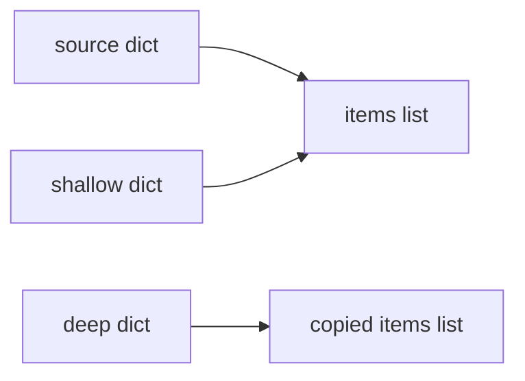

<TLDR>
  <TLDRCell label="what">
    赋值只是把另一个名称绑定到对象；`copy.copy()` 创建新的外层对象，`copy.deepcopy()` 则递归复制其中的内容。
  </TLDRCell>
  <TLDRCell label="trap">
    浅拷贝仍会共享嵌套的可变对象；深拷贝会保留别名与循环，而不是把每条引用都变成独立对象。
  </TLDRCell>
  <TLDRCell label="fix">
    先确定必须相互独立的边界，再用 `is` 测试；如果类需要自己的策略，应使用传入的 `memo` 实现 `__deepcopy__()`。
  </TLDRCell>
</TLDR>

## 是什么，为什么存在

Python 变量保存的是对象引用。`backup = settings` 这样的赋值会把另一个名称绑定到同一个对象，并不会复制对象。如果任一名称访问并修改了可变对象，另一个名称也会看到变化。

对象的<Term id="object-identity">对象标识（object identity）</Term>可判断两个引用是否指向同一个对象。`is` 运算符比较标识，`==` 则询问对象的值是否相等。因此，两个复制得到的列表可以满足 `left == right`，同时 `left is right` 为假。

如果代码必须保留源值，同时修改派生值，就需要复制。常见边界包括：从配置模板创建单次请求的设置、在多项测试之间复用测试夹具，或把可变快照传给不得修改存储状态的代码。应该由所需的边界决定使用哪种操作，而不是只看对象是否嵌套。

`copy` 模块提供 3 种相关操作。`copy.copy()` 创建浅拷贝，`copy.deepcopy()` 创建深拷贝，`copy.replace()` 创建相同类型的对象并替换指定字段。第 3 种操作在 Python 3.13 中加入，也包含在这里验证的 Python 3.14 目标中。

这些操作并不保证每个可达对象都获得新标识。不可变值通常可以安全共享，函数和类会原样返回，一些持有资源的对象则无法复制。有用的复制是一项明确的对象所有权策略，不是内存的逐字节复刻。

## 工作原理

可以把复合对象看成<Term id="object-graph">对象图（object graph）</Term>。容器和实例是节点，它们对其他对象的引用是边。复制操作决定哪些节点是新的，以及哪些边仍指向现有节点。

赋值不会创建新的图节点。<Term id="shallow-copy">浅拷贝（shallow copy）</Term>创建一个新的外层节点，并把源对象直接子项的引用放进去。<Term id="deep-copy">深拷贝（deep copy）</Term>遍历可达对象，并在复制协议支持时递归构造替代对象。



图中说明了两种效果：改写 `shallow` 的顶层字段不会重新绑定 `source` 中的字段，但修改共享的 `items` 列表会同时影响两者。深拷贝指向另一个列表，因此通过这条边发生的修改彼此隔离。

### 浅拷贝

`copy.copy(value)` 会询问值的类型应如何进行浅拷贝。对于内置容器，`records.copy()`、`dict(mapping)` 或完整切片等直接形式可能更清楚地表达「只复制当前容器」的意图。复制子类时，这些直接形式可能返回基类实例，而 `copy.copy()` 通常保留源对象的类型。

只要复制操作对该类型有意义，它只保证外层对象是新的。列表元素、字典值以及普通实例的属性仍然是原来的引用。替换副本中的某个槽位不会影响源对象，但修改通过共享槽位访问到的对象仍会影响两者。

常见写法的作用范围如下：

| 写法 | 结果 | 嵌套引用 |
| --- | --- | --- |
| `alias = source` | 同一个对象 | 相同 |
| `source.copy()` | 新的内置容器 | 共享 |
| `copy.copy(source)` | 新的浅拷贝结果 | 共享 |
| `copy.deepcopy(source)` | 按协议生成的新对象图 | 通过 `memo` 递归解析 |
| `copy.replace(source, field=value)` | 新的受支持记录 | 未变字段遵循替换语义 |

这张表描述的是所有权，而不是相等性。刚构造完成时，这 5 种结果都可能与源对象比较相等。真正重要的差异要通过对象标识和后续修改来观察。

### 深拷贝

`copy.deepcopy(value)` 会递归跟随引用，但不会独立克隆每一条边。在一次遍历中，它维护一个<Term id="memo-dictionary">备忘字典（memo dictionary）</Term>，把源对象标识映射到已复制对象。再次遇到同一个源对象时，它会复用已经创建的副本。

`memo` 解决了两个结构问题。遇到循环时，新对象可以指回自身，不会无限递归；源对象中两条边共享同一个子对象时，复制后的两条边也可以共享对应的一个子对象。保留这种拓扑关系是正确深拷贝行为的一部分。

深拷贝也可能复制过多内容。类中可能含有本应共享的不可变目录、需要清空的缓存，或应该重新创建而不是复制的锁。因此，类可以定义 `__deepcopy__(self, memo)`，无需接受通用的逐字段策略。

### 选择操作

先从计划执行的修改出发，画出从根对象到目标对象的路径。凡是修改必须隔离的路径，复制操作都要沿途创建新节点。如果所有权清楚，其他位置保持共享完全可以是正确且有用的选择。

按以下顺序判断：

1. 确实需要共享标识时，使用赋值。
2. 只有外层容器或实例会变化时，使用浅拷贝。
3. 可达的可变对象图必须隔离，而且所有成员都支持合理复制策略时，使用深拷贝。
4. 需要创建新记录并按名称修改字段，而不是递归复制时，使用 `copy.replace()`。

测试应同时断言值和标识关系。`==` 用于确认数据符合预期，经过选择的 `is` 检查则确认哪些可变部分共享、哪些相互独立。完成这些检查后，再修改一个副本，就能通过行为验证所有权边界，而不只是检查结构。

### API 设计中的复制边界

在每个入口和出口都复制，并不会自动形成防御式设计。这样做可能掩盖不清楚的所有权，调用者也无法判断 API 返回的是实时视图、浅快照，还是隔离的对象图。应在操作名称或文档中写明这项契约。

不可变返回类型往往比深拷贝更能清楚表达边界。由不可变记录构成的元组，无需在每次读取前递归复制。如果确实需要修改，可以用创建下一个有效领域值的方法，并在同一边界校验变更。

对于可变输入，要明确被调用方是仅在调用期间借用对象、保存引用、取得浅快照，还是拥有隔离副本。这项决定也会影响并发调用者能观察到什么。复制不会让原本不安全的共享服务自动获得线程安全性。

最窄且正确的边界通常最容易测试。如果只会修改某个列表，就只复制该列表。如果字段遵循不同的所有权规则，应选择类级策略或具名构造函数。

## 示例

下面的示例依次展示普通容器、对象图拓扑、结构化替换和类自定义策略。所有输出均由 Python 3.14 实际生成。

### 赋值、浅拷贝与深拷贝

这个示例从同一个嵌套字典出发，分别采用 3 种处理方式。修改操作有意同时涉及一个顶层字段和两个嵌套列表，以便清楚显示边界。

<Depth level="quick">

```python run title="copy_levels.py"
import copy

source = {"owner": "Ada", "items": [{"sku": "A-1", "qty": 1}]}
alias = source
shallow = copy.copy(source)
deep = copy.deepcopy(source)

alias["owner"] = "Grace"
shallow["items"][0]["qty"] = 2
deep["items"].append({"sku": "B-2", "qty": 1})

print("source:", source)
print("shallow:", shallow)
print("deep:", deep)
print("same outer:", alias is source, shallow is source, deep is source)
print("same items:", shallow["items"] is source["items"], deep["items"] is source["items"])
```

```text
source: {'owner': 'Grace', 'items': [{'sku': 'A-1', 'qty': 2}]}
shallow: {'owner': 'Ada', 'items': [{'sku': 'A-1', 'qty': 2}]}
deep: {'owner': 'Ada', 'items': [{'sku': 'A-1', 'qty': 1}, {'sku': 'B-2', 'qty': 1}]}
same outer: True False False
same items: True False
```

</Depth>

修改 `alias["owner"]` 会改变 `source`，因为这两个名称指向同一个字典。浅拷贝已经拥有自己的顶层 `owner` 槽位，因此这次重新绑定不会影响它。

源字典与浅拷贝字典都指向同一个 `items` 列表。更新列表中的字典时，两个根对象都能看到变化。深拷贝拥有不同的列表和嵌套字典，所以新增元素以及原来的数量值都保持隔离。

### 共享子对象与循环

深拷贝会保留对象图内部的关系。这里有两个键共享同一个角色列表，`self` 键则指回根字典。

```python run title="graph_copy.py"
import copy

shared_roles = ["reader"]
account = {"primary": shared_roles, "backup": shared_roles}
account["self"] = account

clone = copy.deepcopy(account)

print("new root:", clone is not account)
print("new roles:", clone["primary"] is not account["primary"])
print("alias preserved:", clone["primary"] is clone["backup"])
print("cycle preserved:", clone["self"] is clone)

clone["primary"].append("editor")
print("source roles:", account["primary"])
print("clone roles:", clone["backup"])
```

```text
new root: True
new roles: True
alias preserved: True
cycle preserved: True
source roles: ['reader']
clone roles: ['reader', 'editor']
```

复制得到的角色列表与源列表相互独立，但副本中的 `primary` 和 `backup` 仍共享一个列表。`deepcopy()` 不会把源对象中的这两条引用变成彼此无关的值。反向引用也会指向 `clone`，而不是 `account`。

因此，深拷贝测试不能只有修改断言。如果领域模型依赖重复引用和循环，还应验证这些关系。树形测试夹具无法暴露只在对象图中出现的错误。

### 替换字段而不递归复制

`copy.replace()` 支持具名元组、数据类，以及实现了 `__replace__()` 的类。它会创建相同类型的对象并应用具名变更，未变字段则遵循该类型的替换语义。

```python run title="replace_record.py"
from copy import replace
from dataclasses import dataclass


@dataclass(frozen=True)
class Job:
    queue: str
    labels: list[str]


template = Job(queue="normal", labels=["billing"])
urgent = replace(template, queue="urgent")

print(template)
print(urgent)
print("same labels:", urgent.labels is template.labels)

urgent.labels.append("priority")
print("template labels:", template.labels)
```

```text
Job(queue='normal', labels=['billing'])
Job(queue='urgent', labels=['billing'])
same labels: True
template labels: ['billing', 'priority']
```

新的 `Job` 使用了不同的 `queue`，但 `replace()` 不会深拷贝 `labels`。即使数据类已经冻结，其中仍然可以包含可变对象；冻结只会阻止重新绑定字段，不会阻止通过列表引用执行修改。

未变字段可以安全共享或本身就是不可变值时，适合使用替换。如果 `labels` 必须隔离，应在变更中显式传入复制后的列表：`replace(template, queue="urgent", labels=template.labels.copy())`。

### 为类定义复制行为

这个 `Node` 类明确给出了浅拷贝策略，并实现了可安全处理对象图的深拷贝策略。深拷贝钩子会先登记新节点，再递归复制子节点。

```python run title="custom_copy.py"
import copy


class Node:
    def __init__(self, name):
        self.name = name
        self.children = []

    def __copy__(self):
        clone = type(self)(self.name)
        clone.children = self.children
        return clone

    def __deepcopy__(self, memo):
        clone = type(self)(self.name)
        memo[id(self)] = clone
        clone.children = copy.deepcopy(self.children, memo)
        return clone


root = Node("root")
leaf = Node("leaf")
root.children = [leaf, leaf, root]

shallow = copy.copy(root)
deep = copy.deepcopy(root)

print("shallow shares list:", shallow.children is root.children)
print("deep has new list:", deep.children is not root.children)
print("deep keeps alias:", deep.children[0] is deep.children[1])
print("deep keeps cycle:", deep.children[2] is deep)
```

```text
shallow shares list: True
deep has new list: True
deep keeps alias: True
deep keeps cycle: True
```

`__copy__()` 不接收 `memo`，并且有意复用子节点列表。`__deepcopy__()` 接收本次遍历的 `memo`，先登记占位对象，再把同一个字典传给递归调用。`memo` 应视为 `deepcopy()` 所拥有的不透明内部记录。

先登记副本非常重要，因为 `root` 会在自己的子节点中再次出现。递归到达这条边时，`memo` 已经建立从源根节点到副本的映射。重复出现的 `leaf` 边也会解析到同一个已复制叶节点。

## 陷阱

### 把赋值当成复制

> [!PITFALL]
> AI 建议或快速重构可能把代码写成 `working = template`，仿佛这样就创建了工作副本。两个名称仍指向同一个对象，因此就地更新会改变模板。
>
> **修复方法：** 先说明是否确实需要共享标识。如果不需要，就根据具体修改路径选择浅拷贝、深拷贝或替换操作，再针对必须为新的边界添加 `is not` 断言。

### 认为浅拷贝能隔离嵌套状态

> [!PITFALL]
> `dict.copy()` 和 `copy.copy()` 会创建新字典，但嵌套的列表、集合、字典或实例仍然共享。只修改顶层键的测试可能通过，生产代码之后修改共享子对象时才暴露问题。
>
> **修复方法：** 在测试中执行一次嵌套修改。如果只有一个已知子对象需要独立，就显式复制它；只有更广的可达对象图都应遵循深拷贝语义时，才使用 `deepcopy()`。

### 把 `deepcopy()` 当成通用安全包装

> [!PITFALL]
> 深拷贝可能复制依赖标识的领域对象、沿用不合适的复制策略，或者无法处理文件、套接字、锁、栈帧等资源。函数和类会原样返回，因此「深」并不表示每个对象标识都会变成新的。
>
> **修复方法：** 在 API 边界定义所有权。如果类把值状态与服务或资源混在一起，应优先采用不可变输入、显式构造函数，或 `clone_for_request()` 这样的领域方法。

### 破坏 `memo` 契约

> [!PITFALL]
> 手写的 `__deepcopy__()` 如果忽略传入的 `memo`、为每个子对象传入新字典，或在递归完成后才登记副本，就可能重复复制共享子对象，或在循环上无限递归。
>
> **修复方法：** 先创建尚未填充的副本，把它存为 `memo[id(self)]`，再把同一个 `memo` 传给每次递归的 `copy.deepcopy()` 调用。测试中至少放入一个重复子对象和一条反向引用，不能只测试树。

### 混淆替换与深拷贝

> [!PITFALL]
> `copy.replace(record, field=value)` 看似是复制操作，但未变的可变字段仍可能共享。冻结的数据类也不会让其字段中存储的对象自动变为不可变。
>
> **修复方法：** 用替换操作表达具名字段变更，并显式复制所有权发生变化的部分。对未变的可变字段断言其标识，让共享成为有意的设计选择。

### 用相等性测试独立性

> [!PITFALL]
> 副本与源对象通常从相等的值开始，因此 `copied == source` 无法说明可变子对象是否共享。测试可能报告成功，但第一次嵌套修改就会越过预期边界。
>
> **修复方法：** 把值检查与有针对性的标识断言、修改探针结合起来。除非领域确实赋予不可变叶节点的标识特殊含义，否则不要断言它们必须获得新标识。

## AI 时代

**生成代码在这里常犯的错**

生成代码经常在每个函数边界插入 `deepcopy()`，以此显得更具防御性。模型对象中含有锁或打开的句柄时，这样做可能直接失败；如果对象标识具有领域含义，还可能复制本应保持唯一的对象。相反的错误是把赋值换成 `.copy()`，但后续代码仍修改嵌套字典，看似修复后仍保留原来的问题。

模型还会生成有缺陷的 `__deepcopy__()` 钩子：每个属性都使用新的 `memo`，或在递归之后才登记 `self`。这类代码可以通过无环示例，却无法处理重复引用和循环。生成代码使用 `copy.replace()` 时，也可能把未变的列表或字典误述为独立副本。

**让 AI 检查**

- 画出源对象与结果对象的对象图，标明每个可变节点是共享的还是新建的。
- 找出持有资源或依赖标识的属性，并为每个属性提出明确策略。
- 构造包含重复子对象、循环和嵌套修改的测试，再写明必须成立的 `is` 断言。

**审查清单**

- 跟踪修改路径，确认复制操作创建了所有必需的所有权边界。
- 检查每个自定义深拷贝钩子是否提前登记 `memo`，并始终传递同一个 `memo`。
- 验证替换操作不会静默共享调用方预期独占的可变字段。

**提示词词汇**

使用准确术语：`object identity`（对象标识）、`aliasing`（别名）、`object graph`（对象图）、`shallow copy`（浅拷贝）、`deep copy`（深拷贝）、`memo dictionary`（备忘字典）、`cycle preservation`（保留循环）、`shared-reference preservation`（保留共享引用）、`copy protocol`（复制协议）、`structural replacement`（结构化替换）。不要只说「让对象相互独立」，应要求给出标识映射和修改测试。

<Depth level="deep">

## 深拷贝中的对象拓扑

源对象图可能是有向图，而不是树。一个子对象可以通过多条路径到达，之后的某条边也可能返回祖先。即使最初打印的值完全相等，独立复制每条边仍会改变这种拓扑。

`deepcopy()` 会在 `memo` 中把每个访问过的源对象标识关联到一个目标对象。首次访问时，它创建或开始创建目标对象。之后再次访问时，它直接返回 `memo` 中的目标对象，不再递归复制源对象。

这个算法解释了 `graph_copy.py` 中的两个结果：两个角色字段指向同一个已复制列表，复制后的 `self` 字段则指向复制后的字典。副本既与源对象隔离，又保留了自身内部有意义的共享关系。

`memo` 只属于一次顶层 `deepcopy()` 调用。分别调用两次通常会建立两个独立的目标对象图。应用代码不应保留或解释 `memo`；自定义钩子只用它参与当前遍历。

有些值会被有意复用，而不是重新构造。Python 复制文档明确说明函数和类会原样返回，并排除了若干运行时对象与外部资源类型。类的复制策略应区分持久值状态和进程中的实时资源。

## 自定义复制协议

`copy.copy(obj)` 会先遵循注册行为和类型特定行为，其中包括类所定义的 `obj.__copy__()`。这个钩子不接收额外参数，返回预期的浅拷贝结果。它可以调用构造函数、通过 `__new__()` 分配，或使用另一个显式工厂，但必须维持类不变量。

如果对象实现了 `obj.__deepcopy__(memo)`，`copy.deepcopy(obj)` 会调用它。该钩子决定哪些属性递归复制、哪些共享、哪些重置。复制递归组件时必须调用 `copy.deepcopy(component, memo)`，使其加入同一次对象图遍历。

只有当初始化过程没有不需要的外部副作用，而且接受正在重建的状态时，才能安全地从复制钩子调用 `__init__()`。如果类会在初始化时打开连接、注册回调或分配其他资源，通常需要单独的构造路径。复制操作不应悄悄再次执行外部动作。

Python 还会复用通过 `copyreg` 注册的归约函数，这套机制也用于支持 pickle。对于已经围绕归约协议设计的类，这种联系很有用，但并不表示复制与序列化可以互换。序列化会跨越表示边界，复制则在当前进程中构造对象。

具名领域方法可能比通用深拷贝更清楚。`invoice.revise(lines=...)` 或 `session.fork_for_request()` 会告诉调用方哪些内容保持共享、哪些内容重置。只有标准复制函数无论在何处调用都具有合理语义时，才应实现通用钩子。

复制钩子必须维持与普通构造相同的不变量。如果两个属性必须一致，就应一起重建，而不是分别复制其存储。如果缓存由复制后的状态派生，应清空或重新计算，不能把过期值带入副本。

继承也需要显式测试。硬编码基类构造函数的钩子可能悄悄丢失子类，而使用 `type(self)` 时，如果子类还要求额外状态，同样可能出错。要明确复制是支持多态、禁止继承，还是委托给受保护工厂。

## 结构化替换

`copy.replace(obj, **changes)` 的适用范围有意小于浅拷贝和深拷贝。在 Python 3.14 中，它支持由 `namedtuple()` 创建的具名元组、数据类，以及实现 `__replace__()` 的用户自定义类。未知字段会按照受支持类型的行为被拒绝。

替换操作会明确列出发生变化的字段，因此适合不可变风格的更新。它不会递归遍历对象图。未变字段可以继续引用相同对象，就像示例中的可变 `labels` 字段一样。

自定义的 `__replace__(self, /, **changes)` 应返回相同类型的新实例。它应该校验字段名称并维持类不变量，不能把任意条目直接写入 `__dict__`。把 `self` 设为仅限位置参数后，如果类型确实有名为 `self` 的字段，该名称仍可出现在 `changes` 中。

显式字段修改会产生新的记录标识时，应选择替换。整个受支持对象图都需要隔离副本时，应选择深拷贝。如果两种描述都不符合领域，应编写能说明真实状态转换的具名构造函数。

### 测试复制策略

有效的测试夹具应比生产环境中的顺利路径示例包含更多结构。让两个字段共享同一个可变子对象；如果允许循环，再加入一条反向引用；此外还要包含一个按策略保持共享的属性。只用这一份夹具，就能区分保留拓扑的实现与朴素递归。

复制完成后，检查 4 类关系：

1. 复制后的根对象具有预期值和类型。
2. 必须隔离的可变节点具有新标识。
3. 有意共享或重复的引用保留预期关系。
4. 修改副本时，只有策略允许的节点发生变化。

还要执行构造函数和自定义钩子的失败路径。尚未构造完成的副本不应逃逸，复制失败前打开的外部资源也必须释放。满足这条规则最简单的办法，是不要在通用复制钩子中获取外部资源。

</Depth>

<Checkpoint id="python/copy" />

## 延伸阅读

- [Python 3.14 `copy` 模块](https://docs.python.org/3.14/library/copy.html)
- [Python 3.14 数据模型：对象、值与类型](https://docs.python.org/3.14/reference/datamodel.html#objects-values-and-types)
- [Python 3.14 `copyreg` 模块](https://docs.python.org/3.14/library/copyreg.html)
