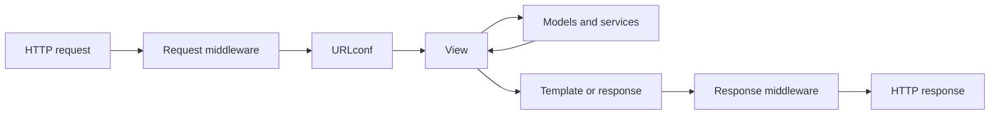

<TLDR>
  <TLDRCell label="what">
    Django is a Python web framework that connects HTTP routing, views, data models, templates, forms, authentication, and operational checks under one set of conventions.
  </TLDRCell>
  <TLDRCell label="when">
    Use it when a database-backed application benefits from an integrated framework and a stable project structure more than it benefits from assembling each layer independently.
  </TLDRCell>
  <TLDRCell label="how">
    Route each request to a small view, keep data rules in models and services, validate untrusted input with forms, and verify behavior through Django's test client.
  </TLDRCell>
</TLDR>

## What it is and why it exists

<Term id="django">Django</Term> is a server-side Python framework for web applications. It supplies the plumbing that most database-backed sites need: an HTTP request and response layer, URL routing, an object-relational mapper, HTML templates, forms, authentication, an administration site, and commands for development and deployment checks.

Those pieces share configuration and conventions. A model field can define a database column, contribute validation to a `ModelForm`, and appear in the administration site. A named route can be reversed from Python or a template, so application code does not have to repeat literal URLs.

Django exists to make these boundaries predictable. You still decide the domain model, permissions, transactions, queries, and presentation. The framework handles routine integration and gives each decision a conventional home.

The usual unit of organization is a project containing one or more apps. The project owns settings and the root URL configuration. An app groups one capability, such as orders or accounts, and can contain models, views, forms, templates, migrations, and tests.

An app is a Python package, not a separately deployed service. Several apps normally run in the same process and may share a database transaction. Split apps by cohesive domain responsibility, not by forcing every model into its own package.

Django fits server-rendered sites, internal tools, content systems, and JSON endpoints backed by relational data. A smaller framework may be easier for a tiny stateless service. A dedicated API layer may also be useful when content negotiation, schema generation, and API-specific authentication dominate the application.

## How it works

An HTTP server hands Django a request through WSGI or ASGI. Django runs the request through the configured <Term id="middleware">middleware</Term> stack, asks the root <Term id="urlconf">URLconf</Term> to resolve the path, and calls the matching view with an `HttpRequest` plus any captured path values.

The view coordinates one use case. It can validate input, call model or service code, select a template, and return an `HttpResponse`. A view should not become the only place where authorization, business rules, and database writes live; those rules need focused functions and tests of their own.

A useful first cut keeps each responsibility visible:

- URL patterns decide which view receives a path.
- Views translate HTTP input and output for one use case.
- Models and service functions enforce data and domain rules.
- Templates decide how presentation data becomes HTML.



Middleware wraps this flow. On the way in it can attach session or authentication state, reject a request, or normalize headers. On the way out it can add security headers or transform the response. Order matters because one middleware component may depend on work done by an earlier component.

Models describe persistent data with Python classes. Their fields and relationships become input to the <Term id="migration">migration</Term> system, which records schema changes as versioned Python files. `makemigrations` derives proposed operations from model changes; `migrate` applies recorded operations to a database.

Every model gets a manager, usually named `objects`. Manager methods create <Term id="queryset">QuerySet</Term> objects that compose filtering, ordering, joins, annotations, and projections. Most QuerySets are lazy: building one describes a query, while iteration, conversion to `list`, `len`, `bool`, or another evaluation trigger sends SQL to the database.

Templates render presentation data and escape variable output by default in HTML contexts. Forms bind untrusted input, convert values to Python types, collect validation errors, and expose valid values through `cleaned_data`. A `ModelForm` can save a model, but database constraints and transaction boundaries remain part of the design.

The framework's defaults reduce common mistakes; they do not infer application policy. Django cannot know which user owns an order, which state transitions are legal, which outbound URL is safe, or whether two writes must commit together. Those checks belong in your code.

## Examples

### Route a request to a view

This first example configures the smallest useful Django environment in one file. The URL pattern captures an integer, the view reads a query parameter, and the test client sends a real Django request through URL resolution.

<Depth level="quick">

```python run title="request_route.py"
from django.conf import settings

settings.configure(
    SECRET_KEY="demo",
    ROOT_URLCONF=__name__,
    ALLOWED_HOSTS=["testserver"],
)

import django

django.setup()

from django.http import JsonResponse
from django.test import Client
from django.urls import path


def order_detail(request, order_id):
    currency = request.GET.get("currency", "EUR")
    return JsonResponse({"order_id": order_id, "currency": currency})


urlpatterns = [
    path("orders/<int:order_id>/", order_detail, name="order-detail"),
]

response = Client().get("/orders/42/", {"currency": "USD"})
print(response.status_code)
print(response.json())
```

```text
200
{'order_id': 42, 'currency': 'USD'}
```

</Depth>

The `<int:order_id>` converter rejects a non-integer segment before the view runs. The query parameter stays a string because URL converters apply only to captured path components. In a real project, settings, URL patterns, and views live in separate modules; the single file keeps this example executable.

Named routes matter once templates and redirects refer to them. Prefer `reverse("order-detail", args=[42])` or the `` template tag to hard-coded paths. Route names then become the stable interface while path shapes can change.

### Compose and evaluate a QuerySet

The next example defines a model and creates its table in an in-memory SQLite database. Production projects use migrations for schema changes; direct `schema_editor()` calls here only make the example self-contained.

```python run title="queryset_pipeline.py"
from django.conf import settings

settings.configure(
    DEBUG=True,
    SECRET_KEY="demo",
    DATABASES={
        "default": {
            "ENGINE": "django.db.backends.sqlite3",
            "NAME": ":memory:",
        }
    },
)

import django

django.setup()

from django.db import connection, models, reset_queries


class Order(models.Model):
    status = models.CharField(max_length=20)
    total_cents = models.PositiveIntegerField()

    class Meta:
        app_label = "shop"


with connection.schema_editor() as schema:
    schema.create_model(Order)

Order.objects.bulk_create(
    [
        Order(status="paid", total_cents=2500),
        Order(status="pending", total_cents=1800),
        Order(status="paid", total_cents=4200),
    ]
)

reset_queries()
paid_orders = Order.objects.filter(status="paid").order_by("-total_cents")
print("queries before evaluation:", len(connection.queries))
print(list(paid_orders.values_list("total_cents", flat=True)))
print("queries after evaluation:", len(connection.queries))
```

```text
queries before evaluation: 0
[4200, 2500]
queries after evaluation: 1
```

Calling `filter()` and `order_by()` returns a new QuerySet without executing it. `values_list()` adds a projection, and `list()` finally evaluates the composed query. Laziness lets code add conditions incrementally, but evaluation hidden inside a loop or serializer can also hide repeated database work.

`connection.queries` is populated here because `DEBUG=True`; it is a diagnostic aid, not an application API for accounting. In tests, `assertNumQueries()` gives a clearer contract. In production, inspect queries with database and application observability tools rather than enabling debug mode.

### Validate a model write

This example connects a `ModelForm` to model metadata. It accepts the first item, rejects a negative stock value during field validation, and rejects a duplicate SKU during model validation.

```python run title="validated_write.py"
from django.conf import settings

settings.configure(
    SECRET_KEY="demo",
    DATABASES={
        "default": {
            "ENGINE": "django.db.backends.sqlite3",
            "NAME": ":memory:",
        }
    },
)

import django

django.setup()

from django import forms
from django.db import connection, models, transaction


class InventoryItem(models.Model):
    sku = models.CharField(max_length=20, unique=True)
    stock = models.PositiveIntegerField()

    class Meta:
        app_label = "warehouse"


class InventoryItemForm(forms.ModelForm):
    class Meta:
        model = InventoryItem
        fields = ["sku", "stock"]


with connection.schema_editor() as schema:
    schema.create_model(InventoryItem)


def create_item(payload):
    form = InventoryItemForm(payload)
    if not form.is_valid():
        errors = form.errors.as_data()
        return "invalid:" + errors[next(iter(errors))][0].code
    with transaction.atomic():
        item = form.save()
    return f"created:{item.sku}:{item.stock}"


print(create_item({"sku": "A-10", "stock": 3}))
print(create_item({"sku": "B-20", "stock": -1}))
print(create_item({"sku": "A-10", "stock": 8}))
```

```text
created:A-10:3
invalid:min_value
invalid:unique
```

`is_valid()` runs field conversion, field validators, form cleaning, and model validation. Only after it succeeds is `form.save()` appropriate. Listing `fields` explicitly prevents a later model field from becoming writable merely because generated code forgot to update an exclusion list.

The uniqueness check improves error messages, but it cannot prevent a race between validation and insertion. The database's unique constraint is the authority. Code that must turn a concurrent duplicate into a domain conflict should catch `IntegrityError` around the outer `atomic()` block.

### Render untrusted values safely

Django templates escape variables in HTML contexts by default. `format_html()` is the corresponding Python helper when code must assemble a small HTML fragment: the format string supplies the markup, while interpolated arguments are escaped.

```python run title="safe_template.py"
from django.conf import settings

settings.configure(
    SECRET_KEY="demo",
    TEMPLATES=[
        {"BACKEND": "django.template.backends.django.DjangoTemplates"},
    ],
)

import django

django.setup()

from django.template import Context, Template
from django.utils.html import format_html


customer_name = "<script>alert('x')</script>"
template = Template("Customer: {{ customer_name }}")
print(template.render(Context({"customer_name": customer_name})))

badge = format_html("<strong>{}</strong>", "<Admin>")
print(badge)
```

```text
Customer: &lt;script&gt;alert(&#x27;x&#x27;)&lt;/script&gt;
<strong>&lt;Admin&gt;</strong>
```

Escaping preserves the text while preventing the browser from treating its angle brackets as markup. It is context-sensitive protection, not content validation. Do not pass untrusted HTML through `mark_safe()`; if the product accepts rich text, sanitize it with an explicit element and attribute policy before rendering.

## Pitfalls

> [!PITFALL]
> Calling `save()` on a model or form is not an authorization check. Generated CRUD views often load an object by primary key and update it without restricting the query to objects the current user may change.

**Fix:** scope the lookup before mutation, for example by owner or tenant, and then check the required permission. Test another authenticated user's identifier alongside anonymous access and the happy path. Hiding an edit button in a template does not protect the endpoint.

> [!PITFALL]
> Evaluating related objects inside a loop can turn one list query into an N+1 query pattern. A template such as `{{ order.customer.name }}` may issue one additional query per order when the relation was not loaded.

**Fix:** use `select_related()` for single-valued foreign-key and one-to-one relationships, and `prefetch_related()` for multi-valued or reverse relationships. Assert query counts around representative list sizes. Do not add every possible relation; unused joins and prefetches also cost time and memory.

> [!PITFALL]
> Disabling CSRF protection or marking strings safe is not a general fix for a rejected form or escaped HTML. Both moves remove a boundary that was reporting a mismatch between data and its context.

**Fix:** include `` in same-site state-changing forms, send the token correctly from JavaScript clients, and keep autoescaping enabled. Sanitize rich HTML with a policy designed for that content. CSRF protection does not replace authentication, authorization, or output encoding.

> [!PITFALL]
> Model validation is not a transaction and does not serialize concurrent requests. Two valid requests can both observe available stock or an unused identifier, then race while writing.

**Fix:** express invariants as database constraints where possible and group dependent writes inside `transaction.atomic()`. Lock rows with `select_for_update()` when the workflow truly requires pessimistic serialization, and handle integrity or deadlock failures at the operation boundary.

> [!PITFALL]
> Changing models without creating and applying migrations leaves Python state and database state out of sync. Editing an old migration after other environments have applied it creates a different history under the same filename.

**Fix:** generate a new migration, inspect its operations, and test both application and rollback paths when rollback is supported. Treat migrations as deployed code. Separate risky data movement from schema changes when the combined operation would hold long locks or make recovery unclear.

## In the AI era

**What generated code gets wrong here**

Generated Django code often looks complete because a model, `ModelForm`, generic view, template, and URL pattern fit together syntactically. The missing parts are usually boundaries: an update view lacks an owner-filtered QuerySet, a form exposes `fields = "__all__"`, a list template triggers N+1 queries, or an async view calls synchronous ORM methods. Models also tend to place side effects in `save()` or signals, making retries and transactions hard to reason about.

**Ask your AI to check**

- Trace one unauthorized object identifier through URL resolution, object lookup, form binding, and save; show exactly where access is denied.
- List every point that evaluates a QuerySet and count expected queries for one row and one hundred rows.
- Identify every write-side invariant and state whether form validation, a database constraint, a row lock, or an atomic block enforces it under concurrency.

**Review checklist**

- Exercise GET, allowed writes, malformed input, cross-user access, duplicate submission, and concurrent write paths with the test client.
- Inspect every `fields`, `exclude`, `mark_safe`, `csrf_exempt`, raw SQL, and unrestricted `objects.get()` introduced by generated code.
- Run `makemigrations --check`, Django's system checks, the test suite, and a query-count assertion before accepting the change.

**Prompt vocabulary**

Use the exact terms `URLconf`, `middleware order`, `QuerySet evaluation`, `N+1 query`, `ModelForm field allowlist`, `object-level authorization`, `database constraint`, `atomic transaction`, `select_for_update`, `ASGI`, and `sync-to-async boundary`. Ask for a request-and-query trace tied to a specific endpoint; "make this Django view secure and fast" leaves the important decisions implicit.

<Depth level="deep">

## QuerySets, transactions, and migrations

A QuerySet is both a query description and a result cache after evaluation. Methods such as `filter()`, `exclude()`, and `order_by()` return clones, so adding a condition does not mutate the earlier QuerySet. Reusing one evaluated QuerySet can reuse its cached rows; creating a new clone can issue another query.

Evaluation timing matters when data changes. Constructing a QuerySet outside an `atomic()` block does not take a snapshot by itself because no SQL has run. The database backend and its isolation level determine what evaluated queries can observe inside a transaction.

Use `get()` when exactly one row is required and treat `DoesNotExist` and `MultipleObjectsReturned` as meaningful outcomes. `filter().first()` silently turns both "no row" and an arbitrary ordering choice into a nullable result. That can be right for an optional lookup, but it is weaker when uniqueness is part of the rule.

`select_related()` uses SQL joins and suits one related object per row. `prefetch_related()` performs separate queries and joins the results in Python, so it handles many-to-many and reverse relations. Filtering a related manager differently after prefetching may issue another query instead of using the prefetched cache.

Bulk methods have deliberately different behavior from per-instance saves. `QuerySet.update()` executes an SQL update and does not call each model's `save()` method. `bulk_create()` and bulk updates likewise bypass some instance-level hooks. Prefer explicit service functions over relying on hidden side effects in overridden model methods or signals.

An `atomic()` block commits all enclosed database work together or rolls it back after an exception. Catch database errors outside the block whose rollback you need; catching them inside can hide a broken transaction from Django until a later query fails. Keep transactions short because open transactions retain database resources and may hold locks.

Use `transaction.on_commit()` for side effects that should happen only after a successful commit, such as invalidating a cache or enqueueing follow-up work. A task queued inside the transaction may run before the new row is visible, and it cannot be recalled automatically if the transaction later rolls back.

Migrations describe a history, not merely the schema's final shape. Django compares current models with migration state when creating new operations. Review generated migrations for unintended renames, destructive changes, callable defaults, and database-specific locking behavior.

Data migrations should use historical models from the migration app registry, not import today's model class directly. The current class can change while an old migration still needs to run on a new environment. Make forward and reverse behavior explicit, and mark a migration irreversible when no honest reverse operation exists.

## Sync and async boundaries

Django supports synchronous and asynchronous views. An async view gains an async request stack under ASGI only when middleware along its path also supports async operation. Under WSGI, Django can run the view but cannot provide the same long-lived connection behavior.

Choose async for endpoints that spend substantial time awaiting supported network I/O, not as a decoration on ordinary database CRUD. CPU-bound work still occupies the process, and a synchronous dependency still needs adaptation. Measure the whole request path before assuming that changing `def` to `async def` improves capacity.

QuerySet methods that execute SQL generally have `a`-prefixed async variants, and QuerySets support `async for`. Methods that only construct a QuerySet remain ordinary methods because they do not perform I/O. Calling a synchronous-only ORM operation while an event loop is active can raise `SynchronousOnlyOperation`.

Asynchronous transactions are not supported in Django 6.0. Put the transactional unit in one synchronous function and call it through `sync_to_async()` instead of crossing the boundary for every query. This keeps transaction ownership and thread-sensitive database access together.

Do not set `DJANGO_ALLOW_ASYNC_UNSAFE` to silence that exception in deployed code. It disables a guard against concurrent access to async-unsafe state and can permit corruption. Fix the call boundary or use the supported asynchronous method.

An async view may be cancelled when a client disconnects during a long-lived request. Put cleanup in `finally` blocks or context managers and re-raise `asyncio.CancelledError` after any necessary cleanup. Background work that must outlive the response needs an explicit task system and durable ownership, not an unreferenced `asyncio.create_task()` inside the view.

</Depth>

<Checkpoint id="python/django" />

## Further reading

- [Django URL dispatcher](https://docs.djangoproject.com/en/6.0/topics/http/urls/)
- [Django QuerySet guide](https://docs.djangoproject.com/en/6.0/topics/db/queries/)
- [Django ModelForm guide](https://docs.djangoproject.com/en/6.0/topics/forms/modelforms/)
- [Django database transactions](https://docs.djangoproject.com/en/6.0/topics/db/transactions/)
- [Security in Django](https://docs.djangoproject.com/en/6.0/topics/security/)
- [Django asynchronous support](https://docs.djangoproject.com/en/6.0/topics/async/)
