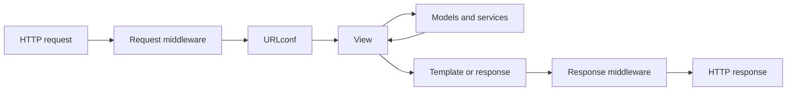

<TLDR>
  <TLDRCell label="what">
    Django 是一个 Python Web 框架，通过同一套约定整合 HTTP 路由、视图、数据模型、模板、表单、认证和运维检查。
  </TLDRCell>
  <TLDRCell label="when">
    如果数据库应用更需要集成框架与稳定的项目结构，而不是自行拼装每一层，就适合使用 Django。
  </TLDRCell>
  <TLDRCell label="how">
    把请求路由到小而专注的视图，在模型与服务中保留数据规则，用表单验证不可信输入，并通过 Django 测试客户端验证行为。
  </TLDRCell>
</TLDR>

## 是什么，为什么存在

<Term id="django">Django</Term> 是用于 Web 应用的服务端 Python 框架。它提供大多数数据库网站都需要的基础设施：HTTP 请求与响应层、URL 路由、对象关系映射器、HTML 模板、表单、认证、管理后台，以及开发和部署检查命令。

这些部件共用配置与约定。一个模型字段既能定义数据库列，也能为 `ModelForm` 提供验证规则，还能出现在管理后台中。Python 代码与模板都能反向解析具名路由，因此应用代码不必重复写死 URL。

Django 的作用是让这些边界变得可预测。领域模型、权限、事务、查询和展示方式仍由你决定。框架负责日常集成，并为每项决策提供约定好的位置。

常见的组织单元是包含一个或多个 app 的项目。项目负责设置和根 URL 配置。一个 app 聚合一项能力，例如订单或账户，其中可以包含模型、视图、表单、模板、迁移与测试。

app 是 Python 包，不是单独部署的服务。多个 app 通常运行在同一进程中，也可能共用一个数据库事务。应按内聚的领域职责划分 app，不要强行为每个模型创建一个包。

Django 适合服务端渲染网站、内部工具、内容系统，以及由关系数据支撑的 JSON 端点。对于微小的无状态服务，更小的框架可能更省事。如果内容协商、模式生成和 API 专用认证占据应用的大部分工作，也可以引入专用 API 层。

## 工作原理

HTTP 服务器通过 WSGI 或 ASGI 把请求交给 Django。Django 让请求经过已配置的<Term id="middleware">中间件（middleware）</Term>栈，再由根<Term id="urlconf">URLconf（URL 配置）</Term>解析路径，最后用 `HttpRequest` 和路径中捕获的值调用匹配的视图。

视图负责协调一个用例。它可以验证输入、调用模型或服务代码、选择模板，并返回 `HttpResponse`。授权、业务规则和数据库写入不应全都堆在视图里；这些规则需要独立、专注的函数与测试。

可以先按以下方式划清职责：

- URL 模式决定由哪个视图接收路径。
- 视图为一个用例转换 HTTP 输入与输出。
- 模型和服务函数执行数据规则与领域规则。
- 模板决定怎样把展示数据变成 HTML。



中间件包裹整个流程。在请求进入时，它可以附加会话或认证状态、拒绝请求，或规范化请求头。在响应离开时，它可以添加安全响应头或转换响应。顺序很重要，因为一个中间件可能依赖更早的组件完成的工作。

模型用 Python 类描述持久化数据。字段与关系会成为<Term id="migration">迁移（migration）</Term>系统的输入，由它把模式变更记录为受版本控制的 Python 文件。`makemigrations` 从模型变更中推导待执行操作，`migrate` 则把已记录操作应用到数据库。

每个模型都有一个管理器，通常名为 `objects`。管理器方法创建<Term id="queryset">查询集（QuerySet）</Term>，可组合过滤、排序、连接、注解和投影。大多数 QuerySet 都是惰性的：构造 QuerySet 只是在描述查询；迭代或转换为 `list`、`len`、`bool` 等求值操作才会向数据库发送 SQL。

模板负责渲染展示数据，并且默认在 HTML 上下文中转义变量输出。表单绑定不可信输入，将值转换为 Python 类型，收集验证错误，并通过 `cleaned_data` 暴露有效值。`ModelForm` 可以保存模型，但数据库约束和事务边界仍需要明确设计。

框架默认值可以减少常见错误，却无法推断应用策略。Django 不知道哪个用户拥有某个订单、哪些状态转换合法、哪个出站 URL 安全，也不知道两次写入是否必须一起提交。这些检查属于应用代码。

## 示例

### 把请求路由到视图

第一个示例在单个文件中配置一个最小但可用的 Django 环境。URL 模式捕获一个整数，视图读取查询参数，测试客户端则发送一个真正经过 Django URL 解析的请求。

<Depth level="quick">

```python run title="request_route.py"
from django.conf import settings

settings.configure(
    SECRET_KEY="demo",
    ROOT_URLCONF=__name__,
    ALLOWED_HOSTS=["testserver"],
)

import django

django.setup()

from django.http import JsonResponse
from django.test import Client
from django.urls import path


def order_detail(request, order_id):
    currency = request.GET.get("currency", "EUR")
    return JsonResponse({"order_id": order_id, "currency": currency})


urlpatterns = [
    path("orders/<int:order_id>/", order_detail, name="order-detail"),
]

response = Client().get("/orders/42/", {"currency": "USD"})
print(response.status_code)
print(response.json())
```

```text
200
{'order_id': 42, 'currency': 'USD'}
```

</Depth>

`<int:order_id>` 转换器会在视图运行前拒绝非整数路径段。查询参数仍是字符串，因为 URL 转换器只处理捕获的路径部分。在真实项目中，设置、URL 模式与视图分别位于不同模块；单文件写法只是为了让示例可以独立执行。

当模板与重定向开始引用路由时，路由名称就很重要。应优先使用 `reverse("order-detail", args=[42])` 或 `` 模板标签，不要写死路径。这样，路由名称会成为稳定接口，路径形状则可以改变。

### 组合并求值 QuerySet

下一个示例定义模型，并在内存中的 SQLite 数据库里创建对应表。生产项目使用迁移变更模式；这里直接调用 `schema_editor()`，只是为了让示例自包含。

```python run title="queryset_pipeline.py"
from django.conf import settings

settings.configure(
    DEBUG=True,
    SECRET_KEY="demo",
    DATABASES={
        "default": {
            "ENGINE": "django.db.backends.sqlite3",
            "NAME": ":memory:",
        }
    },
)

import django

django.setup()

from django.db import connection, models, reset_queries


class Order(models.Model):
    status = models.CharField(max_length=20)
    total_cents = models.PositiveIntegerField()

    class Meta:
        app_label = "shop"


with connection.schema_editor() as schema:
    schema.create_model(Order)

Order.objects.bulk_create(
    [
        Order(status="paid", total_cents=2500),
        Order(status="pending", total_cents=1800),
        Order(status="paid", total_cents=4200),
    ]
)

reset_queries()
paid_orders = Order.objects.filter(status="paid").order_by("-total_cents")
print("queries before evaluation:", len(connection.queries))
print(list(paid_orders.values_list("total_cents", flat=True)))
print("queries after evaluation:", len(connection.queries))
```

```text
queries before evaluation: 0
[4200, 2500]
queries after evaluation: 1
```

调用 `filter()` 与 `order_by()` 会返回新的 QuerySet，但不会执行它。`values_list()` 添加投影，最后由 `list()` 对组合后的查询求值。惰性机制允许代码逐步增加条件，但循环或序列化器中隐藏的求值也可能掩盖重复数据库操作。

这里能读取 `connection.queries`，是因为设置了 `DEBUG=True`；它是诊断工具，不应作为应用的统计接口。测试中使用 `assertNumQueries()` 可以给出更清楚的契约。生产环境应通过数据库与应用观测工具检查查询，不要为此开启调试模式。

### 验证模型写入

这个示例把 `ModelForm` 与模型元数据连接起来。第一次写入成功；负库存会在字段验证时被拒绝；重复 SKU 会在模型验证时被拒绝。

```python run title="validated_write.py"
from django.conf import settings

settings.configure(
    SECRET_KEY="demo",
    DATABASES={
        "default": {
            "ENGINE": "django.db.backends.sqlite3",
            "NAME": ":memory:",
        }
    },
)

import django

django.setup()

from django import forms
from django.db import connection, models, transaction


class InventoryItem(models.Model):
    sku = models.CharField(max_length=20, unique=True)
    stock = models.PositiveIntegerField()

    class Meta:
        app_label = "warehouse"


class InventoryItemForm(forms.ModelForm):
    class Meta:
        model = InventoryItem
        fields = ["sku", "stock"]


with connection.schema_editor() as schema:
    schema.create_model(InventoryItem)


def create_item(payload):
    form = InventoryItemForm(payload)
    if not form.is_valid():
        errors = form.errors.as_data()
        return "invalid:" + errors[next(iter(errors))][0].code
    with transaction.atomic():
        item = form.save()
    return f"created:{item.sku}:{item.stock}"


print(create_item({"sku": "A-10", "stock": 3}))
print(create_item({"sku": "B-20", "stock": -1}))
print(create_item({"sku": "A-10", "stock": 8}))
```

```text
created:A-10:3
invalid:min_value
invalid:unique
```

`is_valid()` 依次执行字段转换、字段验证器、表单清理与模型验证。只有验证成功后，才适合调用 `form.save()`。显式列出 `fields` 可以防止后来新增的模型字段意外变成可写字段；生成代码很容易忘记同步排除列表。

唯一性检查能改善错误信息，却无法阻止验证与插入之间的竞争。数据库唯一约束才是最终依据。需要把并发重复写入转换为领域冲突时，应在最外层 `atomic()` 块周围捕获 `IntegrityError`。

### 安全渲染不可信值

Django 模板默认会在 HTML 上下文中转义变量。在 Python 代码必须拼装小段 HTML 时，可以使用对应的 `format_html()` 辅助函数：格式字符串提供标记，插值参数则会被转义。

```python run title="safe_template.py"
from django.conf import settings

settings.configure(
    SECRET_KEY="demo",
    TEMPLATES=[
        {"BACKEND": "django.template.backends.django.DjangoTemplates"},
    ],
)

import django

django.setup()

from django.template import Context, Template
from django.utils.html import format_html


customer_name = "<script>alert('x')</script>"
template = Template("Customer: {{ customer_name }}")
print(template.render(Context({"customer_name": customer_name})))

badge = format_html("<strong>{}</strong>", "<Admin>")
print(badge)
```

```text
Customer: &lt;script&gt;alert(&#x27;x&#x27;)&lt;/script&gt;
<strong>&lt;Admin&gt;</strong>
```

转义会保留文本，同时阻止浏览器把其中的尖括号当成标记。它是与上下文相关的保护，不是内容验证。不要让不可信 HTML 经过 `mark_safe()`；如果产品接受富文本，应先按照明确的元素与属性策略清理内容，再进行渲染。

## 陷阱

> [!PITFALL]
> 对模型或表单调用 `save()` 并不等于完成授权检查。生成的 CRUD 视图经常只按主键加载对象，随后直接更新，却没有把查询限制在当前用户有权修改的对象中。

**修复方法：** 写入前先按所有者或租户等条件限制查询，再检查所需权限。除了匿名访问和正常路径，还要测试另一个已认证用户的对象标识。模板中隐藏编辑按钮并不能保护端点。

> [!PITFALL]
> 在循环中对关联对象求值，可能把一次列表查询变成 N+1 查询。未提前加载关系时，`{{ order.customer.name }}` 这样的模板表达式可能为每个订单多发一次查询。

**修复方法：** 单值外键与一对一关系使用 `select_related()`，多值或反向关系使用 `prefetch_related()`。围绕有代表性的列表规模断言查询次数。也不要加载所有可能用到的关系；未使用的连接与预取同样消耗时间和内存。

> [!PITFALL]
> 遇到表单被拒或 HTML 被转义时，关闭 CSRF 保护或把字符串标记为安全并不是通用修复。这两种做法都会移除一个正在报告数据与上下文不匹配的边界。

**修复方法：** 同站点的状态变更表单应包含 ``，JavaScript 客户端应正确发送令牌，并保持自动转义开启。富 HTML 应按内容策略进行清理。CSRF 保护不能代替认证、授权或输出编码。

> [!PITFALL]
> 模型验证不是事务，也不会串行化并发请求。两个合法请求可能都观察到库存充足或标识未使用，随后在写入时发生竞争。

**修复方法：** 尽可能用数据库约束表达不变量，并把相关写入放进 `transaction.atomic()`。确实需要悲观串行化时，使用 `select_for_update()` 锁定行，并在操作边界处理完整性错误或死锁错误。

> [!PITFALL]
> 修改模型后不创建并应用迁移，会让 Python 状态与数据库状态失去同步。旧迁移已经在其他环境中应用后再去修改，会在同一文件名下产生不同历史。

**修复方法：** 生成新迁移，检查其中的操作，并在支持回滚时测试应用与回滚路径。迁移就是部署代码。如果把高风险数据搬迁和模式变更放在同一操作中会长期持锁或难以恢复，就应拆开执行。

## AI 时代

**生成代码在这里常犯的错**

生成的 Django 代码经常因为模型、`ModelForm`、通用视图、模板和 URL 模式在语法上互相匹配，看起来已经完整。缺失的通常是边界：更新视图没有按所有者限制 QuerySet，表单暴露 `fields = "__all__"`，列表模板触发 N+1 查询，或异步视图调用同步 ORM 方法。模型还常把副作用塞进 `save()` 或信号，导致重试与事务难以推理。

**让 AI 检查**

- 跟踪一个无权访问的对象标识怎样经过 URL 解析、对象查询、表单绑定与保存，并指出访问究竟在哪里被拒绝。
- 列出每个对 QuerySet 求值的位置，分别计算一行与一百行数据会产生多少次查询。
- 找出每个写入侧不变量，说明并发情况下由表单验证、数据库约束、行锁还是原子块负责执行。

**审查清单**

- 使用测试客户端覆盖 GET、获准写入、错误输入、跨用户访问、重复提交和并发写入路径。
- 检查生成代码引入的每个 `fields`、`exclude`、`mark_safe`、`csrf_exempt`、原始 SQL 和不受限的 `objects.get()`。
- 接受变更前，运行 `makemigrations --check`、Django 系统检查、测试套件和查询次数断言。

**提示词词汇**

使用准确术语：`URLconf`（URL 配置）、`middleware order`（中间件顺序）、`QuerySet evaluation`（查询集求值）、`N+1 query`（N+1 查询）、`ModelForm field allowlist`（ModelForm 字段允许列表）、`object-level authorization`（对象级授权）、`database constraint`（数据库约束）、`atomic transaction`（原子事务）、`select_for_update`、`ASGI` 和 `sync-to-async boundary`（同步到异步边界）。应要求 AI 针对具体端点给出请求与查询轨迹；“让这个 Django 视图安全又快速”会把关键决策留在暗处。

<Depth level="deep">

## QuerySet、事务与迁移

QuerySet 既是查询描述，也会在求值后成为结果缓存。`filter()`、`exclude()` 和 `order_by()` 等方法返回副本，因此添加条件不会修改之前的 QuerySet。重复使用已经求值的 QuerySet 可以复用缓存行；新建副本则可能再次发出查询。

数据发生变化时，求值时机很重要。在 `atomic()` 块外构造 QuerySet 并不会自行取得快照，因为此时还没有执行 SQL。事务内已经求值的查询能观察到什么，由数据库后端及其隔离级别决定。

必须恰好取得一行时，应使用 `get()`，并把 `DoesNotExist` 与 `MultipleObjectsReturned` 当成有意义的结果。`filter().first()` 会把“没有结果”和任意排序选择都悄悄变成可空结果。可选查询可以这样做，但当唯一性属于业务规则时就太弱了。

`select_related()` 使用 SQL 连接，适合每行对应一个关联对象的情况。`prefetch_related()` 分别查询，再用 Python 合并结果，因此可以处理多对多和反向关系。预取之后又用不同条件过滤关联管理器，可能仍会发出新查询，而不会使用预取缓存。

批量方法的行为特意不同于逐实例保存。`QuerySet.update()` 直接执行 SQL 更新，不会调用每个模型的 `save()` 方法。`bulk_create()` 与批量更新同样会绕过一部分实例级钩子。与其依赖重写模型方法或信号中的隐藏副作用，不如使用明确的服务函数。

`atomic()` 块内的数据库工作要么一起提交，要么在异常后一起回滚。应在需要回滚的块外捕获数据库错误；如果在块内捕获，Django 可能直到后续查询时才发现事务已经损坏。事务应保持短小，因为未结束的事务会占用数据库资源，还可能持有锁。

对于只应在成功提交后发生的副作用，例如清除缓存或排入后续工作，可以使用 `transaction.on_commit()`。事务内排入的任务可能在新数据可见前就开始运行；如果事务随后回滚，也无法自动撤回任务。

迁移描述的是历史，不只是模式的最终形状。Django 创建新操作时，会比较当前模型与迁移状态。应检查生成的迁移是否包含意外重命名、破坏性变更、可调用默认值，以及数据库特有的锁定行为。

数据迁移应使用迁移 app 注册表中的历史模型，不要直接导入今天的模型类。当前类可以继续变化，但旧迁移仍要能在新环境中运行。正向和反向行为都应明确；如果不存在诚实的反向操作，就把迁移标为不可逆。

## 同步与异步边界

Django 同时支持同步和异步视图。只有沿途的中间件也支持异步操作时，异步视图才能在 ASGI 下获得异步请求栈。在 WSGI 下，Django 可以运行异步视图，但无法提供相同的长连接行为。

端点需要花费大量时间等待受支持的网络 I/O 时才适合选择异步，不要把它当成普通数据库 CRUD 的装饰。CPU 密集工作仍会占用进程，同步依赖仍需要适配。不要想当然地认为把 `def` 改成 `async def` 就能提高容量，应测量完整请求路径。

会执行 SQL 的 QuerySet 方法通常都有以 `a` 开头的异步变体，QuerySet 也支持 `async for`。只构造 QuerySet 的方法不会执行 I/O，所以仍是普通方法。事件循环处于活动状态时调用仅支持同步的 ORM 操作，可能抛出 `SynchronousOnlyOperation`。

Django 6.0 不支持异步事务。应把事务单元放进一个同步函数，再通过 `sync_to_async()` 调用，不要让每条查询分别跨越边界。这样可以把事务所有权和线程敏感的数据库访问放在一起。

不要在部署代码中设置 `DJANGO_ALLOW_ASYNC_UNSAFE` 来消除该异常。它会关闭用于防止并发访问异步不安全状态的保护，可能造成数据损坏。应修正调用边界，或使用受支持的异步方法。

客户端在长请求期间断开连接时，异步视图可能被取消。应在 `finally` 块或上下文管理器中完成清理，并在必要清理结束后重新抛出 `asyncio.CancelledError`。确实需要比响应活得更久的后台工作，应使用具有持久所有权的明确任务系统，不要在视图中创建无人持有的 `asyncio.create_task()`。

</Depth>

<Checkpoint id="python/django" />

## 延伸阅读

- [Django URL 分发器](https://docs.djangoproject.com/en/6.0/topics/http/urls/)
- [Django QuerySet 指南](https://docs.djangoproject.com/en/6.0/topics/db/queries/)
- [Django ModelForm 指南](https://docs.djangoproject.com/en/6.0/topics/forms/modelforms/)
- [Django 数据库事务](https://docs.djangoproject.com/en/6.0/topics/db/transactions/)
- [Django 安全机制](https://docs.djangoproject.com/en/6.0/topics/security/)
- [Django 异步支持](https://docs.djangoproject.com/en/6.0/topics/async/)
