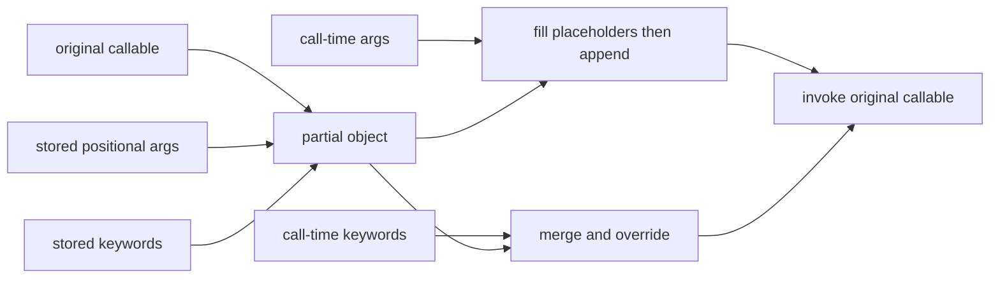

<TLDR>
  <TLDRCell label="what">
    `functools` provides higher-order tools for callables: bind arguments in advance, preserve wrapper metadata, fold inputs, and adapt comparison protocols to existing APIs.
  </TLDRCell>
  <TLDRCell label="when">
    Use it when an existing function nearly fits an interface but needs argument, metadata, or protocol adaptation; caching and single dispatch have dedicated topics.
  </TLDRCell>
  <TLDRCell label="how">
    Specify the final call signature and its empty-input, equality, and override rules before choosing `partial()`, `wraps()`, `reduce()`, or an ordering adapter.
  </TLDRCell>
</TLDR>

## What it is and why it exists

`functools` is the Python standard-library module for higher-order functions and callable objects. A <Term id="higher-order-function">higher-order function</Term> accepts functions, returns functions, or does both; these tools also work with other objects that implement the call protocol.

The tools solve small structural mismatches between interfaces. A callback slot may accept one argument while an existing function also needs a category; a decorator creates a new function, but inspection tools should still see the original interface; old code supplies a binary comparator while `sorted()` wants a key function. `functools` turns those adaptation rules into composable objects without copying the original function's logic.

This topic covers five related groups of adapters: `partial()` and `partialmethod()` bind arguments, `wraps()` and `update_wrapper()` maintain wrapper metadata, `reduce()` accumulates inputs, `cmp_to_key()` converts comparison protocols, and `total_ordering` fills in rich comparison methods. `cache`, `lru_cache`, and `cached_property` belong to cache design, while `singledispatch` belongs to runtime dispatch; dedicated related topics cover those APIs without duplicating an incomplete rule set here.

These tools don't define your business contract. `partial()` doesn't validate a bound value, `wraps()` doesn't prove that forwarding is correct, `reduce()` doesn't choose an identity for an empty input, and `cmp_to_key()` doesn't repair an inconsistent comparator. Define the target interface first, then choose an adapter.

### Tool map

| Tool | Object produced or changed | Critical contract |
| --- | --- | --- |
| `partial()` | New callable with pre-filled arguments | Call-time keywords can override stored keywords |
| `partialmethod()` | Descriptor stored as a class attribute | Instance binding must insert `self` correctly |
| `wraps()` | Wrapper function carrying original metadata | Metadata transparency isn't behavior transparency |
| `reduce()` | One final accumulated value | `initial` determines whether empty input is valid |
| `cmp_to_key()` | Key object wrapping comparison logic | The comparator returns negative, zero, or positive |
| `total_ordering` | Class with missing comparisons filled in | Equality and ordering must describe one relation |

## How it works

`partial(func, *args, **keywords)` stores a target callable and pre-filled arguments. When you call the resulting object, new positional arguments follow the stored positional arguments; new keywords merge with the stored keywords, and same-named call-time keywords win. This is <Term id="partial-application">partial application</Term>: it configures a call without executing `func` early.

Python 3.14 adds `functools.Placeholder`, which can reserve any position among the stored positional arguments. At the real call, positional arguments fill every placeholder from left to right before any remaining arguments are appended. A placeholder can't be supplied as a keyword value, and every placeholder must be filled.

`partialmethod()` handles the same configuration inside a class definition. It is a descriptor rather than an ordinary callable: on instance attribute access, it lets the underlying function perform method binding before applying stored arguments. Putting a plain `partial()` in a class body can make its stored argument collide with the position intended for `self`.

`update_wrapper(wrapper, wrapped)` assigns one selected set of attributes from the wrapped object and updates another selected set on the wrapper. By default it handles the name, qualified name, documentation, annotations, type parameters, and wrapper `__dict__`, and it sets `__wrapped__`. `wraps(wrapped)` is the decorator-shaped convenience form, with arguments pre-filled for `update_wrapper()`.

`reduce(function, iterable, initial)` calls a binary function from left to right. Each step passes the previous accumulator on the left and the next input item on the right; when supplied, `initial` comes before the input and is also the result for an empty input. Python 3.14 permits `initial` as a keyword, but the runnable example below passes it positionally so its output can be checked with the local Python 3.12 interpreter.

The ordering tools connect two different interfaces. A key function receives one item and returns a comparable projection; a <Term id="comparator">comparator</Term> receives two items and returns a negative number, zero, or a positive number for less than, equal, or greater than. `cmp_to_key()` wraps the latter for APIs that accept the former, chiefly for migration or integration with an existing comparison protocol.

Argument adaptation forms a merge pipeline:



The diagram describes call binding only. It doesn't cache results, copy mutable objects, or lock stored keywords; callers must implement and test those behaviors separately.

## Examples

The four examples progress through function configuration, method configuration, metadata maintenance, and reduction plus comparison adaptation. Every output shown came from running the file with local `python3`.

### Configure an event formatter

`format_event()` stays general while `invoice_event` fits a call site that supplies only an order number. The stored `compact=False` keyword can still be overridden by the real call.

<Depth level="quick">

```python run title="configured_event.py"
from functools import partial


def format_event(category, event_id, *, compact=False):
    separator = ":" if compact else " / "
    return f"{category}{separator}{event_id:04d}"


invoice_event = partial(format_event, "invoice", compact=False)

print(invoice_event(7))
print(invoice_event(7, compact=True))
print(invoice_event.func.__name__)
print(invoice_event.args)
print(invoice_event.keywords)
```

```text
invoice / 0007
invoice:0007
format_event
('invoice',)
{'compact': False}
```

<TryToBreak items={['make event_id a string', 'omit event_id', 'override compact again']} />

</Depth>

The `func`, `args`, and `keywords` attributes let inspection and debugging code see stored configuration. Application code should still use the public call interface instead of treating mutation of those diagnostic attributes as a dynamic reconfiguration API.

Overriding `compact` is specified behavior. If the value must be fixed, a partial object isn't an authorization boundary; enforce the rule in a named wrapper that doesn't expose the keyword, and test invalid calls.

### Configure methods in a class definition

`partialmethod()` lets two class attributes reuse one state-transition implementation. The underlying function still receives `self` as a normal instance method, before the stored state value.

```python run title="ticket_actions.py"
from functools import partialmethod


class Ticket:
    def __init__(self, ticket_id):
        self.ticket_id = ticket_id
        self.state = "open"

    def transition(self, new_state, *, audit=True):
        self.state = new_state
        return f"{self.ticket_id}: {new_state}, audit={audit}"

    resolve = partialmethod(transition, "resolved")
    reopen = partialmethod(transition, "open")


ticket = Ticket(42)
print(ticket.resolve())
print(ticket.reopen(audit=False))
print(ticket.state)
```

```text
42: resolved, audit=True
42: open, audit=False
open
```

`resolve` and `reopen` still behave like bound methods. A call can override a stored keyword, but the example stores positional `new_state`; passing another positional state conflicts with the function's argument count.

When each convenience method grows different validation, authorization, or side effects, explicit named methods usually read better. `partialmethod()` fits cases where argument configuration is genuinely the only difference.

### Preserve a decorator's inspectable interface

`@wraps(func)` points the wrapped name, signature, and `__wrapped__` chain back to the original function. The wrapper remains responsible for accepting and forwarding arguments correctly.

```python run title="role_decorator.py"
from functools import wraps
from inspect import signature, unwrap


def require_role(required_role):
    def decorate(func):
        @wraps(func)
        def wrapper(*args, **kwargs):
            role = kwargs.pop("role")
            if role != required_role:
                raise PermissionError("role not allowed")
            return func(*args, **kwargs)

        return wrapper

    return decorate


@require_role("admin")
def close_ticket(ticket_id: int, *, reason: str) -> str:
    return f"closed {ticket_id}: {reason}"


print(close_ticket.__name__)
print(signature(close_ticket))
print(close_ticket(42, reason="duplicate", role="admin"))
print(unwrap(close_ticket)(7, reason="spam"))
```

```text
close_ticket
(ticket_id: int, *, reason: str) -> str
closed 42: duplicate
closed 7: spam
```

`inspect.signature()` follows `__wrapped__` by default, so the output omits `role`, which the wrapper itself consumes. That is right for a transparent decorator, but this example actually extends the call protocol; a production API should document the difference or move identity into context instead of disguising it as part of the original signature.

`unwrap()` bypasses the wrapper, so it isn't an ordinary post-authorization call path. Tests can use it to inspect the original object; frameworks and application code should call the decorated public name.

### Reduce records and adapt an old comparator

`reduce()` constructs a summary from an explicit initial value, while `cmp_to_key()` lets `sorted()` consume an existing three-way comparator. Each adapter leaves the original function's responsibility visible.

```python run title="reduce_and_sort.py"
from functools import cmp_to_key, reduce


def add_record(summary, record):
    kinds, total = summary
    return kinds | {record["kind"]}, total + record["cents"]


records = [
    {"kind": "sale", "cents": 2400},
    {"kind": "refund", "cents": -450},
]
kinds, total = reduce(add_record, records, (set(), 0))

priority_order = {"high": 0, "normal": 1}


def compare_ticket(left, right):
    left_key = priority_order[left["priority"]], left["id"]
    right_key = priority_order[right["priority"]], right["id"]
    return (left_key > right_key) - (left_key < right_key)


tickets = [
    {"id": 9, "priority": "normal"},
    {"id": 5, "priority": "high"},
    {"id": 2, "priority": "high"},
]
ordered = sorted(tickets, key=cmp_to_key(compare_ticket))

print(f"kinds: {', '.join(sorted(kinds))}")
print(f"total: {total}")
print("order:", ", ".join(str(ticket["id"]) for ticket in ordered))
```

```text
kinds: refund, sale
total: 1950
order: 2, 5, 9
```

The `(set(), 0)` initial value defines both the accumulator shape and the result for empty input. `add_record()` returns a new tuple at every step; it doesn't quietly accumulate state in a caller-owned container.

If the rule can be expressed directly as `priority_order[ticket["priority"]], ticket["id"]`, a key function is shorter. `cmp_to_key()` is valuable for integrating an existing, tested comparator, not for rewriting simple key logic as pairwise comparisons.

## Pitfalls

### Treating stored keywords as locked configuration

> [!PITFALL]
> `partial(send, timeout=5)` doesn't lock `timeout`. If a caller runs `configured(timeout=30)`, the call-time keyword overrides the stored value.

**Fix:** distinguish a default from an enforced value. Use `partial()` for a default; for an enforced value, reject conflicting arguments in a named wrapper or remove the option from the calling interface entirely.

### Using `partial()` instead of `partialmethod()` in a class body

> [!PITFALL]
> A plain partial object doesn't bind an instance through the descriptor protocol like a function in a class body. Its stored positional argument may occupy the slot intended for `self`, and the bug often appears only on the first instance call.

**Fix:** use `partialmethod()` for method specialization in a class definition and test the resulting attribute through an instance. If the binding rule is hard to read from the signature, write a normal method that calls the shared implementation explicitly.

### Assuming `wraps()` fixes wrapper behavior

> [!PITFALL]
> `wraps()` copies metadata and establishes the `__wrapped__` chain, but it doesn't forward positional-only parameters, keyword-only parameters, return values, exceptions, or asynchronous execution for you. A wrapper with a correct name and signature can still swallow a result or finish timing too early.

**Fix:** test metadata and behavior separately. Exercise each argument shape, return value, and exception path; when decorating an async function, make the async wrapper perform `await` inside the intended boundary.

### Omitting the empty-input contract for `reduce()`

> [!PITFALL]
> Without `initial`, an empty iterable raises `TypeError`. Generated code often calls `reduce()` after filtering but tests only non-empty examples, so the first fully filtered production input triggers the failure.

**Fix:** pass a genuine identity explicitly and test empty input when the operation has one. If emptiness is invalid, raise a domain-specific error first; for sums, universal or existential checks, and sequence joining, prefer the corresponding built-in or a clear loop.

### Returning a Boolean from a comparator

> [!PITFALL]
> `return left < right` produces only `False` or `True`, numerically `0` or `1`, and never the negative result required for “less than.” Once wrapped by `cmp_to_key()`, equality and ordering blur together, and the result can look sorted without satisfying the contract.

**Fix:** compare canonical keys and return `(left_key > right_key) - (left_key < right_key)`, testing less than, equality, and greater than. If you can return a key directly, remove the comparator and adapter.

### Basing equality and ordering on different fields

> [!PITFALL]
> `total_ordering` fills in syntax from existing methods; it doesn't check that `__eq__()` and `__lt__()` are consistent. If equality uses only an identifier while ordering also uses time, two objects can be both equal and ordered.

**Fix:** derive equality and ordering from one canonical key and return `NotImplemented` for unsupported types. Test equal values, distinct values, and unrelated types across every relation; implement all methods manually only when profiling identifies generated comparisons as a relevant hotspot.

<Depth level="deep">

## Argument binding in detail

### Positional arguments and 3.14 placeholders

Without `Placeholder`, `partial()` can pre-fill only a leading run of positional arguments. For example, `partial(int, base=2)` stores a keyword, while `partial(pow, 2)` fixes the first positional argument to `2`. New positional arguments can only follow the stored positional arguments.

Python 3.14 `Placeholder` expands “fix a prefix” into “reserve any position.” If the stored arguments are `(_, 10, _)`, the first two call-time positional arguments replace the two `_` entries in order, and remaining arguments are appended. A call that can't fill every placeholder raises `TypeError`.

When `partial()` is applied to an existing partial object, new positional arguments fill old placeholders first. To leave a position unfilled, put another `Placeholder` in that position. Placeholders work only among positional arguments; using one as a keyword value doesn't create a fillable slot.

This feature lets a compact expression carry more positional meaning. If readers must count argument positions to understand a public API, a named wrapper is usually safer and gives validation and error messages explicit names.

### Keyword overrides and mutable objects

A partial's stored keywords behave like default configuration, not immutable policy. Same-named call-time keywords replace stored values, while other keywords merge. Tests should actively supply every sensitive keyword and confirm whether overriding is accepted, rejected, or rewritten by a wrapper.

Binding a mutable object doesn't copy it. If `partial(render, options)` stores a dictionary and code later mutates that same dictionary, the next call sees the new contents. Copy explicitly when creation-time snapshot semantics are required, and state whether a shallow copy is enough; if live shared configuration is intended, document its ownership.

Partial objects expose `func`, `args`, and `keywords` for diagnosing stored configuration. Don't make direct mutation of the `keywords` dictionary your ordinary reconfiguration protocol; a new partial or a named configuration object gives validation and lifetime clearer boundaries.

### Partial signatures and metadata

`inspect.signature()` can derive the remaining parameters of an ordinary partial, so debuggers can usually display its configured call shape. A partial doesn't automatically acquire the original function's `__name__` and documentation metadata; it is a separate callable with `func`, `args`, and `keywords`, not a closure function.

You can use `update_wrapper()` on wrapper objects with writable attributes, but understand what `__wrapped__` claims. If you directly mark a partial as wrapping its original function, `inspect.signature()` follows the chain by default and displays the original unbound signature, potentially hiding the already-filled arguments. Public metadata should describe the real call protocol instead of copying every attribute mechanically.

## Metadata, descriptors, and generated comparisons

### The boundary of `wraps()`

In Python 3.14, the attributes assigned by default include `__module__`, `__name__`, `__qualname__`, `__annotations__`, `__type_params__`, and `__doc__`. The wrapper's `__dict__` is updated from the wrapped object by default, and `__wrapped__` explicitly points to that object.

A missing assigned attribute on the wrapped object is ignored, but `update_wrapper()` may raise `AttributeError` when the wrapper lacks an attribute that must be updated. That is why the function supports many callables without guaranteeing that every pair of arbitrary objects is writable.

`__wrapped__` is an inspection protocol, not a security boundary. It enables signature inspection, unwrapping, and rewrapping, which also means code holding the wrapper can ordinarily reach the original callable. Authorization, rate limiting, and auditing must not depend on callers being unable to find it.

When a decorator changes the real call signature, copying the original signature can mislead signature-driven frameworks. A transparent decorator should preserve behavior fully; a decorator that expands or narrows arguments should publish its new interface and verify whether the framework reads `__wrapped__`, `__signature__`, or the wrapper's own parameters.

### The `partialmethod()` descriptor path

Normal functions implement the descriptor protocol. When `partialmethod()` wraps a function, `classmethod()`, `staticmethod()`, `abstractmethod()`, or another `partialmethod()`, it delegates `__get__` to the underlying descriptor and then returns an appropriate partial object.

If the underlying object is callable but not a descriptor, `partialmethod()` dynamically creates a bound method. In that case `self` is still inserted before the `args` and `keywords` supplied to the `partialmethod()` constructor. This ordering rule explains why the tool isn't equivalent to putting `partial()` in a class body.

Class access and instance access produce different objects as a normal consequence of descriptors. Test a method specialization by retrieving and calling it from an instance; inspecting only the `partialmethod` object in the class dictionary doesn't verify instance binding.

### What `total_ordering` generates

A class should define `__eq__()` and at least one of `__lt__()`, `__le__()`, `__gt__()`, or `__ge__()`. `total_ordering` derives missing methods from an existing ordering method, but it doesn't replace methods declared on the class or a superclass, even when an inherited method is abstract.

The decorator doesn't generate a consistency proof. A robust implementation commonly builds one canonical comparison key and compares that key in both `__eq__()` and the base ordering method; for unsupported types, return `NotImplemented` so Python can try the reflected operation or choose the appropriate result.

Generated methods add a call layer and another stack frame. Don't turn that fact into a universal performance ratio; profile with application inputs first. If comparisons account for relevant cost, implement the required methods directly while retaining the same canonical key and test matrix.

## Reduction and ordering contracts

### `initial` defines empty-input semantics

With `initial`, reduction behaves as though that value came before the input sequence. An empty input returns `initial`, and a one-item input still invokes the binary function once. Without `initial`, the first item becomes the accumulator; an empty input has no first item and raises `TypeError`.

The initial value must satisfy the accumulator contract, not merely look like a default. Passing `0` to a function that accumulates dictionaries fails on the first step; passing a shared list and mutating it in place can leak state across calls. Prefer immutable initial values or construct a fresh mutable container for each operation.

Python 3.14 supports `reduce(function, iterable, initial=value)`. A library that also supports 3.13 or earlier should keep passing the third argument positionally or raise its minimum version explicitly; generated code can't assume deployment has upgraded merely because the target documentation is 3.14.

`itertools.accumulate()` and `reduce()` expose different observations. The former yields every intermediate accumulated value, while the latter returns only the final value. When you need progress, auditing, or early exit, an explicit loop is often clearer than placing side effects in a binary reducer.

### A comparator must define a stable relation

A three-way comparator should return zero for an equal pair, reverse its sign when the arguments swap, and satisfy transitivity. A comparator that reads current time, randomness, or call count can violate those properties; its sort result may be unstable, and a single example is unlikely to reproduce the defect.

Objects created by `cmp_to_key()` call the original comparator from their rich comparison methods. This suits an existing protocol such as `locale.strcoll` or a legacy interface under migration. For new code that can calculate a stable key, a direct key function usually makes equality, priority, and tie-break fields easier to review.

Equal sort keys don't make objects equal in the business domain. A stable sort preserves the original relative order of equal-key items, while `total_ordering` defines comparison semantics on the objects themselves. Don't merge those contracts merely because both participate in ordering.

</Depth>

<Checkpoint id="python/functools" />

## Further reading

- [Python 3.14 `functools` module](https://docs.python.org/3.14/library/functools.html)
- [Python 3.14 `partial()` and `Placeholder`](https://docs.python.org/3.14/library/functools.html#functools.partial)
- [Python 3.14 `wraps()` and `update_wrapper()`](https://docs.python.org/3.14/library/functools.html#functools.wraps)
- [Python 3.14 `reduce()`](https://docs.python.org/3.14/library/functools.html#functools.reduce)
- [Python Sorting HOWTO: comparison functions](https://docs.python.org/3.14/howto/sorting.html#comparison-functions)
