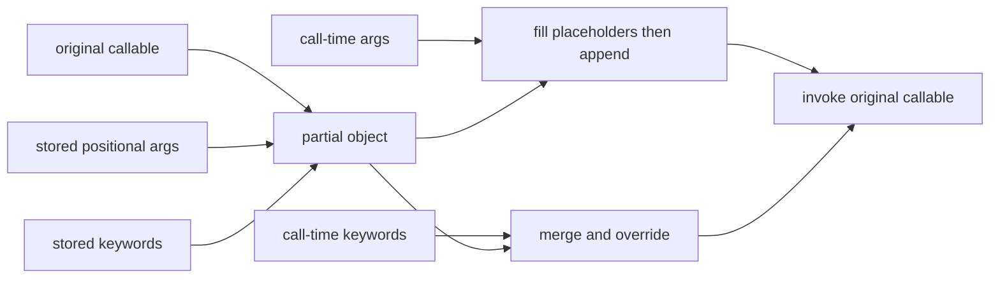

<TLDR>
  <TLDRCell label="what">
    `functools` 提供操作可调用对象的高阶工具：预先绑定参数、保留包装器元数据、折叠输入，以及把比较协议接入现有 API。
  </TLDRCell>
  <TLDRCell label="when">
    当已有函数几乎符合目标接口，只差一部分参数、元数据或协议适配时使用它；缓存与单分派分别由专门主题讲解。
  </TLDRCell>
  <TLDRCell label="how">
    先写清最终调用签名与空输入、相等性、覆盖规则，再选择 `partial()`、`wraps()`、`reduce()` 或排序适配器。
  </TLDRCell>
</TLDR>

## 是什么，为什么存在

`functools` 是 Python 标准库中面向高阶函数（<Term id="higher-order-function">higher-order function</Term>）和可调用对象的模块。高阶函数接收函数、返回函数，或者两者兼有；模块中的工具也适用于实现了调用协议的其他对象。

这组工具解决的是接口之间的小型结构差异。某个回调槽只接受一个实参，而现有函数还需要类别；装饰器创建了新函数，但检查工具仍应看到原接口；旧代码提供二元比较函数，而 `sorted()` 需要键函数。`functools` 把这些适配规则做成可组合对象，不要求复制原函数逻辑。

本文集中讲五组彼此相关的适配器：`partial()` 与 `partialmethod()` 绑定实参，`wraps()` 与 `update_wrapper()` 维护包装器元数据，`reduce()` 累积输入，`cmp_to_key()` 转换比较协议，`total_ordering` 补齐富比较方法。`cache`、`lru_cache` 与 `cached_property` 属于缓存设计，`singledispatch` 属于运行时分派；它们分别放在相关主题中，避免在模块概览里重复一套不完整规则。

这些工具不会替你定义业务契约。`partial()` 不会验证被绑定的值，`wraps()` 不会证明包装器转发正确，`reduce()` 不会替空输入选择单位元，`cmp_to_key()` 也不会修复不一致的比较函数。先确定目标接口，再决定适配器，通常比从工具名称反推用途更可靠。

### 工具地图

| 工具 | 产生或修改的对象 | 关键契约 |
| --- | --- | --- |
| `partial()` | 带预填实参的新可调用对象 | 调用时的关键字可覆盖预填关键字 |
| `partialmethod()` | 类属性上的描述符 | 实例绑定必须先正确插入 `self` |
| `wraps()` | 带原函数元数据的包装函数 | 元数据透明不等于行为透明 |
| `reduce()` | 一个最终累积值 | 空输入是否有效由 `initial` 决定 |
| `cmp_to_key()` | 包装比较逻辑的键对象 | 比较函数必须返回负数、零或正数 |
| `total_ordering` | 补齐比较方法的类 | 相等与排序必须描述同一关系 |

## 工作原理

`partial(func, *args, **keywords)` 保存目标可调用对象与一组预填实参。调用所得对象时，新的位置实参接在已保存的位置实参之后；新的关键字与已保存关键字合并，且调用时的同名关键字优先。这个过程叫偏应用（<Term id="partial-application">partial application</Term>），它配置调用，不会提前执行 `func`。

Python 3.14 新增的 `functools.Placeholder` 可以在已保存的位置实参中预留任意位置。真正调用时，位置实参先从左到右填满所有占位符，其余位置实参再追加到末尾。占位符不能作为关键字值，而且每个占位符都必须被填充。

`partialmethod()` 解决相同配置出现在类定义中的情况。它是描述符而不是普通可调用对象；访问实例属性时，它先让底层函数完成方法绑定，再应用预填实参。若把普通 `partial()` 直接放进类体，`self` 的位置很容易与预填参数发生冲突。

`update_wrapper(wrapper, wrapped)` 把一组选定属性从被包装对象复制到包装对象，并更新另一组选定属性。默认会处理名称、限定名、文档、注解、类型形参和包装器的 `__dict__`，还会设置 `__wrapped__`。`wraps(wrapped)` 是适合写在包装函数上的便捷装饰器，本质上为 `update_wrapper()` 预填了参数。

`reduce(function, iterable, initial)` 从左到右调用二元函数。每一步都把上一次的累积值作为左实参，把下一个输入元素作为右实参；若提供 `initial`，它位于整条归约链最前面，也是空输入的结果。Python 3.14 允许把 `initial` 写成关键字，但本文的可运行示例用位置形式，以便在本地 Python 3.12 上核对输出。

排序工具处理两类不同接口。键函数每次接收一个元素并返回可比较的投影；<Term id="comparator">比较函数（comparator）</Term>每次接收两个元素，并以负数、零、正数表示小于、等于、大于。`cmp_to_key()` 把后一种接口包装成前一种 API 可以接受的对象，主要用于迁移或接入已有比较协议。

参数适配的流程可以画成一条合并管道：



这张图只描述调用绑定。它没有缓存结果、复制可变对象或锁定预填关键字；这些行为都需要调用方另行实现和测试。

## 示例

四个示例依次展示函数配置、方法配置、元数据维护，以及归约与比较协议适配。每段输出都来自本地 `python3` 实际执行。

### 配置一个事件格式化函数

`format_event()` 保持通用，`invoice_event` 则符合只需订单号的调用点。预填关键字 `compact=False` 仍可在真正调用时覆盖。

<Depth level="quick">

```python run title="configured_event.py"
from functools import partial


def format_event(category, event_id, *, compact=False):
    separator = ":" if compact else " / "
    return f"{category}{separator}{event_id:04d}"


invoice_event = partial(format_event, "invoice", compact=False)

print(invoice_event(7))
print(invoice_event(7, compact=True))
print(invoice_event.func.__name__)
print(invoice_event.args)
print(invoice_event.keywords)
```

```text
invoice / 0007
invoice:0007
format_event
('invoice',)
{'compact': False}
```

<TryToBreak items={['把 event_id 改成字符串', '省略 event_id', '再次覆盖 compact']} />

</Depth>

`func`、`args` 与 `keywords` 让检查工具和调试代码看到偏函数保存的配置。业务代码仍应通过公开调用接口使用它，不要依赖修改这些诊断属性来动态重配行为。

调用方覆盖 `compact` 是明确的标准行为。如果该值必须固定，偏函数不是权限边界；应在不暴露该关键字的具名包装函数中强制规则，并为错误调用编写测试。

### 在类定义中配置方法

`partialmethod()` 让两个类属性复用同一个状态转换实现。底层函数仍按普通实例方法接收 `self`，预填的状态位于它之后。

```python run title="ticket_actions.py"
from functools import partialmethod


class Ticket:
    def __init__(self, ticket_id):
        self.ticket_id = ticket_id
        self.state = "open"

    def transition(self, new_state, *, audit=True):
        self.state = new_state
        return f"{self.ticket_id}: {new_state}, audit={audit}"

    resolve = partialmethod(transition, "resolved")
    reopen = partialmethod(transition, "open")


ticket = Ticket(42)
print(ticket.resolve())
print(ticket.reopen(audit=False))
print(ticket.state)
```

```text
42: resolved, audit=True
42: open, audit=False
open
```

`resolve` 与 `reopen` 仍表现为绑定方法。调用时可以覆盖预填关键字，但这里预填的是位置参数 `new_state`，额外再传一个位置状态会因为实参数量冲突而失败。

当每个便捷方法还要执行不同校验、授权或副作用时，直接写具名方法通常更清楚。`partialmethod()` 适合差异确实只有参数配置的情况，不适合隐藏逐渐分叉的业务流程。

### 保留装饰器的可检查接口

`@wraps(func)` 让包装后的名称、签名和 `__wrapped__` 链指回原函数。包装器依然负责正确接收并转发实参。

```python run title="role_decorator.py"
from functools import wraps
from inspect import signature, unwrap


def require_role(required_role):
    def decorate(func):
        @wraps(func)
        def wrapper(*args, **kwargs):
            role = kwargs.pop("role")
            if role != required_role:
                raise PermissionError("role not allowed")
            return func(*args, **kwargs)

        return wrapper

    return decorate


@require_role("admin")
def close_ticket(ticket_id: int, *, reason: str) -> str:
    return f"closed {ticket_id}: {reason}"


print(close_ticket.__name__)
print(signature(close_ticket))
print(close_ticket(42, reason="duplicate", role="admin"))
print(unwrap(close_ticket)(7, reason="spam"))
```

```text
close_ticket
(ticket_id: int, *, reason: str) -> str
closed 42: duplicate
closed 7: spam
```

`inspect.signature()` 默认沿 `__wrapped__` 查看原接口，所以输出没有包装器自己消费的 `role`。这对透明装饰器很合适，但此示例实际扩展了调用协议；生产 API 应明确记录这项差异，或者把身份信息移到上下文而不是伪装成原签名的一部分。

`unwrap()` 会绕过包装层，因此不能作为授权后的普通调用路径。测试可用它核对原对象，框架和业务代码则应调用装饰后的公开名称。

### 归约记录并适配旧比较函数

`reduce()` 用显式初始值构造统计结果，`cmp_to_key()` 则把现有的三路比较函数交给 `sorted()`。两个适配器都保留原函数的职责边界。

```python run title="reduce_and_sort.py"
from functools import cmp_to_key, reduce


def add_record(summary, record):
    kinds, total = summary
    return kinds | {record["kind"]}, total + record["cents"]


records = [
    {"kind": "sale", "cents": 2400},
    {"kind": "refund", "cents": -450},
]
kinds, total = reduce(add_record, records, (set(), 0))

priority_order = {"high": 0, "normal": 1}


def compare_ticket(left, right):
    left_key = priority_order[left["priority"]], left["id"]
    right_key = priority_order[right["priority"]], right["id"]
    return (left_key > right_key) - (left_key < right_key)


tickets = [
    {"id": 9, "priority": "normal"},
    {"id": 5, "priority": "high"},
    {"id": 2, "priority": "high"},
]
ordered = sorted(tickets, key=cmp_to_key(compare_ticket))

print(f"kinds: {', '.join(sorted(kinds))}")
print(f"total: {total}")
print("order:", ", ".join(str(ticket["id"]) for ticket in ordered))
```

```text
kinds: refund, sale
total: 1950
order: 2, 5, 9
```

初始值 `(set(), 0)` 同时定义累积器形状和空输入结果。`add_record()` 每一步都返回新元组；它没有在调用方传入的容器上偷偷积累状态。

若比较规则可以直接表示为 `priority_order[ticket["priority"]], ticket["id"]`，直接写键函数更短。`cmp_to_key()` 的价值在于接入已经存在且经过测试的比较函数，而不是把本来简单的键逻辑改写成两两比较。

## 陷阱

### 把预填关键字当成不可覆盖配置

> [!PITFALL]
> `partial(send, timeout=5)` 并没有锁定 `timeout`。调用方执行 `configured(timeout=30)` 时，调用时关键字会覆盖保存的值。

**修复：** 明确默认值与强制值的区别。默认值可以使用 `partial()`；强制值应由具名包装器在转发前拒绝冲突实参，或从调用接口中完全移除该选项。

### 在类体中用 `partial()` 代替 `partialmethod()`

> [!PITFALL]
> 普通 `partial` 对象不会像类体中的函数那样通过描述符协议自动绑定实例。预填位置实参可能占据原本属于 `self` 的位置，错误往往直到第一次实例调用才出现。

**修复：** 类定义中的方法特化使用 `partialmethod()`，并通过实例测试所得属性。若绑定规则已经难以从签名读出，写一个普通方法，显式调用共享实现。

### 认为 `wraps()` 会修复包装器行为

> [!PITFALL]
> `wraps()` 可以复制元数据并建立 `__wrapped__` 链，却不会自动转发仅限位置参数、仅限关键字参数、返回值、异常或异步执行。一个名称与签名都正确的包装器仍可能吞掉结果或过早结束计时。

**修复：** 把元数据检查与行为检查分开。对包装器测试原函数的各种参数形状、返回值、异常路径；装饰异步函数时，确保异步包装器在正确边界内执行 `await`。

### 省略 `reduce()` 的空输入契约

> [!PITFALL]
> 没有 `initial` 时，空可迭代对象会抛出 `TypeError`。生成代码常在过滤后调用 `reduce()`，却只用非空样例测试，因此生产数据第一次过滤为空时才失败。

**修复：** 若运算存在真实单位元，显式传入它，并测试空输入。若空输入应是错误，提前给出领域化错误；若意图只是求和、全真、任一为真或连接序列，优先使用对应内置函数或清晰循环。

### 返回布尔值的比较函数

> [!PITFALL]
> `return left < right` 只会得到 `False` 或 `True`，也就是 `0` 或 `1`，没有表达「小于」所需的负数。经 `cmp_to_key()` 包装后，相等与顺序会混在一起，结果可能貌似有序但不满足契约。

**修复：** 比较等价键，并返回 `(left_key > right_key) - (left_key < right_key)`，同时测试小于、相等和大于三种情况。能直接返回键时，省掉比较函数和适配层。

### 让相等与排序依据不同字段

> [!PITFALL]
> `total_ordering` 只根据已有方法补齐语法，不会检查 `__eq__()` 与 `__lt__()` 是否一致。若相等只看编号，而排序还看时间，两个对象可能既相等又有先后关系。

**修复：** 让相等与排序从同一规范键导出，对不支持的类型返回 `NotImplemented`。用相同值、不同值和不相关类型验证所有比较关系，并在分析表明生成方法是热点时再考虑手写全部方法。

## AI 时代

**生成代码在这里常犯什么错**

模型常把 `partial(client.request, timeout=5)` 描述成强制超时，却保留调用方覆盖通道；也会在目标运行时仍是 Python 3.13 时导入 3.14 才有的 `Placeholder`，或者错误地把占位符放进关键字实参。包装器代码可能加了 `@wraps` 就宣称完全透明，实际却删除关键字、漏掉返回值，或用同步函数包装协程。数据处理代码则常在可能为空的筛选结果上省略 `reduce()` 初始值，比较器还会误返回布尔值。

**要求 AI 检查**

- 展开每个 `partial` 的最终调用，列出保存实参、调用时实参、覆盖后的关键字，以及所有 `Placeholder` 的填充位置。
- 对每个包装器分别核对运行时转发与元数据链，并用 `inspect.signature()`、成功、异常和异步路径验证。
- 给出 `reduce()` 的空输入结果，并用小于、相等、大于三个样例验证比较函数的符号与传递性。

**审查清单**

- 目标 Python 版本支持所有导入的 `functools` 名称，尤其是 3.14 的 `Placeholder` 和 `reduce(initial=...)`。
- 预填参数的覆盖规则符合权限与配置契约，可变对象没有因绑定而被误认为快照。
- 空输入、重复排序键、不支持的比较类型和包装器异常路径都有测试。

**提示词词汇**

使用精确术语 `higher-order function`（高阶函数）、`partial application`（偏应用）、`call-time keyword override`（调用时关键字覆盖）、`Placeholder filling`（占位符填充）、`descriptor binding`（描述符绑定）、`wrapper metadata`（包装器元数据）、`reduction initializer`（归约初始值）、`three-way comparator`（三路比较函数）和 `rich comparison`（富比较）。要求模型展开最终调用签名与边界输入；只说「简化这个函数」无法暴露绑定规则。

<Depth level="deep">

## 深入理解参数绑定

### 位置参数与 3.14 占位符

没有 `Placeholder` 时，`partial()` 只能预填一段领先的位置实参。例如，`partial(int, base=2)` 预填的是关键字，而 `partial(pow, 2)` 把第一个位置参数固定为 `2`。调用时新增的位置实参只会接在已保存位置实参之后。

Python 3.14 的 `Placeholder` 把「只能固定前缀」扩展为「可以预留任意位置」。若保存实参是 `(_, 10, _)`，调用时的前两个位置实参按顺序替换两个 `_`，剩余实参继续追加。实参不足以填满全部占位符时，调用抛出 `TypeError`。

对已有偏函数再次调用 `partial()` 时，新位置实参会先填充旧占位符。若要保留某个位置继续待填，需要在该位置再次放入 `Placeholder`。占位符只能出现在位置实参中；把它作为关键字值并不表示待填槽位。

这项功能会让紧凑表达式承载更多位置语义。公共 API 中若读者需要数参数位置才能理解调用，具名包装函数通常更稳妥；它还能给各项校验和错误消息明确命名。

### 关键字覆盖与可变对象

偏函数保存的关键字像默认配置，而不是不可变策略。调用时同名关键字覆盖保存值，其他关键字继续合并。测试不应只检查默认调用，还应主动传入每个敏感关键字，确认覆盖是允许、拒绝还是被包装器重写。

绑定可变对象不会复制它。若 `partial(render, options)` 保存了字典，后来修改同一个字典，偏函数下次调用会看到新内容。需要创建时快照就显式复制，并说明浅复制是否足够；需要共享实时配置则把共享所有权写进接口说明。

偏函数公开 `func`、`args` 与 `keywords`，适合诊断已保存配置。不要把直接修改 `keywords` 字典当作常规重配置协议；建立新的偏函数或提供具名配置对象，能让验证和生命周期更清楚。

### 偏函数的签名与元数据

`inspect.signature()` 能根据普通偏函数推导剩余参数，因此调试器通常可以看到配置后的调用形状。偏函数不会自动获得原函数的 `__name__` 与文档元数据；它是带 `func`、`args` 和 `keywords` 的独立可调用对象，不是闭包函数。

可以对可写属性的包装对象使用 `update_wrapper()`，但要理解 `__wrapped__` 的含义。若直接把偏函数标成原函数的包装器，`inspect.signature()` 默认沿链显示原始未绑定签名，可能反而遮住已经预填的参数。公开接口应选择最能描述真实调用协议的元数据，而不是机械复制全部属性。

## 元数据、描述符与比较生成

### `wraps()` 的边界

Python 3.14 中，默认直接赋值的属性包括 `__module__`、`__name__`、`__qualname__`、`__annotations__`、`__type_params__` 与 `__doc__`。包装器的 `__dict__` 默认会用被包装对象的字典更新，而 `__wrapped__` 明确指向被包装对象。

缺少被复制属性的被包装对象不会因此失败，但包装对象若缺少需要更新的属性，`update_wrapper()` 可能抛出 `AttributeError`。这就是它能用于多种可调用对象，却不能保证任意对象组合都可写的原因。

`__wrapped__` 是检查协议，不是安全边界。它方便签名检查、解包和重新包装，也意味着能拿到包装对象的代码通常可以访问原可调用对象。授权、速率限制或审计不能依赖「调用方找不到原函数」。

装饰器改变实际调用签名时，复制原签名可能误导依赖签名的框架。透明装饰器应完整保持行为；扩展或缩减参数的装饰器应显式公布新接口，并检查框架究竟读取 `__wrapped__`、`__signature__` 还是包装器自身参数。

### `partialmethod()` 的描述符路径

普通函数本身实现描述符协议。`partialmethod()` 包装函数、`classmethod()`、`staticmethod()`、`abstractmethod()` 或另一个 `partialmethod()` 时，会把 `__get__` 委托给底层描述符，再返回适当的偏函数对象。

底层对象若只是可调用但不是描述符，`partialmethod()` 会动态创建绑定方法。此时 `self` 仍插在构造 `partialmethod()` 时提供的 `args` 与 `keywords` 之前。这条顺序规则解释了它为什么不是简单地在类体里调用 `partial()`。

从类访问与从实例访问得到的对象不同，是描述符的正常表现。测试方法特化时，要从实例取属性并调用；只检查类字典里的 `partialmethod` 对象无法验证实例绑定是否符合预期。

### `total_ordering` 生成什么

类应定义 `__eq__()`，并至少定义 `__lt__()`、`__le__()`、`__gt__()`、`__ge__()` 之一。`total_ordering` 依据已有排序方法生成缺少的方法，但不会覆盖类或父类已经声明的方法，即使继承来的方法是抽象方法。

装饰器不会生成一致性证明。最稳妥的实现通常先构造一个规范比较键，让 `__eq__()` 与基础排序方法都比较该键；遇到不支持的类型时返回 `NotImplemented`，让 Python 有机会尝试反射操作或给出合适结果。

生成的方法会增加一层调用与栈轨迹。不要据此编造通用性能比例；先用应用自己的输入分析热点。若比较确实占据可观成本，再手写所需方法并保持同一规范键和测试矩阵。

## 归约与顺序契约

### `initial` 决定空输入语义

有 `initial` 时，归约等价于先把它放在输入序列之前。空输入直接返回 `initial`，单元素输入也会先调用一次二元函数。没有 `initial` 时，首个元素成为累积值；空输入没有可用首项，因此抛出 `TypeError`。

初始值必须符合累积器契约，而不只是看起来像一个默认值。把 `0` 传给累积字典的函数会在第一步失败；把共享列表作为初始值并原地修改，可能让状态跨调用泄漏。优先使用不可变初始值，或在每次调用前创建新的可变容器。

Python 3.14 支持 `reduce(function, iterable, initial=value)`。如果库需要兼容 3.13 及更早版本，应继续传第三个位置实参，或者明确提高最低版本；生成代码不能只因为目标文档是 3.14 就假定部署环境已经升级。

`itertools.accumulate()` 与 `reduce()` 的观察面不同。前者逐步产出每个中间累积值，后者只返回最终值。需要进度、审计或提前停止时，显式循环往往比把副作用塞进二元归约函数更清楚。

### 比较函数必须形成稳定关系

三路比较函数对同一对相等值应返回零，交换实参后符号应反转，传递关系也应成立。依赖当前时间、随机数或调用次数的比较器会破坏这些性质；排序结果可能不稳定，问题也很难用单个样例复现。

`cmp_to_key()` 创建的包装对象通过富比较方法调用原比较器。它适合 `locale.strcoll` 一类现成协议或迁移中的旧接口。新代码若能计算稳定键，直接键函数通常让相等、优先级与后备排序字段更容易审查。

排序键相同不代表对象在业务上相等。稳定排序会保留相同键元素的原相对次序，但 `total_ordering` 定义的是对象比较语义。不要因为两者都参与排序，就把键函数与 `__eq__()` 的领域契约混为一谈。

</Depth>

<Checkpoint id="python/functools" />

## 延伸阅读

- [Python 3.14 `functools` 模块](https://docs.python.org/3.14/library/functools.html)
- [Python 3.14 `partial()` 与 `Placeholder`](https://docs.python.org/3.14/library/functools.html#functools.partial)
- [Python 3.14 `wraps()` 与 `update_wrapper()`](https://docs.python.org/3.14/library/functools.html#functools.wraps)
- [Python 3.14 `reduce()`](https://docs.python.org/3.14/library/functools.html#functools.reduce)
- [Python 排序指南：比较函数](https://docs.python.org/3.14/howto/sorting.html#comparison-functions)
