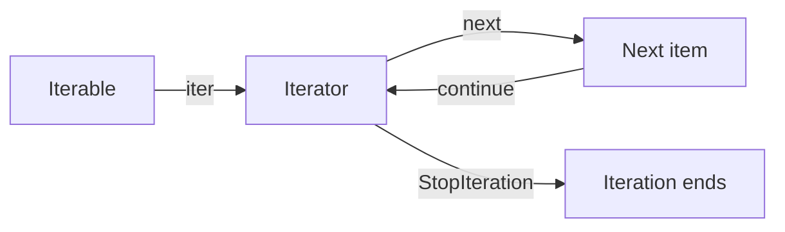

<TLDR>
  <TLDRCell label="what">
    An <Term id="iterable">iterable</Term> can provide an iterator; an iterator produces one item per `__next__()` call. A function containing `yield` creates a Python-managed kind of iterator called a generator.
  </TLDRCell>
  <TLDRCell label="trap">
    An iterator can usually move forward only once. Debug output, membership tests, or a second consumer can take data early, while an early exit can leave a generator-owned resource open.
  </TLDRCell>
  <TLDRCell label="fix">
    Distinguish restartable sources from single-pass iterators, and document who consumes and closes them. End a generator with `return`, and release its resources in `finally`.
  </TLDRCell>
</TLDR>

## What it is and why it exists

The <Term id="iterator-protocol">iterator protocol</Term> is Python's common interface for reading data one item at a time. An iterable's `__iter__()` returns an iterator, and an iterator's `__next__()` returns the next item. When no item remains, `__next__()` raises `StopIteration`. `for`, comprehensions, `sum()`, `zip()`, and many standard-library APIs all use this protocol.

Iterable and iterator aren't synonyms. Lists, tuples, and `range` usually let you call `iter()` several times to get fresh, independent iterators. File objects, generator objects, and many streaming cursors are their own iterators: `iter(obj) is obj`, and consumption doesn't automatically rewind them.

A generator is one way to implement an iterator. A generator function uses `yield` to produce values, while Python saves its suspension point, local variables, and exception-handling state. Calling the function only creates a generator object; its body doesn't run until the first `next()` call.

Generators solve a control-flow and state-storage problem. The producer can pause after one item and the consumer decides when to continue, so the producer doesn't need to build a complete list first. This <Term id="lazy-evaluation">lazy evaluation</Term> works well for line-by-line reading, transformation pipelines, paginated results, and potentially infinite sequences. It also lets downstream code stop after finding what it needs.

Lazy doesn't mean automatically faster or permanently small. A pipeline stage that calls `list()`, `sorted()`, or performs whole-input grouping still materializes its input. When consumers of `itertools.tee()` drift far apart, it must also cache items the slower side hasn't read. Judge the data flow by ownership and consumption, not by treating generators as a universal optimization switch.

## How it works

`for item in source` first evaluates `source`, then calls `iter(source)` once. The loop repeatedly calls `next(iterator)` and binds each result to `item`; it ends normally when it receives `StopIteration`. Other exceptions raised by the loop body aren't swallowed by the protocol.



An iterator must return itself from `__iter__()`. Code accepting any iterable can therefore call `iter()` uniformly without losing the current position when it was already given an iterator. A custom container usually creates a fresh iterator on each `__iter__()` call instead, allowing independent loops.

Calling a generator function differs from calling an ordinary function. The call creates a generator object. The first `next()` runs to the first `yield`, hands its right-hand value to the caller, and suspends. The next `next()` resumes just after that point with the saved local variables intact.

A generator ends when execution reaches the bottom of the function or runs `return`. At the protocol level, `StopIteration` reports that end. `return value` puts `value` in the exception's `value` attribute; an ordinary `for` loop treats it only as an end signal and doesn't emit that return value as an item.

| Object or operation | Protocol meaning | Usual property |
| --- | --- | --- |
| `iterable.__iter__()` | Returns an iterator | May return a fresh object each time |
| `iterator.__iter__()` | Returns the iterator itself | Preserves the current position |
| `iterator.__next__()` | Returns an item or raises `StopIteration` | Advances state |
| `yield value` | Produces a value and suspends the frame | Continues when resumed |
| `return value` | Ends the generator | Value enters `StopIteration.value` |

A generator is also a closeable state machine. `close()` throws `GeneratorExit` at the suspension point, giving `finally` a chance to run. If the generator catches that close signal and yields again, `close()` raises `RuntimeError`. Whether an early-stopping caller closes the generator must be an explicit ownership contract.

## Examples

These four examples build from the protocol to lazy execution, delegation, and early cleanup. Every output shown came from running the corresponding file with local `python3`.

### A single-pass countdown iterator

`Countdown` is both an iterable and an iterator. The instance holds its current position, so a second traversal sees only what remains and gets an empty result after exhaustion.

<Depth level="quick">

```python run title="iterator_protocol.py"
class Countdown:
    def __init__(self, start):
        self.current = start

    def __iter__(self):
        return self

    def __next__(self):
        if self.current <= 0:
            raise StopIteration
        value = self.current
        self.current -= 1
        return value


countdown = Countdown(3)
print(iter(countdown) is countdown)
print(next(countdown))
print(list(countdown))
print(list(countdown))
```

```text
True
3
[2, 1]
[]
```

<TryToBreak items={['start at 0', 'call next() after exhaustion', 'share one instance between two loops']} />

</Depth>

`list(countdown)` doesn't create a new countdown; it continues from the current value of `2`. The final `list()` calls `iter(countdown)` again, but receives the same exhausted object.

If each loop should restart from `start`, separate the iterable from its cursor state. A container's `__iter__()` can return a new `Countdown` or a generator. Don't silently reset state inside an iterator's `__iter__()` because that breaks the meaning of nested loops and partial consumption.

### Seeing when a generator runs

`discounted_orders()` doesn't read orders when it's created. Each request for an item resumes scanning until it produces one qualifying result or exhausts the input.

```python run title="lazy_pipeline.py"
def discounted_orders(rows):
    print("pipeline started")
    for order_id, total in rows:
        print(f"reading {order_id}")
        if total >= 100:
            yield f"{order_id}:{total * 90 // 100}"


source = [("A-17", 120), ("B-02", 80), ("C-99", 200)]
discounts = discounted_orders(source)

print("created")
print(next(discounts))
print(list(discounts))
print(list(discounts))
```

```text
created
pipeline started
reading A-17
A-17:108
reading B-02
reading C-99
['C-99:180']
[]
```

`"created"` appears before `"pipeline started"`, showing that calling the generator function didn't run its body. The first `next()` reads only far enough to produce `A-17`. The following `list()` scans the other two records.

The generator shares consumption progress with its input. If `rows` is itself an iterator, alternating reads between the producer and caller takes data away from each other. With multiple consumers, decide whether to recreate the source, materialize a snapshot, broadcast explicitly, or accept a single owner.

### Delegating and receiving a return value

`yield from` isn't merely shorthand for a one-level `for`. It delegates iteration to a subgenerator and receives that generator's `return` value when the subgenerator ends.

```python run title="partition_export.py"
def read_partition(name, values):
    count = 0
    for value in values:
        count += 1
        yield f"{name}:{value}"
    return count


def export_rows():
    west_count = yield from read_partition("west", [10, 20])
    east_count = yield from read_partition("east", [30])
    return west_count + east_count


rows = export_rows()
while True:
    try:
        print(next(rows))
    except StopIteration as done:
        print(f"rows={done.value}")
        break
```

```text
west:10
west:20
east:30
rows=3
```

The outer generator first emits both western items, then enters the eastern partition after its child returns `2`. The final return value `3` is visible only through the manually caught `StopIteration.value`. `list(export_rows())` gets the three rows but doesn't retain the count.

Delegation also forwards interactions through `send()`, `throw()`, and `close()`. If application code only needs to concatenate ordinary iterables, `itertools.chain()` is often more direct. Use `yield from` when a child generator's return value or the complete delegation behavior is part of the contract.

### Closing a generator after stopping early

A generator can keep a resource open across several `yield` points. A consumer that takes only one item should explicitly close the generator it owns so `finally` runs immediately.

```python run title="close_stream.py"
from io import StringIO


def read_nonempty(text):
    stream = StringIO(text)
    print(f"opened={not stream.closed}")
    try:
        for line in stream:
            cleaned = line.strip()
            if cleaned:
                yield cleaned
    finally:
        stream.close()
        print(f"closed={stream.closed}")


rows = read_nonempty("alpha\n\nbeta\n")
print(next(rows))
rows.close()
print(list(rows))
```

```text
opened=True
alpha
closed=True
[]
```

After the first `next()`, the generator is suspended at `yield cleaned` and `stream` remains open. `rows.close()` returns control to the suspension point and `finally` closes the stream. A closed generator stays exhausted, so converting it to a list afterward produces `[]`.

A file-reading generator needs the same shape: put the loop containing `yield` inside `with open(...)` in the generator function. If the API assigns closing responsibility to the caller, make that clear in its name, documentation, and usage. The caller can use `contextlib.closing()` to establish an explicit scope.

## Pitfalls

### Treating an iterator as a restartable collection

> [!PITFALL]
> The first `list(iterator)`, `sum(iterator)`, or loop advances to the end. An empty result on reuse means the same cursor is exhausted; the data hasn't mysteriously disappeared.

**Fix:** if input must be read repeatedly, let the API accept a restartable iterable or an iterator factory. When the data is bounded and genuinely needs several passes, materialize it once at the ownership boundary. Don't make a deep helper silently copy an input of unknown size.

### Returning a generator over a closed resource

> [!PITFALL]
> `with open(path) as file: return (parse(line) for line in file)` hasn't read the file when it returns. The `with` block has closed it by the time the caller iterates, producing `ValueError: I/O operation on closed file`.

**Fix:** make the function containing `with` a generator and `yield` each item from a loop inside the block. The file then opens on first iteration and leaves its context on exhaustion, an exception, or an explicit generator close.

### Consuming input with observation code

> [!PITFALL]
> `print(list(rows))`, `next(rows)`, and `target in rows` all consume. A successful membership test leaves only the tail after the matching item; looking for an absent value in an infinite iterator might never finish.

**Fix:** when debugging a single-pass flow, log items at their production point, or take an explicit count with `itertools.islice()` and accept that those items are consumed. Tests should assert both the result and the remaining input, not only the first return value.

### Raising `StopIteration` inside a generator

> [!PITFALL]
> A custom iterator's `__next__()` uses `raise StopIteration` to report completion, but `StopIteration` escaping from a generator body becomes `RuntimeError: generator raised StopIteration`. Copying protocol code directly changes the outcome.

**Fix:** use `return` to end a generator. When taking an optional item from another iterator, pass a default to `next()` or catch `StopIteration` locally instead of letting it cross the generator-frame boundary.

### Assuming `break` closes a generator

> [!PITFALL]
> A `break` in a `for` loop leaves the loop; it doesn't call `close()` on an arbitrary iterator. If a variable still references the generator, its `finally` block and resources wait for resumption, closing, or collection.

**Fix:** when a consumer owns a generator and might stop early, call `close()` in `finally` or use `contextlib.closing()`. Don't make release timing for files, locks, or transactions depend on immediate garbage collection in a particular Python implementation.

### Treating `tee()` as a free copy

> [!PITFALL]
> `itertools.tee(source, 2)` returns two independent cursor views; it doesn't copy all source data up front. Items read by the fast consumer but not yet seen by the slow one must stay in an internal buffer, which keeps growing if the gap grows.

**Fix:** `tee()` fits short-lived branches that advance at similar rates. If the speed difference is uncontrolled, use bounded queues with backpressure, persist the data, or explicitly materialize a bounded input.

<Depth level="deep">

## Single-pass state and ownership

An iterator is built around a mutable position. `next()` changes what a later call observes even when Python exposes no `index` attribute. Passing an iterator to a function gives that function the ability to advance it, so the caller can't assume its position is unchanged on return.

An API should say whether it accepts `Iterable[T]` or `Iterator[T]`. The former promises only that an iterator can be obtained, not that the input is restartable, sized, or indexable. The latter explicitly communicates existing consumption state. Static types expose this difference, but documentation must still say whether a function consumes everything, takes a prefix, or retains the iterator for later.

Common operations consume different amounts, so expand each one during review:

| Operation | Consumption | State afterward |
| --- | --- | --- |
| `next(it)` | One item | Points to the following item |
| `next(it, default)` | At most one item | Returns the default when exhausted |
| `value in it` | Through a match or exhaustion | A matching item is consumed too |
| `a, b = it` | Reads up to three items to verify exactly two | Exhausted on success |
| `list(it)` | Through exhaustion | Fully exhausted |

When several components alternate reads from one iterator, their results depend on call order. If that is an intentional scheduler, centralize ownership in one coordinator. Otherwise, give each consumer an independent iterator. Assigning the same object to two variable names doesn't copy its position.

## Generator frames and control methods

A generator object holds a suspended execution frame. The frame includes local variables, the current instruction position, and active `try`/`finally` state, so resuming isn't a fresh call. Once exhausted, that frame can't restart; call the generator function again to repeat the work.

`next(gen)` is equivalent to `gen.send(None)`. `send(value)` makes the suspended `yield` expression evaluate to `value`, but a newly created generator hasn't reached a suspension point and can initially receive only `None`. This two-way interface is available, but it adds control-flow cost; ordinary data producers usually need only `next()`.

| Method | What happens at the suspension point | Typical use |
| --- | --- | --- |
| `send(value)` | The `yield` expression evaluates to `value` | Feed a state machine |
| `throw(exc)` | Raise the supplied exception | Inject an error or cancellation signal |
| `close()` | Raise `GeneratorExit` | Request cleanup and completion |

An unstarted generator hasn't entered its `try`, so closing it doesn't run the body to acquire or release resources. Acquire resources only after the generator first advances, or give them an explicit owner outside it. A suspended generator can use `close()` to run a `finally` surrounding its suspension point.

## The `yield from` delegation boundary

Writing `for item in child: yield item` forwards values only. `yield from child` also handles sent values, thrown exceptions, close requests, and a subgenerator return value, allowing the outer generator to delegate a complete section of the protocol. PEP 380 defines those details.

When a subgenerator executes `return result`, the delegation expression evaluates to `result`. This can report a summary alongside streaming output, but the outer generator gets it only if its consumer keeps driving past the child's end. If the consumer stops early, the summary might never be completed.

Delegation doesn't settle resource ownership. Closing an outer generator normally forwards the close request to its current subiterator, but the design must still say who owns that iterator and whether other code may share it. Consuming one child iterator through two delegation chains produces order-dependent results.

## Generator-expression evaluation timing

A <Term id="generator-expression">generator expression</Term> creates a generator object and postpones the element expression and most iteration until consumption. The iterable expression in the leftmost `for` is evaluated immediately when the generator expression is created, though. Errors from constructing that input therefore appear at the generator's definition site.

"The leftmost expression was evaluated" doesn't mean an input item was consumed. Creation also obtains the iterator for that leftmost source, but the first item isn't requested until the generator advances. Later `for` clauses, filters, and the element expression also run on demand, so they can observe external mutable state as it exists at consumption time.

Parentheses describe generator-expression syntax, but not every parenthesized expression is a generator. `(value)` is ordinary grouping, while a one-item tuple needs `(value,)`. Look for the comprehension's `for` clause rather than guessing from the shape of the parentheses.

## Completion, exceptions, and return values

A custom `__next__()` correctly raises `StopIteration` as part of the protocol. A generator function already has `return` syntax for completion, so a `StopIteration` that accidentally escapes its frame becomes `RuntimeError` at the frame boundary. This prevents an exhausted helper iterator from silently truncating the outer generator.

Bare `return` means normal completion; `return value` also sets `StopIteration.value`. `yield from` reads that value, while `for`, `list()`, and most consumers care only that no next item exists. Don't put summary data only in a generator return value if callers consume it with an ordinary loop.

Other exceptions propagate from the current `next()` call to the consumer and usually finish the generator. Advancing it again after catching the error commonly produces only `StopIteration`. If a domain needs bad records represented as data, explicitly yield a result object or handle the exception inside the generator according to its contract rather than relying on recovery after failure.

## Resource lifetimes

`with` and `finally` inside a generator can remain active across suspension points. This lets a resource be acquired only when consumption begins and released on exhaustion or closing. It also means a consumer may hold a file, database cursor, or lock for a long time between two `next()` calls.

An ordinary `for` loop doesn't own the iterator it receives, so it can't universally close it on `break`. The caller may intend to keep using that iterator, and it may not have `close()` at all. An API needing deterministic cleanup should provide a context boundary or explicitly require its owner to close on early termination.

Don't treat `__del__` or CPython reference counting as the protocol. Cycles, other Python implementations, and objects still held in caches can all delay collection. Test resource behavior through a closed flag, temporary file handle, or exit event on a test double rather than merely asserting that the generator eventually becomes unreachable.

## Testing iteration contracts

A custom iterator's minimum contract test covers `iter(it) is it`, item order, `StopIteration` at exhaustion, and continued exhaustion on later `next()` calls. If an iterable container promises repeated traversal, create two iterators and advance them alternately to confirm their positions are independent.

Generator tests should separate creation from consumption. First call the generator function and assert that no side effect has happened. Advance one item and verify that only the work required for it occurred. Then cover complete exhaustion, a domain failure, and an early close by the consumer.

For a lazy pipeline, an input iterator that records every read is more informative than comparing only the final list. It exposes over-eager prefetching, accidental consumption by logs, and unbounded materialization. Bound infinite input with `islice()`, an explicit sentinel, or another termination condition so the test itself can't hang.

## Choosing a producer shape

If the data already exists in full and callers need length, indexing, or repeated traversal, return a list or another collection. Returning a generator merely to look "lazy" trades simple ownership for a more fragile timing contract. The return type should reflect the operations callers actually need.

When production is naturally incremental, input is large, or the sequence may be infinite, a generator function is usually shorter than a hand-written iterator class. A class states the protocol and state more clearly when you need extra public operations, a resettable cursor, checkpoints, or complex transitions. Its `__iter__()` can still return a generator where useful.

| Requirement | Usually suitable shape |
| --- | --- |
| Bounded result needing multiple passes or indexing | Collection |
| Single-pass transformation pipeline | Generator function |
| Short one-expression transformation | Generator expression |
| Custom cursor with extra operations | Iterator class |
| Composition of standard iteration steps | `itertools` utility |

A public API should also specify outcomes for empty input, bad records, and early termination. A return annotation of `Iterator[T]` alone doesn't say whether errors occur immediately or during consumption, nor does it assign closing responsibility. Put these timing semantics in the contract so tests exercise the right boundary.

</Depth>

<Checkpoint id="python/generators-iterators" />

## Further reading

- [Python standard types: iterator types](https://docs.python.org/3.14/library/stdtypes.html#iterator-types)
- [Python language reference: `yield` expressions](https://docs.python.org/3.14/reference/expressions.html#yield-expressions)
- [Python language reference: generator expressions](https://docs.python.org/3.14/reference/expressions.html#generator-expressions)
- [Python functional programming HOWTO: iterators](https://docs.python.org/3.14/howto/functional.html#iterators)
- [PEP 380: syntax for delegating to a subgenerator](https://peps.python.org/pep-0380/)
- [PEP 479: `StopIteration` handling inside generators](https://peps.python.org/pep-0479/)
