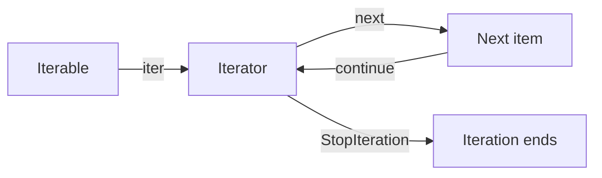

<TLDR>
  <TLDRCell label="what">
    <Term id="iterable">可迭代对象（iterable）</Term>能提供迭代器；迭代器（iterator）通过 `__next__()` 每次产出一项。含 `yield` 的函数会创建一种由 Python 管理状态的迭代器，也就是生成器。
  </TLDRCell>
  <TLDRCell label="trap">
    迭代器通常只能向前消费一次。调试输出、成员测试或第二个消费者都可能提前取走数据，提前退出还可能让生成器持有的资源继续打开。
  </TLDRCell>
  <TLDRCell label="fix">
    明确区分可重复迭代的数据源与单遍迭代器，记录谁负责消费和关闭；生成器内部用 `return` 结束，并在 `finally` 中释放资源。
  </TLDRCell>
</TLDR>

## 是什么，为什么存在

<Term id="iterator-protocol">迭代器协议（iterator protocol）</Term>是 Python 逐项读取数据的统一接口。可迭代对象的 `__iter__()` 返回一个迭代器，迭代器的 `__next__()` 返回下一项；没有下一项时，`__next__()` 抛出 `StopIteration`。`for`、推导式、`sum()`、`zip()` 和许多标准库 API 都建立在这套协议上。

可迭代对象和迭代器不是同义词。列表、元组与 `range` 通常可以多次调用 `iter()`，每次得到新的独立迭代器；文件对象、生成器对象和很多流式游标本身就是迭代器，`iter(obj) is obj`，消费后不会自动回到开头。

生成器（generator）是实现迭代器的一种方式。生成器函数使用 `yield` 产出值，Python 替你保存暂停位置、局部变量与异常处理状态。调用生成器函数只创建生成器对象，函数体要等到第一次 `next()` 才开始执行。

生成器解决的是控制权和状态保存问题。生产者可以在产出一项后暂停，消费者决定何时继续，因此无需先构造完整列表。这种<Term id="lazy-evaluation">惰性求值（lazy evaluation）</Term>适合逐行读取、转换管道、分页结果和可能无限的序列，也能让下游在找到结果后提前停止。

惰性不等于一定更快，也不保证内存永远很小。管道中某一步若调用 `list()`、`sorted()` 或需要全量分组，仍会物化所有输入；`itertools.tee()` 的消费者进度相差很大时也要缓存尚未被较慢一方读取的元素。应从数据流的所有权和消费方式判断，而不是把生成器当作通用优化开关。

## 工作原理

`for item in source` 会先求值 `source`，再调用 `iter(source)` 一次。循环反复调用 `next(iterator)` 并把结果绑定给 `item`；收到 `StopIteration` 时正常结束。循环体自己抛出的其他异常不会被协议吞掉。



迭代器必须让 `__iter__()` 返回自身。这样，接收任意可迭代对象的代码可以统一调用 `iter()`，即使传入的已经是迭代器也不会丢失当前位置。自定义容器则通常让 `__iter__()` 每次创建新迭代器，以便多个循环互不干扰。

生成器函数的调用与普通函数不同。调用时只创建一个生成器对象；第一次 `next()` 执行到首个 `yield`，把右侧值交给调用方并暂停。下一次 `next()` 从暂停点之后恢复，其中保存的局部变量仍是上次的状态。

生成器正常执行到函数末尾或执行 `return` 时会结束。协议层通过 `StopIteration` 表示结束，`return value` 会把 `value` 放进该异常的 `value` 属性；普通 `for` 循环只把它当成结束信号，不会把这个返回值作为一项产出。

| 对象或操作 | 协议含义 | 常见性质 |
| --- | --- | --- |
| `iterable.__iter__()` | 返回一个迭代器 | 可能每次返回新对象 |
| `iterator.__iter__()` | 返回迭代器自身 | 保留当前位置 |
| `iterator.__next__()` | 返回下一项或抛出 `StopIteration` | 会推进状态 |
| `yield value` | 产出值并暂停生成器帧 | 恢复后继续执行 |
| `return value` | 结束生成器 | 值进入 `StopIteration.value` |

生成器也是可关闭的状态机。`close()` 会在暂停点抛入 `GeneratorExit`，因此 `finally` 有机会运行；若生成器捕获关闭信号后又产出值，`close()` 会抛出 `RuntimeError`。调用方提前停止时是否关闭生成器，是必须明确的所有权契约。

## 示例

下面四个示例依次展示协议、惰性执行、委托与提前关闭。输出均来自本地 `python3` 对对应文件的实际执行。

### 单遍倒计时迭代器

`Countdown` 同时是可迭代对象和迭代器。它的当前位置保存在实例中，因此第二次遍历只会看到剩余项，耗尽后则得到空结果。

<Depth level="quick">

```python run title="iterator_protocol.py"
class Countdown:
    def __init__(self, start):
        self.current = start

    def __iter__(self):
        return self

    def __next__(self):
        if self.current <= 0:
            raise StopIteration
        value = self.current
        self.current -= 1
        return value


countdown = Countdown(3)
print(iter(countdown) is countdown)
print(next(countdown))
print(list(countdown))
print(list(countdown))
```

```text
True
3
[2, 1]
[]
```

<TryToBreak items={['从 0 开始', '耗尽后再次调用 next()', '让两个循环共享同一个实例']} />

</Depth>

`list(countdown)` 没有重新创建倒计时，它从当前的 `2` 继续消费到结束。最后一次 `list()` 再次调用 `iter(countdown)`，得到的还是已经耗尽的同一对象。

若希望每次循环都从 `start` 重新开始，应把可迭代对象与游标状态分开。容器的 `__iter__()` 可以返回新的 `Countdown`，或者直接返回一个生成器；不要在迭代器的 `__iter__()` 中悄悄重置状态，那会破坏嵌套循环和部分消费的含义。

### 看见生成器何时执行

`discounted_orders()` 在创建时不会读取订单。每次消费者请求下一项，它才继续扫描，直到产出一个符合条件的结果或耗尽输入。

```python run title="lazy_pipeline.py"
def discounted_orders(rows):
    print("pipeline started")
    for order_id, total in rows:
        print(f"reading {order_id}")
        if total >= 100:
            yield f"{order_id}:{total * 90 // 100}"


source = [("A-17", 120), ("B-02", 80), ("C-99", 200)]
discounts = discounted_orders(source)

print("created")
print(next(discounts))
print(list(discounts))
print(list(discounts))
```

```text
created
pipeline started
reading A-17
A-17:108
reading B-02
reading C-99
['C-99:180']
[]
```

`"created"` 出现在 `"pipeline started"` 前面，证明调用生成器函数没有执行函数体。第一次 `next()` 只读到足以产出 `A-17` 的位置；后面的 `list()` 才继续扫描另外两条记录。

这个生成器与输入共享消费进度。若 `rows` 本身也是迭代器，生产者和调用方交替读取它会互相取走数据。一个数据源有多个消费者时，应决定是重新创建源、物化快照、显式广播，还是接受单一所有者。

### 用 `yield from` 委托并接收返回值

`yield from` 不只是缩写一层 `for`。它把迭代操作委托给子生成器，并在子生成器结束后取得其 `return` 值。

```python run title="partition_export.py"
def read_partition(name, values):
    count = 0
    for value in values:
        count += 1
        yield f"{name}:{value}"
    return count


def export_rows():
    west_count = yield from read_partition("west", [10, 20])
    east_count = yield from read_partition("east", [30])
    return west_count + east_count


rows = export_rows()
while True:
    try:
        print(next(rows))
    except StopIteration as done:
        print(f"rows={done.value}")
        break
```

```text
west:10
west:20
east:30
rows=3
```

外层生成器先原样产出西区的两项，子生成器返回 `2` 后才进入东区。最终返回值 `3` 只在手动捕获的 `StopIteration.value` 中可见；`list(export_rows())` 会得到三条记录，但不会保留计数。

委托还会转发 `send()`、`throw()` 与 `close()` 的交互。业务代码若只需拼接普通可迭代对象，`itertools.chain()` 往往更直接；需要子生成器返回值或完整委托语义时，`yield from` 才表达了真正的契约。

### 提前停止时关闭生成器

生成器可以让资源跨越多个 `yield` 保持打开。消费者只取一项时，应显式关闭自己拥有的生成器，让 `finally` 立即执行。

```python run title="close_stream.py"
from io import StringIO


def read_nonempty(text):
    stream = StringIO(text)
    print(f"opened={not stream.closed}")
    try:
        for line in stream:
            cleaned = line.strip()
            if cleaned:
                yield cleaned
    finally:
        stream.close()
        print(f"closed={stream.closed}")


rows = read_nonempty("alpha\n\nbeta\n")
print(next(rows))
rows.close()
print(list(rows))
```

```text
opened=True
alpha
closed=True
[]
```

第一次 `next()` 后，生成器暂停在 `yield cleaned`，`stream` 仍然打开。`rows.close()` 把控制权送回暂停点，`finally` 关闭流；已经关闭的生成器保持耗尽，因此随后转换为列表得到 `[]`。

文件读取生成器也应使用同样的结构：在生成器函数内部用 `with open(...)` 包住 `yield` 所在的循环。若 API 把关闭责任交给调用方，应在名称、文档和使用方式中说明，并可由调用方使用 `contextlib.closing()` 建立清楚的作用域。

## 陷阱

### 把迭代器当成可重复集合

> [!PITFALL]
> 第一次 `list(iterator)`、`sum(iterator)` 或循环已经推进到末尾。再次使用得到空结果并不是数据消失，而是同一个游标已经耗尽。

**修复方法：** 若输入必须重复读取，就让 API 接收能创建新迭代器的可迭代对象或工厂。数据量有界且确实需要多遍时，可以在所有权边界物化一次；不要在深层辅助函数中暗自复制未知大小的输入。

### 返回已经关闭资源上的生成器表达式

> [!PITFALL]
> `with open(path) as file: return (parse(line) for line in file)` 返回时并未读取文件。离开 `with` 后文件已经关闭，调用方开始迭代才会遇到 `ValueError: I/O operation on closed file`。

**修复方法：** 让包含 `with` 的函数本身成为生成器，并在 `with` 内的循环中逐项 `yield`。这样文件会在首次迭代时打开，在耗尽、异常或显式关闭生成器时离开上下文。

### 用观察代码意外消费输入

> [!PITFALL]
> `print(list(rows))`、`next(rows)` 和 `target in rows` 都是消费操作。成员测试找到目标时还会留下目标之后的尾部；在无限迭代器中查找不存在的值可能永不结束。

**修复方法：** 调试单遍数据流时，在生产点记录每一项，或只用 `itertools.islice()` 取得明确数量并接受这些项已被消费。测试应同时断言本次结果与剩余输入，不能只看第一次返回值。

### 在生成器内部抛出 `StopIteration`

> [!PITFALL]
> 自定义迭代器的 `__next__()` 用 `raise StopIteration` 表示结束，但生成器函数内部意外逸出的 `StopIteration` 会转换成 `RuntimeError: generator raised StopIteration`。直接照搬协议代码会改变结果。

**修复方法：** 生成器要结束时使用 `return`。从另一个迭代器取可选项时，给 `next()` 提供默认值或在局部捕获 `StopIteration`，不要让它越过生成器帧边界。

### 假设 `break` 会关闭生成器

> [!PITFALL]
> `for` 循环执行 `break` 只会离开循环，不会对任意迭代器调用 `close()`。若仍有变量引用生成器，它的 `finally` 和其中资源会继续等待恢复、关闭或回收。

**修复方法：** 消费者拥有生成器并可能提前结束时，在 `finally` 中调用 `close()`，或者用 `contextlib.closing()`。不要依赖特定 Python 实现的即时垃圾回收来保证文件、锁或事务的释放时机。

### 把 `tee()` 当作免费复制

> [!PITFALL]
> `itertools.tee(source, 2)` 返回两个独立游标视图，不会复制原始数据。快消费者读过、慢消费者尚未读取的项必须缓存在内部；差距持续增长时，缓存也会持续增长。

**修复方法：** 进度接近的短期分支可以使用 `tee()`。消费者速度差异不受控时，应改用有界队列和背压、把数据持久化，或在输入有界时明确物化。

<Depth level="deep">

## 单遍状态与所有权

迭代器的核心是可变位置。调用 `next()` 会改变下一次调用看到的结果，即使 Python 层没有暴露 `index` 属性。把迭代器传给函数，相当于把这个推进能力交给函数；调用方不能假设返回后位置不变。

API 应说明它接收的是 `Iterable[T]` 还是 `Iterator[T]`。前者只保证能取得迭代器，不保证可重复、可求长度或可索引；后者明确表示已有消费状态。静态类型可以暴露这个区别，但仍需文档说明函数是否会消费全部输入、只取前缀，或者保留迭代器供以后使用。

几个操作的消费行为不同，审查时应逐个展开：

| 操作 | 消费范围 | 结束后的状态 |
| --- | --- | --- |
| `next(it)` | 一项 | 指向下一项 |
| `next(it, default)` | 至多一项 | 耗尽时返回默认值 |
| `value in it` | 直到匹配或耗尽 | 匹配项也已被消费 |
| `a, b = it` | 为验证恰好两项，最多读取三项 | 成功时耗尽 |
| `list(it)` | 直到耗尽 | 完全耗尽 |

一个迭代器由多个组件交替消费时，结果取决于调用顺序。若这正是调度设计，应把所有权集中在一个协调器中；若不是，就给每个消费者独立迭代器。仅仅给同一对象换两个变量名不会复制位置。

## 生成器帧与控制方法

生成器对象持有一个暂停的执行帧。帧中包括局部变量、当前指令位置以及活动的 `try`/`finally` 状态，所以恢复执行不是重新调用函数。生成器耗尽后帧不能重启；需要重新执行时必须再次调用生成器函数。

`next(gen)` 等价于 `gen.send(None)`。`send(value)` 会把值作为暂停处 `yield` 表达式的结果送入生成器，但刚创建的生成器还没有暂停点，只能先发送 `None`。这种双向接口可用，却容易增加控制流成本；普通数据生产者通常只需要 `next()`。

| 方法 | 在暂停点发生的事 | 典型用途 |
| --- | --- | --- |
| `send(value)` | 让 `yield` 表达式求值得到 `value` | 向状态机输入数据 |
| `throw(exc)` | 在暂停点抛出指定异常 | 注入错误或取消信号 |
| `close()` | 在暂停点抛出 `GeneratorExit` | 请求清理并结束 |

尚未开始的生成器没有执行过 `try`，因此对它调用 `close()` 不会进入函数体来获取或释放资源。资源应在生成器首次推进后才获取，或者由生成器外的明确上下文拥有。已经暂停的生成器则可通过 `close()` 运行包围暂停点的 `finally`。

## `yield from` 的委托边界

手写 `for item in child: yield item` 只转发产出的值。`yield from child` 还处理发送值、抛入异常、关闭请求与子生成器返回值，使外层生成器可以把一段协议完整委托出去。PEP 380 定义了这些细节。

子生成器执行 `return result` 时，委托表达式的结果是 `result`。这适合让子流程在流式产出之外报告摘要，但调用方只有继续驱动外层生成器越过子流程结束点，外层代码才能取得该值。消费者若提前停止，摘要可能根本没有计算完成。

委托不会自动解决资源所有权。关闭外层生成器通常会把关闭请求传给当前子迭代器，但设计仍要说明谁拥有子迭代器，以及它能否被其他代码共享。共享同一个子迭代器再从两条委托链消费，会得到顺序相关的结果。

## 生成器表达式的求值时机

<Term id="generator-expression">生成器表达式（generator expression）</Term>创建生成器对象，元素表达式与大多数迭代工作延后到消费时完成。不过，最左侧 `for` 的可迭代表达式会在生成器表达式创建时立即求值；这样，构造输入表达式时的错误会出现在定义生成器的位置。

「最左侧表达式已求值」不表示输入项已被消费。生成器表达式创建时也会对最左侧数据源取得迭代器，但要到第一次推进生成器时才请求首项。后续 `for` 子句、过滤条件与元素表达式同样按需求执行，因此它们观察到的外部可变状态可能是消费时的状态。

圆括号只描述生成器表达式的语法，不代表任意括号表达式都是生成器。`(value)` 仍是普通分组；单项元组需要 `(value,)`。判断行为时应看是否存在推导式的 `for` 子句，而不是看括号形状。

## 结束、异常与返回值

自定义 `__next__()` 抛出 `StopIteration` 是协议的正常实现。生成器函数已有 `return` 语法表示结束，所以从生成器帧意外逸出的 `StopIteration` 会在帧边界转换成 `RuntimeError`。这项规则防止内部辅助迭代器提前耗尽时静默截断外层生成器。

`return` 不带值等价于正常结束，带值时则设置 `StopIteration.value`。`yield from` 会读取这个值；`for`、`list()` 和大多数消费者只关心已经没有下一项。不要把摘要信息只放在生成器返回值里，却又让调用方通过普通循环消费。

其他异常会从当前 `next()` 调用传播给消费者，并通常使生成器结束。调用方捕获异常后再次推进生成器，往往只会收到 `StopIteration`。若业务需要把单条坏记录表示为数据，应显式产出结果对象或在生成器内部按契约处理，而不是依赖恢复失败的生成器。

## 资源生命周期

生成器中的 `with` 和 `finally` 可以跨暂停点存在。优点是资源只在真正开始消费时获取，并在正常耗尽或关闭时释放；代价是消费者在两次 `next()` 之间可能长时间持有文件、数据库游标或锁。

普通 `for` 不拥有它接收的迭代器，因此不能在 `break` 时一律关闭。某个迭代器可能还会被调用方继续使用，也可能根本没有 `close()`。需要确定性清理的 API 应提供上下文边界，或者明确要求拥有者在提前停止时关闭。

不要把 `__del__` 或 CPython 的引用计数当作协议。循环引用、其他 Python 实现和对象仍被缓存等情况都会推迟回收。测试资源行为时应观察关闭标志、临时文件句柄或测试替身的退出事件，而不是只断言生成器最终不可达。

## 测试迭代契约

一个自定义迭代器的最小契约测试应覆盖 `iter(it) is it`、逐项顺序、耗尽后的 `StopIteration`，以及再次调用 `next()` 仍保持耗尽。若可迭代容器承诺可重复遍历，还要创建两个迭代器并交错推进，确认位置互不影响。

生成器测试要把创建与消费分开。先调用生成器函数并断言尚无副作用，再推进一项，检查只发生了产生该项所需的工作。最后覆盖完整耗尽、业务异常与消费者提前关闭三条路径。

测试惰性管道时，用会记录每次读取的输入迭代器比只比较最终列表更有信息。它能暴露预取过多、日志意外消费和无界物化。无限输入必须配合 `islice()`、明确哨兵或其他有界终止条件，否则测试本身可能挂起。

## 选择生产者形式

若数据已经完整存在，而且调用方需要长度、索引或重复遍历，就直接返回列表或其他集合。为了显得「惰性」而返回生成器，会把简单的数据所有权换成更脆弱的时序契约。返回类型应反映调用方真正需要的操作。

若生产过程自然分步、输入很大或可能无限，生成器函数通常比手写迭代器类短。需要多个公开操作、可重置游标、检查点或复杂状态转换时，类能把协议和状态说得更清楚；它的 `__iter__()` 仍可按需返回生成器。

| 需求 | 通常合适的形式 |
| --- | --- |
| 有界结果，需要多遍或索引 | 集合 |
| 单遍转换管道 | 生成器函数 |
| 简短的单个表达式转换 | 生成器表达式 |
| 自定义游标带额外操作 | 迭代器类 |
| 组合标准迭代步骤 | `itertools` 工具 |

公开 API 还应说明空输入、坏记录与提前停止的结果。只标注返回 `Iterator[T]` 不能回答异常是立即出现还是消费时出现，也不能说明关闭责任。把这些时序语义写进契约，测试才能落在正确边界上。

</Depth>

<Checkpoint id="python/generators-iterators" />

## 延伸阅读

- [Python 标准类型：迭代器类型](https://docs.python.org/3.14/library/stdtypes.html#iterator-types)
- [Python 语言参考：`yield` 表达式](https://docs.python.org/3.14/reference/expressions.html#yield-expressions)
- [Python 语言参考：生成器表达式](https://docs.python.org/3.14/reference/expressions.html#generator-expressions)
- [Python 函数式编程指南：迭代器](https://docs.python.org/3.14/howto/functional.html#iterators)
- [PEP 380：委托给子生成器的语法](https://peps.python.org/pep-0380/)
- [PEP 479：生成器中的 `StopIteration` 处理](https://peps.python.org/pep-0479/)
