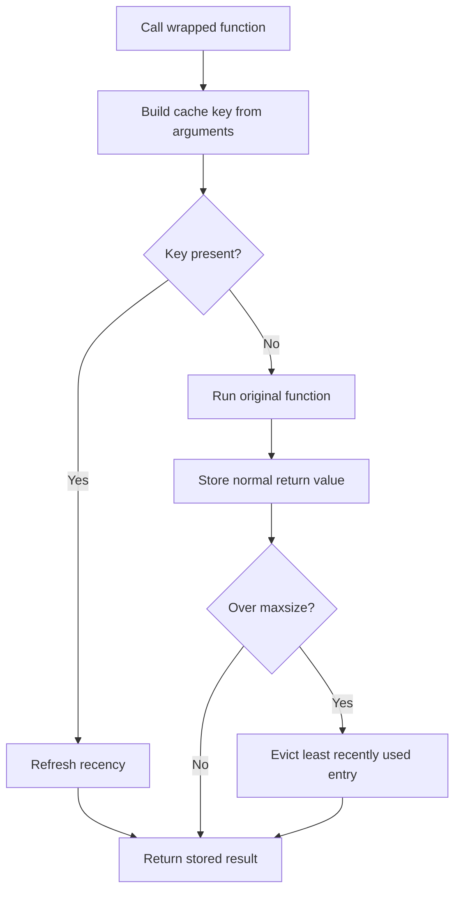

<TLDR>
  <TLDRCell label="what">
    `functools.lru_cache` stores return values by call arguments; when the same cache key appears again, the wrapper returns the stored object directly.
  </TLDRCell>
  <TLDRCell label="trap">
    A cache cannot see external data change, and it retains arguments and results; impure functions, unbounded key spaces, and mutable results can produce stale data or retain objects unexpectedly.
  </TLDRCell>
  <TLDRCell label="fix">
    Cache only repeatable computations, define capacity and invalidation boundaries, and verify the design with `cache_info()`, stale-data tests, and concurrency tests.
  </TLDRCell>
</TLDR>

## What it is and why it exists

`functools.lru_cache` is a decorator that caches function calls. The first time it sees a call pattern, it runs the function and stores the result; when it sees the same cache key later, it skips the function body and returns the stored object. This technique of reusing a result by its input is called <Term id="memoization">memoization</Term>.

LRU means least recently used. When adding a result would take the cache beyond `maxsize`, it evicts the entry that has gone longest without a hit; a hit also refreshes that entry's recency. A finite capacity lets a long-running process bound the number of entries, but it does not bound the size of each result.

Caching fits functions whose arguments repeat, whose results are determined by those arguments, and whose work is worth reusing. Recursive dynamic programming, parsing immutable configuration text, and reading immutable data by a stable identifier are common entry points. A function that must perform a side effect, create a fresh object, or reflect current external state on every call should not be decorated directly.

`functools.cache` is the unbounded shorthand for `lru_cache(maxsize=None)`. It performs no LRU eviction, which makes the spelling simpler but also retains arguments and results as the key space grows. The central choice is not the decorator's name; it is how long a result may live, who triggers invalidation, and whether the key space is bounded.

## How it works

The decorator returns a wrapper. On each call, the wrapper builds a <Term id="cache-key">cache key</Term> from positional and keyword arguments and looks it up in an internal mapping. A hit returns the existing result; a miss calls the original function, stores its normal return value, and then gives it to the caller.

A bounded cache also tracks recency. When a new result takes it over capacity, the wrapper discards the least recently used key and result; hitting an older key makes it recent again. `maxsize=None` disables eviction rather than choosing a very large limit.



You can understand one call in this order:

1. Python first evaluates the argument expressions at the call site.
2. The wrapper builds a key from the call pattern; every direct argument must be <Term id="hashable">hashable</Term>.
3. On a hit, `hits` increases and the original function does not run.
4. On a miss, `misses` increases, and the wrapper runs the original function and stores a normal return value.
5. If a bounded cache exceeds its capacity, the least recently used entry is removed.

### Cache keys and object references

The cache works from call patterns; it does not first normalize equivalent spellings through the function signature. `f(1)`, `f(value=1)`, and an explicit default in `f(1, scale=2)` may occupy separate entries. Different keyword argument orders may also form different entries, so a stable calling convention directly affects the hit rate.

Both positional and keyword arguments must be hashable. A tuple can enter a key only when its elements are also hashable; `list`, `dict`, and `set` cannot be passed directly. A wrapper may normalize input to an immutable representation, but that conversion must preserve business meaning rather than accidentally erase order or duplicates.

The cache stores object references, not serialized snapshots. If a caller mutates a cached list, the next hit receives that same modified list. The cache also retains references to arguments and results until an entry is evicted or `cache_clear()` empties it.

### Capacity, statistics, and invalidation

`@lru_cache` has a default capacity of `128`, and you can write `@lru_cache(maxsize=...)` explicitly. Choose capacity from observed call distribution and object size, not a mechanical rule that it must be a power of two because a hash table is involved. An unbounded cache fits only when the key set is genuinely bounded or a shorter process lifetime bounds it instead.

The wrapper's `cache_info()` returns `hits`, `misses`, `maxsize`, and `currsize`. Those counters describe the access pattern, but they do not prove that caching helps because they omit computation cost, result size, and stale-data risk. Observe them under a representative workload and judge them alongside business correctness.

`cache_clear()` removes every entry and resets the statistics. The standard wrapper has no per-key deletion or time-expiry interface, so <Term id="cache-invalidation">cache invalidation</Term> must be explicit in the design. If a data version can become an argument, including that version in the key is often easier to test than hiding a periodic clearing thread.

## Examples

The following four examples show recursive memoization, true LRU eviction, call patterns and type separation, and explicit invalidation after external state changes. Every output shown came from running the corresponding file with local `python3`.

### Caching overlapping recursive subproblems

Counting routes through a grid repeatedly reaches the same coordinates. An unbounded cache fits this bounded example because one top-level call creates only a finite set of nonnegative coordinate pairs.

<Depth level="quick">

```python run title="route_count.py"
from functools import lru_cache


@lru_cache(maxsize=None)
def count_routes(across, down):
    print(f"compute ({across}, {down})")
    if across == 0 or down == 0:
        return 1
    return count_routes(across - 1, down) + count_routes(across, down - 1)


print("routes:", count_routes(2, 2))
print("after first:", count_routes.cache_info())
print("routes again:", count_routes(2, 2))
print("after second:", count_routes.cache_info())
```

```text
compute (2, 2)
compute (1, 2)
compute (0, 2)
compute (1, 1)
compute (0, 1)
compute (1, 0)
compute (2, 1)
compute (2, 0)
routes: 6
after first: CacheInfo(hits=1, misses=8, maxsize=None, currsize=8)
routes again: 6
after second: CacheInfo(hits=2, misses=8, maxsize=None, currsize=8)
```

<TryToBreak items={['count_routes(0, 0)', 'negative coordinates', 'coordinates far beyond the recursion limit']} />

</Depth>

The first top-level call contains one internal hit: `count_routes(2, 1)` reuses the earlier `count_routes(1, 1)` result. The second top-level call hits immediately, so it prints no new `compute` line and moves `hits` from `1` to `2`.

The decorator does not validate the recursive definition's input domain. Negative coordinates never reach the base case, and very large coordinates may still hit the recursion limit first. Caching removes repeated subproblems; it does not repair termination conditions or eliminate the call stack.

### Observing least-recently-used eviction

With a capacity of `2`, hitting `A` refreshes its recency. Adding `C` then evicts `B`, so the final read of `B` has to run the function again.

```python run title="eviction.py"
from functools import lru_cache


@lru_cache(maxsize=2)
def unit_price(sku):
    print(f"lookup {sku}")
    return {"A": 12, "B": 18, "C": 25}[sku]


for sku in ["A", "B", "A", "C", "B"]:
    print(sku, unit_price(sku))

print(unit_price.cache_info())
```

```text
lookup A
A 12
lookup B
B 18
A 12
lookup C
C 25
lookup B
B 18
CacheInfo(hits=1, misses=4, maxsize=2, currsize=2)
```

There is no second `lookup A` line, so the third call was a hit. `currsize=2` only says that two entries remain; it says nothing about how much memory their results occupy, and it does not expose their keys.

The function uses a fixed dictionary only to keep its output repeatable. If real prices can change, a key made only from `sku` returns stale results; add a version boundary, clear deliberately, or give this data to a cache that supports the required invalidation policy.

### Separating call patterns and direct types

`typed=True` separates calls by the types of their immediate arguments. It does not merge positional and keyword spellings or omitted and explicit default values.

```python run title="call_patterns.py"
from functools import lru_cache


@lru_cache(maxsize=8, typed=True)
def scaled(value, scale=2):
    print(f"compute value={value!r}, scale={scale!r}")
    return value * scale


print(scaled(3))
print(scaled(3))
print(scaled(3.0))
print(scaled(value=3))
print(scaled(3, scale=2))
print(scaled.cache_info())
```

```text
compute value=3, scale=2
6
6
compute value=3.0, scale=2
6.0
compute value=3, scale=2
6
compute value=3, scale=2
6
CacheInfo(hits=1, misses=4, maxsize=8, currsize=4)
```

Only the second `scaled(3)` is a hit. The direct type of `3.0` differs, and the other two calls express their arguments differently, so each causes a miss.

If an API accepts many equivalent spellings, an uncached public function can bind and normalize input before calling a narrower private cached function. Do not depend on the implementation's private key format, and do not read `typed=False` as “all equal values must share an entry.”

### Clearing after external state changes

The function keys only on `sku` and `quantity`, but it reads its price from the external `catalog`. Mutating that dictionary does not change the cache key, so the old subtotal remains until explicit invalidation.

```python run title="invalidation.py"
from functools import lru_cache

catalog = {"paper": 5}


@lru_cache(maxsize=16)
def subtotal(sku, quantity):
    print(f"read price for {sku}")
    return catalog[sku] * quantity


print("first:", subtotal("paper", 3))
catalog["paper"] = 6
print("before clear:", subtotal("paper", 3))
subtotal.cache_clear()
print("after clear:", subtotal("paper", 3))
print(subtotal.cache_info())
```

```text
read price for paper
first: 15
before clear: 15
read price for paper
after clear: 18
CacheInfo(hits=0, misses=1, maxsize=16, currsize=1)
```

`before clear` remains `15`, with no new read log. Clearing makes the next computation return `18`; it also resets the statistics, so the final line shows only one miss.

Clearing everything fits a small, infrequently invalidated in-process cache. When writes are frequent or only one entity needs invalidation, the standard `lru_cache` interface is usually too coarse; use an explicit version argument or choose a cache design with per-key invalidation.

## Pitfalls

### Caching a function with hidden external state

> [!PITFALL]
> When a function reads time, randomness, environment variables, a database, or mutable globals, equal arguments do not guarantee that the desired result stays equal. The decorator cannot see those dependencies and keeps returning the old result.

**Fix:** Put a stable version or configuration value that affects the result into the arguments, or trigger explicit invalidation after the data-changing transaction succeeds. A test must hit the cache, change the dependency, and then verify that the next read follows the freshness contract.

### Using an unbounded cache for an unbounded key space

> [!PITFALL]
> `@cache` and `lru_cache(maxsize=None)` retain the arguments and result of every distinct call. When user IDs, search text, or timestamps keep changing, process memory can grow with the key space.

**Fix:** Give long-running services a finite `maxsize` by default, then observe `currsize`, hit patterns, and object sizes under representative traffic. Use an unbounded cache only when both the key set and its lifetime have clear bounds.

### Returning a shared mutable result

> [!PITFALL]
> A cache hit returns the same object reference. A change that one caller makes to a list, dictionary, or custom object becomes the cached content observed by later callers.

**Fix:** Prefer caching immutable results, or return an intentionally chosen copy at the public boundary. Also test mutation isolation between two callers; checking only value equality will not reveal object sharing.

### Confusing thread safety with single computation

> [!PITFALL]
> The wrapper keeps its internal data structure coherent, but two threads may execute the original function concurrently for the same missing key. If that function bills, writes, or sends a message, duplicate execution can violate business semantics.

**Fix:** Make the cached function safe to repeat, or implement keyed single-flight coordination at the business layer. The concurrency test must overlap two calls before the first computation finishes, not merely test hits after warming the cache.

### Caching an instance method without accounting for self

> [!PITFALL]
> When an instance method is decorated, `self` is part of the cache key and is retained by the cache. Many short-lived instances can therefore survive until their entries are evicted or the cache is cleared.

**Fix:** First decide whether the cache belongs to a function, an instance, or a business entity. Consider `cached_property` for an instance-owned value, or pass an immutable identifier to a module-level cached function for a stable entity; if weak-reference semantics matter, use a purpose-built design rather than assuming `lru_cache` ignores `self`.

## In the AI era

**What generated code gets wrong here**

Models often add `@cache` directly to a database read or HTTP request without generating a write-side invalidation path, tenant or permission dimensions, or a bound on the key space. They also decorate `async def`, caching a coroutine object rather than its awaited result; awaiting that same object a second time fails. Another failure is rewriting “thread-safe” as “computed once per key,” or returning a mutable dictionary that callers may modify in place.

**Ask your AI to check**

- List every state dependency of the function's result and say whether it appears completely in the cache key.
- Give the invalidation trigger and test for every write, configuration switch, and permission change.
- Check the key-space bound, result mutability, instance retention, and whether concurrent misses may duplicate work.

**Review checklist**

- Hit the cache, change the underlying state, and verify freshness and permission boundaries.
- Exercise different call spellings, different direct types, and unhashable input to check key behavior.
- Run the same cold key concurrently and monitor `hits`, `misses`, `currsize`, and clear events.

**Prompt vocabulary**

Use the exact terms `memoization`, `cache key`, `cache hit`, `cache miss`, `LRU eviction`, `cache invalidation`, `bounded cache`, and `single-flight`. Ask for the key composition, state ownership, an invalidation matrix, and a concurrent cold-start timeline; “add caching for performance” does not express these constraints.

<Depth level="deep">

## Choosing cache, lru_cache, or no cache

The three choices express different lifetime contracts. `@cache` retains every distinct call; `@lru_cache(maxsize=n)` retains a finite set of recently used entries; no cache executes the current logic on every call. Decide correctness and ownership first, then whether reuse is worthwhile.

| Choice | Fit | Main cost |
| --- | --- | --- |
| `@cache` | The key set is bounded and results are stable for the function's lifetime | Every entry remains reachable |
| `@lru_cache(maxsize=n)` | Access has hot spots and recency eviction is acceptable | Cold keys recompute; capacity still needs validation |
| No cache | Results must be fresh, have side effects, or rarely repeat | Every call pays the full execution cost |

LRU evicts only by access order; it does not understand result cost, size, tenant, or expiry. One large result and one small result each count as one entry. If the business needs a byte budget, TTL, per-key deletion, or cross-process consistency, choose a cache that directly supports those capabilities instead of stacking implicit threads around this decorator.

The cache belongs to the function object and normally exists only inside the current Python process. Multiple workers have separate contents and statistics, and a restart loses the contents. It is neither a persistence layer nor a way to propagate invalidation between hosts.

Hit rate is not an objective by itself. A high rate may only cache an already cheap function, while a low rate may indicate a small capacity, unstable call spelling, or a key space with almost no reuse. Evaluate correctness, retained memory, the cost of skipped work, and miss tail latency together.

## The exact boundary of typed

`typed=False` is the default, but it does not promise that every pair of equal values shares an entry. The official documentation states that some types may still be cached separately in the default mode. Code should not depend on whether `3` and `3.0` happen to merge; use `typed=True` explicitly when type is part of the meaning.

`typed=True` examines only the types of the function's immediate arguments; it does not recursively distinguish types inside containers. Two directly passed scalars can be separate while tuples containing those scalars may still match according to the tuple's own hashing and equality. If element types determine a container result, construct a canonical key that expresses that distinction in a wrapper.

Booleans are a subclass of integers, and different Python numeric types can compare equal and share a hash. `typed=True` can separate directly passed `False`, `0`, and some other numeric types by type, but it is still not a general serialization strategy. First define which inputs are the same business request, then encode that key policy.

The cache wrapper does not automatically fill default arguments. Omitting `scale` and explicitly passing `scale=2` are different call patterns even though the function body ultimately sees the same value. When normalization matters, make a public function convert arguments to one fixed private call form.

Keyword order may affect entries too. A caller that assembles `**kwargs` from several sources can deliver the same key-value set in different orders. A public wrapper can call the internal cached function with explicit business fields, narrowing the key shape and making a stable contract visible to type checkers and readers.

## Invalidation and ownership

Cache correctness depends on one sentence: until what event is a result for this key valid? That event might be process exit, a configuration version change, a database commit, a model release, or a permission revocation. Without that sentence, `maxsize` addresses capacity but not stale data.

`cache_clear()` is an all-entry operation. It fits full configuration reloads, test isolation, and small caches, but clearing every hot entry after one entity changes may cause a large cold start. The standard interface has no `cache_delete(key)`, so per-key invalidation is a valid reason to choose another cache structure.

A versioned key turns an invalidation event into a normal argument. For example, a reader calls `_price(sku, catalog_version)`, and a successful write advances the version; old entries continue to occupy capacity until LRU eviction or a full clear, but new-version calls cannot hit them. This approach is easy to test but requires reliable version propagation.

Clearing the entire wrapper on a timer does not give each record its own TTL. It expires every key together and may clear a result that was just inserted during request handling. If freshness is based on each record's write time, use an implementation that stores individual deadlines and defines its concurrency behavior.

Negative results need an invalidation policy too. Whether a missing user, denied permission, or temporary remote failure can be cached depends on when it can change and the cost of retrying. Do not retain a transient failure indefinitely, and do not assume exceptions automatically become cache entries like normal return values.

## Concurrency, coroutines, and generators

The internal mappings of `lru_cache` and `cache` remain coherent during multithreaded updates. That guarantee protects the cache structure; it does not wrap calls to the original function in a “once per key” lock. When two threads see the same cold key, the original function may run twice before the cache retains a normal result.

If duplicate computation only wastes CPU, you may accept that behavior and cover it in capacity and latency tests. If a repeated call charges money, writes a database, or sends a message, the cache is at the wrong layer; idempotency keys, transactional constraints, or single-flight coordination provide business-level uniqueness.

Do not decorate `async def` directly with `lru_cache`. Calling an async function first returns a coroutine object, so the wrapper caches that single-use awaitable rather than its eventual value. An async cache must store a value after awaiting completes and define concurrent request coalescing, exceptions, cancellation, and invalidation.

Generator functions have the same object-boundary problem. The decorator caches a generator object; after its first consumption it is exhausted, and the next hit gets that same exhausted object. If the data size permits, cache an immutable materialized result and return a fresh iterator to each caller.

Exceptions are not reusable normal return values. A failed call executes the original function again on the next identical request, which can repeatedly strike a dependency during an outage. If you need brief negative caching or backoff, design its state, deadlines, and observability explicitly.

Clearing a cache while calls are in progress is not a business transaction either. A computation that started before another thread cleared the cache may still finish and affect later cache state. If invalidation must be strictly ordered with writes, put both behind a component with an explicit synchronization protocol.

## Method caches and instance lifetimes

An instance method's first argument is `self`, so different instances normally produce different keys. The cache does not know that two instances represent the same business entity, and it does not extract their IDs automatically. Instances must also be hashable; custom equality and hashing that change with object state violate the dictionary-key contract.

The method wrapper normally lives on the class, while its cache holds instances appearing in keys. Even after the rest of the program drops an instance, its cache entry may retain the instance and its reachable object graph. A finite capacity bounds entry count, but it cannot guarantee release at the end of a request.

`cached_property` solves a different problem: it writes the computed result into that instance's attribute dictionary, lives as long as the instance, and can recompute after the attribute is deleted. It has neither `lru_cache`'s cross-call capacity nor its hit statistics, and it does not work with every type lacking a writable `__dict__`. Choose by the required owner rather than treating the decorators as interchangeable spellings.

Another boundary is a module-level cached function that accepts only an immutable entity ID and version, with the instance method delegating to it. This makes lifetime and invalidation more visible, but only if the ID plus version fully determines the result. If unexpressed instance state affects the result, the refactor creates incorrect sharing.

## Diagnosis and testing

The wrapper exposes four important entry points: `cache_info()` for statistics, `cache_parameters()` for `maxsize` and `typed`, `cache_clear()` for full invalidation, and `__wrapped__` for the original function. `cache_parameters()` returns a new dictionary, and mutating it does not reconfigure the existing wrapper; changing policy requires wrapping again.

`__wrapped__` can bypass the cache in tests to compare the cached and original paths, and it supports inspection or rewrapping. It is not a “refresh this key” interface, and calling it directly does not populate the existing cache. Arbitrary production bypasses make statistics and latency hard to interpret.

An effective cache test set includes at least:

1. Repeat an identical call and confirm the original function is skipped only when the contract permits it.
2. Exercise alternate call spellings, boundary types, and unhashable input to verify key rules.
3. Change every external dependency and verify invalidation follows the promised event.
4. For mutable results, verify whether callers require isolation from each other.
5. Run the same cold key concurrently and verify duplicate execution cannot corrupt business state.

Call `cache_clear()` between tests so a hit from one test does not change the path or statistics of the next. Tests that assert exact counters should build a known sequence after clearing and avoid background threads or other tests sharing the same wrapper. Cache bugs are usually timing and ownership bugs; a single return-value assertion cannot cover them.

</Depth>

<Checkpoint id="python/lru-cache" />

## Further reading

- [Python `functools.lru_cache` documentation](https://docs.python.org/3.14/library/functools.html#functools.lru_cache)
- [Python `functools.cache` documentation](https://docs.python.org/3.14/library/functools.html#functools.cache)
- [Python FAQ: How do I cache method calls?](https://docs.python.org/3.14/faq/programming.html#how-do-i-cache-method-calls)
- [CPython 3.14 `_functoolsmodule.c` source](https://github.com/python/cpython/blob/3.14/Modules/_functoolsmodule.c)
