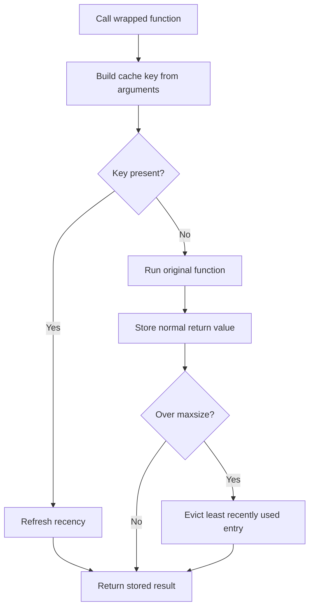

<TLDR>
  <TLDRCell label="what">
    `functools.lru_cache`按调用实参保存返回值；相同缓存键再次出现时，包装器直接返回已保存的对象。
  </TLDRCell>
  <TLDRCell label="trap">
    缓存不知道外部数据何时变化，还会持有实参与返回值；不纯函数、无界键空间和可变返回值都可能产生陈旧数据或意外保留对象。
  </TLDRCell>
  <TLDRCell label="fix">
    只缓存可重复计算，明确容量与失效边界，并用`cache_info()`、陈旧数据测试和并发测试验证设计。
  </TLDRCell>
</TLDR>

## 是什么，为什么存在

`functools.lru_cache`是一个缓存函数调用的装饰器。第一次遇到某个调用模式时，它执行函数并保存结果；以后遇到同一缓存键时，它跳过函数体并返回保存的对象。这种用输入复用既有结果的技术叫作<Term id="memoization">记忆化（memoization）</Term>。

这里的LRU是“最近最少使用”（least recently used）。缓存达到`maxsize`后再加入新结果，会淘汰最长时间没有被命中的条目；一次命中也会更新该条目的新近程度。有限容量让长期运行的进程可以控制条目数量，但不能控制每个结果本身的大小。

缓存适合相同实参会反复出现、结果由这些实参决定，而且计算或读取成本值得复用的函数。递归动态规划、解析不可变配置文本和按稳定标识读取只读数据，都是常见入口。若每次调用都必须产生副作用、新对象或反映当前外部状态，就不应直接套用它。

`functools.cache`是`lru_cache(maxsize=None)`的无界简写。它不执行LRU淘汰，因此代码更简洁，但键空间持续增长时也会持续保留实参与结果。选择两者的核心问题不是装饰器名称，而是结果能保存多久、由谁触发失效，以及键空间是否有界。

## 工作原理

装饰器返回一个包装器。每次调用时，包装器根据位置实参与关键字实参构造<Term id="cache-key">缓存键（cache key）</Term>，在内部映射中查找它。命中就返回现有结果；未命中则调用原函数，保存正常返回的结果，然后再把它交给调用方。

有限缓存还要维护使用新近程度。新结果使容量超限时，包装器丢弃最久没有使用的键及其结果；命中旧键则把它视为最近使用。`maxsize=None`会关闭淘汰，而不是给缓存设置一个很大的上限。



一次调用可以按下面的顺序理解：

1. Python先求值调用表达式中的实参。
2. 包装器按调用模式构造键；所有直接实参都必须<Term id="hashable">可哈希（hashable）</Term>。
3. 命中时，`hits`增加，原函数不会运行。
4. 未命中时，`misses`增加，包装器执行原函数并保存正常返回值。
5. 有限缓存超出容量时，最近最少使用的条目被移除。

### 缓存键与对象引用

缓存按调用模式工作，不会先用函数签名把等价写法归一化。`f(1)`、`f(value=1)`和显式传入默认值的`f(1, scale=2)`可能占用不同条目。关键字实参顺序不同也可能形成不同条目，因此稳定的调用约定会直接影响命中率。

位置实参与关键字实参都必须可哈希。元组只有在其元素也可哈希时才能进入键；`list`、`dict`和`set`不能直接作为实参。包装层可以先把输入规范化为不可变表示，但这种转换必须保留业务语义，不能把顺序或重复项意外抹掉。

缓存保存的是对象引用，不是序列化快照。调用方修改缓存返回的列表后，下一次命中会拿到同一个已修改列表。缓存也会持续引用实参与结果，直到条目被淘汰或`cache_clear()`清空它。

### 容量、统计与失效

`@lru_cache`的默认容量是`128`，也可以写成`@lru_cache(maxsize=...)`。容量应根据真实调用分布和对象大小决定，不能因为内部使用哈希表就机械地选择二的幂。无界缓存只适合键集合确实有界，或者其生命周期由更短的进程边界限制的情况。

包装函数的`cache_info()`返回`hits`、`misses`、`maxsize`和`currsize`。这些计数能说明访问模式，却不能单独证明缓存有价值，因为它们不包含计算成本、结果大小或陈旧数据风险。应在代表性负载下观察统计，并结合业务正确性判断。

`cache_clear()`会清除全部条目并重置统计。标准包装器没有按单个键删除或按时间过期的接口，因此<Term id="cache-invalidation">缓存失效（cache invalidation）</Term>必须在设计时明确。若数据版本可以进入函数实参，把版本作为键的一部分，通常比隐藏一个定时清空线程更容易测试。

## 示例

下面四个例子依次展示递归记忆化、LRU淘汰、调用模式与类型区分，以及外部状态变化后的显式失效。所有输出都来自本地`python3`运行结果。

### 缓存重叠的递归子问题

网格路径计数会反复遇到相同坐标。无界缓存适合这个有界示例，因为一次顶层调用只会产生有限的非负坐标组合。

<Depth level="quick">

```python run title="route_count.py"
from functools import lru_cache


@lru_cache(maxsize=None)
def count_routes(across, down):
    print(f"compute ({across}, {down})")
    if across == 0 or down == 0:
        return 1
    return count_routes(across - 1, down) + count_routes(across, down - 1)


print("routes:", count_routes(2, 2))
print("after first:", count_routes.cache_info())
print("routes again:", count_routes(2, 2))
print("after second:", count_routes.cache_info())
```

```text
compute (2, 2)
compute (1, 2)
compute (0, 2)
compute (1, 1)
compute (0, 1)
compute (1, 0)
compute (2, 1)
compute (2, 0)
routes: 6
after first: CacheInfo(hits=1, misses=8, maxsize=None, currsize=8)
routes again: 6
after second: CacheInfo(hits=2, misses=8, maxsize=None, currsize=8)
```

<TryToBreak items={['count_routes(0, 0)', '传入负坐标', '传入远大于递归深度限制的坐标']} />

</Depth>

第一次顶层调用包含一次内部命中：`count_routes(2, 1)`复用了先前得到的`count_routes(1, 1)`。第二次顶层调用直接命中，所以没有新的`compute`行，`hits`从`1`变成`2`。

装饰器不会验证递归定义的输入域。负坐标永远到不了基线条件，而很大的坐标仍可能先触发递归深度限制。缓存减少重复子问题，不会自动修正终止条件或消除递归栈。

### 观察最近最少使用淘汰

容量为`2`时，命中`A`会刷新它的新近程度。随后加入`C`会淘汰`B`，所以最后一次读取`B`必须重新执行函数。

```python run title="eviction.py"
from functools import lru_cache


@lru_cache(maxsize=2)
def unit_price(sku):
    print(f"lookup {sku}")
    return {"A": 12, "B": 18, "C": 25}[sku]


for sku in ["A", "B", "A", "C", "B"]:
    print(sku, unit_price(sku))

print(unit_price.cache_info())
```

```text
lookup A
A 12
lookup B
B 18
A 12
lookup C
C 25
lookup B
B 18
CacheInfo(hits=1, misses=4, maxsize=2, currsize=2)
```

没有第二行`lookup A`，说明第三次调用命中了缓存。`currsize=2`只表示两个条目仍在缓存中，不说明这两个结果占用多少内存，也不公开它们的键。

这个函数使用固定字典只是为了让输出可重复。真实价格若会变化，单凭`sku`作为键就会返回陈旧结果；应增加版本边界、主动清空，或把这类数据交给支持目标失效策略的缓存。

### 区分调用模式与直接类型

`typed=True`会按直接实参的类型区分调用。它不会把位置写法、关键字写法和省略或显式提供默认值的写法合并。

```python run title="call_patterns.py"
from functools import lru_cache


@lru_cache(maxsize=8, typed=True)
def scaled(value, scale=2):
    print(f"compute value={value!r}, scale={scale!r}")
    return value * scale


print(scaled(3))
print(scaled(3))
print(scaled(3.0))
print(scaled(value=3))
print(scaled(3, scale=2))
print(scaled.cache_info())
```

```text
compute value=3, scale=2
6
6
compute value=3.0, scale=2
6.0
compute value=3, scale=2
6
compute value=3, scale=2
6
CacheInfo(hits=1, misses=4, maxsize=8, currsize=4)
```

只有第二个`scaled(3)`命中。`3.0`的直接类型不同，另外两次调用的参数表达形式不同，因此各自产生一次未命中。

若API允许许多等价写法，可以在未缓存的公开函数中绑定并规范化输入，再调用签名更窄的私有缓存函数。不要依赖当前实现的私有键格式，也不要把`typed=False`理解成“所有相等值必然共用条目”。

### 外部状态变化后清空

函数只以`sku`和`quantity`为键，却从外部`catalog`读取价格。修改字典不会改变缓存键，因此旧小计一直保留到明确失效。

```python run title="invalidation.py"
from functools import lru_cache

catalog = {"paper": 5}


@lru_cache(maxsize=16)
def subtotal(sku, quantity):
    print(f"read price for {sku}")
    return catalog[sku] * quantity


print("first:", subtotal("paper", 3))
catalog["paper"] = 6
print("before clear:", subtotal("paper", 3))
subtotal.cache_clear()
print("after clear:", subtotal("paper", 3))
print(subtotal.cache_info())
```

```text
read price for paper
first: 15
before clear: 15
read price for paper
after clear: 18
CacheInfo(hits=0, misses=1, maxsize=16, currsize=1)
```

`before clear`仍为`15`，而且没有新的读取日志。清空后重新计算得到`18`；统计也被重置，所以最后只显示一次未命中。

全量清空适合条目少、失效不频繁的进程内缓存。写入频繁或只需失效一个实体时，标准`lru_cache`的接口通常太粗；应使用显式版本参数，或选择支持逐键失效的缓存设计。

## 陷阱

### 缓存依赖隐藏外部状态的函数

> [!PITFALL]
> 函数读取时间、随机数、环境变量、数据库或可变全局对象时，相同实参不保证应得到相同结果。装饰器看不到这些依赖，只会继续返回原结果。

**修复方法：** 把影响结果的稳定版本或配置值放进实参，或者在数据变更事务成功后触发明确失效。测试必须先命中缓存，再修改依赖并验证下一次读取符合新鲜度契约。

### 使用无界缓存处理无界键空间

> [!PITFALL]
> `@cache`和`lru_cache(maxsize=None)`会一直保留每个不同调用的实参与结果。用户ID、搜索文本或时间戳不断变化时，进程内存可随键空间增长。

**修复方法：** 默认给长期运行服务设置有限`maxsize`，并在代表性流量下查看`currsize`、命中模式与对象大小。只有键集合和生命周期都能明确限定时才使用无界缓存。

### 返回共享的可变结果

> [!PITFALL]
> 缓存命中返回同一个对象引用。某个调用方对列表、字典或自定义对象的修改，会成为后续调用方观察到的缓存内容。

**修复方法：** 优先缓存不可变结果，或者在公开边界返回有意选择的副本。还要测试两个调用方的修改隔离；只检查值相等无法发现对象共享。

### 把线程安全误认为单次计算

> [!PITFALL]
> 包装器会保持内部数据结构一致，但两个线程可以同时对同一未命中键执行原函数。若原函数有计费、写入或发送消息等副作用，重复执行会破坏业务语义。

**修复方法：** 让被缓存函数可安全重复执行，或在业务层实现按键的single-flight协调。并发测试应让两个调用在第一次计算完成前重叠，而不是只测试缓存已经预热后的命中。

### 缓存实例方法而忽略self

> [!PITFALL]
> 装饰实例方法时，`self`是缓存键的一部分，并会被缓存持有。大量短命实例可能因此存活到对应条目淘汰或缓存清空。

**修复方法：** 先确定缓存属于函数、实例还是业务实体。实例级值可考虑`cached_property`，稳定实体可把不可变标识传给模块级缓存函数；需要弱引用语义时，应采用专门设计，而不是假设`lru_cache`会忽略`self`。

<Depth level="deep">

## 在cache、lru_cache与不缓存之间选择

三个选项表达不同的生命周期契约。`@cache`保存所有不同调用；`@lru_cache(maxsize=n)`只保留最近使用的有限条目；不缓存则让每次调用都执行当前逻辑。先判断正确性与所有权，再决定是否值得复用。

| 选择 | 适用条件 | 主要代价 |
| --- | --- | --- |
| `@cache` | 键集合有界，结果在函数生命周期内稳定 | 所有条目都保持可达 |
| `@lru_cache(maxsize=n)` | 访问有热点，允许按新近程度淘汰 | 冷键会重算，容量仍需验证 |
| 不缓存 | 结果必须新鲜、有副作用或几乎没有复用 | 每次承担完整执行成本 |

LRU只根据访问顺序淘汰，不理解结果的成本、大小、租户或过期时间。一个很大的结果与一个很小的结果都只算一个条目。若业务需要按字节预算、TTL、逐键删除或跨进程一致性，应选择明确支持这些能力的缓存，而不是在装饰器周围堆叠隐式线程。

缓存是函数对象的一部分，默认只存在于当前Python进程内。多个工作进程各有自己的内容和统计，重启后内容消失。它既不是持久化层，也不会在多个主机之间传播失效。

命中率也不是单独的目标。高命中率可能只是缓存了本来很便宜的函数，低命中率则可能来自容量太小、调用形式不稳定或键空间几乎不重复。评估时同时看正确性、保留内存、被跳过工作的成本，以及未命中的尾部延迟。

## typed的精确边界

`typed=False`是默认值，但它不保证所有比较相等的值都共享条目。官方文档明确说明，某些类型即使在默认模式下也可能分开缓存。代码不应依赖`3`与`3.0`是否恰好合并；需要类型成为语义的一部分时，应显式使用`typed=True`。

`typed=True`只检查函数的直接实参类型，不会递归区分容器内部元素的类型。两个直接传入的标量可以分开，而包含这些标量的元组可能仍按元组本身的哈希与相等规则匹配。若容器内容的类型决定结果，应在包装层构造能表达该差异的规范键。

布尔值是整数的子类，而且Python中不同数值类型可能相等并共享哈希。`typed=True`可以让直接传入的`False`、`0`和某些其他数值类型按类型区分，但它仍不是通用序列化方案。先定义业务上哪些输入应视为同一个请求，再编码键规则。

默认实参不会由缓存包装器自动补齐。省略`scale`与显式传入`scale=2`代表不同调用模式，即使函数体最终看到相同值。需要归一化时，可以先用公开函数把参数转换成一个固定的私有调用形式。

关键字顺序也可能影响条目。调用方若从多个来源拼接`**kwargs`，同一组键值可能以不同顺序到达。公开包装层可以按业务字段显式调用内部缓存函数，从而收窄键形状，并让类型检查器和读者看到稳定契约。

## 失效与所有权

缓存正确性取决于一个句子：某个键的结果在什么事件发生前有效。这个事件可能是进程结束、配置版本改变、数据库提交、模型发布或权限撤销。没有这句话，`maxsize`只解决容量，不解决陈旧数据。

`cache_clear()`是全量操作。它适合配置整体重载、测试隔离和条目少的缓存，但一次实体写入就清空所有热点可能造成大量冷启动。标准接口不支持`cache_delete(key)`，所以逐键失效是选择其他缓存结构的正当理由。

版本化键把失效事件转成普通实参。例如，读取方调用`_price(sku, catalog_version)`，写入成功后推进版本；旧条目仍会占据容量，直到LRU淘汰或全量清理，但不会再被新版本调用命中。这种方法容易测试，却需要可靠地传播版本。

按时间清空整个包装器不等于每条记录各自拥有TTL。它会让所有键同时过期，还可能在请求处理中清掉刚写入的结果。若新鲜度契约以每条记录的写入时间为准，应使用能保存逐条截止时间并定义并发行为的实现。

负结果也需要失效策略。找不到用户、权限被拒绝或远端暂时失败，是否可以缓存，取决于它们何时会改变以及重复查询的成本。不要把瞬时故障无限保存，也不要假设异常会像正常返回值一样自动成为缓存条目。

## 并发、协程与生成器

`lru_cache`和`cache`的内部映射在多线程更新时保持一致。这项保证保护缓存结构，不会把原函数调用包在“每个键只执行一次”的锁中。两个线程同时看到冷键时，原函数可能运行两次，之后缓存保留一个正常结果。

若重复计算只浪费CPU，可以接受这种语义并在容量与延迟测试中覆盖它。若重复调用会扣款、写数据库或发送消息，缓存本来就放错了层级；幂等键、事务约束或single-flight协调才负责业务上的唯一执行。

不要用`lru_cache`直接装饰`async def`。调用异步函数会先返回协程对象，包装器缓存的正是这个一次性可等待对象，而不是它最终产生的值。异步缓存需要在等待完成后保存结果，并明确并发请求合并、异常、取消和失效语义。

生成器函数有同样的对象边界问题。装饰器会缓存生成器对象；第一次消费后它已经耗尽，下一次命中得到的仍是同一个耗尽对象。若数据量允许，应缓存不可变的已实现结果，再为每个调用返回新的迭代器。

异常不是可复用的正常返回结果。失败调用会在下一次相同调用时再次执行原函数，因此故障风暴期间可能反复冲击依赖服务。需要短暂负缓存或退避时，应显式设计状态、截止时间和可观测性。

缓存清空与正在进行的调用也不是业务事务。一个线程清空后，另一个早已开始的计算仍可能完成并影响后续缓存状态。若失效必须与写入严格排序，应把两者放进具有明确同步协议的组件。

## 方法缓存与实例生命周期

实例方法的第一个实参是`self`，所以不同实例通常产生不同键。缓存不会自动知道两个实例代表同一个业务实体，也不会只提取其中的ID。实例还必须可哈希；自定义相等性与哈希若会随对象状态变化，会破坏字典键契约。

方法包装器通常存放在类上，而缓存会持有键里的实例。即使其他代码已经放弃实例，只要相应条目仍在缓存中，实例及其可达对象图仍可能保留。有限容量限制条目数，但不能保证实例在某个请求结束时释放。

`cached_property`解决的是不同问题：它把计算结果写入该实例的属性字典，生命周期随实例结束，并可通过删除属性重新计算。它没有`lru_cache`的跨调用容量与命中统计，也不适用于没有可写`__dict__`的所有类型。按所需所有者选择，而不是把两个装饰器视为可互换拼写。

另一种边界是让模块级缓存函数只接收不可变实体ID和版本，再由实例方法委托给它。这样生命周期和失效更明显，但前提是ID加版本足以决定结果。若结果依赖实例中的未表达状态，这种重构只会制造错误共享。

## 诊断与测试

包装函数提供四个重要入口：`cache_info()`查看统计，`cache_parameters()`查看`maxsize`与`typed`，`cache_clear()`全量失效，`__wrapped__`访问原函数。`cache_parameters()`返回新的字典，修改它不会重新配置现有包装器；改变策略需要重新包装函数。

`__wrapped__`可以在测试中绕过缓存，比较缓存路径与原函数路径，也可用于检查或重新包装。它不是“刷新这个键”的接口，直接调用不会写入现有缓存。生产调用若随意绕过，会让统计与延迟变得难以解释。

一组有效的缓存测试至少包含：

1. 用相同调用重复执行，确认原函数只在契约允许时被跳过。
2. 使用不同调用形式、边界类型和不可哈希输入验证键规则。
3. 改变每项外部依赖，验证失效发生在承诺的事件之后。
4. 返回可变对象时，验证调用方之间是否需要隔离。
5. 让相同冷键并发，并验证重复执行不会破坏业务状态。

测试之间应调用`cache_clear()`，否则前一个测试的命中会改变后一个测试的路径与统计。若测试依赖精确计数，应在清空后建立已知序列，并避免后台线程或其他测试共享同一包装函数。缓存问题通常是时间与所有权问题，单次返回值断言覆盖不了它们。

</Depth>

<Checkpoint id="python/lru-cache" />

## 延伸阅读

- [Python `functools.lru_cache`文档](https://docs.python.org/3.14/library/functools.html#functools.lru_cache)
- [Python `functools.cache`文档](https://docs.python.org/3.14/library/functools.html#functools.cache)
- [Python FAQ：怎样缓存方法调用](https://docs.python.org/3.14/faq/programming.html#how-do-i-cache-method-calls)
- [CPython 3.14 `_functoolsmodule.c`源码](https://github.com/python/cpython/blob/3.14/Modules/_functoolsmodule.c)
