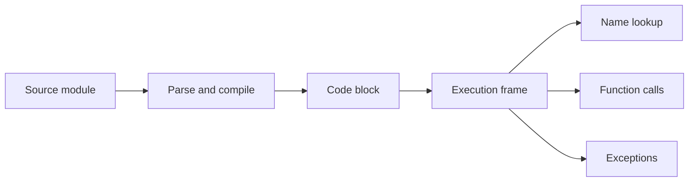

<TLDR>
  <TLDRCell label="what">
    A Python program uses names to refer to objects, expressions to compute values, and statements to bind names, change state, or transfer control.
  </TLDRCell>
  <TLDRCell label="trap">
    Assignment does not copy an object, and types do not belong to variables; several names may refer to the same mutable object.
  </TLDRCell>
  <TLDRCell label="fix">
    Decide what is shared, which inputs are valid, and who handles failure before choosing containers, branches, functions, and exception boundaries.
  </TLDRCell>
</TLDR>

## What it is and why it exists

Python fundamentals are not a syntax inventory. They are the rules that explain program behavior. The most useful rule is that
names refer to objects, while code evaluates or operates on those objects. Once that rule is clear, assignment, argument passing,
mutable containers, conditions, and function calls stop looking like unrelated exceptions.

Python is dynamically typed. Every object has a type, while a name has no fixed type; the same name can refer to objects of
different types at different times. Dynamic typing does not mean the absence of types. An incompatible operation such as adding
a string to an integer still raises `TypeError` at runtime.

A program consists of code blocks. Modules, function bodies, and class definitions are all code blocks. A block runs in an
execution frame, which holds the state for that execution and determines where names are resolved. A Python implementation parses
source before execution. CPython normally also compiles it into bytecode held by code objects, so “interpreted means reading text
one line at a time” is inaccurate.

These rules apply to scripts, command-line tools, web services, and data pipelines. Frameworks add conventions, but they do not
replace the language semantics of name binding, object mutability, function calls, and exception propagation. You need this layer
to judge what library code and generated code will actually do.

## How it works

### From source to code blocks

Python first checks whether it can parse the source, then executes the resulting code blocks. Indentation is syntax: the indented
suite after `if`, `for`, `while`, `def`, `class`, or `try` belongs to that construct. Bad indentation is not a formatting blemish.
It can change control scope or raise `IndentationError`.

The diagram shows only the path needed at the language level. Cached bytecode formats, exact instructions, and optimization
strategies are implementation details and should not become application dependencies.



An expression is evaluated and produces a value, as in `price * quantity`, a function call, or a list literal. A statement performs
an action, as in assignment, import, `return`, or `raise`. One line can contain nested expressions. Treating each line as a separate
unit of execution hides the real boundaries around function bodies, exception handlers, and multiline expressions.

### Names bind to objects

An assignment evaluates its right-hand expression, then binds the target name to the resulting object. `quantity = 3` does not
create a fixed-type box that can hold an integer; it makes `quantity` refer to an integer object. A later `quantity = "3"` rebinds
the name. It does not turn the old integer object into a string.

Function definitions, class definitions, imports, loop targets, and `except ... as ...` also bind names. Python resolves a name by
looking for the nearest binding allowed by the current scope rules. If it cannot find one, it raises `NameError`. The compiler
classifies a function's local names from binding statements before the body runs, which explains why some read-before-assignment
code raises `UnboundLocalError`.

Every object has a value, a type, and an <Term id="object-identity">object identity</Term>. `type(value)` inspects the type,
`==` compares values according to their types, and `is` asks whether two references point to the same object. Identity and type do
not change after object creation. Whether the value can change depends on the type.

### Mutable and immutable objects

Lists, dictionaries, and sets are common mutable objects. `append()`, key assignment, and `add()` modify the existing object, so
every name pointing to it can observe the change. Assigning a new value to one name changes only that binding. It neither modifies
the other names nor copies the old object.

Integers, floats, booleans, strings, bytes, and tuples are common immutable objects. Immutable means the object cannot be changed
in place into another value; `count + 1` produces another integer object. A tuple is immutable but may refer to mutable objects,
so a list held by a tuple can still be modified.

Choose a container for the operations the data needs, not for the shortest spelling.

| Type | Order | Mutable | Typical use |
| --- | --- | --- | --- |
| `list` | Yes | Yes | A sequence whose items may change |
| `tuple` | Yes | No | A fixed grouping of values |
| `dict` | Insertion order | Yes | A mapping from hashable keys to values |
| `set` | No business order | Yes | Uniqueness and membership tests |

Lists and tuples support indexing, slicing, and iteration. Iterating over a dictionary yields keys by default; call `items()` for
key-value pairs. A set expresses uniqueness but should not promise display order. If output must be stable, sort explicitly or use
a structure that already preserves the required order.

### Conditions and loops

`if` and `while` accept any object and apply <Term id="truth-value">truth value testing</Term>. `None`, `False`, numeric zero,
and empty containers are false; other objects are normally true. This convenient rule cannot decide domain meaning for you. In an
inventory system, quantity `0` may be valid while `None` means not supplied, and those states should remain distinct.

`and` and `or` short-circuit and return one of their operands; they do not promise a `bool`. `configured_port or 8000` replaces a
valid zero as well as a missing value. That spelling is correct only when the domain treats every false value as missing. Use an
explicit comparison or `bool()` when the result itself must be Boolean.

`for` takes items from an <Term id="iterable">iterable</Term>; the object does not need to support indexing. Lists, dictionaries,
strings, file objects, and generators are iterable. `range(stop)` produces integers from `0` through `stop - 1`, excluding the
endpoint.

Prefer `for` when the work consumes a group of items. Use `while` when repetition depends on changing state, and make sure every
path back to the condition advances that state. `break` exits the current innermost loop, `continue` moves to its next iteration,
and `return` leaves the entire function.

### Functions, parameters, and return values

Executing a `def` statement creates a function object and binds its name. A call evaluates arguments and binds the resulting
object references to <Term id="parameter">parameters</Term> for that call. The values or expressions supplied at the call site are
<Term id="argument">arguments</Term>.

A parameter is a new local binding, not a copy of the argument object. Rebinding the parameter does not change the caller's name,
but mutating a list or dictionary shared with the caller is observable there. A public function should say through its name and
documentation whether it mutates an input.

`return` hands one object back to the caller. `return minimum, maximum` looks like two values but actually returns one two-item
tuple, which the caller may unpack into two names. If execution reaches no value-bearing `return`, the function returns the singleton
object `None`.

Positional arguments bind by parameter order, while keyword arguments bind by name. A default expression is evaluated once when
`def` executes, not on each call. Ambiguous Boolean switches, units, and timeouts often deserve keyword-only parameters. The
`python/functions` topic develops the full set of signature choices.

### Exceptions and imports

An <Term id="exception">exception</Term> transfers control from the failure point to a matching handler. Python raises exceptions
for runtime errors such as division by zero, invalid conversions, and missing keys. A program can also use `raise` to reject input
that violates its contract. An unhandled exception propagates up the call stack and normally prints a traceback before a script exits.

A `try` block should cover only the operation you are prepared to handle. `except` catches an expected, specific exception; `else`
fits code that should run only after success, and `finally` performs cleanup required on both success and failure. Catching
`Exception` and doing nothing disguises programming mistakes as ordinary results.

`import module` binds a module name, while `from module import name` binds the selected name directly. A module's top-level code
runs on its first successful import and later imports normally reuse the module object cached in `sys.modules`. Keep top-level work
to definitions, constants, and light initialization. Expensive side effects such as network requests or irreversible writes should
not happen quietly during import.

## Examples

### Names, aliases, and rebinding

Start with the behavior most often misread: two names can share one list, while a shallow copy creates another list. Mutating the
shared object and rebinding a name are separate operations.

<Depth level="quick">

```python run title="name_binding.py"
cart = ["keyboard", "mouse"]

# alias and cart refer to the same list.
alias = cart
# A shallow copy creates a new outer list.
snapshot = cart.copy()

alias.append("cable")
print(f"cart={cart}")
print(f"snapshot={snapshot}")
print(f"same_object={alias is cart}")

# Rebinding cart does not change the old list referenced by alias.
cart = [*cart, "adapter"]
print(f"alias={alias}")
print(f"cart={cart}")
print(f"same_object={alias is cart}")
```

```text
cart=['keyboard', 'mouse', 'cable']
snapshot=['keyboard', 'mouse']
same_object=True
alias=['keyboard', 'mouse', 'cable']
cart=['keyboard', 'mouse', 'cable', 'adapter']
same_object=False
```

</Depth>

The first `append()` modifies the shared list, so both `cart` and `alias` see `cable`. `snapshot` has an independent outer list and
keeps the original value. After the unpacking expression creates a new list and rebinds `cart`, `alias` still points to the old list.

### Organizing control flow with a function

The next example puts cart summary rules in a function. It treats the input as read-only and creates its own count result. Unknown
products are returned separately instead of being silently presented as zero-price products inside the loop.

```python run title="cart_summary.py"
def summarize_cart(items, prices, *, minimum_line_total=0):
    counts = {}
    unknown = []

    for item in items:
        if item not in prices:
            unknown.append(item)
            continue
        counts[item] = counts.get(item, 0) + 1

    lines = []
    total = 0
    for item, quantity in counts.items():
        line_total = prices[item] * quantity
        if line_total < minimum_line_total:
            continue
        lines.append(f"{item} x{quantity}: {line_total}")
        total += line_total

    return lines, total, unknown


prices = {"keyboard": 80, "mouse": 25, "cable": 10}
cart = ["keyboard", "mouse", "mouse", "sticker"]
lines, total, unknown = summarize_cart(
    cart, prices, minimum_line_total=20
)

print(*lines, sep="\n")
print(f"total={total}")
print(f"unknown={unknown}")
```

```text
keyboard x1: 80
mouse x2: 50
total=130
unknown=['sticker']
```

`minimum_line_total` is keyword-only, so the call shows what `20` means. The function returns one three-item tuple, which the next
line unpacks. An empty cart also returns three valid empty or zero results without a special branch.

### Raising a specific exception at an input boundary

Text input must be parsed and validated before it reaches the summary logic. This example retains the original exception as the
cause while adding a line number that the caller can act on.

```python run title="parse_cart.py"
def parse_cart(raw):
    items = []

    for line_number, line in enumerate(raw.splitlines(), start=1):
        if not line.strip():
            continue

        name, separator, quantity_text = line.partition("=")
        if not separator or not name.strip():
            raise ValueError(f"line {line_number}: expected name=quantity")

        try:
            quantity = int(quantity_text.strip())
        except ValueError as error:
            raise ValueError(
                f"line {line_number}: quantity must be an integer"
            ) from error

        if quantity < 1:
            raise ValueError(f"line {line_number}: quantity must be positive")
        items.extend([name.strip()] * quantity)

    return items


samples = ["keyboard=1\nmouse=2", "keyboard=one"]
for sample in samples:
    try:
        print(parse_cart(sample))
    except ValueError as error:
        print(f"invalid: {error}")
```

```text
['keyboard', 'mouse', 'mouse']
invalid: line 1: quantity must be an integer
```

The handler catches only the `ValueError` expected by this contract. An unrelated `NameError` or `TypeError` inside the function
will not be mislabeled as an input-format problem. `raise ... from error` also retains the conversion failure in the exception chain.

### Validating deserialized data

Type annotations do not validate runtime data. Successful JSON parsing proves only that the text follows JSON syntax, not that its
fields exist or have the types your program needs. This function checks each item at the boundary before calculating a total.

```python run title="validated_orders.py"
import json


def active_total(raw):
    records = json.loads(raw)
    if not isinstance(records, list):
        raise ValueError("orders must be a list")

    total = 0
    for index, record in enumerate(records):
        if not isinstance(record, dict):
            raise ValueError(f"order {index}: expected an object")

        active = record.get("active")
        cents = record.get("cents")
        if not isinstance(active, bool):
            raise ValueError(f"order {index}: active must be boolean")
        if not isinstance(cents, int) or isinstance(cents, bool):
            raise ValueError(f"order {index}: cents must be an integer")
        if cents < 0:
            raise ValueError(f"order {index}: cents must not be negative")

        if active:
            total += cents

    return total


payload = '[{"active": true, "cents": 1250}, {"active": false, "cents": 900}]'
print(active_total(payload))
```

```text
1250
```

`bool` is a subclass of `int`, so `isinstance(cents, int)` alone accepts `True`. This code excludes booleans because the domain
contract calls for an integer number of cents, not every object that implements integer behavior.

## Pitfalls

> [!PITFALL]
> Treating assignment as copying quietly spreads shared mutable state. `backup = settings` only adds another name for the same dictionary.
>
> **Fix:** Use `copy()` or the corresponding constructor when the outer container must be independent. If nested objects must also
> be independent, decide whether `copy.deepcopy()` matches the domain semantics. State what should remain shared before copying.

> [!PITFALL]
> Comparing string or numeric values with `is` can depend on whether an implementation happened to reuse an object. Equal values do
> not imply identical objects.
>
> **Fix:** Use `==` for value equality and `is` only for identity. Write `value is None` for the missing-value sentinel, and do not
> depend on the concrete number returned by `id()` or on small-integer caching.

> [!PITFALL]
> Using `value or default` for missing data also replaces `0`, `False`, empty strings, and empty containers. If any of them is valid,
> the program loses information.
>
> **Fix:** Compare with `None` explicitly when it means missing. If a dictionary must distinguish an absent key from a false value,
> use `key in mapping` or a separate sentinel object.

> [!PITFALL]
> A list or dictionary used directly as a default parameter is shared by every call that omits that argument. State can leak across
> requests or tests.
>
> **Fix:** Use `None` as the default and create a new container in the function body. If a shared cache is intentional, give it an
> explicit name, owner, and lifetime instead of hiding it in a default parameter.

> [!PITFALL]
> Returning an empty result from a broad `except Exception` swallows misspelled names, invalid attribute access, and contract failures
> together. The caller sees “no data” instead of the defect.
>
> **Fix:** Narrow the `try` suite and catch specific exceptions that this boundary can recover from. Otherwise, add context and
> re-raise while preserving the exception chain. Put cleanup in a context manager or `finally`.

## In the AI era

**What generated code gets wrong here**

Models often describe Python as a language where “variables hold values,” then reuse one list or dictionary during a refactor and
mutate caller-owned data. They also compare strings with `is`, erase valid zeros through `x or default`, generate mutable defaults,
or assume annotations validate JSON. Another frequent failure is a broad `except` that turns a real programming error into an empty
list, `None`, or a fabricated successful response.

**Ask your AI to check**

- List the object aliases involved in every assignment, function call, and container mutation, including which callers observe each change.
- Distinguish `None`, zero, `False`, and empty containers at every condition, and state which operand each short-circuit expression returns.
- Trace each exception from its raise point through matching handlers and propagation, confirming that no handler covers unrelated operations.

**Review checklist**

- Run boundary tests with empty input, zero, absent keys, wrong types, and nested mutable objects.
- Audit `is`, mutable defaults, broad exception handlers, and unvalidated deserialized data.
- Compare input objects before and after each call, and confirm mutation matches the return-value contract.

**Prompt vocabulary**

Use the exact terms `name binding`, `object identity`, `mutable object`, `rebinding`, `truth value testing`,
`short-circuit evaluation`, `argument binding`, and `exception propagation`. Ask for an object-alias table and failure paths;
“check this Python code” is too vague to expose shared state and error boundaries.

<Depth level="deep">

## Name binding, calls, and execution frames

### Scope is classified before execution

Modules, function bodies, and class definitions each establish a code block. A function call creates an execution frame containing
its local namespace, a reference to the global namespace, and the information needed to continue execution. After an ordinary call
returns, its frame is no longer active. Generators, coroutines, closures, and tracebacks complicate lifetime, but name rules still
start from code-block structure.

Python does not require local declarations at the top of a function, but it scans the whole body for binding operations. If a name
is assigned anywhere in a function, it is normally local throughout that function block unless declared `global` or `nonlocal`.
A read before that assignment therefore does not fall back to a same-named global binding.

Assignment is not a value flowing into a box. The right-hand expression finishes evaluation first; then a target name, attribute,
or subscript receives a binding or write operation. Chained assignment can make several names refer to one object. Unpacking first
obtains right-hand items, then binds them to the individual targets.

Augmented assignment deserves separate review. `items += more` first tries an in-place operation, so a list is normally mutated and
other aliases see it. For an immutable integer, `count += 1` produces another object and rebinds the name. The same `+=` spelling
does not promise the same aliasing effect; behavior comes from the left operand's type.

### Argument binding is not a by-value copy

During a call, Python evaluates argument expressions and binds the resulting objects to parameters according to the function
signature. Positional, keyword, positional-only, keyword-only, variadic positional, and variadic keyword parameters define the
binding rules. A missing required argument, duplicate parameter binding, or unknown keyword raises `TypeError` before the body starts.

Both “pass by value” and “pass by reference” invite the wrong picture. More precisely, a call creates new local name bindings to
existing objects. Rebinding a local parameter does not affect the caller's name, while mutating a shared mutable object changes the
value the caller can observe.

Defaults belong to the function object. Each execution of `def` creates a function object and evaluates its default expressions;
later calls that omit arguments reuse those default objects. This timing explains both the mutable-default trap and why a default
does not automatically read configuration that changed just before the call.

Function annotations are metadata for static checkers, editors, documentation tools, and frameworks. An ordinary Python call does
not automatically convert or reject arguments based on annotations. Python 3.14 evaluates annotations lazily by default, but that
change still does not turn annotations into runtime input validators.

### A shallow copy copies only the outer container

`list.copy()`, slicing, and `dict.copy()` create a new outer container whose element references still come from the source. If two
lists both contain one nested dictionary, mutating that dictionary through either list remains visible through the other. A shallow
copy is useful for changing membership independently, not for automatically isolating a whole object graph.

A deep copy recursively builds an object graph, but it is not a universal answer. Database connections, files, locks, caches, and
identity-bearing domain entities may be impossible or wrong to copy. Defining ownership, sharing boundaries, and expected updates
is more reliable than applying `deepcopy()` mechanically.

An immutable container may also refer to mutable objects. A tuple cannot replace its element references, but an element that is a
list can still receive `append()`. “The tuple is immutable” therefore does not mean that every state reachable from it is immutable.

### Truth, equality, and identity answer different questions

Truth testing asks whether an object counts as true in a condition. Equality asks whether two objects have equal values under their
type rules. Identity asks whether two references point to the same object. These questions sometimes produce similar answers but
are not interchangeable.

A custom object is true by default unless its type defines `__bool__()` to return `False`, or defines `__len__()` to return zero
when `__bool__()` is absent. Truth testing itself can raise an exception. A conditional should not assume that every object converts
implicitly to a Boolean without failure.

`and` and `or` evaluate from left to right and stop as soon as the result is known. They return the operand that determines the
result, so `[] or ["fallback"]` yields the second list, while `"ready" and 42` yields the integer `42`. Choosing values this way is
useful only when every false value has the same domain meaning.

### Exceptions are non-local control flow

An exception object carries failure information and searches up the call chain for a compatible `except` clause. Handlers match
the exception class or a non-virtual base class, not the text of the error message. Messages may change across Python versions, so
production logic should not parse them to decide the exception kind.

The termination model of exception handling means a handler does not resume in the middle of the failed expression. A retry must
explicitly run the complete operation again at an outer level, with policies for attempts, idempotency, and backoff. Hiding retries
inside a broad handler can repeat side effects that partly completed.

`else` runs only after the `try` suite completes normally, which keeps exceptions from later success-path work away from an earlier
handler. `finally` runs however control leaves and can restore invariants. Resource objects usually fit `with` better because it
makes the ownership boundary direct.

### A module is an object and a namespace

Each module has its own global namespace. Import first finds and initializes a module, then binds either the module object or a
selected attribute in the current code block. `from module import value` gets the object bound to that attribute at the time; a
later rebinding of the module attribute does not rewrite the importer's existing name.

A successfully initialized module is normally cached in `sys.modules`, so ordinary repeat imports in one interpreter do not rerun
all top-level code. Import order can still matter: circular imports may observe a partly initialized module, while import-time side
effects can make tests and startup depend on the environment. Put an executable entry point under
`if __name__ == "__main__":` so importing the module does not start the main flow.

The standard library ships with Python but is not one automatically imported global collection. You still import `json`, `pathlib`,
or `collections` before use. Third-party packages must also be installed in the project environment with versions locked; that
belongs to the `python/venv` and `python/packaging` topics.

</Depth>

<Checkpoint id="python/python-fundamentals" />

## Further reading

- [Python language reference: execution model](https://docs.python.org/3/reference/executionmodel.html)
- [Python language reference: data model](https://docs.python.org/3/reference/datamodel.html)
- [Python standard library: built-in types](https://docs.python.org/3/library/stdtypes.html)
- [Python tutorial: more control flow tools](https://docs.python.org/3/tutorial/controlflow.html)
- [Python tutorial: errors and exceptions](https://docs.python.org/3/tutorial/errors.html)
