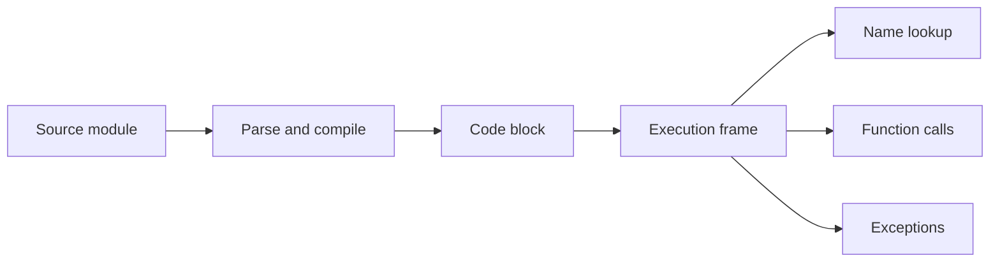

<TLDR>
  <TLDRCell label="what">
    Python 程序通过名称引用对象，用表达式计算值，用语句绑定名称、改变状态或转移控制流。
  </TLDRCell>
  <TLDRCell label="trap">
    赋值不会复制对象，类型也不属于变量；多个名称可能指向同一个可变对象。
  </TLDRCell>
  <TLDRCell label="fix">
    先明确对象是否共享、输入是否有效、失败由谁处理，再选择容器、分支、函数和异常边界。
  </TLDRCell>
</TLDR>

## 是什么，为什么存在

Python 基础不是一张语法清单，而是一组解释程序行为的规则。最重要的一条是：
名称引用对象，代码对对象求值或执行操作。理解这条规则后，赋值、参数传递、可变容器、
条件判断与函数调用就不再是互不相关的特例。

Python 是动态类型语言。每个对象都有类型，名称本身没有固定类型；同一个名称可以在不同时间
绑定到不同类型的对象。动态类型不等于没有类型，像字符串加整数这样的不兼容操作仍会在
运行时抛出 `TypeError`。

程序由代码块组成，模块、函数体和类定义都是代码块。代码块在执行帧中运行，执行帧保存本次
执行所需的状态，并决定名称在哪里查找。Python 实现会先解析源码；以 CPython 为例，源码通常
还会编译成代码对象中的字节码，因此“解释型语言就是逐行执行文本”并不准确。

这些规则适用于脚本、命令行工具、Web 服务和数据处理程序。框架会增加约定，却不会改变
名称绑定、对象可变性、函数调用和异常传播的语言语义。掌握这层基础，才能判断库代码与生成代码
究竟在做什么。

## 工作原理

### 从源码到代码块

Python 先检查源码能否按语法解析，再执行得到的代码块。缩进是语法的一部分：`if`、`for`、
`while`、`def`、`class` 和 `try` 后面的缩进语句组属于相应代码块。混乱的缩进不是排版瑕疵，
而是可能改变控制范围或直接触发 `IndentationError` 的程序错误。

下面的图只描述语言层面需要理解的路径。缓存的字节码格式、具体指令和优化策略属于实现细节，
不应成为应用代码的依赖。



表达式（expression）会被求值并产生一个值，例如 `price * quantity`、函数调用或列表字面量。
语句（statement）执行动作，例如赋值、导入、`return` 或 `raise`。一行可以包含嵌套表达式，
但把“每一行”当作一个独立执行单位，会掩盖函数体、异常处理和多行表达式的真实边界。

### 名称绑定对象

赋值语句先计算右侧表达式，再把左侧名称绑定到所得对象。`quantity = 3` 没有创建一个能容纳整数的
固定类型盒子；它让名称 `quantity` 引用一个整数对象。后续写 `quantity = "3"` 是重新绑定，
原来的整数对象不会因此变成字符串。

函数定义、类定义、导入、循环目标和 `except ... as ...` 也会绑定名称。读取名称时，Python 按当前
作用域规则寻找最近的绑定；完全找不到就抛出 `NameError`。函数中的局部名称在函数体开始执行前
就由编译器根据绑定语句确定，这也是某些“先读取、后赋值”代码会抛出 `UnboundLocalError` 的原因。

每个对象都有值、类型和<Term id="object-identity">对象标识（object identity）</Term>。
`type(value)` 查看类型，`==` 比较值是否相等，`is` 比较两个引用是否指向同一个对象。
对象创建后，标识与类型不变；对象的值能否变化则取决于它的类型。

### 可变对象与不可变对象

列表、字典和集合是常见的可变对象。`append()`、键赋值和 `add()` 会修改原对象，所以所有指向
该对象的名称都能观察到变化。给其中一个名称重新赋值只会改变该名称的绑定，不会修改其他名称，
也不会自动复制旧对象。

整数、浮点数、布尔值、字符串、字节串和元组是常见的不可变对象。所谓不可变，是说对象创建后
不能原地改成另一个值；表达式 `count + 1` 会得到另一个整数对象。元组本身不可变，但元组可以
引用可变对象，因此元组中的列表仍然能被修改。

容器的选择取决于数据需要什么操作，而不是哪种写法更短。

| 类型 | 顺序 | 可变 | 典型用途 |
| --- | --- | --- | --- |
| `list` | 有 | 是 | 可增删的项目序列 |
| `tuple` | 有 | 否 | 固定结构的值组合 |
| `dict` | 保留插入顺序 | 是 | 从可哈希键映射到值 |
| `set` | 不提供业务顺序 | 是 | 去重与成员检测 |

列表和元组支持索引、切片与迭代。字典遍历默认产生键，遍历键值对要调用 `items()`。集合适合表达
唯一性，却不该用来承诺显示顺序；如果输出必须稳定，就显式排序，或选择本来就保存所需顺序的结构。

### 条件与循环

`if` 和 `while` 接受任意对象，并对它执行<Term id="truth-value">真值测试（truth value testing）</Term>。
`None`、`False`、数值零和空容器为假，其他对象通常为真。这个便利规则不能替你决定业务含义：
在库存系统里，数量 `0` 可能是有效值，而 `None` 表示尚未提供，两者不应混在一起。

`and` 与 `or` 会短路，并返回某个操作数，不保证返回 `bool`。`configured_port or 8000` 会把有效的
零值替换掉；只有业务规则确实把所有假值都视为缺失时，这种写法才正确。需要布尔结果时，可以
显式比较或调用 `bool()`。

`for` 从<Term id="iterable">可迭代对象（iterable）</Term>逐项取值，不要求被迭代对象支持索引。
列表、字典、字符串、文件对象和生成器都可迭代。`range(stop)` 产生从 `0` 到 `stop - 1` 的整数，
不会把终点包含在内。

当工作是消费一组项目时，优先使用 `for`。只有重复取决于变化状态时才使用 `while`，并确保每条
回到条件的路径都推进状态。`break` 结束当前最内层循环，`continue` 只跳到下一轮，`return`
则离开整个函数。

### 函数、参数与返回值

执行 `def` 语句会创建函数对象，并把函数名绑定到它。函数调用先求值实参，再把得到的对象引用
绑定到本次调用的<Term id="parameter">形参（parameter）</Term>。调用位置提供的值或表达式叫作
<Term id="argument">实参（argument）</Term>。

形参是新的局部绑定，不是实参对象的副本。函数重新绑定形参，不会改变调用方的名称；函数修改
双方共享的列表或字典，调用方则能看到变化。公开函数应从名称和文档明确说明是否会修改传入对象。

`return` 把一个对象交回调用方。`return minimum, maximum` 看似返回两个值，实际返回一个二元组；
调用方可以再将它解包到两个名称。没有执行到带值的 `return` 时，函数返回单例对象 `None`。

位置实参按形参顺序绑定，关键字实参按名称绑定。默认表达式在执行 `def` 时求值一次，而不是每次
调用时求值。容易混淆的布尔开关、单位和超时适合设计成仅限关键字形参；完整的签名设计由
`python/functions` 专题继续讲解。

### 异常与导入

<Term id="exception">异常（exception）</Term>会把控制从失败点转移到匹配的处理器。Python 会为
除零、无效转换和缺少键等运行时错误抛出异常，程序也可以用 `raise` 明确拒绝不满足契约的输入。
未处理的异常会沿调用栈传播，最终通常打印回溯并结束脚本。

`try` 块只应包住你准备处理的操作。`except` 捕获预期的具体异常，`else` 适合放只有成功后才执行的
代码，`finally` 负责无论成功或失败都必须执行的清理。捕获 `Exception` 后什么也不做，会把编程错误
伪装成正常结果。

`import module` 会绑定模块名称，`from module import name` 会直接绑定所选名称。模块第一次成功导入时
会执行其顶层代码，之后通常从 `sys.modules` 缓存复用模块对象。模块顶层应以定义、常量和轻量初始化
为主；网络请求或不可逆写入等昂贵副作用不应悄悄发生在导入阶段。

## 示例

### 名称、别名与重新绑定

先观察最容易误判的部分：两个名称可以共享一个列表，而浅复制得到另一个列表。修改共享对象与
重新绑定名称是两件不同的事。

<Depth level="quick">

```python run title="name_binding.py"
cart = ["keyboard", "mouse"]

# alias 与 cart 指向同一个列表。
alias = cart
# 浅复制会创建一个新的外层列表。
snapshot = cart.copy()

alias.append("cable")
print(f"cart={cart}")
print(f"snapshot={snapshot}")
print(f"same_object={alias is cart}")

# 重新绑定 cart，不会改变 alias 指向的旧列表。
cart = [*cart, "adapter"]
print(f"alias={alias}")
print(f"cart={cart}")
print(f"same_object={alias is cart}")
```

```text
cart=['keyboard', 'mouse', 'cable']
snapshot=['keyboard', 'mouse']
same_object=True
alias=['keyboard', 'mouse', 'cable']
cart=['keyboard', 'mouse', 'cable', 'adapter']
same_object=False
```

</Depth>

第一次 `append()` 修改了共享列表，因此 `cart` 与 `alias` 都能看到 `cable`。`snapshot` 是独立的
外层列表，所以保持原值。列表展开式创建新列表并重新绑定 `cart` 后，`alias` 仍指向原来的列表。

### 用函数组织控制流

下一步把购物车汇总规则放进函数。输入只读，计数结果由函数自己创建；未知商品被单独返回，
而不是在循环中静默伪装成零价格商品。

```python run title="cart_summary.py"
def summarize_cart(items, prices, *, minimum_line_total=0):
    counts = {}
    unknown = []

    for item in items:
        if item not in prices:
            unknown.append(item)
            continue
        counts[item] = counts.get(item, 0) + 1

    lines = []
    total = 0
    for item, quantity in counts.items():
        line_total = prices[item] * quantity
        if line_total < minimum_line_total:
            continue
        lines.append(f"{item} x{quantity}: {line_total}")
        total += line_total

    return lines, total, unknown


prices = {"keyboard": 80, "mouse": 25, "cable": 10}
cart = ["keyboard", "mouse", "mouse", "sticker"]
lines, total, unknown = summarize_cart(
    cart, prices, minimum_line_total=20
)

print(*lines, sep="\n")
print(f"total={total}")
print(f"unknown={unknown}")
```

```text
keyboard x1: 80
mouse x2: 50
total=130
unknown=['sticker']
```

`minimum_line_total` 是仅限关键字形参，调用处能看出 `20` 的含义。函数返回一个三元组，随后被解包。
空购物车也能正常返回三个空结果或零值，不需要另设分支。

### 在输入边界抛出具体异常

文本输入必须先解析并验证，才能进入前面的汇总逻辑。这个例子保留原始异常作为原因，同时把
错误补充为调用方能定位的行号。

```python run title="parse_cart.py"
def parse_cart(raw):
    items = []

    for line_number, line in enumerate(raw.splitlines(), start=1):
        if not line.strip():
            continue

        name, separator, quantity_text = line.partition("=")
        if not separator or not name.strip():
            raise ValueError(f"line {line_number}: expected name=quantity")

        try:
            quantity = int(quantity_text.strip())
        except ValueError as error:
            raise ValueError(
                f"line {line_number}: quantity must be an integer"
            ) from error

        if quantity < 1:
            raise ValueError(f"line {line_number}: quantity must be positive")
        items.extend([name.strip()] * quantity)

    return items


samples = ["keyboard=1\nmouse=2", "keyboard=one"]
for sample in samples:
    try:
        print(parse_cart(sample))
    except ValueError as error:
        print(f"invalid: {error}")
```

```text
['keyboard', 'mouse', 'mouse']
invalid: line 1: quantity must be an integer
```

处理器只捕获这层契约预期的 `ValueError`。如果函数内部出现无关的 `NameError` 或 `TypeError`，
它们不会被误报成输入格式问题。`raise ... from error` 还保留了转换失败的异常链，便于诊断。

### 验证反序列化数据

类型注解不会验证运行时数据。JSON 能成功解析，只说明文本符合 JSON 语法，并不保证字段存在或
具有程序需要的类型。下面的函数在边界逐项检查，再计算总额。

```python run title="validated_orders.py"
import json


def active_total(raw):
    records = json.loads(raw)
    if not isinstance(records, list):
        raise ValueError("orders must be a list")

    total = 0
    for index, record in enumerate(records):
        if not isinstance(record, dict):
            raise ValueError(f"order {index}: expected an object")

        active = record.get("active")
        cents = record.get("cents")
        if not isinstance(active, bool):
            raise ValueError(f"order {index}: active must be boolean")
        if not isinstance(cents, int) or isinstance(cents, bool):
            raise ValueError(f"order {index}: cents must be an integer")
        if cents < 0:
            raise ValueError(f"order {index}: cents must not be negative")

        if active:
            total += cents

    return total


payload = '[{"active": true, "cents": 1250}, {"active": false, "cents": 900}]'
print(active_total(payload))
```

```text
1250
```

`bool` 是 `int` 的子类，因此只写 `isinstance(cents, int)` 会接受 `True`。这里额外排除布尔值，
是因为订单金额的领域契约需要整数分值，而不是所有具备整数行为的对象。

## 陷阱

> [!PITFALL]
> 把赋值理解成复制，会让共享可变状态悄悄传播。`backup = settings` 只是增加一个指向同一字典的名称。
>
> **修复方法：** 需要独立外层容器时使用 `copy()` 或相应构造器；嵌套对象也必须独立时，再评估
> `copy.deepcopy()` 是否符合领域语义。复制前先写清楚哪些对象应共享。

> [!PITFALL]
> 用 `is` 比较字符串或数字的值，结果可能依赖实现是否复用了某个对象。值相等不代表对象标识相同。
>
> **修复方法：** 值比较使用 `==`，对象标识比较才使用 `is`。检查缺失哨兵时写 `value is None`，
> 不要依赖 `id()` 的具体数值或小整数缓存。

> [!PITFALL]
> 用 `value or default` 处理缺失值，会同时替换 `0`、`False`、空字符串和空容器。只要其中任何一个
> 是有效输入，程序就会丢失信息。
>
> **修复方法：** `None` 表示缺失时显式写 `value is None`；字典需要区分缺少键与假值时，使用
> `key in mapping` 或独立哨兵对象。

> [!PITFALL]
> 把列表或字典直接写成默认参数，会让省略该实参的多次调用复用同一个对象。状态可能跨请求或测试泄漏。
>
> **修复方法：** 默认值使用 `None`，并在函数体内创建新容器。确实需要共享缓存时，让它有明确的
> 名称、所有者与生命周期，不要借默认参数暗中保存。

> [!PITFALL]
> 用宽泛的 `except Exception` 返回空结果，会把拼写错误、错误属性访问和契约失败一起吞掉。
> 调用方看到“没有数据”，却看不到真正的缺陷。
>
> **修复方法：** 缩小 `try` 范围，捕获可以在当前边界恢复的具体异常。无法恢复时补充上下文并继续
> 抛出，同时保留异常链；资源清理放在上下文管理器或 `finally` 中。

<Depth level="deep">

## 名称绑定、调用与执行帧

### 作用域先于执行确定

模块、函数体与类定义各自建立代码块。函数调用会创建新的执行帧，其中包含局部名称空间、对全局名称空间
的引用和继续执行所需的信息。函数返回后，该次普通调用的帧不再是活动帧；生成器、协程、闭包和回溯
会让生命周期更复杂，但名称规则仍从代码块结构出发。

Python 不要求在函数开头声明局部变量，却会扫描整个函数体中的绑定操作。只要函数内某处给名称赋值，
该名称通常在整个函数块中都按局部名称处理，除非使用 `global` 或 `nonlocal`。因此，即使赋值写在读取之后，
读取也不会自动退回同名全局绑定。

赋值不是表达式值流入盒子的过程。右侧表达式先完成求值，然后目标名称、属性或下标接收绑定或写入操作。
链式赋值可以让多个名称引用同一对象；解包赋值会先取得右侧项目，再把它们分别绑定到目标。

增量赋值需要单独审查。`items += more` 会先尝试原地操作，所以列表通常被修改，其他别名可见；
`count += 1` 面对不可变整数时会得到新对象并重新绑定名称。相同的 `+=` 拼写不保证相同的别名效果，
行为由左侧对象类型实现。

### 参数绑定不是按值复制

调用函数时，实参表达式会先求值，所得对象再按照函数签名绑定到形参。位置、关键字、仅限位置、仅限关键字、
可变位置与可变关键字形参决定绑定规则。缺少必需实参、重复绑定同一形参或传入未知关键字时，函数体开始前
就会抛出 `TypeError`。

“按值传递”与“按引用传递”都容易造成误解。更准确的说法是，调用创建新的局部名称绑定，而传入的是现有
对象的引用。重新绑定局部形参不会影响调用方名称，修改共享可变对象则会影响调用方能观察到的值。

默认参数属于函数对象。每次执行 `def` 会创建一个函数对象并求值默认表达式；之后省略实参的调用复用这些
默认对象。这个时机既解释了可变默认参数陷阱，也解释了默认值为何不会自动读取调用时刚刚变化的配置。

函数注解是供静态检查器、编辑器、文档工具和框架使用的元数据。普通 Python 调用不会依据注解自动转换或
拒绝实参。Python 3.14 默认延迟求值注解，但这项变化仍没有把注解变成运行时输入验证器。

### 浅复制只复制外层容器

`list.copy()`、切片与 `dict.copy()` 创建新的外层容器，其中的元素引用仍来自原容器。若两个列表都包含
同一个嵌套字典，通过任一列表修改该字典，另一个列表仍能观察到。浅复制适合独立调整容器成员，不适合自动
隔离整张对象图。

深复制会递归构造对象图，但它也不是通用答案。数据库连接、文件、锁、缓存与带标识的领域实体可能不能或
不应该被复制。比起机械调用 `deepcopy()`，先定义所有权、共享边界和期望的更新方式更可靠。

不可变容器也可能引用可变对象。例如，元组不能替换自己的元素引用，但元素若是列表，仍可执行 `append()`。
所以“元组不可变”不能推出“从这个元组可达的所有状态都不会变化”。

### 真值、相等与标识回答不同问题

真值测试回答“这个对象在条件中算真还是假”。相等比较回答“两个对象的值按其类型规则是否相等”。标识比较
回答“两个引用是否指向同一对象”。这三个问题有时得到相似结果，却不能互换。

自定义对象默认视为真，除非类型实现的 `__bool__()` 返回 `False`，或在没有 `__bool__()` 时由 `__len__()`
返回零。真值测试本身也可能抛出异常。条件分支不应假定所有对象都能安全地隐式转换成布尔值。

`and` 与 `or` 从左到右求值，并在结果已确定时停止。它们返回触发结果的操作数，所以 `[] or ["fallback"]`
得到后一个列表，而 `"ready" and 42` 得到整数 `42`。这种选择值的能力很实用，但前提是所有假值在领域中
具有相同含义。

### 异常是非局部控制流

异常对象携带失败信息，并沿调用链寻找兼容的 `except` 子句。处理器匹配异常类或其非虚基类，而不是比较
错误消息文本。错误消息可能随 Python 版本变化，生产逻辑不应解析它来判断异常种类。

异常处理的终止模型意味着处理器不会回到失败表达式中间继续。需要重试时，应在更外层明确重新执行完整操作，
并为次数、幂等性和退避制定规则。把重试藏在过宽的处理器里，容易重复已经完成一部分的副作用。

`else` 只在 `try` 正常完成时执行，可以避免把成功路径后续产生的异常误交给前面的处理器。`finally` 无论
控制如何离开都会执行，适合恢复不变量；资源对象通常更适合用 `with`，因为所有权边界更直接。

### 模块也是对象与名称空间

每个模块有自己的全局名称空间。导入语句先找到并初始化模块，再在当前代码块中绑定模块对象或选定属性。
`from module import value` 得到的是当时绑定到属性的对象引用；之后模块重新绑定该属性，不会自动改写导入方
已经存在的名称。

成功初始化的模块通常缓存在 `sys.modules` 中，所以同一解释器里的普通重复导入不会重复执行所有顶层代码。
这不意味着导入顺序无关：循环导入可能观察到只初始化了一部分的模块，导入时副作用也会让测试和启动行为
依赖环境。把可执行入口放在 `if __name__ == "__main__":` 下，可以避免模块仅被导入时启动主流程。

标准库随 Python 发布，但它不是自动导入的全局集合。使用 `json`、`pathlib` 或 `collections` 前仍需导入。
第三方包还需要由项目环境安装并锁定版本；这属于 `python/venv` 与 `python/packaging` 的范围。

</Depth>

<Checkpoint id="python/python-fundamentals" />

## 延伸阅读

- [Python 语言参考：执行模型](https://docs.python.org/3/reference/executionmodel.html)
- [Python 语言参考：数据模型](https://docs.python.org/3/reference/datamodel.html)
- [Python 标准库：内置类型](https://docs.python.org/3/library/stdtypes.html)
- [Python 教程：更多控制流工具](https://docs.python.org/3/tutorial/controlflow.html)
- [Python 教程：错误与异常](https://docs.python.org/3/tutorial/errors.html)
