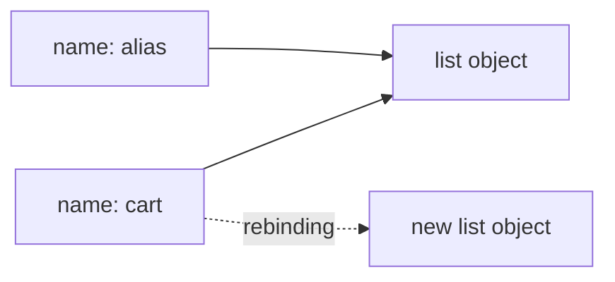

<TLDR>
  <TLDRCell label="what">
    A Python variable is a name that refers to an object, not a fixed-type container; the object has a type, and the name can be rebound to another object.
  </TLDRCell>
  <TLDRCell label="trap">
    Assignment does not copy an object, so several names for one list or dictionary all observe in-place changes; `0`, `False`, empty containers, and `None` are not interchangeable either.
  </TLDRCell>
  <TLDRCell label="fix">
    Distinguish rebinding from mutation, convert and validate types explicitly at input boundaries, and use `==` for values while reserving `is` for sentinels such as `None`.
  </TLDRCell>
</TLDR>

## What it is and why it exists

A Python variable is more precisely a name. When an assignment runs, Python evaluates the right-hand expression and then binds the left-hand name to the resulting object. The name has no fixed type; the object has a type, value, and identity.

This <Term id="name-binding">name binding</Term> model lets the same code work with different objects that support the required operations. It also lets names refer to functions, classes, and modules just as they refer to data. The tradeoff is that you must separate two actions: pointing a name at another object, called rebinding, and changing an object through a name, called mutation.

A data type determines which operations an object supports and whether its value can change. `int`, `float`, `complex`, `bool`, `str`, and `NoneType` are common scalar types; `list`, `tuple`, `dict`, and `set` organize several objects. Variable assignment, function parameters, loop targets, and imported names all follow the same binding model.

These rules show up when you read configuration, parse JSON, calculate money, pass lists, or handle optional values. Bugs that seem unrelated, such as a shared list changing unexpectedly or a valid zero being replaced by a default, often come from treating names, objects, and types as one concept.

## How it works

### Names bind to objects

Every Python object has a value, a type, and an <Term id="object-identity">object identity</Term>. `type(value)` returns the object's type, `id(value)` returns an integer representing its identity, and `is` asks whether two references point to the same object. An object's type and identity do not change after creation.

The assignment `quantity = 3` makes the name `quantity` refer to an integer object. Running `quantity = "3"` later rebinds the name: it now refers to a string, while the former integer did not become a string. If nothing else refers to the old object, it can eventually be reclaimed.

Ordinary assignment is not the only construct that introduces names. Function and class definitions, imports, function parameters, `for` targets, `with ... as ...`, and the `as` target in an exception handler all bind names. The containing code block determines the scope of each binding.



In the diagram, `cart` and `alias` initially refer to one list, so a mutation through either name is visible through the other. After `cart` is rebound, `alias` still refers to the old list. An arrow changed; no object was copied automatically.

### Built-in types have distinct jobs

Python's built-in types are not labels that can be swapped freely. A type defines valid operations: strings support concatenation, integers support bitwise operations, and dictionaries retrieve values by key. Applying an incompatible operation usually raises `TypeError` instead of guessing what you intended.

| Type | Meaning | Mutability | Common boundary |
| --- | --- | --- | --- |
| `int` | Arbitrary-precision integer | Immutable | `bool` is a subclass |
| `float` | Usually a machine double-precision value | Immutable | Many decimal fractions are not represented exactly |
| `complex` | Floating-point real and imaginary parts | Immutable | No ordering comparisons |
| `bool` | `True` or `False` | Immutable | Participates in integer arithmetic despite different domain meaning |
| `str` | Unicode text sequence | Immutable | Indexing returns strings; characters cannot change in place |
| `NoneType` | The singleton `None` for absence or no result | Immutable | Check with `is None` |

Container types hold references to other objects. Lists, dictionaries, and sets can change in place. A tuple cannot replace the references in its own slots, but a list referenced by a tuple can still change. "The container is immutable" therefore does not mean everything reachable from it is immutable.

### Assignment, unpacking, and aliases

Comma-separated targets can bind several names at once. `left, right = right, left` evaluates the right-hand objects before unpacking them into the targets, so no temporary name is needed. A mismatch between the targets and the number of items from the right-hand iterable raises `ValueError`.

Chained assignment `primary = backup = []` creates one list and binds both names to it. It is not the same as evaluating `[]` independently twice. Create containers separately, or make an explicit copy at the required depth, when they must be independent.

Augmented assignment depends on the object's type. A list's `items += more` normally extends the existing list in place, which its other aliases observe. An integer's `count += 1` creates another integer and rebinds `count`. The shared-state effect is not guaranteed by the spelling of the operator alone.

### Dynamic typing still has types

Python uses <Term id="dynamic-typing">dynamic typing</Term>: a name does not permanently declare one type, and operations check their objects while the program runs. Rebinding a name from an integer to a string is legal, but the expression `"3" + 2` still raises `TypeError`. Dynamic typing does not mean that all types are automatically compatible.

Type annotations can describe an expected contract, such as `quantity: int` or `def total(price: int) -> int`. An ordinary Python call does not automatically convert or reject arguments based on those annotations. Static type checkers, editors, and frameworks may read them, but your code must still validate runtime input.

Before allowing several types, ask whether they really share one domain meaning. Accepting `int | float` may fit a general measurement but not an amount in integer cents. Because `bool` is a subclass of `int`, a simple `isinstance(value, int)` can also be broader than the contract.

### Truth, absence, and Boolean operations

Conditions apply <Term id="truth-value">truth value testing</Term> to any object. `None`, `False`, numeric zeros, and empty containers are normally false; other objects are normally true. A custom type can define its truth value through `__bool__()` or `__len__()`.

The same truth value does not imply the same domain meaning. An inventory quantity of `0` can mean known to be out of stock, while `None` can mean not counted yet. An empty string may be a valid input or a missing field. A condition must preserve the distinctions required by the domain.

`and` and `or` short-circuit and return an operand; they do not guarantee a `bool`. `configured_port or 8000` returns `8000` when the port is `0` too. That expression matches the contract only if every false value should select the same default.

### Explicit conversion and type checks

`int()`, `float()`, `str()`, and `bool()` construct objects of their target types, but they are not general data cleaners. `int(3.9)` truncates toward zero to `3`, `int("3.9")` raises `ValueError`, and `bool("false")` is `True` because every non-empty string is true.

Mixed arithmetic on built-in numeric types performs specified numeric widening; adding an integer to a float, for example, produces a float. This does not mean Python generally converts strings to numbers. Parse external text against an explicit format at the boundary and give failures a specific path.

`isinstance(value, ExpectedType)` accounts for subclasses and is usually suitable for checking a type family. `type(value) is ExpectedType` accepts only the exact type and has narrower uses. When a domain requires an integer but excludes booleans, combine `isinstance(value, int)` with `not isinstance(value, bool)`.

## Examples

### Inspecting the types of bound objects

The first example combines assignment, unpacking, and rebinding. The type of `quantity` changes because the name points to a new object, not because the old object changed its type.

<Depth level="quick">

```python run title="bindings_and_types.py"
order_id = "A-104"
quantity = 3
unit_price = 19.5
paid = False
missing_note = None
route = ("warehouse", "store")

# Rebinding a name does not change the old integer object.
quantity = "3"

values = {
    "order_id": order_id,
    "quantity": quantity,
    "unit_price": unit_price,
    "paid": paid,
    "missing_note": missing_note,
    "route": route,
}
for label, value in values.items():
    print(f"{label}: {type(value).__name__} = {value!r}")
```

```text
order_id: str = 'A-104'
quantity: str = '3'
unit_price: float = 19.5
paid: bool = False
missing_note: NoneType = None
route: tuple = ('warehouse', 'store')
```

</Depth>

`type(value).__name__` is useful for demonstrations and diagnostics, but production logic should rarely branch on type-name strings. Pass type objects directly to `isinstance()` when you actually need a type check.

The dictionary stores object references, so each `value` obtained by the loop is still the original object. The quotes in the printed representations come from `!r`, which makes strings easy to distinguish from numbers.

### Separating mutation from rebinding

The second example gives two names to one list and retains a shallow copy. Watch the contents and identity relationships after each operation.

```python run title="aliasing.py"
cart = ["keyboard", "mouse"]

# alias and cart refer to the same list.
alias = cart
# A shallow copy creates a new outer list.
snapshot = cart.copy()

alias.append("cable")
print(f"cart={cart}")
print(f"snapshot={snapshot}")
print(f"alias_is_cart={alias is cart}")

# This expression creates a list and then rebinds only cart.
cart = [*cart, "adapter"]
print(f"alias={alias}")
print(f"cart={cart}")
print(f"alias_is_cart={alias is cart}")
```

```text
cart=['keyboard', 'mouse', 'cable']
snapshot=['keyboard', 'mouse']
alias_is_cart=True
alias=['keyboard', 'mouse', 'cable']
cart=['keyboard', 'mouse', 'cable', 'adapter']
alias_is_cart=False
```

`append()` changes the shared list, so `cart` and `alias` initially both observe `cable`. `snapshot` is a different outer list and is unaffected by that mutation.

The starred list expression creates a new list and binds `cart` to it. `alias` keeps referring to the old list, demonstrating that rebinding one name does not chase down and update its aliases.

### Converting text at a boundary

Values from command lines, environment variables, and forms commonly arrive as text. A conversion function should define both the permitted format and numeric range instead of replacing every failure with a normal-looking default.

```python run title="parse_quantity.py"
def parse_quantity(raw: str) -> int:
    try:
        quantity = int(raw)
    except ValueError as error:
        raise ValueError("quantity must be a base-10 integer") from error

    if quantity < 0:
        raise ValueError("quantity must not be negative")
    return quantity


samples = ["12", "3.5", "-1", ""]
for sample in samples:
    try:
        print(f"{sample!r} -> {parse_quantity(sample)}")
    except ValueError as error:
        print(f"{sample!r} -> invalid: {error}")
```

```text
'12' -> 12
'3.5' -> invalid: quantity must be a base-10 integer
'-1' -> invalid: quantity must not be negative
'' -> invalid: quantity must be a base-10 integer
```

The `try` suite covers only `int(raw)`, the operation expected to fail during conversion. The function does not catch every `Exception`, so a programming error later in the code will not be disguised as bad input.

`raise ... from error` retains the original `ValueError` as the cause while giving the caller a stable domain message. Callers should respond to the exception type rather than parse Python's built-in error text.

### Validating deserialized types

Successful JSON parsing proves that the text is valid JSON, not that its fields match the application contract. This example checks the container, Boolean field, and integer cents in layers, explicitly excluding `bool`.

```python run title="validated_orders.py"
import json


def active_total(raw: str) -> int:
    records = json.loads(raw)
    if not isinstance(records, list):
        raise ValueError("orders must be a list")

    total = 0
    for index, record in enumerate(records):
        if not isinstance(record, dict):
            raise ValueError(f"order {index}: expected an object")

        active = record.get("active")
        cents = record.get("cents")
        if not isinstance(active, bool):
            raise ValueError(f"order {index}: active must be boolean")
        if not isinstance(cents, int) or isinstance(cents, bool):
            raise ValueError(f"order {index}: cents must be an integer")
        if cents < 0:
            raise ValueError(f"order {index}: cents must not be negative")

        if active:
            total += cents

    return total


payloads = [
    '[{"active": true, "cents": 1250}, {"active": false, "cents": 900}]',
    '[{"active": true, "cents": true}]',
]
for payload in payloads:
    try:
        print(active_total(payload))
    except ValueError as error:
        print(f"invalid: {error}")
```

```text
1250
invalid: order 0: cents must be an integer
```

Although `isinstance(True, int)` is true, the cents field should not accept a Boolean. The checks establish the type before comparing the numeric range, avoiding `<` on an incompatible type.

The function neither retains the input records nor mutates the parsed list. Every call starts with a local `total = 0`, so no hidden state is shared between requests.

## Pitfalls

> [!PITFALL]
> Treating assignment as copying creates hidden shared state. `backup = settings` only adds another name for the same dictionary.
>
> **Fix:** Use `copy()` or the corresponding constructor when the outer container must be independent. If nested objects must be independent too, state the ownership and sharing boundary before deciding whether `copy.deepcopy()` matches the domain.

> [!PITFALL]
> Comparing strings or numbers with `is` depends on whether an implementation happened to reuse an object. Equal values do not imply identical objects.
>
> **Fix:** Use `==` for value equality and `is` only for identity. Write `value is None` for an absent-value sentinel, and never rely on implementation details such as small-integer caching or string interning.

> [!PITFALL]
> Conversion functions are easily mistaken for validation rules. `bool("false")` is true, `int(3.9)` truncates toward zero, and `isinstance(True, int)` is true as well.
>
> **Fix:** Define the permitted source types, text format, and range before converting. Explicitly exclude `bool` when the domain requires an integer, and do not use one constructor call as the whole input contract.

> [!PITFALL]
> Using `value or default` for missing data also replaces a valid `0`, `False`, empty string, or empty container. The program loses states that were originally distinct.
>
> **Fix:** Compare explicitly with `None` when only `None` means missing. When a dictionary must distinguish an absent key from a false value, use `key in mapping` or a separate sentinel object.

> [!PITFALL]
> Binary floating-point cannot represent many decimal fractions exactly, so `0.1 + 0.2 == 0.3` is false. Direct equality checks or accumulated settlement values can therefore be wrong for money.
>
> **Fix:** Compare measurements with `math.isclose()` and an explicit tolerance. Represent money as integer minor units or construct `decimal.Decimal` from strings; do not pass through an inexact `float` first.

> [!PITFALL]
> Type annotations do not automatically validate function arguments, JSON fields, or configuration values. A function annotated with `payload: dict[str, int]` can still receive a string at runtime.
>
> **Fix:** Keep annotations for static checking and tooling, and perform runtime validation where untrusted data enters the system. Test wrong types, not only ideal input.

## In the AI era

**What generated code gets wrong here**

Generated code often treats annotations as runtime validation and immediately performs arithmetic on JSON fields. It also erases valid zeros with `value or default` or admits booleans with `isinstance(value, int)`. During list refactors, a model may turn a copy into an alias or a non-mutating expression into `+=`, quietly changing caller-visible state. Another common mistake is using `float` for money and trying to hide accumulated error with `round()`.

**Ask your AI to check**

- List the name-to-object mapping after every assignment and identify mutable objects with more than one alias.
- For every external field, state the accepted source types, conversion rule, range, and failure behavior, with a separate check for the `bool` and `int` relationship.
- Trace `None`, zero, `False`, empty strings, and empty containers through conditions and default expressions.

**Review checklist**

- Run boundary tests with wrong types, missing fields, zeros, empty values, and nested mutable objects.
- Audit every `is`, `or default`, type conversion, type annotation, and in-place operation.
- Compare input objects before and after each call, confirming that every visible mutation belongs to the function contract.

**Prompt vocabulary**

Use the exact terms `name binding`, `rebinding`, `object identity`, `mutable object`, `truth value testing`, `explicit conversion`, `runtime validation`, and `type annotation`. Ask for an alias table and an input-boundary table; "check the variable types" is too vague to expose shared state and missing-value semantics.

<Depth level="deep">

## Details of names and objects

### Assignment order

Ordinary assignment evaluates the complete right-hand expression before handling the left-hand targets. Chained assignment binds one result object to several targets in turn. Unpacking obtains the right-hand items before binding them to the target structure. The right side is evaluated only once, which is why `left, right = right, left` safely swaps two names.

A target need not be a name. `account.balance = amount` sets an attribute, while `items[index] = value` writes to a subscript; the target object's type implements those actions. Reading every assignment as "create a variable" misses in-place changes to attributes and containers.

Augmented assignment reads the left-hand target, attempts the corresponding in-place operation, and writes the result back. A mutable object may return itself, while an immutable object usually returns a new object. To review `+=`, `|=`, and similar statements, inspect the operand type and its aliases rather than the operator alone.

### Equality, identity, and type

`==` invokes equality behavior defined by the types, while `is` cannot be overloaded and compares object identity. Two independently created lists can have equal values but different identities. Two names can also have both equal values and the same identity because they refer to one list. Neither question is a "stricter" version of the other.

`id()` returns an integer that is unique and stable during the object's lifetime, but its concrete value has no domain meaning. A later object may reuse an identity after the first object is destroyed. CPython currently uses a memory address for `id()`, but application code must not treat that implementation detail as a persistent or cross-process identifier.

`type()` returns the exact type object. `isinstance()` also recognizes direct, indirect, and registered subclasses. Most interface-oriented code should use `isinstance()` or simply attempt the required operation. Use `type(value) is SomeType` only when the contract deliberately excludes every subclass.

### Mutability travels through references

Mutability belongs to a type, not a name. A list's `append()` method changes the list object's value. Every name, container field, and function parameter that refers to that object can observe the change afterward. Rebinding one local name does not affect the other references.

A shallow copy creates only a new outer container; its element references still come from the source. If two lists point to one nested dictionary, mutating that dictionary through either list remains visible through the other. When copying, trace the actual mutation paths to decide which nodes must be independent.

An immutable object cannot change its own value in place, but a name can still be rebound. String concatenation and integer addition produce new objects. Tuple immutability fixes the tuple's length and slot references; a mutable object referenced by a slot still owns changeable state.

## Boundaries of built-in types

### Numeric types

Python integers have arbitrary precision, bounded in practice by resources such as available memory. Floating-point numbers are usually implemented as C doubles, and `sys.float_info` describes the actual precision. These types solve different problems; a `float` is not an exact integer with a decimal point.

`bool` is a subclass of `int`, so `True + True` produces `2` and `True == 1` is true. This is part of Python's data model, not a claim that every integer is a suitable domain Boolean. Parse Boolean fields and count fields under separate rules at an API boundary.

When built-in numeric types participate in binary arithmetic, Python widens the narrower operand according to numeric rules. Integer-and-float arithmetic usually produces a float, and real-and-complex arithmetic produces a complex number. This limited numeric widening does not apply between strings and numbers.

### The truth value protocol

An object is true by default unless its type defines `__bool__()` to return false, or, without that method, defines `__len__()` to return zero. Truth testing can therefore run user-defined code and can raise an exception. Do not assume that every condition on a third-party object is side-effect free or guaranteed to succeed.

`not` always produces `True` or `False`, while `and` and `or` return the operand that determines the result. `candidate and normalize(candidate)` may return the original false value or the normalized result, so its return type can be broader than it appears. Use `bool(expression)` or an explicit comparison when you require a Boolean result.

`None` is a singleton commonly used to mean "not provided" or "no result." It is not equal to numeric zero, an empty string, or an empty list, although all have a false truth value. An API must still define what `None` means in its own contract.

### Conversion boundaries

Conversion includes both representation parsing and numeric conversion. `int("101", 2)` parses binary text and returns `5`, while `int(3.9)` truncates a number toward zero. Both use `int()`, but their input contracts and failure modes differ.

`str(value)` produces a human-readable text representation but makes no promise of reversibility. For machine interchange, use an explicit format such as JSON plus schema validation instead of calling `str()` and later guessing the original type. `repr()` serves a different debugging-oriented purpose.

Converting a float to an integer can discard a fractional part, while converting an integer outside the floating-point range can raise `OverflowError`. Convert only at a boundary where the information's meaning is clear, then validate the resulting range and domain constraints.

### Annotations describe a contract

A <Term id="type-annotation">type annotation</Term> gives parameters, return values, and variables a machine-readable contract description. The Python runtime does not automatically enforce function or variable annotations. Static checkers can report disagreements before execution, and frameworks may choose to read annotations and add their own behavior.

Python 3.14 evaluates annotation expressions lazily by default, but that change still does not validate ordinary calls. Libraries that inspect annotations must follow the 3.14 annotation APIs instead of assuming every value in `__annotations__` has already been evaluated. Application runtime validation should stay consistent with the types described by the annotations.

Annotations can reduce ambiguity about what a name should represent, but they do not change the binding model. `quantity: int = "3"` still binds a string during ordinary execution. Put static checking and boundary tests in the development workflow to keep the annotated contract trustworthy.

</Depth>

<Checkpoint id="python/variables-data-types" />

## Further reading

- [Python language reference: naming and binding](https://docs.python.org/3.14/reference/executionmodel.html#naming-and-binding)
- [Python data model: objects, values, and types](https://docs.python.org/3.14/reference/datamodel.html#objects-values-and-types)
- [Python standard library: truth value testing and built-in types](https://docs.python.org/3.14/library/stdtypes.html#truth-value-testing)
- [Python built-in functions: `int()` and `isinstance()`](https://docs.python.org/3.14/library/functions.html#int)
- [Python standard library: `typing` and type annotations](https://docs.python.org/3.14/library/typing.html)
