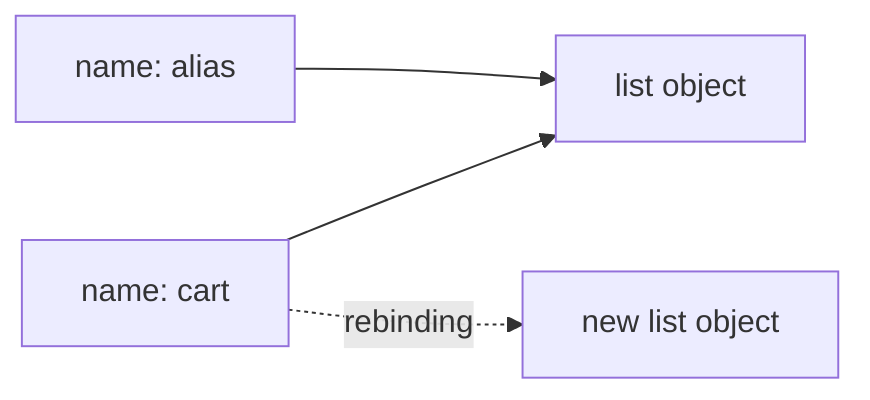

<TLDR>
  <TLDRCell label="what">
    Python 变量是指向对象的名称，不是带有固定类型的容器；类型属于对象，名称可以重新绑定到另一种对象。
  </TLDRCell>
  <TLDRCell label="trap">
    赋值不会复制对象，共享同一个列表或字典的多个名称都会观察到原地修改；`0`、`False`、空容器与 `None` 也不能随意混为一谈。
  </TLDRCell>
  <TLDRCell label="fix">
    明确区分重新绑定与原地修改，在输入边界显式转换并验证类型，并用 `==` 比较值、用 `is` 检查 `None` 等哨兵对象。
  </TLDRCell>
</TLDR>

## 是什么，为什么存在

Python 中的变量更准确地说是名称（name）。执行赋值时，Python 先计算右侧表达式，再把左侧名称绑定到所得对象。名称本身没有固定类型；对象才有类型、值与标识。

这种<Term id="name-binding">名称绑定（name binding）</Term>模型让同一种代码可以处理实现相同操作的不同对象，也让函数、类和模块都能像数据一样被名称引用。代价是你必须分清两个动作：把名称改为指向另一个对象，以及通过名称修改原对象。前者是重新绑定（rebinding），后者是原地修改（mutation）。

数据类型规定对象支持哪些操作，以及对象的值能否改变。`int`、`float`、`complex`、`bool`、`str` 与 `NoneType` 是常见的标量类型；`list`、`tuple`、`dict` 和 `set` 则组织多个对象。变量声明、函数参数、循环目标与导入名称最终都遵循同一套绑定规则。

你会在读取配置、解析 JSON、计算金额、传递列表以及处理可选值时遇到这些规则。很多看似偶发的错误，例如共享列表被意外修改、有效的零被默认值覆盖，根源都是把名称、对象与类型混成了一个概念。

## 工作原理

### 名称绑定到对象

每个 Python 对象都有值、类型与<Term id="object-identity">对象标识（object identity）</Term>。`type(value)` 返回对象的类型，`id(value)` 返回表示其标识的整数，`is` 比较两个引用是否指向同一对象。对象创建后，类型与标识不会改变。

赋值 `quantity = 3` 让名称 `quantity` 指向一个整数对象。随后执行 `quantity = "3"` 是重新绑定：名称开始指向字符串对象，原来的整数没有变成字符串。如果旧对象不再被任何引用使用，它之后可以被回收。

名称并不只由普通赋值引入。函数定义、类定义、导入、函数参数、`for` 循环目标、`with ... as ...` 与异常处理器中的 `as` 都会绑定名称。具体绑定位于哪个作用域，由这些语句所在的代码块决定。



图中 `cart` 与 `alias` 起初引用同一个列表，所以通过任一名称修改列表都能从另一名称看到。重新绑定 `cart` 后，`alias` 仍指向旧列表。箭头变了，对象没有凭空复制。

### 内置类型各管一件事

Python 的内置类型不是一组可以任意互换的标签。类型决定有效操作，例如字符串支持拼接，整数支持位运算，字典按键查找值。对不兼容对象执行操作时，Python 通常抛出 `TypeError`，而不是猜测程序意图。

| 类型 | 值的含义 | 可变性 | 常见边界 |
| --- | --- | --- | --- |
| `int` | 任意精度整数 | 不可变 | `bool` 是其子类 |
| `float` | 通常为机器双精度浮点数 | 不可变 | 十进制小数不一定能精确表示 |
| `complex` | 实部与虚部均为浮点数 | 不可变 | 不支持大小顺序比较 |
| `bool` | `True` 或 `False` | 不可变 | 参与整数运算，但业务语义通常不同 |
| `str` | Unicode 文本序列 | 不可变 | 索引返回新字符串，不能原地改字符 |
| `NoneType` | 缺失或无结果的单例值 `None` | 不可变 | 应使用 `is None` 检查 |

容器类型保存对其他对象的引用。列表、字典和集合可以原地改变；元组不能替换自身槽位中的引用，但元组指向的列表仍然可以改变。因此，“容器不可变”不等于“从它出发能到达的所有对象都不可变”。

### 赋值、解包与别名

逗号分隔的目标可以一次绑定多个名称。`left, right = right, left` 会先计算右侧对象，再把结果解包到两个目标，因此不需要临时变量。目标数量与右侧可迭代对象产出的数量不匹配时，会抛出 `ValueError`。

链式赋值 `primary = backup = []` 只创建一个列表对象，再把两个名称都绑定到它。它不等于两次独立执行 `[]`。如果需要独立容器，应分别创建，或根据所需复制深度显式复制。

增强赋值的结果取决于对象类型。列表的 `items += more` 通常原地扩展现有列表，其他别名也能看到；整数的 `count += 1` 创建另一个整数并重新绑定 `count`。相同语法并不保证相同的共享效果。

### 动态类型不是没有类型

Python 使用<Term id="dynamic-typing">动态类型（dynamic typing）</Term>：名称不需要永久声明一种类型，操作运行时会检查相关对象。一个名称先后绑定整数与字符串是合法的，但表达式 `"3" + 2` 仍会抛出 `TypeError`。动态类型与“所有类型会自动兼容”是两回事。

类型注解可以描述预期契约，例如 `quantity: int` 或 `def total(price: int) -> int`。普通 Python 调用不会因为注解而自动转换或拒绝参数。静态类型检查器、编辑器或框架可以读取注解，但运行时输入仍需由程序验证。

需要允许多种类型时，应先问这些类型是否真的共享同一业务语义。接受 `int | float` 适合一般测量值，却不一定适合货币分值；`bool` 又是 `int` 的子类，所以单纯的 `isinstance(value, int)` 也可能比契约更宽。

### 真值、缺失与布尔运算

条件语句会对任意对象执行<Term id="truth-value">真值测试（truth value testing）</Term>。`None`、`False`、各类数值零和空容器通常为假，其他对象通常为真。自定义类型还可以通过 `__bool__()` 或 `__len__()` 决定真值。

真值相同不代表业务含义相同。库存数量 `0` 可以表示确实无货，`None` 可以表示尚未盘点；空字符串可能是有效输入，也可能表示字段缺失。条件应保留领域需要区分的状态。

`and` 与 `or` 会短路，并返回某个操作数，不保证返回 `bool`。`configured_port or 8000` 在端口为 `0` 时也返回 `8000`。只有当所有假值都应当使用同一默认值时，这种写法才符合契约。

### 显式转换与类型检查

`int()`、`float()`、`str()` 和 `bool()` 构造目标类型的对象，但它们不是通用的数据清洗器。`int(3.9)` 向零截断为 `3`，`int("3.9")` 抛出 `ValueError`，而 `bool("false")` 是 `True`，因为任何非空字符串都为真。

混合内置数值运算会执行规定好的数值提升，例如整数与浮点数相加会得到浮点数。这类行为不代表 Python 会普遍把字符串转换为数字。外部文本应在边界处按明确格式解析，并为失败选择具体的错误路径。

`isinstance(value, ExpectedType)` 会考虑子类，通常适合检查对象是否支持某个类型家族。`type(value) is ExpectedType` 只接受确切类型，适用范围更窄。业务契约要求“整数但不能是布尔值”时，可以组合 `isinstance(value, int)` 与 `not isinstance(value, bool)`。

## 示例

### 查看绑定对象的类型

第一个示例展示赋值、解包与重新绑定。`quantity` 的类型变化来自名称指向了新对象，不是旧对象改变了类型。

<Depth level="quick">

```python run title="bindings_and_types.py"
order_id = "A-104"
quantity = 3
unit_price = 19.5
paid = False
missing_note = None
route = ("warehouse", "store")

# 重新绑定名称不会改变旧整数对象。
quantity = "3"

values = {
    "order_id": order_id,
    "quantity": quantity,
    "unit_price": unit_price,
    "paid": paid,
    "missing_note": missing_note,
    "route": route,
}
for label, value in values.items():
    print(f"{label}: {type(value).__name__} = {value!r}")
```

```text
order_id: str = 'A-104'
quantity: str = '3'
unit_price: float = 19.5
paid: bool = False
missing_note: NoneType = None
route: tuple = ('warehouse', 'store')
```

</Depth>

`type(value).__name__` 适合演示与诊断，但生产逻辑通常不应根据类型名称字符串分支。真正需要类型检查时，应直接传入类型对象给 `isinstance()`。

字典保存的是对象引用，所以循环取得的 `value` 仍是原对象。打印表示形式中的引号来自 `!r`，它让字符串与数字在输出中容易区分。

### 区分修改与重新绑定

第二个示例让两个名称共享列表，同时保留一份浅复制。观察两次操作后各名称指向的内容与标识关系。

```python run title="aliasing.py"
cart = ["keyboard", "mouse"]

# alias 与 cart 指向同一个列表。
alias = cart
# 浅复制创建新的外层列表。
snapshot = cart.copy()

alias.append("cable")
print(f"cart={cart}")
print(f"snapshot={snapshot}")
print(f"alias_is_cart={alias is cart}")

# 此表达式创建新列表，然后只重新绑定 cart。
cart = [*cart, "adapter"]
print(f"alias={alias}")
print(f"cart={cart}")
print(f"alias_is_cart={alias is cart}")
```

```text
cart=['keyboard', 'mouse', 'cable']
snapshot=['keyboard', 'mouse']
alias_is_cart=True
alias=['keyboard', 'mouse', 'cable']
cart=['keyboard', 'mouse', 'cable', 'adapter']
alias_is_cart=False
```

`append()` 修改共享列表，所以 `cart` 与 `alias` 起初都能看到 `cable`。`snapshot` 是另一个外层列表，不受这次修改影响。

列表展开表达式创建新列表，再把 `cart` 绑定过去。`alias` 继续引用旧列表，说明重新绑定一个名称不会追踪并修改其他别名。

### 在边界转换文本

来自命令行、环境变量或表单的值通常是文本。转换函数应同时定义允许的格式与数值范围，而不是把任何失败都换成一个看似正常的默认值。

```python run title="parse_quantity.py"
def parse_quantity(raw: str) -> int:
    try:
        quantity = int(raw)
    except ValueError as error:
        raise ValueError("quantity must be a base-10 integer") from error

    if quantity < 0:
        raise ValueError("quantity must not be negative")
    return quantity


samples = ["12", "3.5", "-1", ""]
for sample in samples:
    try:
        print(f"{sample!r} -> {parse_quantity(sample)}")
    except ValueError as error:
        print(f"{sample!r} -> invalid: {error}")
```

```text
'12' -> 12
'3.5' -> invalid: quantity must be a base-10 integer
'-1' -> invalid: quantity must not be negative
'' -> invalid: quantity must be a base-10 integer
```

这里的 `try` 只包住可能产生预期转换失败的 `int(raw)`。函数没有捕获所有 `Exception`，因此后续代码中的编程错误不会被伪装成无效输入。

`raise ... from error` 保留原始 `ValueError` 作为异常原因，同时向调用方提供稳定的领域消息。调用方根据异常类型处理失败，不应解析 Python 自带的错误消息。

### 验证反序列化后的类型

JSON 解析成功只证明文本语法有效，不证明字段符合应用契约。这个示例逐层检查容器、布尔字段与整数分值，并特意排除 `bool`。

```python run title="validated_orders.py"
import json


def active_total(raw: str) -> int:
    records = json.loads(raw)
    if not isinstance(records, list):
        raise ValueError("orders must be a list")

    total = 0
    for index, record in enumerate(records):
        if not isinstance(record, dict):
            raise ValueError(f"order {index}: expected an object")

        active = record.get("active")
        cents = record.get("cents")
        if not isinstance(active, bool):
            raise ValueError(f"order {index}: active must be boolean")
        if not isinstance(cents, int) or isinstance(cents, bool):
            raise ValueError(f"order {index}: cents must be an integer")
        if cents < 0:
            raise ValueError(f"order {index}: cents must not be negative")

        if active:
            total += cents

    return total


payloads = [
    '[{"active": true, "cents": 1250}, {"active": false, "cents": 900}]',
    '[{"active": true, "cents": true}]',
]
for payload in payloads:
    try:
        print(active_total(payload))
    except ValueError as error:
        print(f"invalid: {error}")
```

```text
1250
invalid: order 0: cents must be an integer
```

虽然 `isinstance(True, int)` 的结果为真，但这里的分值字段不应接受布尔值。检查顺序先确认类型，再比较数值范围，避免在错误类型上执行 `<`。

函数不保留输入记录，也不修改解析出的列表。每次调用都从局部的 `total = 0` 开始，因此不同请求之间没有隐藏的共享状态。

## 陷阱

> [!PITFALL]
> 把赋值当成复制会制造隐蔽的共享状态。`backup = settings` 只是给同一个字典增加另一个名称。
>
> **修复方法：** 外层容器需要独立时使用 `copy()` 或相应构造器。嵌套对象也要独立时，先说明所有权与共享边界，再判断 `copy.deepcopy()` 是否符合领域语义。

> [!PITFALL]
> 用 `is` 比较字符串或数字，会依赖实现是否恰好复用了某个对象。值相等并不表示对象标识相同。
>
> **修复方法：** 使用 `==` 比较值，只用 `is` 比较对象标识。检查缺失值时写 `value is None`，不要依赖小整数或字符串驻留等实现细节。

> [!PITFALL]
> 转换函数容易被误当成验证规则。`bool("false")` 为真，`int(3.9)` 向零截断，而且 `isinstance(True, int)` 也为真。
>
> **修复方法：** 先定义允许的源类型、文本格式与范围，再转换。领域要求确切整数时显式排除 `bool`，不要用一次构造函数调用代替整个输入契约。

> [!PITFALL]
> 用 `value or default` 处理缺失值，也会替换有效的 `0`、`False`、空字符串和空容器。程序因此丢失原本不同的状态。
>
> **修复方法：** 只有 `None` 表示缺失时，就显式写 `value is None`。字典需要区分键不存在与值为假时，使用 `key in mapping` 或单独的哨兵对象。

> [!PITFALL]
> 二进制浮点数不能精确表示许多十进制小数，所以 `0.1 + 0.2 == 0.3` 为假。把结果直接用于金额相等判断或累计结算会产生错误。
>
> **修复方法：** 测量值比较使用 `math.isclose()` 与明确容差；货币使用整数最小单位，或从字符串构造 `decimal.Decimal`。不要先经过不精确的 `float` 再转成 `Decimal`。

> [!PITFALL]
> 类型注解不会自动验证函数参数、JSON 字段或配置值。带有 `payload: dict[str, int]` 的函数仍能在运行时收到字符串。
>
> **修复方法：** 保留注解供静态检查与工具使用，并在不可信数据进入系统的边界执行运行时验证。测试错误类型，而不只测试理想输入。

## AI 时代

**生成代码在这里常犯的错**

生成代码经常把注解当成运行时验证，直接对 JSON 字段做算术；也会用 `value or default` 抹掉有效的零，或用 `isinstance(value, int)` 接受布尔值。重构列表逻辑时，模型还可能把复制改成别名、把非修改表达式改成 `+=`，从而悄悄改变调用方可见状态。另一类错误是把 `float` 用于货币，再通过 `round()` 掩盖累计误差。

**让 AI 检查**

- 列出每次赋值后的名称到对象映射，并指出哪些可变对象存在多个别名。
- 对每个外部字段说明接受的源类型、转换规则、范围以及失败方式，并专门检查 `bool` 与 `int` 的关系。
- 跟踪 `None`、零、`False`、空字符串与空容器经过条件和默认值表达式后的去向。

**审查清单**

- 用错误类型、缺失字段、零值、空值与嵌套可变对象运行边界测试。
- 审查所有 `is`、`or default`、类型转换、类型注解与原地操作。
- 比较调用前后的输入对象，并确认每个可见修改都属于函数契约。

**提示词词汇**

使用准确术语：`name binding`（名称绑定）、`rebinding`（重新绑定）、`object identity`（对象标识）、`mutable object`（可变对象）、`truth value testing`（真值测试）、`explicit conversion`（显式转换）、`runtime validation`（运行时验证）、`type annotation`（类型注解）。要求 AI 给出别名表和输入边界表；“检查变量类型”无法暴露共享状态与缺失值语义。

<Depth level="deep">

## 名称与对象的细节

### 赋值顺序

普通赋值先完整计算右侧表达式，再处理左侧目标。链式赋值把同一个结果对象依次绑定到多个目标；解包赋值先取得右侧各项，再按目标结构绑定。右侧表达式只求值一次，这也是交换两个名称能安全写成 `left, right = right, left` 的原因。

目标不一定是名称。`account.balance = amount` 会设置属性，`items[index] = value` 会写入下标位置；这些动作由目标对象的类型实现。把所有赋值都理解成“创建变量”会漏掉属性或容器的原地状态变化。

增强赋值会读取左侧目标，尝试相应的原地操作，再把结果写回目标。可变对象可能返回自身，不可变对象通常返回新对象。审查 `+=`、`|=` 等语句时，需要查看操作数类型与别名，不能只看运算符。

### 相等、标识与类型

`==` 调用类型定义的相等规则，`is` 不可重载，只比较对象标识。两个独立列表可以值相等而标识不同；两个名称也可以既值相等又标识相同，因为它们引用同一列表。这两个问题没有谁比谁“更严格”。

`id()` 返回在对象生命周期内唯一且稳定的整数，但具体数值没有业务含义。对象销毁后，后来的对象可以复用同一标识。CPython 当前常把内存地址用作 `id()`，应用代码不应把这一实现细节当成跨进程或持久化标识。

`type()` 返回确切类型对象，`isinstance()` 还会考虑直接、间接或注册的子类。大多数面向接口的代码应使用 `isinstance()` 或直接尝试所需操作。只有契约确实排除所有子类时，才使用 `type(value) is SomeType`。

### 可变性沿引用传播

可变性属于类型，不属于名称。列表方法 `append()` 改变列表对象的值；所有引用该对象的名称、容器字段与函数参数之后都能观察到变化。重新绑定某个局部名称不会改变其他引用。

浅复制只新建最外层容器，里面的元素引用仍来自源容器。若两个列表都指向同一个嵌套字典，通过任一列表修改字典都能从另一列表看到。需要复制时，应沿实际修改路径判断哪些节点必须独立。

不可变对象不能原地改变自身的值，但名称仍可以重新绑定。字符串拼接与整数加法会产生新对象。元组的不可变性只固定长度与槽位引用；槽位指向的可变对象仍有自己的状态。

## 内置类型的边界

### 数值类型

Python 整数具有任意精度，实际大小受可用内存等资源限制。浮点数通常由 C 的双精度类型实现，具体精度可查看 `sys.float_info`。这两种类型解决不同问题，不能把 `float` 当成带小数点的精确整数。

`bool` 是 `int` 的子类，因此 `True + True` 得到 `2`，`True == 1` 也为真。这是语言的数据模型，不表示任何整数都适合作为业务布尔值。解析 API 数据时，布尔字段与计数字段通常应分别验证。

不同内置数值类型参与二元算术时，会按数值规则提升较窄的操作数。整数与浮点数运算通常得到浮点数，实数与复数运算得到复数。这种有限的数值提升不适用于字符串与数字之间。

### 真值协议

对象默认视为真，除非其类型定义返回假的 `__bool__()`，或在没有该方法时由 `__len__()` 返回零。真值测试可能执行用户定义代码，也可能抛出异常。对第三方对象写条件判断时，不应假设转换永远无副作用或必然成功。

`not` 总是产生 `True` 或 `False`，而 `and` 与 `or` 返回决定结果的操作数。表达式 `candidate and normalize(candidate)` 可能返回原始假值，也可能返回规范化结果，所以它的返回类型往往比表面更宽。需要布尔结果时使用 `bool(expression)` 或明确比较。

`None` 是单例对象，常用来表示“没有提供”或“没有结果”。它和数值零、空字符串、空列表都不相等，但真值都为假。选择 `None` 前仍要写清楚它在 API 中的具体含义。

### 转换边界

转换分为表示解析与数值转换。`int("101", 2)` 按二进制文本得到 `5`；`int(3.9)` 则把数值向零截断。两者都写成 `int()`，却有不同的输入契约与失败方式。

`str(value)` 生成适合阅读的文本表示，但不保证可逆。需要机器交换数据时，应使用 JSON 等明确格式与模式验证，不要依赖 `str()` 再猜测原类型。需要调试表示时，`repr()` 的目的又不同。

浮点数转整数可能丢弃小数部分，超出浮点范围的整数转浮点数还可能抛出 `OverflowError`。转换应发生在信息含义清楚的边界，转换后的值仍需接受范围与业务约束检查。

### 注解是契约说明

<Term id="type-annotation">类型注解（type annotation）</Term>为参数、返回值与变量提供机器可读的契约说明。Python 运行时不会自动强制函数与变量注解；静态检查器可以在运行前报告不一致，框架也可能选择读取注解并实现自己的行为。

Python 3.14 默认延迟求值注解表达式，但这项变化仍不会验证普通函数调用。读取注解的库需要遵循 3.14 的注解 API，而不是假设 `__annotations__` 中的每个值都已立即求值。应用的运行时验证逻辑应与注解描述保持一致。

注解可以减少名称所代表值的歧义，却不会改变名称绑定模型。`quantity: int = "3"` 在普通运行时仍会绑定字符串。把静态检查与边界测试放进开发流程，才能让注解中的契约持续可信。

</Depth>

<Checkpoint id="python/variables-data-types" />

## 延伸阅读

- [Python 语言参考：名称与绑定](https://docs.python.org/3.14/reference/executionmodel.html#naming-and-binding)
- [Python 数据模型：对象、值与类型](https://docs.python.org/3.14/reference/datamodel.html#objects-values-and-types)
- [Python 标准库：真值测试与内置类型](https://docs.python.org/3.14/library/stdtypes.html#truth-value-testing)
- [Python 内置函数：`int()` 与 `isinstance()`](https://docs.python.org/3.14/library/functions.html#int)
- [Python 标准库：`typing` 与类型注解](https://docs.python.org/3.14/library/typing.html)
