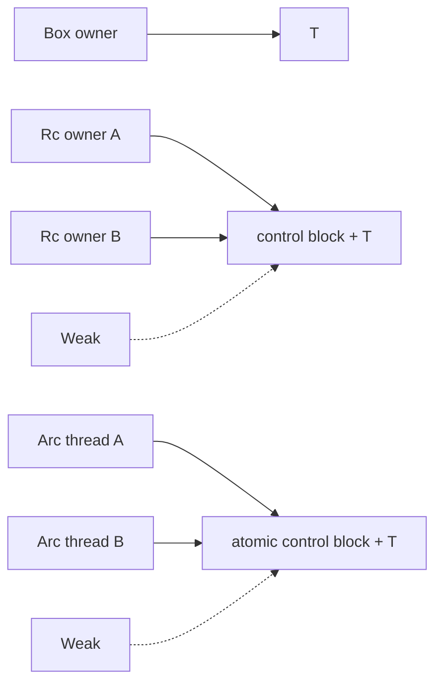

<TLDR>
  <TLDRCell label="what">
    `Box<T>` expresses single ownership of a heap value, `Rc<T>` expresses single-threaded shared ownership, and `Arc<T>` takes shared ownership across threads with atomic counts; `Weak<T>` observes an object without extending its lifetime.
  </TLDRCell>
  <TLDRCell label="trap">
    `Arc<T>` only makes ownership-count updates safe across threads; it does not automatically make `T` mutable or thread-safe. Strong-reference cycles made from `Rc` or `Arc` are not collected either.
  </TLDRCell>
  <TLDRCell label="fix">
    Choose the weakest tool that represents the ownership: `Box` for one owner, `Rc` for single-threaded sharing, `Arc` for cross-thread sharing, and `Weak` for non-owning back edges. Choose `RefCell`, `Mutex`, or `RwLock` separately when mutation is required.
  </TLDRCell>
</TLDR>

## What it is and why it exists

A <Term id="smart-pointer">smart pointer</Term> is a type that behaves like a pointer while carrying ownership semantics. `Box<T>`, `Rc<T>`, and `Arc<T>` all own the `T` they point to and process that value according to their own rules when dropped. `Weak<T>` does not own `T`, but it can try to obtain a new strong pointer while the target is still alive.

These types express relationships that ordinary owned values and borrows cannot express alone. A recursive type needs fixed-size indirection; a GUI node or syntax tree may need several readers; thread tasks may share configuration; and a child-to-parent link should not keep the parent alive forever. These are ownership-modeling problems, not merely reasons to “put data on the heap.”

`Box<T>` has one owner. Moving the box moves ownership but usually does not move the heap-resident `T`; when the last owner leaves scope, `T` and its allocation are released together. It fits recursive types, owned trait objects, and large values that genuinely need indirection.

`Rc<T>` is a single-threaded reference-counting pointer. Calling `Rc::clone` creates another owner and increments the strong count without cloning `T`. The value is dropped when the last strong owner disappears. Because its count updates are not atomic, `Rc` implements neither `Send` nor `Sync`.

`Arc<T>` maintains the same shared-ownership model with atomic operations, so it can be used across threads. `Arc<T>` implements the corresponding `Send` and `Sync` traits only when `T` satisfies their bounds. Atomic counts protect the allocation's lifetime, not reads and writes inside `T`.

`Rc::downgrade` and `Arc::downgrade` create `Weak<T>`. A weak pointer does not increment the strong count, so it does not keep `T` alive. Calling `upgrade()` returns `Option<Rc<T>>` or `Option<Arc<T>>`; the result is `None` after the target has been dropped.

Choose by asking two questions first: does the value have one owner or several, and does sharing cross a thread boundary? Decide on mutation separately. Separating shared ownership from mutability prevents you from treating `Arc` as a lock or reaching for `Arc<Mutex<T>>` unconditionally.

| Ownership need | Thread scope | Usual type | Meaning |
|---|---|---|---|
| One owner with indirection | Any | `Box<T>` | No reference count |
| Several owners | One thread | `Rc<T>` | Non-atomic strong and weak counts |
| Several owners | Multiple threads | `Arc<T>` | Atomic strong and weak counts |
| Non-owning link | Same as its strong pointer | `std::rc::Weak<T>` or `std::sync::Weak<T>` | Must call `upgrade()` before use |

## How it works

`Box<T>` is itself an owning pointer. For an ordinary non-zero-sized `T`, the value lives in a heap allocation and the box stores a pointer to it; edge cases such as zero-sized types make “exactly one allocation always occurs” a bad premise. `Box` implements `Deref` and `DerefMut`, so many borrow operations automatically dereference to `T`.

`Box` gives recursive definitions a finite size. If an enum variant directly contains another value of the same enum, the compiler cannot calculate the enum's size; changing that position to `Box<Node>` means it only has to store a fixed-size pointer. `Box<dyn Trait>` similarly places a dynamically sized trait object behind an owning pointer.

The allocation for `Rc<T>` or `Arc<T>` conceptually contains a <Term id="reference-count-control-block">reference-count control block</Term> and `T`. The control block tracks at least strong owners and explicit weak pointers; exact fields, layout, and internal sentinels are standard-library implementation details that application logic must not depend on. `strong_count` and `weak_count` are useful diagnostics, not substitutes for lifetime rules.

Cloning an `Rc` or `Arc` clones only the pointer identity. `Rc::clone(&value)` and `value.clone()` have the same semantics for the wrapper, but the first spelling makes “add a shared owner” clearer. Deep-copying the inner `T` requires explicitly cloning the dereferenced value or using a copy operation that matches the domain.

When the last strong pointer is dropped, `T` immediately enters destruction. If explicit `Weak` pointers remain, the control block must stay alive so a later `upgrade()` can reliably return `None`; the remaining allocation can be released after the last weak pointer disappears. That is how a weak pointer can observe liveness without extending `T`'s lifetime.

`Arc` uses atomic operations so different threads can clone, drop, and upgrade pointers concurrently. It does not turn `RefCell<T>` into a thread-safe type, so `Arc<RefCell<T>>` generally still cannot be sent to threads. Shared mutable state normally uses `Arc<Mutex<T>>` or `Arc<RwLock<T>>`, with the corresponding lock type providing the mutation semantics.

The diagram puts the pointers and allocations together. Solid edges express strong ownership; dashed edges are weak links that do not keep `T` alive.



Whether an edge should be strong depends on whether it expresses ownership. A tree normally has a parent that strongly owns its children, while a child-to-parent link is navigation only and therefore uses `Weak`. If both directions are strong, the counts inside the cycle never reach zero after the external root disappears.

Shared ownership is not the same as shared access. With an `Rc<T>` or `Arc<T>`, you normally read `T` through a shared reference. When mutation is truly required, first see whether you can preserve a unique owner; otherwise choose runtime borrow checking or a synchronization lock and include its failure modes in the interface.

### Dereferencing and container ownership

Deref coercion only borrows the inner `T`; it does not clone the container or increment a reference count. When you pass `&Rc<T>` to a function that only needs `&T`, the compiler can dereference through the layers while the caller retains ownership of its `Rc`. Once the borrow ends, neither the count nor allocation identity has changed.

A function that accepts `Rc<T>` or `Arc<T>` takes ownership of one handle, so the caller normally clones its handle explicitly before the call. That signature says the function may retain shared ownership beyond the call. If the function only reads during the call, accepting `&T` gives callers more choices and avoids a pointless count update.

An owning smart pointer does not automatically produce a `'static` reference. The inner `T` still ends when all strong owners are dropped, and a reference borrowed through the container cannot outlive the handle that supplied it. Move or clone an owning handle when work must retain the value across a thread or task instead of inventing a longer borrow.

`Deref` makes method calls look as if they operate directly on `T`, but associated functions still distinguish the container API. For example, `Rc::clone`, `Rc::downgrade`, and `Rc::ptr_eq` operate on the ownership container rather than the inner value. When reviewing generated code, identify whether each `.clone()` copies a handle or copies `T`.

### Drop and resource release

`Box<T>` has one owning path, so dropping it runs the inner `T`'s destructor exactly once. The corresponding storage is then released. Moving a box only transfers that destruction responsibility to a new binding; it does not destroy the inner value early.

Every `Rc<T>` or `Arc<T>` handle eventually leaves scope, but the inner `T` is destroyed once, when the strong count reaches zero. Cloning a handle does not make `T` run `Drop` an extra time. This distinction matters especially for values that own files, sockets, or transaction guards.

Dropping `Weak<T>` only gives up the ability to observe the control block and does not destroy `T`. Conversely, weak handles that remain after `T` is destroyed cannot revive it. `upgrade()` creates a new strong owner; it is not an escape route for accessing a dead value.

A strong-reference cycle prevents the count from reaching zero, so `Drop` does not run automatically for values in the cycle. Structures that hold external resources have even more reason not to rely on process exit for cleanup. Modeling non-owning edges with `Weak` is usually more reliable than writing a manual cycle-breaking protocol.

## Examples

All four programs below were compiled and executed with Rust 1.98.0. The output blocks contain the actual results; the thread example prints from the main thread in handle-creation order, so its output order is deterministic.

### A recursive expression with Box

Without `Box`, `Expr::Add` would directly contain two more `Expr` values and its size would recurse forever. Two owning indirections give every enum value a calculable fixed size.

<Depth level="quick">

```rust title="boxed_expr.rs"
#[derive(Debug)]
enum Expr {
    Number(i64),
    Add(Box<Expr>, Box<Expr>),
}

impl Expr {
    fn evaluate(&self) -> i64 {
        match self {
            Expr::Number(value) => *value,
            Expr::Add(left, right) => left.evaluate() + right.evaluate(),
        }
    }
}

fn main() {
    let expression = Expr::Add(
        Box::new(Expr::Number(20)),
        Box::new(Expr::Add(
            Box::new(Expr::Number(2)),
            Box::new(Expr::Number(3)),
        )),
    );

    println!("expression: {expression:?}");
    println!("result: {}", expression.evaluate());
}
```

```text
expression: Add(Number(20), Add(Number(2), Number(3)))
result: 25
```

</Depth>

Each box exclusively owns one child expression. When matching on `&self`, deref coercion lets `left.evaluate()` and `right.evaluate()` call the inner `Expr` method directly. Every node is released through the ownership tree when the root expression leaves scope.

### Sharing immutable configuration with Rc

`Rc::clone` makes two handles point to the same allocation. After the second handle is dropped, `Rc::get_mut` can prove that `primary` is the only access path and return a mutable reference.

```rust title="shared_catalog.rs"
use std::rc::Rc;

#[derive(Debug)]
struct Catalog {
    region: String,
}

fn main() {
    let mut primary = Rc::new(Catalog {
        region: String::from("eu-west"),
    });
    let read_view = Rc::clone(&primary);

    println!("owners: {}", Rc::strong_count(&primary));
    println!("same allocation: {}", Rc::ptr_eq(&primary, &read_view));

    drop(read_view);
    Rc::get_mut(&mut primary)
        .expect("primary is now the only owner")
        .region
        .push_str("-backup");

    println!("owners after drop: {}", Rc::strong_count(&primary));
    println!("region: {}", primary.region);
}
```

```text
owners: 2
same allocation: true
owners after drop: 1
region: eu-west-backup
```

`Rc::ptr_eq` tests whether two handles point to the same allocation, which differs from comparing two `Catalog` values. The success of `get_mut` depends on current uniqueness; the count printed earlier is not proof. In this example, `drop(read_view)` establishes the required condition.

### A parent link with Weak

The parent strongly owns its child, and the child only weakly references the parent. This permits upward navigation without forming a strong cycle that keeps the whole tree alive.

```rust title="weak_parent.rs"
use std::cell::RefCell;
use std::rc::{Rc, Weak};

#[derive(Debug)]
struct Node {
    name: &'static str,
    parent: RefCell<Weak<Node>>,
    children: RefCell<Vec<Rc<Node>>>,
}

impl Node {
    fn new(name: &'static str) -> Rc<Self> {
        Rc::new(Self {
            name,
            parent: RefCell::new(Weak::new()),
            children: RefCell::new(Vec::new()),
        })
    }

    fn attach(parent: &Rc<Self>, child: &Rc<Self>) {
        *child.parent.borrow_mut() = Rc::downgrade(parent);
        parent.children.borrow_mut().push(Rc::clone(child));
    }
}

fn main() {
    let root = Node::new("root");
    let report = Node::new("report.csv");
    Node::attach(&root, &report);

    println!("root strong: {}", Rc::strong_count(&root));
    println!("root weak: {}", Rc::weak_count(&root));
    let parent_name = report.parent.borrow().upgrade().unwrap().name;
    println!("report parent: {parent_name}");

    drop(root);
    println!("parent alive: {}", report.parent.borrow().upgrade().is_some());
}
```

```text
root strong: 1
root weak: 1
report parent: root
parent alive: false
```

`RefCell` provides only single-threaded interior mutability, letting `attach` update links through shared `Rc<Node>` handles. The first `upgrade()` succeeds because `root` is still a strong owner; the second fails after `root` is dropped. Production code should match the `Option`; the example unwraps only the first check whose lifetime is guaranteed in the same scope.

### Sharing read-only data across threads with Arc

Each worker clones one `Arc` instead of cloning the entire vector. Workers return their results and the main thread prints them in handle order, so scheduling cannot change the output.

```rust title="arc_workers.rs"
use std::sync::Arc;
use std::thread;

fn main() {
    let measurements = Arc::new(vec![4, 6, 8, 9, 12]);

    let handles: Vec<_> = [2, 3, 4]
        .into_iter()
        .map(|divisor| {
            let measurements = Arc::clone(&measurements);
            thread::spawn(move || {
                let sum = measurements
                    .iter()
                    .copied()
                    .filter(|value| value % divisor == 0)
                    .sum::<i32>();
                (divisor, sum)
            })
        })
        .collect();

    for handle in handles {
        let (divisor, sum) = handle.join().unwrap();
        println!("divisible by {divisor}: {sum}");
    }

    println!("owners after join: {}", Arc::strong_count(&measurements));
}
```

```text
divisible by 2: 30
divisible by 3: 27
divisible by 4: 24
owners after join: 1
```

The thread closures use `move` to take ownership of their respective `Arc` handles. Once every thread is joined, those clones have been dropped and only the main-thread handle remains. The inner vector is never modified, so no lock is needed.

## Pitfalls

### Treating Arc as a thread-safety switch

> [!PITFALL]
> Mechanically replacing a failing `Rc<RefCell<T>>` with `Arc<RefCell<T>>` does not make `RefCell<T>` implement `Sync`. Nor does `Arc<T>` automatically provide a way to mutate `T`.

**Fix:** Use plain `Arc<T>` for read-only sharing. Shared mutation calls for `Arc<Mutex<T>>`, `Arc<RwLock<T>>`, or atomics according to the access pattern, including their poisoning, contention, and critical-section behavior; if the work never crosses a thread, keeping `Rc<RefCell<T>>` is often more accurate.

### Building a cycle from strong back edges

> [!PITFALL]
> Generated trees, observer lists, and graphs often store `Rc` or `Arc` in both directions. After all external handles are dropped, every strong count in the cycle remains above zero, so destructors never run.

**Fix:** State who owns whom, then change parent links, cached observers, and other non-owning back edges to `Weak`. In a test, drop the root owner and assert that a retained weak handle can no longer upgrade; do not treat one `strong_count` snapshot as a reclamation test.

### Unconditionally unwrapping Weak::upgrade

> [!PITFALL]
> `weak.upgrade().unwrap()` turns “the target may have ended” into a false invariant. In event queues, async callbacks, and cross-thread registries, the last strong owner can disappear before the weak handle is used.

**Fix:** Handle `None` as a normal lifetime branch and remove expired entries from registries when appropriate. If the domain guarantees liveness, make the function accept a strong pointer or borrow that expresses the guarantee instead of relying on an earlier count check.

### Calling unknown code while holding a lock

> [!PITFALL]
> Generated code around `Arc<Mutex<Vec<Callback>>>` often invokes each callback while holding the mutex. A callback that re-enters the registry can deadlock, and a slow callback blocks every subscribe and publish operation.

**Fix:** Upgrade or clone the required handles and remove expired weak pointers in a short critical section, then release the guard before calling user code. Do not lengthen a lock's lifetime just to shorten the source; specifically check whether a guard crosses `.await` or any external function call.

### Treating Box as address pinning or an optimization

> [!PITFALL]
> `Box<T>` supplies owning indirection, but an ordinary `Box<T>` does not express the fixed-address guarantee required by a self-referential value, nor does it guarantee faster code. Boxing every small value adds indirection and may introduce heap allocation.

**Fix:** Use `Box` when recursive sizing, a trait object, or an ownership boundary genuinely requires indirection. Use `Pin<Box<T>>` and understand `Unpin` when an address must not change. Performance choices require measurements, not a guess that “the heap is faster.”

<Depth level="deep">

## Control-block lifetime

<Term id="reference-counting">Reference counting</Term> ties destruction to the number of strong owners. `Rc` updates its counts in one thread, while `Arc` coordinates multiple threads with atomic operations; both drop `T` when the last strong owner disappears. This mechanism is deterministic, but it only responds to count changes and does not detect strong-reference cycles.

Strong and weak counts serve different lifetimes. The strong count controls whether `T` is alive; explicit weak pointers require the control block to remain after `T` is dropped. Those weak handles can still be cloned or dropped, but upgrading returns `None` and cannot access the destroyed `T`.

Upgrading a `std::sync::Weak<T>` can race with the last strong pointer being dropped on another thread. The standard library's atomic protocol guarantees one of two outcomes: it obtains a new `Arc` that keeps `T` alive, or it returns `None`. Application code neither needs nor should read the strong count before deciding to upgrade.

Reference counting turns a strong cycle into a safe leak rather than undefined behavior, so the visible symptom is usually retained resources instead of an immediate crash. A retained value may still hold file descriptors, cache entries, or other scarce resources. Ownership-graph review should ask whether destruction is reachable, not only whether memory access is safe.

`strong_count` and `weak_count` return counts observed at one instant. With `Arc`, another thread can change them immediately after the function returns, making them appropriate for logs, controlled single-threaded assertions, and teaching but not for lock-free safety decisions. Use a library API with the required atomic guarantee when unique access matters.

## Unique access and copy-on-write

`Rc::get_mut` and `Arc::get_mut` take a mutable reference to the wrapper and return `Some(&mut T)` only when no other strong or weak pointer addresses the same allocation. That condition rules out any other path that could later upgrade or read the old value. They return `None` rather than waiting for other owners to disappear when uniqueness does not hold.

`Rc::make_mut` and `Arc::make_mut` provide copy-on-write for a `T` that implements `Clone`. When other strong owners exist, they clone the inner value, redirect the current handle to an independent allocation, and return a mutable reference. Mutating the current logical copy then leaves values seen by the other strong owners unchanged.

When only weak pointers remain alongside one strong owner, `make_mut` can dissociate those weak pointers from the current value without cloning `T`. Those old `Weak` handles can no longer upgrade afterward. Code that treats a weak handle as a stable identity token must account for this edge case: `make_mut` promises mutable value access, not preservation of allocation identity.

`try_unwrap` is about taking ownership of `T`. It can succeed whenever there are no other strong owners, even if weak handles still exist; once `T` is extracted, those weak handles cannot upgrade. `unwrap_or_clone` can express “extract or clone,” but whether copying occurs should still be clear at the API boundary.

Equal values do not imply identical allocations. Ordinary equality on `Rc<T>` and `Arc<T>` compares `T`, while `ptr_eq` checks whether two handles address the same allocation. Cache keys, graph-node identities, and deduplication logic must first decide whether they need value semantics or identity semantics.

## Dynamically sized values and address stability

After suitable coercions, `Box<T>`, `Rc<T>`, and `Arc<T>` can all own dynamically sized values such as `Box<dyn Trait>`, `Rc<str>`, or `Arc<[T]>`. Such pointers carry the metadata needed to access the value, such as a slice length or trait-object vtable information. Do not therefore assume every smart pointer for every `T` is exactly one machine word.

Moving a `Box<T>` usually moves only the pointer and leaves the heap value at the same address, but the type system does not promise immobility merely from `Box<T>`. Code can still move or replace `T` through the box. Use `Pin` and its invariants when self-referential structures or async state machines require address stability.

Indirection also affects API design. A function that only reads `T` usually accepts `&T`, allowing callers to pass `Box<T>`, `Rc<T>`, or `Arc<T>` through deref coercion without exposing an ownership container in the interface. A parameter should expose the wrapper only when the function must clone, downgrade, take ownership of, or retain a handle across threads.

</Depth>

<Checkpoint id="rust/box-rc-arc" />

## Further reading

- [The Rust Programming Language: Smart Pointers](https://doc.rust-lang.org/book/ch15-00-smart-pointers.html)
- [Rust standard library: `Box`](https://doc.rust-lang.org/std/boxed/struct.Box.html)
- [Rust standard library: `Rc`](https://doc.rust-lang.org/std/rc/struct.Rc.html)
- [Rust standard library: `Arc`](https://doc.rust-lang.org/std/sync/struct.Arc.html)
- [Rust standard library: `Weak`](https://doc.rust-lang.org/std/rc/struct.Weak.html)
