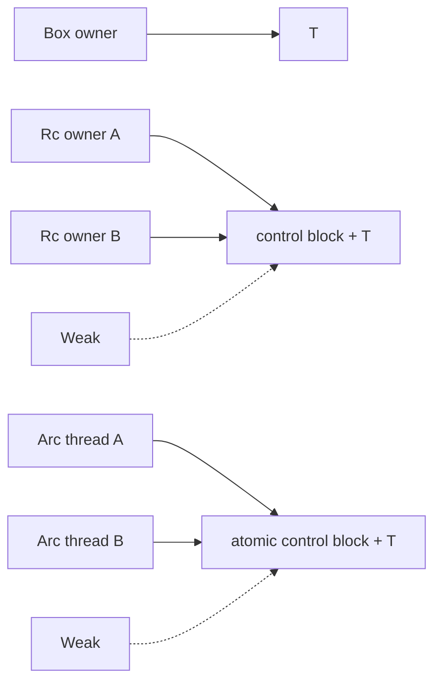

<TLDR>
  <TLDRCell label="what">
    `Box<T>` 表示堆上的单一所有权，`Rc<T>` 表示单线程共享所有权，`Arc<T>` 用原子计数把共享所有权带到线程之间；`Weak<T>` 只观察对象，不延长对象的生存期。
  </TLDRCell>
  <TLDRCell label="trap">
    `Arc<T>` 只保证所有权计数可在线程间安全更新，并不会自动让 `T` 可变或线程安全；`Rc` 和 `Arc` 的强引用环也不会自动回收。
  </TLDRCell>
  <TLDRCell label="fix">
    先根据所有权关系选择最弱的工具：单一所有者用 `Box`，单线程共享用 `Rc`，跨线程共享用 `Arc`，非拥有反向边用 `Weak`；可变性另行选择 `RefCell`、`Mutex` 或 `RwLock`。
  </TLDRCell>
</TLDR>

## 是什么，为什么存在

<Term id="smart-pointer">智能指针（smart pointer）</Term>是一个行为像指针、同时携带所有权语义的类型。`Box<T>`、`Rc<T>` 和 `Arc<T>` 都拥有它们指向的 `T`，并在自身被丢弃时按各自规则处理该值。`Weak<T>` 不拥有 `T`，但可以在目标仍然存活时尝试取得一个新的强引用。

这组类型解决的是普通拥有型值和借用无法独自表达的关系。递归类型需要固定大小的间接层；一个 GUI 节点或解析树可能需要多个读取者；线程任务可能需要共享配置；父子结构的反向链接则不应让父节点永久存活。这些都是所有权建模问题，不只是「把数据放到堆上」。

`Box<T>` 只有一个所有者。移动 `Box` 会移动所有权，但通常不会移动堆上的 `T`；最后一个所有者离开作用域时，`T` 和相应分配一起释放。它适合递归类型、拥有型 trait 对象，以及确实需要间接层的较大值。

`Rc<T>` 是单线程的引用计数（reference counting）指针。调用 `Rc::clone` 会创建另一个所有者并增加强计数，不会克隆 `T`。最后一个强所有者消失时，`T` 被丢弃。由于计数更新不是原子的，`Rc` 既不实现 `Send`，也不实现 `Sync`。

`Arc<T>` 使用原子操作维护相同的共享所有权模型，因此可以跨线程使用。只有当 `T` 本身满足相应的 `Send` 与 `Sync` 约束时，`Arc<T>` 才实现这些 trait。原子计数保护的是分配的生存期，不是 `T` 内部的读写。

`Rc::downgrade` 与 `Arc::downgrade` 产生 `Weak<T>`。弱引用不增加强计数，所以不会让 `T` 继续存活。调用 `upgrade()` 会返回 `Option<Rc<T>>` 或 `Option<Arc<T>>`；目标已被丢弃时结果为 `None`。

选择时先问两个问题：这个值有一个所有者还是多个所有者，共享是否跨越线程。然后再单独判断是否需要修改。把共享所有权与可变性拆开思考，能避免把 `Arc` 误当作锁，也能避免无条件使用 `Arc<Mutex<T>>`。

| 所有权需求 | 线程范围 | 常用类型 | 说明 |
|---|---|---|---|
| 单一所有者、需要间接层 | 任意 | `Box<T>` | 没有引用计数 |
| 多个所有者 | 单线程 | `Rc<T>` | 非原子强计数与弱计数 |
| 多个所有者 | 多线程 | `Arc<T>` | 原子强计数与弱计数 |
| 非拥有链接 | 与强指针一致 | `std::rc::Weak<T>` 或 `std::sync::Weak<T>` | 使用前必须 `upgrade()` |

## 工作原理

`Box<T>` 本身是一个拥有型指针。对于普通非零大小的 `T`，值位于堆分配中，而 `Box` 值保存指向它的指针；零大小类型等边界情况不应靠「必然发生一次分配」来推理。`Box` 实现 `Deref` 和 `DerefMut`，因此许多借用操作会自动解引用到 `T`。

`Box` 让递归定义变成有限大小。例如，枚举分支若直接包含同类型的下一节点，编译器无法算出枚举大小；把下一节点改成 `Box<Node>` 后，该位置只需要保存固定大小的指针。`Box<dyn Trait>` 也把动态大小的 trait 对象放在拥有型指针后面。

`Rc<T>` 与 `Arc<T>` 的分配在概念上包含一个<Term id="reference-count-control-block">引用计数控制块（reference-count control block）</Term>和 `T`。控制块至少跟踪强所有者与显式弱引用；确切字段、布局和内部哨兵属于标准库实现细节，不应写进应用逻辑。`strong_count` 与 `weak_count` 适合诊断，但不是生命周期规则的替代品。

克隆 `Rc` 或 `Arc` 只克隆指针身份。`Rc::clone(&value)` 和 `value.clone()` 对包装指针具有相同语义，但前一种写法把「增加共享所有者」表达得更清楚。要深拷贝内部 `T`，必须显式克隆解引用后的值，或使用满足业务语义的复制方法。

最后一个强引用被丢弃时，`T` 立即进入析构流程。若仍有显式 `Weak`，控制块需要继续存在，使后续 `upgrade()` 能可靠地返回 `None`；最后一个弱引用消失后，剩余分配才可释放。这就是弱引用能够观察生存状态、却不会延长 `T` 生存期的原因。

`Arc` 的原子操作让不同线程可以并发克隆、丢弃和升级指针。它不会把 `RefCell<T>` 变成线程安全类型，所以 `Arc<RefCell<T>>` 通常仍不能发送到线程。共享可变状态一般使用 `Arc<Mutex<T>>` 或 `Arc<RwLock<T>>`，具体锁语义由对应类型负责。

下图把指针与分配的关系放在一起。实线表示强所有权，虚线表示不会让 `T` 存活的弱链接。



一条边是否应为强引用，取决于它是否表达所有权。树通常由父节点强拥有子节点，而子节点到父节点只是导航，因此反向边用 `Weak`。若双向边都用强引用，外部根节点即使消失，环内强计数仍不会归零。

共享所有权与共享访问也不是同一件事。拿到 `Rc<T>` 或 `Arc<T>` 后，通常只能通过共享引用读取 `T`。当确实需要修改时，先看是否能够保持唯一所有者；否则再选择运行时借用检查或同步锁，并把它们的失败模式纳入接口。

### 解引用与容器所有权

解引用强制转换只产生对内部 `T` 的借用，不会克隆容器，也不会增加引用计数。把 `&Rc<T>` 传给只需要 `&T` 的函数时，编译器可以连续解引用，但调用方仍保留原来的 `Rc` 所有权。借用结束后，计数和分配身份都没有变化。

接收 `Rc<T>` 或 `Arc<T>` 的函数会取得一个拥有型句柄，因此调用方通常需要显式克隆句柄后再传入。这个签名表达函数可能把共享所有权保存到调用结束之后。若函数只在调用期间读取值，接收 `&T` 能给调用方更多选择，也避免无意义的计数更新。

拥有型智能指针也不会自动产生 `'static` 引用。只要所有强所有者都被丢弃，内部 `T` 仍会结束；从容器借出的引用不能比提供借用的句柄活得更久。需要跨线程或任务保存时，应移动或克隆拥有型句柄，而不是伪造更长的借用生存期。

`Deref` 让方法调用看起来像直接操作 `T`，但容器 API 仍通过关联函数区分。例如，`Rc::clone`、`Rc::downgrade` 与 `Rc::ptr_eq` 操作的是所有权容器，不是内部值。阅读生成代码时，应确认每个 `.clone()` 究竟复制句柄还是复制 `T`。

### Drop 与资源释放

`Box<T>` 只有一条拥有路径，所以它被丢弃时会对内部 `T` 恰好运行一次析构。随后才释放相应存储。移动 `Box` 只是把这份析构责任交给新绑定，不会提前销毁内部值。

每个 `Rc<T>` 或 `Arc<T>` 句柄自身都会离开作用域，但内部 `T` 只在强计数降到零时析构一次。克隆句柄不会让 `T` 多执行一次 `Drop`。这一区别对持有文件、套接字或事务守卫的类型尤其重要。

丢弃 `Weak<T>` 只会放弃观察控制块的能力，不会析构 `T`。反过来，`T` 已经析构后，仍存在的弱句柄也不能恢复它。`upgrade()` 创建的是新的强所有者，不是访问已销毁值的逃生通道。

强引用环阻止计数降到零，因此环内值的 `Drop` 不会自动运行。需要及时释放外部资源的结构更应避免靠程序退出回收。用 `Weak` 建模非拥有边，通常比编写手动「断环」清理协议更可靠。

## 示例

下面四个程序均使用 Rust 1.98.0 实际编译并执行。输出块保留了真实运行结果；线程示例由主线程按句柄创建顺序打印，因此输出顺序固定。

### 用 Box 定义递归表达式

没有 `Box` 时，`Expr::Add` 直接包含两个 `Expr`，类型大小会无限递归。两个拥有型间接层让每个枚举值具有可计算的固定大小。

<Depth level="quick">

```rust title="boxed_expr.rs"
#[derive(Debug)]
enum Expr {
    Number(i64),
    Add(Box<Expr>, Box<Expr>),
}

impl Expr {
    fn evaluate(&self) -> i64 {
        match self {
            Expr::Number(value) => *value,
            Expr::Add(left, right) => left.evaluate() + right.evaluate(),
        }
    }
}

fn main() {
    let expression = Expr::Add(
        Box::new(Expr::Number(20)),
        Box::new(Expr::Add(
            Box::new(Expr::Number(2)),
            Box::new(Expr::Number(3)),
        )),
    );

    println!("expression: {expression:?}");
    println!("result: {}", expression.evaluate());
}
```

```text
expression: Add(Number(20), Add(Number(2), Number(3)))
result: 25
```

</Depth>

每个 `Box` 独占一个子表达式。匹配 `&self` 时，解引用强制转换让 `left.evaluate()` 与 `right.evaluate()` 直接调用内部 `Expr` 的方法。整个根表达式离开作用域后，所有节点按所有权树释放。

### 用 Rc 共享不可变配置

`Rc::clone` 让两个句柄指向同一分配。第二个句柄被丢弃后，`Rc::get_mut` 才能证明 `primary` 是唯一访问路径，并返回可变引用。

```rust title="shared_catalog.rs"
use std::rc::Rc;

#[derive(Debug)]
struct Catalog {
    region: String,
}

fn main() {
    let mut primary = Rc::new(Catalog {
        region: String::from("eu-west"),
    });
    let read_view = Rc::clone(&primary);

    println!("owners: {}", Rc::strong_count(&primary));
    println!("same allocation: {}", Rc::ptr_eq(&primary, &read_view));

    drop(read_view);
    Rc::get_mut(&mut primary)
        .expect("primary is now the only owner")
        .region
        .push_str("-backup");

    println!("owners after drop: {}", Rc::strong_count(&primary));
    println!("region: {}", primary.region);
}
```

```text
owners: 2
same allocation: true
owners after drop: 1
region: eu-west-backup
```

`Rc::ptr_eq` 检查两个句柄是否指向同一分配，和比较两个 `Catalog` 的值不同。`get_mut` 的成功依赖当前唯一性，不应把前面打印的计数当成证明；这里的 `drop(read_view)` 才建立了所需条件。

### 用 Weak 表示父链接

父节点强拥有子节点，子节点只弱引用父节点。这样既能向上导航，又不会形成保持整棵树存活的强引用环。

```rust title="weak_parent.rs"
use std::cell::RefCell;
use std::rc::{Rc, Weak};

#[derive(Debug)]
struct Node {
    name: &'static str,
    parent: RefCell<Weak<Node>>,
    children: RefCell<Vec<Rc<Node>>>,
}

impl Node {
    fn new(name: &'static str) -> Rc<Self> {
        Rc::new(Self {
            name,
            parent: RefCell::new(Weak::new()),
            children: RefCell::new(Vec::new()),
        })
    }

    fn attach(parent: &Rc<Self>, child: &Rc<Self>) {
        *child.parent.borrow_mut() = Rc::downgrade(parent);
        parent.children.borrow_mut().push(Rc::clone(child));
    }
}

fn main() {
    let root = Node::new("root");
    let report = Node::new("report.csv");
    Node::attach(&root, &report);

    println!("root strong: {}", Rc::strong_count(&root));
    println!("root weak: {}", Rc::weak_count(&root));
    let parent_name = report.parent.borrow().upgrade().unwrap().name;
    println!("report parent: {parent_name}");

    drop(root);
    println!("parent alive: {}", report.parent.borrow().upgrade().is_some());
}
```

```text
root strong: 1
root weak: 1
report parent: root
parent alive: false
```

`RefCell` 只负责单线程内部可变性，使 `attach` 能通过共享的 `Rc<Node>` 更新链接。第一次 `upgrade()` 成功是因为 `root` 仍是强所有者；丢弃 `root` 后，第二次升级失败。生产代码应匹配 `Option`，示例中的 `unwrap` 只用于已由同一作用域保证的第一次检查。

### 用 Arc 在线程间共享只读数据

每个工作线程克隆一个 `Arc`，而不是克隆整个向量。工作线程返回结果，主线程按句柄顺序打印，所以调度顺序不会改变输出。

```rust title="arc_workers.rs"
use std::sync::Arc;
use std::thread;

fn main() {
    let measurements = Arc::new(vec![4, 6, 8, 9, 12]);

    let handles: Vec<_> = [2, 3, 4]
        .into_iter()
        .map(|divisor| {
            let measurements = Arc::clone(&measurements);
            thread::spawn(move || {
                let sum = measurements
                    .iter()
                    .copied()
                    .filter(|value| value % divisor == 0)
                    .sum::<i32>();
                (divisor, sum)
            })
        })
        .collect();

    for handle in handles {
        let (divisor, sum) = handle.join().unwrap();
        println!("divisible by {divisor}: {sum}");
    }

    println!("owners after join: {}", Arc::strong_count(&measurements));
}
```

```text
divisible by 2: 30
divisible by 3: 27
divisible by 4: 24
owners after join: 1
```

线程闭包使用 `move` 取得各自 `Arc` 的所有权。连接完所有线程后，这些克隆都已被丢弃，只剩主线程的句柄。内部向量从未被修改，所以不需要锁。

## 陷阱

### 把 Arc 当作线程安全开关

> [!PITFALL]
> 把编译失败的 `Rc<RefCell<T>>` 机械替换为 `Arc<RefCell<T>>`，不会让 `RefCell<T>` 实现 `Sync`。同样，`Arc<T>` 也不会自动提供修改 `T` 的能力。

**修复方法：** 只读共享直接使用 `Arc<T>`。共享修改需要根据访问模式选择 `Arc<Mutex<T>>`、`Arc<RwLock<T>>` 或原子类型，并处理锁中毒、争用和临界区边界；若任务根本不跨线程，保留 `Rc<RefCell<T>>` 往往更准确。

### 用强反向边形成引用环

> [!PITFALL]
> 生成的树、观察者列表和图结构经常让双向边都保存 `Rc` 或 `Arc`。外部句柄全部丢弃后，环中每个强计数仍大于零，因此析构函数不会运行。

**修复方法：** 明确谁拥有谁，把父链接、缓存观察者或其他非拥有反向边改为 `Weak`。测试时丢弃根所有者，并断言保留的弱句柄无法升级；不要把 `strong_count` 的某个快照当作回收测试。

### 无条件解包 Weak::upgrade

> [!PITFALL]
> `weak.upgrade().unwrap()` 把「目标可能已经结束」错误地写成不变量。在事件队列、异步回调或跨线程注册表中，最后一个强所有者可能在使用弱句柄前消失。

**修复方法：** 把 `None` 作为正常生存期分支处理，必要时从注册表移除失效条目。若业务保证目标存活，应让函数接收强引用或借用来表达该保证，而不是靠一次较早的计数检查。

### 在锁内调用未知代码

> [!PITFALL]
> `Arc<Mutex<Vec<Callback>>>` 的生成代码常在持有互斥锁时逐个调用回调。回调若重新进入注册表会死锁，慢回调还会阻塞所有订阅和发布操作。

**修复方法：** 在短临界区内升级或克隆所需句柄、清理失效弱引用，然后释放守卫再调用用户代码。不要为了缩短源码而延长锁的生存期；尤其要检查守卫是否跨越 `.await` 或外部函数调用。

### 把 Box 当作固定地址或性能优化

> [!PITFALL]
> `Box<T>` 提供拥有型间接层，但普通 `Box<T>` 不表达自引用值所需的固定地址保证，也不保证代码更快。给每个小值装箱反而增加间接访问，并可能引入堆分配。

**修复方法：** 递归大小、trait 对象或所有权边界确实需要间接层时再使用 `Box`。地址不能移动时使用表达该约束的 `Pin<Box<T>>`，并理解 `Unpin`；性能选择必须来自测量，而不是「堆更快」之类的猜测。

## AI 时代

**生成代码在这里常犯的错**

模型经常为消除所有权报错而把每个值包成 `Arc<Mutex<_>>`，却把互斥锁守卫带过回调或 `.await`。它们也会把 `Rc` 直接换成 `Arc`，忽略内部 `RefCell` 仍非 `Sync`；在树和订阅表中保存强反向边；或在检查 `Arc::strong_count() == 1` 后假定后续仍然唯一。另一个具体错误是把 `Box<T>` 当作 `Pin<Box<T>>`，为自引用字段生成在移动后悬空的内部指针。

**让 AI 检查**

- 列出每条 `Rc`、`Arc` 和 `Weak` 边表达的所有权方向，并标出可能形成的强引用环。
- 对每个 `Arc<T>` 证明 `T: Send + Sync`，并追踪每个锁守卫是否跨越回调、阻塞操作或 `.await`。
- 找出所有 `Weak::upgrade`、`get_mut`、`make_mut` 和引用计数检查，说明目标在检查后发生变化时会怎样。

**审查清单**

- 丢弃外部根所有者，验证弱反向边失效且析构路径可达。
- 用线程边界和修改需求复核每个包装层，删除没有语义作用的 `Arc`、`Mutex` 或 `Box`。
- 对共享状态运行并发与重入测试，确认临界区内不执行未知代码。

**提示词词汇**

使用准确术语：`single ownership`（单一所有权）、`shared ownership`（共享所有权）、`strong count`（强计数）、`weak count`（弱计数）、`non-owning back edge`（非拥有反向边）、`atomic reference counting`（原子引用计数）、`interior mutability`（内部可变性）、`lock guard lifetime`（锁守卫生存期）和 `strong reference cycle`（强引用环）。要求模型画出所有权图并标记线程边界，比「修复 borrow checker 错误」更容易暴露多余包装和错误的强边。

<Depth level="deep">

## 控制块的生存期

<Term id="reference-counting">引用计数（reference counting）</Term>把销毁决定绑定到强所有者数量。`Rc` 在单线程中更新计数，`Arc` 使用原子操作协调多个线程；两者都在最后一个强所有者消失时丢弃 `T`。这套机制是确定性的，但只对可达的计数变化负责，并不检测强引用环。

强计数与弱计数服务于不同生存期。强计数控制 `T` 是否存活，显式弱引用则要求控制块在 `T` 被丢弃后继续存在。此时弱句柄仍可被克隆或丢弃，但升级结果为 `None`，也不能访问已经析构的 `T`。

升级 `std::sync::Weak<T>` 时，操作可能与其他线程丢弃最后一个强引用发生竞争。标准库用原子协议保证结果只有两种：取得一个保持 `T` 存活的新 `Arc`，或者得到 `None`。应用不需要也不应该先读取强计数再决定是否升级。

引用计数不会把内存泄漏变成未定义行为，因此强引用环通常表现为资源长期不释放，而不是立即崩溃。但被保留的值可能持有文件描述符、缓存条目或其他稀缺资源。所有权图审查应检查析构是否可达，而不只是内存安全。

`strong_count` 和 `weak_count` 返回观察时的计数。对于 `Arc`，其他线程可以在函数返回后立刻改变它们，所以这些值适合日志、断言受控的单线程测试和教学，不适合作为无锁安全决策。需要唯一访问时调用提供原子语义保证的库 API。

## 唯一访问与写时复制

`Rc::get_mut` 和 `Arc::get_mut` 接收包装指针的可变引用，并只在没有其他强指针或弱指针指向同一分配时返回 `Some(&mut T)`。这一条件确保不存在可以随后升级或读取旧值的其他路径。若唯一性不能成立，它们返回 `None`，不会等待其他所有者消失。

`Rc::make_mut` 和 `Arc::make_mut` 为实现了 `Clone` 的 `T` 提供写时复制（copy-on-write）。存在其他强所有者时，它们克隆内部值，使当前句柄转向独立分配，再返回可变引用。这样修改当前逻辑副本不会改变其他强所有者看到的值。

只有弱指针、没有其他强所有者时，`make_mut` 可以让弱指针与当前值解除关联，而不克隆 `T`。这些旧 `Weak` 随后无法升级。代码若把弱句柄当作稳定身份令牌，就必须注意这个边界；`make_mut` 的语义是取得可变值，不是保留分配身份。

`try_unwrap` 处理的是取得 `T` 的所有权。只要没有其他强所有者，它可以成功，即使弱句柄仍存在；取出 `T` 后，那些弱句柄不能再升级。需要「取出或克隆」语义时可考虑 `unwrap_or_clone`，但是否复制仍应在 API 边界清楚表达。

值相等也不代表分配相同。`Rc<T>` 和 `Arc<T>` 的常规相等比较会比较 `T` 的值，而 `ptr_eq` 检查两个句柄是否指向同一分配。缓存键、图节点身份或去重逻辑必须先确定需要值语义还是身份语义。

## 动态大小值与地址稳定性

`Box<T>`、`Rc<T>` 和 `Arc<T>` 都能在适当的强制转换后拥有动态大小值，例如 `Box<dyn Trait>`、`Rc<str>` 或 `Arc<[T]>`。这类指针需要携带访问值所需的元数据，例如切片长度或 trait 对象的虚表信息。不能据此假定所有智能指针在所有 `T` 上都只有一个机器字。

移动 `Box<T>` 通常只移动指针，堆中值的地址保持不变，但类型系统不会仅凭 `Box<T>` 承诺值永远不可移动。代码仍可从 `Box` 中取出或替换 `T`。自引用结构或异步状态机需要地址稳定性时，应通过 `Pin` 及相关不变量表达约束。

间接层还会影响 API 设计。函数只读取 `T` 时通常接收 `&T`，让调用方通过解引用强制转换传入 `Box<T>`、`Rc<T>` 或 `Arc<T>`，无需把具体所有权容器写进接口。只有函数需要克隆、降级、取得所有权或跨线程保存句柄时，参数才应暴露相应包装类型。

</Depth>

<Checkpoint id="rust/box-rc-arc" />

## 延伸阅读

- [Rust 程序设计语言：智能指针](https://doc.rust-lang.org/book/ch15-00-smart-pointers.html)
- [Rust 标准库：`Box`](https://doc.rust-lang.org/std/boxed/struct.Box.html)
- [Rust 标准库：`Rc`](https://doc.rust-lang.org/std/rc/struct.Rc.html)
- [Rust 标准库：`Arc`](https://doc.rust-lang.org/std/sync/struct.Arc.html)
- [Rust 标准库：`Weak`](https://doc.rust-lang.org/std/rc/struct.Weak.html)
