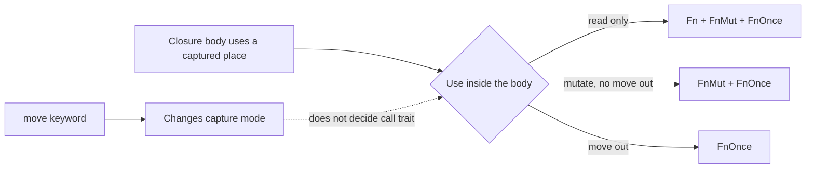

<TLDR>
  <TLDRCell label="what">
    A closure is a callable value with an anonymous type. It can capture local variables from where it is defined, letting you pass behavior together with its context.
  </TLDRCell>
  <TLDRCell label="trap">
    `move` changes how a closure captures values; it does not mean the closure is callable only once. The body determines whether the closure implements `Fn`, `FnMut`, or `FnOnce`.
  </TLDRCell>
  <TLDRCell label="fix">
    Start from how often the caller invokes it: use `FnOnce` for one call, `FnMut` for repeated calls that may change state, and `Fn` only when shared calls are required.
  </TLDRCell>
</TLDR>

## What it is and why it exists

A <Term id="closure">closure</Term> is an anonymous function expression that you can store in a variable, call immediately, or pass to another function.
A regular function item cannot directly carry local state from its call site, while a closure can capture variables near its definition.
One callable value can therefore hold both an operation and the configuration or state that operation needs.

Rust uses closures for iterator adapters, deferred computation, sorting rules, thread tasks, and callback APIs.
For example, `sort_by_key` only needs a way to obtain a key from an element; it should not know which field the caller chose.
A short closure keeps that policy at the use site while the type system still checks its parameter, result, and borrows.

A closure is not a special kind of function pointer.
Every closure expression produces a unique, unnameable anonymous type that stores the environment it actually captures.
A non-async closure that captures nothing can coerce to a matching <Term id="function-pointer">function pointer</Term>; a capturing closure cannot.

Concise syntax does not let a closure bypass ownership rules.
The compiler still determines whether each capture is a shared borrow, a special unique immutable borrow, a mutable borrow, or a by-value capture.
Those choices affect how long the closure can live, how it can be called, whether it can cross threads, and how outside code may use the original variable while the closure exists.

## How it works

### Syntax and type inference

A closure surrounds its parameters with vertical bars, as in `|amount| amount * 2`.
The use site usually supplies the parameter and result types; when intent or ambiguity requires annotations, you can write `|amount: u32| -> u32 { amount * 2 }`.
Multiple statements need braces, and the final expression without a semicolon is the return value.

The parameter types of one closure expression are inferred once.
If `let identity = |value| value` is first called with a `String`, the same `identity` cannot later be called with an integer.
A closure is not an implicitly generic function; define a generic function or API when one implementation must accept several input types.

Even two non-capturing closures with identical source usually have different anonymous types.
Generic parameters can receive each concrete type separately. A plain `Vec` needs a common representation such as function pointers, trait objects, or an explicit enum to hold different closure types together.

### Capture modes

A <Term id="capture-mode">capture mode</Term> is chosen from the first mode compatible with how the body uses an outside place expression.
The compiler tries to capture no more than necessary instead of taking ownership of an entire value whenever its name appears.

| Use in the closure body | Typical capture | Effect on the outside value |
|---|---|---|
| Read only | Shared borrow | Both the closure and outside code may read |
| Write through a captured `&mut T` | Unique immutable borrow | The closure has exclusive use of the reference without mutating the reference variable |
| Mutate the captured place directly | Mutable borrow | Outside code cannot access that place during the borrow |
| Move out a non-`Copy` value | By-value capture | Ownership enters the closure and the outside value is unavailable |

Unique immutable borrowing is specific to closure capture.
When a closure mutates through an outer `&mut T` but does not need to change the reference variable, the capture must remain unique without being a mutable borrow of that variable.
In everyday code, you normally need to understand its exclusive effect from borrow errors rather than name this internal mode.

The `move` keyword asks a closure to take mentioned outside places by value; a `Copy` value is copied.
It is common when sending owned data to a thread or returning a closure, but <Term id="move-semantics">move semantics</Term> neither deep-copy captured data nor turn a captured reference into owned data.
If `text` is itself an `&str`, `move || text.len()` still moves a reference into the closure.

In Rust 2021 and later editions, the compiler can usually capture a field path precisely instead of always capturing a whole struct.
A closure that moves only `record.name` does not necessarily own the other fields of `record`.
Array indexes, `#[repr(packed)]` structs, and capture paths with shared prefixes have more conservative rules, so field-level capture is not unconditional.

The connection between captures and call traits can be summarized as follows:



### `Fn`, `FnMut`, and `FnOnce`

A <Term id="closure-call-trait">closure call trait</Term> describes how the call operation receives the closure value.
Every closure implements `FnOnce`; a closure that does not move out of its captured environment also implements `FnMut`; one that neither moves out nor mutates captured values also implements `Fn`.
This classification depends on what the body does, not merely on the presence of `move`.

| Bound | Call receiver | Capability the caller may rely on |
|---|---|---|
| `FnOnce(Args) -> R` | Closure by value | Can be called at least once |
| `FnMut(Args) -> R` | Call through `&mut self` | Can be called repeatedly and may mutate captured state |
| `Fn(Args) -> R` | Call through `&self` | Can be called repeatedly through shared access without mutating or moving captured state |

The traits have a substitution relationship: an `Fn` value also satisfies `FnMut` and `FnOnce`, and an `FnMut` value also satisfies `FnOnce`.
An API that calls only once should therefore prefer `FnOnce`.
Changing the bound to `Fn` does not make the call faster; it only excludes valid callers that mutate state or consume a capture.

Whether a closure binding needs `mut` depends on whether calling requires a mutable receiver.
Calling an `FnMut` closure changes the environment stored in the closure, so the binding is normally declared as `let mut callback`.
A function that receives one as a generic parameter likewise often writes `mut callback: F`.

`Fn` does not mean pure or thread-safe.
The closure may still log, access global state, or mutate data through the interior mutability of `Cell`, atomics, and locks; `Fn` says only that a call does not require mutable access to the closure value itself.
Sharing across threads still requires separate `Send` and `Sync` checks.

### Choosing a parameter bound

A generic parameter such as `F: FnMut(&Record) -> bool` uses static dispatch.
The caller's concrete closure type is known at compile time and the API need not box it. This is why iterator methods commonly use generic closure parameters.
Choose the trait from how many times and in what way the implementation invokes the closure, not by guessing what callers might capture.

One-shot deferred work, error fallbacks, and thread entry points can usually accept `FnOnce`.
A retry loop or accessor that updates a counter needs `FnMut`.
Require `Fn` only when the implementation must call through shared access or make the same callback available to several shared readers.

The argument and result signature is part of the trait bound.
`Fn(&str) -> usize` and `Fn(String) -> usize` express different ownership boundaries; an extra `clone()` inside the body does not make them equivalent.
When designing an API, decide whether data is lent or transferred to the callback before choosing the call trait.

### Returning and storing closures

A function returning one concrete closure implementation can use `-> impl Fn(i32) -> i32`.
`impl Trait` hides the unnameable anonymous type, but one function definition must still return one concrete type.
Two branches that each contain a closure expression produce different anonymous types even when their signatures and source look alike.

When runtime control flow chooses among implementations, or one collection must store different closures, use `Box<dyn Fn(...) -> ...>`.
This introduces owned boxing and dynamic dispatch, and it may require explicit lifetime, `Send`, or `Sync` bounds.
If every candidate captures nothing, a function pointer is often a simpler common type.

A returned closure that borrows an input must expose that borrow, for example as `impl Fn() + '_`.
`'static` means the value contains no borrow shorter than the required lifetime; it does not mean the closure object lives forever.
Mechanically adding `'static` to a wrong return type cannot extend the lifetime of a local variable.

## Examples

The four examples progress through capture inference, call traits, return types, and a thread boundary.
Each was compiled and run with Rust 1.98 using the 2024 edition.

### Borrow configuration and mutate state

`charge` takes a shared borrow of `tax_rate` and a mutable borrow of `collected_tax`.
Because it changes captured state, the closure implements `FnMut` and its binding must be `mut`.

<Depth level="quick">

```rust title="capture_modes.rs"
fn main() {
    let tax_rate = 0.20_f64;
    let mut collected_tax = 0.0_f64;

    let mut charge = |subtotal: f64| {
        let tax = subtotal * tax_rate;
        collected_tax += tax;
        println!("subtotal={subtotal:.2}, tax={tax:.2}");
    };

    charge(50.0);
    charge(25.0);
    println!("collected={collected_tax:.2}");
}
```

```text
subtotal=50.00, tax=10.00
subtotal=25.00, tax=5.00
collected=15.00
```

</Depth>

After the last call, the closure's mutable borrow of `collected_tax` is no longer needed, so the final `println!` can read the total.
Non-lexical lifetimes shorten the borrow from its last use; an explicit `drop(charge)` is unnecessary.

Reading `collected_tax` between the two calls would make that access overlap the borrow needed by the later closure call, so the compiler would reject it.
Reorder the accesses, or have the closure return each result and let outside code own the accumulated state explicitly.

### Separate `move` from `FnOnce`

The first closure captures a `String` by value but only reads it on each call, so it can be passed to `run_twice`, which requires `FnMut`.
The second closure moves `payload` out of itself and therefore satisfies only `FnOnce`.

```rust title="call_traits.rs"
fn run_twice<F>(mut action: F)
where
    F: FnMut(),
{
    action();
    action();
}

fn run_job<F>(job: F) -> String
where
    F: FnOnce() -> String,
{
    job()
}

fn main() {
    let queue = String::from("payments");
    let announce = move || println!("queue={queue}");
    run_twice(announce);

    let payload = String::from("invoice-42");
    let take_payload = move || payload;
    println!("processed={}", run_job(take_payload));
}
```

```text
queue=payments
queue=payments
processed=invoice-42
```

`run_twice` chooses `FnMut` because it calls repeatedly and has no reason to forbid a closure with mutable state.
A closure that implements `Fn` works here because it provides the stronger capability.

`run_job` calls once, so `FnOnce` is the most permissive correct bound.
Changing it to `Fn` would needlessly reject `take_payload`, whose owned `String` result must move the captured value out.

### Return one type or box several

Every call to `offset_by` returns the type produced by one closure expression, so `impl Fn` is appropriate.
The branches in `choose_transform` produce different types and must first coerce to a shared trait-object type.

```rust title="returning_closures.rs"
fn offset_by(delta: i32) -> impl Fn(i32) -> i32 {
    move |value| value + delta
}

fn choose_transform(triple: bool) -> Box<dyn Fn(i32) -> i32> {
    if triple {
        Box::new(|value| value * 3)
    } else {
        Box::new(|value| value + 3)
    }
}

fn main() {
    let add_five = offset_by(5);
    println!("offset={}", add_five(10));

    let transform = choose_transform(true);
    println!("selected={}", transform(7));
}
```

```text
offset=15
selected=21
```

The omitted object lifetime on `Box<dyn Fn>` defaults to `'static` in this owned return position.
Neither candidate borrows local data, so both satisfy that requirement.

An enum with an ordinary method may be clearer when the set of transformations is closed and each variant needs different data.
Trait objects suit an open runtime collection, but they should not be a reflexive way around an unexplained type error.

### Transfer an owned task to a thread

`thread::spawn` requires a task implementing `FnOnce() -> T + Send + 'static`.
`move` puts the batch ID and reading vector into the task; the closure consumes the vector with `into_iter()` and returns its result to the main thread.

```rust title="thread_task.rs"
use std::thread;

fn main() {
    let batch_id = String::from("A-17");
    let readings = vec![18, -1, 27, 0];

    let worker = thread::spawn(move || {
        let accepted_total: i32 = readings
            .into_iter()
            .filter(|reading| *reading >= 0)
            .sum();
        (batch_id, accepted_total)
    });

    let (batch_id, accepted_total) = worker.join().unwrap();
    println!("batch={batch_id}, total={accepted_total}");
}
```

```text
batch=A-17, total=45
```

Here `'static` excludes a task that borrows the current stack frame, while `Send` requires the closure's stored state to be safe to transfer to the worker thread.
Whether those auto traits hold ultimately depends on every captured field and its capture mode.

Production code should also handle a thread panic instead of calling `unwrap()` directly.
The example uses `unwrap()` to keep the focus on the closure boundary; a library API would normally propagate or translate the failure represented by the join result.

## Pitfalls

> [!PITFALL]
> **You equate `move` with one call.** `move` controls how the closure obtains its environment. The closure loses `FnMut` and `Fn` only when its body moves data out of a capture.
>
> **Fix:** Answer two separate questions: how a value enters the closure, and how a call uses it. A closure that only reads a by-value `String` may still implement `Fn`; do not clone repeatedly to satisfy a false assumption.

> [!PITFALL]
> **A callback has an unnecessarily strong trait bound.** Requiring `Fn` for a one-shot function rejects consuming closures; requiring it for a retry helper rejects a natural mutable counter.
>
> **Fix:** Derive the bound from the implementation's call count. Choose `FnOnce` for one call, `FnMut` for repetition with possible state changes, and `Fn` only when a shared receiver is required.

> [!PITFALL]
> **You expect `move` to repair every lifetime error.** If the captured variable is itself a reference, `move` transfers only that reference. The underlying data may still die too soon for a return value or thread.
>
> **Fix:** Create genuinely owned data at the ownership boundary, or keep the correct borrowing lifetime on the return type. Do not add `'static` mechanically or clone an entire context before checking the cost.

> [!PITFALL]
> **You put different closures straight into one collection.** Each closure expression has its own type; matching signatures do not make them the same element type.
>
> **Fix:** Non-capturing closures can share a `fn` pointer type, open heterogeneous collections can use `Box<dyn Fn>`, and a closed set can use an enum. The representation should match the runtime model.

> [!PITFALL]
> **You omit thread and lifetime bounds from a trait object.** `Box<dyn Fn()>` does not automatically include `Send`, `Sync`, or the right object lifetime, so a cross-thread registry may fail far from the storage boundary.
>
> **Fix:** State real requirements such as `Box<dyn Fn() + Send + Sync + 'static>` at the callback API boundary and inspect every capture. Do not add concurrency bounds when one thread owns all calls.

> [!PITFALL]
> **A broad clone hides a capture conflict.** Generated code often clones a whole request context or collection into a closure just to remove one borrow error. That obscures ownership and adds allocation.
>
> **Fix:** Narrow the capture to the fields the closure needs, then decide whether each field should be borrowed, moved, or shared through `Arc`. Put clones at named ownership transfers and test the purpose of each copy.

## In the AI era

**What generated code gets wrong here**

Models often answer `E0373` by adding `move` without checking whether a capture is still a short-lived reference; the code looks more owned but still fails when returned or spawned.
Another patch clones an entire context into the closure, or replaces state that naturally needs `FnMut` with `Arc<Mutex<_>>` merely to satisfy an incorrect `Fn` bound, changing concurrency and failure semantics for no reason.

Generated APIs also return different closure types from branches of one `-> impl Fn` function, or send a `Box<dyn Fn()>` to a thread before noticing that `Send` is missing.
Models may infer a call trait from `move` and then reuse a genuine `FnOnce` closure whose body moves out a capture.
These failures usually begin with an unstated ownership and call-count contract, not with difficult syntax.

**Ask your AI to check**

- List the exact capture path and mode for every closure, plus the restrictions on outside variables while the closure exists.
- Prove which of `Fn`, `FnMut`, and `FnOnce` the body implements, then compare that set with the caller's actual call count.
- Check lifetime, `Send`, `Sync`, and dynamic-dispatch requirements at every return or storage boundary, and justify each clone and box.

**Review checklist**

- Compile one test that calls the callback repeatedly and another that consumes a capture, confirming that the trait bound is neither stronger nor weaker than required.
- Trace every reference in a thread task or long-lived callback to its source, confirming that `move` stores genuinely owned data rather than a short borrow.
- Check whether a heterogeneous callback collection deliberately uses function pointers, trait objects, or an enum, then verify its `Send`, `Sync`, and lifetime bounds.

**Prompt vocabulary**

Use the exact terms `closure capture mode`, `capture path`, `move closure`,
`Fn` / `FnMut` / `FnOnce` call traits, `static dispatch`, `trait object`,
`non-capturing closure coercion`, and `object lifetime bound`.
Ask for a capture table and the exact call count. “Fix the closure lifetime” is too vague and often produces unexplained `move`, `clone()`, or `'static` changes.

<Depth level="deep">

## Closure types, layout, and auto traits

A useful approximation treats a closure type as an anonymous struct: each capture becomes a field, and implementations of the call traits execute the original body.
This is a semantic model, not a stable layout contract.
The Rust Reference does not guarantee field order, padding, or a concrete ABI, so code must not inspect captures through `transmute`, raw-pointer offsets, or fixed-size assumptions.

A non-capturing closure still has a distinct anonymous type, even when it happens to have zero size in a particular build.
Its coercion to a function pointer is a language-defined conversion, not a consequence of two types having the same memory layout.
A capturing closure must carry state and cannot coerce to an ordinary `fn` pointer.

A generic `F: Fn(...)` retains the concrete closure type and permits static dispatch.
A `dyn Fn(...)` is an unsized trait object normally used through a pointer such as `&dyn Fn`, `Box<dyn Fn>`, or `Arc<dyn Fn>`.
Choose between them based on whether the design needs a heterogeneous runtime collection and a stable erased boundary, without claiming an unmeasured performance difference.

### `Send`, `Sync`, `Clone`, and `Copy`

Closure implementations of `Send` and `Sync` follow from the stored capture fields and modes, much like the corresponding struct rules.
A shared-reference capture needs its referent to be `Sync` when the closure is sent; by-value, copied, unique immutable, and mutable-reference captures require the relevant values to be `Send`.

`Clone` and `Copy` are not automatic for every closure either.
A closure with a unique immutable or mutable-reference capture implements neither, and other captures must respectively satisfy `Clone` or `Copy`.
An `Fn` closure is therefore not necessarily copyable, and repeated calls are unrelated to copying the closure value.

Cloning a closure clones the state it stores by value, but the order in which captures are cloned is unspecified.
Code with observable side effects in `Clone` must not depend on that order.
When copying needs an explicit protocol, a named struct with a deliberate implementation is often clearer than derived closure cloning.

## Precise capture, borrow ranges, and drop timing

Precise capture works with place paths such as a local variable followed by field access, tuple indexing, or dereferencing.
When several paths share a prefix, their common ancestor needs the strongest capture mode required by any descendant.
If one branch only reads `state` but another moves out `state.queue`, the final capture can be stronger than the first read suggests.

Rust 2021 field-level capture can let a closure move one tuple or struct field while code continues to use disjoint fields.
It can also split drop timing: the field moved into the closure is dropped with the closure, while fields left behind are dropped at the end of the original scope.
Resource management that depends on field drop order should use explicit scopes or a named owner.

The live range of a borrowed capture follows the closure's last relevant use and does not always extend to the closing brace.
However, the borrow must remain live whenever the closure will be called again.
To diagnose a conflict, mark the closure creation, the outside conflicting access, and the last closure call instead of inserting `drop` or `clone()` at random.

### Lifetimes of returned closures

Returning `impl Fn() + 'a` says the hidden concrete closure type may contain a borrow valid for `'a`.
The caller cannot keep that return value beyond its source.
When a factory must return an independent task, move the required `String`, `Vec`, or other owned fields into it rather than returning a reference to a factory local.

Trait objects also have an object lifetime bound, related to but distinct from the lifetime of an outer reference or smart pointer.
`Box<dyn Fn()>` commonly implies `'static` in an owned return position, while `&'a dyn Fn()` is limited by the outer reference `'a`.
When an error mentions `'static`, first locate whether the requirement comes from a thread API, a storage location, or an object-lifetime default.

Rust 1.98 also supports async closures and the `AsyncFn` family, but their Future may borrow the closure's captures, adding another layer to repeat-call rules.
For an async callback, design the Future's borrowing and `Send` requirements together instead of mechanically replacing a synchronous `Fn` signature with one returning `impl Future`.
Executor behavior, task cancellation, and Future lifetimes belong to the related async topic.

</Depth>

<Checkpoint id="rust/closures" />

## Further reading

- [The Rust Programming Language: Closures](https://doc.rust-lang.org/1.98.0/book/ch13-01-closures.html)
- [The Rust Reference: closure types and capture rules](https://doc.rust-lang.org/1.98.0/reference/types/closure.html)
- [Rust 1.98 standard library: `Fn`](https://doc.rust-lang.org/1.98.0/std/ops/trait.Fn.html)
- [Rust 1.98 standard library: `FnMut`](https://doc.rust-lang.org/1.98.0/std/ops/trait.FnMut.html)
- [Rust 1.98 standard library: `FnOnce`](https://doc.rust-lang.org/1.98.0/std/ops/trait.FnOnce.html)
