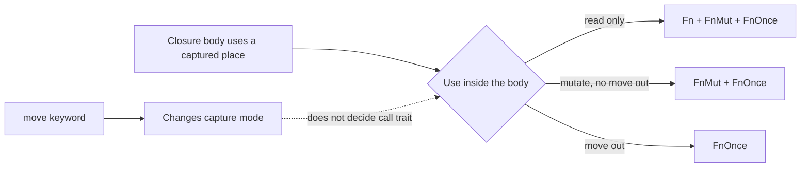

<TLDR>
  <TLDRCell label="what">
    闭包（closure）是具有匿名类型的可调用值；它可以从定义位置捕获局部变量，因此能把一段行为及其上下文一起传递。
  </TLDRCell>
  <TLDRCell label="trap">
    `move` 只改变捕获方式，不等于闭包只能调用一次；闭包实现 `Fn`、`FnMut` 还是 `FnOnce`，取决于闭包体怎样使用捕获值。
  </TLDRCell>
  <TLDRCell label="fix">
    先确定调用方需要调用几次，再选最宽松的可用约束：调用一次用 `FnOnce`，可能重复并修改状态用 `FnMut`，需要共享调用才用 `Fn`。
  </TLDRCell>
</TLDR>

## 是什么，为什么存在

<Term id="closure">闭包（closure）</Term>是一段可以保存到变量、立即调用或传给其他函数的匿名函数表达式。
普通函数项不能直接携带调用点的局部状态，闭包却可以捕获定义位置附近的变量。
因此，一份可调用值可以同时表达操作和完成该操作所需的配置或状态。

Rust 需要闭包来支持迭代器适配器、延迟计算、排序规则、线程任务和回调 API。
例如，`sort_by_key` 只需要知道怎样从元素取得排序键，不应知道调用方把哪个字段选作键。
调用方传入一个短闭包，就能把这条策略留在使用位置，同时仍由类型系统检查参数、返回值和借用。

闭包不是某种特殊的函数指针。
每个闭包表达式都会产生一个唯一且不可写出的匿名类型，该类型保存它实际捕获的环境。
不捕获环境的非异步闭包可以强制转换为匹配签名的<Term id="function-pointer">函数指针（function pointer）</Term>，捕获环境的闭包则不能。

闭包的简洁语法不会绕开所有权规则。
编译器仍要确定每个捕获是共享借用、特殊的唯一不可变借用、可变借用，还是按值捕获。
这些决定影响闭包能存活多久、能调用几次、能否在线程间发送，以及闭包存在期间外部代码还能怎样使用原变量。

## 工作原理

### 语法与类型推断

闭包用竖线包围参数，例如 `|amount| amount * 2`。
参数类型与返回类型通常由使用位置推断；需要消除歧义或公开意图时，可以写成 `|amount: u32| -> u32 { amount * 2 }`。
多条语句需要花括号，最后一个不带分号的表达式就是返回值。

一个闭包表达式的参数类型只会推断一次。
如果 `let identity = |value| value` 首次以 `String` 调用，同一个 `identity` 之后不能再以整数调用。
闭包不是隐式泛型函数；需要支持多种参数类型时，应定义泛型函数或实现相应的泛型 API。

即使两个无捕获闭包的源码完全相同，它们通常也有两个不同的匿名类型。
泛型参数能分别接收这些具体类型；一个普通 `Vec` 若要同时保存不同闭包类型，则需要函数指针、trait 对象或显式枚举等统一表示。

### 捕获方式

<Term id="capture-mode">捕获方式（capture mode）</Term>由闭包体对外部位置表达式的首次兼容使用决定。
编译器会尽量选择要求最少的方式，而不是一看到变量名就取得整个值的所有权。

| 闭包体中的使用 | 典型捕获 | 对外部值的影响 |
|---|---|---|
| 只读取 | 共享借用 | 闭包与外部代码都可读取 |
| 通过捕获的 `&mut T` 写入 | 唯一不可变借用 | 闭包独占该引用，但不修改引用变量本身 |
| 直接修改捕获位置 | 可变借用 | 借用期间外部不能再访问该位置 |
| 移出非 `Copy` 值 | 按值捕获 | 所有权进入闭包，外部不能再用该值 |

唯一不可变借用是闭包捕获特有的方式。
当闭包通过一个外层的 `&mut T` 修改目标、却不需要修改这个引用变量时，捕获既要保持唯一性，又不必成为对引用变量的可变借用。
日常代码通常只需从借用错误理解其独占效果，不需要写出这个内部名称。

`move` 关键字要求闭包按值取得所提及的外部位置；对于 `Copy` 值，效果是复制。
它常用于把拥有型数据交给线程或返回闭包，但<Term id="move-semantics">移动语义（move semantics）</Term>不会自动把捕获值深拷贝，也不会把捕获的引用变成拥有型数据。
若 `text` 本身是 `&str`，`move || text.len()` 移入闭包的仍是一条引用。

在 Rust 2021 及之后的 edition 中，编译器通常可以精确捕获字段路径，而不是总捕获整个结构体。
因此，只移动 `record.name` 的闭包不一定占有 `record` 的其他字段。
数组索引、`#[repr(packed)]` 结构和共享捕获前缀等情况有更保守的规则，不能把字段级捕获当作无条件保证。

捕获与调用 trait 的关系可以概括为：



### `Fn`、`FnMut` 与 `FnOnce`

<Term id="closure-call-trait">闭包调用 trait（closure call trait）</Term>描述调用操作以什么方式接收闭包值。
所有闭包都实现 `FnOnce`；没有从捕获环境移出值的闭包还实现 `FnMut`；既不移出也不修改捕获值的闭包还实现 `Fn`。
这里的分类看闭包体做了什么，而不是只看有没有 `move`。

| 约束 | 调用接收方式 | 调用方可以依赖的能力 |
|---|---|---|
| `FnOnce(Args) -> R` | 按值接收闭包 | 至少能调用一次 |
| `FnMut(Args) -> R` | 通过 `&mut self` 调用 | 能重复调用，且可能修改捕获状态 |
| `Fn(Args) -> R` | 通过 `&self` 调用 | 能重复共享调用，不修改或移出捕获状态 |

trait 之间是可替代关系：实现 `Fn` 的值也满足 `FnMut` 和 `FnOnce`，实现 `FnMut` 的值也满足 `FnOnce`。
所以，只调用一次的 API 应优先接受 `FnOnce`。
把约束写成 `Fn` 不会让调用更快，只会排除需要修改状态或消费捕获值的合法调用方。

闭包变量是否需要写成 `mut`，取决于调用是否需要可变接收者。
调用 `FnMut` 闭包会修改闭包保存的环境，因此绑定通常必须是 `let mut callback`。
把它作为泛型参数接收时，函数参数同样常写成 `mut callback: F`。

`Fn` 也不代表纯函数或线程安全。
闭包仍可写日志、访问全局状态，或通过 `Cell`、原子类型与锁的内部可变性修改数据；`Fn` 只说明调用不需要可变借用闭包值本身。
能否跨线程共享还要单独检查 `Send` 与 `Sync`。

### 参数约束的选择

泛型参数如 `F: FnMut(&Record) -> bool` 使用静态分发。
调用方的具体闭包类型会在编译期确定，API 不需要装箱；这也是迭代器方法常用泛型闭包参数的原因。
应根据实现实际调用闭包的次数和方式选择 trait，而不是猜测调用方会捕获什么。

只执行一次的延迟任务、错误回退和线程入口通常可以接受 `FnOnce`。
重试循环或会更新计数器的访问器需要 `FnMut`。
只有实现确实要通过共享引用调用，或要把同一回调提供给多个共享读者时，才需要 `Fn`。

参数与返回值签名是 trait 约束的一部分。
`Fn(&str) -> usize` 与 `Fn(String) -> usize` 表达不同的所有权边界，不能靠在闭包体里多写一个 `clone()` 来混为一谈。
设计 API 时先决定数据借给回调还是交给回调，再决定调用 trait。

### 返回与保存闭包

函数返回一种具体闭包实现时，可以写 `-> impl Fn(i32) -> i32`。
`impl Trait` 隐藏了不可写出的匿名类型，但一次函数定义仍只能返回一个具体类型。
`if` 的两个分支各写一个闭包表达式时，这两个匿名类型不同，即使签名与源码看起来相同。

运行时需要在多种闭包实现之间选择，或要把不同闭包放进同一集合时，可以使用 `Box<dyn Fn(...) -> ...>`。
这会引入拥有型装箱和动态分发，也可能需要显式的生命周期、`Send` 或 `Sync` 边界。
如果所有候选都不捕获环境，函数指针往往是更简单的统一类型。

返回闭包若借用了输入，返回类型必须表达该借用，例如 `impl Fn() + '_`。
`'static` 表示值不含比程序所需期限更短的借用，并不表示闭包对象会永久存活。
给错误的返回值机械添加 `'static` 不能延长局部变量的生命周期。

## 示例

下面四个例子依次展示捕获推断、调用 trait、返回类型和线程边界。
每段代码都由 Rust 1.98 以 2024 edition 编译并实际运行。

### 借用配置并修改状态

`charge` 共享借用 `tax_rate`，同时可变借用 `collected_tax`。
因为它会修改捕获状态，所以闭包实现 `FnMut`，绑定也要写成 `mut`。

<Depth level="quick">

```rust title="capture_modes.rs"
fn main() {
    let tax_rate = 0.20_f64;
    let mut collected_tax = 0.0_f64;

    let mut charge = |subtotal: f64| {
        let tax = subtotal * tax_rate;
        collected_tax += tax;
        println!("subtotal={subtotal:.2}, tax={tax:.2}");
    };

    charge(50.0);
    charge(25.0);
    println!("collected={collected_tax:.2}");
}
```

```text
subtotal=50.00, tax=10.00
subtotal=25.00, tax=5.00
collected=15.00
```

</Depth>

最后一次调用后，不再需要闭包对 `collected_tax` 的可变借用，所以后面的 `println!` 可以读取累计值。
这是非词法生命周期根据最后使用位置缩短借用的结果，不需要显式 `drop(charge)`。

若在两次 `charge` 调用之间读取 `collected_tax`，借用仍会与之后的闭包调用重叠，编译器会拒绝。
修复方式是调整访问顺序，或让闭包返回本次结果并由外部明确管理累计状态。

### 区分 `move` 与 `FnOnce`

第一个闭包按值捕获 `String`，但每次只读取它，所以可以传给要求 `FnMut` 的 `run_twice`。
第二个闭包从自身移出 `payload`，因此只能满足 `FnOnce`。

```rust title="call_traits.rs"
fn run_twice<F>(mut action: F)
where
    F: FnMut(),
{
    action();
    action();
}

fn run_job<F>(job: F) -> String
where
    F: FnOnce() -> String,
{
    job()
}

fn main() {
    let queue = String::from("payments");
    let announce = move || println!("queue={queue}");
    run_twice(announce);

    let payload = String::from("invoice-42");
    let take_payload = move || payload;
    println!("processed={}", run_job(take_payload));
}
```

```text
queue=payments
queue=payments
processed=invoice-42
```

`run_twice` 选择 `FnMut`，因为它需要重复调用，同时没有理由禁止带可变状态的闭包。
一个实现 `Fn` 的闭包可以用在这里，因为 `Fn` 提供了更强的能力。

`run_job` 只调用一次，所以 `FnOnce` 是最包容的正确约束。
如果把它改成 `Fn`，`take_payload` 会被无谓排除，因为返回拥有型 `String` 必须把捕获值移出闭包。

### 返回一种类型或装箱多种类型

`offset_by` 的所有调用都返回同一个闭包表达式生成的类型，因此适合 `impl Fn`。
`choose_transform` 的分支产生不同类型，只能先转换为共同的 trait 对象类型。

```rust title="returning_closures.rs"
fn offset_by(delta: i32) -> impl Fn(i32) -> i32 {
    move |value| value + delta
}

fn choose_transform(triple: bool) -> Box<dyn Fn(i32) -> i32> {
    if triple {
        Box::new(|value| value * 3)
    } else {
        Box::new(|value| value + 3)
    }
}

fn main() {
    let add_five = offset_by(5);
    println!("offset={}", add_five(10));

    let transform = choose_transform(true);
    println!("selected={}", transform(7));
}
```

```text
offset=15
selected=21
```

这里的 `Box<dyn Fn>` 省略了显式生命周期，因此默认对象生命周期边界在这个返回位置是 `'static`。
两个候选都不借用局部变量，所以满足该要求。

如果转换规则数量固定且每种规则需要不同数据，枚举加一个普通方法也可能更清楚。
trait 对象适合开放的运行时集合，但不应只是为了绕过尚未理解的类型错误。

### 把拥有型任务交给线程

`thread::spawn` 要求任务实现 `FnOnce() -> T + Send + 'static`。
`move` 把批次编号和读数向量放进任务，闭包再通过 `into_iter()` 消费向量，最后把结果交回主线程。

```rust title="thread_task.rs"
use std::thread;

fn main() {
    let batch_id = String::from("A-17");
    let readings = vec![18, -1, 27, 0];

    let worker = thread::spawn(move || {
        let accepted_total: i32 = readings
            .into_iter()
            .filter(|reading| *reading >= 0)
            .sum();
        (batch_id, accepted_total)
    });

    let (batch_id, accepted_total) = worker.join().unwrap();
    println!("batch={batch_id}, total={accepted_total}");
}
```

```text
batch=A-17, total=45
```

`'static` 在这里排除了借用当前栈帧的任务，`Send` 则要求闭包保存的状态可以安全地转移到工作线程。
是否满足这些自动 trait，最终取决于每个捕获字段及其捕获方式。

真实服务还应处理线程 panic，而不是直接 `unwrap()`。
示例使用 `unwrap()` 是为了把焦点放在闭包边界；库 API 通常会传播或转换 `join()` 返回的失败信息。

## 陷阱

> [!PITFALL]
> **把 `move` 当成只能调用一次。** `move` 决定闭包怎样取得环境；只有闭包体从捕获值移出数据时，该闭包才会失去 `FnMut` 与 `Fn`。
>
> **修复：** 分开回答两个问题：值怎样进入闭包，调用时又怎样使用它。若闭包只读取按值捕获的 `String`，它仍可实现 `Fn`；不要为了满足错误假设而重复克隆。

> [!PITFALL]
> **给回调写了过强的 trait 约束。** 只调用一次的函数要求 `Fn`，会拒绝消费型闭包；重试器要求 `Fn`，则会拒绝自然的可变计数器。
>
> **修复：** 从实现的调用次数反推约束。一次调用选 `FnOnce`，重复且允许状态变化选 `FnMut`，确实需要共享接收者时再选 `Fn`。

> [!PITFALL]
> **以为 `move` 能修复所有生命周期错误。** 若捕获变量本身是引用，`move` 只移动引用；返回它或交给线程时，底层数据仍可能活得不够久。
>
> **修复：** 在所有权边界创建真正的拥有型数据，或在返回类型上保留准确的借用生命周期。不要机械添加 `'static`，也不要在未确认成本时克隆整个上下文。

> [!PITFALL]
> **试图把不同闭包直接放进同一个集合。** 每个闭包表达式有独立类型，签名相同也不会自动变成同一种元素。
>
> **修复：** 无捕获闭包可统一为 `fn` 指针；开放的异构集合可用 `Box<dyn Fn>`；候选固定且需要保留差异时可定义枚举。选择应反映运行时模型。

> [!PITFALL]
> **忽略 trait 对象的线程与生命周期边界。** `Box<dyn Fn()>` 不会自动带上 `Send`、`Sync` 或合适的对象生命周期，放入跨线程注册表时常在较远位置报错。
>
> **修复：** 在存储回调的 API 边界写清 `Box<dyn Fn() + Send + Sync + 'static>` 等真实要求，并逐项检查捕获值。若只由一个线程拥有，就不要添加用不到的并发约束。

> [!PITFALL]
> **用大范围克隆掩盖捕获冲突。** 生成代码常把整个请求上下文或集合克隆进闭包，只为消除一次借用错误，这会模糊谁拥有数据并增加分配。
>
> **修复：** 先缩小到闭包真正需要的字段，并决定该字段应借用、移动还是用 `Arc` 共享。克隆应出现在明确的所有权交接点，并由名称与测试说明每份副本的用途。

<Depth level="deep">

## 闭包类型、布局与自动 trait

可以把闭包类型近似理解为一个匿名结构体：每个捕获项成为其中一个字段，调用 trait 的实现执行原来的闭包体。
这只是语义模型，不是稳定布局契约。
Rust Reference 没有保证字段顺序、填充或具体 ABI，因此不要通过 `transmute`、裸指针偏移或固定大小假设检查闭包内容。

无捕获闭包的类型仍然是独立的匿名类型，哪怕它在当前构建中大小为零。
它能强制转换为函数指针，是语言定义的转换规则，不是因为两个类型拥有相同内存布局。
捕获闭包需要携带状态，所以不能转换成普通 `fn` 指针。

泛型 `F: Fn(...)` 会保留具体闭包类型并允许静态分发。
`dyn Fn(...)` 是不定大小的 trait 对象，通常通过 `&dyn Fn`、`Box<dyn Fn>` 或 `Arc<dyn Fn>` 等指针使用。
选择两者时应看是否需要异构运行时集合与稳定的擦除边界，不应声称动态分发必然造成某个未经测量的性能差值。

### `Send`、`Sync`、`Clone` 与 `Copy`

闭包是否实现 `Send` 和 `Sync`，按它保存的捕获字段及捕获方式推导，规则与相应结构体类似。
共享引用捕获要跨线程发送时，所指类型需要 `Sync`；按值、复制、唯一不可变借用或可变借用捕获要发送时，相关类型需要 `Send`。

`Clone` 与 `Copy` 也不是所有闭包自动拥有的能力。
闭包含有唯一不可变借用或可变借用捕获时，不实现这两个 trait；其他捕获还必须分别满足 `Clone` 或 `Copy`。
所以不能从闭包实现 `Fn` 推导它一定可复制，也不能把重复调用与复制闭包当成同一件事。

克隆闭包会克隆其按值保存的状态，但捕获值的克隆顺序没有保证。
如果克隆操作带有可观察副作用，依赖其顺序会让代码含有不稳定假设。
需要明确复制协议时，定义命名结构体及显式实现通常比依赖派生式闭包克隆更清楚。

## 精确捕获、借用区间与析构时机

精确捕获以位置路径为单位，例如局部变量后接字段访问、元组索引或解引用。
多个路径共享前缀时，公共祖先需要采用足以满足所有后代使用的捕获方式。
若一个分支只读取 `state`，另一个分支却移出 `state.queue`，最终捕获可能比单看第一处读取更强。

Rust 2021 的字段级捕获能让闭包移动元组或结构体的一个字段，同时继续使用不相交字段。
但这也会分开析构时间：移入闭包的字段随闭包析构，留在原变量中的字段则在原作用域结束时析构。
依赖字段析构顺序的资源管理应改成显式作用域或命名拥有者。

借用捕获的有效区间由闭包最后一次相关使用决定，并不总延伸到词法代码块末尾。
不过，只要之后还要调用闭包，其捕获借用就必须保持有效。
诊断冲突时应标出闭包创建点、外部冲突访问和闭包最后调用点，而不是随意插入 `drop` 或 `clone()`。

### 返回闭包的生命周期

返回 `impl Fn() + 'a` 表示隐藏的具体闭包类型内部可能包含有效期为 `'a` 的借用。
调用方不能让返回值活过该借用来源。
如果工厂要返回独立任务，应把所需的 `String`、`Vec` 或其他拥有型字段移入闭包，而不是返回对工厂局部变量的引用。

trait 对象还有对象生命周期边界，它与引用或智能指针本身的生命周期相关但不是同一个概念。
`Box<dyn Fn()>` 在常见拥有型返回位置通常隐含 `'static`，`&'a dyn Fn()` 则受外层引用 `'a` 限制。
错误信息出现 `'static` 时，应先确定要求来自线程 API、存储位置还是对象生命周期默认值，再决定所有权。

Rust 1.98 还支持异步闭包及 `AsyncFn` 系列 trait，但其 Future 可能借用闭包捕获，因此可重复调用规则比同步闭包多一层。
需要异步回调时，应把 Future 的借用和 `Send` 要求一起设计，而不是把同步 `Fn` 签名机械替换成返回 `impl Future`。
具体的执行器、任务取消和 Future 生命周期属于相关的异步主题。

</Depth>

<Checkpoint id="rust/closures" />

## 延伸阅读

- [Rust 程序设计语言：闭包](https://doc.rust-lang.org/1.98.0/book/ch13-01-closures.html)
- [Rust Reference：闭包类型与捕获规则](https://doc.rust-lang.org/1.98.0/reference/types/closure.html)
- [Rust 1.98 标准库：`Fn`](https://doc.rust-lang.org/1.98.0/std/ops/trait.Fn.html)
- [Rust 1.98 标准库：`FnMut`](https://doc.rust-lang.org/1.98.0/std/ops/trait.FnMut.html)
- [Rust 1.98 标准库：`FnOnce`](https://doc.rust-lang.org/1.98.0/std/ops/trait.FnOnce.html)
