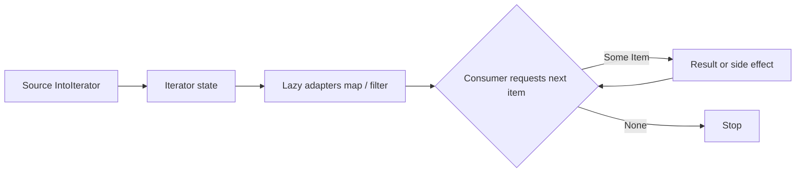

<TLDR>
  <TLDRCell label="what">
    An iterator yields values one at a time by repeatedly returning `Option<Item>`, composing traversal, transformation, and aggregation into one pipeline.
  </TLDRCell>
  <TLDRCell label="trap">
    Adapters such as `map` and `filter` are lazy: without a consumer their closures never run, while `into_iter()` may also move the original collection.
  </TLDRCell>
  <TLDRCell label="fix">
    Choose `iter()`, `iter_mut()`, or `into_iter()` from the ownership intent, then drive the pipeline explicitly with `collect`, `find`, `sum`, or `for`.
  </TLDRCell>
</TLDR>

## What it is and why it exists

An <Term id="iterator">iterator</Term> is a stateful value whose `next(&mut self)` call
returns the next element, or `None` when no element is available.
It hides how the next element is obtained, so callers need not know whether data comes from an array, range, collection, or on-demand computation.

Rust's `Iterator` trait has one required method, `next`, and declares its output through the associated type `Item`.
Most other methods have default implementations: methods such as `map` and `filter` construct new iterators,
while methods such as `collect`, `fold`, and `find` drive iteration and produce a result.

Iterators solve more than repetitive loop syntax.
They make transformations composable while the compiler tracks every step's element type and ownership,
and they let a consumer stop as soon as it has enough information without first constructing a complete intermediate collection.

You meet iterators on `Vec`, slices, ranges, string characters or lines, map views, and many standard-library return values.
An <Term id="iterable">iterable</Term> that implements `IntoIterator` can also appear directly in a `for` loop.
`for item in value` converts `value` into an iterator, then repeatedly calls `next`.

Laziness here describes evaluation timing, not asynchronous execution or background parallelism.
An adapter stores the state and closure needed for its next step; a consumer still requests elements on the current thread.
Parallel processing belongs to another abstraction such as Rayon and is not automatically supplied by the standard `Iterator` trait.

## How it works

### `Iterator` and `IntoIterator`

`Iterator` represents cursor-like state that can already yield elements; `IntoIterator` says a value can produce that state.
A type may implement `IntoIterator` separately for its owned value, shared reference, and mutable reference,
so the same `for` syntax can mean moving, read-only borrowing, or mutable borrowing.

For `Vec<T>`, the common entry points express three distinct intentions:

| Entry point | Typical `Item` | Effect on source | Intent |
|---|---|---|---|
| `values.iter()` or `&values` | `&T` | Shared borrow; collection remains usable | Read-only observation |
| `values.iter_mut()` or `&mut values` | `&mut T` | Exclusive borrow; elements may change in place | In-place update |
| `values.into_iter()` or `values` | `T` | Moves the collection and yields its elements | Consume the input |

The `Item` column describes the typical `Vec<T>` case, not a universal law for every type.
Arrays, maps, and custom types may choose implementations that match their own semantics.
When reading a generic API, check whether it requires `Iterator` or `IntoIterator` and what the actual `Item` type is.

### Adapters and consumers

An <Term id="iterator-adapter">iterator adapter</Term> takes one iterator and returns another.
`map` transforms elements, `filter` retains them conditionally, `enumerate` adds indices,
`zip` pairs two sources, and `take` limits how many items may be produced.

A <Term id="terminal-operation">terminal operation</Term> requests elements and produces a final observable result.
Rust's documentation commonly calls these methods consuming adapters because they take ownership of the iterator
or advance its state through `&mut self`. `collect`, `sum`, `count`, `fold`, `any`, and `find` are on this side.

An adapter chain does not evaluate by mapping every input first and filtering every mapped result afterward.
For each request from the consumer, one value passes through the relevant closures in chain order; if it is filtered out, the consumer requests another.
Unless you explicitly collect, there is normally no intermediate `Vec`.



### `Option` and iterator state

`next` needs `&mut self` because obtaining an item usually changes the current position.
Returning `Some(item)` means this call yielded one item; returning `None` means this call found no next item.
The same type-safe representation therefore handles both an empty iterator and the end of iteration.

Many consumers short-circuit.
`find` returns after the first match, `any` returns after the first `true`,
and collecting `Result` values stops at the first `Err`.
Elements that were never requested do not run the closures before those consumers.

Whether you can continue using an iterator after a consumer depends on how the method receives `self`.
`find`, `any`, and `nth` take `&mut self`, so a named iterator remains positioned after the consumed elements;
`collect` and `count` take `self` and move the entire iterator into the operation.

### The target type of `collect`

`collect` does not have one fixed `Vec` return type.
It uses the target type's `FromIterator` implementation to decide how to assemble elements,
so you normally identify that target with a variable type, a function return type, or `collect::<Vec<_>>()`.

This dispatch also explains why an `Iterator<Item = Result<T, E>>` can collect into `Result<Vec<T>, E>`.
The outer `Result` implementation of `FromIterator` handles each item in turn: all `Ok` values produce the vector,
while the first `Err` immediately becomes the result.

## Examples

### Choose ownership deliberately

The first example uses one vector for shared and mutable borrowing, then another vector for owned iteration.
`iter()` lets the sum read elements, `iter_mut()` temporarily grants exclusive access to each element,
and `into_iter()` moves each `String` into the transformation closure, so `labels` cannot be used afterward.

<Depth level="quick">

```rust title="ownership.rs"
fn main() {
    let mut scores = vec![72, 88, 91];

    let total: i32 = scores.iter().sum();
    println!("total: {total}");

    scores.iter_mut().for_each(|score| *score += 1);
    println!("adjusted: {scores:?}");

    let labels = vec![String::from("draft"), String::from("ready")];
    let upper: Vec<String> = labels
        .into_iter()
        .map(|label| label.to_uppercase())
        .collect();
    println!("owned: {upper:?}");
}
```

```text
total: 251
adjusted: [73, 89, 92]
owned: ["DRAFT", "READY"]
```

</Depth>

The `Vec<String>` annotation supplies the target type for `collect`.
If you need `labels` afterward, you can use `labels.iter()` and accept `&String`,
but an owned string result still requires an explicit clone or a new string; borrowing does not manufacture ownership.

### Observe laziness and short-circuiting

`inspect` is useful for observing which elements actually cross a pipeline during learning or diagnosis.
The `find` below needs only the first even square greater than `20`,
so it stops after reading `8` and producing `64`; `11` and `14` never enter the pipeline.

```rust title="lazy_pipeline.rs"
fn main() {
    let readings = [2, 5, 8, 11, 14];

    let first_large_even_square = readings
        .iter()
        .copied()
        .inspect(|reading| println!("checked: {reading}"))
        .filter(|reading| reading % 2 == 0)
        .map(|reading| reading * reading)
        .find(|square| *square > 20);

    println!("result: {first_large_even_square:?}");
}
```

```text
checked: 2
checked: 5
checked: 8
result: Some(64)
```

Calling `copied()` first changes `&i32` into `i32`, so later closures do not need to handle nested references.
`inspect` is itself lazy; it prints only because the final `find` requests elements.
Production code should not rely on `inspect` for required business side effects because reordering or short-circuiting changes the call count.

### Let an error stop collection

When any bad input must fail the entire operation, retain each `Result` and collect it directly
instead of passing `.ok()` to `filter_map` and silently dropping errors.
The third string below is never parsed because the second string has already produced `Err`.

```rust title="fallible_collect.rs"
fn main() {
    let readings = ["18", "bad", "24"];

    let parsed: Result<Vec<i32>, _> = readings
        .into_iter()
        .map(|text| {
            println!("parsing: {text}");
            text.parse::<i32>()
        })
        .collect();

    println!("success: {}", parsed.is_ok());
}
```

```text
parsing: 18
parsing: bad
success: false
```

`Result<Vec<i32>, _>` fixes the collection type for successful values while letting `parse` determine the error type.
Real code would normally return or handle the specific error stored in `parsed`;
the example prints a boolean so its output does not depend on details of an error's debug format.

### Implement a finite iterator

A custom iterator keeps its not-yet-produced state in a struct and defines one transition in `next`.
This ticket-ID iterator uses the half-open interval `[start, end)`;
once it reaches `end`, it remains exhausted and every later call returns `None`.

```rust title="custom_iterator.rs"
struct TicketIds {
    next: u32,
    end: u32,
}

impl TicketIds {
    fn new(start: u32, end: u32) -> Self {
        Self { next: start, end }
    }
}

impl Iterator for TicketIds {
    type Item = String;

    fn next(&mut self) -> Option<Self::Item> {
        if self.next >= self.end {
            return None;
        }

        let id = format!("T-{:03}", self.next);
        self.next += 1;
        Some(id)
    }

    fn size_hint(&self) -> (usize, Option<usize>) {
        let remaining = self.end.saturating_sub(self.next) as usize;
        (remaining, Some(remaining))
    }
}

fn main() {
    let ids: Vec<String> = TicketIds::new(7, 10).collect();
    println!("{ids:?}");
}
```

```text
["T-007", "T-008", "T-009"]
```

Implementing `Iterator` gives this type default methods such as `map`, `take`, and `collect` automatically.
Its `size_hint` reports the exact remaining count so a collector can plan capacity;
the hint must change with `next` rather than treating the original length as a permanent answer.

## Pitfalls

> [!PITFALL]
> **You construct an adapter without a consumer.** Writing `values.iter().map(...)` only constructs another iterator; even if its closure mutates state or prints, it does not run by itself.
>
> **Fix:** If you intend to transform data, pass the result to a consumer such as `collect`; if you only need per-item side effects, prefer a clear `for` loop. Do not append `collect::<Vec<_>>()` merely to silence an `unused_must_use` warning because that may add a useless allocation.

> [!PITFALL]
> **You move a collection accidentally.** Calling `into_iter()` on an owned `Vec<String>` yields each `String` by value and consumes the vector. Generated code often reads the original variable later, triggers `E0382`, then hides the design error by cloning the whole vector.
>
> **Fix:** Use `iter()` when the collection is still needed, `iter_mut()` for in-place updates, and `into_iter()` only when elements should transfer ownership. Call `cloned()` or perform an explicit transformation on only the elements that must cross an owned API boundary.

> [!PITFALL]
> **You wrestle with nested references in `filter`.** `filter` passes a reference to each candidate into its predicate. If the upstream `iter()` already has `Item = &T`, the closure parameter can behave like `&&T`, and elaborate dereferencing is easy to get wrong.
>
> **Fix:** For `Copy` elements, use `.iter().copied()` early so the rest of the pipeline handles `T`. For non-`Copy` elements, retain the borrow and confirm each `Item` through a type annotation or a small named closure instead of adding `*` until compilation succeeds.

> [!PITFALL]
> **You swallow data errors with `filter_map(Result::ok)`.** That expression is appropriate when the contract explicitly says to keep only successes. For imported configuration, money, or identifiers, however, it turns bad records into an apparently complete successful result.
>
> **Fix:** Collect into `Result<Vec<_>, _>` when any bad item must fail the operation. When all errors must be accumulated, explicitly partition or fold successes and failures. Write the error policy first, then choose the adapter.

> [!PITFALL]
> **You treat a short-circuiting consumer as a stateless query.** `find`, `any`, and `nth` advance the iterator. A second call on the same named iterator resumes from the remaining position instead of rescanning the source.
>
> **Fix:** Recreate an iterator from a reborrowable source when you need multiple full scans. For a single streaming pass, make the state progression visible in names and tests, covering found, not found, and continued iteration after the call.

> [!PITFALL]
> **You assume `zip` validates equal lengths.** Standard `zip` stops when either side ends. Extra elements remain on the longer source but do not produce an error, so generated field-pairing code can silently discard data.
>
> **Fix:** If equal length is a business invariant, compare known collection lengths before pairing or use a boundary type that expresses the same-length constraint. Use plain `zip` only when stopping at the shorter side is genuinely the required behavior.

<Depth level="deep">

## Iterator types and contracts

### Every chain has a concrete type

Each call to `map` or `filter` returns a different adapter struct
that stores its upstream iterator and closure. A chain can be long, but it still has one concrete nested type at compile time;
the compiler also creates the closure types, with no need to heap-allocate them as trait objects.

When a function uses the pipeline only internally, inference is normally clearest.
When an API returns a pipeline, `impl Iterator<Item = T> + '_` can hide concrete adapter names
while retaining static dispatch. Consider `Box<dyn Iterator<Item = T>>` only when runtime control flow truly selects among different iterator implementations.

A returned iterator must expose its borrowing relationship.
If a pipeline borrows elements from an input slice, the return value cannot outlive that slice;
a `move` closure may take ownership of configuration, but `move` does not turn upstream borrowed data into owned data.

### Behavior after `None`

The basic `Iterator` contract does not guarantee that every call after one `None` also returns `None`.
Most collection iterators naturally have that property, but a custom iterator may produce another item later.
A generic algorithm that requires permanent exhaustion can call `fuse()` and receive a wrapper implementing `FusedIterator`.

For custom iterators, remaining exhausted is usually the least surprising behavior, as it is for `TicketIds` above.
If resuming production is part of the domain semantics, make that behavior explicit in the type name and documentation
rather than requiring callers to guess whether one `None` means a temporary gap or permanent completion.

### `size_hint` is not a length promise

`size_hint()` returns a lower bound and an optional upper bound on the remaining item count.
The lower bound cannot exceed the real remainder, and when an upper bound exists, the real remainder cannot exceed it.
General callers may use the hint for capacity planning, but not to skip correctness checks.

A filter usually cannot know how many remaining items will satisfy its predicate, so its lower bound may be `0`
while its upper bound carries forward the most its upstream iterator could still produce. `ExactSizeIterator` expresses a stronger exact-length contract
and should be implemented only when the implementation can keep that remainder accurate.

An incorrect `size_hint` should not make ordinary safe code memory-unsafe,
but it can cause incorrect preallocation, poor performance, or violations of a stronger trait's logical contract.
Whenever custom `next`, `nth`, or double-ended logic changes, recheck the remaining-length calculation too.

### Consumption determines observable behavior

Different consumers can drive the same lazy chain in different ways.
`collect` requests items until completion or error, `take(n).collect()` requests at most `n`,
and `find` or `any` stops when its condition succeeds. Logging, counters, or external writes inside closures are therefore part of the consumption strategy.

This is why required side effects belong in an explicit loop or boundary operation.
Pure transformation closures are easier to reorder, short-circuit, and test;
when a side effect is necessary, assert its call count and order rather than only the final collection.

Common consumers express different contracts:

| Consumer | Result | Empty input | Can short-circuit? |
|---|---|---|---|
| `collect::<Vec<_>>()` | A vector of all items | Empty vector | Usually no |
| `collect::<Result<Vec<_>, _>>()` | Success vector or first error | `Ok([])` | On `Err` |
| `find(predicate)` | `Option<Item>` | `None` | On a match |
| `fold(initial, step)` | Accumulated state | Returns `initial` | Not by default |
| `try_fold(initial, step)` | Fallible accumulated state | Successful `initial` | On residual control flow |

When a generated chain is hard to explain, first write down its source, the `Item` type at every step, and its consumer.
If one closure still parses, filters, mutates external state, and maps at once,
a named loop is often easier to review; using iterators does not require compressing all logic onto one line.

</Depth>

<Checkpoint id="rust/iterators" />

## Further reading

- [Rust 1.98 standard library: `Iterator`](https://doc.rust-lang.org/1.98.0/std/iter/trait.Iterator.html)
- [Rust 1.98 standard library: `IntoIterator`](https://doc.rust-lang.org/1.98.0/std/iter/trait.IntoIterator.html)
- [Rust 1.98 standard library: `FromIterator`](https://doc.rust-lang.org/1.98.0/std/iter/trait.FromIterator.html)
- [The Rust Programming Language: Processing a Series of Items with Iterators](https://doc.rust-lang.org/1.98.0/book/ch13-02-iterators.html)
