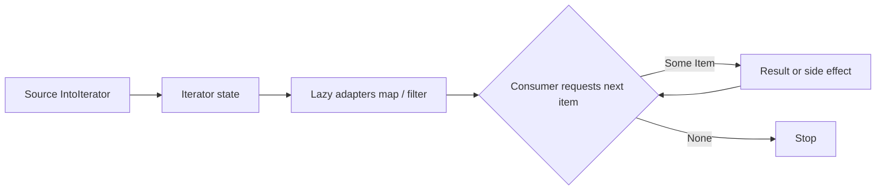

<TLDR>
  <TLDRCell label="what">
    迭代器（iterator）通过反复返回`Option<Item>`逐项产出值，并把遍历、转换与聚合组合成一条处理管道。
  </TLDRCell>
  <TLDRCell label="trap">
    `map`和`filter`等适配器采用惰性求值；没有消费者时，闭包根本不会运行，而`into_iter()`还可能移动原集合。
  </TLDRCell>
  <TLDRCell label="fix">
    先根据所有权选择`iter()`、`iter_mut()`或`into_iter()`，再明确使用`collect`、`find`、`sum`或`for`驱动管道。
  </TLDRCell>
</TLDR>

## 是什么，为什么存在

<Term id="iterator">迭代器（iterator）</Term>是一个有状态的值，
每次调用`next(&mut self)`都返回下一个元素，或在没有元素时返回`None`。
它把“怎样取得下一个元素”封装在统一接口后面，所以调用方不必知道数据来自数组、范围、集合还是按需计算。

Rust的`Iterator` trait只有一个必须实现的方法`next`，并通过关联类型`Item`声明产出类型。
其余大多数方法都有默认实现：`map`、`filter`等方法构造新迭代器，
`collect`、`fold`和`find`等方法则驱动迭代并产生结果。

迭代器解决的不只是循环语法重复。
它让转换步骤可以组合，让编译器持续跟踪每一步的元素类型与所有权，
也允许消费者在得到足够信息后立刻停止，而不必先构造完整的中间集合。

你会在`Vec`、切片、范围、字符串的字符或行、映射的键值视图，以及许多标准库返回值中遇到迭代器。
实现`IntoIterator`的<Term id="iterable">可迭代对象（iterable）</Term>还能直接出现在`for`循环里。
`for item in value`会先把`value`转成迭代器，再反复调用`next`。

这里的“惰性”是求值时机，不是异步执行或后台并行。
适配器只保存下一步需要的状态和闭包；真正请求元素的仍是当前线程中的消费者。
如果需要并行处理，那是Rayon等其他抽象负责的事情，不是标准`Iterator`自动提供的能力。

## 工作原理

### `Iterator`与`IntoIterator`

`Iterator`表示已经可以产出元素的游标式状态；`IntoIterator`表示某个值能生成这样的状态。
一个类型可能为拥有型值、共享引用和可变引用分别实现`IntoIterator`，
因此同一个`for`语法可以对应移动、只读借用或可变借用。

以`Vec<T>`为例，常用入口表达三种不同意图：

| 入口 | 常见`Item` | 对原集合的影响 | 适用意图 |
|---|---|---|---|
| `values.iter()`或`&values` | `&T` | 共享借用，之后仍可使用集合 | 只读观察 |
| `values.iter_mut()`或`&mut values` | `&mut T` | 独占借用，可就地修改元素 | 原地更新 |
| `values.into_iter()`或`values` | `T` | 移动集合并逐项交出元素 | 消费输入 |

表中的`Item`是`Vec<T>`的典型情况，不是所有类型的全局定律。
数组、映射和自定义类型可以选择符合自身语义的实现。
阅读泛型API时，应看它要求`Iterator`还是`IntoIterator`，以及实际的`Item`类型。

### 适配器与消费者

<Term id="iterator-adapter">迭代器适配器（iterator adapter）</Term>接收一个迭代器并返回另一个迭代器。
`map`改变元素，`filter`按条件保留元素，`enumerate`加入索引，
`zip`配对两个来源，`take`限制最多产出多少项。

<Term id="terminal-operation">终结操作（terminal operation）</Term>会请求元素并产生最终观察结果。
Rust文档常把这类方法称为consuming adapters，因为它们取得迭代器的所有权，
或者通过`&mut self`推进其状态。`collect`、`sum`、`count`、`fold`、`any`和`find`都属于这一侧。

适配器链的求值方向不是“先把所有元素映射完，再把所有结果过滤完”。
消费者每请求一项，数据就按链的顺序穿过相关闭包；若这一项被过滤掉，消费者继续请求下一项。
没有显式`collect`时通常也没有中间`Vec`。



### `Option`与迭代器状态

`next`需要`&mut self`，因为取得一项通常会改变当前位置。
返回`Some(item)`表示本次成功产出一项；返回`None`表示本次没有下一项。
这让空迭代器和迭代结束都能用同一种类型安全的方式表示。

许多消费者会短路。
`find`找到第一项就返回，`any`遇到第一个`true`就返回，
而对`Result`进行`collect`时，第一个`Err`会结束收集。
短路后，尚未请求的元素不会执行前面的闭包。

消费者之后是否还能继续使用迭代器，取决于方法怎样接收`self`。
`find`、`any`和`nth`接收`&mut self`，因此命名的迭代器会停在已经消费的位置；
`collect`和`count`接收`self`，会把迭代器整个移动进去。

### `collect`的目标类型

`collect`本身没有固定返回`Vec`。
它依靠目标类型的`FromIterator`实现决定怎样组装元素，
所以你通常要用变量类型、函数返回类型或`collect::<Vec<_>>()`告诉编译器目标是什么。

这种分派也解释了为什么`Iterator<Item = Result<T, E>>`可以收集成`Result<Vec<T>, E>`。
外层`Result`的`FromIterator`实现会依次处理每一项：全部为`Ok`时得到向量，
遇到第一个`Err`时立即返回该错误。

## 示例

### 按意图选择所有权

第一个例子用同一个向量展示共享借用和可变借用，再用另一个向量展示拥有型迭代。
`iter()`让求和只读取元素；`iter_mut()`暂时独占每个元素；
`into_iter()`则把每个`String`移入转换闭包，原来的`labels`随后不能再使用。

<Depth level="quick">

```rust title="ownership.rs"
fn main() {
    let mut scores = vec![72, 88, 91];

    let total: i32 = scores.iter().sum();
    println!("total: {total}");

    scores.iter_mut().for_each(|score| *score += 1);
    println!("adjusted: {scores:?}");

    let labels = vec![String::from("draft"), String::from("ready")];
    let upper: Vec<String> = labels
        .into_iter()
        .map(|label| label.to_uppercase())
        .collect();
    println!("owned: {upper:?}");
}
```

```text
total: 251
adjusted: [73, 89, 92]
owned: ["DRAFT", "READY"]
```

</Depth>

类型标注`Vec<String>`为`collect`提供目标类型。
如果后续还要使用`labels`，可以改用`labels.iter()`并接受`&String`，
但最终需要拥有型字符串时仍要明确克隆或创建新字符串；借用不会凭空变成所有权。

### 观察惰性与短路

`inspect`适合在学习或诊断时观察实际经过管道的元素。
下面的`find`只需要第一个大于`20`的偶数平方，
所以读取到`8`并得到`64`后就停止，`11`与`14`从未进入管道。

```rust title="lazy_pipeline.rs"
fn main() {
    let readings = [2, 5, 8, 11, 14];

    let first_large_even_square = readings
        .iter()
        .copied()
        .inspect(|reading| println!("checked: {reading}"))
        .filter(|reading| reading % 2 == 0)
        .map(|reading| reading * reading)
        .find(|square| *square > 20);

    println!("result: {first_large_even_square:?}");
}
```

```text
checked: 2
checked: 5
checked: 8
result: Some(64)
```

这里先调用`copied()`，把`&i32`转成`i32`，后续闭包就不需要处理多层引用。
`inspect`自己仍是惰性适配器；它之所以打印，是因为末尾的`find`请求了元素。
生产代码不应依赖`inspect`完成必要业务副作用，因为重排或短路都会改变执行次数。

### 让错误停止收集

当坏输入必须使整个操作失败时，应保留`Result`并直接收集，
而不是把`.ok()`交给`filter_map`后静默丢掉错误。
下面的第三个字符串不会解析，因为第二个字符串已经产生`Err`。

```rust title="fallible_collect.rs"
fn main() {
    let readings = ["18", "bad", "24"];

    let parsed: Result<Vec<i32>, _> = readings
        .into_iter()
        .map(|text| {
            println!("parsing: {text}");
            text.parse::<i32>()
        })
        .collect();

    println!("success: {}", parsed.is_ok());
}
```

```text
parsing: 18
parsing: bad
success: false
```

`Result<Vec<i32>, _>`同时确定了成功值的集合类型，并让错误类型保持由`parse`推断。
真实程序通常会返回或处理`parsed`中的具体错误；
这里只打印布尔值，是为了让示例输出不依赖错误调试格式的细节。

### 实现一个有限迭代器

自定义迭代器把尚未产出的状态放在结构体里，并为`next`定义单步转换。
这个票据编号迭代器使用半开区间`[start, end)`；
到达`end`后保持结束状态，所以后续调用仍返回`None`。

```rust title="custom_iterator.rs"
struct TicketIds {
    next: u32,
    end: u32,
}

impl TicketIds {
    fn new(start: u32, end: u32) -> Self {
        Self { next: start, end }
    }
}

impl Iterator for TicketIds {
    type Item = String;

    fn next(&mut self) -> Option<Self::Item> {
        if self.next >= self.end {
            return None;
        }

        let id = format!("T-{:03}", self.next);
        self.next += 1;
        Some(id)
    }

    fn size_hint(&self) -> (usize, Option<usize>) {
        let remaining = self.end.saturating_sub(self.next) as usize;
        (remaining, Some(remaining))
    }
}

fn main() {
    let ids: Vec<String> = TicketIds::new(7, 10).collect();
    println!("{ids:?}");
}
```

```text
["T-007", "T-008", "T-009"]
```

只要实现`Iterator`，这个类型就自动获得`map`、`take`、`collect`等默认方法。
它的`size_hint`给出精确剩余项数，帮助收集器规划容量；
这个提示必须随`next`更新，不能把最初长度当成永久答案。

## 陷阱

> [!PITFALL]
> **创建了适配器，却没有消费者。** 写下`values.iter().map(...)`只会构造一个新迭代器；即使闭包修改状态或打印内容，它也不会自行运行。
>
> **修复：** 如果目标是转换数据，就把结果交给`collect`等消费者；如果目标只是逐项执行副作用，优先使用清楚的`for`循环。不要只为消除`unused_must_use`警告而随意追加`collect::<Vec<_>>()`，那可能制造无用分配。

> [!PITFALL]
> **无意中移动集合。** 对拥有型`Vec<String>`调用`into_iter()`会逐项产出`String`，因此整个向量被消费；生成代码常在后面再次读取原变量并触发`E0382`，随后又用整向量`clone`掩盖设计问题。
>
> **修复：** 后续仍需集合时使用`iter()`；需要原地改值时使用`iter_mut()`；确实要转移元素时才用`into_iter()`。只在接口要求拥有型结果时对必要元素调用`cloned()`或进行明确转换。

> [!PITFALL]
> **在`filter`中和多层引用搏斗。** `filter`把候选项的引用传给谓词；若上游`iter()`的`Item`已是`&T`，闭包参数可能表现为`&&T`，复杂的解引用写法很容易出错。
>
> **修复：** 对`Copy`元素可以尽早使用`.iter().copied()`，让后续管道处理`T`。非`Copy`元素则保留借用，并通过类型标注或短小命名闭包确认每一步的`Item`，不要靠不断添加`*`猜类型。

> [!PITFALL]
> **用`filter_map(Result::ok)`吞掉数据错误。** 这种写法适合契约明确要求“只保留成功项”的场景，但在导入配置、金额或标识符时，它会把坏记录变成看似完整的成功结果。
>
> **修复：** 任何坏项都应使操作失败时，收集成`Result<Vec<_>, _>`；需要累计所有错误时，则显式分区或折叠成功与失败。先写清错误策略，再选择适配器。

> [!PITFALL]
> **把短路消费者当成无状态查询。** `find`、`any`和`nth`会推进迭代器；在同一个命名迭代器上再次调用时，会从剩余位置继续，而不是重新扫描来源。
>
> **修复：** 需要多次完整扫描时，从可重复借用的来源重新创建迭代器。需要单次流式扫描时，就把状态推进写进变量名与测试，并覆盖“找到”“找不到”和调用后继续迭代三种情况。

> [!PITFALL]
> **假设`zip`会验证长度相等。** 标准`zip`在任一侧结束时停止，多出来的元素会保留在较长来源中，却不会自动报错；模型生成的字段配对代码常因此静默丢数据。
>
> **修复：** 长度相等属于业务契约时，在配对前比较可用的集合长度，或在API边界采用能表达同长约束的数据结构。只有“以较短侧为准”确实符合需求时才直接使用`zip`。

<Depth level="deep">

## 深入理解：适配器类型与契约

### 每条链都有具体类型

每次调用`map`或`filter`都会返回不同的适配器结构体，
其中保存上游迭代器和闭包。链可以很长，但它在编译期仍有一个具体嵌套类型；
闭包类型也由编译器生成，并不需要堆分配成trait object。

函数只在内部使用管道时，通常让编译器推断完整类型最清楚。
API需要返回管道时，`impl Iterator<Item = T> + '_`可以隐藏具体适配器名字，
同时保留静态分派。只有运行时确实要在多种不同迭代器实现之间选择时，才考虑`Box<dyn Iterator<Item = T>>`。

返回迭代器时必须把借用关系写进接口。
如果管道从参数切片借用元素，返回值不能比该切片活得更久；
若闭包要拥有配置，常用`move`把配置移动进闭包，但`move`不会把上游借用的数据变成拥有型数据。

### `None`之后的行为

基础`Iterator`契约不保证某次返回`None`后永远只返回`None`。
大多数集合迭代器自然满足这一性质，但某些自定义迭代器可能在之后再次产出项目。
需要稳定结束语义的泛型算法可以调用`fuse()`，得到实现`FusedIterator`的包装器。

实现自定义迭代器时，持续结束通常最不意外，前面的`TicketIds`也是如此。
如果恢复产出本来就是领域语义，就应在类型名和文档中明确说明，
不能依赖调用者猜测一次`None`是暂时缺项还是永久结束。

### `size_hint`不是长度承诺

`size_hint()`返回剩余项数的下界和可选上界。
下界不能超过实际剩余项数；存在上界时，实际剩余项数也不能超过它。
一般调用方只能把提示用于容量规划，不能据此跳过正确性检查。

过滤器通常无法提前知道有多少项通过谓词，因此下界可能是`0`，
上界则沿用上游最多还能提供多少项。`ExactSizeIterator`表达更强的精确长度契约，
只应在实现能够一直维持准确剩余长度时提供。

错误的`size_hint`对普通安全代码不应造成内存不安全，
但会导致错误预分配、糟糕性能或违反更强trait的逻辑契约。
更新自定义`next`、`nth`或双端迭代逻辑时，要同步检查剩余长度计算。

### 消费方式决定可观察行为

同一条惰性链可以由不同消费者以不同方式驱动。
`collect`请求直到结束或错误，`take(n).collect()`最多请求`n`项，
`find`与`any`则在条件满足时停止。闭包中的日志、计数器或外部写入因而属于消费策略的一部分。

这也是为何应把必要副作用放在明确的循环或边界操作中。
纯转换闭包更容易重排、短路和测试；
如果副作用确实必要，就在测试中断言调用次数与顺序，而不只断言最终集合。

常见消费者表达的是不同契约：

| 消费者 | 结果 | 空输入 | 是否可短路 |
|---|---|---|---|
| `collect::<Vec<_>>()` | 所有元素组成的向量 | 空向量 | 通常否 |
| `collect::<Result<Vec<_>, _>>()` | 成功向量或首个错误 | `Ok([])` | 遇到`Err`时是 |
| `find(predicate)` | `Option<Item>` | `None` | 找到时是 |
| `fold(initial, step)` | 累加状态 | 返回`initial` | 默认否 |
| `try_fold(initial, step)` | 可失败的累加状态 | 返回成功的`initial` | 遇到失败控制流时是 |

当一条生成的链难以解释时，先写出来源、每一步`Item`类型和消费者。
如果仍需在一个闭包里同时解析、过滤、修改外部状态并映射，
改成命名循环往往更容易审查；使用迭代器不是把所有逻辑压进一行的要求。

</Depth>

<Checkpoint id="rust/iterators" />

## 延伸阅读

- [Rust 1.98标准库：`Iterator`](https://doc.rust-lang.org/1.98.0/std/iter/trait.Iterator.html)
- [Rust 1.98标准库：`IntoIterator`](https://doc.rust-lang.org/1.98.0/std/iter/trait.IntoIterator.html)
- [Rust 1.98标准库：`FromIterator`](https://doc.rust-lang.org/1.98.0/std/iter/trait.FromIterator.html)
- [The Rust Programming Language：使用迭代器处理元素序列](https://doc.rust-lang.org/1.98.0/book/ch13-02-iterators.html)
