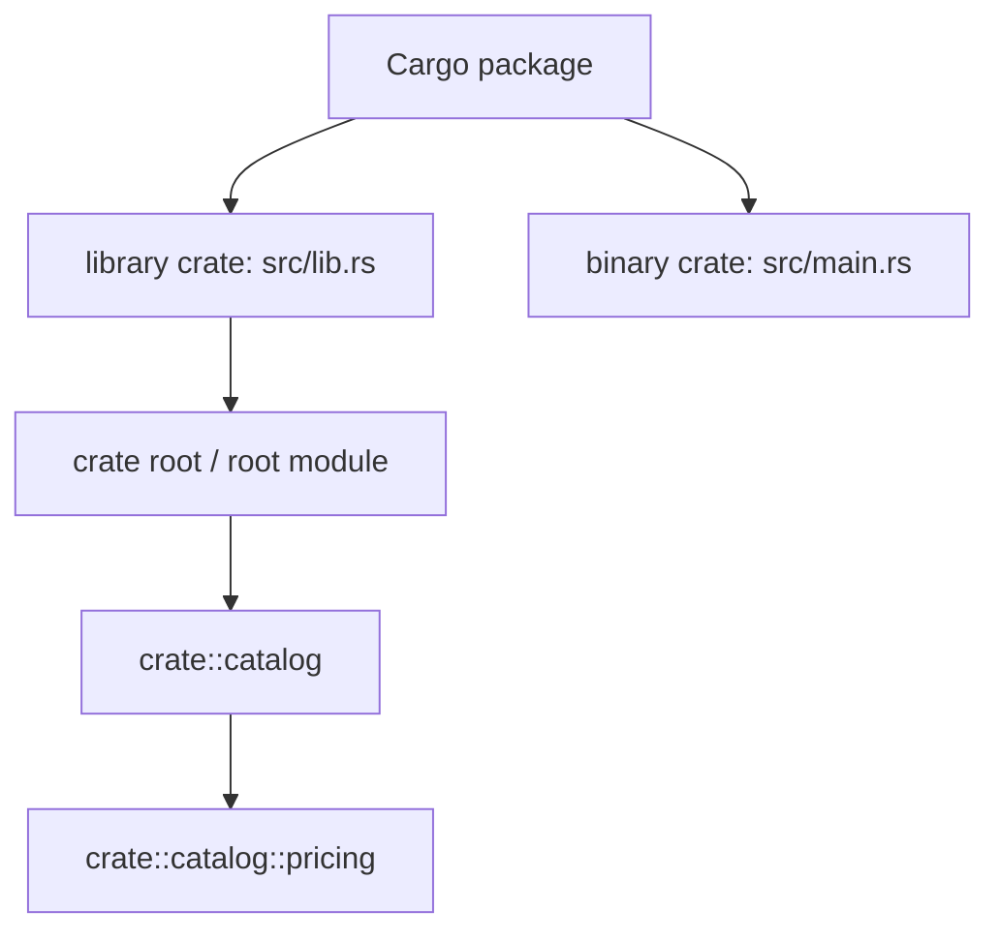

<TLDR>
  <TLDRCell label="what">
    A Cargo package is the deliverable described by `Cargo.toml`, a crate is a unit of compilation, and a module organizes names and visibility inside a crate.
  </TLDRCell>
  <TLDRCell label="trap">
    A directory does not become a module automatically, and `use` does not load a file; adding `pub` to a target item still does not guarantee an externally reachable path.
  </TLDRCell>
  <TLDRCell label="fix">
    Declare the module tree from the crate root, expose only the paths callers need, and use `pub use` to re-export the public API at a stable boundary.
  </TLDRCell>
</TLDR>

## What it is and why it exists

Rust organizes code at three different levels. A <Term id="cargo-package">Cargo package</Term> is a deliverable with a `Cargo.toml`; a <Term id="crate">crate</Term> is a library or executable compiled as one unit; and a <Term id="rust-module">module</Term> is a unit of naming and visibility inside one crate. Casual uses of “project,” “package,” and “library” blur these levels, but compiler errors require the precise terms.

A package contains at least one crate. It may have at most one library crate and any number of binary crates; by convention, `src/lib.rs` starts the library crate, while `src/main.rs` and targets under `src/bin/` start binary crates. Each entry file is that crate's <Term id="crate-root">crate root</Term> and also forms the root module of its module tree.

Modules group related items into hierarchical namespaces and decide where implementation details can be accessed. Paths locate items in the module tree, `use` binds an existing path into the current scope, and `pub` plus its restricted forms control visibility. Modules therefore address name collisions, navigation, and encapsulation, not merely file splitting.

You need a module boundary when one file mixes responsibilities or library consumers must not depend on internal directories. A crate boundary is heavier: it creates a separate compilation target and an interface between a library and an executable. Workspaces, dependency resolution, and publishing belong to Cargo's layer and cannot be replaced with module rules.

## How it works

### Three levels of structure

This diagram shows a package with both a library and an executable. The two crates have separate root modules; `catalog` and `pricing` belong only to the library crate's module tree.



Package and crate names are usually similar, but they are different kinds of identifier. A Cargo package may be named `store-domain`, while its default library crate is written as `store_domain` in Rust source. `crate::` is not the package name either; it starts resolution at the current crate's root module.

### Module declarations and files

`mod catalog { ... }` declares and defines an inline module at its written location. `mod catalog;` declares the same logical module but tells the compiler to read its contents from another file. When written in `src/lib.rs`, the conventional candidates are `src/catalog.rs` and `src/catalog/mod.rs`, and both cannot exist for the same module.

A child module's file location follows its logical parent. If `src/catalog.rs` contains `mod pricing;`, the compiler looks for `src/catalog/pricing.rs` or `src/catalog/pricing/mod.rs`. Moving a module definition into a file does not change a logical path such as `crate::catalog::pricing`; the filesystem is only one representation of the module tree.

A file does not join the crate merely because it is under `src/`. A `mod` declaration in a reachable module attaches that file to the crate's module tree. Conversely, `use crate::catalog::Product;` neither declares a module nor controls which files compile; it only makes the short name `Product` available in the current scope.

### Absolute and relative paths

A path beginning with `crate::` resolves from the current crate's root module, which makes it clear when code crosses sibling modules. `self::` begins at the current module and `super::` at its parent; a path without those prefixes first resolves names in the current scope. An external crate usually starts with its crate name, as in `serde::Serialize`.

Inside a module, `super::` suits an item supplied by the immediate parent; across a wider boundary, `crate::` is often clearer. Path choice does not replace visibility: after resolving an item, the compiler still checks whether the use site may access every part of the path.

`use` supports nested imports, `self`, and `as`. Types are commonly imported directly, while conflicting functions or types keep a parent-module prefix or receive a domain-specific alias. A `use` binding affects its own scope by default; child modules do not automatically inherit imports written by a parent.

### Visibility applies along the path

Ordinary items are private by default and can be accessed from their defining module and its descendants. `pub` widens an item's visibility, but every ancestor module on a path must also be accessible from a particular use site. Fields of a public struct still have independent visibility, whereas variants of a public enum are public by default.

Restricted visibility stops an interface at a narrower boundary. `pub(crate)` exposes it to the current crate, `pub(super)` to the parent module's scope, and `pub(in crate::some_module)` to a named ancestor module's scope. In the Rust 2018 edition and later, a `pub(in ...)` path must begin with `crate`, `self`, or `super`.

A <Term id="re-export">re-export</Term> uses `pub use` to create another public path to an existing public item. It can lift a deeply nested item to the crate root while leaving its implementation module private. A re-export changes the API path callers can use, but it neither copies the definition nor automatically makes the original path public.

## Examples

### Inline modules with absolute and relative paths

The first example puts shipping logic in a `shipping` module. The root module can call only the public `quote`, while the `tracking` child uses `super::` to call its parent's private helper.

<Depth level="quick">

```rust title="module_paths.rs"
mod shipping {
    const BASE_CENTS: u32 = 250;

    fn zone(code: &str) -> &str {
        if code.starts_with("EU-") { "EU" } else { "OTHER" }
    }

    pub fn quote(code: &str, weight_kg: u32) -> u32 {
        BASE_CENTS + weight_kg * 80 + tracking::zone_fee(code)
    }

    mod tracking {
        pub(super) fn zone_fee(code: &str) -> u32 {
            if super::zone(code) == "EU" { 0 } else { 500 }
        }
    }
}

fn main() {
    let cents = crate::shipping::quote("EU-FR", 3);
    println!("shipping: {cents} cents");
}
```

```text
shipping: 490 cents
```

</Depth>

`zone` is private to `shipping` and its descendants, so `tracking` can access it. Marking `zone_fee` as `pub(super)` lets the parent `shipping` module access it, but the crate root cannot call it directly. The two restrictions leave one deliberate public entry point.

### Importing same-named items

Both `billing` and `shipping` provide `total`, so importing both functions directly into one scope would cause a name collision. Keeping one module prefix and giving the other a domain alias preserves the source at each call site.

```rust title="import_aliases.rs"
mod billing {
    pub fn total(subtotal: u32) -> u32 {
        subtotal + subtotal / 5
    }
}

mod shipping {
    pub fn total(weight_kg: u32) -> u32 {
        250 + weight_kg * 80
    }
}

mod report {
    use crate::billing::total as invoice_total;
    use crate::shipping;

    pub fn print() {
        let goods = invoice_total(1_000);
        let delivery = shipping::total(3);

        println!("invoice: {goods}");
        println!("shipping: {delivery}");
    }
}

fn main() {
    report::print();
}
```

```text
invoice: 1200
shipping: 490
```

The alias `invoice_total` describes domain intent instead of merely bypassing the compiler. Keeping `shipping::total` follows the common style of calling a function through its parent module. Both choices can coexist; the important part is that the call site identifies which `total` it uses.

### Building a public API with re-exports

The `store` module below stands in for a library crate's root module. `catalog` stays private, and outside code uses only the `Product` and `quote` re-exported from the root.

```rust title="public_api.rs"
mod store {
    mod catalog {
        pub struct Product {
            name: String,
            cents: u32,
        }

        impl Product {
            pub fn new(name: &str, cents: u32) -> Self {
                Self { name: name.into(), cents }
            }

            pub fn label(&self) -> &str {
                &self.name
            }
        }

        pub fn quote(product: &Product, count: u32) -> u32 {
            product.cents * count
        }
    }

    pub use catalog::{Product, quote};
}

fn main() {
    let keyboard = store::Product::new("Keyboard", 4_500);
    let cents = store::quote(&keyboard, 2);

    println!("{}: {cents} cents", keyboard.label());
}
```

```text
Keyboard: 9000 cents
```

`Product` is a public type, but its `name` and `cents` fields remain private, so callers must go through its constructor and methods. The `pub use` provides `store::Product`; the implementation can later move `catalog` while preserving that public path and behavior, without forcing callers to change.

### Using a crate-private interface across siblings

The final example lets `checkout` call its sibling `inventory`. The inventory query is not part of the crate's external API, so it uses `pub(crate)`; `checkout::can_ship` is the entry point the root chooses to expose.

```rust title="crate_visibility.rs"
mod inventory {
    pub(crate) fn available(sku: &str) -> u32 {
        match sku {
            "KB-01" => 8,
            "MS-02" => 0,
            _ => 0,
        }
    }
}

mod checkout {
    pub fn can_ship(sku: &str, requested: u32) -> bool {
        crate::inventory::available(sku) >= requested
    }
}

fn main() {
    println!("KB-01 x3: {}", checkout::can_ship("KB-01", 3));
    println!("MS-02 x1: {}", checkout::can_ship("MS-02", 1));
}
```

```text
KB-01 x3: true
MS-02 x1: false
```

`pub(crate)` is not a placeholder for something that might become public later; it is a checkable boundary declaration. It allows sibling collaboration inside the crate while preventing code that depends on this library crate from binding to the inventory module's internal query.

## Pitfalls

> [!PITFALL]
> Treating packages, crates, and modules as synonyms leads to the wrong target count, path root, and visibility boundary. One package can build several crates, and every crate has its own module tree.

**Fix:** Start with `Cargo.toml` and the conventional target files to identify the package's crates, then follow `mod` declarations from each crate root to draw its module tree. Say package when discussing delivery and dependencies, crate when discussing a compilation target, and module when discussing an internal namespace.

> [!PITFALL]
> Creating `src/orders.rs` or `src/orders/` does not declare a module, and `use orders::Order` does not load it. Generated code also commonly leaves both `orders.rs` and `orders/mod.rs`, giving one module two candidate sources.

**Fix:** Write `mod orders;` once in the logical parent module, and choose either `orders.rs` or `orders/mod.rs` as its entry. Put child-module declarations in their parent's definition instead of collecting every declaration in `lib.rs`.

> [!PITFALL]
> Adding `pub` only to a deeply nested function may not let an external crate call it. The original path remains unreachable if an ancestor module is inaccessible; making the entire tree `pub` to silence `E0603` expands the API instead.

**Fix:** Decide which path callers should depend on over time, then expose the necessary ancestors or `pub use` the item at a stable boundary. Verify the public path with an integration test acting as external code, not only from descendants of the defining module.

> [!PITFALL]
> In a binary crate, `crate::some_library_item` starts at that binary's own root module, not the library crate in the same package. Sharing a package does not merge the two targets into one crate.

**Fix:** Import from the library crate by name; for example, the default library of package `store-domain` is normally addressed as `use store_domain::Product;`. Put shared logic in the library crate and make each executable an ordinary consumer.

> [!PITFALL]
> `use module::*` pulls every current public item into the scope. A later export can create a collision, and reviewers cannot easily see where a name came from. Preludes and test modules sometimes use glob imports deliberately, but ordinary modules have no default reason to do so.

**Fix:** Import the types actually used, and keep a parent-module prefix or explicit alias for functions. If you provide a prelude, treat it as a designed public API and review every new re-export.

<Depth level="deep">

## The file tree is not the module tree

Conventional Cargo layouts make the two trees look similar, but declarations build the compiler's module tree. Suppose a library crate has this logical structure:

```text
crate
└── catalog
    ├── Product
    └── pricing
        └── quote
```

One corresponding layout has `src/lib.rs` declare `mod catalog;`, `src/catalog.rs` declare `mod pricing;`, and the implementation in `src/catalog/pricing.rs`. The `catalog` entry could instead be `src/catalog/mod.rs`, but it cannot coexist with `src/catalog.rs`. That entry-file choice does not change the logical path `crate::catalog::pricing::quote`.

`#[path = "..."]` can override the default location of an external module, but it breaks readers' expectations about the conventional mapping. Reserve it for generated code, platform branches, or legacy layouts that genuinely need it, and keep the attribute near the logical parent declaration. Conventional names make ordinary business modules easier for editors, build tools, and people to locate.

### An edition does not migrate directories

Modern Rust permits `catalog.rs` alongside `catalog/pricing.rs`, so an entry with children no longer has to be named `mod.rs`. The old layout remains valid, and upgrading an edition does not require mechanical renaming. The actual constraint is that both entry styles cannot represent the same module at one location.

## A public API is a set of reachable paths

Visibility is checked against the use site and the complete path. A deeply nested item's `pub` lets it propagate as far as its ancestors permit; it does not mean all external code can already name it. The public API is therefore the set of paths outside callers can actually reach, not a flat list of every `pub` in the source.

`pub use internal::Product;` can make a public `Product` inside a private `internal` module reachable from the crate root. Callers bind to the new path, while only one definition exists. This facade pattern separates directory refactoring from the public API, although deleting or renaming an established re-export can still be a breaking change.

A public type's signature can bring other types to the API boundary. If a public function returns a type describable only through a private path, the compiler's private-interface checks may report it, or callers may receive an awkward API. When reviewing public functions, continue the reachability check through parameters, return types, trait bounds, and associated types.

### Struct and enum boundaries differ

`pub struct Product` does not make its fields public, which lets constructors maintain invariants. Generated code that marks every field `pub` lets callers bypass validation and depend on representation details. In contrast, the variants of `pub enum Status` are public by default because callers normally need to construct or match those variants.

## Crate boundaries inside a package

When `src/lib.rs` and `src/main.rs` both exist, Cargo builds two crates. The library crate can expose shared domain logic; the binary uses it by the library crate's name, like a caller outside the package. The binary's own `crate::` always refers to the root module formed by `main.rs`.

`src/bin/import.rs`, `examples/demo.rs`, and `tests/api.rs` also form separate compilation targets. In particular, every integration test under `tests/` compiles as an independent crate, so it can use only the library crate's public API. This boundary makes integration tests a good place to verify that re-exported paths are truly public.

The crate boundary also determines the scope of `pub(crate)`. Exposing an item throughout a library crate does not make it accessible to a binary or integration test in the same package. If a caller genuinely needs the capability, design a stable `pub` interface; when only internal implementation tests need it, prefer a descendant test module that can access private items.

### Cargo targets create independent roots

A common package can express a library, two executables, and an integration test with the following file layout. Every target has its own crate root, while `catalog.rs` is merely a file in the library crate's module tree.

```text
store-domain/
├── Cargo.toml
├── src/
│   ├── lib.rs
│   ├── main.rs
│   ├── catalog.rs
│   └── bin/
│       └── importer.rs
└── tests/
    └── public_api.rs
```

`src/main.rs` produces the default executable, and `src/bin/importer.rs` another executable. Both can depend on the library built from `src/lib.rs`, but their private modules do not merge. If both `main.rs` and `importer.rs` need the same logic, put it in an appropriate library module and expose the smallest interface instead of copying it.

The integration test `tests/public_api.rs` also uses the library from outside, unlike `#[cfg(test)] mod tests` written inside `src/lib.rs`. The latter is a descendant in the library crate's module tree and can access private items in its ancestors; the former is a separate crate and sees only reachable public paths. Choose the test location according to whether it verifies implementation or external contract.

## Import bindings and API paths

A `use` declaration creates a name binding in the current scope. An ordinary `use` is a private binding available to the current module and its descendants; `pub use` makes the binding available to other modules within its declared visibility. Neither moves the target item nor creates a second type.

The same item may be reachable through multiple paths. If the crate root writes `pub use catalog::Product;`, internal library code can still use `crate::catalog::Product`, while external callers use `store_domain::Product`. Both names refer to the same type, with no conversion or runtime wrapper.

A nested import only removes repeated prefixes. For example, `use std::io::{self, Read, Write};` binds the module name `io` and the traits `Read` and `Write`. The braces do not change any parent-child relationship between modules; they are compact syntax for a group of `use` declarations.

Import scope also matters during review. Writing `use crate::catalog::Product;` in a parent does not unconditionally give a child the bare name `Product`. The child can import it directly or explicitly use `super::Product` when depending on the parent's binding is intentional; a direct import usually reveals the dependency more clearly.

### Aliases belong to the caller's vocabulary

`as` changes only the binding name in its scope; it does not rename the definition or alter the API seen elsewhere. When two `Result`, `Error`, or `Config` types meet, use responsibility-based names such as `FormatResult` and `IoResult`, not information-free aliases such as `Result1`.

A public re-export may also use `as`, which makes the alias an official externally visible name. It is then part of the API contract rather than local convenience. Search downstream uses before renaming it, and retain the old re-export for a migration period when appropriate.

## Boundary checks and maintainability

Rust visibility is a compile-time source-access rule, not a security boundary. If a public API exposes an observation or mutation, module privacy cannot stop code authorized to run in the process from using the result. Its value is constraining source dependencies so invariants and replaceable implementations have an explicit maintenance location.

Narrowest visibility does not mean hiding every function at the deepest level. When sibling modules have a stable need for a crate-internal capability, `pub(crate)` is more accurate than duplicated wrappers or copied code; when only a parent coordinates a child, `pub(super)` expresses a smaller scope. Let architectural relationships determine the range instead of widening it one compiler error at a time.

A public facade must preserve both names and semantics. Keeping `pub use catalog::Product` can make internal file moves transparent to callers, but an incompatible constructor, field-visibility, or trait-implementation change can still break them even when the path stays fixed. Module design reduces coupling; it does not manage every API compatibility concern automatically.

Running `cargo check --all-targets` covers the default library, binaries, examples, tests, and other declared target relationships. Running only `cargo run` can miss a target excluded from that invocation, allowing a wrong crate path or private-API use to remain hidden. After a module refactor, check every target and run integration tests that depend on public paths.

### Declaration order is not execution order

Module and function definitions are items, and their names can generally be used before or after their definitions in the same module. Moving `mod reports;` above `main` does not make it “load earlier,” and moving it below does not delay loading. The compiler resolves the whole item tree while building the crate.

Fix an unresolved path by checking whether the module is declared at the correct logical parent and whether the target is visible at the use site, not by repeatedly reordering items. `macro_rules!` has its own textual scope rules, which are not evidence that ordinary modules load like a script.

`#[cfg(...)] mod platform;` makes the module declaration conditional. Generated code checked on only one platform or feature combination can leave errors in the alternative module file; when conditional modules are involved, check each configuration the project supports.

Imports and re-exports of a conditional module commonly need a matching `#[cfg]`, or the disabled configuration will leave a path pointing to an item that does not exist. Keeping conditions near the boundary declaration makes each possible shape of the module tree easier to review.

</Depth>

<Checkpoint id="rust/modules-crates" />

## Further reading

- [Rust Book: Packages and crates](https://doc.rust-lang.org/stable/book/ch07-01-packages-and-crates.html)
- [Rust Reference: Modules](https://doc.rust-lang.org/reference/items/modules.html)
- [Rust Reference: Visibility and privacy](https://doc.rust-lang.org/reference/visibility-and-privacy.html)
- [Cargo Book: Package layout](https://doc.rust-lang.org/cargo/guide/project-layout.html)
