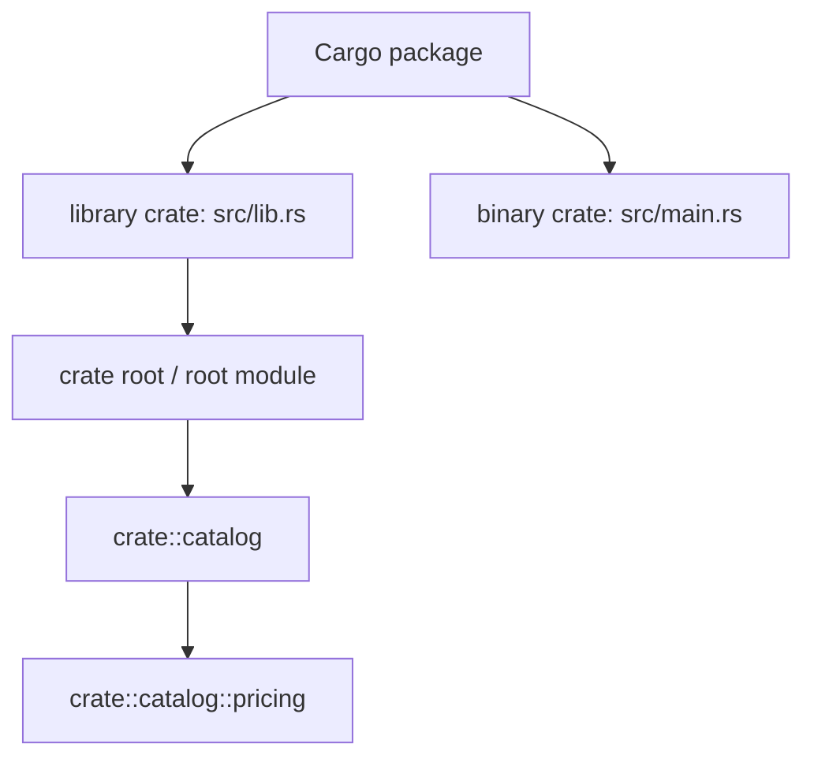

<TLDR>
  <TLDRCell label="what">
    Cargo package 是 `Cargo.toml` 描述的交付单元，crate 是一次编译的单元，模块则在 crate 内组织名称与可见性。
  </TLDRCell>
  <TLDRCell label="trap">
    文件夹不会自动成为模块，`use` 也不会加载文件；把 `pub` 加到目标项上，仍不保证外部代码有可达路径。
  </TLDRCell>
  <TLDRCell label="fix">
    从 crate root 声明模块树，只开放所需路径，并用 `pub use` 在稳定边界重导出公共 API。
  </TLDRCell>
</TLDR>

## 是什么，为什么存在

Rust 用三个不同层次组织代码。<Term id="cargo-package">Cargo package</Term> 是带有 `Cargo.toml` 的项目交付单元；<Term id="crate">crate</Term> 是编译器一次处理的库或可执行程序；<Term id="rust-module">模块（module）</Term>则是一个 crate 内部的命名与可见性单元。日常说的“项目”“包”和“库”容易把这三层混在一起，读编译错误时必须使用准确名称。

一个 package 至少包含一个 crate。它最多有一个 library crate，却可以有多个 binary crate；常规布局中，`src/lib.rs` 是 library crate 的入口，`src/main.rs` 和 `src/bin/` 下的目标是 binary crate 的入口。每个入口文件都是相应 crate 的<Term id="crate-root">crate root</Term>，同时形成模块树的根模块。

crate 内的模块把相关项放进层级命名空间，并决定哪些实现细节能从哪些位置访问。路径指出目标项在模块树中的位置，`use` 只把已有路径绑定到当前作用域，`pub` 及其受限形式则控制可见范围。模块因此同时解决名称冲突、代码导航和封装边界，而不只是拆分文件。

当一个文件开始混合多个职责，或者库使用者不得依赖内部目录时，就需要模块边界。crate 边界更重：它形成独立编译目标，也形成库与可执行程序之间的接口边界。工作空间、依赖解析和发布属于 Cargo 层，不能用模块规则替代。

## 工作原理

### 三层结构

下面这张图展示一个同时包含库和可执行程序的 package。两个 crate 分别拥有根模块；图中的 `catalog` 与 `pricing` 只属于 library crate 的模块树。



package 名和 crate 名通常接近，但它们不是同一种标识符。Cargo package 可以叫 `store-domain`，Rust 源码中的默认 library crate 路径则写作 `store_domain`。`crate::` 更不是 package 名，它从当前 crate 的根模块开始解析。

### 模块声明与文件

`mod catalog { ... }` 在当前位置声明并定义内联模块。`mod catalog;` 声明相同的逻辑模块，但让编译器从外部文件读取其内容。在 `src/lib.rs` 中写 `mod catalog;` 时，常规候选是 `src/catalog.rs` 或 `src/catalog/mod.rs`，两者不能同时存在。

子模块的文件位置由逻辑父模块决定。若 `src/catalog.rs` 包含 `mod pricing;`，编译器会查找 `src/catalog/pricing.rs` 或 `src/catalog/pricing/mod.rs`。移动模块定义到文件不会改变 `crate::catalog::pricing` 这样的逻辑路径；文件系统只是模块树的一种存放方式。

文件不会因为位于 `src/` 下就自动参与编译。某个可达模块中的 `mod` 声明才把它接入 crate 的模块树。相反，`use crate::catalog::Product;` 不声明模块，也不控制要编译哪些文件；它只让 `Product` 这个短名称在当前作用域可用。

### 绝对路径与相对路径

以 `crate::` 开头的路径从当前 crate 根模块解析，适合表达跨越多个同级模块的稳定位置。`self::` 从当前模块开始，`super::` 从父模块开始；不带这些前缀的路径先按当前作用域中的名称解析。外部 crate 通常直接以 crate 名开头，例如 `serde::Serialize`。

在一个模块内部，`super::` 很适合访问紧邻父模块的协作项；跨越较远边界时，`crate::` 往往更清楚。路径选择不是可见性的替代品：路径解析到某个项后，编译器仍会检查调用位置是否有权访问路径上的每一层。

`use` 支持嵌套导入、`self` 和 `as`。类型通常直接导入，容易冲突的函数或同名类型则保留父模块名，或者用反映领域含义的别名。`use` 默认只影响它所在的作用域；子模块不会自动继承父模块写下的导入。

### 可见性沿路径生效

普通项默认是私有的，只能由定义它的模块及其后代访问。`pub` 扩大项的可见范围，但从某个调用点访问它时，路径上的祖先模块也必须可访问。公开结构体的字段仍分别控制可见性；公开枚举的变体则默认公开。

受限可见性把接口停在更窄的边界。`pub(crate)` 对当前 crate 可见，`pub(super)` 对父模块范围可见，`pub(in crate::some_module)` 对指定祖先模块范围可见。在 Rust 2018 及之后的 edition 中，`pub(in ...)` 的路径必须从 `crate`、`self` 或 `super` 开始。

<Term id="re-export">重导出（re-export）</Term>使用 `pub use` 为已有公共项创建另一条公共路径。它既能把深层实现路径提升到 crate root，也能让内部模块本身保持私有。重导出改变调用方能使用的 API 路径，但不会复制定义，也不会让原路径自动变得公开。

## 示例

### 内联模块、绝对路径与相对路径

第一个示例把运费逻辑放在 `shipping` 模块中。根模块只能调用公开的 `quote`；子模块 `tracking` 则可以用 `super::` 调用父模块的私有辅助函数。

<Depth level="quick">

```rust title="module_paths.rs"
mod shipping {
    const BASE_CENTS: u32 = 250;

    fn zone(code: &str) -> &str {
        if code.starts_with("EU-") { "EU" } else { "OTHER" }
    }

    pub fn quote(code: &str, weight_kg: u32) -> u32 {
        BASE_CENTS + weight_kg * 80 + tracking::zone_fee(code)
    }

    mod tracking {
        pub(super) fn zone_fee(code: &str) -> u32 {
            if super::zone(code) == "EU" { 0 } else { 500 }
        }
    }
}

fn main() {
    let cents = crate::shipping::quote("EU-FR", 3);
    println!("shipping: {cents} cents");
}
```

```text
shipping: 490 cents
```

</Depth>

`zone` 对 `shipping` 及其后代私有，所以 `tracking` 可以访问它。`zone_fee` 标成 `pub(super)` 后，父模块 `shipping` 可以访问它，但 crate root 不能直接调用它。这里的两个限制共同留下一个有意设计的公开入口。

### 导入同名项

`billing` 与 `shipping` 都提供 `total`，直接把两个函数导入同一作用域会发生名称冲突。一个保留模块前缀，另一个使用领域别名，可以让调用点继续表达来源。

```rust title="import_aliases.rs"
mod billing {
    pub fn total(subtotal: u32) -> u32 {
        subtotal + subtotal / 5
    }
}

mod shipping {
    pub fn total(weight_kg: u32) -> u32 {
        250 + weight_kg * 80
    }
}

mod report {
    use crate::billing::total as invoice_total;
    use crate::shipping;

    pub fn print() {
        let goods = invoice_total(1_000);
        let delivery = shipping::total(3);

        println!("invoice: {goods}");
        println!("shipping: {delivery}");
    }
}

fn main() {
    report::print();
}
```

```text
invoice: 1200
shipping: 490
```

别名 `invoice_total` 描述了业务含义，不只是为了绕过编译器。保留 `shipping::total` 则符合“函数通过父模块调用”的常见风格。两种选择可以并存，关键是调用点能看出使用的是哪个 `total`。

### 用重导出构造公共 API

下面的 `store` 模块模拟 library crate 的根模块。`catalog` 保持私有，外部代码只通过根模块重导出的 `Product` 和 `quote` 使用功能。

```rust title="public_api.rs"
mod store {
    mod catalog {
        pub struct Product {
            name: String,
            cents: u32,
        }

        impl Product {
            pub fn new(name: &str, cents: u32) -> Self {
                Self { name: name.into(), cents }
            }

            pub fn label(&self) -> &str {
                &self.name
            }
        }

        pub fn quote(product: &Product, count: u32) -> u32 {
            product.cents * count
        }
    }

    pub use catalog::{Product, quote};
}

fn main() {
    let keyboard = store::Product::new("Keyboard", 4_500);
    let cents = store::quote(&keyboard, 2);

    println!("{}: {cents} cents", keyboard.label());
}
```

```text
Keyboard: 9000 cents
```

`Product` 是公开类型，但 `name` 和 `cents` 字段仍然私有，调用方必须经过构造函数与方法。`pub use` 提供 `store::Product`，因此内部以后可以移动 `catalog`，只要保留这条公共路径和行为，调用方就不必随之修改。

### 跨同级模块使用 crate 内接口

最后一个示例让 `checkout` 调用同级的 `inventory`。库存查询不是 crate 的外部 API，因此使用 `pub(crate)`；`checkout::can_ship` 才是根模块选择公开的入口。

```rust title="crate_visibility.rs"
mod inventory {
    pub(crate) fn available(sku: &str) -> u32 {
        match sku {
            "KB-01" => 8,
            "MS-02" => 0,
            _ => 0,
        }
    }
}

mod checkout {
    pub fn can_ship(sku: &str, requested: u32) -> bool {
        crate::inventory::available(sku) >= requested
    }
}

fn main() {
    println!("KB-01 x3: {}", checkout::can_ship("KB-01", 3));
    println!("MS-02 x1: {}", checkout::can_ship("MS-02", 1));
}
```

```text
KB-01 x3: true
MS-02 x1: false
```

`pub(crate)` 不是“以后可能会公开”的占位符，而是一项可检查的边界声明。它允许 crate 内的同级协作，同时阻止依赖此 library crate 的代码绑定到库存模块的内部查询方式。

## 陷阱

> [!PITFALL]
> 把 package、crate 和模块当成同义词，会让目标数量、路径起点和可见性边界都判断错误。一个 package 可以同时构建多个 crate，而每个 crate 都有独立的模块树。

**修复方法：** 先从 `Cargo.toml` 与常规目标文件确认 package 中有哪些 crate，再从每个 crate root 沿 `mod` 声明画出模块树。讨论依赖与发布时说 package，讨论编译目标时说 crate，讨论内部命名空间时说模块。

> [!PITFALL]
> 创建 `src/orders.rs` 或 `src/orders/` 不会自动声明模块，写 `use orders::Order` 也不会加载它。生成代码还常常同时保留 `orders.rs` 和 `orders/mod.rs`，使同一模块有两个候选来源。

**修复方法：** 在逻辑父模块中只写一次 `mod orders;`，并选择 `orders.rs` 或 `orders/mod.rs` 其中一种入口。子模块声明放在父模块的定义中，而不是一律堆到 `lib.rs`。

> [!PITFALL]
> 只给深层函数添加 `pub`，不一定能让外部 crate 调用它。若任一祖先模块不可访问，原始路径仍然不可达；为了消除 `E0603` 而把整棵树都改成 `pub`，又会扩大 API。

**修复方法：** 决定调用方应长期依赖的路径，再公开必要祖先或在稳定边界 `pub use` 目标项。用外部风格的集成测试验证公共路径，不要只在定义模块的后代中测试。

> [!PITFALL]
> 在 binary crate 中写 `crate::some_library_item`，会从这个二进制自己的根模块查找，而不是同一 package 的 library crate。两个目标位于同一 package，并不会让它们成为一个 crate。

**修复方法：** 从 binary crate 按 library crate 名导入，例如 package `store-domain` 的默认库通常写作 `use store_domain::Product;`。共享逻辑放入 library crate，让每个二进制成为它的普通调用方。

> [!PITFALL]
> `use module::*` 会把当前公开项全部引入作用域，后续新增导出可能制造冲突，也让审查者难以看到名称来源。prelude 和测试模块中可能有意这样做，但普通模块没有默认理由采用 glob 导入。

**修复方法：** 导入实际使用的类型，函数则保留父模块前缀或使用明确别名。若提供 prelude，要把它视为经过设计的公共 API，并审查每次新增重导出。

## AI 时代

**生成代码在这里常犯的错**

模型会根据目录外观猜模块树，把子模块声明放错父级，或同时生成 `feature.rs` 与 `feature/mod.rs`。它还常用 `use` 代替缺失的 `mod`，在 binary crate 中误用 `crate::` 访问 library crate，或者为消除私有性错误而递归添加 `pub`。生成重构的另一类故障是移动内部文件后顺手更改公共导出路径，导致下游代码无谓破坏。

**让 AI 检查**

- 从每个 crate root 开始，列出所有 `mod` 声明对应的逻辑路径与源文件，并报告重复或游离文件。
- 对每个新增的 `pub`、`pub(crate)`、`pub(super)` 与 `pub use`，说明预期调用方以及最窄可用范围。
- 运行 `cargo check --all-targets`，再从 package 外部可见的路径检查 library API，而不只检查内部单元测试。

**审查清单**

- 确认 package 中每个 library、binary、example 与集成测试目标属于哪个 crate，路径从哪个根开始。
- 确认 `use` 只缩短名称，没有被误认为模块声明或可见性授权。
- 比较重构前后的公共重导出路径，拒绝为修复编译错误而无理由扩大的可见范围。

**提示词词汇**

使用准确术语：`Cargo package`（Cargo package）、`crate`（编译单元）、`crate root`（crate 根）、`module tree`（模块树）、`absolute path`（绝对路径）、`restricted visibility`（受限可见性）、`public re-export`（公开重导出）和 `API facade`（API 门面）。要求模型给出“目标清单、模块树、公开路径”三份结果，比笼统要求“整理文件结构”更容易暴露边界错误。

<Depth level="deep">

## 文件树不是模块树

常规 Cargo 布局让两棵树看起来相似，但编译器依据声明构造模块树。假设 library crate 有以下逻辑结构：

```text
crate
└── catalog
    ├── Product
    └── pricing
        └── quote
```

一种对应文件布局是 `src/lib.rs` 声明 `mod catalog;`，`src/catalog.rs` 再声明 `mod pricing;`，实现位于 `src/catalog/pricing.rs`。也可以把 `catalog` 的入口放在 `src/catalog/mod.rs`，但不能与 `src/catalog.rs` 并存。入口文件的选择不改变 `crate::catalog::pricing::quote` 这条逻辑路径。

`#[path = "..."]` 可以覆盖外部模块的默认文件位置，但它会切断读者对常规映射的预期。只有生成代码、平台分支或遗留布局确实需要时才使用，并把该属性留在逻辑父模块附近。普通业务模块采用常规命名更容易被编辑器、构建工具和人类定位。

### edition 不会自动迁移目录

现代 Rust 允许 `catalog.rs` 搭配 `catalog/pricing.rs`，不再要求所有带子模块的入口都叫 `mod.rs`。旧布局仍然有效，所以升级 edition 不要求机械改名。真正的约束是同一位置不能同时用两种入口表示同一个模块。

## 公共 API 是可达路径集合

可见性检查针对使用位置和完整路径。深层项的 `pub` 表示它可以在祖先允许的范围内继续传播，不代表所有外部代码已经能命名它。公开 API 因此不是源文件中所有 `pub` 的简单列表，而是外部调用方实际可达的路径集合。

`pub use internal::Product;` 可以让私有 `internal` 模块中的公开 `Product` 通过 crate root 可达。调用方绑定的是新路径，定义仍只存在一份。门面模式利用这一点把目录重构与公共 API 分离，但删除或改名既有重导出仍可能是破坏性变更。

公开类型的签名也会把其他类型带到接口边界。如果公共函数返回只能通过私有路径描述的类型，编译器的私有接口检查会报告问题，或者调用方会得到难以使用的 API。审查公共函数时，要沿参数、返回值、trait bound 与关联类型继续检查可达性。

### 结构体与枚举的边界不同

`pub struct Product` 不会自动公开字段，这允许构造函数维持不变量。若生成代码把所有字段都标成 `pub`，调用方就能绕过验证并依赖表示细节。与之不同，`pub enum Status` 的变体默认公开，因为调用方通常需要构造或匹配这些变体。

## package 内的 crate 边界

`src/lib.rs` 与 `src/main.rs` 同时存在时，Cargo 会构建两个 crate。library crate 可以公开共享领域逻辑；binary crate 通过库的 crate 名使用它，就像同 package 之外的调用方一样。二进制自己的 `crate::` 始终指向 `main.rs` 形成的根模块。

`src/bin/import.rs`、`examples/demo.rs` 和 `tests/api.rs` 也分别形成编译目标。尤其是 `tests/` 下的每个集成测试都作为独立 crate 编译，所以它只能使用 library crate 的公共 API。这个边界使集成测试很适合验证重导出路径是否真的对外可用。

crate 边界还决定 `pub(crate)` 的范围。某个项对 library crate 内部公开，并不意味着同 package 的 binary 或集成测试可以访问它。若调用方确实需要该能力，就设计稳定的 `pub` 接口；若只为测试内部实现，优先在相应模块的后代测试模块中访问私有项。

### Cargo 目标形成独立根

常见 package 可以用下面的文件布局同时表达一个库、两个可执行程序和一个集成测试。每个目标都有自己的 crate root，而 `catalog.rs` 只是 library crate 模块树中的一个文件。

```text
store-domain/
├── Cargo.toml
├── src/
│   ├── lib.rs
│   ├── main.rs
│   ├── catalog.rs
│   └── bin/
│       └── importer.rs
└── tests/
    └── public_api.rs
```

`src/main.rs` 生成默认二进制，`src/bin/importer.rs` 生成另一个二进制。它们都可以依赖 `src/lib.rs` 生成的库，但彼此的私有模块不会合并。若 `main.rs` 与 `importer.rs` 都需要某段逻辑，应把它放进 library crate 的合适模块并公开最小接口，而不是复制实现。

集成测试 `tests/public_api.rs` 也从外部使用库，这与写在 `src/lib.rs` 内的 `#[cfg(test)] mod tests` 不同。后者是 library crate 模块树的后代，能够访问祖先模块的私有项；前者形成独立 crate，只能看到公开可达路径。选择测试位置时应明确要验证内部实现还是外部契约。

## 导入绑定与 API 路径

`use` 声明创建的是当前作用域中的名称绑定。默认的 `use` 是私有绑定，方便当前模块及其后代引用目标；`pub use` 则让该绑定按声明的可见范围供其他模块使用。两者都不改变目标项原来所在的位置，也不会创建第二份类型。

同一个项可以通过多条路径访问。若 crate root 写下 `pub use catalog::Product;`，库内部仍可使用 `crate::catalog::Product`，外部调用方则使用 `store_domain::Product`。这两个名称指向相同类型，所以不会产生转换或运行时包装。

嵌套导入只是减少重复前缀。例如 `use std::io::{self, Read, Write};` 同时绑定模块名 `io`、trait `Read` 和 trait `Write`。花括号结构不表示模块父子关系发生变化；它只是一组 `use` 声明的紧凑写法。

导入的作用域同样值得审查。在父模块写下 `use crate::catalog::Product;`，不会让子模块无条件获得裸名称 `Product`。子模块可以自行导入，或者在确实需要依赖父级绑定时显式使用 `super::Product`；自行导入通常更能显示直接依赖。

### 别名属于调用方词汇

`as` 只改变本作用域中的绑定名，不会重命名定义或改变其他模块看到的 API。遇到两个 `Result`、两个 `Error` 或两个 `Config` 时，应按职责取名，例如 `FormatResult` 与 `IoResult`，而不是使用 `Result1` 这类无信息别名。

公开重导出也可以使用 `as`，这会成为外部可见的正式名称。此时别名不再只是局部便利，而是 API 契约的一部分。重命名前要搜索下游使用点，必要时保留旧重导出并给出迁移期。

## 边界检查与可维护性

Rust 的可见性是编译期名称访问规则，不是安全边界。只要公共 API 提供了读取或修改能力，模块私有性不能阻止有权运行该进程的代码观察结果。它的价值在于约束源代码依赖，让不变量和可替换实现有明确的维护位置。

最窄可见性也不是把每个函数都藏到最深层。若多个同级模块稳定共享一项 crate 内能力，`pub(crate)` 比重复包装或复制代码更准确；若只有父模块协调子模块，`pub(super)` 可以表达更小范围。范围应跟随架构关系，而不是根据当前编译错误逐个放宽。

公共门面需要同时维护名称和语义。保留 `pub use catalog::Product` 能让内部文件移动对调用方透明，但若构造函数、字段可见性或 trait 实现发生不兼容变化，路径不变也不能避免破坏。模块设计减少耦合，却不会自动替你管理所有 API 兼容性。

使用 `cargo check --all-targets` 能覆盖默认库、二进制、example、测试与其他已声明目标的编译关系。只运行 `cargo run` 可能遗漏没有参与该次运行的目标，恰好让错误的 crate 路径或私有 API 使用继续潜伏。模块重构后应检查全部目标，并运行依赖公共路径的集成测试。

### 声明顺序不是执行顺序

模块和函数定义属于 item，其名称通常可以在同一模块中先使用、后定义。把 `mod reports;` 移到 `main` 上方不会让它“更早加载”，放到下方也不会延迟加载。编译器在构建 crate 时解析整棵 item 树。

因此，修复未解析路径应检查模块是否声明在正确的逻辑父级，以及目标是否在当前可见范围内，而不是反复调整 item 顺序。`macro_rules!` 有自己的文本作用域规则，不能据此推断普通模块也按脚本顺序加载。

`#[cfg(...)] mod platform;` 会让模块声明本身受条件控制。生成代码若只在一个平台或 feature 组合上检查，就可能漏掉另一份模块文件中的错误；涉及条件模块时，应对项目支持的配置分别执行检查。

条件模块的导入和重导出通常也要使用一致的 `#[cfg]`，否则关闭该配置时，路径会指向根本不存在的项。把条件放在边界声明附近，能让模块树的每种形态更容易审查。

</Depth>

<Checkpoint id="rust/modules-crates" />

## 延伸阅读

- [Rust Book：Package 与 crate](https://doc.rust-lang.org/stable/book/ch07-01-packages-and-crates.html)
- [Rust Reference：模块](https://doc.rust-lang.org/reference/items/modules.html)
- [Rust Reference：可见性与私有性](https://doc.rust-lang.org/reference/visibility-and-privacy.html)
- [Cargo Book：Package 布局](https://doc.rust-lang.org/cargo/guide/project-layout.html)
