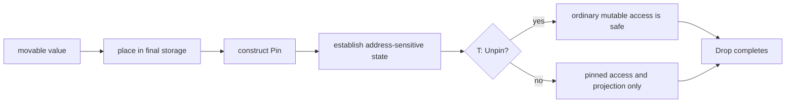

<TLDR>
  <TLDRCell label="what">
    `Pin<P>` wraps a pointer `P` and promises that its pointee won't be moved through safe code from the start of its pinned state through the end of destruction; the pointer itself may still move.
  </TLDRCell>
  <TLDRCell label="trap">
    `Pin` is not an immutability wrapper, and it does not automatically make a self-referential type safe. If the target implements `Unpin`, safe APIs still allow an ordinary mutable reference.
  </TLDRCell>
  <TLDRCell label="fix">
    Don't pin ordinary types without a reason. For an address-sensitive type, place it in its final storage before establishing internal references, and tie every `unsafe` operation to an explicit pinning invariant.
  </TLDRCell>
</TLDR>

## What it is and why it exists

<Term id="pin">Pin</Term> is a type-level contract around a pointer. `Pin<P>` does not freeze the variable `P`; it restricts moving the pointer's target through that pointer. Moving a `Pin<Box<T>>` moves the handle that owns the allocation, but normally leaves the heap-resident `T` at the same address.

Most Rust values remain valid when moved from one place to another. A `String`'s stack-resident control data may change address while still owning the same buffer, and an ordinary struct should not store a raw pointer to one of its own fields. This default model keeps assignment, parameter passing, and container rearrangement straightforward.

Some values become address-sensitive during one phase of their lifetime. A self-referential structure stores its own address in a field, an intrusive data structure lets other nodes store its address, and some compiler-generated futures may retain internal borrows across suspension points. Once those relationships exist, a bytewise move would invalidate the stored addresses.

<Term id="unpin">Unpin</Term> is an auto trait indicating that a type does not rely on pinning guarantees. `i32`, `String`, and most ordinary compositions implement it automatically; a type containing `PhantomPinned` does not. `Unpin` doesn't mean “not currently moving.” It means moving the value remains sound even when it sits behind `Pin`.

`Pin` imposes a meaningful access restriction only when its target is `!Unpin`. For `T: Unpin`, `Pin<&mut T>::get_mut()` safely yields `&mut T`, after which callers can move the value with operations such as `mem::replace`. For `T: !Unpin`, the same conversion is unsafe, and its caller must prove that no address-sensitive part will move.

Pinning is not immutability. A `Pin<&mut T>` can call methods that mutate contents without moving pinned fields, and correctly designed projections can expose inner data. Conversely, a shared `Pin<&T>` prevents mutation because it contains a shared borrow, not because pinning itself means read-only.

Ordinary business structs, state machines containing only owned fields, and futures that do not depend on their own address rarely need hand-written pinning. You most often meet it when implementing `Future::poll`, designing an address-sensitive type, projecting pinned fields, or calling an async API that requires `Pin<&mut T>`.

| Shape | What may move | Key condition |
|---|---|---|
| `Pin<&mut T>` where `T: Unpin` | Safe APIs may move `T` | The type declares no need for pinning |
| `Pin<&mut T>` where `T: !Unpin` | The pointer value may move; `T` may not be moved through it | Maintain the invariant for the borrow |
| `Pin<Box<T>>` where `T: !Unpin` | The `Pin<Box<T>>` handle may move; `T` may not be extracted and moved | Keep the allocation valid through `T`'s destruction |
| `Pin<&T>` | The shared pointer may be copied; `T` cannot be mutated or moved through it | Shared-borrow rules also apply |

## How it works

The pinning contract starts at construction, not at the value's birth. An address-sensitive type can move normally while it is still unpinned; only after `Pin` is established at its final location does code create relationships that depend on that address. A constructor must preserve that order: pin first, then write self-references.

`Pin::new(pointer)` is a safe constructor, but it requires the target to implement `Unpin`. It suits a value that was already safe to move and mainly provides a uniform interface. `Box::pin(value)` first puts the value in a `Box` allocation and then safely produces `Pin<Box<T>>`, even when `T: !Unpin`.

`Pin::new_unchecked(pointer)` can create a pinned pointer to a `!Unpin` target and is therefore `unsafe`. Its caller must guarantee more than stability at that line: until destruction finishes, no alias, owning-pointer operation, or drop path may move, deallocate, or repurpose the storage. The absence of a nearby move does not prove this long-term contract.

Safe access follows two paths based on `Unpin`. `as_ref()` and `as_mut()` create shorter pinned reborrows without surrendering the original relationship, while `get_ref()` obtains a shared reference. `get_mut()` exposes an ordinary mutable reference only when `T: Unpin`; `get_unchecked_mut()` transfers responsibility for not moving `T` to an unsafe caller.

Accessing a field from a pinned struct is called <Term id="pin-projection">pin projection</Term>. Shared projection can ordinarily produce `&Field`; mutable projection must decide whether the field is structurally pinned or may be accessed as an ordinary `&mut Field`. That choice belongs to the type's safety contract and cannot change ad hoc because a field happens to look like a `String`.

The flow below emphasizes state changes and responsibility. Once a value enters an address-sensitive state, safe APIs preserve its address; using `unsafe` to bypass those restrictions transfers the proof obligation to the caller.



The <Term id="pinning-invariant">pinning invariant</Term> includes a drop guarantee: after a value enters its pinned state, its storage cannot become invalid or be repurposed before `drop` is called, and its address remains stable while destruction runs. Merely blocking explicit assignment is not enough; prematurely releasing the allocation would also break address-dependent destruction.

`Pin::set` shows that pinning does not mean a storage slot can never hold another value. It first completes destruction of the old value at its pinned address, then writes a new value into that location, so the old address-sensitive phase has ended correctly. It does not transfer old internal pointers into the new value.

`PhantomPinned` is a zero-sized `!Unpin` marker. Including it prevents a struct from automatically implementing `Unpin`, which stops safe code from obtaining an ordinary `&mut Self` through a mutable pin. It only closes that safe escape hatch; it does not initialize self-references, create a `Pin`, or validate projection code.

The `Future` trait uses `self: Pin<&mut Self>` so a concrete implementation may rely on staying put between polls. A simple future that implements `Unpin` can safely obtain `&mut Self` inside `poll`; an address-sensitive future must use pinned access instead. `.await` and executors arrange this condition before polling, so application code rarely calls `poll` directly.

## Examples

All four programs below were compiled and run with the local `rustc 1.94.0`; they use only stable APIs that remain valid for the Rust 1.98 target. The output blocks contain the actual results.

### Transparent access for an `Unpin` type

`String` implements `Unpin`, so a function receiving `Pin<&mut String>` can still call `get_mut()`. This example demonstrates interface compatibility, not a need to pin `String`.

<Depth level="quick">

```rust title="unpin_message.rs"
use std::pin::Pin;

fn add_status(mut message: Pin<&mut String>) {
    message.as_mut().get_mut().push_str(": ready");
}

fn main() {
    let mut message = String::from("job-42");
    let pinned = Pin::new(&mut message);

    add_status(pinned);
    println!("{message}");
}
```

```text
job-42: ready
```

</Depth>

`Pin::new` is available because `String: Unpin`. `add_status` mutates the string buffer's contents, but this type never promised to depend on the address of the `String` control block. If a function only needs `&mut String`, accepting that reference directly is more honest; this signature exists solely to demonstrate how `Unpin` removes pinned-access restrictions.

### Establishing a self-reference after pinning

`Ticket` points `label_ptr` at its own `label` field and opts out of `Unpin` with `PhantomPinned`. Its constructor calls `Box::pin` before writing the internal pointer in one small unsafe region.

```rust title="self_reference.rs"
use std::marker::PhantomPinned;
use std::pin::Pin;
use std::ptr;

struct Ticket {
    label: String,
    label_ptr: *const String,
    _pin: PhantomPinned,
}

impl Ticket {
    fn new(label: String) -> Pin<Box<Self>> {
        let mut ticket = Box::pin(Self {
            label,
            label_ptr: ptr::null(),
            _pin: PhantomPinned,
        });

        let label_ptr = &ticket.as_ref().get_ref().label as *const String;
        // SAFETY: the pointee is pinned before the pointer is stored.
        unsafe {
            ticket.as_mut().get_unchecked_mut().label_ptr = label_ptr;
        }
        ticket
    }

    fn label(self: Pin<&Self>) -> &str {
        // SAFETY: construction initializes a pointer into this pinned value.
        unsafe { &*self.get_ref().label_ptr }.as_str()
    }
}

fn main() {
    let ticket = Ticket::new(String::from("ticket-17"));
    let moved_handle = ticket;

    println!("{}", moved_handle.as_ref().label());
}
```

```text
ticket-17
```

<TryToBreak items={['write label_ptr before Box::pin', 'return an unpinned Ticket from the constructor', 'mem::replace the label field out of the pinned value']} />

Assigning to `moved_handle` moves the `Pin<Box<Ticket>>` handle, not its heap pointee. Safe APIs cannot extract the `Ticket`, so `label_ptr` remains valid. This example uses a raw pointer and `unsafe` to expose the mechanism; application code should prefer indices, owned data, or an established projection tool rather than maintaining a self-reference by hand.

### Polling through the `Future` contract

`Countdown` has no address-sensitive fields, so it implements `Unpin` automatically. The `Future` interface still requires a pinned receiver so the same trait can safely support state machines that do require pinning.

```rust title="poll_countdown.rs"
use std::future::Future;
use std::pin::Pin;
use std::task::{Context, Poll, Waker};

struct Countdown {
    remaining: u8,
}

impl Future for Countdown {
    type Output = &'static str;

    fn poll(mut self: Pin<&mut Self>, cx: &mut Context<'_>) -> Poll<Self::Output> {
        if self.remaining == 0 {
            Poll::Ready("complete")
        } else {
            self.remaining -= 1;
            cx.waker().wake_by_ref();
            Poll::Pending
        }
    }
}

fn main() {
    let waker = Waker::noop();
    let mut context = Context::from_waker(waker);
    let mut countdown = Box::pin(Countdown { remaining: 1 });

    println!("{:?}", countdown.as_mut().poll(&mut context));
    println!("{:?}", countdown.as_mut().poll(&mut context));
}
```

```text
Pending
Ready("complete")
```

The first poll decreases the count and notifies the waker; the second returns the result. Because `Countdown: Unpin`, field assignment works through `Pin`'s `DerefMut` implementation. Adding a structurally pinned field would require safe projection or a justified unsafe projection. A real executor schedules another poll from the wake notification instead of calling twice in immediate succession.

### Replacing a pinned value with `Pin::set`

`Phase` is `!Unpin` because it contains `PhantomPinned`, yet `Pin::set` can still replace the whole value. The output order shows the old value completing destruction before the new value occupies the location.

```rust title="replace_pinned.rs"
use std::marker::PhantomPinned;

struct Phase {
    name: &'static str,
    _pin: PhantomPinned,
}

impl Drop for Phase {
    fn drop(&mut self) {
        println!("drop {}", self.name);
    }
}

fn main() {
    let mut phase = Box::pin(Phase {
        name: "queued",
        _pin: PhantomPinned,
    });

    phase.as_mut().set(Phase {
        name: "running",
        _pin: PhantomPinned,
    });
    println!("current {}", phase.name);
}
```

```text
drop queued
current running
drop running
```

`set` guarantees that `queued` is destroyed first, rather than overwriting its bytes while an address-sensitive state still exists. The new `Phase` is then destroyed normally at the end of the scope. If the type must establish internal pointers, the replacement still needs to enter its own address-sensitive state through the type's construction protocol; it cannot reuse old pointers.

## Pitfalls

### Treating a pinned pointer as an immovable handle

> [!PITFALL]
> Moving a `Pin<Box<T>>`, swapping two such variables, or storing one in a `Vec` moves the pointer handle. None of these operations moves the `T` in its `Box` allocation, so they do not violate the pinning contract.

**Fix:** distinguish the pointer value from its pointee every time. When reviewing an assignment, state whether it moves a `Pin<Box<T>>` handle, the `T` itself, or one of `T`'s fields. Extracting, replacing, or copying the pointee's bytes is the dangerous operation.

### Assuming `Pin` restricts every type

> [!PITFALL]
> Wrapping a `String` or an ordinary struct in `Pin` does not make it immovable because those types usually implement `Unpin`. Safe code can obtain `&mut T` and then move or replace the value.

**Fix:** first decide whether the type maintains a real address invariant. Use `PhantomPinned` or a genuinely `!Unpin` field when opting out of automatic `Unpin`; do not add `Pin` to solve an ordinary borrowing error.

### Creating a self-reference before pinning

> [!PITFALL]
> Storing a field's address in a local `Self` and then passing that value to `Box::pin` creates the pointer before moving the whole struct into the allocation. The internal pointer still names the old stack location, so its first dereference may cause undefined behavior.

**Fix:** use two-phase initialization: place all ordinary fields in final storage and pin them, then write internal addresses through a controlled unsafe operation. The constructor should return a pinned handle such as `Pin<Box<Self>>`, not a freely movable `Self`.

### Leaking a movable reference from unsafe projection

> [!PITFALL]
> The `&mut Self` returned by `get_unchecked_mut()` can be passed to `mem::replace`, while `map_unchecked_mut()` can expose a structurally pinned field as an ordinary `&mut Field`. The compiler trusts the caller's proof and will not protect those paths again.

**Fix:** contain unsafe code in the smallest projection API, record which fields are pinned and which may move, and check that `Drop` follows the same choice. Prefer a mature macro or library when it can generate an already-reviewed projection implementation.

### Implementing `Unpin` just to satisfy a bound

> [!PITFALL]
> After seeing a `T: Unpin` error, a model may generate `impl Unpin for AddressSensitive {}`. This is a safe trait implementation, but an incorrect implementation lets safe callers obtain a movable reference and invalidate the type's internal raw pointers.

**Fix:** treat an `Unpin` bound as an API design signal and first use a pinned calling pattern or change the generic boundary. Implement `Unpin` only after proving that moves preserve every invariant, and protect types that must remain `!Unpin` with compile-fail tests.

### Ignoring destruction and storage invalidation

> [!PITFALL]
> The pinning guarantee constrains more than ordinary method calls. A custom owning pointer that releases or repurposes pinned storage without running `T::drop`, or a destructor that moves a structurally pinned field, also violates the contract.

**Fix:** review `Deref`, `DerefMut`, and `Drop` for any custom pointer used to create a `Pin`, and keep pinned fields in place until their destruction finishes. Use a safe API such as `Pin::set` when replacing the complete value so the required drop order is preserved.

## In the AI era

**What generated code gets wrong here**

Models often construct a `Self` with an internal raw pointer on the stack and then call `Box::pin`, making the pointer stale immediately. They also hand-write `impl Unpin` to satisfy a bound or return an ordinary mutable reference to a pinned field through `get_unchecked_mut()`, enabling a later `mem::replace` to move that field. In async code, another failure mode is applying `Box::pin` to every future or copying the still-unstable negative implementation `impl !Unpin` from an old example, causing needless allocations or an outright compilation error.

**Ask your AI to check**

- Give a strict “place in final storage, create `Pin`, write internal address, begin use” timeline for every self-referential value, and confirm that its address does not change between those steps.
- List every `get_unchecked_mut`, `map_unchecked_mut`, `new_unchecked`, and manual `Unpin` implementation, and state the exact invariant its caller must maintain.
- For each future, say whether it is `Unpin`, who pins it before the first `poll`, and whether a local `pin!` can replace a heap allocation.

**Review checklist**

- Identify whether each move affects a pointer handle, the complete pointee, or one field inside a struct.
- Exercise construction failure, destruction, and replacement paths, ensuring internal addresses are created only after pinning and remain valid through drop.
- Reject `unsafe`, an `Unpin` implementation, or `Box::pin` added only to silence a compiler error; require a concrete address invariant or storage requirement.

**Prompt vocabulary**

Use the exact terms `pinned pointee`, `pointer handle`, `address-sensitive value`, `pinning invariant`, `structural pinning`, `pin projection`, `drop guarantee`, `safe pinning constructor`, and `Unpin auto trait`. Ask the model for a pinned-state timeline and a field-by-field projection table; “make the borrow checker accept it” is too vague to review an unsafe contract.

<Depth level="deep">

## The lifetime of pinned state

A value is not immovable from birth merely because its type is `!Unpin`. `!Unpin` only makes safe `Pin` APIs restrict access after pinning; the unpinned value may move normally beforehand. An address-sensitive type should distinguish its ordinary state before internal relationships exist from its pinned state that depends on an address.

This phase distinction explains why a constructor returning an ordinary `Self` usually cannot safely establish a self-reference. Returning the value may itself move it. A safe constructor normally returns a pinned pointer that already owns final storage and exposes no safe route for recovering `Self`.

`Pin<Box<T>>` is not the only form. `std::pin::pin!` can pin a value in anonymous local storage for the current scope and return `Pin<&mut T>` without a heap allocation. The pinned reference cannot escape that storage's lifetime. An owning pinned pointer is usually more convenient when the value must be returned, retained, or stored in a heterogeneous collection.

Using `Pin::new_unchecked(&mut local)` directly is harder to review. The original variable may remain reachable through aliases, and the caller must ensure that later code and destruction paths never move it. Prefer `pin!` or an owning safe constructor so types and borrow scopes close those paths for you.

## Structural pinning and field projection

Pinning a struct does not automatically decide that every field must be pinned. A type author may designate fields as structurally pinned: while the parent remains pinned, those fields cannot move before their own destruction. Other fields can be designated unpinned and exposed through ordinary mutable references.

The structural choice must remain consistent across projection, `Unpin`, and `Drop`. If a pinned field is `!Unpin`, the parent usually cannot implement `Unpin` unconditionally, and its destructor cannot use `mem::replace` to extract that field. Returning `Pin<&mut Field>` from one projection method while another safe path returns `&mut Field` does not establish a valid contract.

`Pin::map_unchecked_mut` is unsafe because the standard library cannot tell from the closure whether the returned reference points inside the same object, outlives the parent incorrectly, or accompanies a later move of the parent. A correct proof covers location, lifetime, and destruction order.

Even an unpinned field cannot be returned with a reference that outlives its borrow. `Pin` does not replace ordinary lifetime and aliasing rules; it adds address stability as another constraint. A projection API must satisfy both the borrow checker and the pinning invariant.

## How `Unpin` composes

`Unpin` is an auto trait, so a struct normally implements it when all relevant fields do. A generic container's result can vary with its type parameter; for example, a container that stores `T` will usually be `Unpin` when `T: Unpin`. This lets generic APIs preserve straightforward access for ordinary values while still supporting genuinely address-sensitive ones.

`PhantomPinned` prevents automatic implementation by contributing one `!Unpin` field. It says nothing about where a raw pointer points and does not make a struct self-referential by itself. If internal pointers are removed and address stability is no longer required, reevaluate the marker instead of treating it as decoration for an advanced type.

Explicitly implementing `Unpin` does not require an `unsafe` keyword, yet it can break internal assumptions established by unsafe code. Unsafe code is allowed to rely on the semantics exposed by safe trait APIs. Review a manual `Unpin` implementation as a change to the safety boundary, not as routine compiler appeasement.

When a generic function requires `T: Unpin`, it declares that it may need ordinary mutable access through a pin or may move `T`. Do not automatically add an implementation to the caller's type. If the function only needs pinned access, change its signature to accept `Pin<&mut T>` and preserve that restriction internally.

## Pointer-type obligations

The guarantee of `Pin<P>` depends on `P` behaving like a pointer. Standard-library `Box<T>`, `&mut T`, and `&T` have known dereference semantics; a custom pointer that lets `DerefMut` produce changing addresses or frees its target early in `Drop` can make the safe surface of `Pin<P>` misleading.

The proof for calling `Pin::new_unchecked` with a custom owning pointer therefore extends beyond the current function. You must review every safe API and destructor behavior of that pointer and establish that none can move the target. Wrapping an unstable container in `Pin` does not repair the container.

A shared reference is not a shortcut for constructing arbitrary pinning guarantees. Although `&T` cannot itself move `T`, whoever creates a pinned pointer must still ensure that another owning path cannot move or prematurely invalidate the target. The contract covers every access path to the value, not just the variable in view.

## Future and the polling boundary

`Future::poll` has a pinned receiver so concrete implementations may retain address-sensitive state between polls, not because every future is actually self-referential. A generic executor cannot vary its calling convention by concrete implementation, so the trait provides the stronger guarantee at one uniform boundary.

A future may move before it is first pinned and polled. Once it enters the polling protocol, its implementation may begin relying on its address, and every later `poll` must use a pinned pointer. Whether moving work from one queue to another is sound depends on whether the queue moves a pinned pointer handle or the target state machine.

`.await` hides the polling loop, `Context`, and pinning details. Those details return when you implement a future or combinator. An implementation with ordinary fields that automatically implements `Unpin` may safely use `get_mut()`; one containing a pinned child future must correctly project the parent's pin to that field.

A future returning `Poll::Pending` must arrange to wake the current task when progress may become possible. `Pin` guarantees only address stability; it does not guarantee the wake protocol, cancellation safety, or concurrency correctness. Attributing every async failure to pinning misses these independent contracts.

## Drop guarantees and replacement

An address-sensitive value's destructor may read internal pointers or notify a data structure that still stores its address, so the address must remain stable during destruction. Releasing memory before running the destructor, or moving a value to temporary storage and dropping it there, violates the pinning guarantee.

`Pin::set` is safe because of its order: it destroys the old value at its pinned location and then writes the new value. The old address-sensitive lifetime is over at that point. `mem::replace` returns the old value and therefore must move it first, so it cannot be called safely on a `!Unpin` target through `Pin<&mut T>`.

Leaking a pinned value does not move it, but it skips destruction and retains resources, so it is not a general solution to difficult drop logic. Pinning specifies which operations are sound; it does not promise memory reclamation or replace deliberate resource-lifetime design.

Panic paths must preserve invariants too. If two-phase initialization panics after writing some internal links, the destructor must recognize the incomplete state, or construction must arrange every visible state to remain destructible. Representing an uninitialized internal pointer with `Option` is often easier to review than pretending it is always valid.

## Reviewing unsafe pinning code

Every unsafe pinning operation should have a locally checkable explanation. For `new_unchecked`, state who owns the storage, which paths might move it, and how long the guarantee lasts. For `get_unchecked_mut`, state which mutations are permitted and why no structurally pinned field can move. A projection also has to explain how its returned location relates to the parent.

Tests can expose construction-order, drop-count, and public-API bugs, but they cannot prove that a raw-pointer dereference avoids undefined behavior. Successful compilation only proves that the type checker accepts the declared boundary. Review from the safe public API inward and confirm that no call sequence can trigger a move forbidden by an unsafe assumption.

Compile-fail tests can protect a `!Unpin` boundary by showing that a helper requiring `Unpin` rejects the type. Runtime tests should cover handle moves, replacement, early returns, and panic cleanup. The two kinds of test protect type boundaries and observable behavior respectively; neither substitutes for the other.

</Depth>

<Checkpoint id="rust/pin" />

## Further reading

- [Rust standard library: `std::pin`](https://doc.rust-lang.org/std/pin/index.html)
- [Rust standard library: `Pin`](https://doc.rust-lang.org/std/pin/struct.Pin.html)
- [Rust standard library: `Unpin`](https://doc.rust-lang.org/std/marker/trait.Unpin.html)
- [Rust standard library: `Future`](https://doc.rust-lang.org/std/future/trait.Future.html)
- [The Rust Programming Language: Futures and the async syntax](https://doc.rust-lang.org/book/ch17-05-traits-for-async.html)
