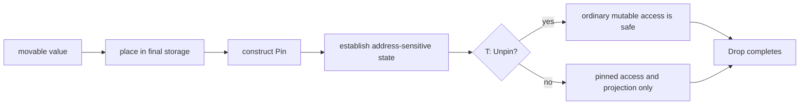

<TLDR>
  <TLDRCell label="what">
    `Pin<P>` 包装指针 `P`，承诺从值进入固定状态到析构完成，不能通过安全代码移动 `P` 指向的值；指针本身仍然可以移动。
  </TLDRCell>
  <TLDRCell label="trap">
    `Pin` 不是不可变包装器，也不会自动让自引用类型安全。若目标实现 `Unpin`，安全 API 仍允许取得普通可变引用。
  </TLDRCell>
  <TLDRCell label="fix">
    普通类型不必主动固定；地址敏感类型应先放入最终存储位置，再建立内部引用，并把每个 `unsafe` 操作对应到明确的固定不变量。
  </TLDRCell>
</TLDR>

## 是什么，为什么存在

<Term id="pin">Pin</Term> 是围绕指针的类型级契约。`Pin<P>` 不会冻结变量 `P`，而是限制你通过这个指针移动它的目标值。移动 `Pin<Box<T>>` 只会移动拥有堆分配的指针句柄，通常不会改变堆上 `T` 的地址。

大多数 Rust 值从一个位置移动到另一个位置时仍然有效。`String` 的栈上控制信息可以换地址，只要它仍然拥有同一块缓冲区；普通结构体的字段也不应保存指向自身其他字段的裸指针。这个默认模型让赋值、传参和容器重排保持简单。

有些值在生命周期的某一阶段会变成地址敏感值（address-sensitive value）。自引用结构在字段中保存自身地址，侵入式数据结构让其他节点保存其地址，编译器生成的某些 future 则可能在状态中保存跨挂起点的内部借用。它们一旦建立这种关系，再做按位移动就会使内部地址失效。

<Term id="unpin">Unpin</Term> 是自动 trait，表示类型不依赖固定保证。`i32`、`String` 和绝大多数普通组合类型会自动实现它；包含 `PhantomPinned` 的类型默认不会实现。`Unpin` 不是「当前没有移动」，而是「即使放在 `Pin` 后面，移动该值也不会破坏地址不变量」。

`Pin` 只有在目标为 `!Unpin` 时才施加实际访问限制。对于 `T: Unpin`，`Pin<&mut T>::get_mut()` 可以安全地产生 `&mut T`，调用方随后可以用 `mem::replace` 等操作移动值。对于 `T: !Unpin`，同样的转换需要 `unsafe`，调用者必须自行证明它不会移动地址敏感部分。

固定也不等于不可变。`Pin<&mut T>` 可以调用只修改内容但不移动固定字段的方法，还可以通过正确的字段投影操作内部数据。反过来，一个共享的 `Pin<&T>` 不允许修改，原因来自共享借用，不是来自固定本身。

普通业务结构、只保存拥有型字段的状态机，以及不会依赖自身地址的 future 通常不需要手写 `Pin`。你最常在实现 `Future::poll`、设计地址敏感类型、编写固定字段投影，或调用要求 `Pin<&mut T>` 的异步 API 时遇到它。

| 形状 | 可以移动什么 | 关键条件 |
|---|---|---|
| `Pin<&mut T>`，`T: Unpin` | 可通过安全 API 移动 `T` | 类型声明不需要固定保证 |
| `Pin<&mut T>`，`T: !Unpin` | 可移动指针值，不可通过它移动 `T` | 借用期间维护固定不变量 |
| `Pin<Box<T>>`，`T: !Unpin` | 可移动 `Pin<Box<T>>` 句柄，不可取出并移动 `T` | 分配保持有效直到 `T` 析构完成 |
| `Pin<&T>` | 可复制共享指针，不可通过它修改或移动 `T` | 同时受共享借用约束 |

## 工作原理

固定契约从构造开始，而不是从值出生时开始。地址敏感类型可以先作为普通未固定值移动；在最终位置建立 `Pin` 后，代码才创建依赖该地址的内部关系。构造器必须保证两件事的顺序：先固定，后写入自引用。

`Pin::new(pointer)` 是安全构造器，但要求目标实现 `Unpin`。它适合本来就能安全移动的值，因此主要提供统一接口。`Box::pin(value)` 会先把值放入 `Box` 的分配，再安全地产生 `Pin<Box<T>>`，即使 `T: !Unpin` 也可使用。

`Pin::new_unchecked(pointer)` 可以为 `!Unpin` 目标创建固定指针，因此是 `unsafe`。调用者不仅要保证当前地址稳定，还要保证从此直到目标析构完成，任何别名、拥有指针实现和析构路径都不会移动、释放或复用该存储。局部看起来没有移动并不足以证明这个长期契约。

安全访问根据 `Unpin` 分成两条路径。`as_ref()` 与 `as_mut()` 创建更短的固定重借用，不放弃原固定关系；`get_ref()` 取得共享引用。`get_mut()` 只在 `T: Unpin` 时提供普通可变引用，而 `get_unchecked_mut()` 把不移动 `T` 的责任交给 `unsafe` 调用方。

从固定结构体访问字段称为<Term id="pin-projection">固定投影（pin projection）</Term>。普通共享投影通常直接产生 `&Field`；可变投影必须先决定字段是结构性固定字段，还是允许作为普通 `&mut Field` 访问的非固定字段。这个决定属于类型的安全契约，不能根据「字段看起来是 `String`」临时改变。

下面的流程强调状态变化和责任转移。进入地址敏感状态之后，安全 API 保持相同地址；如果使用 `unsafe` 绕过限制，证明责任就落到调用者身上。



<Term id="pinning-invariant">固定不变量（pinning invariant）</Term>包含析构保证：进入固定状态的值在 `drop` 被调用之前，存储不能失效或被重新用于别的值，而且析构执行期间地址仍然稳定。只禁止显式赋值还不够；提前释放分配会让依赖该地址的析构逻辑同样失效。

`Pin::set` 说明固定并不意味着存储槽永远不能换值。该方法先在原地址完成旧值的析构，再把新值写入相同位置，所以旧值的地址敏感阶段已经正确结束。它不会把旧的内部指针自动转移给新值。

`PhantomPinned` 是一个零大小的 `!Unpin` 标记。把它放进结构体会阻止结构体自动实现 `Unpin`，从而使安全代码不能从固定可变引用取得普通 `&mut Self`。它只关闭这条安全出口，不会初始化自引用、创建 `Pin` 或验证投影代码。

`Future` trait 把接收者写成 `self: Pin<&mut Self>`，这样具体 future 实现可以依赖轮询之间不被移动。实现了 `Unpin` 的简单 future 可以在 `poll` 中安全取得 `&mut Self`；地址敏感 future 则只能使用固定访问。`.await` 和执行器负责在轮询前安排这一条件，应用代码通常不直接调用 `poll`。

## 示例

下面四个程序均用本地 `rustc 1.94.0` 编译并执行；它们只使用 Rust 1.98 目标版本中仍然有效的稳定 API。输出块是实际结果。

### `Unpin` 类型的透明访问

`String` 实现 `Unpin`，所以接收 `Pin<&mut String>` 的函数仍可调用 `get_mut()`。这个例子展示的是接口兼容性，不是 `String` 需要地址固定。

<Depth level="quick">

```rust title="unpin_message.rs"
use std::pin::Pin;

fn add_status(mut message: Pin<&mut String>) {
    message.as_mut().get_mut().push_str(": ready");
}

fn main() {
    let mut message = String::from("job-42");
    let pinned = Pin::new(&mut message);

    add_status(pinned);
    println!("{message}");
}
```

```text
job-42: ready
```

</Depth>

`Pin::new` 可用，是因为 `String: Unpin`。`add_status` 修改字符串缓冲区的内容，但这个类型本来就不承诺依赖 `String` 控制块自身的地址。若函数只需要 `&mut String`，直接接收可变引用会更诚实；这里只是展示 `Unpin` 如何解除固定访问限制。

### 固定后建立自引用

`Ticket` 用 `label_ptr` 指向自己的 `label` 字段，并用 `PhantomPinned` 选择退出 `Unpin`。构造器先调用 `Box::pin`，然后才在一个很小的 `unsafe` 区域写入内部指针。

```rust title="self_reference.rs"
use std::marker::PhantomPinned;
use std::pin::Pin;
use std::ptr;

struct Ticket {
    label: String,
    label_ptr: *const String,
    _pin: PhantomPinned,
}

impl Ticket {
    fn new(label: String) -> Pin<Box<Self>> {
        let mut ticket = Box::pin(Self {
            label,
            label_ptr: ptr::null(),
            _pin: PhantomPinned,
        });

        let label_ptr = &ticket.as_ref().get_ref().label as *const String;
        // SAFETY：存储指针之前，目标已经固定。
        unsafe {
            ticket.as_mut().get_unchecked_mut().label_ptr = label_ptr;
        }
        ticket
    }

    fn label(self: Pin<&Self>) -> &str {
        // SAFETY：构造器写入了指向当前固定值内部的指针。
        unsafe { &*self.get_ref().label_ptr }.as_str()
    }
}

fn main() {
    let ticket = Ticket::new(String::from("ticket-17"));
    let moved_handle = ticket;

    println!("{}", moved_handle.as_ref().label());
}
```

```text
ticket-17
```

<TryToBreak items={['在 Box::pin 之前写入 label_ptr', '让构造器返回未固定的 Ticket', '从固定值中 mem::replace 出 label 字段']} />

赋值给 `moved_handle` 会移动 `Pin<Box<Ticket>>` 这个句柄，不会移动其堆上目标。安全接口不能从中取出 `Ticket`，因此 `label_ptr` 保持有效。这里使用裸指针和 `unsafe` 是为了展示机制；普通应用应优先使用索引、拥有型数据或已有的固定投影工具，避免自行维护自引用。

### 按 `Future` 契约轮询

`Countdown` 没有地址敏感字段，所以自动实现 `Unpin`。`Future` 接口仍要求固定接收者，以便同一个 trait 也能安全支持需要固定的状态机。

```rust title="poll_countdown.rs"
use std::future::Future;
use std::pin::Pin;
use std::task::{Context, Poll, Waker};

struct Countdown {
    remaining: u8,
}

impl Future for Countdown {
    type Output = &'static str;

    fn poll(mut self: Pin<&mut Self>, cx: &mut Context<'_>) -> Poll<Self::Output> {
        if self.remaining == 0 {
            Poll::Ready("complete")
        } else {
            self.remaining -= 1;
            cx.waker().wake_by_ref();
            Poll::Pending
        }
    }
}

fn main() {
    let waker = Waker::noop();
    let mut context = Context::from_waker(waker);
    let mut countdown = Box::pin(Countdown { remaining: 1 });

    println!("{:?}", countdown.as_mut().poll(&mut context));
    println!("{:?}", countdown.as_mut().poll(&mut context));
}
```

```text
Pending
Ready("complete")
```

第一次轮询减少计数并通知 waker，第二次返回结果。因为 `Countdown: Unpin`，字段赋值可通过 `Pin` 的 `DerefMut` 实现；若加入结构性固定字段，就需要安全投影或经过证明的 `unsafe` 投影。真实执行器根据唤醒通知安排下一次轮询，不会像示例一样手动连续调用。

### 用 `Pin::set` 替换固定值

`Phase` 因 `PhantomPinned` 而成为 `!Unpin`，但 `Pin::set` 仍可替换整个值。输出顺序显示旧值先完成析构，新值随后占用该位置。

```rust title="replace_pinned.rs"
use std::marker::PhantomPinned;

struct Phase {
    name: &'static str,
    _pin: PhantomPinned,
}

impl Drop for Phase {
    fn drop(&mut self) {
        println!("drop {}", self.name);
    }
}

fn main() {
    let mut phase = Box::pin(Phase {
        name: "queued",
        _pin: PhantomPinned,
    });

    phase.as_mut().set(Phase {
        name: "running",
        _pin: PhantomPinned,
    });
    println!("current {}", phase.name);
}
```

```text
drop queued
current running
drop running
```

`set` 保证先析构 `queued`，所以不会在地址敏感状态仍然存在时直接覆盖字节。新 `Phase` 之后在作用域末尾正常析构。若类型需要建立内部指针，新值仍须在替换后按自己的构造协议进入地址敏感状态，不能复用旧指针。

## 陷阱

### 把固定指针当成不可移动句柄

> [!PITFALL]
> 移动 `Pin<Box<T>>`、交换两个这样的变量，或把它放进 `Vec`，都会移动指针句柄。这些操作本身不会移动 `Box` 分配中的 `T`，所以并不违反固定契约。

**修复方法：** 每次都区分指针值与其目标值。审查赋值时写明被移动的是 `Pin<Box<T>>` 句柄还是 `T`；真正危险的是解引用后取出、替换或复制 `T` 的字节。

### 认为 `Pin` 自动限制所有类型

> [!PITFALL]
> 给 `String` 或普通结构体套上 `Pin` 不会让它变成不可移动类型，因为它们通常实现 `Unpin`。安全代码可以取得 `&mut T`，再把值移出或替换。

**修复方法：** 先判断类型是否真的维护地址不变量。需要选择退出自动 `Unpin` 时使用 `PhantomPinned` 或依赖一个确实为 `!Unpin` 的字段；不要为解决普通借用错误而添加 `Pin`。

### 在固定之前创建自引用

> [!PITFALL]
> 在局部 `Self` 中保存字段地址，然后把该值传给 `Box::pin`，会先创建指针再移动整个结构体进入堆分配。内部指针仍指向旧栈位置，第一次解引用就可能触发未定义行为。

**修复方法：** 使用两阶段初始化：先把所有普通字段放到最终存储位置并固定，再通过受控的 `unsafe` 写入内部地址。构造器应返回 `Pin<Box<Self>>` 等固定句柄，不要返回还能自由移动的 `Self`。

### 从 `unsafe` 投影泄漏可移动引用

> [!PITFALL]
> `get_unchecked_mut()` 产生的 `&mut Self` 可以交给 `mem::replace`，而 `map_unchecked_mut()` 也可能把本应结构性固定的字段暴露成普通 `&mut Field`。编译器会相信调用者的证明，不会再次保护这些路径。

**修复方法：** 把 `unsafe` 封装在最小的投影 API 中，逐字段记录哪些字段固定、哪些字段可移动，并审查 `Drop` 是否遵守同一选择。成熟宏或库可以生成投影时，应优先复用其已审查实现。

### 为通过约束而手写 `Unpin`

> [!PITFALL]
> 模型可能在看到 `T: Unpin` 错误后生成 `impl Unpin for AddressSensitive {}`。这是安全 trait 的实现，但错误实现会让安全调用方取得可移动引用，从而破坏类型内部裸指针。

**修复方法：** 把 `Unpin` 约束当作 API 设计信号，先改用固定调用方式或调整泛型边界。只有证明类型在移动后仍保持全部不变量时才实现 `Unpin`，并用编译失败测试保护真正应为 `!Unpin` 的类型。

### 忽略析构与存储失效

> [!PITFALL]
> 固定保证不只约束普通方法调用。自定义拥有指针若在未运行 `T::drop` 时释放或复用固定存储，或者析构代码移动结构性固定字段，同样违反契约。

**修复方法：** 对创建 `Pin` 的自定义指针审查 `Deref`、`DerefMut` 和 `Drop` 的行为，并让固定字段留在原位直到其析构结束。需要替换整个值时使用 `Pin::set` 这类保持析构顺序的安全 API。

<Depth level="deep">

## 固定状态的生命周期

一个值不是因为类型为 `!Unpin` 就从创建起永远不能移动。`!Unpin` 只让安全的 `Pin` API 在固定后施加限制；构造前仍可正常移动。地址敏感类型应明确区分尚未初始化内部关系的普通状态，以及已经依赖地址的固定状态。

这种阶段差异解释了为什么返回普通 `Self` 的构造器通常无法安全建立自引用。返回动作本身就可能移动值。安全构造器通常返回一个已经拥有最终存储的固定指针，并且不向调用者暴露能取回 `Self` 的安全路径。

`Pin<Box<T>>` 不是唯一形式。`std::pin::pin!` 可以把值固定在当前作用域的匿名局部存储中，并返回 `Pin<&mut T>`，不需要堆分配。得到的固定引用不能逃出该存储的生命周期；需要长期拥有、返回或放入异构集合时，拥有型固定指针通常更方便。

直接用 `Pin::new_unchecked(&mut local)` 固定局部值更难审查。原变量仍可能通过别名访问，调用者还必须保证后续代码与析构路径都不移动它。优先使用 `pin!` 或拥有型安全构造器，让类型和借用范围替你封住这些路径。

## 结构性固定与字段投影

固定一个结构体不会自动规定每个字段都必须固定。类型作者可以把某些字段定义为结构性固定：只要父对象保持固定，这些字段也不允许在析构前移动。其他字段可以被视为非固定字段，并通过普通可变引用访问。

结构性固定的选择必须贯穿投影、`Unpin` 和 `Drop`。如果一个固定字段为 `!Unpin`，父类型通常也不能无条件实现 `Unpin`；析构函数也不能用 `mem::replace` 取走该字段。只在一个投影方法里返回 `Pin<&mut Field>`，却在另一条安全路径中返回 `&mut Field`，并没有形成有效契约。

`Pin::map_unchecked_mut` 之所以是 `unsafe`，是因为标准库无法从闭包知道返回引用是否指向同一对象内部、是否会在父对象之前失效，以及调用者是否还会移动父对象。正确证明至少要覆盖位置关系、生命周期和析构顺序。

非固定字段也不能随意返回超出借用期的引用。`Pin` 不替代普通生命周期与别名规则；它只增加地址稳定这一维约束。投影 API 同时要满足借用检查规则和固定不变量。

## `Unpin` 的组合规则

`Unpin` 是自动 trait，因此结构体在所有相关字段都实现它时通常自动实现。泛型容器的结果会随类型参数变化，例如只保存 `T` 的容器一般在 `T: Unpin` 时实现 `Unpin`。这让通用 API 可以对普通值保留简单访问，同时支持真正的地址敏感值。

`PhantomPinned` 通过一个 `!Unpin` 字段阻止自动实现。它不代表裸指针指向哪里，也不让结构体自动变成自引用。若删除内部指针后不再需要地址稳定，也应重新评估这个标记，而不是把它当作高级类型的装饰。

为类型显式实现 `Unpin` 不需要 `unsafe` 关键字，但仍可能破坏使用 `unsafe` 建立的内部假设。这是因为 `unsafe` 代码可以依赖安全 trait API 的语义。代码审查必须把手写 `Unpin` 当作安全边界变化，而不是普通的编译器适配。

泛型函数要求 `T: Unpin` 时，是在声明它可能需要通过固定包装取得普通可变访问或移动 `T`。不要自动给调用类型补实现。若函数实际上只需固定访问，应把签名改为接受 `Pin<&mut T>` 并在内部保持该约束。

## 指针类型的责任

`Pin<P>` 的保证依赖 `P` 的指针行为。标准库的 `Box<T>`、`&mut T` 和 `&T` 有已知的解引用语义；自定义指针若让 `DerefMut` 返回会变化的地址，或在 `Drop` 中提前释放目标，就可能使 `Pin<P>` 的安全外观失真。

因此，为自定义拥有指针调用 `Pin::new_unchecked` 时，证明范围超过当前函数。你必须审查该指针所有安全 API 和析构行为，并保证它们无法移动目标。把一个行为不稳定的容器包装进 `Pin` 不会修复容器。

共享引用也不是随意构造固定保证的捷径。虽然 `&T` 本身不能用于移动 `T`，但创建固定指针的人仍需确认目标不会由其他拥有路径移动或提前失效。固定契约覆盖值的全部访问路径，不只覆盖眼前这个变量。

## Future 与轮询边界

`Future::poll` 使用固定接收者，是为了让具体实现可以在轮询之间保存地址敏感状态，而不是说每个 future 都实际自引用。通用执行器无法根据具体实现改变调用约定，所以 trait 在统一边界上提供较强保证。

一个 future 在第一次被固定和轮询之前可以移动。进入轮询协议后，实现可以开始依赖其地址，之后每次 `poll` 都必须通过固定指针。把 future 从一个队列取出并放入另一个队列是否安全，取决于移动的是固定指针句柄还是其目标状态机。

`.await` 隐藏了轮询循环、`Context` 和固定细节。手写 future 或组合器时，这些细节重新进入 API。若实现只包含普通字段并自动实现 `Unpin`，可以安全地使用 `get_mut()`；若包含固定子 future，则需要把父固定引用正确投影到该字段。

返回 `Poll::Pending` 的 future 必须安排在可能取得进展时唤醒当前任务。`Pin` 只保证地址，不保证唤醒协议、取消安全或并发正确性。把所有异步错误归因于固定会漏掉这些彼此独立的契约。

## 析构保证与替换

地址敏感值的析构函数可能读取内部指针或通知仍保存其地址的数据结构，因此析构期间地址也必须稳定。先释放内存、再尝试运行析构，或者把值移动到临时位置后析构，都会违反固定保证。

`Pin::set` 的安全性来自顺序：先在固定位置析构旧值，再写入新值。此时旧值的地址敏感生命周期已经结束。`mem::replace` 直接返回旧值，需要先把它移出，因而不能通过 `Pin<&mut T>` 对 `!Unpin` 目标安全调用。

泄漏一个固定值不会移动它，但会跳过析构并保留资源，因此通常不是解决析构困难的方法。固定保证规定哪些操作安全，不承诺程序一定回收内存，也不替代显式的资源生命周期设计。

恐慌路径同样要维护不变量。若两阶段初始化在写入部分内部链接后恐慌，析构函数必须能识别未完成状态，或者构造过程必须把可见状态安排成始终可析构。用 `Option` 表示尚未初始化的内部指针，往往比假装它始终有效更容易审查。

## 不安全代码的审查方法

每个 `unsafe` 固定操作都应附带局部可验证的说明。`new_unchecked` 的说明应回答谁拥有存储、哪些路径可能移动它、保证持续多久；`get_unchecked_mut` 应说明允许哪些修改，以及为何不会移动结构性固定字段；投影还要说明返回位置与父对象的关系。

测试可以发现构造顺序、析构次数和公开 API 的问题，却不能证明裸指针解引用没有未定义行为。编译通过也只证明类型检查器接受了声明的边界。审查需要从安全公开 API 反推，确认任何调用顺序都无法触发被 `unsafe` 假设禁止的移动。

编译失败测试适合保护 `!Unpin` 约束，例如确认调用者不能用要求 `Unpin` 的辅助函数接收该类型。运行时测试则应覆盖句柄移动、替换、提前返回和恐慌清理。两类测试分别保护类型边界和可观察行为，不能互相替代。

</Depth>

<Checkpoint id="rust/pin" />

## 延伸阅读

- [Rust 标准库：`std::pin` 模块](https://doc.rust-lang.org/std/pin/index.html)
- [Rust 标准库：`Pin`](https://doc.rust-lang.org/std/pin/struct.Pin.html)
- [Rust 标准库：`Unpin`](https://doc.rust-lang.org/std/marker/trait.Unpin.html)
- [Rust 标准库：`Future`](https://doc.rust-lang.org/std/future/trait.Future.html)
- [The Rust Programming Language：Future 与 async 语法](https://doc.rust-lang.org/book/ch17-05-traits-for-async.html)
