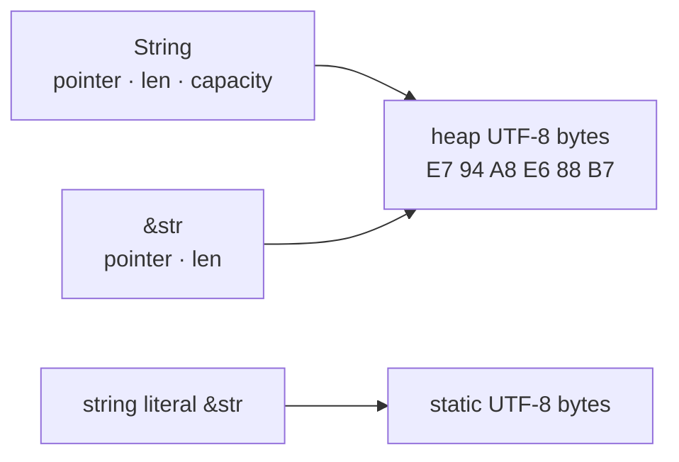

<TLDR>
  <TLDRCell label="what">
    `String` owns growable UTF-8 text. `str` is a string slice made of valid UTF-8 bytes, and you usually work with its borrowed form, `&str`.
  </TLDRCell>
  <TLDRCell label="trap">
    Both `len()` and range indexing count bytes. Treating bytes as characters, or slicing through a UTF-8 code point, produces the wrong answer or a panic.
  </TLDRCell>
  <TLDRCell label="fix">
    Prefer `&str` for read-only parameters and use `String` when you must own or grow text. Choose bytes, Unicode scalar values, or grapheme clusters deliberately.
  </TLDRCell>
</TLDR>

## What it is and why it exists

Rust's core string types are `String` and `str`. A `String` owns a growable sequence of UTF-8 bytes on the heap. `str` is a dynamically sized <Term id="string-slice">string-slice</Term> type representing valid UTF-8 bytes, so a bare `str` usually appears behind a pointer such as `&str`, `Box<str>`, or `Arc<str>`.

The usual pair is an owned `String` and a borrowed `&str`. A `String` allocates, grows, and releases its buffer. A `&str` describes a contiguous piece of text without taking responsibility for releasing it. This <Term id="borrowing">borrowing</Term> lets a function read the caller's text without copying it first.

A string literal also has type `&str`, but it normally borrows static data in the program binary. A `&str` taken from a `String` may instead point into a heap buffer. Storage location doesn't define the string type; ownership and the UTF-8 invariant do.

You'll meet these types in function parameters, parsers, log messages, protocol fields, and user input. The right choice depends on whether the API must retain the input, change its length, or accept data that isn't guaranteed to be UTF-8. It doesn't depend on whether the sample happens to look like plain ASCII.

| Form | Owns bytes | Can grow | Common use |
| --- | --- | --- | --- |
| `String` | Yes | Yes | Returning new text, struct fields, incremental construction |
| `&str` | No | No | Read-only parameters, literals, borrowed substrings |
| `&mut str` | No | No | In-place edits that preserve the byte length |
| `Box<str>` | Yes | No | Owned, fixed-length text that needs no spare capacity |

Both `String` and `str` guarantee valid UTF-8. File names, C strings, and arbitrary network payloads may not satisfy that condition; consider `Path`/`OsStr`, `CStr`, or a byte slice instead. A lossy conversion changes data and shouldn't be used merely to make the types fit.

## How it works

### Ownership and borrowed views

A `String` manages a buffer pointer, byte length, and capacity. Assigning it to another variable uses <Term id="move-semantics">move semantics</Term> by default: ownership of the buffer transfers and the old variable can no longer be used. Only an explicit `clone()` copies the bytes.

Borrowing a `&str` from a `String` doesn't copy the text. The borrow carries a data address and byte length and may cover the full string or one valid subrange. While a shared borrow is still used, Rust rejects mutation that could reallocate the buffer, so a reference can't silently dangle after `push_str()`.



The diagram shows the conceptual relationship, not an external ABI you can depend on. `String` owns the heap buffer; `&str` is only a view over a valid UTF-8 region. Borrow lifetimes keep the view from outliving its data.

### UTF-8 and three kinds of length

UTF-8 uses one to four bytes for one Unicode scalar value. `str::len()` returns bytes, `chars()` iterates <Term id="unicode-scalar-value">Unicode scalar values</Term>, and what a user sees as one character may be a <Term id="grapheme-cluster">grapheme cluster</Term> made from several scalar values. These units aren't interchangeable.

For example, `é` can be the single scalar value U+00E9 or a sequence containing `e` and the combining accent U+0301. The two strings may look alike while having different byte and scalar counts. Rust's standard library neither normalizes Unicode automatically nor provides full grapheme cluster segmentation.

Range slicing uses byte offsets, and both ends must fall on UTF-8 character boundaries. `&text[a..b]` panics for an invalid boundary, while `text.get(a..b)` returns `None`. `char_indices()` supplies each scalar value with a valid byte offset, which makes it useful when a scan feeds a later slice operation.

### Allocation and mutation

`String::new()` creates an empty string and normally allocates nothing before the first growth. `String::with_capacity(n)` reserves room for at least `n` bytes and suits builders that already know their approximate output size. Capacity is spare space for future growth, not string content; `len()` reports only the valid bytes currently stored.

`push()` appends one `char`, while `push_str()` appends a `&str`. `insert()`, `remove()`, `truncate()`, and `replace_range()` take byte positions, and the relevant positions must be character boundaries. Safe APIs preserve the UTF-8 invariant, but they can't make every runtime position valid.

`String + &str` moves the left-hand `String` and appends the right-hand text. It fits a one-off concatenation that deliberately consumes the left side. If you still need every input, `format!()` or an explicitly built `String` is clearer. Reusing one buffer in a loop also tends to make ownership easier to see.

## Examples

### Borrow input and return an owned result

This function only reads the name during the call, so its parameter is `&str`. The result must survive the function call, so it returns a new `String`.

<Depth level="quick">

```rust
fn greeting(name: &str) -> String {
    let mut message = String::with_capacity("Hello, ".len() + name.len());
    message.push_str("Hello, ");
    message.push_str(name);
    message
}

fn main() {
    let owned = String::from("Ferris");
    let first = greeting(&owned);
    let second = greeting("Rust");

    println!("{first}");
    println!("{second}");
    println!("still owned: {owned}");
}
```

```text
Hello, Ferris
Hello, Rust
still owned: Ferris
```

</Depth>

In `greeting(&owned)`, deref coercion lets Rust use `&String` as `&str`; the literal is already `&str`. Both calls only borrow their inputs, so `owned` remains available for the final print. The reservation counts bytes, exactly the unit needed for the two UTF-8 segments that will be appended.

If the function stored the name in a returned struct, accepting `String` or `impl Into<String>` might be a better contract. Parameter types should state ownership, not pursue generic signatures as a goal of their own.

### Inspect UTF-8 boundaries

This program prints the byte count, scalar count, and starting byte offset for each scalar value. The two `get()` calls differ by one starting position, but one succeeds and the other fails.

```rust
fn main() {
    let text = "Aé中👋";

    println!("bytes: {}", text.len());
    println!("scalars: {}", text.chars().count());

    for (byte_offset, scalar) in text.char_indices() {
        println!("{byte_offset}: {scalar}");
    }

    println!("1..3: {:?}", text.get(1..3));
    println!("2..3: {:?}", text.get(2..3));

    let decomposed = "e\u{301}";
    println!(
        "decomposed bytes/scalars: {}/{}",
        decomposed.len(),
        decomposed.chars().count()
    );
}
```

```text
bytes: 10
scalars: 4
0: A
1: é
3: 中
6: 👋
1..3: Some("é")
2..3: None
decomposed bytes/scalars: 3/2
```

`é` occupies the byte range `1..3`, so that range produces a `&str`. Offset `2` lies inside its encoding, which makes `get(2..3)` return `None`. The decomposed `e\u{301}` contains two scalar values and three bytes, although an interface may display it as one grapheme cluster.

If the requirement says "at most 20 user-visible characters," `chars().take(20)` still isn't necessarily correct because it truncates by scalar value. You need to choose Unicode grapheme segmentation rules explicitly and decide whether normalization happens first.

### Reserve capacity and edit at a valid boundary

The path builder adds the byte lengths of every part and separator, then reuses one buffer. The second half replaces text at the position returned by `find()`. A successful `&str` match always begins at a character boundary.

```rust
fn join_path(parts: &[&str]) -> String {
    let separators = parts.len().saturating_sub(1);
    let byte_len = parts.iter().map(|part| part.len()).sum::<usize>() + separators;
    let mut path = String::with_capacity(byte_len);

    for (index, part) in parts.iter().enumerate() {
        if index > 0 {
            path.push('/');
        }
        path.push_str(part);
    }

    path
}

fn main() {
    let path = join_path(&["用户", "42", "settings"]);
    println!("{path}");
    println!("bytes: {}", path.len());

    let mut status = String::from("状态: ready");
    let start = status.find("ready").expect("marker is present");
    status.replace_range(start.., "done");
    println!("{status}");
}
```

```text
用户/42/settings
bytes: 18
状态: done
```

Using `len()` in the capacity calculation is correct because allocators care about bytes, not display characters. `saturating_sub(1)` keeps the separator count at zero for an empty slice. When a builder can't estimate its input size, starting with `String::new()` is also correct, although growth may require reallocations.

Here `replace_range(start.., "done")` changes the byte length, so it can operate on `String` but not `&mut str`. The `String` still contains valid UTF-8 after the replacement.

### Return borrowed fields from input

The parser neither rewrites its fields nor needs them to outlive the source record, so it returns two `&str` values pointing into its input. Both `split_once()` and `trim()` can produce borrowed views without creating a `String` for either field.

```rust
fn parse_record(line: &str) -> Option<(&str, &str)> {
    let (key, value) = line.split_once('=')?;
    let key = key.trim();
    let value = value.trim();

    if key.is_empty() {
        return None;
    }

    Some((key, value))
}

fn main() {
    for line in ["color = blue", " retries=3 ", " = missing"] {
        match parse_record(line) {
            Some((key, value)) => println!("{key} -> {value}"),
            None => println!("invalid: {line:?}"),
        }
    }
}
```

```text
color -> blue
retries -> 3
invalid: " = missing"
```

Lifetime elision ties both references in the return type to the function's only input reference. While the caller keeps either field, it can't destroy `line` or mutate it in a conflicting way. If a field must enter a configuration object that outlives the input, call `to_owned()` at that ownership boundary.

This implementation rejects a missing separator or empty key but permits an empty value. A real parser should state such rules in its signature and tests. `Option` only distinguishes success from failure, so use `Result` when callers need the reason.

## Pitfalls

### Treating bytes as characters

> [!PITFALL]
> `text.len()` returns UTF-8 bytes, not Unicode scalar values and certainly not user-visible characters.

**Fix:** Name the unit required by the domain. Protocol lengths, capacity, and storage sizes usually count bytes; code-point work can use `chars()`; cursor movement, deleting "one character," and many length limits require grapheme segmentation. Don't rename one count and pass it off as another.

### Slicing with an arbitrary range

> [!PITFALL]
> `&text[..limit]` is safe only when `limit` happens to be a UTF-8 character boundary. Non-ASCII input can make it panic.

**Fix:** If the offset comes from untrusted input, use `get()` and handle `None`. If it comes from a text scan, retain the byte boundary from `char_indices()`, `find()`, or another matching API. To truncate by scalar or grapheme, iterate over that unit first and then convert the result to a byte range.

### Forcing ownership on a read-only API

> [!PITFALL]
> A function that only reads text but accepts `String` forces callers to move, clone, or add an unnecessary `to_string()`.

**Fix:** Use `&str` for an ordinary read-only parameter. Accept or create a `String` when the function must store the text, transfer it to another owner, or return an independent value. `impl AsRef<str>` adds generic surface area, so reserve it for APIs that genuinely need several wrapper types.

### Growing a string while it is borrowed

> [!PITFALL]
> Appending to a `String` after taking one of its slices may move the buffer. Rust rejects this when the slice is used later.

**Fix:** Reorder the operations so the shared borrow ends before mutation, or save an owned result before changing the source. Don't bypass the error with an unsafe pointer. The compiler is preventing a potentially dangling view, not enforcing a cosmetic syntax preference.

### Mistaking lowercase conversion for text comparison

> [!PITFALL]
> `to_lowercase()` can change length and is not the same operation as Unicode normalization, locale-aware collation, or secure identifier comparison.

**Fix:** Define the comparison contract first. ASCII protocol fields can use `eq_ignore_ascii_case()`. Natural-language search, sorting, and deduplication need chosen normalization, case-folding, and locale rules. The standard library can't choose those product semantics for you.

## In the AI era

**What generated code gets wrong here**

Models often port `text[0]` from languages that allow string indexing, but it doesn't compile in Rust. A follow-up "fix" may become `&text[..n]`, which panics on non-ASCII input. Other generated code treats `len()` as a character count, repeatedly calls `chars().nth(i)` in a loop and creates a quadratic scan, or adds `clone()` and `to_string()` until ownership errors disappear without deciding who should own the text. For usernames, models also mistake `to_lowercase()` for normalization and grapheme handling.

**Ask your AI to check**

- Label the unit of every string length, index, and range, then prove that every range endpoint is a UTF-8 character boundary.
- Explain the ownership need for every `String` allocation, `clone()`, and `to_string()`, and show a `&str` signature wherever borrowing is sufficient.
- Test truncation, counting, and comparison with ASCII, multibyte scalar values, combining characters, and an empty string.

**Review checklist**

- Confirm that APIs distinguish borrowed input, owned storage, and non-UTF-8 data without silent lossy conversion.
- Check whether user-visible length truly uses grapheme clusters rather than bytes or `char` values.
- Find repeated scans and temporary `String` values in loops, while ensuring that any optimization preserves Unicode semantics.

**Prompt vocabulary**

Use the exact terms `owned String`, `borrowed str`, `UTF-8 byte boundary`, `Unicode scalar value`, `grapheme cluster`, `normalization`, `allocation`, and `move semantics`. Ask the AI to name the unit behind "length" and the ownership of each return value. "Handle Unicode safely" alone doesn't define the required behavior.

<Depth level="deep">

## Inside String storage

### The UTF-8 invariant

You can think of `String` as a byte vector carrying a valid-UTF-8 invariant. Safe constructors validate outside bytes, and safe mutation methods accept input that can't break the encoding. As a result, `String::as_str()` can produce `&str` without validating the full buffer on every read.

`String::from_utf8(Vec<u8>)` returns an error for invalid bytes and retains the original vector in that error for recovery. `from_utf8_lossy()` replaces invalid sequences and returns `Cow<str>`; the word `lossy` describes its data contract, not a display option. An unchecked unsafe constructor is only reasonable after the caller has already proved the bytes valid.

Safe Rust relies on this invariant. Creating an invalid `String` through unsafe code and then calling methods that assume UTF-8 violates their preconditions. Before removing one validation pass, put an auditable validity proof at the same boundary.

### Descriptors and layout boundaries

At the behavioral level, `String` records a data location, current byte length, and usable capacity, while the text bytes live in its owned buffer. Moving a `String` normally transfers the buffer's ownership information without copying each byte. The language promises the ownership behavior, not a stable C ABI field order.

`&str` is a fat pointer to the dynamically sized `str` type and carries a data address and byte length. It has no capacity because a borrow can't grow the referenced region. Taking a substring creates another address-and-length view that still borrows the original storage.

Don't turn an address or `size_of` result observed during debugging into a promise across targets. Pointer width, layout optimization, and ABI belong to the target and implementation boundary. For FFI, use a representation and lifetime contract agreed by both sides instead of exposing `String` directly.

### Capacity is not length

Capacity is the number of bytes the buffer can hold before it must reallocate. `reserve(additional)` guarantees room for at least `additional` bytes beyond the current length, but the actual capacity may be greater. `with_capacity()` also promises only a lower bound, so tests shouldn't assert an exact growth factor.

Preallocation fits builders with a reliable upper bound or an output size that is cheap to add up. A large guess may retain unused memory, while frequent `shrink_to_fit()` calls can force later growth to allocate again. Without measurements, describe allocation behavior rather than claiming a fixed speedup.

`try_reserve()` reports an unsatisfied capacity request through a `Result`-style error instead of leaving allocation failure only to the default handling path. When processing external length fields, check addition and multiplication for overflow first. A capacity API can't repair an earlier integer error.

### Empty strings are ordinary input

An empty `String` may have both zero length and zero capacity, and an empty `&str` is still a valid slice. Many boundary bugs come from assuming at least one character and calling something like `chars().next().unwrap()`, not from the string types themselves.

An API should say whether empty text is a valid value, a missing value, or an error. If the domain distinguishes "no field" from "a present but empty field," use `Option<&str>` or a domain type instead of making the empty string represent both states.

## Unicode boundaries and costs

### Bytes, scalar values, and grapheme clusters

Bytes are the unit of storage and I/O. Rust's `char` represents a Unicode scalar value, not a UTF-16 code unit and not necessarily one screen character. Grapheme clusters come from Unicode text segmentation rules and more closely match the unit a user perceives when moving a cursor or pressing backspace.

Even a grapheme count doesn't determine terminal columns or layout width. Combining marks, full-width characters, emoji sequences, fonts, and the rendering environment all matter. Text-field limits, database column limits, and terminal alignment should have separate definitions rather than sharing a vague `character_count`.

Normalization addresses the representation of canonically equivalent sequences, segmentation finds boundaries, and case folding supports caseless matching. They are separate operations, and their order can affect a result. If the domain needs any of them, put the rules, Unicode version, and test cases in the contract.

### Indexing costs

`len()` reads a stored byte length and takes constant time. A full pass through `bytes()` or `chars()` is linear in the input byte length; `chars().count()` must decode the string and can't be derived from `len()`. Finding scalar value number `n` also requires decoding from a known boundary.

Consequently, repeatedly calling `text.chars().nth(i)` inside a `0..text.chars().count()` loop rescans from the start and may grow quadratically on long inputs. Iterate once with `chars()`, use `char_indices()` when you also need byte positions, or build an index in the domain's chosen unit when frequent random access is required.

Byte search isn't inherently wrong. It is often exactly right for ASCII separators, protocol prefixes, and buffer-size calculations. The algorithm's unit must match the domain, and bytes may be reinterpreted as `str` only at valid boundaries.

## String API boundaries

### When to return a borrow

Returning `&str` says the result is part of the input or some other existing storage, so its lifetime must be tied to that source. `strip_prefix()`, `split_once()`, and `trim()` can all return borrowed views because they don't create new bytes. These APIs allocate nothing for the result, but callers can't keep it beyond the source's lifetime.

Case conversion, replacement, and formatting usually create bytes, so they naturally return `String`. A reference to a temporary `String` created inside the function can't be returned, and a lifetime annotation can't extend the temporary's life. When a function creates and delivers text, it should return an owned result.

A `String` is the simplest struct field when the struct owns its data independently. A borrowed `&'a str` field works for an intentional view type, but it ties the struct's lifetime to outside storage. `Cow<'a, str>` can express "borrowed if unchanged, owned after modification," at the cost of another state callers must understand.

Common conversions differ in both cost and failure behavior:

| Conversion | Result | Allocation or validation |
| --- | --- | --- |
| `String::from(text)` | `String` | Allocates and copies the UTF-8 bytes in `text` |
| `owned.as_str()` | `&str` | Borrows without allocation |
| `String::from_utf8(bytes)` | `Result<String, FromUtf8Error>` | Reuses the vector buffer and validates UTF-8 |
| `str::from_utf8(bytes)` | `Result<&str, Utf8Error>` | Borrows the bytes and validates UTF-8 |
| `String::from_utf8_lossy(bytes)` | `Cow<str>` | May borrow valid input; allocates replacement text for invalid input |

Convert at the boundary where data enters the system, and internal code can rely on the UTF-8 invariant of `String` and `str`. If the program needs both raw bytes and decoded text internally, name and retain both forms instead of making repeated lossy conversions.

### Outside UTF-8

Operating-system paths aren't guaranteed to convert to `str`. Keep path logic in `Path`/`OsStr`, and call `to_str()` or an explicitly lossy conversion only at a display or protocol boundary that requires Unicode. A file name that can't be decoded isn't the same as a missing file.

C strings end with a null byte and can't contain one internally; their encoding also isn't automatically UTF-8. At a C boundary, `CString`/`CStr` handles terminators and pointer representation, while `to_str()` performs UTF-8 validation. Raw-pointer validity and lifetime remain part of the FFI safety contract.

Use `Vec<u8>` or `&[u8]` for arbitrary binary payloads. Convert to `String` or `&str` only after validation succeeds at the boundary. That keeps decoding failure as an input error callers can handle instead of hiding it behind replacement characters or a later string failure.

</Depth>

<Checkpoint id="rust/strings" />

## Further reading

- [The Rust Programming Language: Storing UTF-8 encoded text with strings](https://doc.rust-lang.org/1.98.0/book/ch08-02-strings.html)
- [Rust standard library: `String`](https://doc.rust-lang.org/1.98.0/std/string/struct.String.html)
- [Rust standard library: `str`](https://doc.rust-lang.org/1.98.0/std/primitive.str.html)
- [The Rust Reference: pointer and reference layout](https://doc.rust-lang.org/1.98.0/reference/type-layout.html#pointers-and-references)
- [Unicode Standard Annex #29: Text segmentation](https://www.unicode.org/reports/tr29/)
