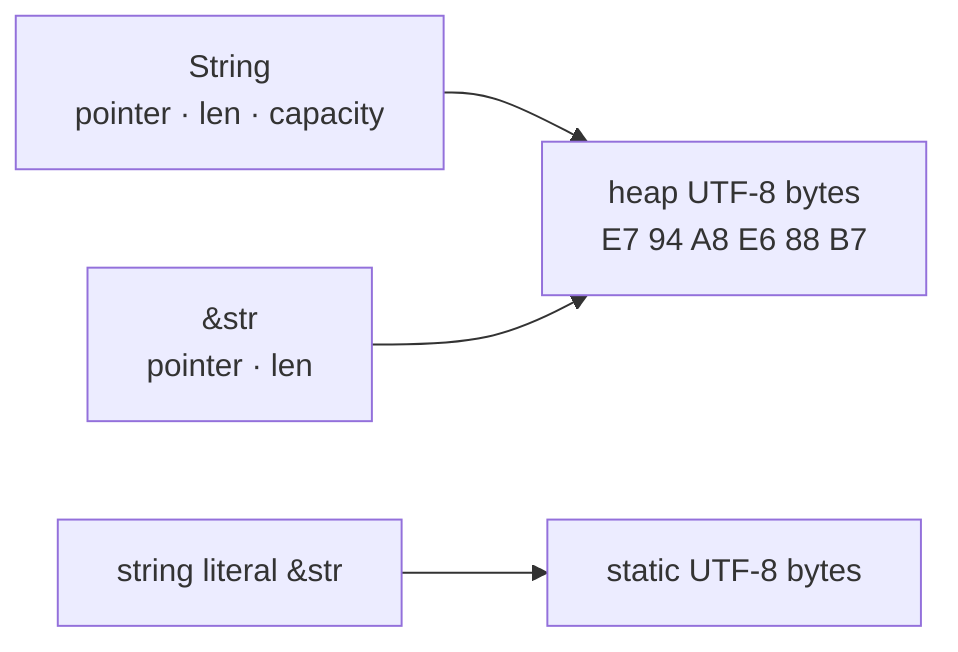

<TLDR>
  <TLDRCell label="what">
    `String` 拥有一段可增长的 UTF-8 文本，`str` 表示有效 UTF-8 字节组成的字符串切片，实际代码最常见的是借用形式 `&str`。
  </TLDRCell>
  <TLDRCell label="trap">
    `len()` 和范围索引都按字节计算。把字节数当字符数，或在 UTF-8 码点中间切片，会得到错误结果或触发 panic。
  </TLDRCell>
  <TLDRCell label="fix">
    只读参数优先接收 `&str`，需要持有或增长文本时才使用 `String`；按语义明确选择字节、Unicode 标量值或字素簇。
  </TLDRCell>
</TLDR>

## 是什么，为什么存在

Rust 的核心字符串类型是 `String` 和 `str`。`String` 拥有一段堆上的、可增长的 UTF-8 字节序列；`str` 是动态大小的<Term id="string-slice">字符串切片（string slice）</Term>类型，表示一段有效的 UTF-8 字节。因为裸 `str` 的大小要到运行时才能确定，所以通常通过 `&str`、`Box<str>` 或 `Arc<str>` 等指针使用它。

最常见的组合是拥有型 `String` 与借用型 `&str`。`String` 负责分配、增长和释放缓冲区，`&str` 只描述其中一段连续文本，不负责释放。这样的<Term id="borrowing">借用（borrowing）</Term>让函数读取调用方的文本，而不用先复制一份。

字符串字面量的类型也是 `&str`，但它通常借用程序二进制中的静态数据。由 `String` 取得的 `&str` 则可能指向堆缓冲区。存储位置不是字符串类型本身的定义，所有权与 UTF-8 不变量才是关键。

你会在函数参数、解析器、日志消息、协议字段和用户输入中遇到这些类型。选择哪一个取决于 API 是否需要保留输入、是否要修改长度，以及输入是否保证是 UTF-8，而不是取决于文本看起来像不像普通 ASCII。

| 形式 | 是否拥有字节 | 能否增长 | 常见用途 |
| --- | --- | --- | --- |
| `String` | 是 | 是 | 返回新文本、存入结构体、逐步构建内容 |
| `&str` | 否 | 否 | 只读参数、字符串字面量、借用子串 |
| `&mut str` | 否 | 否 | 在不改变字节长度的前提下就地修改 |
| `Box<str>` | 是 | 否 | 拥有固定长度文本，不再需要额外容量 |

`String` 与 `str` 都保证内容是有效 UTF-8。文件名、C 字符串和任意网络载荷未必满足这个条件，应分别考虑 `Path`／`OsStr`、`CStr` 或字节切片。强行做有损转换会改变数据，不能只为了让类型匹配而使用。

## 工作原理

### 所有权与借用视图

`String` 管理缓冲区的指针、字节长度和容量。把一个 `String` 赋给另一个变量时，默认发生<Term id="move-semantics">移动语义（move semantics）</Term>：缓冲区所有权转移，旧变量不再可用。只有显式调用 `clone()` 才会复制其中的字节。

从 `String` 借用 `&str` 不会复制文本。借用保存数据地址与字节长度，可以覆盖整个字符串，也可以只覆盖一个合法子区间。共享借用还在使用时，Rust 不允许可能使缓冲区重分配的可变操作，因此引用不会在 `push_str()` 之后悄悄悬空。



这张图描述的是概念关系，不是可依赖的外部 ABI。`String` 拥有堆缓冲区，`&str` 只是指向有效 UTF-8 区间的视图。借用的生命周期保证视图不会比它引用的数据活得更久。

### UTF-8 与三种计数

UTF-8 使用一到四个字节编码一个 Unicode 标量值。`str::len()` 返回字节数，`chars()` 迭代<Term id="unicode-scalar-value">Unicode 标量值（Unicode scalar value）</Term>，而用户眼中的一个字符可能是由多个标量值组成的<Term id="grapheme-cluster">字素簇（grapheme cluster）</Term>。这三种单位不能互换。

例如，`é` 可以是单个标量值 U+00E9，也可以由 `e` 与组合重音 U+0301 组成。两段文本看起来相同，字节和标量值数量却可能不同。Rust 标准库不自动做 Unicode 规范化，也不提供完整的字素簇分段。

范围切片使用字节偏移，并要求起点与终点都位于 UTF-8 字符边界。`&text[a..b]` 在边界不合法时会 panic；`text.get(a..b)` 会返回 `None`。`char_indices()` 同时给出合法字节偏移和对应标量值，适合把字符扫描结果交给后续切片操作。

### 分配与修改

`String::new()` 创建空字符串，第一次增长前通常不需要分配。`String::with_capacity(n)` 预留至少 `n` 个字节，适合已经知道大致输出大小的构建过程。容量是实现为后续增长保留的空间，不属于字符串内容，`len()` 永远只报告当前有效字节。

`push()` 追加一个 `char`，`push_str()` 追加一个 `&str`。`insert()`、`remove()`、`truncate()` 和 `replace_range()` 接收字节位置，其中涉及的位置必须是字符边界。安全 API 会维护 UTF-8 不变量，但不保证每个运行时位置都有效。

`String + &str` 会移动左侧 `String`，然后把右侧内容追加进去。它适合明确消费左值的一次拼接；如果之后还要使用所有输入，`format!()` 或显式构建新的 `String` 更清楚。循环构建内容时，复用一个缓冲区通常也更容易表达所有权。

## 示例

### 借用输入，返回拥有型结果

这个函数只在调用期间读取姓名，所以参数使用 `&str`。返回值需要在函数结束后继续存在，因此返回新建的 `String`。

<Depth level="quick">

```rust
fn greeting(name: &str) -> String {
    let mut message = String::with_capacity("Hello, ".len() + name.len());
    message.push_str("Hello, ");
    message.push_str(name);
    message
}

fn main() {
    let owned = String::from("Ferris");
    let first = greeting(&owned);
    let second = greeting("Rust");

    println!("{first}");
    println!("{second}");
    println!("still owned: {owned}");
}
```

```text
Hello, Ferris
Hello, Rust
still owned: Ferris
```

</Depth>

`greeting(&owned)` 通过解引用强制转换把 `&String` 当作 `&str` 使用，字符串字面量则直接是 `&str`。两次调用都只借用输入，所以最后仍能读取 `owned`。预分配按字节计算，正好对应最终要追加的两段 UTF-8 文本。

如果函数要把姓名存进返回的结构体，接收 `String` 或 `impl Into<String>` 可能更合适。参数类型应表达所有权契约，而不是一律追求最泛化的签名。

### 查看 UTF-8 边界

这个例子同时打印字节数、标量值数量和每个标量值的起始字节偏移。两个 `get()` 调用只差一个起点，却分别成功和失败。

```rust
fn main() {
    let text = "Aé中👋";

    println!("bytes: {}", text.len());
    println!("scalars: {}", text.chars().count());

    for (byte_offset, scalar) in text.char_indices() {
        println!("{byte_offset}: {scalar}");
    }

    println!("1..3: {:?}", text.get(1..3));
    println!("2..3: {:?}", text.get(2..3));

    let decomposed = "e\u{301}";
    println!(
        "decomposed bytes/scalars: {}/{}",
        decomposed.len(),
        decomposed.chars().count()
    );
}
```

```text
bytes: 10
scalars: 4
0: A
1: é
3: 中
6: 👋
1..3: Some("é")
2..3: None
decomposed bytes/scalars: 3/2
```

`é` 占据字节区间 `1..3`，所以该范围能产生 `&str`。偏移 `2` 落在它的编码内部，`get(2..3)` 因此返回 `None`。组合形式 `e\u{301}` 有两个标量值和三个字节，但界面可能把它显示为一个字素簇。

如果业务要求「最多 20 个用户可见字符」，`chars().take(20)` 仍不一定正确，因为它按标量值截断。此时需要明确采用 Unicode 字素簇分段规则，并决定是否先做规范化。

### 预估容量并在合法边界修改

路径构建器先计算所有部分和分隔符的总字节数，再复用一个缓冲区。后半段使用 `find()` 返回的匹配起点进行替换；成功匹配 `&str` 得到的位置一定落在字符边界上。

```rust
fn join_path(parts: &[&str]) -> String {
    let separators = parts.len().saturating_sub(1);
    let byte_len = parts.iter().map(|part| part.len()).sum::<usize>() + separators;
    let mut path = String::with_capacity(byte_len);

    for (index, part) in parts.iter().enumerate() {
        if index > 0 {
            path.push('/');
        }
        path.push_str(part);
    }

    path
}

fn main() {
    let path = join_path(&["用户", "42", "settings"]);
    println!("{path}");
    println!("bytes: {}", path.len());

    let mut status = String::from("状态: ready");
    let start = status.find("ready").expect("marker is present");
    status.replace_range(start.., "done");
    println!("{status}");
}
```

```text
用户/42/settings
bytes: 18
状态: done
```

容量计算使用 `len()` 是正确的，因为分配器关心字节，不关心显示字符数。`saturating_sub(1)` 让空切片的分隔符数量保持为零。若构建器的输入规模无法预估，直接从 `String::new()` 开始也正确，只是增长时可能需要重新分配。

这里的 `replace_range(start.., "done")` 改变了字节长度，因此只能作用于 `String`，不能作用于 `&mut str`。替换完成后，`String` 仍然保存有效 UTF-8。

### 从输入中返回借用字段

解析器不需要改写字段，也不需要让结果脱离原始记录，所以它直接返回指向输入的两个 `&str`。`split_once()` 与 `trim()` 都能产生借用视图，不会为字段创建新的 `String`。

```rust
fn parse_record(line: &str) -> Option<(&str, &str)> {
    let (key, value) = line.split_once('=')?;
    let key = key.trim();
    let value = value.trim();

    if key.is_empty() {
        return None;
    }

    Some((key, value))
}

fn main() {
    for line in ["color = blue", " retries=3 ", " = missing"] {
        match parse_record(line) {
            Some((key, value)) => println!("{key} -> {value}"),
            None => println!("invalid: {line:?}"),
        }
    }
}
```

```text
color -> blue
retries -> 3
invalid: " = missing"
```

返回类型中的两个引用由生命周期省略规则关联到唯一的输入引用。调用方持有字段期间，不能销毁或以冲突方式修改原始 `line`。若字段要进入比输入活得更久的配置对象，就应在该所有权边界调用 `to_owned()`。

这个实现只把缺少分隔符或空键视为无效，允许空值。真实解析器应在签名和测试中明确这些规则；`Option` 只能表示成功或失败，需要错误原因时应改用 `Result`。

## 陷阱

### 把字节数当作字符数

> [!PITFALL]
> `text.len()` 返回 UTF-8 字节数，不是 Unicode 标量值数量，更不是用户看到的字符数量。

**修复：** 先写清业务单位。协议长度、容量和磁盘大小通常按字节；码点处理可用 `chars()`；光标移动、删除「一个字符」和长度限制通常需要字素簇分段。不要把一种计数改名后冒充另一种。

### 用任意范围切片

> [!PITFALL]
> `&text[..limit]` 只有在 `limit` 恰好落在 UTF-8 字符边界时才安全，非 ASCII 输入可能让它 panic。

**修复：** 如果偏移来自不可信输入，使用 `get()` 处理 `None`。如果范围来自文本扫描，保留 `char_indices()`、`find()` 或匹配 API 给出的字节边界。按标量值或字素簇截断时，应先迭代目标单位，再转换成字节范围。

### 为只读 API 强制取得所有权

> [!PITFALL]
> 只读取文本的函数却接收 `String`，调用方会被迫移动、克隆或执行多余的 `to_string()`。

**修复：** 普通只读参数使用 `&str`。函数需要把文本存起来、交给其他所有者或返回独立值时再接收或创建 `String`。`impl AsRef<str>` 会增加泛型表面积，只有确实需要接受多种包装类型时才使用。

### 借用期间增长原字符串

> [!PITFALL]
> 从 `String` 取得切片后再追加内容，可能使底层缓冲区搬家；Rust 会在该切片后续仍被使用时拒绝这段代码。

**修复：** 调整操作顺序，让共享借用在修改前结束；或者先保存拥有型结果，再修改原字符串。不要用不安全指针绕过错误。编译器阻止的是可能悬空的视图，不是无意义的语法偏好。

### 把小写转换当作完整文本比较

> [!PITFALL]
> `to_lowercase()` 可能改变长度，也不等同于 Unicode 规范化、语言环境相关排序或安全的标识符比较。

**修复：** 先定义比较契约。ASCII 协议字段可使用 `eq_ignore_ascii_case()`；面向自然语言的搜索、排序和去重需要选定规范化、大小写折叠与区域规则。标准库不会替你决定这些产品语义。

## AI 时代

**生成代码在这里常犯的错**

模型常从允许字符串索引的语言迁移出 `text[0]`，这在 Rust 中不能编译；随后又可能把它「修复」为 `&text[..n]`，使非 ASCII 输入在运行时 panic。另一些生成代码把 `len()` 当字符数，在循环里反复调用 `chars().nth(i)` 形成二次扫描，或者用 `clone()` 与 `to_string()` 压住所有权错误，却没有说明谁应拥有文本。涉及用户名时，模型还常把 `to_lowercase()` 误当成规范化与字素处理的替代品。

**让 AI 检查**

- 标出每个字符串长度、索引和范围的单位，证明所有范围端点都是 UTF-8 字符边界。
- 为每个 `String` 分配、`clone()` 和 `to_string()` 说明所有权需求，并给出可借用 `&str` 时的签名。
- 用 ASCII、多字节标量值、组合字符和空字符串测试截断、计数与比较逻辑。

**审查清单**

- 确认接口区分借用输入、拥有型存储和非 UTF-8 数据，不做静默有损转换。
- 检查用户可见长度是否真的按字素簇定义，而不是误用字节或 `char` 数量。
- 查找循环中的重复扫描和临时 `String`，同时确认优化没有改变 Unicode 语义。

**提示词词汇**

使用准确术语：`owned String`（拥有型字符串）、`borrowed str`（借用的字符串切片）、`UTF-8 byte boundary`（UTF-8 字节边界）、`Unicode scalar value`（Unicode 标量值）、`grapheme cluster`（字素簇）、`normalization`（规范化）、`allocation`（分配）和 `move semantics`（移动语义）。要求 AI 写明「长度」的单位以及返回值的所有权；只说「安全处理 Unicode」不足以确定行为。

<Depth level="deep">

## 深入理解 String 的存储

### UTF-8 不变量

`String` 可以理解为带有 UTF-8 有效性不变量的字节向量。安全构造函数会验证外部字节，安全修改方法只接受不会破坏编码的输入，所以 `String::as_str()` 可以直接给出 `&str`。这个不变量使后续 API 无需在每次读取时重新验证整个缓冲区。

`String::from_utf8(Vec<u8>)` 在字节无效时返回错误，并把原字节保留在错误值中供调用方处理。`from_utf8_lossy()` 会用替换字符处理无效序列，返回 `Cow<str>`；名称中的 `lossy` 是数据契约，不是显示选项。只有调用方已经证明字节有效时，才可能考虑不安全的免检查构造。

安全 Rust 依赖这个不变量。通过不安全代码制造无效 `String`，再调用假定 UTF-8 有效的方法，会破坏这些方法的前置条件。省下一次验证之前，需要在同一边界提供可审查的有效性证明。

### 描述符与布局边界

从行为上看，`String` 记录数据位置、当前字节长度和可用容量，文本字节位于其拥有的缓冲区中。移动 `String` 通常只转移缓冲区的所有权信息，不逐字节复制内容；规范保证的是移动后的所有权行为，而不是某个稳定的 C ABI 字段顺序。

`&str` 是指向动态大小 `str` 的胖指针，携带数据地址与字节长度。它没有容量，因为借用不能增长所指区间。切出子串会产生新的地址与长度组合，但仍借用原来的存储。

不要把调试时看到的地址或 `size_of` 结果写成跨目标承诺。指针宽度、布局优化和 ABI 属于目标与实现边界。需要跨 FFI 传递字符串时，应使用双方明确约定的表示与生命周期，而不是直接暴露 `String`。

### 容量不是长度

容量表示缓冲区无需重新分配即可容纳的字节数上限。`reserve(additional)` 保证为当前长度之外的至少 `additional` 个字节留出空间，实际容量可以更大。`with_capacity()` 同样只承诺下界，因此测试不应断言精确增长倍率。

预分配适合输出大小有可靠上界或容易求和的路径。猜一个很大的容量可能长期保留闲置内存，频繁调用 `shrink_to_fit()` 也可能让之后的增长重新分配。没有测量时，只描述分配行为，不声称固定的速度倍数。

`try_reserve()` 让无法满足的容量请求通过 `Result` 风格的错误返回，而不是把分配失败只留给默认处理路径。处理外部长度字段时，还要先检查求和和乘法是否溢出；容量 API 不能修复上游的整数错误。

### 空字符串也是正常输入

空 `String` 的长度与容量可以都是零，空 `&str` 仍是有效切片。许多边界错误来自默认输入至少含一个字符，例如直接调用 `chars().next().unwrap()`，而不是来自字符串类型本身。

API 应明确空文本是有效值、缺失值还是错误。若业务需要区分「没有字段」和「字段存在但为空」，应使用 `Option<&str>` 或领域类型表达，不要用空字符串同时承担两种状态。

## 深入理解 Unicode 边界与成本

### 字节、标量值与字素簇

字节是存储和 I/O 单位。Rust 的 `char` 表示 Unicode 标量值，不表示 UTF-16 码元，也不保证对应一个屏幕字符。字素簇由 Unicode 文本分段规则定义，更接近用户在光标移动或退格时感知的单位。

即使按字素簇计数，也无法直接推出终端列宽或排版宽度。组合标记、全角字符、emoji 序列、字体和渲染环境都会影响显示。文本框长度限制、数据库字段上限和终端对齐应分别定义，不应共用一个含糊的 `character_count`。

规范化解决的是规范等价序列的表示问题，分段解决的是边界问题，大小写折叠解决的是不区分大小写的匹配问题。它们是不同操作，执行顺序也可能影响结果。业务若需要其中任何一种，应把规则、Unicode 版本和测试样例写进契约。

### 索引成本

`len()` 读取已保存的字节长度，是常数时间操作。`bytes()` 和 `chars()` 从头到尾迭代时与输入字节数线性相关；`chars().count()` 必须扫描编码，不能从 `len()` 推出。查找第 `n` 个标量值也要从某个已知边界开始解码。

因此，在 `0..text.chars().count()` 循环里反复调用 `text.chars().nth(i)` 会重复从头扫描，长输入下可能呈二次增长。单次遍历可直接使用 `chars()`；同时需要字节位置时用 `char_indices()`；需要频繁随机访问时，应先选择并构建符合业务单位的索引结构。

字节搜索不一定是错误。查找 ASCII 分隔符、验证协议前缀或计算缓冲区大小时，按字节通常正合适。算法单位必须与业务语义一致，而且只能在合法边界上重新解释为 `str`。

## 深入理解 API 边界

### 何时返回借用

返回 `&str` 表示结果是输入或其他现有存储的一部分，因此返回生命周期必须与来源相连。`strip_prefix()`、`split_once()` 和 `trim()` 都能返回借用视图，因为它们不需要创造新字节。这样的 API 没有结果分配，但调用方不能让结果活得比来源更久。

大小写转换、替换或格式化通常会创造新字节，所以自然返回 `String`。试图返回对函数内部临时 `String` 的引用不会延长临时值寿命，生命周期标注也无法做到这一点。函数创造并交付文本时，就应返回拥有型结果。

结构体字段使用 `String` 最直接，因为结构体独立拥有数据。借用字段 `&'a str` 适合明确的视图类型，但它把结构体寿命绑定到外部存储。`Cow<'a, str>` 可以表达「未修改时借用，修改后拥有」，代价是 API 多了一个需要调用方理解的状态。

常见转换的成本与失败方式并不相同：

| 转换 | 结果 | 分配或检查 |
| --- | --- | --- |
| `String::from(text)` | `String` | 复制 `text` 的 UTF-8 字节并分配 |
| `owned.as_str()` | `&str` | 借用，不分配 |
| `String::from_utf8(bytes)` | `Result<String, FromUtf8Error>` | 复用向量缓冲区并验证 UTF-8 |
| `str::from_utf8(bytes)` | `Result<&str, Utf8Error>` | 借用字节并验证 UTF-8 |
| `String::from_utf8_lossy(bytes)` | `Cow<str>` | 有效时可借用，无效时为替换内容分配 |

把转换放在数据进入系统的边界，内部代码就能依赖 `String`／`str` 的 UTF-8 不变量。若内部仍需要原始字节与解码文本两种形式，应分别命名并保存，不要来回做有损转换。

### UTF-8 之外

操作系统路径不保证可转成 `str`。路径逻辑应保留 `Path`／`OsStr`，只有在显示或协议边界明确要求 Unicode 时才调用 `to_str()` 或带有明确损失语义的转换。文件名无法解码不等于文件不存在。

C 字符串以空字节终止，并且内部不能含有空字节；它的编码也不自动等于 UTF-8。与 C 交互时，`CString`／`CStr` 解决终止符和指针表示问题，`to_str()` 才负责验证 UTF-8。裸指针的有效性与生命周期仍属于 FFI 安全契约。

任意二进制载荷使用 `Vec<u8>` 或 `&[u8]`。只有在边界验证成功后才转换成 `String` 或 `&str`。这样，「解码失败」会保持为可处理的输入错误，而不会被隐藏成替换字符或更晚出现的字符串异常。

</Depth>

<Checkpoint id="rust/strings" />

## 延伸阅读

- [Rust 程序设计语言：用字符串存储 UTF-8 编码的文本](https://doc.rust-lang.org/1.98.0/book/ch08-02-strings.html)
- [Rust 标准库：`String`](https://doc.rust-lang.org/1.98.0/std/string/struct.String.html)
- [Rust 标准库：`str`](https://doc.rust-lang.org/1.98.0/std/primitive.str.html)
- [Rust 参考：指针与引用布局](https://doc.rust-lang.org/1.98.0/reference/type-layout.html#pointers-and-references)
- [Unicode 标准附录 #29：文本分段](https://www.unicode.org/reports/tr29/)
