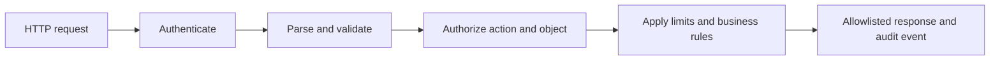

<TLDR>
  <TLDRCell label="what">
    API security treats every request as a trust-boundary crossing and verifies its caller, action, target object, input properties, and resource budget.
  </TLDRCell>
  <TLDRCell label="trap">
    A valid token proves only that a caller was authenticated. It does not let that caller read any object ID in a request or submit arbitrary fields.
  </TLDRCell>
  <TLDRCell label="fix">
    Deny access by default, authorize objects where the business operation executes, and set separate boundaries for inputs, outputs, request rates, and logs.
  </TLDRCell>
</TLDR>

## What it is and why it exists

API security protects the trust boundary of a machine-callable interface. A client directly chooses paths, methods, object identifiers, properties, and values, so the server must decide who is asking, what they want to do, which object is involved, and whether the operation satisfies business rules. Hiding a button in a web page does not stop a client from constructing the corresponding HTTP request.

Authentication establishes a caller's identity; authorization decides whether that identity may perform this specific operation. You need both. A correctly signed, unexpired access token can establish a principal, but it cannot answer whether that principal may read order `order-42` or change its `status` property.

The first item in the OWASP API Security Top 10 is <Term id="broken-object-level-authorization">Broken Object Level Authorization (BOLA)</Term>. It appears when an endpoint accepts a client-supplied object ID but does not check the current principal's permission for that object and action. An attacker can then replace the ID to read, change, or delete somebody else's data. An unpredictable UUID makes guessing harder but does not replace authorization.

API security also covers property-level authorization, function-level authorization, input validation, resource-consumption controls, secure configuration, endpoint inventory, and validation of third-party responses. Together, these controls apply <Term id="least-privilege">least privilege</Term>: a request gets only the data and capability needed for the named operation, not broad access because its caller has logged in.

The same problems appear in public APIs, mobile backends, JSON interfaces for single-page applications, microservices, and webhook receivers. The caller may be a browser, service account, or partner, but the server cannot treat client state as trusted fact.

## How it works

A secure request path has several independent gates. Each gate answers one question and passes a structured result to the next layer; after any gate fails, no business side effect should occur.



### The request pipeline

1. The transport and routing layer accepts only published hostnames, TLS configurations, HTTP methods, versions, and media types. Retired versions and debug routes do not remain reachable in production.
2. The authentication layer verifies credential integrity, issuer, audience, expiration, and token type, then produces a normalized principal. Business code does not consume an unverified token payload directly.
3. The parsing and validation layer limits body size before invoking the parser for the declared media type. It checks types, lengths, ranges, and allowed fields and rejects unknown properties.
4. The authorization layer decides from the principal, action, object, and context. Its policy uses <Term id="deny-by-default">deny by default</Term>, granting access only when an allow rule matches explicitly.
5. The business layer checks invariants such as inventory, state transitions, and tenant boundaries while enforcing budgets for request rate, concurrency, page size, and downstream work.
6. The response layer serializes only public fields. Audit events record the principal, action, object, result, and correlation ID, but not raw tokens, passwords, or entire request bodies.

Order affects security. Body size and structure should be rejected before expensive storage or downstream calls; object authorization must be bound to the operation that actually reads or writes, rather than relying only on the path observed at a gateway. Layers can confirm the same fact more than once, but the final execution point must still prove that its authorization decision applies to the current object and action.

### Three authorization levels

Function-level authorization decides whether a principal may call a class of operation, such as a tenant export available only to administrators. Object-level authorization then asks whether the principal may apply that operation to one specific order. Property-level authorization restricts which fields may be read or changed: a customer may edit a delivery address but cannot set `paymentStatus` to `paid`.

A role is usually only one policy input. Tenant membership, ownership, order state, authentication strength, and request origin may also matter. Reducing every user endpoint to `role === 'user'` loses object relationships and action semantics.

Failed authentication normally produces `401`, with challenge information required by the authentication scheme. A recognized principal without sufficient permission can receive `403`. If disclosing that an object exists would itself leak information, RFC 9110 allows a server to hide the forbidden resource behind `404`; apply one policy consistently across a resource family.

### Failure semantics

Failures a client can correct need a stable `4xx` contract. A response can identify an invalid public field, but it should not include parser stacks, database names, or policy internals. The distinction between missing and forbidden objects must also remain consistent within one resource family.

If an authentication service, policy store, or limiter store is unavailable, code follows a predefined failure policy. A high-risk write normally cannot proceed because its check timed out. Any public reads allowed to degrade should be listed and monitored separately instead of falling through a general exception handler.

Every denial should happen before a business side effect. Retriable writes also need a separate idempotency design: “denial has no effect” and “repeating a successful request does not charge twice” are different guarantees.

## Examples

### Put object relationships in the authorization decision

This example gives the principal, action, and object to a policy function. The policy returns `false` unless an allow rule matches explicitly, and the read operation then uses a consistent `404` so that it does not reveal whether a cross-tenant order exists.

<Depth level="quick">

```javascript run title="authorize_order.js"
const orders = [
  { id: 'o-100', tenantId: 't-1', ownerId: 'u-7', total: 58, cost: 31 },
  { id: 'o-200', tenantId: 't-2', ownerId: 'u-9', total: 74, cost: 40 },
];

function mayReadOrder(principal, order) {
  if (principal.tenantId !== order.tenantId) return false;
  return order.ownerId === principal.subject ||
    principal.permissions.includes('orders:read:any');
}

function readOrder(principal, orderId) {
  const order = orders.find((candidate) => candidate.id === orderId);
  if (!order || !mayReadOrder(principal, order)) {
    return { status: 404, body: { error: 'not_found' } };
  }

  // An output allowlist keeps internal cost private.
  return {
    status: 200,
    body: { id: order.id, ownerId: order.ownerId, total: order.total },
  };
}

const owner = { subject: 'u-7', tenantId: 't-1', permissions: [] };
const support = {
  subject: 'u-8', tenantId: 't-1', permissions: ['orders:read:any'],
};

console.log(JSON.stringify(readOrder(owner, 'o-100')));
console.log(JSON.stringify(readOrder(owner, 'o-200')));
console.log(JSON.stringify(readOrder(support, 'o-100')));
```

```text
{"status":200,"body":{"id":"o-100","ownerId":"u-7","total":58}}
{"status":404,"body":{"error":"not_found"}}
{"status":200,"body":{"id":"o-100","ownerId":"u-7","total":58}}
```

</Depth>

The first request is allowed through its owner relationship. The second names another tenant and receives the same result as a missing object even though its ID is valid. The third passes only because its principal has the explicit `orders:read:any` permission inside the same tenant.

The policy is a pure function, so a matrix of principals, actions, and objects can test it easily. A real service should still carry equivalent constraints into its database query or transaction so that object state cannot change between a check and a write. Explicit output mapping also prevents a new database-model property from silently expanding the API response.

### Make the input contract reject extra fields

Input validation is not a one-time attempt to “sanitize” every string. The server needs an exact contract for each operation and must reject wrong types, out-of-range values, and undeclared properties. This example limits raw bytes before parsing JSON.

```javascript run title="validate_request.js"
function parseCreateOrder(raw) {
  if (Buffer.byteLength(raw, 'utf8') > 120) {
    return { ok: false, errors: ['body_too_large'] };
  }

  let value;
  try {
    value = JSON.parse(raw);
  } catch {
    return { ok: false, errors: ['invalid_json'] };
  }

  if (!value || Array.isArray(value) || typeof value !== 'object') {
    return { ok: false, errors: ['object_required'] };
  }

  const allowed = new Set(['productId', 'quantity']);
  const errors = Object.keys(value)
    .filter((key) => !allowed.has(key))
    .map((key) => `unknown:${key}`);

  if (!/^p-[0-9]{3}$/.test(value.productId)) {
    errors.push('invalid:productId');
  }
  if (!Number.isInteger(value.quantity) || value.quantity < 1 || value.quantity > 50) {
    errors.push('invalid:quantity');
  }

  if (errors.length > 0) return { ok: false, errors };
  return { ok: true, value: { productId: value.productId, quantity: value.quantity } };
}

console.log(JSON.stringify(parseCreateOrder('{"productId":"p-104","quantity":2}')));
console.log(JSON.stringify(parseCreateOrder('{"productId":"p-104","quantity":2,"role":"admin"}')));
console.log(JSON.stringify(parseCreateOrder('{"productId":"p-9","quantity":0}')));
```

```text
{"ok":true,"value":{"productId":"p-104","quantity":2}}
{"ok":false,"errors":["unknown:role"]}
{"ok":false,"errors":["invalid:productId","invalid:quantity"]}
```

The allowlist stops generated code from passing an extra property such as `role` into persistence. Type and range checks happen before the domain object is created, so later code receives only a normalized structure. Production code normally uses a maintained schema validator, but rejecting unknown fields and limiting the raw body still require explicit configuration.

Validation proves that input has the contracted shape, not that the operation is authorized. Even with a well-formed `productId`, the business layer must confirm that the product belongs to the current tenant, can be sold, and may be ordered by this principal.

### Budget requests by stable identity

<Term id="rate-limiting">Rate limiting</Term> controls how much request budget one identity may consume during a time window. This single-process example injects time so that window resets can be tested deterministically.

```javascript run title="rate_limit.js"
class FixedWindowLimiter {
  constructor(limit, windowMs) {
    this.limit = limit;
    this.windowMs = windowMs;
    this.buckets = new Map();
  }

  take(key, now) {
    let bucket = this.buckets.get(key);
    if (!bucket || now >= bucket.resetAt) {
      bucket = { used: 0, resetAt: now + this.windowMs };
      this.buckets.set(key, bucket);
    }

    if (bucket.used >= this.limit) {
      return {
        allowed: false,
        remaining: 0,
        retryAfter: Math.ceil((bucket.resetAt - now) / 1000),
      };
    }

    bucket.used += 1;
    return { allowed: true, remaining: this.limit - bucket.used, retryAfter: 0 };
  }
}

const limiter = new FixedWindowLimiter(2, 1000);
for (const [subject, now] of [
  ['u-7', 0], ['u-7', 100], ['u-7', 200], ['u-9', 200], ['u-7', 1000],
]) {
  console.log(subject, JSON.stringify(limiter.take(subject, now)));
}
```

```text
u-7 {"allowed":true,"remaining":1,"retryAfter":0}
u-7 {"allowed":true,"remaining":0,"retryAfter":0}
u-7 {"allowed":false,"remaining":0,"retryAfter":1}
u-9 {"allowed":true,"remaining":1,"retryAfter":0}
u-7 {"allowed":true,"remaining":1,"retryAfter":0}
```

The two principals have separate budgets, and the count resets after the window. A real multi-instance service needs an atomic update in shared storage; otherwise, every process grants a full quota. Anonymous endpoints may need a combination of source address after trusted-proxy handling, account identifiers, and device signals. They must not trust a client-supplied `X-Forwarded-For` directly.

Request count is only one resource dimension. Query page size, upload bytes, concurrent jobs, execution time, and third-party cost need separate limits. Rate limiting can slow abuse, but it cannot authorize an operation that should be forbidden.

### Log decisions, not credentials

A security log should answer which principal attempted which action, what the policy decided, and how to correlate the request. It does not need the raw Authorization header or an entire domain object. This function accepts only selected fields, so its caller cannot casually serialize the whole request into the event.

```javascript run title="audit_event.js"
function makeAuthorizationEvent({
  timestamp, principal, action, resourceId, decision, requestId,
}) {
  const allowedDecisions = new Set(['allow', 'deny']);
  if (!allowedDecisions.has(decision)) {
    throw new Error('invalid decision');
  }

  return {
    timestamp,
    event: 'authorization.decision',
    subject: principal.subject,
    tenantId: principal.tenantId,
    action,
    resourceId,
    decision,
    requestId,
  };
}

const request = {
  headers: { authorization: 'Bearer secret-token' },
  body: { status: 'cancelled', cardNumber: '4111111111111111' },
  principal: { subject: 'u-7', tenantId: 't-1' },
  requestId: 'req-8',
};

const event = makeAuthorizationEvent({
  timestamp: '2026-09-04T10:00:00.000Z',
  principal: request.principal,
  action: 'orders:update',
  resourceId: 'o-100',
  decision: 'deny',
  requestId: request.requestId,
});

console.log(JSON.stringify(event));
console.log('contains credentials:', JSON.stringify(event).includes('secret-token'));
```

```text
{"timestamp":"2026-09-04T10:00:00.000Z","event":"authorization.decision","subject":"u-7","tenantId":"t-1","action":"orders:update","resourceId":"o-100","decision":"deny","requestId":"req-8"}
contains credentials: false
```

An explicit event schema improves both privacy and queryability. Field names and meanings stay stable, so alert rules do not have to parse arbitrary request objects. The trusted boundary supplies the time and request ID; a client cannot override them.

This output contains neither the token nor the card number, but a real system still classifies every audit-event field. Free-text reasons are especially likely to absorb request content. Prefer controlled reason codes and keep the small amount of necessary diagnostic context in a restricted channel.

Audit storage also needs separate access control, a retention period, and tamper protection. An application log is not a reason to keep sensitive data indefinitely.

## Pitfalls

> [!PITFALL]
> Middleware validates an access token, so the handler treats every logged-in principal as authorized for the object named in the request.

**Fix:** check the principal, action, object, and tenant in the service that performs the business operation. Write negative tests across users, tenants, and roles for every client-controlled object ID. Random IDs do not replace those checks.

> [!PITFALL]
> Code loads an object by the client-supplied ID and then uses an easy-to-miss owner condition; batch operations and new endpoints fail to reuse it.

**Fix:** put tenant and visibility constraints into the query or a single policy entry point, and deny by default. A write must confirm mutable state again inside its transaction so that a race cannot separate authorization from commit.

> [!PITFALL]
> `Object.assign(entity, request.body)` or object spread copies client fields into a domain object, while the response returns the complete database record.

**Fix:** use separate input and output allowlists. An input DTO expresses only properties the caller may change; a response DTO contains only fields visible to this principal and context. Do not rely on a denylist that removes a few known secrets.

> [!PITFALL]
> Each process keeps an in-memory counter or keys limits directly from an unverified forwarding header, so attackers can rotate values and multi-instance deployments grant duplicate quotas.

**Fix:** choose stable dimensions such as principal, tenant, credential, and source address from a trusted proxy configuration according to endpoint risk. Update multi-instance counts atomically in shared storage. Decide which high-risk operations close and which low-risk reads degrade when that storage is unavailable.

> [!PITFALL]
> Error responses and logs contain stacks, access tokens, cookies, password fields, or complete domain objects, turning a diagnostic channel into another data outlet.

**Fix:** return stable public error codes and a correlation ID, and build audit events at the logging boundary from an explicit schema. Record the authorization result and policy version, but remove or irreversibly transform credentials and personal data. Test nested fields for leaks.

> [!PITFALL]
> A new version has the right controls, but an old version, shadow route, or debug endpoint still reaches the same data from the public network.

**Fix:** maintain an API inventory from gateway configuration, deployment manifests, and observed traffic, with an owner, data classification, and retirement date for every version. After deleting a route, verify that gateways, caches, and old hostnames can no longer reach it.

## In the AI era

**What generated code gets wrong here**

Models often generate `findById(req.params.id)` and mistake authentication middleware for object authorization. They also spread request bodies into models, exposing `role`, `tenantId`, or state fields to mass assignment. Another common failure is decoding a JWT payload without verifying its signature and claims, or treating a CORS policy as server-side access control.

Resource controls get plausible-looking but broken implementations too. Generated code creates an in-memory limiter per process, trusts any `X-Forwarded-For`, and limits request count while leaving page size and concurrent jobs unbounded. Logging helpers may serialize the whole request, including its Authorization header and nested tokens.

**Ask your AI to check**

- List every client-controlled object ID, action, and property, and trace each one to authorization evidence at the final database read or write.
- Generate a negative test matrix across principal × tenant × object owner × HTTP method, with the expected `401`, `403`, or `404` for every case.
- Check independent budgets for bodies, queries, batch operations, and downstream calls, including the atomic counting method in a multi-instance deployment.

**Review checklist**

- After credential validation, construct a minimal principal and keep unverified claims or client-supplied roles out of the policy layer.
- Deny object and property access by default, and test that retired versions and alternate routes pass through the same controls.
- Apply field allowlists to errors, responses, and logs, then test with realistic nested payloads for secret and personal-data leaks.

**Prompt vocabulary**

Use the exact terms `authentication`, `authorization`, `principal`, `deny by default`, `least privilege`, `object-level authorization`, `property-level authorization`, `mass assignment`, `rate limiting`, and `request budget`. Ask for policy inputs, enforcement points, and negative tests instead of a vague request to “add security checks.”

<Depth level="deep">

## Make authorization a data constraint

“Fetch the object, then check whether it belongs to the current user” is easy to omit from batch endpoints, exports, or a new write path. A stronger read pattern carries tenant and visibility constraints into the data query so that it returns only objects the principal may read. No result produces one `404`, and the service never first materializes cross-boundary data in an application object.

Query constraints cannot express every policy. A refund may depend on order state, amount, authentication strength, and separation of duties, so it still needs an explicit policy function or domain service. The important property is that authorization stays bound to the current operation and that mutable preconditions are checked inside the same transaction or atomic conditional update that commits the change.

Caches also need authorization context. A key containing only an object ID can serve one tenant's representation to another tenant; a cached `allow` can survive a role or ownership revocation. The cache key, lifetime, and invalidation events must reflect the data on which the policy depends.

## Resource limits are state machines

Fixed windows, sliding windows, and token buckets all maintain state describing how much budget a key can still consume. The algorithm matters less than a clear state scope: whether the key denotes a user, tenant, API key, or source network determines whether an attacker can evade the limit and whether normal callers crowd each other out.

A distributed implementation must read, update, and set expiration atomically. Splitting `GET` from `SET`, or incrementing only after a successful response, leaves room for concurrent requests to exceed the budget. Failure policy also depends on operation risk; authentication attempts and expensive exports usually cannot become unlimited when rate-limit storage fails.

A `429` response tells the client that rate control rejected its request, and the service should provide retry guidance when applicable. The possibility of retries does not remove the need for idempotency. Limits and idempotency keys solve different problems for operations with side effects such as payments, invitations, and job creation.

## Test the denied paths

The useful security test is not another proof that an owner can read their own object. It systematically changes every dimension an attacker controls. At minimum, cover missing or forged credentials, objects owned by another user or tenant, restricted HTTP methods, extra properties, duplicate parameters, oversized collections, and retired API versions.

| Scenario | Expected boundary | Core assertion |
| --- | --- | --- |
| No valid credentials | Authentication | No principal is created and no business query executes |
| Valid principal reads another owner's object | Object authorization | A consistent denial returns without object fields |
| Ordinary principal calls an admin action | Function authorization | A path or HTTP method change cannot bypass policy |
| Request includes an extra field such as `role` | Property authorization | The request is rejected and the field is not silently stored |
| Request exceeds its cost budget | Resource control | Work stops before an expensive side effect |

Every negative test should also assert the absence of side effects. Checking only the status code misses ordering bugs in which a database write occurs before a handler returns `403`. An audit event should identify the policy that denied the request without containing secret properties from the protected object.

</Depth>

<Checkpoint id="security/api-security" />

## Further reading

- [OWASP API Security Top 10 (2023)](https://owasp.org/API-Security/editions/2023/en/0x00-header/)
- [OWASP Authorization Cheat Sheet](https://cheatsheetseries.owasp.org/cheatsheets/Authorization_Cheat_Sheet.html)
- [OWASP REST Security Cheat Sheet](https://cheatsheetseries.owasp.org/cheatsheets/REST_Security_Cheat_Sheet.html)
- [RFC 9110: HTTP Semantics](https://www.rfc-editor.org/rfc/rfc9110.html)
