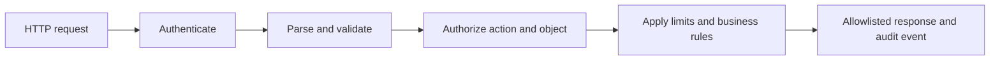

<TLDR>
  <TLDRCell label="what">
    API 安全把每个请求当作一次跨越信任边界的操作，并验证调用方、动作、目标对象、输入属性和资源预算。
  </TLDRCell>
  <TLDRCell label="trap">
    有效令牌只能证明某个身份通过了认证，并不表示该身份可以读取请求中的任意对象 ID，或提交任意字段。
  </TLDRCell>
  <TLDRCell label="fix">
    默认拒绝访问，在执行业务操作的位置做对象级授权，并对输入、输出、请求频率和日志分别设置明确边界。
  </TLDRCell>
</TLDR>

## 是什么，为什么存在

API 安全保护的是机器可调用接口的信任边界。客户端可以直接选择路径、方法、对象标识、属性和值，因此服务端必须判断谁在请求、要做什么、作用于哪个对象，以及这次操作是否符合业务规则。网页隐藏了某个按钮，并不会阻止客户端自行构造对应的 HTTP 请求。

认证（authentication）建立调用方身份，授权（authorization）判断该身份能否执行这项具体操作。两者缺一不可。签名有效且尚未过期的访问令牌可以建立主体，但它不能自动回答「这个主体能否读取订单 `order-42`」或「能否修改订单的 `status` 字段」。

OWASP API Security Top 10 的首项是<Term id="broken-object-level-authorization">对象级授权失效（Broken Object Level Authorization，BOLA）</Term>。当端点接受客户端提供的对象 ID，却没有检查当前主体对该对象及动作的权限时，攻击者只需替换 ID，就可能读取、修改或删除他人的数据。不可预测的 UUID 只能增加猜测难度，不能代替授权。

API 安全还包括属性级授权、功能级授权、输入验证、资源消耗控制、安全配置、接口清单和第三方响应验证。这些控制共同落实<Term id="least-privilege">最小权限原则（least privilege）</Term>：一次请求只获得完成指定操作所需的数据与能力，不因调用方已经登录而扩大权限。

你会在公开 API、移动应用后端、单页应用的 JSON 接口、微服务和 Webhook 接收器中遇到同一组问题。调用方可能是浏览器、服务账号或合作伙伴，但服务端都不能把客户端状态当作可信事实。

## 工作原理

一条安全的请求路径由多个独立关口组成。每个关口只回答一个问题，并把结构化结果交给下一层；任何关口失败，都不得继续产生业务副作用。



### 请求处理链

1. 传输与路由层只接受已发布的主机名、TLS 配置、HTTP 方法、版本和媒体类型。停用的版本与调试路由不应继续留在生产环境中。
2. 认证层验证凭据的完整性、签发方、受众、有效期和令牌类型，再产生规范化主体。业务代码不应直接使用尚未验证的令牌载荷。
3. 解析与验证层先限制请求体大小，再使用匹配媒体类型的解析器。它检查类型、长度、范围和允许字段，并拒绝未知属性。
4. 授权层使用主体、动作、对象和上下文做决定。规则采用<Term id="deny-by-default">默认拒绝（deny by default）</Term>，只有明确匹配允许策略时才放行。
5. 业务层检查库存、状态转换和租户边界等不变量，同时执行请求频率、并发数、分页大小和下游调用预算。
6. 响应层只序列化允许公开的字段。审计事件记录主体、动作、对象、结果和关联 ID，但不记录原始令牌、密码或完整请求体。

顺序会影响安全性。请求体应在昂贵的数据库或下游调用前完成大小与结构检查；对象级授权则必须绑定到真正执行读写的操作，不能只依赖网关中看到的路径。多层控制可以重复确认同一事实，但最终执行点仍要能证明授权决定适用于当前对象和动作。

### 授权的三个粒度

功能级授权决定主体能否调用某类操作，例如普通用户不能调用租户导出接口。对象级授权进一步判断主体能否对特定订单执行该操作。属性级授权限制允许读取或修改的字段，例如客户可以改配送地址，却不能自行把 `paymentStatus` 改成 `paid`。

角色通常只是策略输入之一。租户、对象所有者、订单状态、认证强度和请求来源也可能参与决定。把所有用户端点概括成 `role === 'user'`，会丢失对象关系和动作语义。

认证失败通常返回 `401`，并按所用认证方案提供挑战信息。已识别主体但权限不足时可返回 `403`。如果公开对象是否存在本身会泄露信息，RFC 9110 允许服务端以 `404` 隐藏被禁止资源的存在；同一资源族应采用一致策略。

### 失败语义

客户端能够修正的失败应使用稳定的 `4xx` 契约。响应可以说明哪个公开字段不合法，却不应返回解析器堆栈、数据库名称或策略内部细节。相同资源族对不存在与无权访问的区分也要保持一致。

认证服务、策略存储或限流存储不可用时，代码必须执行预先定义的失败策略。高风险写入通常不能因为检查服务超时就放行；若某些公开读取允许降级，也应单独列出并监控，而不是在通用异常处理器中默认继续。

所有拒绝都应发生在业务副作用之前。对可能重试的写操作还要另行设计幂等性，因为「拒绝没有副作用」与「成功请求重复发送不会重复扣款」是两项不同保证。

## 示例

### 把对象关系放进授权决定

下面的示例把主体、动作和对象一起交给策略函数。策略未明确允许时返回 `false`，读取操作随后使用一致的 `404`，避免暴露跨租户订单是否存在。

<Depth level="quick">

```javascript run title="authorize_order.js"
const orders = [
  { id: 'o-100', tenantId: 't-1', ownerId: 'u-7', total: 58, cost: 31 },
  { id: 'o-200', tenantId: 't-2', ownerId: 'u-9', total: 74, cost: 40 },
];

function mayReadOrder(principal, order) {
  if (principal.tenantId !== order.tenantId) return false;
  return order.ownerId === principal.subject ||
    principal.permissions.includes('orders:read:any');
}

function readOrder(principal, orderId) {
  const order = orders.find((candidate) => candidate.id === orderId);
  if (!order || !mayReadOrder(principal, order)) {
    return { status: 404, body: { error: 'not_found' } };
  }

  // 输出允许列表不会暴露内部成本。
  return {
    status: 200,
    body: { id: order.id, ownerId: order.ownerId, total: order.total },
  };
}

const owner = { subject: 'u-7', tenantId: 't-1', permissions: [] };
const support = {
  subject: 'u-8', tenantId: 't-1', permissions: ['orders:read:any'],
};

console.log(JSON.stringify(readOrder(owner, 'o-100')));
console.log(JSON.stringify(readOrder(owner, 'o-200')));
console.log(JSON.stringify(readOrder(support, 'o-100')));
```

```text
{"status":200,"body":{"id":"o-100","ownerId":"u-7","total":58}}
{"status":404,"body":{"error":"not_found"}}
{"status":200,"body":{"id":"o-100","ownerId":"u-7","total":58}}
```

</Depth>

第一项请求通过所有者关系获得访问权。第二项请求指向另一个租户，即使 ID 有效也返回与不存在对象相同的结果。第三项请求只有在租户相同且主体拥有明确的 `orders:read:any` 权限时才通过。

示例中的策略是纯函数，因此容易用主体、动作和对象矩阵测试。实际服务仍应把同样的约束放进数据库查询或事务，避免读取与写入之间对象状态发生变化。输出使用显式字段映射，不会因为数据库模型新增属性就自动扩大 API 响应。

### 让输入契约拒绝多余字段

输入验证不是把字符串统一「清理」一次。服务端需要为每个操作定义准确契约，并拒绝类型错误、范围越界和未声明属性。这里先限制原始字节数，再解析 JSON。

```javascript run title="validate_request.js"
function parseCreateOrder(raw) {
  if (Buffer.byteLength(raw, 'utf8') > 120) {
    return { ok: false, errors: ['body_too_large'] };
  }

  let value;
  try {
    value = JSON.parse(raw);
  } catch {
    return { ok: false, errors: ['invalid_json'] };
  }

  if (!value || Array.isArray(value) || typeof value !== 'object') {
    return { ok: false, errors: ['object_required'] };
  }

  const allowed = new Set(['productId', 'quantity']);
  const errors = Object.keys(value)
    .filter((key) => !allowed.has(key))
    .map((key) => `unknown:${key}`);

  if (!/^p-[0-9]{3}$/.test(value.productId)) {
    errors.push('invalid:productId');
  }
  if (!Number.isInteger(value.quantity) || value.quantity < 1 || value.quantity > 50) {
    errors.push('invalid:quantity');
  }

  if (errors.length > 0) return { ok: false, errors };
  return { ok: true, value: { productId: value.productId, quantity: value.quantity } };
}

console.log(JSON.stringify(parseCreateOrder('{"productId":"p-104","quantity":2}')));
console.log(JSON.stringify(parseCreateOrder('{"productId":"p-104","quantity":2,"role":"admin"}')));
console.log(JSON.stringify(parseCreateOrder('{"productId":"p-9","quantity":0}')));
```

```text
{"ok":true,"value":{"productId":"p-104","quantity":2}}
{"ok":false,"errors":["unknown:role"]}
{"ok":false,"errors":["invalid:productId","invalid:quantity"]}
```

允许列表防止生成代码把 `role` 等额外属性透传到持久层。类型与范围检查发生在创建领域对象之前，所以后续代码只接收规范化结构。生产实现通常使用成熟的模式验证器，但拒绝未知字段和限制原始请求体仍需显式配置。

验证只说明输入形状符合契约，不代表操作已经获得授权。即使 `productId` 格式正确，业务层仍要确认产品属于当前租户、可以销售，而且主体能创建订单。

### 按稳定身份控制请求预算

<Term id="rate-limiting">速率限制（rate limiting）</Term>控制一个身份在时间窗口内可以消耗多少请求预算。下面的单进程示例注入时间，使窗口重置行为可以确定地测试。

```javascript run title="rate_limit.js"
class FixedWindowLimiter {
  constructor(limit, windowMs) {
    this.limit = limit;
    this.windowMs = windowMs;
    this.buckets = new Map();
  }

  take(key, now) {
    let bucket = this.buckets.get(key);
    if (!bucket || now >= bucket.resetAt) {
      bucket = { used: 0, resetAt: now + this.windowMs };
      this.buckets.set(key, bucket);
    }

    if (bucket.used >= this.limit) {
      return {
        allowed: false,
        remaining: 0,
        retryAfter: Math.ceil((bucket.resetAt - now) / 1000),
      };
    }

    bucket.used += 1;
    return { allowed: true, remaining: this.limit - bucket.used, retryAfter: 0 };
  }
}

const limiter = new FixedWindowLimiter(2, 1000);
for (const [subject, now] of [
  ['u-7', 0], ['u-7', 100], ['u-7', 200], ['u-9', 200], ['u-7', 1000],
]) {
  console.log(subject, JSON.stringify(limiter.take(subject, now)));
}
```

```text
u-7 {"allowed":true,"remaining":1,"retryAfter":0}
u-7 {"allowed":true,"remaining":0,"retryAfter":0}
u-7 {"allowed":false,"remaining":0,"retryAfter":1}
u-9 {"allowed":true,"remaining":1,"retryAfter":0}
u-7 {"allowed":true,"remaining":1,"retryAfter":0}
```

两个主体拥有独立预算，窗口结束后计数重置。真正的多实例服务需要在共享存储中原子更新状态，否则每个进程都会发放一份完整额度。匿名端点可能需要可信代理配置后的来源地址、账号标识和设备信号组合，不能直接信任客户端提供的 `X-Forwarded-For`。

请求次数只是资源消耗的一种维度。查询页大小、上传字节数、并发作业数、执行时间和第三方费用都需要独立上限。速率限制可以减缓滥用，但无法授权本应禁止的操作。

### 记录决定而不是凭据

安全日志应回答哪个主体尝试了什么动作、策略给出什么结果，以及如何关联到请求。它不需要原始 Authorization header 或完整领域对象。下面的函数只接收经过选择的字段，因此调用方无法顺手把整个请求序列化进去。

```javascript run title="audit_event.js"
function makeAuthorizationEvent({
  timestamp, principal, action, resourceId, decision, requestId,
}) {
  const allowedDecisions = new Set(['allow', 'deny']);
  if (!allowedDecisions.has(decision)) {
    throw new Error('invalid decision');
  }

  return {
    timestamp,
    event: 'authorization.decision',
    subject: principal.subject,
    tenantId: principal.tenantId,
    action,
    resourceId,
    decision,
    requestId,
  };
}

const request = {
  headers: { authorization: 'Bearer secret-token' },
  body: { status: 'cancelled', cardNumber: '4111111111111111' },
  principal: { subject: 'u-7', tenantId: 't-1' },
  requestId: 'req-8',
};

const event = makeAuthorizationEvent({
  timestamp: '2026-09-04T10:00:00.000Z',
  principal: request.principal,
  action: 'orders:update',
  resourceId: 'o-100',
  decision: 'deny',
  requestId: request.requestId,
});

console.log(JSON.stringify(event));
console.log('contains credentials:', JSON.stringify(event).includes('secret-token'));
```

```text
{"timestamp":"2026-09-04T10:00:00.000Z","event":"authorization.decision","subject":"u-7","tenantId":"t-1","action":"orders:update","resourceId":"o-100","decision":"deny","requestId":"req-8"}
contains credentials: false
```

显式事件模式同时改善隐私和可查询性。字段名称与含义稳定，告警规则不需要解析任意请求对象。时间与请求 ID 由可信边界提供，不应接受客户端覆盖。

这里的输出没有令牌与卡号，但真实系统仍要对每种审计事件做字段级数据分类。自由文本原因尤其容易夹带请求内容，应使用受控原因代码，并把少量必要诊断放在访问受限的通道。

审计存储还需要独立的访问控制、保留期限和防篡改机制；应用日志不是无限期保存敏感数据的理由。

## 陷阱

> [!PITFALL]
> 中间件验证了访问令牌，处理器便把任何已登录主体视为有权访问请求中的对象。

**修复方法：** 在真正执行业务操作的服务层检查主体、动作、对象与租户。为每个可控对象 ID 编写跨用户、跨租户和跨角色的否定测试；随机 ID 不能替代这些检查。

> [!PITFALL]
> 代码先按客户端 ID 读取对象，再用一条容易遗漏的条件判断所有者，批量查询和新增端点则没有复用该判断。

**修复方法：** 把租户和可见性约束合并到查询或统一策略入口，并默认拒绝。写操作要在事务中重新确认相关状态，避免授权检查与提交之间出现竞态。

> [!PITFALL]
> `Object.assign(entity, request.body)` 或对象展开把客户端字段直接写入领域对象，响应又把完整数据库记录原样返回。

**修复方法：** 输入与输出分别使用允许列表。输入 DTO 只能表达调用方可修改的属性，响应 DTO 只包含此主体与场景允许查看的字段；不要依靠删除几个已知敏感字段的拒绝列表。

> [!PITFALL]
> 每个进程使用内存计数器，或直接用未经验证的转发头作为限流键，于是攻击者可以轮换值，多实例部署也会重复发放额度。

**修复方法：** 根据端点风险选择主体、租户、凭据和可信来源地址等稳定维度。多实例计数应在共享存储中原子更新，并明确存储不可用时哪些高风险操作必须关闭、哪些低风险读取可以降级。

> [!PITFALL]
> 错误响应和日志包含堆栈、访问令牌、Cookie、密码字段或完整领域对象，导致一个诊断通道变成新的数据出口。

**修复方法：** 对外返回稳定错误代码与关联 ID，在日志入口按显式模式构建审计事件。记录授权结果与策略版本，但对凭据和个人数据做删除或不可逆处理，并测试嵌套字段是否会漏出。

> [!PITFALL]
> 新版本加上了安全控制，旧版本、影子路由或调试端点却仍可从公网访问同一数据。

**修复方法：** 从网关、部署清单和运行流量维护 API 清单，把每个版本与负责人、数据级别和停用日期关联。删除路由后还要验证网关、缓存和旧主机名都无法到达它。

<Depth level="deep">

## 把授权变成数据约束

「先取出对象，再判断是否属于当前用户」容易在批量接口、导出任务或新写入路径中漏掉检查。更稳妥的读取方式是让数据查询本身带上租户与可见性条件，只返回主体有权读取的候选对象。查询没有结果时，调用方看到统一的 `404`，服务也不会先把跨边界数据装入应用对象。

查询约束并不能表达所有策略。退款可能取决于订单状态、金额、认证强度和职责分离，这些规则仍需要明确的策略函数或领域服务。关键是让授权结果与当前操作绑定，并在提交变更的同一事务或原子条件更新中检查会变化的前置状态。

缓存也必须包含授权上下文。只用对象 ID 作为缓存键，可能把一个租户的表示交给另一个租户；只缓存 `allow`，则可能在角色或所有权撤销后继续放行。缓存键、有效期和失效事件都要反映策略依赖的数据。

## 资源限制是一组状态机

固定窗口、滑动窗口和令牌桶都在维护「某个键当前还能消耗多少预算」的状态。算法选择不如状态范围清楚重要：键代表用户、租户、API 密钥还是来源网络，决定了攻击者能否绕过限制，以及多个正常调用方是否会互相挤占额度。

分布式实现必须原子地读取、更新并设置过期时间。把 `GET` 与 `SET` 分开，或在成功响应后才增加计数，会给并发请求留下超额窗口。失败策略也要按操作风险制定；认证尝试和昂贵导出通常不能在限流存储失效时无限放行。

返回 `429` 可以告诉客户端请求因频率控制被拒绝，服务还应在适用时给出重试提示。客户端会重试并不意味着服务端可以忽略幂等性；对付款、邀请和作业创建等有副作用的操作，限流与幂等键解决的是不同问题。

## 测试被拒绝的路径

安全测试的重点不是再证明一次所有者能读取自己的对象，而是系统性改变攻击者可以控制的每个维度。至少要覆盖缺失或伪造凭据、其他用户和租户的对象、受限 HTTP 方法、额外属性、重复参数、超大集合，以及已停用的 API 版本。

| 场景 | 预期边界 | 核心断言 |
| --- | --- | --- |
| 缺少有效凭据 | 认证 | 不创建主体，不执行业务查询 |
| 有效主体读取他人对象 | 对象级授权 | 返回一致拒绝结果，不泄露对象字段 |
| 普通主体调用管理动作 | 功能级授权 | 不因更换路径或 HTTP 方法而绕过 |
| 请求包含 `role` 等额外字段 | 属性级授权 | 拒绝请求，不静默写入字段 |
| 请求超过成本预算 | 资源控制 | 在产生昂贵副作用前停止 |

每项否定测试还要断言没有副作用。只检查状态码，可能漏掉「数据库已写入，但处理器最后返回 `403`」这类顺序错误。审计事件应能说明哪个策略拒绝了请求，却不能包含被保护对象的秘密字段。

</Depth>

<Checkpoint id="security/api-security" />

## 延伸阅读

- [OWASP API Security Top 10（2023）](https://owasp.org/API-Security/editions/2023/en/0x00-header/)
- [OWASP 授权检查清单](https://cheatsheetseries.owasp.org/cheatsheets/Authorization_Cheat_Sheet.html)
- [OWASP REST 安全检查清单](https://cheatsheetseries.owasp.org/cheatsheets/REST_Security_Cheat_Sheet.html)
- [RFC 9110：HTTP 语义](https://www.rfc-editor.org/rfc/rfc9110.html)
