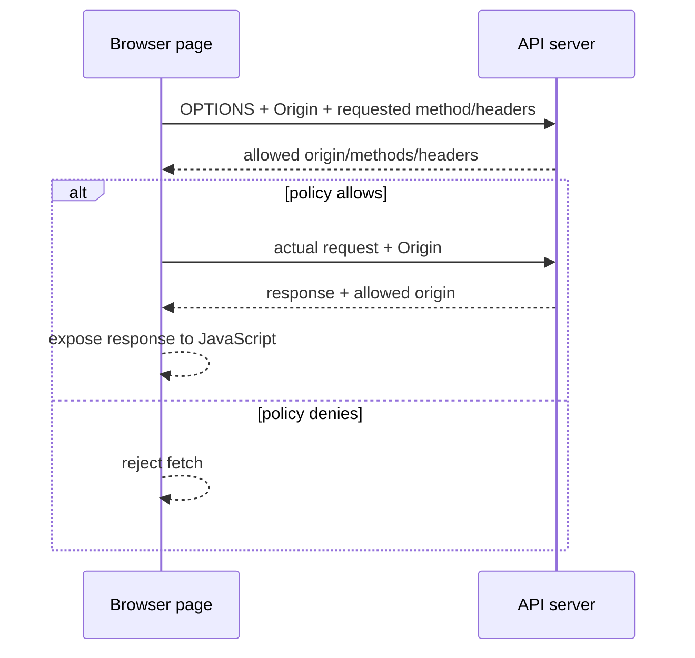

<TLDR>
  <TLDRCell label="what">
    <Term id="cors">Cross-Origin Resource Sharing (CORS)</Term> is a browser-enforced HTTP protocol that lets a server choose which origins' pages may read cross-origin responses.
  </TLDRCell>
  <TLDRCell label="trap">
    CORS is not authentication, authorization, or CSRF protection; a request may reach the server and cause a side effect even when the browser withholds its response from JavaScript.
  </TLDRCell>
  <TLDRCell label="fix">
    Match allowed origins exactly, allow only required methods and headers, send `Vary: Origin` for dynamic origins, and authenticate and authorize independently at the endpoint.
  </TLDRCell>
</TLDR>

## What it is and why it exists

The browser's <Term id="same-origin-policy">same-origin policy</Term> limits scripts in one origin from reading resources in another. An <Term id="origin">origin</Term> consists of a scheme, host, and port; it does not include a path, query, or fragment. `https://app.example.com/a` and `https://app.example.com/b` are same-origin, while a change to the scheme, host, or non-default port creates another origin.

The same-origin policy protects a read boundary inside browsers. Without it, a malicious page could reuse a user's existing login state and read data returned by webmail, banking, or internal applications. Images, form submissions, and some embedding are allowed cross-origin, so “the browser never sends cross-origin requests” is the wrong model.

CORS is the server's controlled relaxation of that read boundary. The browser states the page's origin in a request, the server declares allowed origins, methods, headers, or credential mode in the response, and the browser decides whether to expose the response to the calling script. It does not make the server-side API private, and it does not constrain `curl`, Node.js services, or other non-browser clients.

You encounter CORS when the frontend and API use different schemes, hosts, or ports. A development page at `http://localhost:3000` calling `http://localhost:8080`, or `https://app.example.com` calling `https://api.example.com`, makes a cross-origin request. Cross-site is a separate site-based classification and cannot replace an origin comparison.

## How it works

The browser either sends the actual request directly or first sends a <Term id="preflight-request">preflight request</Term>, depending on the request's shape. On either path, the actual response must pass the CORS check before the script can read it. A `200` status from the server does not mean the browser will expose the response to JavaScript.



### Requests sent directly

“Simple request” is the familiar documentation term; the specification defines this path through CORS-safelisted methods, request headers, and content types. It generally requires all of these conditions:

- The method is `GET`, `HEAD`, or `POST`.
- Author-set request headers are CORS-safelisted; if `Content-Type` is set, its media type is `application/x-www-form-urlencoded`, `multipart/form-data`, or `text/plain`.
- The request has no `ReadableStream` body and no event listener registered on `XMLHttpRequest.upload`.

The browser does not send `OPTIONS` first for such a request. It immediately sends the actual request with `Origin`. If the response lacks a matching `Access-Control-Allow-Origin`, the browser prevents the script from reading it, but the server operation may already have happened. Avoiding a preflight neither makes a request safe nor means there was no cross-origin access.

### Preflight and actual request

Methods, media types, or request headers outside the safelist—commonly `PUT`, `DELETE`, `application/json`, or `Authorization`—usually trigger a preflight. The browser first sends `OPTIONS` with `Origin`, `Access-Control-Request-Method`, and, when needed, `Access-Control-Request-Headers`. This exchange asks whether the subsequent request shape is allowed; it does not perform the business operation.

The server answers the preflight with `Access-Control-Allow-Methods` and `Access-Control-Allow-Headers`. If the policy allows it, the browser sends the actual request, whose response must still carry a matching `Access-Control-Allow-Origin`. A successful preflight never replaces authentication, authorization, input validation, or CSRF protection on the actual endpoint.

### Request and response headers

This table separates the browser's questions from the server's permissions. Application code normally owns the response headers; the browser generates preflight request headers and enforces the result.

| Header | Direction | Meaning |
| --- | --- | --- |
| `Origin` | Request | The serialized origin of the initiating page; it may be the literal value `null` |
| `Access-Control-Request-Method` | Preflight request | The method intended for the actual request |
| `Access-Control-Request-Headers` | Preflight request | Non-safelisted headers intended for the actual request |
| `Access-Control-Allow-Origin` | Response | One explicit allowed origin, or `*` in a non-credentialed case |
| `Access-Control-Allow-Methods` | Preflight response | Actual methods allowed by the preflight policy |
| `Access-Control-Allow-Headers` | Preflight response | Actual request headers allowed by the preflight policy |
| `Access-Control-Allow-Credentials` | Response | With value `true`, permits exposing a credential-mode response to the script |
| `Access-Control-Expose-Headers` | Actual response | Response header names exposed beyond the safelisted response headers |
| `Access-Control-Max-Age` | Preflight response | Seconds for which the browser may cache this preflight permission |

`Access-Control-Allow-Origin` cannot contain a comma-separated list of origins. To support several trusted frontends, match the request's `Origin` exactly against a fixed allowed set and return that one origin. When the response changes with `Origin`, merge rather than overwrite any existing `Vary` values.

### Credentials and cookies

Cross-origin `fetch()` defaults to `credentials: 'same-origin'`, so it does not automatically attach cookies for the target origin. A call that needs cookies must explicitly use `credentials: 'include'`; the server must also return a specific allowed origin and `Access-Control-Allow-Credentials: true`. A credentialed mode cannot use `Access-Control-Allow-Origin: *`.

CORS decides whether a response is readable; it does not decide whether a cookie is eligible to be sent. The cookie's `Domain`, `Path`, `Secure`, and `SameSite` attributes and the browser's third-party-cookie policy still apply. Putting `SameSite=None; Secure` in generated configuration does not prove that a cookie should travel cross-site; that decision needs an explicit session and threat model.

## Examples

### Compare origins

`URL.origin` normalizes default ports, which makes it useful for demonstrating an origin comparison. A production allowlist should still contain complete, pre-reviewed origin strings instead of hostnames alone.

<Depth level="quick">

```javascript run title="origin_tuple.js"
const base = new URL('https://app.example.com/dashboard');

const candidates = [
  'https://app.example.com/settings',
  'http://app.example.com/',
  'https://api.example.com/',
  'https://app.example.com:8443/',
];

for (const candidate of candidates) {
  const target = new URL(candidate);
  console.log(`${target.origin.padEnd(33)} ${target.origin === base.origin}`);
}
```

```text
https://app.example.com           true
http://app.example.com            false
https://api.example.com           false
https://app.example.com:8443      false
```

</Depth>

Changing the path does not change the first origin. The other three entries change the scheme, host, and port respectively, so each result is `false`. The complete comparison also avoids `includes()` and suffix matches with missing label boundaries.

### Build response headers from an allowlist

This function emits read permission only for an exact origin match. Because its response varies with the request's `Origin`, it always declares `Vary: Origin` so a shared cache separates the variants.

```javascript run title="cors_headers.js"
const allowedOrigins = new Set([
  'https://app.example.com',
  'https://admin.example.com',
]);

function corsHeaders(origin, { credentials = false } = {}) {
  const headers = { Vary: 'Origin' };

  if (!origin || !allowedOrigins.has(origin)) return headers;

  headers['Access-Control-Allow-Origin'] = origin;
  if (credentials) {
    headers['Access-Control-Allow-Credentials'] = 'true';
  }
  return headers;
}

for (const [label, origin] of [
  ['allowed', 'https://app.example.com'],
  ['blocked', 'https://evil.example'],
  ['missing', undefined],
]) {
  console.log(label, JSON.stringify(corsHeaders(origin, { credentials: true })));
}
```

```text
allowed {"Vary":"Origin","Access-Control-Allow-Origin":"https://app.example.com","Access-Control-Allow-Credentials":"true"}
blocked {"Vary":"Origin"}
missing {"Vary":"Origin"}
```

An unmatched or missing `Origin` receives no CORS permission. Whether to reject either request itself is a separate server policy; CORS middleware should not masquerade as a business authorization layer.

### Observe a preflight and actual response

This minimal service uses only Node 24's built-in HTTP and `fetch` APIs. The preflight declares `PUT`, `content-type`, and `authorization`, while the actual endpoint independently verifies a demonstration token.

```javascript run title="preflight_server.js"
import { createServer } from 'node:http';
const allowedOrigin = 'https://app.example.com';
const server = createServer((request, response) => {
  if (request.headers.origin === allowedOrigin) {
    response.setHeader('Access-Control-Allow-Origin', allowedOrigin);
    response.setHeader('Vary', 'Origin');
  }
  if (request.method === 'OPTIONS') {
    response.setHeader('Access-Control-Allow-Methods', 'PUT');
    response.setHeader('Access-Control-Allow-Headers', 'content-type, authorization');
    response.setHeader('Access-Control-Max-Age', '600');
    response.writeHead(204).end();
    return;
  }
  if (request.headers.authorization !== 'Bearer demo-token') {
    response.writeHead(401).end('unauthorized');
    return;
  }
  response.writeHead(200, { 'Content-Type': 'application/json' });
  response.end(JSON.stringify({ saved: true }));
});
server.listen(0, '127.0.0.1', async () => {
  const url = `http://127.0.0.1:${server.address().port}/profile`;
  const headers = {
    Origin: allowedOrigin,
    'Access-Control-Request-Method': 'PUT',
    'Access-Control-Request-Headers': 'content-type, authorization',
  };
  const preflight = await fetch(url, { method: 'OPTIONS', headers });
  console.log('preflight', preflight.status);
  console.log('allow-methods', preflight.headers.get('access-control-allow-methods'));
  console.log('allow-headers', preflight.headers.get('access-control-allow-headers'));
  const actual = await fetch(url, {
    method: 'PUT',
    headers: { Origin: allowedOrigin, 'Content-Type': 'application/json', Authorization: 'Bearer demo-token' },
    body: JSON.stringify({ theme: 'dark' }),
  });
  console.log('actual', actual.status, await actual.text());
  server.close();
});
```

```text
preflight 204
allow-methods PUT
allow-headers content-type, authorization
actual 200 {"saved":true}
```

Node's `fetch` does not enforce the browser same-origin policy, so this program constructs and inspects both HTTP exchanges explicitly. It verifies the server protocol, but it cannot replace real-browser tests for allowed origins, denied origins, and credentials.

## Pitfalls

### Treating CORS as server-side authorization

> [!PITFALL]
> Code checks only `Origin` before returning private data, assuming callers outside the allowlist cannot request the API. A non-browser client may set or omit `Origin`, and a same-origin page may still carry attacker-controlled input.

**Fix:** authenticate every endpoint independently, then authorize its principal, action, and resource. CORS is a browser response-sharing policy; an origin allowlist is not a user or service identity list. A simple request may cause a side effect before any read check, so state changes also need CSRF protection.

### Reflecting or loosely matching `Origin`

> [!PITFALL]
> Generated middleware often copies any `Origin` into `Access-Control-Allow-Origin` or uses `includes('example.com')`. That admits attacker origins such as `https://example.com.attacker.invalid`.

**Fix:** use exact set membership against complete serialized origins from configuration, including scheme and port. If the product truly allows a subdomain family, parse the URL and validate its scheme, normalized host, and explicit label boundary; do not guess boundaries with an ad hoc regular expression.

### Making only `OPTIONS` succeed

> [!PITFALL]
> The preflight returns `204`, but the actual response, redirect, or error response has no `Access-Control-Allow-Origin`. The browser then collapses the real server error into what the frontend observes as a CORS failure.

**Fix:** set CORS response headers in a common layer that covers success and error paths, while answering preflight policy before business authentication. Test the preflight, success, authentication failure, validation failure, and server error separately; every actual response faces a browser CORS check.

### Confusing credentials with allowed origins

> [!PITFALL]
> The client sets `credentials: 'include'` while the server returns a wildcard origin, or the server enables `Access-Control-Allow-Credentials` and assumes that this forces the browser to send cookies.

**Fix:** use an exact allowed origin for credentialed mode and return `Access-Control-Allow-Credentials: true`. Separately review cookie attributes, third-party-cookie restrictions, and the client's credentials mode; all are necessary for their respective roles, and none replaces endpoint authorization.

### Forgetting to vary caches by origin

> [!PITFALL]
> The server dynamically reflects a validated origin but omits `Vary: Origin`. A shared cache may reuse headers generated for one origin when serving another, causing an incorrect allow or denial.

**Fix:** when generating `Access-Control-Allow-Origin` dynamically, merge `Origin` into `Vary` and preserve existing dimensions such as `Accept-Encoding`. Test the cache with at least two allowed origins and one denied origin, confirming that cache keys and response headers vary together.

### Testing only with `curl` or Node

> [!PITFALL]
> A command-line request can read the expected response, so the configuration is considered complete. HTTP clients generally do not run the browser CORS algorithm and therefore do not hide a response as a browser would.

**Fix:** use command-line tests to confirm raw headers and status codes, then issue requests from real browser pages at an allowed and a denied origin. Inspect both `OPTIONS` and the actual request in developer tools, and test paths with and without credentials.

<Depth level="deep">

## The response exposure boundary

When a browser enforces CORS, the network exchange and JavaScript's observable result are separate layers. The server may receive the request and return a complete response while the script receives only a rejected `fetch()` promise with limited error information. Developer tools can show a more specific reason, but application code cannot depend on parsing a browser error string to distinguish DNS, TLS, network, and CORS failures.

`mode: 'no-cors'` is not a bypass. It limits available methods and headers to the corresponding safe ranges and gives the script an `opaque` response whose status, headers, and body cannot be read. That is useful for some Web Platform operations that only need to send or cache a resource, not for reading a JSON API.

`Access-Control-Expose-Headers` only enlarges the set of response headers visible to the script. It does not send cookies, authorize a request method, or make a response readable when `Access-Control-Allow-Origin` fails. If the frontend needs a diagnostic header such as `X-Request-ID`, expose it by name rather than confusing it with allowed request headers.

## Preflight and ordinary HTTP caches

Browsers store preflight permission in a dedicated preflight cache, separate from the ordinary HTTP response cache. `Access-Control-Max-Age` gives a lifetime in seconds, but browsers may impose their own cap. When a policy is tightened, an existing permission may survive until its cache entry expires, so choose the value from your policy-change requirements instead of copying a universal “production best” number.

The ordinary response cache solves a different problem. When the server chooses `Access-Control-Allow-Origin` from the request's `Origin`, `Vary: Origin` tells intermediary caches that the header affects the representation. If the response already has `Vary: Accept-Encoding`, the application must append `Origin` instead of accidentally replacing the existing dimension with one `setHeader` call.

A preflight cache key accounts for information such as request URL, origin, credentials mode, method, and headers. Do not build an application-level “preflight optimization” cached only by path, or distinct origins and request shapes may share the wrong permission. Before tuning anything, inspect browser network records to establish which preflights actually repeat, then adjust an explicit server policy.

## `null` and opaque origins

Sandboxed iframes, `file:` documents, and some contexts assigned an opaque origin may serialize `Origin` as the literal value `null`. This is not a JavaScript null value, and it is not a missing `Origin` header. Adding the string `null` to an ordinary allowlist trusts several otherwise unrelated contexts at once.

Deny `null` by default. Allow it only when the product truly depends on a particular opaque-origin context and an unforgeable, independent authentication and authorization boundary also exists. Even then, test sandbox attributes, file-opening behavior, and redirects because they can change how the origin is calculated.

A missing `Origin` does not prove that a request is trusted or internal either. Navigations, older clients, server-to-server calls, and deliberately constructed requests may lack it. If the server must identify a caller, use verified credentials or network identity rather than treating a missing `Origin` as identity evidence.

## CORS, CSRF, and CSP

CORS mainly controls whether a script may read a cross-origin response; CSRF defenses control whether an attacking page can use the user's identity to trigger an unwanted state change. An endpoint accepting a form-encoded `POST` may be submitted cross-site without a preflight. Even when its response is unreadable, a transfer, email change, or logout can still happen. State-changing operations need suitable `SameSite` cookies, CSRF tokens, Origin or Referer validation, and sound idempotency and authorization boundaries.

Content Security Policy (CSP) `connect-src` restricts the destinations a page's scripts may contact. It can reduce outbound reach after script injection, but it does not declare whether other pages may read your API. The API's CORS policy, the page's CSP, and the endpoint's authentication and authorization govern different directions and should be configured and tested separately.

Same-site is not the same as same-origin. `https://app.example.com` and `https://api.example.com` are normally same-site but cross-origin, so reading with Fetch requires CORS while cookie `SameSite` calculations may still treat them as same-site. A threat model should write down origin, site, and credential boundaries separately instead of replacing exact rules with “the domain is the same.”

## Policy ownership across deployment layers

CORS headers may be added by a CDN, reverse proxy, API gateway, framework middleware, or endpoint code, but one layer should clearly own them for a response. If two layers write them, the result may contain two `Access-Control-Allow-Origin` fields or a comma-combined value; neither is a valid way to grant several origins. Diagnose the final response received by the browser, not only the headers the application process intended to send.

Central middleware works well for a default policy shared by most routes. Public resources, cookie-backed account APIs, and server-only admin endpoints need explicit overrides or groups when their requirements differ, rather than behavior that depends accidentally on route-registration order. Policy code must also separate “do not grant browser read access” from “reject the HTTP request.”

A small policy matrix makes the boundary reviewable. Each row should come from product requirements and a threat model instead of enabling everything first and waiting for the frontend to report what can be removed.

| Route class | Origins | Credentials | Methods | Exposed headers |
| --- | --- | --- | --- | --- |
| Public immutable asset | `*` | no | `GET`, `HEAD` | none |
| Account API | exact app origin | yes | route-specific | `X-Request-ID` |
| Partner API | exact partner origins | policy-specific | contract-specific | contract-specific |
| Server-only admin API | none | not applicable | no browser contract | none |

“None” in the table means no CORS permission is published; it does not mean the server may omit authentication. Even when the public row uses `*`, separate data classification must establish that any site's script may read the data. The partner row must not copy arbitrary customer-supplied domains into configuration without review.

### Redirects and error chains

A cross-origin request may encounter an HTTP redirect, authentication redirect, or gateway error page. Browser behavior along the chain depends on the requests and responses, and the final resource must still satisfy CORS; redirecting an API `401` to an HTML login page commonly gives `fetch()` an opaque failure that is hard to diagnose. An API should return a machine-readable `401` or `403` and preserve the appropriate CORS headers on error responses for allowed origins.

Infrastructure-generated responses such as `413`, `429`, and `502` may bypass application middleware. If the frontend at an allowed origin must read their status and request identifier, the CORS policy needs to cover these errors without exposing every internal diagnostic header. Deployment verification should deliberately trigger each important failure layer, not only a healthy route.

The preflight itself can be intercepted by automatic `OPTIONS` routing, authentication plugins, or a web application firewall. The final owner must verify that the response expresses the target route's minimal policy and that `OPTIONS` performs no write. Seeing `204` proves only that something answered, not that the permission headers are correct.

### Browser regression matrix

A maintainable test set changes one dimension while holding the others steady. When a check fails, this separates origin, method, header, credential, cache, and endpoint-security failures instead of labeling everything “CORS error.”

- From two explicitly allowed origins, test direct and preflighted requests and verify that each receives its one allowed origin.
- From a similar but denied origin, test a different scheme, a sibling subdomain, and a different port.
- On one route, use a safelisted method and a preflighted method and confirm that business authorization has the same outcome.
- Test no cookie, a valid cookie, an expired cookie, and a browser policy that blocks third-party cookies.
- Repeat requests across two origins and verify that neither the ordinary cache nor preflight cache crosses permissions.
- Trigger `400`, `401`, `403`, `404`, `429`, and `500` paths and confirm that the frontend sees only intentionally exposed information.

The test pages must actually run on different origins; changing an `Origin` request header does not simulate the browser security model. Browser automation can assert whether the script receives a response, while server logs show whether the request arrived and security controls ran. Together, those observations distinguish “prevent the read” from “prevent the operation.”

### Policy changes and rollback

An origin allowlist is a security configuration change and deserves the same review as a route or permission change. When adding an origin, confirm its owner, scheme, port, data scope, and credential requirements; when removing one, account for old permission in preflight caches. Do not temporarily change production to `*` for diagnosis and rely on someone remembering to restore it.

During a gradual rollout, you can record unmatched browser origins, but logs must bound and escape the untrusted value. Observations may reveal a missed legitimate client; they must not enroll every observed origin automatically. The rollback plan should cover both gateway and application configuration so one layer does not remain open after the other is tightened.

### Treat configuration as code

The allowlist should have explicit environment boundaries and a review trail. Localhost origins for development must not flow into production through an empty environment variable's default, and temporary preview domains should not use an unrestricted wildcard pattern. Fail closed when configuration cannot be parsed, with a startup error operators can diagnose.

At minimum, change tests should prove these facts:

- Every configuration value parses as an origin containing only a scheme, host, and port.
- Duplicate entries and default-port normalization cannot produce conflicting responses.
- An empty list, missing variable, or malformed URL never turns into allow-all behavior.
- Route overrides cannot widen their parent policy or bypass independent authorization.

Put these assertions in configuration-loading tests and browser integration tests. The former validates policy data quickly; the latter validates final behavior after proxies, caches, and frameworks. Neither can replace the other.

</Depth>

<Checkpoint id="security/cors" />

## Further reading

- [MDN: Cross-Origin Resource Sharing (CORS)](https://developer.mozilla.org/en-US/docs/Web/HTTP/Guides/CORS)
- [MDN: Same-origin policy](https://developer.mozilla.org/en-US/docs/Web/Security/Defenses/Same-origin_policy)
- [MDN: `Access-Control-Allow-Origin`](https://developer.mozilla.org/en-US/docs/Web/HTTP/Reference/Headers/Access-Control-Allow-Origin)
- [MDN: `Vary`](https://developer.mozilla.org/en-US/docs/Web/HTTP/Reference/Headers/Vary)
