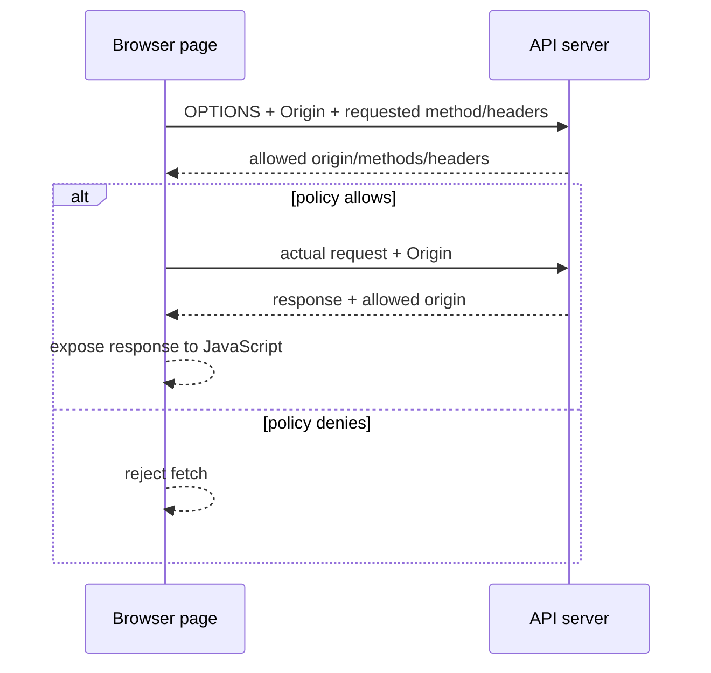

<TLDR>
  <TLDRCell label="what">
    <Term id="cors">CORS（跨源资源共享）</Term>是一套由浏览器执行的 HTTP 协议，让服务器决定哪些源的页面可以读取跨源响应。
  </TLDRCell>
  <TLDRCell label="trap">
    CORS 不是身份认证、授权或 CSRF 防护；即使浏览器不把响应交给 JavaScript，请求也可能已经到达服务器并产生副作用。
  </TLDRCell>
  <TLDRCell label="fix">
    精确匹配允许的源，只开放需要的方法与请求头，动态返回源时设置 `Vary: Origin`，并在业务端点独立完成认证与授权。
  </TLDRCell>
</TLDR>

## 是什么，为什么存在

浏览器的<Term id="same-origin-policy">同源策略（same-origin policy）</Term>限制一个源中的脚本读取另一个源的资源。这里的<Term id="origin">源（origin）</Term>由协议、主机和端口组成，不包含路径、查询参数或片段。`https://app.example.com/a` 与 `https://app.example.com/b` 同源，而协议、主机或非默认端口中的任意一项变化都会形成另一个源。

同源策略保护的是浏览器中的读取边界。没有这条边界，恶意页面就能借用用户已有的登录状态，读取邮箱、网银或内部系统返回的数据。图片、表单提交和某些嵌入行为可以跨源发生，因此“浏览器完全不发送跨源请求”并不是正确模型。

CORS 是服务器对这条读取边界的受控放宽。浏览器在请求中说明页面的源，服务器在响应中声明允许的源、方法、请求头或凭证模式，浏览器再决定是否把响应暴露给调用脚本。它不会让服务端 API 本身变得私有，也不会约束 `curl`、Node.js 服务或其他非浏览器客户端。

当前端与 API 位于不同协议、主机或端口时，你会遇到 CORS。例如，本地开发页面 `http://localhost:3000` 调用 `http://localhost:8080`，或者 `https://app.example.com` 调用 `https://api.example.com`，都是跨源请求。是否跨站（cross-site）是另一套基于站点的判断，不能代替源比较。

## 工作原理

浏览器根据请求形状选择直接发送实际请求，或先发送一个<Term id="preflight-request">预检请求（preflight request）</Term>。无论走哪条路径，实际响应都必须满足 CORS 检查，脚本才能读取它。服务器返回状态码 `200` 并不等于浏览器会把响应交给 JavaScript。



### 直接发送的请求

“简单请求”是文档中常用的叫法，规范按 CORS-safelisted method、request-header 和 content type 定义这条路径。它通常同时满足以下条件：

- 方法是 `GET`、`HEAD` 或 `POST`。
- 作者设置的请求头均在 CORS 安全列表内；若设置 `Content-Type`，媒体类型是 `application/x-www-form-urlencoded`、`multipart/form-data` 或 `text/plain` 之一。
- 请求不使用 `ReadableStream` 作为主体，也没有给 `XMLHttpRequest.upload` 注册事件监听器。

浏览器不会为这种请求先发 `OPTIONS`，而是直接带上 `Origin` 发送实际请求。响应缺少匹配的 `Access-Control-Allow-Origin` 时，浏览器阻止脚本读取响应，但服务端操作可能已经执行。因此，能避开预检不代表请求安全，也不能用“没有预检”推断“没有跨源访问”。

### 预检与实际请求

`PUT`、`DELETE`、`application/json` 或 `Authorization` 等不在安全列表内的方法、媒体类型或请求头，通常会触发预检。浏览器先发送 `OPTIONS`，其中包含 `Origin`、`Access-Control-Request-Method`，以及需要时的 `Access-Control-Request-Headers`。这一步询问的是后续请求形状是否被策略允许，不是在执行业务操作。

服务器用 `Access-Control-Allow-Methods` 和 `Access-Control-Allow-Headers` 回答预检。允许后，浏览器才发送实际请求；实际响应仍要返回匹配的 `Access-Control-Allow-Origin`。预检成功不能代替实际端点的身份认证、权限检查、输入校验或 CSRF 防护。

### 请求头与响应头

下表区分浏览器提出的问题与服务器给出的许可。应用代码通常只负责响应头；浏览器负责生成预检请求头并执行结果。

| Header | Direction | Meaning |
| --- | --- | --- |
| `Origin` | Request | 发起页面的序列化源；也可能是字面值 `null` |
| `Access-Control-Request-Method` | Preflight request | 实际请求准备使用的方法 |
| `Access-Control-Request-Headers` | Preflight request | 实际请求准备携带的非安全列表请求头 |
| `Access-Control-Allow-Origin` | Response | 一个明确的允许源，或者在无凭证场景使用 `*` |
| `Access-Control-Allow-Methods` | Preflight response | 预检允许的实际方法 |
| `Access-Control-Allow-Headers` | Preflight response | 预检允许的实际请求头 |
| `Access-Control-Allow-Credentials` | Response | 值为 `true` 时，允许浏览器向脚本暴露凭证模式请求的响应 |
| `Access-Control-Expose-Headers` | Actual response | 除安全列表响应头外，额外允许脚本读取的响应头名称 |
| `Access-Control-Max-Age` | Preflight response | 浏览器可缓存这次预检许可的秒数 |

`Access-Control-Allow-Origin` 不能用逗号列出多个源。支持多个可信前端时，服务器应从固定允许集合中精确匹配请求的 `Origin`，再返回这一个源。响应随 `Origin` 改变时，还要合并而不是覆盖已有的 `Vary` 值。

### 凭证与 Cookie

跨源 `fetch()` 默认使用 `credentials: 'same-origin'`，因此不会自动附带目标源的 Cookie。需要 Cookie 的调用要显式使用 `credentials: 'include'`；服务端还必须返回具体的允许源和 `Access-Control-Allow-Credentials: true`。凭证模式下不能用 `Access-Control-Allow-Origin: *`。

CORS 只决定响应是否可读，不决定 Cookie 是否有资格发送。Cookie 的 `Domain`、`Path`、`Secure`、`SameSite` 属性和浏览器第三方 Cookie 策略仍然生效。把 `SameSite=None; Secure` 写进配置也不会自动证明该 Cookie 应该跨站发送；这必须来自明确的会话与威胁模型。

## 示例

### 判断是否同源

`URL.origin` 会把默认端口规范化，适合演示源比较。生产端的允许列表仍应保存完整、预先审查过的源字符串，而不是只比较主机名。

<Depth level="quick">

```javascript run title="origin_tuple.js"
const base = new URL('https://app.example.com/dashboard');

const candidates = [
  'https://app.example.com/settings',
  'http://app.example.com/',
  'https://api.example.com/',
  'https://app.example.com:8443/',
];

for (const candidate of candidates) {
  const target = new URL(candidate);
  console.log(`${target.origin.padEnd(33)} ${target.origin === base.origin}`);
}
```

```text
https://app.example.com           true
http://app.example.com            false
https://api.example.com           false
https://app.example.com:8443      false
```

</Depth>

路径变化没有改变第一项的源。其余三项分别改变了协议、主机和端口，所以结果都是 `false`。这种完整比较也避免了 `includes()` 或未经边界处理的后缀匹配。

### 从允许集合生成响应头

下面的函数只为精确命中的源发出读取许可。因为响应内容会随请求的 `Origin` 改变，它始终声明 `Vary: Origin`，让共享缓存把不同源的变体分开。

```javascript run title="cors_headers.js"
const allowedOrigins = new Set([
  'https://app.example.com',
  'https://admin.example.com',
]);

function corsHeaders(origin, { credentials = false } = {}) {
  const headers = { Vary: 'Origin' };

  if (!origin || !allowedOrigins.has(origin)) return headers;

  headers['Access-Control-Allow-Origin'] = origin;
  if (credentials) {
    headers['Access-Control-Allow-Credentials'] = 'true';
  }
  return headers;
}

for (const [label, origin] of [
  ['allowed', 'https://app.example.com'],
  ['blocked', 'https://evil.example'],
  ['missing', undefined],
]) {
  console.log(label, JSON.stringify(corsHeaders(origin, { credentials: true })));
}
```

```text
allowed {"Vary":"Origin","Access-Control-Allow-Origin":"https://app.example.com","Access-Control-Allow-Credentials":"true"}
blocked {"Vary":"Origin"}
missing {"Vary":"Origin"}
```

未命中和没有 `Origin` 的请求不会得到 CORS 许可。是否拒绝这两个请求本身是另一项服务端策略；CORS 中间件不应被误当成业务授权器。

### 观察预检与实际响应

这个最小服务只依赖 Node 24 的内置 HTTP 与 `fetch` API。预检声明 `PUT`、`content-type` 和 `authorization`，实际端点仍独立检查演示令牌。

```javascript run title="preflight_server.js"
import { createServer } from 'node:http';
const allowedOrigin = 'https://app.example.com';
const server = createServer((request, response) => {
  if (request.headers.origin === allowedOrigin) {
    response.setHeader('Access-Control-Allow-Origin', allowedOrigin);
    response.setHeader('Vary', 'Origin');
  }
  if (request.method === 'OPTIONS') {
    response.setHeader('Access-Control-Allow-Methods', 'PUT');
    response.setHeader('Access-Control-Allow-Headers', 'content-type, authorization');
    response.setHeader('Access-Control-Max-Age', '600');
    response.writeHead(204).end();
    return;
  }
  if (request.headers.authorization !== 'Bearer demo-token') {
    response.writeHead(401).end('unauthorized');
    return;
  }
  response.writeHead(200, { 'Content-Type': 'application/json' });
  response.end(JSON.stringify({ saved: true }));
});
server.listen(0, '127.0.0.1', async () => {
  const url = `http://127.0.0.1:${server.address().port}/profile`;
  const headers = {
    Origin: allowedOrigin,
    'Access-Control-Request-Method': 'PUT',
    'Access-Control-Request-Headers': 'content-type, authorization',
  };
  const preflight = await fetch(url, { method: 'OPTIONS', headers });
  console.log('preflight', preflight.status);
  console.log('allow-methods', preflight.headers.get('access-control-allow-methods'));
  console.log('allow-headers', preflight.headers.get('access-control-allow-headers'));
  const actual = await fetch(url, {
    method: 'PUT',
    headers: { Origin: allowedOrigin, 'Content-Type': 'application/json', Authorization: 'Bearer demo-token' },
    body: JSON.stringify({ theme: 'dark' }),
  });
  console.log('actual', actual.status, await actual.text());
  server.close();
});
```

```text
preflight 204
allow-methods PUT
allow-headers content-type, authorization
actual 200 {"saved":true}
```

Node 的 `fetch` 不执行浏览器同源策略，所以这里显式构造并检查两次 HTTP 交换。它能验证服务端协议，但不能替代真实浏览器中的允许源、拒绝源和凭证测试。

## 陷阱

### 把 CORS 当成服务端授权

> [!PITFALL]
> 代码只检查 `Origin` 就返回私有数据，假定不在允许列表中的调用者无法请求 API。非浏览器客户端可以自行设置或省略 `Origin`，同源页面也可能由攻击者控制输入。

**修复方法：** 对每个端点独立验证身份，并按主体、动作和资源执行授权。CORS 只是浏览器响应共享策略；允许源列表不是用户或服务身份列表。简单请求可能先产生副作用，因此状态变更还需要 CSRF 防护。

### 反射或模糊匹配 `Origin`

> [!PITFALL]
> 生成的中间件常把任意 `Origin` 原样写入 `Access-Control-Allow-Origin`，或者使用 `includes('example.com')`。这会允许攻击者的源，例如 `https://example.com.attacker.invalid`。

**修复方法：** 用配置中的完整序列化源做精确集合匹配，包括协议和端口。若业务确实允许一组子域，应先解析 URL，再验证协议、规范化主机和明确的标签边界；不要用一段临时正则表达式猜边界。

### 只让 `OPTIONS` 返回成功

> [!PITFALL]
> 预检得到 `204` 后，实际响应、重定向或错误响应却没有 `Access-Control-Allow-Origin`。浏览器于是把真实服务端错误折叠成前端看到的 CORS 失败。

**修复方法：** 在能覆盖成功与错误路径的统一层设置 CORS 响应头，同时让预检在业务认证之前回答策略。然后分别测试预检、成功响应、认证失败、验证失败和服务器错误；每条实际响应都要接受浏览器检查。

### 混淆凭证与允许源

> [!PITFALL]
> 客户端设置了 `credentials: 'include'`，服务端仍返回通配符源；或者服务端打开 `Access-Control-Allow-Credentials`，却以为它能强制浏览器发送 Cookie。

**修复方法：** 凭证模式使用精确允许源，并返回 `Access-Control-Allow-Credentials: true`。另外单独审查 Cookie 属性、第三方 Cookie 限制和客户端的 credentials mode；这些条件缺一不可，但任何一项都不代替端点授权。

### 忘记缓存按源区分

> [!PITFALL]
> 服务端动态反射已验证的源，却不返回 `Vary: Origin`。共享缓存可能把为一个源生成的响应头复用于另一个源，造成错误放行或错误阻止。

**修复方法：** 动态生成 `Access-Control-Allow-Origin` 时合并 `Origin` 到 `Vary`，保留已有的 `Accept-Encoding` 等维度。缓存配置也要用至少两个允许源和一个拒绝源测试，确认缓存键与响应头一起变化。

### 只用 `curl` 或 Node 测试

> [!PITFALL]
> 命令行请求能看到正确响应，就被当作 CORS 已通过。HTTP 客户端通常不执行浏览器 CORS 算法，因此也不会像浏览器一样隐藏响应。

**修复方法：** 命令行测试用于确认原始头与状态码，再用真实浏览器页面从允许源和拒绝源发起请求。开发者工具中同时检查 `OPTIONS` 与实际请求，并测试携带凭证和不携带凭证的路径。

<Depth level="deep">

## 浏览器暴露响应的边界

浏览器执行 CORS 时，网络交换与 JavaScript 可观察结果是两层。服务端可能收到请求并完整返回响应，但脚本只得到被拒绝的 `fetch()` Promise 和有限的错误信息。开发者工具能显示更具体的原因，应用代码却不能依靠解析某条浏览器错误文案来区分 DNS、TLS、网络与 CORS 失败。

`mode: 'no-cors'` 不是绕过方式。它把可用的方法和请求头限制在相应安全范围内，并让脚本得到 `opaque` 响应；脚本不能读取状态、响应头或主体。它适合某些只需发送或缓存的 Web 平台场景，不适合读取 JSON API。

`Access-Control-Expose-Headers` 只扩大脚本可读取的响应头集合。它不会发送 Cookie，不会授权请求方法，也不会让未通过 `Access-Control-Allow-Origin` 的响应变得可读。需要前端读取 `X-Request-ID` 等诊断头时，应逐项暴露，而不是把它与允许请求头混为一谈。

## 预检缓存与普通 HTTP 缓存

浏览器把预检许可放在专用的预检缓存中，它与普通 HTTP 响应缓存分开。`Access-Control-Max-Age` 给出许可可复用的秒数，但浏览器可以设置自己的上限。策略收紧后，已有许可可能持续到缓存项失效，因此取值应结合变更响应要求，而不是照抄一个“生产最佳值”。

普通响应缓存解决的是另一件事。当服务端根据请求 `Origin` 选择 `Access-Control-Allow-Origin` 时，`Vary: Origin` 告诉中间缓存该头会影响表示。若响应原本已有 `Vary: Accept-Encoding`，应用必须追加 `Origin`，不能用一次 `setHeader` 无意覆盖现有维度。

预检缓存键会考虑请求 URL、源、credentials mode、方法和请求头等信息。不要在应用层自己实现一个只按路径缓存的“预检优化”，否则不同源或不同请求形状可能共享错误许可。需要优化时，先从浏览器网络记录确认哪些预检实际重复，再调整明确的服务端策略。

## `null` 源与不透明源

沙箱化 iframe、`file:` 文档和某些以不透明源处理的上下文，可能把 `Origin` 序列化为字面值 `null`。这不是 JavaScript 的空值，也不是“没有 Origin 头”。把字符串 `null` 加入普通允许列表，会同时信任多种彼此无关的上下文。

默认应拒绝 `null`。只有当产品确实依赖某个不透明源上下文，且还有不可伪造的独立认证与授权边界时，才为其设计狭窄流程。即使如此，也要测试沙箱属性、文件打开方式和重定向，因为它们可能改变源的计算结果。

没有 `Origin` 的请求也不等于可信内部请求。导航、旧客户端、服务器间调用或主动构造的请求都可能没有该头。服务端若需要区分调用方，应使用经过验证的凭据或网络身份，而不是把缺失 `Origin` 当作身份信号。

## CORS、CSRF 与 CSP

CORS 主要控制脚本能否读取跨源响应，CSRF 防护控制攻击页面能否借用户身份触发不希望发生的状态变更。一个接受表单编码 `POST` 的端点可能在没有预检的情况下被跨站提交；即使响应不可读，转账、改邮箱或退出登录仍可能发生。状态变更应使用合适的 `SameSite` Cookie、CSRF token、Origin 或 Referer 校验，并保持幂等与授权边界。

内容安全策略（CSP）的 `connect-src` 从页面一侧限制脚本可以连接的目标。它能减少页面被注入脚本后的外连范围，但不会声明其他页面能否读取你的 API。API 的 CORS 策略、页面的 CSP 和端点的认证授权解决不同方向的问题，应分别配置与测试。

“同站”也不等于“同源”。`https://app.example.com` 与 `https://api.example.com` 通常同站但跨源，所以 Fetch 读取需要 CORS，而 Cookie 的 `SameSite` 判断可能仍把它们视为同站。威胁模型必须分别写出 origin、site 和 credential 的边界，避免用“域名一样”替代精确规则。

## 跨部署层的策略所有权

CORS 头可以由 CDN、反向代理、API 网关、框架中间件或端点代码添加，但同一响应应有一个明确所有者。两层同时写头时，可能生成两个 `Access-Control-Allow-Origin` 字段或逗号合并的值；这两种结果都不是合法的多源许可。排查时应查看浏览器实际收到的最终响应，而不只看应用进程准备发送的头。

集中式中间件适合表达大多数路由共享的默认策略。公开资源、带 Cookie 的账户 API 和仅供服务器调用的管理端点若有不同要求，应显式覆盖或分组，而不是由路由注册顺序偶然决定。策略代码还要区分“不给浏览器读取许可”和“拒绝 HTTP 请求”这两个动作。

一个小型策略矩阵能让评审看到边界。每行应来自产品需求与威胁模型，而不是先把所有能力打开，再等待前端报告哪些可以删除。

| Route class | Origins | Credentials | Methods | Exposed headers |
| --- | --- | --- | --- | --- |
| Public immutable asset | `*` | no | `GET`, `HEAD` | none |
| Account API | exact app origin | yes | route-specific | `X-Request-ID` |
| Partner API | exact partner origins | policy-specific | contract-specific | contract-specific |
| Server-only admin API | none | not applicable | no browser contract | none |

表中的 “none” 表示不发布 CORS 许可，不表示服务器可以省略认证。即使 public 行使用 `*`，数据是否真的适合向任意网站脚本公开，仍要经过单独的数据分类。partner 行也不能把客户提供的任意域名未经审核直接写入配置。

### 重定向与错误链

跨源请求可能经过 HTTP 重定向、认证跳转或网关错误页。链上的浏览器行为取决于请求与响应，最终资源仍必须满足 CORS；把 API 的 `401` 重定向到 HTML 登录页，往往只会给 `fetch()` 制造难以诊断的失败。API 更适合返回机器可读的 `401` 或 `403`，并在允许源的错误响应上保留相应 CORS 头。

网关生成的 `413`、`429`、`502` 等响应可能绕过应用中间件。若允许源上的前端需要读取状态与请求标识，CORS 策略必须覆盖这些基础设施错误，同时不能把内部诊断头全部暴露。部署验证应主动触发每个重要失败层，而不只测试正常路由。

预检本身也可能被路由器的自动 `OPTIONS`、认证插件或 Web 应用防火墙截获。最终责任人应确认返回的是目标路由的最小策略，并且 `OPTIONS` 不执行写操作。观察到 `204` 只能证明请求得到了响应，不能证明许可头正确。

### 浏览器回归矩阵

一组可维护的测试应改变一个维度并保留其他条件。这样失败时能判断是源、方法、请求头、凭证、缓存还是端点安全控制造成的，而不是把所有失败都标成 “CORS error”。

- 从两个明确允许源分别测试直接请求与预检请求，并核对各自返回的单一允许源。
- 从一个相似但未允许的源测试，例如不同协议、相邻子域和不同端口。
- 对同一路由分别使用安全列表方法与需要预检的方法，确认业务授权结果保持一致。
- 分别测试无 Cookie、有效 Cookie、过期 Cookie 和浏览器阻止第三方 Cookie 的行为。
- 在两个源之间重复请求，检查普通缓存与预检缓存没有串用许可。
- 触发 `400`、`401`、`403`、`404`、`429` 和 `500` 路径，确认前端只看到计划暴露的信息。

测试页面必须真正运行在不同源上，仅修改请求中的 `Origin` 头不能模拟浏览器安全模型。自动化浏览器可以断言脚本是否得到响应，服务端日志则用于确认请求是否到达以及安全控制是否执行。两类证据合在一起，才能区分“阻止读取”和“阻止操作”。

### 策略变更与回滚

允许源是一项安全配置变更，应像路由或权限变更一样评审。新增源时要确认其所有者、协议、端口、数据范围与凭证需求；删除源时则要考虑预检缓存中的旧许可。不能为了临时排障把生产策略改成 `*`，再依赖人工记得恢复。

渐进发布时，可以先记录未命中的浏览器源，但日志必须限制长度并转义不可信值。观测结果用于发现遗漏的合法客户端，不应自动把出现过的源加入允许列表。回滚计划还要覆盖网关与应用两个配置面，避免一层已经收紧，另一层仍旧开放。

### 把配置当作代码

允许列表应有明确的环境边界与代码评审记录。开发用的 localhost 源不应通过空环境变量的默认值流入生产，临时预览域名也不应使用无限制通配模式。配置解析失败时采用关闭默认值，并给运维人员一个可诊断的启动错误。

变更测试至少要证明以下事实：

- 每个配置值都能解析为只含协议、主机和端口的源。
- 重复值和默认端口规范化不会生成冲突响应。
- 空列表、缺失变量和畸形 URL 不会变成允许全部来源。
- 路由覆盖不会扩大父级策略，也不会绕开独立授权。

把这些断言放在配置加载测试和浏览器集成测试中。前者快速验证策略数据，后者验证经过代理、缓存和框架后的最终行为；两者不能互相替代。

</Depth>

<Checkpoint id="security/cors" />

## 延伸阅读

- [MDN：跨源资源共享（CORS）](https://developer.mozilla.org/en-US/docs/Web/HTTP/Guides/CORS)
- [MDN：同源策略](https://developer.mozilla.org/en-US/docs/Web/Security/Defenses/Same-origin_policy)
- [MDN：`Access-Control-Allow-Origin`](https://developer.mozilla.org/en-US/docs/Web/HTTP/Reference/Headers/Access-Control-Allow-Origin)
- [MDN：`Vary`](https://developer.mozilla.org/en-US/docs/Web/HTTP/Reference/Headers/Vary)
